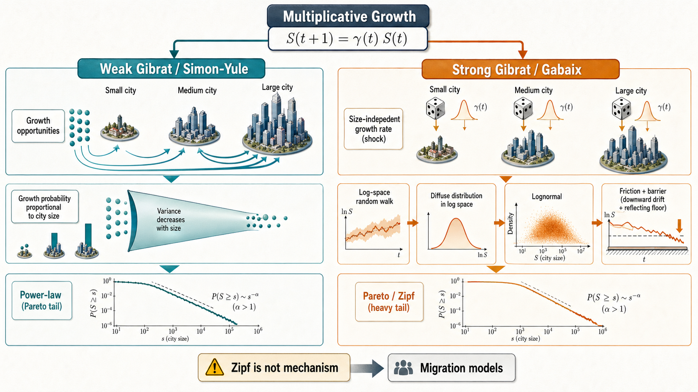

# Statistics and Dynamics of Urban Populations, Chapter 6：Stochastic Models of Growth

## 精读笔记

---

## 一、这一章在动力学模块里的位置

Chapter 5 先建立了 SDE、Itô/Stratonovich、Fokker-Planck equation 的技术语言。Chapter 6 开始把这些语言放回城市增长模型。

这一章的问题不是“城市为什么增长”，而是一个更窄的数学问题：如果城市人口按比例随机增长，什么条件下城市规模分布会变成 power-law，尤其会不会变成 Zipf's law？

作者把历史上的模型分成两条线：

1. **Simon-based / weak Gibrat models**：获得一个新增 individual 的绝对概率和城市规模成比例，所以大城市更容易发生“人口加一”的增长事件；但按比例计算的平均增长率可以不依赖城市规模，而增长率方差会随规模变小。这类模型可以生成 power-law。
2. **Gibrat-based / strong Gibrat models**：增长率本身和城市规模无关，均值和方差都不依赖 $S_i$。这种模型本身只生成 lognormal，不生成稳定的 power-law；要得到 Zipf，需要额外加入 friction、negative drift 或 reflective barrier。

所以这一章的主线可以写成：

$$
\text{multiplicative growth}
\rightarrow
\text{preferential attachment}
\rightarrow
\text{power-law generation}
\rightarrow
\text{Gibrat/lognormal failure}
\rightarrow
\text{friction/barrier correction}
\rightarrow
\text{Gabaix model}
\rightarrow
\text{limitations and need for migration-based dynamics}.
$$

这一章的核心批判也很重要：很多增长模型不是从城市机制出发，而是为了复现 Zipf's law 而设计。可是 Chapter 3 已经说明 Zipf's law 并不普遍，因此“能生成 Zipf”不能再作为模型有效性的充分理由。

### 1.1 书中图表在笔记里的位置

这一章原书里真正承担解释功能的图表有四个，笔记里都已经处理：

1. **Fig. 6.1** 已插入在 Yule 模型之后。它解释两个机制：城市内部 individual 以概率 $p$ 增殖，既有城市以概率 $q$ 生成新城市。它对应 Eq. 6.2 和 Eq. 6.9，是理解 Yule power-law 的机制图。
2. **Table 6.1** 没有作为图片插入，而是转成了 Markdown 表格。它的作用是说明 Yule-Simon、Barabasi-Albert、Bose-Einstein、Galton-Watson 这些模型在词汇层面同构：不同领域里的 “city / individual” 其实是同一种 preferential attachment 结构。
3. **Fig. 6.2** 已插入在 Simon 模型局限部分。它说明 $\alpha\to0$ 时 convergence time 变长，$\alpha=0$ 时不能收敛到 power-law。它支撑 Krugman 对 Simon 模型的批评。
4. **Fig. 6.3** 已插入在 Gabaix 对 Simon 批评之后。它展示法国城市增长率标准差随人口规模下降，$\sigma(S)\propto S^{-\beta}$ 且 $\beta\simeq0.2<1$。它的作用是说明经验数据既不完全支持 Simon 的强 size-dependent variance，也不完全支持 strong Gibrat 的 size-independent variance。

所以，原书图表已经进入笔记；但它们目前是按原章节分散解释。为了帮助记忆 weak Gibrat 和 strong Gibrat 的分叉关系，适合再生成一张独立的 image2 概念图。

### 1.2 Image2 可视化：weak Gibrat 与 strong Gibrat 的分叉

这组内容适合画成一张左右分叉的机制图，而不是普通流程图。中心放同一个出发式：

$$
S_i(t+1)=\gamma_i(t)S_i(t).
$$

然后向左右分成两条路线。

左侧是 **Simon-based / weak Gibrat**：

$$
\text{growth-event probability}\propto S_i
\rightarrow
\text{preferential attachment}
\rightarrow
\text{large cities receive additions more often}
\rightarrow
\mathbb{E}[\Delta S_i/S_i]\ \text{size-independent}
\rightarrow
\operatorname{Var}(\gamma_i)\downarrow \text{ with }S_i
\rightarrow
\text{power-law}.
$$

这条线的视觉对象应该是：大小不同的城市节点、更多箭头流向大城市、一个随城市规模变窄的 variance funnel，最后变成一条 Pareto tail。

右侧是 **Gibrat-based / strong Gibrat**：

$$
\gamma_i(t)\perp S_i
\rightarrow
\text{same growth-rate distribution for all sizes}
\rightarrow
\log S \text{ random walk}
\rightarrow
\text{lognormal cloud}
\rightarrow
\text{needs friction/barrier}
\rightarrow
\text{Pareto/Zipf}.
$$

这条线的视觉对象应该是：不同大小城市上方放同样的 growth-rate dice，随后进入 log-space diffusion cloud；如果没有 barrier，云团继续扩散；加入 negative drift 和 reflective lower barrier 后，才压成 Pareto tail。

这张图的核心记忆点是：**weak Gibrat 里，大城市更容易发生绝对增长事件，但平均相对增长率仍可与规模无关；差别在于增长率方差随规模变小。strong Gibrat 则要求增长率分布本身独立于规模，但它本身只生成 lognormal，要得到 Zipf 必须额外加 friction。**

---

## 二、基本出发点：multiplicative growth

城市人口增长的最基本事实是：人口变化通常更像比例变化，而不是绝对变化。一个 1000 万人的城市每年增加 1% 是 10 万人；一个 10 万人的城市每年增加 1% 是 1000 人。增长率相似时，绝对增量会随城市规模放大。

这就是 multiplicative growth 的含义。离散时间里，城市 $i$ 的人口满足

$$
S_i(t+1)=\gamma_i(t)S_i(t). \tag{6.1}
$$

这里 $S_i(t)$ 是城市人口，$\gamma_i(t)$ 是随机增长因子。如果 $\gamma_i(t)>1$，城市增长；如果 $\gamma_i(t)<1$，城市缩小。

这条式子看起来简单，但它已经包含三个关键假设：

1. 增长是按比例作用在现有人口上的。
2. 城市的未来规模依赖当前规模，因此过程有记忆。
3. 随机性进入增长因子 $\gamma_i(t)$，而不是作为一个固定大小的加法噪声进入。

作者接下来比较两种对 $\gamma_i(t)$ 的理解。

第一种是 weak Gibrat。这里要区分两个层次：绝对增长事件的发生概率可以随城市规模增加，因为大城市有更多 individual；但除以城市规模之后，平均相对增长率可以不依赖城市规模。它之所以是 weak Gibrat，是因为增长率方差仍然依赖城市规模。Simon/Yule 这类 preferential attachment 模型属于这里。

第二种是 strong Gibrat。增长因子的完整分布都不依赖城市规模，特别是方差也不依赖城市规模。Gibrat law 和 Gabaix model 属于这里。

这个区分会贯穿全章。它决定了模型是否自然产生 power-law，以及是否需要额外引入 friction。

---

## 三、Yule 模型：从 preferential attachment 到年龄混合

Yule 模型最初不是城市模型，而是解释生物 genera 和 species 的增长。它关注的问题是：为什么有些 genus 里面包含很多 species，而另一些 genus 里面只有很少 species？换成统计语言，就是一个“很多容器，每个容器里装着不同数量元素”的分布问题。

作者把这个结构翻译成城市语言：

$$
\text{family} \longleftrightarrow \text{system of cities},
$$

$$
\text{genus} \longleftrightarrow \text{city},
$$

$$
\text{species} \longleftrightarrow \text{individual}.
$$

这三组对应关系的核心不是生物学类比本身，而是保留了一个抽象结构：

$$
\text{whole system}
\rightarrow
\text{containers}
\rightarrow
\text{elements inside containers}.
$$

在 Yule 的原始语境里，whole system 是一个 biological family；family 里面有很多 genera；每个 genus 里面有若干 species。研究对象是：不同 genera 里 species 数量的分布。

翻译到城市语境里，whole system 是一个 city system，例如一个国家或区域内的一组城市；system 里面有很多 cities；每个 city 里面有若干 individuals。研究对象变成：不同 cities 里 individual 数量，也就是城市人口规模的分布。

所以，一个 city 对应一个 genus，不是因为城市真的像生物 genus，而是因为它们在模型里扮演同一个数学角色：它们都是“承载元素的容器”。city 里面的人对应 species，也不是说人像物种，而是说它们都是被计数的基本单位。

这个翻译保留了 Yule 模型真正关心的机制：容器越大，里面已有元素越多，它未来获得新元素的机会也越多。换成城市语言就是：城市越大，已有 individual 越多，未来新增 individual 的机会越多。于是 size 本身会反馈到未来增长概率里。

这一点正是 preferential attachment 的入口。它不是先假设“大城市增长率更高”，而是说“大城市有更多增长机会”。如果每个 individual 都有同样概率产生新增 individual，那么一个有 $n$ 个 individual 的城市就有 $n$ 次机会；因此它发生新增事件的绝对概率正比于 $n$。

这个类比也有边界。Yule 模型不会解释城市为什么吸引人口，也不会区分出生、迁入、产业机会、政策或交通网络。它只保留一个最抽象的随机增长机制：元素在容器内部复制，容器越大，复制机会越多。因此它适合解释 power-law 如何可能从 cumulative advantage 中出现，但不适合直接当作完整的城市增长机制。

Yule 模型的第一条规则是：城市内每个 individual 都有概率 $p$ 生成一个新的 individual。因此，一个有 $n$ 个人的城市，在一个小时间步里从 $n$ 变成 $n+1$ 的概率正比于 $n$：

$$
\mathbb{P}(n\rightarrow n+1)=pn=sn\,dt. \tag{6.2}
$$

这里 $p=s\,dt$，$s$ 是城市内部增长率。

这就是 preferential attachment。大城市有更多 individual，所以有更多“生成新 individual”的机会；因此大城市更容易继续变大。

### 3.1 只看同一批城市：年龄固定时是几何分布

先假设城市数量不变，只看一批同时出生的城市。一个城市如果从开始到第 $k$ 步都没有新增 individual，那么它仍然只有 1 人。每一步“不增长”的概率是 $1-p$，所以

$$
f_1(k)=(1-p)^k. \tag{6.3}
$$

把连续时间写成 $t=k\,dt$，并用 $p=s\,dt=s t/k$，得到

$$
f_1(t)=\left(1-\frac{s t}{k}\right)^k\sim e^{-st}. \tag{6.4}
$$

这一步说明：随着时间增加，仍然停留在 size 1 的城市比例指数衰减。

更一般地，令 $f_n(t)$ 表示同一年龄城市中 size 为 $n$ 的比例。要在 $t+dt$ 时刻有 size $n$，有两种主要路径：

1. 原来已经是 size $n$，这一步没有新增 individual。
2. 原来是 size $n-1$，这一步刚好新增一个 individual。

于是递推为：

$$
f_n(t+dt)
=
(1-p)^n f_n(t)
+
(n-1)p(1-p)^{n-2}f_{n-1}(t)
+o(p^2). \tag{6.5}
$$

第一项里 $(1-p)^n$ 表示 size $n$ 的城市中所有 $n$ 个 individual 都没有生成新人，所以它仍然停留在 size $n$。

第二项里 $(n-1)p(1-p)^{n-2}$ 表示 size $n-1$ 的城市里恰好一个 individual 生成新人，其他不生成。这里的 $n-1$ 是组合因子：一个 size 为 $n-1$ 的城市里有 $n-1$ 个 existing individuals，每一个都可能成为这一步产生新 individual 的 parent。

更具体地说，如果指定某一个 individual 是 parent，那么它生成新人的概率是 $p$；剩下 $n-2$ 个 individual 都不生成新人的概率是 $(1-p)^{n-2}$。但是 parent 可以是 $n-1$ 个 individual 中的任意一个，所以要乘上 $n-1$：

$$
\underbrace{(n-1)}_{\text{which parent}}
\times
\underbrace{p}_{\text{chosen parent reproduces}}
\times
\underbrace{(1-p)^{n-2}}_{\text{all others do not reproduce}}.
$$

这就是为什么右侧第二项有 $n-1$。它不是新的增长率参数，而是“有多少个 individual 可以触发这一次增长事件”的计数。

这个递推为什么会给出 Eq. 6.6，可以这样看。对同一年龄的城市而言，每个 individual 独立产生新 individual；在连续极限里，城市人口的增长相当于一个 pure birth process。若 $f_n(t)$ 是 size 为 $n$ 的概率，则 Eq. 6.5 在 $dt\to 0$ 后等价于

$$
\frac{d f_n}{dt}
=
-sn f_n+s(n-1)f_{n-1}.
$$

第一项 $-sn f_n$ 是从 size $n$ 流出到 size $n+1$；第二项 $s(n-1)f_{n-1}$ 是从 size $n-1$ 流入 size $n$。

先看 $n=1$：

$$
\frac{d f_1}{dt}=-s f_1,
$$

所以

$$
f_1(t)=e^{-st}.
$$

再看 $n=2$：

$$
\frac{d f_2}{dt}
=
-2s f_2+s f_1
=
-2s f_2+s e^{-st}.
$$

解这个线性方程会得到

$$
f_2(t)=e^{-st}(1-e^{-st}).
$$

继续往下，递推结构会不断多出一个因子 $(1-e^{-st})$。因此一般形式是

$$
f_n(t)=e^{-st}\left(1-e^{-st}\right)^{n-1}. \tag{6.6}
$$

这其实是一个 geometric distribution。更准确地说，这里的 $t$ 不是现实意义上城市的历史年龄，而是模型里的 cohort age：从这批城市进入系统、并开始经历同一个 pure birth process 以来经过的时间。

在这个分布中，

$$
e^{-st}
$$

是 geometric distribution 的参数，也就是城市仍然停留在 size 1 的概率。随着 cohort age $t$ 增加，$e^{-st}$ 下降，说明“完全没有增长过”的概率越来越小；同时 $(1-e^{-st})$ 上升，使得较大 $n$ 的概率权重增加。

因此，与其说“城市越老，分布越往大 size 推”，更严谨的说法是：**在同一个出生 cohort 内，经历 birth process 的时间越长，该 cohort 的 size distribution 均值越大，概率质量也越向较大的 $n$ 移动。**

同一批城市的平均人口是

$$
n(t)=e^{st}. \tag{6.7}
$$

这个平均值也可以从 Eq. 6.6 直接算出。令

$$
a=e^{-st}.
$$

则

$$
f_n(t)=a(1-a)^{n-1}.
$$

这是从 $n=1$ 开始的几何分布，均值为

$$
\sum_{n=1}^{\infty}n\,a(1-a)^{n-1}
=
\frac{1}{a}
=e^{st}.
$$

这一步是 Yule 模型的第一层：只看同一个出生 cohort 内部，城市平均 size 会指数增长。

这里的 single cohort 指的是：这些城市在同一时刻进入模型，初始条件相同，都从 size 1 开始，并且都经历同一个增长规则。此时我们暂时不考虑新城市不断出生，也不考虑不同年龄城市混在一起。

在这个简化层里，唯一机制是 city-internal reproduction：城市里每个 individual 都以概率 $p=s\,dt$ 产生新 individual。因此，size 越大，下一步发生新增的绝对机会越多。对平均 size 来说，这等价于

$$
\frac{d\,\mathbb{E}[n(t)]}{dt}=s\,\mathbb{E}[n(t)].
$$

这个微分方程的解就是

$$
\mathbb{E}[n(t)]=e^{st},
$$

也就是 Eq. 6.7。

所以“第一层”的意思是：Yule 先证明在同一批同龄城市中，pure birth process 会让平均 size 按指数增长；下一层才允许城市系统本身扩张，把不同出生时间、不同 cohort age 的城市混合起来。power-law 不是只由 Eq. 6.7 产生的，而是由“cohort 内部指数增长”加上“cohort 年龄分布”共同产生的。

### 3.2 加入新城市出生：不同年龄城市混合

接下来 Yule 模型允许城市数量也增长。假设每个既有城市在每个时间步有概率 $q$ 生成一个新城市，并写成 $q=g\,dt$。那么城市数量平均满足

$$
N(t)=N e^{gt}. \tag{6.8}
$$

对应的城市出生概率是

$$
\mathbb{P}(N\rightarrow N+1)=gN\,dt. \tag{6.9}
$$

现在系统里不只有同龄城市，而是混合了很多 cohort age 不同的城市。进入系统较早的 cohort 经历了更久的 birth process，平均 size 更大；刚进入系统的 cohort 还接近初始 size。power-law 正是从这个 cohort-age mixing 里出现。

这里要严谨区分“一个年龄点”和“一个年龄区间”。在连续时间里，精确等于年龄 $x$ 的城市比例没有意义；有意义的是年龄落在 $[x,x+dx]$ 之间的城市比例。

在观测时刻 $t$，如果一座城市的 age 在 $[x,x+dx]$，那么它的出生时间落在

$$
[t-x-dx,\ t-x].
$$

也就是说，年龄大约为 $x$ 的城市是在 $t-x$ 附近那一小段时间里出生的。

时间 $\tau$ 时的城市总数是

$$
N(\tau)=N e^{g\tau}.
$$

所以在 $\tau=t-x$ 附近，一个长度为 $dx$ 的小时间段里，新出生城市数约为

$$
N g e^{g(t-x)}dx.
$$

这里的 $gN e^{g(t-x)}$ 是出生率，乘上 $dx$ 才得到一个小年龄区间内的城市数量。

观测时刻 $t$ 的总城市数是 $N e^{gt}$，所以 age 落在 $[x,x+dx]$ 的城市比例是

$$
m(x)=\frac{N g e^{g(t-x)}dx}{N e^{gt}}
=g e^{-gx}dx. \tag{6.10}
$$

这一步很关键：$g e^{-gx}$ 是 cohort age 的 density，$g e^{-gx}dx$ 才是年龄落在 $[x,x+dx]$ 的比例。它说明新 cohort 数量多、老 cohort 数量少；但老 cohort 经历了更久的内部增长，平均 size 更大。

### 3.3 对年龄积分：power-law 从哪里来

要得到所有城市的 size 分布，不能只看一个年龄 cohort，而要把不同年龄的城市混合起来：

$$
f_n=\int_0^\infty g e^{-gt} f_n(t)\,dt.
$$

代入 Eq. 6.6：

$$
f_n
=
g\int_0^\infty
e^{-(g+s)t}
\left(1-e^{-st}\right)^{n-1}
dt.
$$

接下来要把这个积分化成 beta function。关键变量替换是

$$
x=e^{-st},
\qquad
dt=-\frac{1}{s}\frac{dx}{x}.
$$

同时，

$$
e^{-st}=x,
$$

而

$$
e^{-(g+s)t}
=e^{-gt}e^{-st}.
$$

因为 $x=e^{-st}$，所以

$$
e^{-gt}
=
\left(e^{-st}\right)^{g/s}
=
x^{g/s}.
$$

于是

$$
e^{-(g+s)t}
=
x^{g/s}x
=
x^{g/s+1}.
$$

再看剩下的增长项：

$$
\left(1-e^{-st}\right)^{n-1}
=(1-x)^{n-1}.
$$

最后处理 $dt$：

$$
dt=-\frac{1}{s}\frac{dx}{x}.
$$

所以整个 integrand 变成

$$
e^{-(g+s)t}
\left(1-e^{-st}\right)^{n-1}dt
=
x^{g/s+1}(1-x)^{n-1}
\left(-\frac{1}{s}\frac{dx}{x}\right).
$$

约掉一个 $x$：

$$
=
-\frac{1}{s}
x^{g/s}(1-x)^{n-1}dx.
$$

积分上下限也要反过来。当 $t=0$ 时，$x=1$；当 $t\to\infty$ 时，$x\to 0$。因此

$$
f_n
=
g\int_{t=0}^{\infty}
e^{-(g+s)t}
\left(1-e^{-st}\right)^{n-1}dt
$$

变成

$$
f_n
=
g\int_{x=1}^{0}
-\frac{1}{s}
x^{g/s}(1-x)^{n-1}
dx.
$$

把负号吸收到上下限反转里：

$$
f_n
=
\frac{g}{s}
\int_0^1
x^{g/s}(1-x)^{n-1}dx.
$$

现在对照 beta function 的定义：

$$
B(a,b)
=
\int_0^1 x^{a-1}(1-x)^{b-1}dx
=
\frac{\Gamma(a)\Gamma(b)}{\Gamma(a+b)}.
$$

这里

$$
a=\frac{g}{s}+1,
\qquad
b=n.
$$

因为

$$
x^{a-1}=x^{g/s},
\qquad
(1-x)^{b-1}=(1-x)^{n-1}.
$$

所以积分就是

$$
B\left(\frac{g}{s}+1,n\right).
$$

代入 beta-Gamma 关系：

$$
f_n
=
\frac{g}{s}
\frac{
\Gamma\left(\frac{g}{s}+1\right)\Gamma(n)
}{
\Gamma\left(\frac{g}{s}+1+n\right)
}. \tag{6.11}
$$

当 $n$ 很大时，Gamma 函数比值满足

$$
\frac{\Gamma(n)}{\Gamma(n+a)}
\sim n^{-a}.
$$

因此

$$
f_n\propto n^{-1-g/s}.
$$

定义

$$
\zeta=\frac{g}{s}
$$

作为 Zipf/Pareto 参数，因此写成

$$
f_n \propto n^{-1-\zeta}. \tag{6.12}
$$

这就是 Yule 模型的核心结果：只要城市内部按比例增长，同时不断有新城市出生，不同年龄城市的混合就会产生 power-law。

### 3.4 Fig. 6.1 的作用

Fig. 6.1 把 Yule 模型的两个机制画出来：

1. 城市内部 individual 以概率 $p$ 产生新 individual。
2. 既有城市以概率 $q$ 产生新城市。

这张图不是装饰图，而是解释 Eq. 6.2 和 Eq. 6.9 为什么会同时出现。$p$ 控制已有城市变大，$q$ 控制城市系统扩容。最终 power-law exponent 由这两个速率的比例决定。

---

## 四、Simon 模型：同一个机制的“加一个人”版本

Simon 模型原本解释的是书中 word frequency。作者把词频模型翻译成城市模型：

$$
\text{word} \longleftrightarrow \text{city},
$$

$$
\text{number of occurrences of a word}
\longleftrightarrow
\text{population of a city},
$$

$$
\text{number of words in a book}
\longleftrightarrow
\text{time or total population}.
$$

Simon 模型的时间不是物理时间，而是“每一步增加一个 individual”。当系统总人口是 $k$ 时，$f(i,k)$ 表示人口为 $i$ 的城市数量。

Simon 有两个假设。

第一，新来的第 $k+1$ 个 individual 加入 size 为 $i$ 的某个城市的概率，正比于这些城市拥有的总人口 $i f(i,k)$。这就是 preferential attachment 的弱形式。

第二，新 individual 以常数概率 $\alpha$ 加入一个新城市。$\alpha$ 可以理解为 settlement 达到城市识别阈值的概率。

### 4.1 size class 的 master equation

对于 $i>1$，size 为 $i$ 的城市数量变化来自两条流：

1. size $i-1$ 的城市获得一个人，流入 size $i$。
2. size $i$ 的城市获得一个人，流出 size $i$，变成 size $i+1$。

因此

$$
f(i,k+1)-f(i,k)
=
K(k)\left[(i-1)f(i-1,k)-i f(i,k)\right]. \tag{6.13}
$$

这里 $K(k)$ 是归一化系数，因为概率总和必须等于 1。

对 size 1 的城市，还要加上新城市出生项。每一步以概率 $\alpha$ 出现一个新城市，因此

$$
f(1,k+1)-f(1,k)=\alpha-K(k)f(1,k). \tag{6.14}
$$

两者合在一起得到系统：

$$
\left\{
\begin{array}{l}
f(i,k+1)-f(i,k)
=K(k)[(i-1)f(i-1,k)-i f(i,k)],\\
f(1,k+1)-f(1,k)
=\alpha-K(k)f(1,k).
\end{array}
\right. \tag{6.15}
$$

这就是 Simon 模型的核心动力学。

### 4.2 归一化系数 $K(k)$

每一步只有两种可能：

1. 以概率 $\alpha$ 创造新城市。
2. 以概率 $1-\alpha$ 加入某个已有城市。

加入已有城市时，size 为 $i$ 的城市总共有 $i f(i,k)$ 个人，所以选择这类城市的概率是 $K(k)i f(i,k)$。

总概率归一化要求：

$$
\alpha+\sum_{i=1}^k K(k)i f(i,k)=1. \tag{6.16}
$$

而系统总人口就是

$$
k=\sum_{i=1}^k i f(i,k). \tag{6.17}
$$

代入 Eq. 6.16：

$$
\alpha+K(k)k=1.
$$

所以

$$
K(k)=\frac{1-\alpha}{k}. \tag{6.18}
$$

这一步说明：随着系统总人口 $k$ 增大，单个 size class 被选中的单位权重要按 $1/k$ 缩小。

### 4.3 稳态 size distribution

下一步要从动力学方程 Eq. 6.15 得到长期 size distribution。这里不能把“稳态”理解成 $f(i,k)$ 本身不再变化，因为 Simon 模型每一步都会加入一个 individual，系统总人口 $k$ 一直增加，城市数量也可能增加。因此绝对数量 $f(i,k)$ 不可能真正静止。

真正可能稳定的是相对频率，也就是 size 为 $i$ 的城市在整个增长系统中的比例。换句话说，随着 $k$ 变大，整个 histogram 会被放大，但形状趋于稳定。这个稳定形状用一组数 $p_i$ 表示：

$$
p_i
=\lim_{k\to\infty}\frac{f(i,k)}{k}.
$$

如果这个极限存在，那么在大 $k$ 下

$$
f(i,k)\simeq k p_i.
$$

这一步是 Simon 求解的核心近似：把随时间变化的数量 $f(i,k)$ 拆成两部分。第一部分是整体尺度 $k$，它表示系统一直在增长；第二部分是稳定形状 $p_i$，它表示长期 size distribution。

这里的 $p_i$ 不是“下一步选中 size $i$ 城市的概率”，而是长期 composition：当系统总人口是 $k$ 时，size 为 $i$ 的城市数量大约是 $kp_i$。所以“稳态”指的是比例稳定，不是绝对数量稳定。

所以在 $k+1$ 时刻，

$$
f(i,k+1)\simeq (k+1)p_i.
$$

而在 $k$ 时刻，

$$
f(i,k)\simeq k p_i.
$$

两者相减：

$$
f(i,k+1)-f(i,k)
\simeq
(k+1)p_i-kp_i
=p_i.
$$

这一步的含义是：在稳定比例状态下，当总人口时钟 $k$ 增加 1 时，size $i$ 这个 class 的城市数量 $f(i,k)$ 的期望增量是 $p_i$。这里增加的不是 $p_i$ 个 individual，而是 $p_i$ 个“size 为 $i$ 的城市”的计数；因为这是长期平均或 mean-field 近似，所以 $p_i$ 可以是小数。master equation 左边的变化量因此可以用 $p_i$ 表示。

对 $i>1$，回到 Eq. 6.13：

$$
f(i,k+1)-f(i,k)
=
K(k)\left[(i-1)f(i-1,k)-i f(i,k)\right].
$$

左边已经由稳定比例假设化成 $p_i$。右边要代入三件事：

$$
K(k)=\frac{1-\alpha}{k},
\qquad
f(i,k)\simeq kp_i,
\qquad
f(i-1,k)\simeq kp_{i-1}.
$$

因此

$$
p_i
=
\frac{1-\alpha}{k}
\left[
(i-1)kp_{i-1}
-ikp_i
\right].
$$

括号里的两项都带有 $k$，而前面的归一化系数有 $1/k$，所以整体增长尺度被约掉：

$$
p_i
=
(1-\alpha)
\left[
(i-1)p_{i-1}
-ip_i
\right].
$$

这一步很重要：递推式最后只含 $p_i$ 和 $p_{i-1}$，说明我们已经从“随 $k$ 增长的数量方程”转成了“稳定 size distribution 的形状方程”。

把含 $p_i$ 的项移到左边：

$$
\left[1+(1-\alpha)i\right]p_i
=(1-\alpha)(i-1)p_{i-1}.
$$

令

$$
\zeta=\frac{1}{1-\alpha},
$$

则 $1+(1-\alpha)i=(1-\alpha)(i+\zeta)$，所以

$$
p_i=\frac{i-1}{i+\zeta}p_{i-1}.
$$

这条递推说明：size class 的概率由前一个 size class 递推过来，并且分母多了一个 $\zeta$ 控制尾部衰减。不断迭代：

$$
p_i
=
p_1
\prod_{j=2}^{i}\frac{j-1}{j+\zeta}.
$$

这个乘积的分子和分母可以分开看。分子是

$$
\prod_{j=2}^{i}(j-1)
=1\cdot 2\cdots (i-1)
=(i-1)!
=\Gamma(i).
$$

分母是

$$
\prod_{j=2}^{i}(j+\zeta)
=(\zeta+2)(\zeta+3)\cdots(\zeta+i).
$$

Gamma 函数满足 $\Gamma(x+1)=x\Gamma(x)$，所以连续乘积可以写成 Gamma 函数的比值：

$$
(\zeta+2)(\zeta+3)\cdots(\zeta+i)
=
\frac{\Gamma(i+\zeta+1)}{\Gamma(\zeta+2)}.
$$

因此

$$
p_i
=
p_1
\frac{\Gamma(i)\Gamma(\zeta+2)}{\Gamma(i+\zeta+1)}.
$$

再用

$$
\Gamma(\zeta+2)=(\zeta+1)\Gamma(\zeta+1),
$$

把不随 $i$ 变化的常数 $p_1(\zeta+1)$ 吸收到一个 normalization constant $A$ 里：

$$
p_i
=
A\frac{\Gamma(i)\Gamma(\zeta+1)}{\Gamma(i+\zeta+1)}
=
A B(i,\zeta+1).
$$

这里的 beta function 只是一个简写，因为

$$
B(a,b)
=
\frac{\Gamma(a)\Gamma(b)}{\Gamma(a+b)}.
$$

取 $a=i$、$b=\zeta+1$，就得到

$$
B(i,\zeta+1)
=
\frac{\Gamma(i)\Gamma(\zeta+1)}{\Gamma(i+\zeta+1)}.
$$

因此 Simon 的长期相对频率可以写成

$$
f(i)=A B(i,\zeta+1), \tag{6.19}
$$

其中 $f(i)$ 表示长期 size distribution 的相对频率，和前面 $p_i$ 是同一个稳定形状；$A$ 负责归一化，$B$ 是 beta function，并且

$$
\zeta=\frac{1}{1-\alpha}.
$$

最后看尾部。当 $i\to\infty$ 时，$\zeta+1$ 是固定常数，而 $i$ 很大。Gamma 函数比值满足一般渐近关系：

$$
\frac{\Gamma(i+a)}{\Gamma(i+b)}
\sim
i^{a-b}.
$$

这里取 $a=0$、$b=\zeta+1$，得到

$$
\frac{\Gamma(i)}{\Gamma(i+\zeta+1)}
\sim
i^{-1-\zeta}.
$$

所以 beta function 的尾部是

$$
B(i,\zeta+1)
\sim
\Gamma(\zeta+1)i^{-1-\zeta}.
$$

代回 Eq. 6.19：

$$
f(i)
=
A B(i,\zeta+1)
\sim
A\Gamma(\zeta+1)i^{-1-\zeta}.
$$

这里 $A\Gamma(\zeta+1)$ 不随 $i$ 改变，只负责把整个分布归一化。尾部分析关心的是：当 size class $i$ 变大时，频率怎样随 $i$ 衰减。因此可以把所有不依赖 $i$ 的常数合并成一个比例常数，写成

$$
f(i)\propto
\frac{1}{i^{1+\zeta}}.
$$

这个式子不是说 $f(i)$ 精确等于 $1/i^{1+\zeta}$，而是说在大 $i$ 的尾部，$f(i)$ 的主导尺度随 $i$ 按 $i^{-(1+\zeta)}$ 衰减。写到 log-log 坐标里就是

$$
\log f(i)
\simeq
\text{constant}
-(1+\zeta)\log i.
$$

所以 density tail 的斜率是 $-(1+\zeta)$。例如 size class 从 $i$ 放大到 $ci$，频率大约乘上

$$
c^{-(1+\zeta)}.
$$

这就是 power-law 的含义：大城市 size class 的频率下降很快，但不是指数下降，而是按幂次下降。

如果把不影响尾部指数的常数吸收到前面的比例系数里，就可以写成书中的形式：

$$
f(i)\sim \frac{\Gamma(\zeta+1)}{i^{1+\zeta}}. \tag{6.20}
$$

所以 Simon 模型生成的是 density 层面的 power-law，power-law exponent 是 $1+\zeta$。

如果转成 rank-size 语言，还要从 density tail 变成 cumulative tail。size 大于等于 $i$ 的城市比例近似为

$$
\mathbb{P}(S\ge i)
\approx
\sum_{n=i}^{\infty} C n^{-1-\zeta}.
$$

在尾部可以用积分近似求和：

$$
\sum_{n=i}^{\infty} C n^{-1-\zeta}
\approx
\int_i^\infty Cx^{-1-\zeta}\,dx
=
\frac{C}{\zeta}i^{-\zeta}.
$$

rank $r$ 大致对应“至少这么大的城市有多少个”，所以

$$
r\propto i^{-\zeta}.
$$

反过来解出 size-rank 关系：

$$
i(r)\propto r^{-1/\zeta}.
$$

因此 density exponent 是 $1+\zeta$，而 rank-size 语言里的 Zipf exponent 是 $1/\zeta$。

直观地说，Simon 模型里的 inequality 来自“累计优势”：早出现或已经较大的城市更容易继续吸引 newcomer。新城市不断出现，但大城市也不断获得更多人口，于是 size distribution 拉出长尾。

---

## 五、Yule 与 Simon 的等价：只是时间变量不同

Yule 和 Simon 不是两套本质不同的机制。它们都靠 preferential attachment。差异主要在时间定义。

为了看出等价关系，先把 Simon 模型从“size class 语言”改写成“单个城市语言”。前面 Eq. 6.13 讨论的是 size 为 $i$ 的所有城市合在一起的流量，因此出现的是 $i f(i,k)$。现在我们只盯住某一个城市，假设这个城市当前 size 是 $m$。

strong preferential attachment 的意思是：新 individual 选择某个具体城市的概率正比于这个城市已经拥有的 individual 数量。这个城市有 $m$ 个人，所以它的吸引权重是 $m$。归一化之后，概率写成

$$
\mathbb{P}(m\rightarrow m+1)=K(k)m. \tag{6.21}
$$

这里的事件 $m\rightarrow m+1$ 表示：下一位 newcomer 加入这个城市，于是这个城市 size 从 $m$ 变成 $m+1$。$K(k)$ 仍然是全系统的归一化系数，它保证“加入已有城市”的总概率等于 $1-\alpha$。

前面已经由总概率归一化得到

$$
K(k)=\frac{1-\alpha}{k}.
$$

代入 Eq. 6.21：

$$
\mathbb{P}(m\rightarrow m+1)
=
\frac{1-\alpha}{k}m
=
(1-\alpha)\frac{m}{k}.
$$

在 Simon 的离散时钟里，每一步总人口增加 1，所以可以把“一步”写成 $dk=1$。为了后面和连续时间的 Yule 模型比较，作者把同一个式子写成微分形式：

$$
\mathbb{P}(m\rightarrow m+1)
=(1-\alpha)\frac{m}{k}dk. \tag{6.22}
$$

如果仍停留在 Simon 的原始离散模型里，$dk=1$，它就退回上一行的 $(1-\alpha)m/k$。写上 $dk$ 的目的，是为下一步把 $k$ 换成真实时间 $t$ 做准备。

为了和 Yule 模型比较，作者引入一个真实时间 $t$，并假设总人口随真实时间指数增长：

$$
k=e^{\gamma t}. \tag{6.23}
$$

于是

$$
dk=\gamma k\,dt. \tag{6.24}
$$

把 Eq. 6.24 代入 Eq. 6.22：

$$
\mathbb{P}(m\rightarrow m+1)
=(1-\alpha)m\gamma\,dt. \tag{6.25}
$$

这和 Yule 的 Eq. 6.2 一样，都是 size proportional growth。因此可以识别

$$
s=(1-\alpha)\gamma. \tag{6.26}
$$

现在看新城市数量。Simon 中新城市出现概率是

$$
\mathbb{P}(d\rightarrow d+1)=\alpha\,dk. \tag{6.27}
$$

平均而言

$$
d=\alpha k=\alpha e^{\gamma t}. \tag{6.28}
$$

所以城市数量增长率是

$$
g=\gamma.
$$

由 Eq. 6.26 可得

$$
s=(1-\alpha)g. \tag{6.29}
$$

于是 Yule 模型里的 exponent

$$
\zeta=\frac{g}{s}
$$

变成

$$
\zeta=\frac{g}{s}=\frac{1}{1-\alpha}. \tag{6.30}
$$

这就是 Yule 和 Simon 等价的核心。Simon 的“每一步加一个人”时间，如果重新映射成总人口指数增长的真实时间，就变成 Yule 模型。两者都在说：已有城市的增长率 $s$ 和新城市出现率 $g$ 的相对大小决定 power-law 尾部。

---

## 六、为什么 Simon 是 weak Gibrat

作者随后把 Simon 模型改写成 Eq. 6.1 那样的 multiplicative form。

如果城市 $i$ 在 $dt$ 内获得一个新 individual，则

$$
S_i(t+dt)=S_i(t)+1.
$$

如果没有获得新 individual，则

$$
S_i(t+dt)=S_i(t).
$$

可写成

$$
S_i(t+dt)=
\begin{cases}
S_i(t)+1, & \text{with probability } \alpha S_i(t)dt,\\
S_i(t), & \text{with probability }1-\alpha S_i(t)dt.
\end{cases}
\tag{6.31}
$$

把它写成

$$
S_i(t+1)=\gamma_i(t)S_i(t)
$$

时，增长因子为

$$
\gamma_i(t)=
\begin{cases}
1+\frac{1}{S_i(t)}, & \text{with probability } \alpha S_i(t),\\
1, & \text{with probability }1-\alpha S_i(t).
\end{cases}
\tag{6.32}
$$

这一步非常关键。Simon 模型确实可以写成 multiplicative growth，因为

$$
S_i(t)+1
=
\left(1+\frac{1}{S_i(t)}\right)S_i(t).
$$

但是 $\gamma_i(t)$ 的随机性依赖于 $S_i(t)$。大城市获得一个人时，相对增长 $1/S_i(t)$ 很小；小城市获得一个人时，相对增长很大。

所以 $\gamma_i(t)$ 的平均值可以不依赖 $S_i(t)$，但方差会随 $S_i(t)$ 减小。这个方差最好直接算一遍。

令

$$
S=S_i(t),
\qquad
\delta=\frac{1}{S},
\qquad
\pi=\alpha S\,dt.
$$

则

$$
\gamma_i(t)=
\begin{cases}
1+\delta, & \text{with probability }\pi,\\
1, & \text{with probability }1-\pi.
\end{cases}
$$

平均值是

$$
\mathbb{E}[\gamma_i]
=(1+\delta)\pi+1(1-\pi)
=1+\pi\delta
=1+\alpha\,dt.
$$

如果取单位时间步 $dt=1$，均值就是 $1+\alpha$。二阶矩是

$$
\mathbb{E}[\gamma_i^2]
=(1+\delta)^2\pi+1(1-\pi)
=1+2\pi\delta+\pi\delta^2.
$$

于是

$$
\operatorname{Var}(\gamma_i)
=
\mathbb{E}[\gamma_i^2]-\mathbb{E}[\gamma_i]^2
=
\pi\delta^2-(\pi\delta)^2.
$$

代回 $\pi=\alpha S\,dt$ 和 $\delta=1/S$：

$$
\operatorname{Var}(\gamma_i)
=
\frac{\alpha\,dt}{S}
-\alpha^2dt^2.
$$

在小时间步极限里，leading term 是

$$
\operatorname{Var}(\gamma_i)\sim \frac{\alpha\,dt}{S_i(t)}.
$$

所以增长因子的方差随城市规模下降，可写为

$$
\mathbb{E}(\gamma_i(t))=1+\alpha,
\qquad
\operatorname{Var}(\gamma_i(t))\ \text{decreases with }S_i(t). \tag{6.33}
$$

Eq. 6.33 的实质是：方差的 leading behavior 是 $O(1/S_i)$。这就是 weak Gibrat：平均比例增长不依赖城市规模，但增长率波动会随规模变小。

它和 strong Gibrat 的差别在于：strong Gibrat 要求增长率的方差也不依赖城市规模。

---

## 七、同构模型：同一个机制在不同领域反复出现

作者用 Table 6.1 说明 Yule-Simon 机制不是城市研究独有。它是一类通用的 preferential attachment / multiplicative growth 机制。

| City growth | Yule | Simon | Barabasi-Albert | Bose-Einstein | Galton-Watson |
|---|---|---|---|---|---|
| city | genus | distinct word | node | quantum state | family |
| individual | species | word occurrence | link | particle | individual |

这张表的作用是：提醒读者不要把“能生成 power-law”误认为模型有强城市机制解释力。很多完全不同的系统，只要有 preferential attachment，就会生成类似尾部。

### 7.1 Barabasi-Albert 网络

在 BA 模型中，新节点连接到已有节点 $i$ 的概率正比于该节点 degree $k_i$：

$$
p(i)=\frac{k_i}{\sum_j k_j}. \tag{6.34}
$$

这和 Simon 模型里“新人加入城市的概率正比于城市人口”是同一个结构。节点对应城市，link 对应 individual。

BA 模型给出 degree distribution：

$$
p(k)\propto \frac{1}{k^3}. \tag{6.35}
$$

这说明 scale-free network 的数学机制和 Simon/Yule 城市增长机制高度同构。

### 7.2 Bose-Einstein statistics

Bose-Einstein statistics 中，多个 particle 可以占据同一个 quantum state。Hill 曾把 people 类比成 particles，把 cities 类比成 states，认为 Zipf's law 可以看成 Bose-Einstein statistics 的极限。

这条线的重点不是量子物理本身，而是同一个 combinatorial occupancy 问题：很多 individual 被分配到很多 boxes/cities/states 中，如果 state 数量也增长，就会接近 Simon 模型。

### 7.3 Galton-Watson branching process

Galton-Watson 过程从 family reproduction 出发。第 $n$ 代有 $Z_n$ 个 individual，每个 individual 产生随机数量的 descendants：

$$
Z_{n+1}=\sum_{i=1}^{Z_n}X_{n,i}. \tag{6.36}
$$

灭绝概率 $p_{\text{ext}}$ 满足递推：

$$
p_{\text{ext}}
=p(0)+\sum_{k=1}^{\infty}p(k)\left[p_{\text{ext}}\right]^k. \tag{6.37}
$$

右边正是 offspring distribution 的 generating function：

$$
f(z)=\sum_{n=0}^{\infty}p(n)z^n. \tag{6.38}
$$

所以灭绝概率是 fixed point：

$$
p_{\text{ext}}=f(p_{\text{ext}}). \tag{6.39}
$$

如果平均后代数

$$
\lambda=\sum_{n=0}^{\infty}np(n)
$$

小于 1，过程 sub-critical，最终灭绝概率为 1。如果 $\lambda>1$，仍有一些 family 会灭绝，但幸存 family 会指数增长。

若 offspring 服从 Poisson distribution：

$$
p(n)=\frac{\lambda^n e^{-\lambda}}{n!}, \tag{6.40}
$$

并考虑 family 的总规模

$$
S(t)=\sum_{t=0}^{\infty}N(t), \tag{6.41}
$$

则大 $s$ 极限下

$$
p(s)\simeq
\frac{
e^{-s(\lambda-1-\log\lambda)}
}{
\lambda\sqrt{2\pi}
}
\frac{1}{s^{3/2}}. \tag{6.42}
$$

Eq. 6.42 的重点不是单个 family 的逐步递推，而是 total progeny distribution 的尾部结构。它由两部分组成。

第一部分是指数截断：

$$
e^{-s(\lambda-1-\log\lambda)}.
$$

它控制大 family size 是否被快速压低。只要 $\lambda\neq1$，这个指数项就会让尾部不是纯 power-law。

第二部分是代数尾部：

$$
s^{-3/2}.
$$

这个项来自临界 branching process 的普遍涨落结构。也就是说，family size 的大规模尾部不是由 preferential attachment 产生的，而是由接近临界点时的 branching fluctuation 产生的。

当 $\lambda\to 1$，指数截断消失，得到临界 power-law：

$$
p(s)\propto \frac{1}{s^{3/2}}. \tag{6.43}
$$

这说明 branching process 的 power-law 来自 criticality。它和 Yule-Simon 都能生成 power-law，但机制语言不同：Yule-Simon 强调 preferential attachment，Galton-Watson 强调临界 branching。

---

## 八、Simon 模型的局限：Zipf exponent 与收敛时间

Simon/Yule 模型虽然能生成 power-law，但 Krugman 指出它难以生成 Zipf exponent 等于 1 的情形。

由 Eq. 6.30 可得：

$$
\zeta=\frac{1}{1-\alpha}. \tag{6.44}
$$

如果要 $\zeta=1$，就必须有

$$
\alpha=0.
$$

但 $\alpha=0$ 表示没有新城市出现。这样模型就失去 Simon/Yule 机制中“新城市不断出生”的部分。

更严重的是，$\alpha\to 0$ 时 convergence time 会变得很长。为什么？因为 Simon 模型里的城市人口本身无限增长，所谓“收敛”不是绝对人口分布不变，而是 population share distribution 稳定。

如果大时间时城市 size distribution 是 power-law，可以把 probability density 写成

$$
p(x)\propto x^{-1-\zeta}.
$$

大于 $S$ 的城市人口 share 不是 $\int_S^\infty p(x)dx$，而是按人口加权：

$$
\int_S^\infty x p(x)dx.
$$

代入 power-law：

$$
\int_S^\infty x x^{-1-\zeta}dx
=
\int_S^\infty x^{-\zeta}dx
\propto
S^{1-\zeta},
$$

其中要求 $\zeta>1$ 才能收敛。因此大于 $S$ 的城市 share 满足

$$
(\text{Share above }S)\propto S^{1-\zeta}. \tag{6.45}
$$

对应的总人口为

$$
(\text{Total population of cities larger than }S)
\propto
S^{1-\zeta}S_{\text{total}}. \tag{6.46}
$$

如果 $\alpha>0$，则 $\zeta>1$，所以 $S^{1-\zeta}$ 随 $S$ 增大而下降。大城市 share 最终会相对变小，steady share distribution 有意义。

但如果 $\alpha=0$，则 $\zeta=1$，这时

$$
S^{1-\zeta}=S^0=1.
$$

这意味着“大于 $S$ 的城市总人口”和“大于 $2S$ 的城市总人口”同阶，尾部没有足够衰减。这样无法形成稳定的 share distribution。

### 8.1 Fig. 6.2 的作用

Fig. 6.2 展示 Simon process 的 convergence time 如何随新城市概率 $\alpha$ 改变。$\alpha$ 越接近 0，收敛越慢；当 $\alpha=0$ 时，不收敛到 power-law。

这张图支持 Krugman 的批评：如果为了得到 Zipf exponent 1 而让 $\alpha$ 逼近 0，那么模型需要非常长的时间才能接近目标分布，甚至在 $\alpha=0$ 时根本没有稳态。

---

## 九、Simon 的变体：允许下降、diffusion 与 empirical tension

Simon 模型只允许城市增长，不允许城市缩小。这显然不完全符合城市史，因为城市可以衰退甚至消失。Marsili 和 Zhang 因此引入一个允许增长和下降的 master equation。

设 $N(n,t)$ 是时刻 $t$ 人口为 $n$ 的城市数量。模型写成：

$$
\begin{aligned}
\partial_t N(n,t)
&=
w_d(n+1)N(n+1,t)-w_d(n)N(n,t)\\
&\quad+
w_a(n-1)N(n-1,t)-w_a(n)N(n,t)
+p\delta_{n,1}.
\end{aligned}
\tag{6.47}
$$

每一项的含义是：

1. $w_d(n+1)N(n+1,t)$：size $n+1$ 的城市下降到 size $n$，流入 $n$。
2. $-w_d(n)N(n,t)$：size $n$ 的城市下降到 $n-1$，流出 $n$。
3. $w_a(n-1)N(n-1,t)$：size $n-1$ 的城市增长到 $n$，流入 $n$。
4. $-w_a(n)N(n,t)$：size $n$ 的城市增长到 $n+1$，流出 $n$。
5. $p\delta_{n,1}$：新城市以 size 1 出生。

如果令 $w_d(n)=0$，就回到 Simon 模型的只增长版本。

Marsili-Zhang 假设 interaction rate 是 pair-wise，因此 $w\sim n^2$。在这个设定下，可以得到

$$
N(n)\propto
\frac{p}{1-p}\frac{(1-p)^n}{n^2}
\sim
\frac{1}{n^2},
\qquad
n\ll \frac{1}{p}. \tag{6.48}
$$

Eq. 6.48 可以按两个因子读。$(1-p)^n$ 是一个 large-size cutoff：当 $n$ 接近 $1/p$ 时，分布会被指数压低。可是在

$$
n\ll \frac{1}{p}
$$

的范围内，

$$
(1-p)^n\simeq e^{-pn}\simeq 1.
$$

于是主导项就是

$$
N(n)\propto n^{-2}.
$$

对 density 来说 $n^{-2}$ 对应 Pareto exponent 2；换成 rank-size 形式，就是 Zipf exponent 1。

这对应 Zipf exponent 1。

但作者马上指出这个假设有问题：Chapter 9 将说明城市间 migration interaction 不是 $n^2$，而更接近 $n^\beta$ 且 $\beta<1$。所以这个模型虽然数学上生成 Zipf，但机制假设并不符合后面要建立的 empirical migration picture。

Zanette-Manrubia 模型则把增长写成一个 reaction-diffusion process。reaction step 是

$$
S_i(t')
=
\begin{cases}
(1-q)p^{-1}S_i(t), & \text{with probability }p,\\
q(1-p)^{-1}S_i(t), & \text{with probability }1-p,
\end{cases}
\tag{6.49}
$$

随后 diffusion step 是

$$
S_i(t+1)=(1-\alpha)S_i(t'). \tag{6.50}
$$

这说明另一条修正 Simon 的路线是：增长不再只是单向 preferential attachment，而是加入扩散/迁移式的再分配。

### 9.1 Gabaix 对 Simon 的两点批评

Gabaix 后来总结 Simon 模型的两个主要问题：

1. 要得到 Zipf exponent 1，需要 $g=s$，也就是新城市出现速度和既有城市增长速度一样快。这不符合经验，通常预期 $g<s$。
2. Simon 模型中增长率方差随城市规模下降，意味着大城市增长率波动远小于小城市。Gabaix 认为这太偏离 Gibrat law。

但作者也指出，这两个批评后来都不完全成立。首先，Zipf exponent 未必必须等于 1。其次，增长率方差是否独立于规模，在经验上并不清楚。

Fig. 6.3 给出法国城市 2014-2015 的例子：

经验上标准差满足

$$
\sigma(S)\propto S^{-\beta}. \tag{6.51}
$$

图注给出 $\beta\simeq 0.2<1$。这说明增长率波动确实随城市规模下降，但下降得不如 Simon 模型那样强。它既不完全支持 strong Gibrat，也不完全支持 Simon。

---

## 十、Strong Gibrat：乘法过程为什么给出 lognormal

Gibrat's law 又叫 law of proportionate effect。它的 strong 版本是：

$$
S_i(t+1)=\gamma_i(t)S_i(t), \tag{6.52}
$$

并且 $\gamma_i(t)$ 的分布独立于 $S_i(t)$。也就是说，大城市和小城市面对同样的增长率分布。

把人口取对数：

$$
s_i(t)=\log S_i(t).
$$

则 multiplicative dynamics 变成 additive dynamics：

$$
s(t+1)=\log\gamma_i(t)+s(t), \tag{6.53}
$$

不断迭代：

$$
s(t)=s_0+\sum_{k=0}^{t}\log\gamma_i(k). \tag{6.54}
$$

这一步是 Gibrat law 的数学核心。人口 $S$ 是乘法随机过程，但 log-population $s=\log S$ 是加法随机游走。

如果 $\log\gamma_i(k)$ 独立同分布，且均值和方差有限：

$$
m=\mathbb{E}[\log\gamma_i(k)],
\qquad
\sigma^2=\operatorname{Var}[\log\gamma_i(k)],
$$

则中心极限定理给出

$$
s(t)\sim \mathcal{N}(mt,\sigma^2 t). \tag{6.55}
$$

因此 $S=e^s$ 服从 lognormal distribution：

$$
p(S,t)
=
\frac{1}{S\sqrt{2\pi\sigma^2 t}}
\exp\left[
-\frac{(\log S-mt)^2}{2\sigma^2 t}
\right]. \tag{6.56}
$$

这一步非常重要：strong Gibrat 本身不产生 stationary power-law，而是产生随时间扩散的 lognormal。

它有三个问题：

1. 没有稳态，因为 $\operatorname{Var}[\log S]$ 随 $t$ 增大。
2. 人口分布的均值和方差可以发散。
3. 它不是严格 power-law，只是在某些范围内看起来像 power-law。

### 10.1 lognormal 为什么容易被误认为 power-law

Eq. 6.56 可以改写成近似 power-law 的形式。这个改写本身是一个代数重排，不是新的假设。

从 lognormal 的指数项开始：

$$
-\frac{(\log S-mt)^2}{2\sigma^2t}
=
-\left[
\frac{\log S-mt}{2\sigma^2t}
\right](\log S-mt).
$$

先临时定义

$$
\mu(S)=\frac{1}{2\sigma^2t}(\log S-mt).
$$

则指数项变成

$$
-\mu(S)\log S+\mu(S)mt.
$$

所以

$$
\exp\left[
-\frac{(\log S-mt)^2}{2\sigma^2t}
\right]
=
S^{-\mu(S)}e^{\mu(S)mt}.
$$

再乘上 lognormal 前面的 $1/S$，就得到

$$
p(S,t)
=
\frac{1}{\sqrt{2\pi\sigma^2 t}}
S^{-1-\mu(S)}
e^{\mu(S)mt}, \tag{6.57}
$$

其中

$$
\mu(S)=\frac{1}{2\sigma^2t}(\log S-mt). \tag{6.58}
$$

这个改写的含义是：lognormal 可以在局部看起来像 exponent 为 $\mu(S)$ 的 power-law。但 $\mu(S)$ 不是常数，而是随 $\log S$ 缓慢变化。

因此，如果观察范围有限，或者 $\log S$ 的变化范围不大，lognormal 可能在 log-log 图上看起来像一条直线。这和 Chapter 3 的批判相呼应：很多 apparent Zipf law 可能只是有限范围内的近似。

要让 Gibrat 模型真正产生 stationary power-law，必须加一个机制防止城市无限变大或无限变小。作者把这个机制称为 friction。

---

## 十一、Friction：为什么需要 negative drift 和 bottom barrier

Champernowne 在收入分布问题中提出一个早期 friction 模型。收入区间按 log-scale 划分：

$$
R_i=[y_i,y_{i+1}),
\qquad
y_{i+1}=h y_i.
$$

每一步收入可以在区间之间跳转：

$$
\mathbb{P}(R_i(t)\rightarrow R_j(t+1))
=
\begin{cases}
p_1, & j-i=1,\\
p_{-n}, & j-i=-n,\\
1-p_1-\sum_{k=1}^{n_{\max}}p_{-k}, & j=i,\\
0, & \text{otherwise}.
\end{cases}
\tag{6.59}
$$

它允许向上移动一级，也允许向下移动多级。关键稳定条件是平均移动方向为负：

$$
\sum_{k=-n_{\max}}^{1} k p_k <0. \tag{6.60}
$$

这条不等式表达的是 expected shift per unit time 为负。向上一级跳的概率不足以抵消向下多级跳带来的平均下移。

这个负 drift 的作用是防止收入或城市 size 无限向上扩散。但只有负 drift 还不够。如果没有下边界，变量会一直向 $-\infty$ 走。

所以还需要 minimal level $y_0$。它像 reflective barrier：收入不能低于某个底部。城市语境里对应 $S_{\min}$。

作者用统计物理比喻解释这一点。令

$$
w(t)=\log S(t).
$$

在 log-space 里，multiplicative growth 只是 random walk。没有 drift 和 barrier 时，random walk 会扩散到无穷远。加入 negative drift 但没有底部时，它会向 $-\infty$ 漂移。只有同时加入 negative drift 和 bottom barrier，才可能形成 stationary distribution。

气体柱的类比是：粒子在垂直管里受到重力向下拉，同时地面阻止它继续向下。稳态高度分布是 Boltzmann/barometric distribution：

$$
p(h)\propto
e^{-E_{\mathrm{pot}}(h)/(k_bT)}
=
e^{-mgh/(k_bT)}. \tag{6.61}
$$

这是 $h$ 的指数分布。由于 $S=e^h$，log-space 里的指数分布会变成 original size $S$ 上的 power-law。这个变量变换值得明确写出来。

设

$$
h=\log S,
\qquad
S=e^h.
$$

如果

$$
p_h(h)\propto e^{-\kappa h},
$$

那么 size-space 的 density 要乘 Jacobian：

$$
p_S(S)=p_h(\log S)\left|\frac{dh}{dS}\right|.
$$

因为

$$
\frac{dh}{dS}=\frac{1}{S},
$$

所以

$$
p_S(S)\propto e^{-\kappa\log S}\frac{1}{S}
=
S^{-\kappa}S^{-1}
=
S^{-1-\kappa}.
$$

这就是为什么 log-space 中的 exponential stationary distribution 会对应 size-space 中的 Pareto distribution。

这就是 friction 的真正功能：它不是随便加一个边界，而是为了把 log-space 的 diffusive process 变成有稳态的过程。

---

## 十二、Geometric Brownian motion：Gibrat 的连续时间形式

连续时间下，strong Gibrat 变成 geometric Brownian motion：

$$
dS(t)=mS(t)dt+\sigma S(t)dB(t). \tag{6.62}
$$

这里 $mS(t)dt$ 是比例 drift，$\sigma S(t)dB(t)$ 是 multiplicative Gaussian noise。

也可以写成 Langevin 形式：

$$
\partial_t S(t)=mS(t)+\eta(t)S(t), \tag{6.63}
$$

其中 $\eta(t)$ 是 Gaussian white noise。

按 Chapter 5 的 Itô convention，对应 Fokker-Planck equation 是

$$
\partial_t p(S,t)
=
-m\partial_S[Sp(S,t)]
+
\frac{\sigma_0^2}{2}
\partial_S^2[S^2p(S,t)]. \tag{6.64}
$$

这条方程的结构和 Ch5 的一般公式一致：

$$
f(S)=mS,
\qquad
g(S)=\sigma_0 S.
$$

没有其他约束时，它仍然给出 lognormal。

### 12.1 加 friction：negative drift 和 reflective barrier

这一版本加入两项 friction：

1. 负 drift：$m<0$。
2. 最小 size barrier：$S_{\min}$。

动态写成

$$
S(t+dt)
=
\max\left(
S(t)+mS(t)dt+\sigma S(t)dB(t),
S_{\min}
\right). \tag{6.65}
$$

这表示如果随机更新会把城市推到 $S_{\min}$ 以下，就把它反射/截断在 $S_{\min}$。

在稳态下，Fokker-Planck 方程变成

$$
m\partial_S[Sp(S)]
=
\frac{\sigma_0^2}{2}
\partial_S^2[S^2p(S)]. \tag{6.66}
$$

现在展开求解。设 power-law ansatz：

$$
p(S)=C S^{-1-\mu}.
$$

则

$$
Sp(S)=C S^{-\mu},
$$

所以

$$
\partial_S[Sp(S)]
=
-\mu C S^{-\mu-1}.
$$

另一方面

$$
S^2p(S)=C S^{1-\mu}.
$$

一阶导数是

$$
\partial_S[S^2p(S)]
=
C(1-\mu)S^{-\mu},
$$

二阶导数是

$$
\partial_S^2[S^2p(S)]
=
C(1-\mu)(-\mu)S^{-\mu-1}
=
C\mu(\mu-1)S^{-\mu-1}.
$$

代回 Eq. 6.66：

$$
m[-\mu C S^{-\mu-1}]
=
\frac{\sigma_0^2}{2}
[\mu(\mu-1)C S^{-\mu-1}].
$$

约去公共因子 $\mu C S^{-\mu-1}$：

$$
-m=\frac{\sigma_0^2}{2}(\mu-1).
$$

所以

$$
\mu=1-\frac{2m}{\sigma_0^2}. \tag{6.67}
$$

因为 $m<0$，所以 $\mu>1$。这说明 negative drift 会让 Pareto exponent 大于 1，也就是尾部比 Zipf 稍微更薄。

### 12.2 平均城市规模与 barrier 的关系

对 Pareto distribution

$$
p(S)=C S^{-1-\mu},
\qquad S\ge S_{\min},
$$

先由归一化确定 $C$：

$$
1=\int_{S_{\min}}^\infty C S^{-1-\mu}dS
=
C\left[\frac{S^{-\mu}}{-\mu}\right]_{S_{\min}}^\infty
=
C\frac{S_{\min}^{-\mu}}{\mu}.
$$

所以

$$
C=\mu S_{\min}^{\mu}.
$$

平均 size 是

$$
\bar{S}
=
\int_{S_{\min}}^\infty S p(S)dS
=
\int_{S_{\min}}^\infty
S\,\mu S_{\min}^{\mu}S^{-1-\mu}dS.
$$

化简：

$$
\bar{S}
=
\mu S_{\min}^{\mu}
\int_{S_{\min}}^\infty S^{-\mu}dS.
$$

只要 $\mu>1$，积分收敛：

$$
\int_{S_{\min}}^\infty S^{-\mu}dS
=
\left[\frac{S^{1-\mu}}{1-\mu}\right]_{S_{\min}}^\infty
=
\frac{S_{\min}^{1-\mu}}{\mu-1}.
$$

因此

$$
\bar{S}
=
\mu S_{\min}^{\mu}
\frac{S_{\min}^{1-\mu}}{\mu-1}
=
\frac{\mu}{\mu-1}S_{\min}. \tag{6.68}
$$

从这条式子解出 $\mu$：

$$
\bar{S}(\mu-1)=\mu S_{\min}.
$$

展开：

$$
\mu\bar{S}-\bar{S}=\mu S_{\min}.
$$

移项：

$$
\mu(\bar{S}-S_{\min})=\bar{S}.
$$

所以

$$
\mu=\frac{\bar{S}}{\bar{S}-S_{\min}}
=
\frac{1}{1-S_{\min}/\bar{S}}. \tag{6.69}
$$

当 $S_{\min}/\bar{S}\to 0$ 时，

$$
\mu\to 1.
$$

这就是为什么很小的 lower barrier 会让模型接近 Zipf's law。

---

## 十三、Gabaix model：把 frictional GBM 用到城市

Gabaix 在 1990s 提出城市增长模型，试图解决 Simon 的问题。他综合了三件事：

1. Gibrat law：城市按比例随机增长。
2. Geometric Brownian motion：连续时间 multiplicative noise。
3. Champernowne/Levy-Solomon friction：加入 reflective lower barrier。

模型写成

$$
S(t+dt)
=
\max\left(S(t)+dS(t),S_{\min}\right), \tag{6.70}
$$

其中

$$
dS(t)=mS(t)dt+\sigma S(t)dB(t).
$$

因此它继承前一节的 stationary power-law：

$$
p(S)=C S^{-1-\mu},
\qquad
\mu=\frac{1}{1-S_{\min}/\bar{S}}. \tag{6.71}
$$

当 $S_{\min}$ 很小，相对于平均城市规模可以忽略时，

$$
\mu\simeq 1.
$$

这就是 Gabaix 模型生成 Zipf law 的核心。

### 13.1 修改版：允许增长率和方差依赖 size

为了解释经验中 Zipf exponent 围绕 1 波动，Gabaix 又允许 drift 和 volatility 随城市规模变化：

$$
dS_t
=
\max\left(
m(S)dt+\sigma(S)S_t dB_t,
S_{\min}
\right). \tag{6.72}
$$

模型仍然是带 lower barrier 的 size-dependent stochastic growth。和前面的常系数版本相比，这里只是把固定 drift 和固定 volatility 换成随规模变化的函数。若从增长率层面读，$m(S)$ 是 growth-rate drift，$\sigma(S)$ 是 growth-rate volatility；写到 $S$-space 的 Fokker-Planck equation 时，绝对 drift 会带上 $S$，绝对 diffusion 会带上 $S^2$。

对应 Fokker-Planck equation 是

$$
\partial_t p(S,t)
=
-\partial_S[m(S)p(S,t)]
+
\frac{1}{2}
\partial_S^2[\sigma_0^2(S)p(S,t)]. \tag{6.73}
$$

在 Eq. 6.73 里，$m(S)$ 和 $\sigma_0^2(S)$ 可以作为 $S$-space 的绝对 drift/diffusion 系数来读。后面推 Eq. 6.75 时，为了看清 local exponent，需要重新拆成“增长率 drift” $m(S)$ 和“增长率 variance” $\sigma^2(S)$，也就是绝对 drift $m(S)S$、绝对 diffusion $\sigma^2(S)S^2$。

稳态满足

$$
\partial_S[m(S)p(S)]
=
\frac{1}{2}
\partial_S^2[\sigma_0^2(S)p(S)]. \tag{6.74}
$$

local Zipf exponent 来自稳态零通量条件。为了读通 Eq. 6.75，要把 modified Gabaix model 理解为 size-dependent Gibrat process：在 $S$-space 中 drift 是 $m(S)S$，diffusion coefficient 是 $\sigma^2(S)S^2$。于是稳态零通量条件可以写成

$$
m(S)S p(S)
=
\frac{1}{2}
\partial_S\left[\sigma^2(S)S^2p(S)\right].
$$

假设局部上 $p(S)$ 近似 Pareto：

$$
p(S)\sim S^{-1-\mu(S)}.
$$

如果 $\mu(S)$ 随 $S$ 变化很慢，则在局部计算中可近似认为

$$
\frac{\partial_S p}{p}
\simeq
-\frac{1+\mu(S)}{S}.
$$

现在展开右边：

$$
\partial_S[\sigma^2(S)S^2p(S)]
=
[\partial_S\sigma^2(S)]S^2p
+2\sigma^2(S)S p
+\sigma^2(S)S^2\partial_Sp.
$$

用上面的局部 Pareto 关系代入最后一项：

$$
\sigma^2(S)S^2\partial_Sp
\simeq
-\sigma^2(S)S[1+\mu(S)]p.
$$

所以

$$
\partial_S[\sigma^2(S)S^2p(S)]
\simeq
\left[
S^2\partial_S\sigma^2(S)
+\sigma^2(S)S(1-\mu(S))
\right]p.
$$

代回零通量条件，并约去公共因子 $S p$：

$$
2m(S)
=
S\partial_S\sigma^2(S)
+\sigma^2(S)[1-\mu(S)].
$$

解出 $\mu(S)$：

$$
\mu(S)
=
1
-2\frac{m(S)}{\sigma^2(S)}
+
\frac{S}{\sigma^2(S)}
\frac{\partial \sigma^2(S)}{\partial S}. \tag{6.75}
$$

这个式子可以这样读：

1. 基准项 $1$ 对应 Zipf exponent。
2. $-2m(S)/\sigma^2(S)$ 表示 drift 和 volatility 的相对强度会改变尾部厚度。
3. $\frac{S}{\sigma^2(S)}\partial_S\sigma^2(S)$ 表示如果 growth volatility 随 size 改变，local exponent 也会随 size 改变。

所以 modified Gabaix model 的逻辑是：Zipf exponent 不必严格等于 1，偏离可以来自 Gibrat law 的局部破坏，特别是 variance growth 的 size dependence。

---

## 十四、Gabaix model 的局限

Gabaix model 很优雅，因为它把 strong Gibrat、GBM、friction 和 Zipf law 接到了一起。它也比 Simon 模型更灵活，因为城市可以增长也可以缩小。

但作者指出它有几个根本问题。

第一，reflective barrier 的城市含义不清楚。一个低于 $S_{\min}$ 的城市为什么不能消失，而是会被“反弹”回来？这更像数学边界条件，不像明确的城市机制。

第二，barrier 模型暗含城市数量不变。因为城市不能死，也不需要真正出生，只是在已有城市之间演化。这和历史事实不符：城市会消失，也会出现。

第三，Gabaix model 仍然是以“生成 Zipf law”为目标设计的模型。可是 Chapter 3 已经说明，Zipf law 并不是普遍事实。如果目标分布本身不稳定，那么为了收敛到 Zipf 而加入 complex friction，就失去了一部分经验动机。

第四，它无法解释 Chapter 4 讨论的 turbulent city dynamics。城市史里有快速兴起、衰落、战争、迁移潮、产业替代等事件。单纯 reflective GBM 很难解释这种历史突变。

因此，作者并不是说 Gabaix model 数学上错了，而是说它回答的问题太窄：它解释的是“如何通过随机比例增长加边界得到 Zipf law”，不是“城市人口实际如何增长”。

这也引出 Chapter 7 和 Chapter 9：如果要真正理解城市增长，不能只看 abstract multiplicative process，而要把 migration 放进模型。

---

## 十五、全章的线性总结

这一章可以压成三条逻辑线。

第一条线是 weak Gibrat / preferential attachment：

$$
\text{city size}
\rightarrow
\text{higher probability of receiving newcomers}
\rightarrow
\text{cumulative advantage}
\rightarrow
\text{power-law}.
$$

Yule 和 Simon 都属于这条线。它们能生成 power-law，但增长率方差随城市规模下降，并且 Zipf exponent 1 需要很特殊的条件。

第二条线是 strong Gibrat：

$$
S_{t+1}=\gamma_t S_t
\rightarrow
\log S_t=\sum \log \gamma_t
\rightarrow
\text{normal in log-space}
\rightarrow
\text{lognormal in }S.
$$

这条线更符合“增长率分布不依赖规模”的 Gibrat law，但它本身没有稳态，也不产生真正 power-law。

第三条线是 frictional Gibrat / Gabaix：

$$
\text{GBM}
\rightarrow
\text{negative drift}
\rightarrow
\text{lower reflective barrier}
\rightarrow
\text{stationary Pareto}
\rightarrow
\text{Zipf as }S_{\min}/\bar S\to0.
$$

这条线数学上漂亮，但 barrier 的城市机制含义弱，而且它仍然是围绕 Zipf law 设计的。

所以 Chapter 6 的真正结论不是“某个模型解决了城市增长”，而是：传统 stochastic growth models 大多是在解释 Zipf law，而不是从城市增长的具体机制出发。后续章节转向 migration，就是为了把模型从 power-law generation 拉回 empirical urban dynamics。

---

## 十六、和 Synthetic City / census-to-PUMA 问题的关系

这章对我们的研究问题有一个方法论提醒：如果 observation 只有 census summaries 和 target PUMA，而缺少明确物理先验，那么不能轻易假设一个漂亮的 universal law 来闭合问题。

Chapter 6 展示了很多模型都可以生成 power-law，但它们的机制含义非常不同：

1. Yule/Simon 的 power-law 来自 preferential attachment 和城市年龄混合。
2. Gibrat 的 lognormal 来自 log-space 中独立增量累加。
3. Gabaix 的 Zipf 来自 negative drift 和 reflective lower barrier。
4. Marsili-Zhang 的 Zipf 来自 pair-wise interaction 假设。

也就是说，同一个表面统计形态可以由多种机制生成。反过来，如果只有 aggregate observation，不能仅凭分布形状反推唯一机制。

对 Synthetic City 来说，更稳妥的做法是把这些模型当成 candidate priors 或 diagnostic baselines，而不是当成真实方程。我们可以问：

1. PUMA-level target 是否表现出 multiplicative variation？
2. conditional census summaries 是否暗含 size-dependent variance？
3. spatial allocation 或 mobility destination 是否更像 independent shock、preferential attachment，还是 constrained redistribution？
4. 如果加入 lower bound 或 conservation constraint，它是经验机制，还是数学上为了稳定解而添加的 artificial friction？

这也是 Chapter 6 对后续研究的价值：它训练我们区分“能生成某个分布的数学模型”和“有明确城市机制的增长模型”。
