# Speed-Accuracy Relations for Diffusion Models

## 精读笔记

---

## 公式编号说明

这篇笔记后续统一使用原文公式编号。也就是说，原文中的公式写成 Eq. (77)、Eq. (80) 这类编号；笔记中为了线性展开而新增的中间步骤，只作为“由 Eq. (n) 推出”的解释，不冒充原文编号。

我已经单独建立一个覆盖索引：[speed-accuracy-relations-for-diffusion-models-equation-map.md](./speed-accuracy-relations-for-diffusion-models-equation-map.md)。这个索引用来检查 Eq. (1)-Eq. (103) 以及 Appendix 公式哪些已经展开、哪些只是提到、哪些仍然缺失。

当前最高风险的公式遗漏区是 Eq. (41)-Eq. (51)、Eq. (71)-Eq. (76)、Eq. (92)-Eq. (95)、Eq. (97)-Eq. (100)。后续补笔记时优先按这些编号回填。

---

## 一、Introduction 的线性展开：为什么要把 diffusion model 重新放回热力学

原文 Introduction 的第一步不是讲机器学习，而是从物理里的 diffusion process 讲起。作者先提醒读者：扩散不是一个中性的“加噪操作”，而是一类不可逆过程。Brownian motion 这类 stochastic process 会让系统从有结构状态走向更混合、更无序的状态；在 stochastic thermodynamics 里，这种不可逆性用 entropy production 来度量。

这里的逻辑是：

$$
\begin{aligned}
&\text{diffusion process}\\
&\rightarrow \text{irreversibility}\\
&\rightarrow \text{thermodynamic dissipation}\\
&\rightarrow \text{entropy production}.
\end{aligned}
$$

所以，当作者后面讨论 diffusion model 的 forward noising process 时，他不是把 “noise schedule” 当作一个纯工程超参数，而是把它看成一个会产生 thermodynamic cost 的 nonequilibrium protocol。

第二步，作者补上 stochastic thermodynamics 这条线已经发展出的理论工具。过去的研究已经讨论了 information processing 和 thermodynamic dissipation 之间的关系，也已经用 optimal transport 描述 finite-time diffusion 的 minimum entropy production。更具体地说，如果一个系统必须在有限时间内从一个分布移动到另一个分布，那么这件事通常不可能零耗散完成；移动得越快、越绕路、越不可逆，就越会产生 dissipation。这类结果在物理里被写成 speed、accuracy 和 dissipation 之间的 trade-off relation，可以看作第二定律的细化版本。

这一步为全文埋下两个关键词。

第一，entropy production 不是后来强行加进去的概念，而是扩散过程本身的不可逆代价。

第二，optimal transport 不是一个只属于机器学习的距离工具，它在 stochastic thermodynamics 里也刻画 finite-time diffusion 的最小耗散路径。

第三步，作者才转向 machine learning。diffusion models 也是 diffusion process，只是它们被用于 generative modeling。forward process 从有空间结构的数据开始，不断加噪，最后得到接近无结构的噪声分布；reverse process 则试图从噪声中恢复数据结构。原始 diffusion model 本来就受到 nonequilibrium thermodynamics 启发，尤其是 time-reversed dynamics、fluctuation theorem 和 Jarzynski equality 这些关于路径反演的思想。

这里作者要建立的对应关系是：

$$
\text{physical diffusion}
\quad\longleftrightarrow\quad
\text{forward noising process},
$$

以及：

$$
\text{time-reversed stochastic dynamics}
\quad\longleftrightarrow\quad
\text{reverse generative process}.
$$

这不是说 diffusion model 的每个实现细节都来自热力学，而是说它的基本结构天然适合用热力学语言描述。

第四步，作者指出一个反差：虽然 diffusion models 起源上和 nonequilibrium thermodynamics 有关系，但现代 diffusion model 的发展已经基本可以不依赖热力学来理解。score-based generative modeling 可以被解释成 score estimation；probability flow ODE 和 flow matching 可以被解释成连续 normalizing flow 或 velocity-field learning。也就是说，diffusion models 已经被机器学习社区重新吸收到自己的语言里。

这带来一个问题：模型越来越强，但 stochastic thermodynamics 的理论洞见并没有被充分利用。尤其是，热力学里关于 minimum entropy production、thermodynamic speed limit、speed-accuracy-dissipation trade-off 的结果，本来就很适合分析 diffusion process；但 diffusion model 的 noise schedule 设计多数仍然偏经验，或者只从 optimal transport / flow matching 的机器学习角度解释。

第五步，作者把 gap 收窄到一个具体问题：noise schedule 和 generation accuracy 之间到底有没有定量关系？已有研究已经开始讨论 optimal transport 和 diffusion model dynamics 的关系，也已经出现 conditional optimal transport schedule、cosine schedule 等有效经验方案。但是，这些方案为什么更鲁棒？它们和 entropy production 有什么关系？如果 forward process 中存在 non-conservative force，是否会让 generation 更不稳定？这些问题还没有被 stochastic thermodynamics 的 trade-off relation 系统回答。

这里的 non-conservative force 需要先线性拆开。conservative force 指的是可以写成某个 potential 的负梯度的力：

$$
\boldsymbol{f}_t(\boldsymbol{x})
=
-
\nabla U_t(\boldsymbol{x}).
$$

这种力有一个标量势能 $U_t$。如果 probability mass 沿着这种力移动，它主要是在势能地形上“下坡”或“上坡”，不会凭空制造绕圈的流。对应到 diffusion model，conservative force 更像一条直接推动 distribution 从 data 到 noise 的有效 transport path。

non-conservative force 则不能写成单一 potential 的梯度。它会在 probability current 中加入旋转、环流或横向绕行成分。也就是说，概率质量不只是从起点搬到终点，还会在中途绕圈、打转，产生额外不可逆耗散。

所以这句话真正问的是：如果 forward noising process 里有一部分动力不是用来高效地把 data distribution 搬到 noise distribution，而是在 probability space 中制造额外 circulation，那么 reverse generation 会不会更容易放大初始噪声分布的误差？本文的答案是：会。因为这种额外 circulation 会增加 entropy production，使 speed-accuracy bound 的右侧变大，从而允许更大的 generation sensitivity。

所以本文的问题可以写成：

$$
\begin{aligned}
&\text{forward diffusion protocol}\\
&\Rightarrow \text{entropy production / Wasserstein speed cost}\\
&\Rightarrow \text{reverse generation robustness}.
\end{aligned}
$$

这条链条可以拆成三步读。

第一，forward diffusion protocol 不是单指一个标量 noise schedule。它实际决定了整条 forward probability path：

$$
\mathcal{P}_0
\rightarrow
\mathcal{P}_t
\rightarrow
\mathcal{P}_\tau.
$$

一旦 protocol 被选定，forward process 在每个时刻的 drift、temperature 和 probability velocity field 也被确定：

$$
\boldsymbol{\nu}^{\mathcal{P}}_t(\boldsymbol{x})
=
\boldsymbol{f}_t(\boldsymbol{x})
-
T_t\nabla\log\mathcal{P}_t(\boldsymbol{x}).
$$

也就是说，protocol 决定的是“概率质量如何从 data distribution 被搬到 noise distribution”，而不只是“加多少噪声”。

第二，这条 probability path 会产生一个 motion cost。如果用 thermodynamic language 读，这个 cost 是：

$$
\int_0^\tau dt\,T_t\dot{S}^{\mathrm{tot}}_t.
$$

它衡量 forward process 的 dissipative speed cost：概率质量移动得多快、current 多强、是否存在额外旋转或绕行。

如果没有 non-conservative force，这个 thermodynamic cost 可以退化成 Wasserstein geometry 里的 speed cost：

$$
\int_0^\tau dt\,[v_2(t)]^2.
$$

此时它的含义更直观：distribution 在 $\mathcal{W}_2$ space 里走得越快、越绕路，累计 squared speed cost 就越高。

第三，这个 forward-side cost 会限制 reverse-side robustness。生成时，estimated reverse process 的起点 $\tilde{\mathcal{P}}_0^\dagger$ 往往不可能和真实 reverse 起点 $\mathcal{P}_0^\dagger=\mathcal{P}_\tau$ 完全一致。这个初始差异用 $D_0$ 度量。经过 reverse dynamics 后，它会变成最终 generated distribution $p$ 和 data distribution $q$ 的差异变化 $\Delta\mathcal{W}_1$。

speed-accuracy relation 说，也就是原文 Eq. (77)：

$$
\frac{1}{\tau}
\frac{(\Delta\mathcal{W}_1)^2}{D_0}
\leq
\int_0^\tau dt\,T_t\dot{S}^{\mathrm{tot}}_t.
$$

左边是“单位 initial mismatch 能被放大成多少 generation error”，右边是 forward protocol 的耗散/速度成本。因此，低 cost path 会强制 sensitivity 小；高 cost path 不一定必然导致 error 大，但它允许更大的 error amplification。

所以这条链条不是说：

$$
\text{more entropy production}
\Rightarrow
\text{better generation}.
$$

它真正说的是：

$$
\begin{aligned}
&\text{better protocol}\\
&\Rightarrow \text{lower path cost}\\
&\Rightarrow \text{smaller upper bound on reverse sensitivity}\\
&\Rightarrow \text{more robust generation}.
\end{aligned}
$$

这就是 Introduction 的真正转折点。作者不是要提出一个新的 network architecture，而是要给 diffusion dynamics 的 protocol design 一个理论上界。

本文主结果就是 speed-accuracy relation，也就是原文 Eq. (77)。它把 reverse generation 的敏感性和 forward diffusion 的耗散成本连起来：

$$
\frac{1}{\tau}\frac{(\Delta \mathcal{W}_1)^2}{D_0}
\leq
\int_0^\tau dt\, T_t \dot{S}^{\mathrm{tot}}_t.
$$

这条式子把三件事连到一起：

第一，$\Delta \mathcal{W}_1$ 描述最终生成分布和真实数据分布之间的误差变化。

第二，$D_0$ 描述 reverse process 初始噪声分布的偏差。

第三，$\int_0^\tau dt\,T_t\dot{S}^{\mathrm{tot}}_t$ 描述 forward diffusion 的热力学/几何运动代价。

这里的 “accuracy” 不是普通 sample quality，也不是 FID。它更接近 robustness：estimated reverse process 的初始分布如果和真实 reverse process 的初始分布有一点偏差，最终生成分布会被放大多少？作者用 response function $(\Delta\mathcal{W}_1)^2/D_0$ 来度量这个放大效应。

因此，这篇文章不是简单地说“更多 entropy production 让模型更准”或者“更快 diffusion 更好”。它真正说的是：在 velocity field 已经准确估计的理想情况下，forward process 的 dissipative speed cost 给出了生成误差敏感性的上界；如果要让模型对 reverse initial mismatch 更鲁棒，就应该降低这个上界。

这也解释了作者为什么最后转向 optimal transport。若 fixed endpoints 和 fixed duration 已经给定，那么降低 $\int_0^\tau dt\, [v_2(t)]^2$ 的自然方式，就是让 distribution 在 $2$-Wasserstein space 中沿 geodesic 以 constant speed 运动。

Fig. 1 要按“先右、再左、最后看下方”的顺序读。

右上角是已有的 stochastic thermodynamics 结论。这里的核心关系是：

$$
\begin{aligned}
&\text{entropy production rate}\\
&\text{vs.}\\
&\text{speed of observable}.
\end{aligned}
$$

它说的是：在一个 diffusion process 中，如果某个 observable 或 distribution 变化得很快，系统通常必须支付 entropy production。这个关系包括 thermodynamic uncertainty relation 和 speed limit。右下角的红色箭头把这个结论接到 optimal transport：在给定起点、终点和有限时间时，optimal transport 给出 minimum entropy production 的 optimal protocol。

左上角是本文要建立的新命题。作者把右侧的热力学 trade-off 翻译到 diffusion model 中：

$$
\begin{aligned}
&\text{entropy production rate}\\
&\text{vs.}\\
&\text{robustness of generation}.
\end{aligned}
$$

这里 observable 的 speed 被换成了 generation robustness。也就是说，作者不再问“某个物理观测量能变化多快”，而是问“estimated reverse process 对 reverse initial mismatch 有多敏感”。如果 forward diffusion 的 entropy production / speed cost 很高，那么 estimated reverse process 可以更容易放大初始噪声分布的偏差，最终让 generated distribution 更偏离 data distribution。

图中间的虚线 “Analogy” 表示证明策略。作者不是直接从 neural network loss 推导结论，而是先把 diffusion model 写成 Fokker--Planck dynamics，再把 forward probability current、entropy production 和 Wasserstein speed 接起来。这样一来，右侧已有的 thermodynamic trade-off relation 就可以被迁移到左侧的 generative model 问题。

下方横向长框是两条线的共同答案：optimal transport。对右侧热力学问题来说，optimal transport 是 minimum entropy production protocol。对左侧 diffusion model 问题来说，optimal transport 给出更低 speed cost 的 noise schedule，因此会带来更鲁棒的 data generation。

图左下角列出的 conditional optimal transport schedule 和 cosine schedule 不是被否定的对象，而是 practical suboptimal noise schedules。它们在某些简化空间里接近最短、匀速路径，所以实践中有效；但它们不一定等于整个 distribution space 中真正的 $\mathcal{W}_2$ geodesic。

所以 Fig. 1 的完整逻辑是：

$$
\begin{aligned}
&\text{thermodynamic speed limit}\\
&\Rightarrow \text{minimum entropy production via optimal transport}\\
&\Rightarrow \text{analogous bound for diffusion model robustness}\\
&\Rightarrow \text{OT-like schedules as robust generation protocols}.
\end{aligned}
$$

Introduction 后半部分还交代了本文怎么验证这个主张。作者会先用一维 Gaussian mixture 检查不等式是否成立，因为这个例子里 velocity field 可以解析计算；再用二维 Swiss-roll 显式加入 non-conservative force，观察额外耗散是否会带来更差的 generation robustness；最后把 relation 放到真实图像 latent space 中，说明它不是只对低维玩具例子成立。

所以 Introduction 的主线可以写成：

$$
\begin{aligned}
&\text{physical diffusion is irreversible and dissipative}\\
&\rightarrow \text{stochastic thermodynamics quantifies this by entropy production}\\
&\rightarrow \text{diffusion models also use forward diffusion and reverse dynamics}\\
&\rightarrow \text{modern ML explanations underuse this thermodynamic structure}\\
&\rightarrow \text{noise schedule should be analyzed as a thermodynamic protocol}\\
&\rightarrow \text{speed-accuracy relation bounds generation sensitivity}\\
&\rightarrow \text{optimal protocol is a constant-speed } \mathcal{W}_2\text{-geodesic}.
\end{aligned}
$$

---

## 二、Sec. II：从 generative model 到 forward/reverse dynamics

原文第二节不是直接进入主不等式，而是先统一三套语言：generative model、diffusion model 和 continuous probability dynamics。这个铺垫很重要，因为后面的 thermodynamic bound 不是约束某个具体 neural network，而是约束整个 distribution path。

最外层的问题是 generative modeling。给定训练数据集

$$
d_{\mathrm{in}}
=
\{
\boldsymbol{x}^{(1)},\ldots,\boldsymbol{x}^{(N_D)}
\},
\qquad
\boldsymbol{x}^{(n)}\in\mathbb{R}^{n_d},
$$

作者假设这些样本来自真实数据分布 $q(\boldsymbol{x})$。生成模型的任务是构造另一个分布 $p(\boldsymbol{x})$，并从 $p$ 中采样，使 $p$ 尽量接近 $q$。这里的 estimation error 可以用 KL divergence、Wasserstein distance 或其他 distribution distance 度量。也就是说，本文讨论的 “accuracy” 从一开始就不是单张图片好不好看，而是 $p$ 和 $q$ 的分布差异。

diffusion model 的特殊之处在于，它不直接从 $p$ 拟合 $q$，而是引入一条 forward process。forward process 从数据分布开始：

$$
\mathcal{P}_0(\boldsymbol{x}) = q(\boldsymbol{x}),
$$

经过时间 $t\in[0,\tau]$ 后，逐渐变成一个简单噪声分布 $\mathcal{P}_\tau(\boldsymbol{x})$。如果 $\tau$ 足够大，$\mathcal{P}_\tau$ 中原始数据结构已经被噪声破坏。

Fig. 2 规定了本文所有误差的对象。蓝色线是 forward process：$q(\boldsymbol{x})=\mathcal{P}_0$ 被加噪成 $\mathcal{P}_\tau$。浅蓝色线是真正的 reverse process：如果完全知道 forward dynamics，就可以从 $\mathcal{P}_0^\dagger=\mathcal{P}_\tau$ 反推回 $\mathcal{P}_\tau^\dagger=\mathcal{P}_0=q$。粉色线是实际模型能做的 estimated reverse process：它从 $\tilde{\mathcal{P}}_0^\dagger$ 出发，用学到的 reverse dynamics 生成 $\tilde{\mathcal{P}}_\tau^\dagger=p$。因此，最终 estimation error 是 $p$ 和 $q$ 的差异；而本文特别关心的是，reverse 起点的微小 mismatch 如何沿 estimated reverse process 被放大。

为了分析这条 path，作者先不用神经网络语言，而是把 forward process 写成 Fokker--Planck 方程：

$$
\partial_t \mathcal{P}_t(\boldsymbol{x})
=
-\nabla\cdot
\left(
\boldsymbol{\nu}^{\mathcal{P}}_t(\boldsymbol{x})
\mathcal{P}_t(\boldsymbol{x})
\right).
$$

这里 $\boldsymbol{\nu}^{\mathcal{P}}_t$ 是 probability density 的 velocity field。它不是单个样本的速度，而是“概率质量在数据空间里如何流动”的速度。作者把它写成：

$$
\boldsymbol{\nu}^{\mathcal{P}}_t(\boldsymbol{x})
=
\boldsymbol{f}_t(\boldsymbol{x})
-
T_t\nabla\ln \mathcal{P}_t(\boldsymbol{x}).
\tag{1}
$$

这一步很重要，因为它把 diffusion model 的两个组成部分拆开了。

$\boldsymbol{f}_t(\boldsymbol{x})$ 是 drift 或 external force。它决定概率质量被系统性地往哪里推。

$T_t\nabla\ln\mathcal{P}_t$ 来自 diffusion/noise。$T_t$ 是 noise intensity，在热力学语言里对应 temperature；在 diffusion model 语言里对应 noise schedule 的强度。

同一个过程也可以写成 Langevin SDE：

$$
d\boldsymbol{x}_t
=
\boldsymbol{f}_t(\boldsymbol{x}_t)dt
+
\sqrt{2T_t}\,dB_t.
\tag{2}
$$

接下来原文转向 reverse process。令 reverse time 为 $\tilde t=\tau-t$，并把真实 reverse density 记为：

$$
\mathcal{P}^{\dagger}_{\tilde t}
=
\mathcal{P}_{\tau-\tilde t}.
$$

forward continuity equation 反过来读，就得到：

$$
\begin{aligned}
\partial_{\tilde t}
\mathcal{P}^{\dagger}_{\tilde t}(\boldsymbol{x})
&=
-
\partial_t
\mathcal{P}_t(\boldsymbol{x})\\
&=
\nabla\cdot
\left(
\boldsymbol{\nu}^{\mathcal{P}}_t(\boldsymbol{x})
\mathcal{P}_t(\boldsymbol{x})
\right)\\
&=
-
\nabla\cdot
\left(
\boldsymbol{\nu}^{\dagger}_{\tilde t}(\boldsymbol{x})
\mathcal{P}^{\dagger}_{\tilde t}(\boldsymbol{x})
\right).
\end{aligned}
\tag{3}
$$

这条式子只是把同一条 probability path 换成反向时间来描述。中间的正号 $\nabla\cdot(\nu^P P)$ 来自 forward 方程里的负号被时间反演抵消；最后一行重新写成 continuity equation 的标准形式，所以定义了 reverse velocity $\boldsymbol{\nu}^{\dagger}_{\tilde t}$。

diffusion model 真正使用的不是这个 ideal reverse process，而是 estimated reverse process：

$$
\partial_{\tilde t}
\tilde{\mathcal{P}}^{\dagger}_{\tilde t}(\boldsymbol{x})
=
-
\nabla\cdot
\left(
\tilde{\boldsymbol{\nu}}^{\dagger}_{\tilde t}(\boldsymbol{x})
\tilde{\mathcal{P}}^{\dagger}_{\tilde t}(\boldsymbol{x})
\right).
\tag{4}
$$

Eq. (4) 的作用是把所有生成方法统一成一个问题：学习或构造 estimated reverse velocity $\tilde{\boldsymbol{\nu}}^{\dagger}_{\tilde t}$，让 $\tilde{\mathcal{P}}^{\dagger}_{\tilde t}$ 尽量跟随真实 reverse density。

所以，本文的第一步翻译是：

$$
\text{noise schedule}
\quad\Longleftrightarrow\quad
\text{time-dependent temperature and force}.
$$

一旦做了这个翻译，diffusion model 就不只是一个 denoising network，而是一个由 force、temperature 和 probability current 共同定义的 nonequilibrium diffusion process。

原文接着解释 estimated reverse process 怎样由学习得到。这里有三种常见实现，它们共享同一个目标：估计 forward dynamics，然后反向使用它。

第一种是 score-based generative modeling。它学习 score function：

$$
\nabla \ln \mathcal{P}_t(\boldsymbol{x}).
$$

训练目标是让 neural score $s_t^\theta(\boldsymbol{x})$ 逼近真实 score：

$$
L_{\mathrm{SM}}(\theta)
=
\mathbb{E}_{\mathcal{P}_t,\mathcal{U}}
\left[
\left\|
\boldsymbol{s}_t^\theta(\boldsymbol{x})
-
\nabla \ln \mathcal{P}_t(\boldsymbol{x})
\right\|^2
\right].
\tag{5}
$$

优化后的参数写成：

$$
\theta_{\mathrm{SM}}^*
\in
\operatorname*{argmin}_{\theta}
L_{\mathrm{SM}}(\theta).
\tag{6}
$$

如果 score 学准了，就可以重构 forward velocity：

$$
\hat{\boldsymbol{\nu}}_t(\boldsymbol{x})
=
\boldsymbol{f}_t(\boldsymbol{x})
-
T_t\boldsymbol{s}_t^{\theta^*_{\mathrm{SM}}}(\boldsymbol{x}).
\tag{7}
$$

然后有两种反向生成方式。SDE 版本先把 estimated reverse velocity 写成：

$$
\begin{aligned}
\tilde{\boldsymbol{\nu}}^{\dagger}_{\tilde t}(\boldsymbol{x})
&=
\left[
\boldsymbol{\nu}^{\tilde{\mathcal{P}}^{\dagger}}_{\tilde t}(\boldsymbol{x})
\right]^{\dagger}
-
2\hat{\boldsymbol{\nu}}_{\tau-\tilde t}(\boldsymbol{x})\\
&=
-
\boldsymbol{f}^{\dagger}_{\tilde t}(\boldsymbol{x})
+
2T^{\dagger}_{\tilde t}
\boldsymbol{s}^{\theta_{\mathrm{SM}}^*\dagger}_{\tilde t}(\boldsymbol{x})
-
T^{\dagger}_{\tilde t}
\nabla\ln
\tilde{\mathcal{P}}^{\dagger}_{\tilde t}(\boldsymbol{x}).
\end{aligned}
\tag{8}
$$

这里最后一项 $-T\nabla\ln\tilde{\mathcal{P}}^\dagger$ 表示 estimated reverse process 仍然是一个带 diffusion 的 Fokker--Planck process；前面的 $2T s_\theta$ 是为了配合随机扩散项实现 reverse current。

对应的随机 reverse dynamics 是：

$$
d\tilde{\boldsymbol{x}}_{\tilde t}^{\dagger}
=
\left[
-\boldsymbol{f}_{\tilde t}^{\dagger}
\left(\tilde{\boldsymbol{x}}_{\tilde t}^{\dagger}\right)
+
2T_{\tilde t}^{\dagger}
\boldsymbol{s}_{\tilde t}^{\theta^*_{\mathrm{SM}}\dagger}
\left(\tilde{\boldsymbol{x}}_{\tilde t}^{\dagger}\right)
\right]d\tilde t
+
\sqrt{2T_{\tilde t}^{\dagger}}\,dB_{\tilde t}.
\tag{9}
$$

这里 score 前面的系数是 $2T$，因为这个 SDE 仍然保留随机扩散项。为了让整体 Fokker--Planck current 实现时间反演，drift 里需要补上这一个 $2T\nabla\log P$ 型修正。

probability flow ODE 版本则使用确定性 dynamics：

$$
\tilde{\boldsymbol{\nu}}^{\dagger}_{\tilde t}(\boldsymbol{x})
=
-
\hat{\boldsymbol{\nu}}_{\tau-\tilde t}(\boldsymbol{x}).
\tag{10}
$$

$$
\frac{d\tilde{\boldsymbol{x}}_{\tilde t}^{\dagger}}{d\tilde t}
=
-\hat{\boldsymbol{\nu}}_{\tau-\tilde t}
\left(\tilde{\boldsymbol{x}}_{\tilde t}^{\dagger}\right)
=
-\boldsymbol{f}_{\tilde t}^{\dagger}
\left(\tilde{\boldsymbol{x}}_{\tilde t}^{\dagger}\right)
+
T_{\tilde t}^{\dagger}
\boldsymbol{s}_{\tilde t}^{\theta^*_{\mathrm{SM}}\dagger}
\left(\tilde{\boldsymbol{x}}_{\tilde t}^{\dagger}\right).
\tag{11}
$$

这里 score 前面的系数变成 $T$，因为 ODE 已经没有额外 Brownian noise；它直接运输 probability density，使 marginal distribution 和对应 SDE 保持一致。这个区别后面很重要：本文的主证明主要在 probability flow ODE / flow matching 这种 continuity-equation 形式下展开。

第二种是 flow-based generative modeling，也就是 flow matching。它不先估计 score，而是直接估计 forward velocity field：

$$
L_{\mathrm{FM}}(\theta)
=
\mathbb{E}_{\mathcal{P}_t,\mathcal{U}}
\left[
\left\|
\boldsymbol{u}_t^\theta(\boldsymbol{x})
-
\boldsymbol{\nu}_t^{\mathcal{P}}(\boldsymbol{x})
\right\|^2
\right].
\tag{12}
$$

优化后的参数写成：

$$
\theta_{\mathrm{FM}}^*
\in
\operatorname*{argmin}_{\theta}
L_{\mathrm{FM}}(\theta).
\tag{13}
$$

学到 $\boldsymbol{u}_t^{\theta^*_{\mathrm{FM}}}$ 后，estimated reverse velocity 被设为：

$$
\tilde{\boldsymbol{v}}^{\dagger}_{\tilde t}(\boldsymbol{x})
=
-
\boldsymbol{u}^{\theta_{\mathrm{FM}}^*}_{\tau-\tilde t}(\boldsymbol{x}).
\tag{14}
$$

反向生成就是解 ODE：

$$
\frac{d\tilde{\boldsymbol{x}}_{\tilde t}^{\dagger}}{d\tilde t}
=
-
\boldsymbol{u}_{\tau-\tilde t}^{\theta^*_{\mathrm{FM}}}
\left(
\tilde{\boldsymbol{x}}_{\tilde t}^{\dagger}
\right).
\tag{15}
$$

因此，score-based probability flow ODE 和 flow matching 在本文中会合到同一件事：它们都试图得到一条 estimated reverse velocity，使 $\tilde{\mathcal{P}}_{\tilde t}^{\dagger}$ 尽量模仿真实 reverse process。

接下来不是第三种生成方式，而是 practical formulation。前面两种分别是 score-based generative modeling 和 flow-based generative modeling；这一段讨论的是它们在实际训练中如何把未知的 marginal score / velocity 目标，改写成更容易采样和计算的 conditional Gaussian 目标。

实际训练不可能直接访问所有 $\mathcal{P}_t$ 的 score 或 velocity，所以作者转向 conditional Gaussian probability。若 external force 是线性的：

$$
\boldsymbol{f}_t(\boldsymbol{x})
=
A_t\boldsymbol{x}
+
\boldsymbol{b}_t,
\tag{16}
$$

则从一个数据点 $\boldsymbol{y}$ 出发的 transition density 是 Gaussian：

$$
\mathcal{P}_t^{\mathrm{c}}(\boldsymbol{x}\mid\boldsymbol{y})
=
\mathcal{N}
\left(
\boldsymbol{x}
\mid
\boldsymbol{\mu}_t(\boldsymbol{y}),
\Sigma_t
\right).
$$

于是整体 forward density 可以写成 mixture：

$$
\mathcal{P}_t(\boldsymbol{x})
=
\int d\boldsymbol{y}\,
\mathcal{P}_t^{\mathrm{c}}(\boldsymbol{x}\mid\boldsymbol{y})
q(\boldsymbol{y}).
\tag{17}
$$

Eq. (17) 的意思是：marginal noisy distribution $\mathcal{P}_t$ 可以看成所有 clean data point $\boldsymbol{y}\sim q$ 发出的 conditional Gaussian clouds 的 mixture。训练时不必直接知道 $\mathcal{P}_t$ 的 closed form；只要能从 $\boldsymbol{y}$ 采样，再从 $\mathcal{P}_t^{\mathrm c}(\boldsymbol{x}\mid\boldsymbol{y})$ 采样，就可以构造 conditional training target。

conditional score matching objective 是：

$$
L_{\mathrm{SM}}^{\mathrm c}(\theta)
=
\mathbb{E}_{\mathcal{P}^{\mathrm c}_t,q,\mathcal{U}}
\left[
\left\|
\boldsymbol{s}^{\theta}_t(\boldsymbol{x})
-
\nabla\ln
\mathcal{P}^{\mathrm c}_t(\boldsymbol{x}\mid\boldsymbol{y})
\right\|^2
\right].
\tag{18}
$$

conditional flow matching objective 是：

$$
L_{\mathrm{FM}}^{\mathrm c}(\theta)
=
\mathbb{E}_{\mathcal{P}^{\mathrm c}_t,q,\mathcal{U}}
\left[
\left\|
\boldsymbol{u}^{\theta}_t(\boldsymbol{x})
-
\boldsymbol{\nu}^{\mathcal{P}^{\mathrm c}}_t
(\boldsymbol{x}\mid\boldsymbol{y})
\right\|^2
\right].
\tag{19}
$$

对应的 optima 写成：

$$
\theta_{\mathrm{SM}}^*
\in
\operatorname*{argmin}_{\theta}
L_{\mathrm{SM}}^{\mathrm c}(\theta),
\tag{20}
$$

以及

$$
\theta_{\mathrm{FM}}^*
\in
\operatorname*{argmin}_{\theta}
L_{\mathrm{FM}}^{\mathrm c}(\theta).
\tag{21}
$$

这一步把训练问题转成 denoising score matching 或 conditional flow matching：我们从真实数据 $\boldsymbol{y}$ 和时间 $t$ 采样，再从 $\mathcal{P}_t^{\mathrm{c}}(\boldsymbol{x}\mid\boldsymbol{y})$ 得到 noisy sample $\boldsymbol{x}$。因为 conditional Gaussian 的 score 和 velocity 是可写出的，训练目标就可以避免直接估计未知的 marginal $\mathcal{P}_t$。作者在 Appendix A 证明，conditional objective 和原始 objective 的梯度一致，因此它们有相同的 optimum。

---

## 三、noise schedule 的统一写法：$m_t$ 和 $\sigma_t$

为了连接常见 diffusion schedules，作者引入两个标量函数 $m_t$ 和 $\sigma_t$。在 conditional Gaussian formulation 里，给定原始数据点 $\boldsymbol{y}$，forward distribution 可以理解成：

$$
\boldsymbol{x}_t
\approx
m_t\boldsymbol{y}
+
\sigma_t\boldsymbol{\epsilon}.
$$

这里 $m_t$ 控制 signal 保留多少，$\sigma_t$ 控制 noise 注入多少。初始条件是：

$$
m_0=1,\qquad \sigma_0=0.
$$

这表示 $t=0$ 时还没有加噪，样本就是数据本身。随着 $t$ 增大，$m_t$ 通常下降，$\sigma_t$ 通常上升。

作者把 temperature 和 force 写成：

$$
T_t
=
m_t\sigma_t
\partial_t\left(\frac{\sigma_t}{m_t}\right)
=
\partial_t\left(\frac{\sigma_t^2}{2}\right)
-
\sigma_t^2\partial_t\ln m_t,
\tag{22}
$$

以及

$$
\boldsymbol{f}_t(\boldsymbol{x})
=
(\partial_t\ln m_t)\boldsymbol{x}.
\tag{23}
$$

这两个式子不是任意设定，而是反过来问：如果我们希望 conditional Gaussian 始终保持

$$
\mathcal{P}_t^{\mathrm c}(\boldsymbol{x}\mid\boldsymbol{y})
=
\mathcal{N}
\left(
\boldsymbol{x}
\mid
m_t\boldsymbol{y},
\sigma_t^2\mathbf I
\right),
$$

那么 Fokker--Planck dynamics 里的 force 和 temperature 应该长什么样？

先看 force。一般线性 force 可以写成：

$$
\boldsymbol{f}_t(\boldsymbol{x})
=
A_t\boldsymbol{x}
+
\boldsymbol{b}_t.
$$

对这种线性 Gaussian dynamics，conditional mean 满足：

$$
\partial_t\boldsymbol{\mu}_t(\boldsymbol{y})
=
A_t\boldsymbol{\mu}_t(\boldsymbol{y})
+
\boldsymbol{b}_t.
$$

现在目标 mean 是：

$$
\boldsymbol{\mu}_t(\boldsymbol{y})
=
m_t\boldsymbol{y}.
$$

对时间求导：

$$
\partial_t\boldsymbol{\mu}_t(\boldsymbol{y})
=
(\partial_t m_t)\boldsymbol{y}.
$$

但因为

$$
\boldsymbol{y}
=
\frac{1}{m_t}\boldsymbol{\mu}_t(\boldsymbol{y}),
$$

所以上式可以改写成：

$$
\partial_t\boldsymbol{\mu}_t(\boldsymbol{y})
=
\frac{\partial_t m_t}{m_t}
\boldsymbol{\mu}_t(\boldsymbol{y})
=
(\partial_t\ln m_t)\boldsymbol{\mu}_t(\boldsymbol{y}).
$$

这说明如果想让 mean 从 $\boldsymbol{y}$ 变成 $m_t\boldsymbol{y}$，最自然的线性 drift 是：

$$
A_t
=
(\partial_t\ln m_t)\mathbf I,
\qquad
\boldsymbol{b}_t
=
\boldsymbol{0}.
$$

代回 $\boldsymbol{f}_t(\boldsymbol{x})=A_t\boldsymbol{x}+\boldsymbol{b}_t$，就得到 Eq. (23)：

$$
\boldsymbol{f}_t(\boldsymbol{x})
=
(\partial_t\ln m_t)\boldsymbol{x}.
$$

直观地说，Eq. (23) 负责控制 signal 的缩放。如果 $m_t$ 下降，那么 $\partial_t\ln m_t<0$，force 指向原点，把样本往内收缩；如果 $m_t=1$ 不变，那么 force 为零，对应 VE diffusion 里没有 external force。

再看 temperature。Gaussian covariance 的 moment equation 是：

$$
\partial_t\Sigma_t
=
A_t\Sigma_t
+
\Sigma_t A_t^\top
+
2T_t\mathbf I.
$$

这条式子的三项含义分别是：drift 对已有 covariance 的拉伸或收缩、另一侧的对称贡献、Brownian noise 新增的 covariance。现在已经有

$$
A_t
=
(\partial_t\ln m_t)\mathbf I,
\qquad
\Sigma_t
=
\sigma_t^2\mathbf I.
$$

代入 covariance equation：

$$
\begin{aligned}
\partial_t\Sigma_t
&=
(\partial_t\ln m_t)\mathbf I\,\sigma_t^2\mathbf I
+
\sigma_t^2\mathbf I\,(\partial_t\ln m_t)\mathbf I
+
2T_t\mathbf I\\
&=
2\sigma_t^2(\partial_t\ln m_t)\mathbf I
+
2T_t\mathbf I.
\end{aligned}
$$

另一方面，目标 covariance 是 $\Sigma_t=\sigma_t^2\mathbf I$，所以左边也等于：

$$
\partial_t\Sigma_t
=
\partial_t(\sigma_t^2)\mathbf I.
$$

把两种写法相等：

$$
\partial_t(\sigma_t^2)\mathbf I
=
2\sigma_t^2(\partial_t\ln m_t)\mathbf I
+
2T_t\mathbf I.
$$

去掉共同的 $\mathbf I$，再除以 $2$：

$$
T_t
=
\frac{1}{2}\partial_t(\sigma_t^2)
-
\sigma_t^2\partial_t\ln m_t
=
\partial_t\left(\frac{\sigma_t^2}{2}\right)
-
\sigma_t^2\partial_t\ln m_t.
$$

这就是 Eq. (22) 的第二种写法。它的物理含义是：temperature 不只是“让 variance 增大”的项，还要补偿 drift 对已有 variance 的压缩或放大。如果 $m_t$ 在下降，drift 会把已有 cloud 往内压，temperature 必须额外注入 noise，才能让最终 covariance 达到指定的 $\sigma_t^2\mathbf I$。

最后看 Eq. (22) 的第一种写法为什么等价：

$$
\begin{aligned}
m_t\sigma_t
\partial_t\left(\frac{\sigma_t}{m_t}\right)
&=
m_t\sigma_t
\left(
\frac{\partial_t\sigma_t}{m_t}
-
\frac{\sigma_t\partial_t m_t}{m_t^2}
\right)\\
&=
\sigma_t\partial_t\sigma_t
-
\sigma_t^2
\frac{\partial_t m_t}{m_t}\\
&=
\partial_t\left(\frac{\sigma_t^2}{2}\right)
-
\sigma_t^2\partial_t\ln m_t.
\end{aligned}
$$

所以 Eq. (22) 的两种形式表达同一件事。第一种形式

$$
T_t
=
m_t\sigma_t
\partial_t\left(\frac{\sigma_t}{m_t}\right)
$$

更强调 relative noise level $\sigma_t/m_t$；第二种形式

$$
T_t
=
\partial_t\left(\frac{\sigma_t^2}{2}\right)
-
\sigma_t^2\partial_t\ln m_t
$$

更强调 covariance balance：目标 variance 的增长率，减去 drift 已经贡献的 covariance 变化，剩下的部分必须由 diffusion temperature $T_t$ 来提供。

为了让 temperature 非负，schedule 还需要满足：

$$
\partial_t
\left(
\frac{\sigma_t}{m_t}
\right)
\geq
0.
\tag{24}
$$

这条约束的意思是：relative noise level $\sigma_t/m_t$ 必须随 forward time 增大。否则 forward process 就不是单调加噪，而会出现“相对噪声反而减少”的区间。

在这个参数化下，conditional Gaussian 的 mean 和 covariance 是：

$$
\boldsymbol{\mu}_t(\boldsymbol{y})
=
m_t\boldsymbol{y},
\qquad
\Sigma_t
=
\sigma_t^2\mathbf{I}.
\tag{25}
$$

这就是前面直觉式 $\boldsymbol{x}_t\approx m_t\boldsymbol{y}+\sigma_t\boldsymbol{\epsilon}$ 的精确 Gaussian 版本。

这组式子说明，选择 schedule $(m_t,\sigma_t)$ 不是一个纯工程选择。它等价于选择一个 time-dependent thermodynamic protocol：系统在什么温度下、受什么力推动、以什么路径从数据分布走向噪声分布。

常见例子可以统一读成：

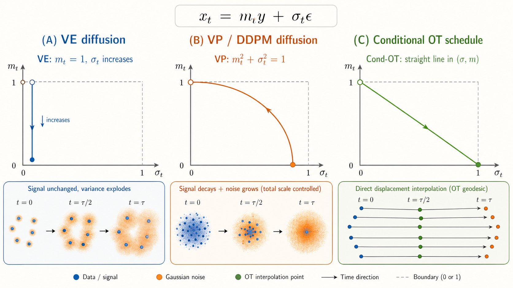

这张示意图把三种 schedule 放到同一个 $(\sigma_t,m_t)$ 平面里读。VE diffusion 是 $m_t=1$ 的竖直路径：signal 系数不变，只扩大噪声方差。VP / DDPM 是单位圆弧：$m_t$ 下降、$\sigma_t$ 上升，但二者满足 $m_t^2+\sigma_t^2=1$，总尺度被控制。conditional OT schedule 是从 $(0,1)$ 到 $(1,0)$ 的直线：它把 signal 减少和 noise 增加写成一个直接的 displacement interpolation。

VE diffusion 的名字是 variance exploding diffusion。它的 forward SDE 是：

$$
d\boldsymbol{x}_t
=
\sqrt{2T_t}\,dB_t.
\tag{26}
$$

此时 temperature 只由 variance schedule 决定：

$$
T_t
=
\partial_t
\left(
\frac{\sigma_t^2}{2}
\right).
\tag{27}
$$

这个式子右边只有 Brownian noise，没有 deterministic drift，所以：

$$
\boldsymbol{f}_t(\boldsymbol{x})=0.
$$

而在本文的 schedule 参数化中，external force 被写成：

$$
\boldsymbol{f}_t(\boldsymbol{x})
=
(\partial_t\ln m_t)\boldsymbol{x}.
$$

如果要求 $\boldsymbol{f}_t(\boldsymbol{x})=0$ 对所有 $\boldsymbol{x}$ 都成立，就必须有：

$$
\partial_t\ln m_t=0.
$$

这说明 $\ln m_t$ 不随时间变化，因此 $m_t$ 是常数。又因为 forward process 的初始条件是：

$$
m_0=1,
$$

所以整个过程中：

$$
m_t=1.
$$

这就是 “VE diffusion 中没有 external force，所以 $m_t=1$” 的推导。

接下来再看 $\sigma_t$。因为 $m_t=1$，conditional Gaussian transition 可以读成：

$$
\boldsymbol{x}_t
=
\boldsymbol{y}
+
\sigma_t\boldsymbol{\epsilon}.
$$

也就是说，原始 signal $\boldsymbol{y}$ 的系数始终是 $1$，没有被系统性缩小；forward process 只是不断增加噪声幅度 $\sigma_t$。这就是“只增加 $\sigma_t$”的含义。

从分布形状看，VE diffusion 不是把数据点往原点拉，而是在每个数据点周围不断扩大 Gaussian cloud。随着 $\sigma_t$ 增大，不同数据点周围的 cloud 逐渐重叠，数据结构被噪声淹没，整体 variance 变大，所以叫 variance exploding。

VP diffusion / DDPM 中有收缩 drift：

$$
d\boldsymbol{x}_t
=
-T_t\boldsymbol{x}_tdt
+
\sqrt{2T_t}\,dB_t,
\tag{29}
$$

这个 SDE 对应的 schedule 满足：

$$
\partial_t
\ln
\left(
m_t^2
\right)
=
\frac{
\partial_t(\sigma_t^2)
}{
\sigma_t^2-1
}
=
\partial_t
\ln
\left(
1-\sigma_t^2
\right).
\tag{30}
$$

对时间积分后得到：

并满足：

$$
m_t^2+\sigma_t^2=1.
\tag{31}
$$

cosine schedule 就是在这个单位圆上从 $(m,\sigma)=(1,0)$ 走到 $(0,1)$：

$$
m_t=\cos\left(\frac{\pi t}{2\tau}\right),
\qquad
\sigma_t=\sin\left(\frac{\pi t}{2\tau}\right).
\tag{32}
$$

原文随后补了一个 DDIM-style coordinate transformation，用来说明 VP diffusion 可以换坐标后读成无 external force 的 diffusion。定义：

$$
\bar{\boldsymbol{x}}
=
\frac{\boldsymbol{x}}{m_t}.
\tag{33}
$$

这一步的意思是：原始坐标 $\boldsymbol{x}$ 同时包含 signal shrink 和 noise spread；除以 $m_t$ 后，$\bar{\boldsymbol{x}}$ 把 deterministic signal shrink 吸收到坐标变换里。

在这个坐标下，Fokker--Planck equation 变成：

$$
\partial_t
\bar{\mathcal{P}}_t(\bar{\boldsymbol{x}})
=
-
\nabla_{\bar{\boldsymbol{x}}}\cdot
\left[
\left[
\frac{
\partial_t\ln m_t
}{
m_t^2
}
\nabla_{\bar{\boldsymbol{x}}}
\ln
\bar{\mathcal{P}}_t(\bar{\boldsymbol{x}})
\right]
\bar{\mathcal{P}}_t(\bar{\boldsymbol{x}})
\right].
\tag{34}
$$

这条式子看起来复杂，但核心是：原来 VP dynamics 里的 shrink drift 被坐标变换消掉了，剩下的是 rescaled coordinate 中的 diffusion。对应 Langevin equation 是：

$$
d\bar{\boldsymbol{x}}_t
=
\sqrt{
\frac{2T_t}{m_t^2}
}
dB_t.
\tag{35}
$$

所以 DDIM-style 读法是：在原始 $\boldsymbol{x}$ 坐标里，VP diffusion 有 deterministic contraction；在 $\bar{\boldsymbol{x}}=\boldsymbol{x}/m_t$ 坐标里，这个 contraction 被吸收掉，过程更像一个 variance-expanding diffusion。

conditional optimal transport schedule 则是在 $(m,\sigma)$ 平面中走直线：

$$
m_t=1-\frac{t}{\tau},
\qquad
\sigma_t=\frac{t}{\tau}.
\tag{28}
$$

这就是后面 optimal protocol 讨论的铺垫。schedule 的几何形状决定 forward distribution 在概率空间里走得是否平滑、是否绕路、是否产生额外 dissipation。

---

## 四、reverse process 和 estimated reverse process 的差别

理想 reverse process 是 forward process 的精确时间反演。令反向时间为：

$$
\tilde{t}=\tau-t.
$$

则 reverse distribution 是：

$$
\mathcal{P}_{\tilde{t}}^\dagger(\boldsymbol{x})
=
\mathcal{P}_{\tau-\tilde{t}}(\boldsymbol{x}).
$$

如果我们能准确知道 forward velocity field $\boldsymbol{\nu}^{\mathcal{P}}_t$，就能构造出真实 reverse dynamics，从噪声分布回到数据分布。

实际 diffusion model 做不到完全精确。它使用 estimated reverse process：

$$
\tilde{\mathcal{P}}_{\tilde{t}}^\dagger(\boldsymbol{x}),
$$

并用神经网络估计 score 或 velocity field。最终生成分布是：

$$
p(\boldsymbol{x})
=
\tilde{\mathcal{P}}_{\tau}^\dagger(\boldsymbol{x}).
$$

真实数据分布是：

$$
q(\boldsymbol{x})
=
\mathcal{P}_{0}(\boldsymbol{x})
=
\mathcal{P}_{\tau}^\dagger(\boldsymbol{x}).
$$

这就出现了两个误差来源。

第一，estimated reverse process 的初始分布可能不等于真实 forward process 的终点。也就是说：

$$
\tilde{\mathcal{P}}_{0}^\dagger
\neq
\mathcal{P}_{0}^\dagger
=
\mathcal{P}_{\tau}.
$$

在实际模型中，这很常见。我们通常用 standard Gaussian 作为 reverse 起点，但 finite-time forward process 的终点未必正好就是 standard Gaussian。

第二，velocity field 或 score 的估计也可能有误差。

本文的主结果先讨论理想化情况：velocity field 已经准确重构，只看初始噪声分布偏差会如何被 reverse dynamics 放大成最终生成误差。这样做的好处是可以把 schedule 本身的影响单独分析出来。

---

## 五、$D_0$ 和 $\Delta\mathcal{W}_1$：误差到底怎么量化

主不等式左边有两个量：$D_0$ 和 $\Delta\mathcal{W}_1$。

$D_0$ 是 reverse 初始分布之间的 Pearson $\chi^2$ divergence：

$$
D_0
:=
\int d\boldsymbol{x}
\frac{
\left(
\tilde{\mathcal{P}}_{0}^{\dagger}(\boldsymbol{x})
-
\mathcal{P}_{0}^{\dagger}(\boldsymbol{x})
\right)^2
}{
\mathcal{P}_{0}^{\dagger}(\boldsymbol{x})
}.
$$

它衡量的是：estimated reverse process 从哪里开始，和真实 reverse process 应该从哪里开始，两者差多少。

$\Delta\mathcal{W}_1$ 是 $1$-Wasserstein distance 的变化：

$$
\Delta \mathcal{W}_1
:=
\mathcal{W}_1(q,p)
-
\mathcal{W}_1(\mathcal{P}^{\dagger}_{0},\tilde{\mathcal{P}}^{\dagger}_{0}).
$$

第一项 $\mathcal{W}_1(q,p)$ 是最终 generated distribution 和 data distribution 的距离。

第二项 $\mathcal{W}_1(\mathcal{P}^{\dagger}_{0},\tilde{\mathcal{P}}^{\dagger}_{0})$ 是 reverse 起点处的距离。

所以 $\Delta\mathcal{W}_1$ 不是单纯的 final error，而是“从 reverse 起点到终点，两个 reverse trajectories 之间的 Wasserstein distance 增加了多少”。

如果 reverse 初始分布已经非常接近真实噪声分布，那么：

$$
\mathcal{W}_1(\mathcal{P}^{\dagger}_{0},\tilde{\mathcal{P}}^{\dagger}_{0})
\approx 0,
$$

于是：

$$
\Delta\mathcal{W}_1
\approx
\mathcal{W}_1(q,p).
$$

这时 $\Delta\mathcal{W}_1$ 就可以直接读成 generation error。

把两者合起来：

$$
\frac{(\Delta\mathcal{W}_1)^2}{D_0}
$$

描述的是 response function，也就是一个小的 reverse 初始分布偏差，会在最终生成分布中造成多大的误差变化。

这就是 speed-accuracy relation 中 accuracy 的真正含义：它不是普通 sample quality，也不是 FID，而是 generation 对 initial noise mismatch 的 sensitivity。

Fig. 3 把这个定义画成几何图。蓝色轨迹是真实 forward / reverse path，粉色轨迹是 estimated reverse path。右上角两条 reverse 起点之间的差异用 $D_0$ 度量，左下角最终生成分布 $p$ 和真实数据分布 $q$ 的差异用 $\Delta\mathcal{W}_1$ 度量。绿色箭头标出 forward process 的 diffusion speed cost $\int_0^\tau dt\,[v_2(t)]^2$。主不等式说的是：如果 forward path 本身走得太急、太绕或太耗散，那么 estimated reverse process 可以把很小的 initial mismatch 放大成更大的 generation error。

---

## 六、entropy production rate：为什么它能描述 forward diffusion 的代价

在 stochastic thermodynamics 中，overdamped Fokker--Planck dynamics 的 entropy production rate 定义为：

$$
\dot{S}^{\mathrm{tot}}_t
=
\frac{1}{T_t}
\int d\boldsymbol{x}\,
\left\|
\boldsymbol{\nu}^{\mathcal{P}}_t(\boldsymbol{x})
\right\|^2
\mathcal{P}_t(\boldsymbol{x}).
\tag{36}
$$

这里 $\boldsymbol{\nu}^{\mathcal{P}}_t$ 是 probability current 的速度，$\mathcal{P}_t$ 是当前分布。因此：

$$
\int d\boldsymbol{x}\,
\left\|
\boldsymbol{\nu}^{\mathcal{P}}_t(\boldsymbol{x})
\right\|^2
\mathcal{P}_t(\boldsymbol{x})
$$

可以读成 distribution motion 的 kinetic energy。它描述概率质量整体移动得有多剧烈。

前面乘上 $1/T_t$ 后，就得到 thermodynamic entropy production rate。温度越高，同样的 current 对应的 entropy production rate 会被温度归一化；但主不等式里出现的是：

$$
T_t\dot{S}^{\mathrm{tot}}_t
=
\int d\boldsymbol{x}\,
\left\|
\boldsymbol{\nu}^{\mathcal{P}}_t(\boldsymbol{x})
\right\|^2
\mathcal{P}_t(\boldsymbol{x}).
$$

所以在本文主结果里，$T_t\dot{S}^{\mathrm{tot}}_t$ 更像是 forward process 的 instantaneous speed cost。

这个量大，说明 forward process 在概率空间里走得很急、概率流很强、或者存在额外的 non-conservative circulation。作者的结论是：这种 forward-side 的运动代价会控制 reverse-side 的 generation sensitivity。

原文在这里还做了一个 thermodynamic 分解，防止读者把 entropy production 误读成一个纯数学范数。这个分解的意思是：一个 diffusion process 的不可逆性来自两处，一处是 probability distribution 自己的 entropy 变化，另一处是系统和外部 heat bath 之间的 entropy exchange。

总 entropy production rate 被写成：

$$
\dot{S}^{\mathrm{tot}}_t
=
\dot{S}^{\mathrm{sys}}_t
+
\dot{S}^{\mathrm{bath}}_t.
\tag{37}
$$

第一项是 system entropy change。system entropy 就是当前 probability density 的 Shannon entropy：

$$
S^{\mathrm{sys}}_t
=
-
\int d\boldsymbol{x}\,
\mathcal{P}_t(\boldsymbol{x})
\ln \mathcal{P}_t(\boldsymbol{x}).
$$

所以它的时间变化率是：

$$
\dot{S}^{\mathrm{sys}}_t
=
\partial_t
\left[
-
\int d\boldsymbol{x}\,
\mathcal{P}_t(\boldsymbol{x})
\ln \mathcal{P}_t(\boldsymbol{x})
\right].
\tag{38}
$$

这项只看 distribution 本身。若 $\mathcal{P}_t$ 变得更分散，$S^{\mathrm{sys}}_t$ 通常增加；若 $\mathcal{P}_t$ 被 drift 压缩到更集中的区域，$S^{\mathrm{sys}}_t$ 可能减少。

为了看它和 probability current 的关系，把 Fokker--Planck 方程代入：

$$
\partial_t\mathcal{P}_t
=
-
\nabla\cdot
\left(
\boldsymbol{\nu}^{\mathcal{P}}_t
\mathcal{P}_t
\right).
$$

由于 $\int d\boldsymbol{x}\,\partial_t\mathcal{P}_t=0$，归一化项不会贡献。于是：

$$
\begin{aligned}
\dot{S}^{\mathrm{sys}}_t
&=
-
\int d\boldsymbol{x}\,
\partial_t\mathcal{P}_t
\ln\mathcal{P}_t\\
&=
\int d\boldsymbol{x}\,
\nabla\cdot
\left(
\boldsymbol{\nu}^{\mathcal{P}}_t
\mathcal{P}_t
\right)
\ln\mathcal{P}_t\\
&=
-
\int d\boldsymbol{x}\,
\boldsymbol{\nu}^{\mathcal{P}}_t(\boldsymbol{x})
\cdot
\nabla\ln\mathcal{P}_t(\boldsymbol{x})
\mathcal{P}_t(\boldsymbol{x}).
\end{aligned}
$$

最后一步用了分部积分。这个式子说明：system entropy change 由 probability current 和 density gradient 的相对方向决定。如果 current 把概率质量推向更低密度、更分散的位置，system entropy 上升；如果 current 把概率质量压向高密度区域，system entropy 下降。

第二项是 bath entropy change。它由 external force 对 probability current 做功给出：

$$
\dot{S}^{\mathrm{bath}}_t
=
\frac{
\int d\boldsymbol{x}\,
\boldsymbol{f}_t(\boldsymbol{x})
\cdot
\boldsymbol{\nu}^{\mathcal{P}}_t(\boldsymbol{x})
\mathcal{P}_t(\boldsymbol{x})
}{
T_t
}.
\tag{39}
$$

这里 $\boldsymbol{f}_t\cdot\boldsymbol{\nu}^{\mathcal{P}}_t$ 可以读成 force 沿着 probability current 方向做的 instantaneous power。再除以 $T_t$，就得到 heat bath entropy change rate。直观地说，外部 force 推动概率质量运动，这个推动过程会和环境发生能量/热量交换。

现在把两项相加：

$$
\begin{aligned}
\dot{S}^{\mathrm{sys}}_t
+
\dot{S}^{\mathrm{bath}}_t
&=
\int d\boldsymbol{x}\,
\left[
\frac{\boldsymbol{f}_t(\boldsymbol{x})}{T_t}
-
\nabla\ln\mathcal{P}_t(\boldsymbol{x})
\right]
\cdot
\boldsymbol{\nu}^{\mathcal{P}}_t(\boldsymbol{x})
\mathcal{P}_t(\boldsymbol{x})\\
&=
\frac{1}{T_t}
\int d\boldsymbol{x}\,
\left[
\boldsymbol{f}_t(\boldsymbol{x})
-
T_t\nabla\ln\mathcal{P}_t(\boldsymbol{x})
\right]
\cdot
\boldsymbol{\nu}^{\mathcal{P}}_t(\boldsymbol{x})
\mathcal{P}_t(\boldsymbol{x}).
\end{aligned}
$$

而 velocity field 的定义正是：

$$
\boldsymbol{\nu}^{\mathcal{P}}_t(\boldsymbol{x})
=
\boldsymbol{f}_t(\boldsymbol{x})
-
T_t\nabla\ln\mathcal{P}_t(\boldsymbol{x}).
$$

所以括号里的量就是 $\boldsymbol{\nu}^{\mathcal{P}}_t$。因此：

$$
\dot{S}^{\mathrm{sys}}_t
+
\dot{S}^{\mathrm{bath}}_t
=
\frac{1}{T_t}
\int d\boldsymbol{x}\,
\left\|
\boldsymbol{\nu}^{\mathcal{P}}_t(\boldsymbol{x})
\right\|^2
\mathcal{P}_t(\boldsymbol{x})
=
\dot{S}^{\mathrm{tot}}_t.
$$

这就是为什么 total entropy production 一定非负：它最后变成了 velocity field 的 squared norm。system entropy change 本身可以正也可以负，bath entropy change 本身也可以正也可以负；但二者合起来记录的是整个 diffusion process 的不可逆代价。

把 rate 沿整段 forward process 积分，就得到 total entropy production：

$$
S_\tau^{\mathrm{tot}}
=
\int_0^\tau dt\,
\dot{S}^{\mathrm{tot}}_t.
\tag{40}
$$

作者接着把 entropy production 写成 path probability 的 KL divergence。这一段原文公式很多，但逻辑只有一条：先给 forward path 定义概率，再构造一个 thermodynamic backward / dual path probability，最后用两条 path ensemble 的 KL divergence 表示 entropy production。

第一步，作者先引入一个 auxiliary dynamics：

$$
d\boldsymbol{x}_t
=
\boldsymbol{f}_t(\boldsymbol{x}_t)dt
-
2\boldsymbol{\nu}^{\mathcal{P}}_t(\boldsymbol{x}_t)dt
+
\sqrt{2T_t}\,dB_t.
\tag{41}
$$

这个式子和 forward Langevin SDE 的区别只在 drift。forward dynamics 的 drift 是 $\boldsymbol{f}_t$，这里变成

$$
\boldsymbol{f}_t
-
2\boldsymbol{\nu}^{\mathcal{P}}_t.
$$

因为

$$
\boldsymbol{\nu}^{\mathcal{P}}_t
=
\boldsymbol{f}_t
-
T_t\nabla\ln\mathcal{P}_t,
$$

所以这个 drift 也可以读成

$$
\boldsymbol{f}_t
-
2\boldsymbol{\nu}^{\mathcal{P}}_t
=
-
\boldsymbol{f}_t
+
2T_t\nabla\ln\mathcal{P}_t.
$$

直觉上，Eq. (41) 是为了构造一个和 forward probability current 相反的 comparison dynamics。它不是直接等同于 diffusion model 的 estimated reverse sampler，而是 stochastic thermodynamics 中用于比较 forward path 和 dual/backward path 的数学对象。

第二步，设 forward Langevin dynamics 的整条路径为：

$$
\Gamma
=
\{
\boldsymbol{x}_0,
\boldsymbol{x}_{\Delta t},
\ldots,
\boldsymbol{x}_{N_\tau\Delta t}
\}.
$$

这里 $\Delta t$ 是小时间步，$\tau=N_\tau\Delta t$。对 forward SDE 来说，从时间 $t$ 的位置 $\boldsymbol{x}$ 走到 $t+\Delta t$ 的位置 $\boldsymbol{y}$，短时间 transition probability 是 Gaussian：

$$
\mathcal{T}_t(\boldsymbol{y}\mid\boldsymbol{x})
=
\frac{1}
{(4\pi T_t\Delta t)^{n_{\mathrm d}/2}}
\exp
\left[
-
\frac{
\|
\boldsymbol{y}
-
\boldsymbol{x}
-
\boldsymbol{f}_t(\boldsymbol{x})\Delta t
\|^2
}{
4T_t\Delta t
}
\right].
\tag{42}
$$

这个式子只是 Langevin equation 的局部 Gaussian increment。均值位移是 $\boldsymbol{f}_t(\boldsymbol{x})\Delta t$，方差尺度是 $2T_t\Delta t$。

对 Eq. (41) 的 auxiliary dynamics，对应 transition probability 变成：

$$
\mathcal{T}^{\dagger}_t(\boldsymbol{y}\mid\boldsymbol{x})
=
\frac{1}
{(4\pi T_t\Delta t)^{n_{\mathrm d}/2}}
\exp
\left[
-
\frac{
\|
\boldsymbol{y}
-
\boldsymbol{x}
-
\boldsymbol{f}_t(\boldsymbol{x})\Delta t
+
2\boldsymbol{\nu}^{\mathcal{P}}_t(\boldsymbol{x})\Delta t
\|^2
}{
4T_t\Delta t
}
\right].
\tag{43}
$$

注意指数里的位移项。因为 Eq. (41) 的 drift 是 $\boldsymbol{f}_t-2\boldsymbol{\nu}^{\mathcal{P}}_t$，所以

$$
\boldsymbol{y}
-
\boldsymbol{x}
-
[
\boldsymbol{f}_t
-
2\boldsymbol{\nu}^{\mathcal{P}}_t
]\Delta t
=
\boldsymbol{y}
-
\boldsymbol{x}
-
\boldsymbol{f}_t\Delta t
+
2\boldsymbol{\nu}^{\mathcal{P}}_t\Delta t.
$$

第三步，用这些 one-step transition probabilities 组成整条 path 的 probability。

forward path probability 是：

$$
\mathbb{P}_{\mathrm F}(\Gamma)
=
\mathcal{P}_0(\boldsymbol{x}_0)
\prod_{N=0}^{N_\tau-1}
\mathcal{T}_{N\Delta t}
\left(
\boldsymbol{x}_{(N+1)\Delta t}
\mid
\boldsymbol{x}_{N\Delta t}
\right).
\tag{44}
$$

这就是通常的 Markov path probability：初始分布乘上每一步 transition probability。它和 forward marginal $\mathcal{P}_t$ 是一致的；如果把路径中除了 $\boldsymbol{x}_{n\Delta t}$ 以外的所有变量积分掉，就得到 $\mathcal{P}_{n\Delta t}(\boldsymbol{x}_{n\Delta t})$。

auxiliary / dual path probability 是：

$$
\mathbb{P}_{\mathrm B}(\Gamma)
=
\mathcal{P}_0(\boldsymbol{x}_0)
\prod_{N=0}^{N_\tau-1}
\mathcal{T}^{\dagger}_{N\Delta t}
\left(
\boldsymbol{x}_{(N+1)\Delta t}
\mid
\boldsymbol{x}_{N\Delta t}
\right).
\tag{45}
$$

这里的关键提醒是：$\mathbb{P}_{\mathrm B}$ 虽然下标写成 $\mathrm B$，但它不是 diffusion model 里真正用于生成样本的 reverse process path probability。名字里的 $\mathrm B$ 更接近 stochastic thermodynamics 里的 backward / dual comparison process，而不是“从 noise 生成 data 的 sampler”。

真正的 generative reverse process 通常从 forward terminal distribution $\mathcal{P}_{\tau}$ 或 noise distribution 出发，然后沿反向时间从 $t=\tau$ 走回 $t=0$。它关心的是：给定 noisy sample，如何一步步去噪，最后回到 data distribution。

但 Eq. (45) 里的 $\mathbb{P}_{\mathrm B}$ 不是这样构造的。它和 forward path probability $\mathbb{P}_{\mathrm F}$ 一样，仍然从同一个初始分布 $\mathcal{P}_0(\boldsymbol{x}_0)$ 出发，并且仍然沿同一个离散时间顺序

$$
\boldsymbol{x}_0
\to
\boldsymbol{x}_{\Delta t}
\to
\cdots
\to
\boldsymbol{x}_{N_{\tau}\Delta t}
$$

给路径赋概率。区别只在每一步 transition probability：$\mathbb{P}_{\mathrm F}$ 使用 forward transition $\mathcal{T}_t$，而 $\mathbb{P}_{\mathrm B}$ 使用 Eq. (41) 对应的 auxiliary transition $\mathcal{T}^{\dagger}_t$。

所以 $\mathbb{P}_{\mathrm B}$ 的作用不是生成数据，而是制造一个“如果 probability current 被反向处理，这条同样的 path 会有多大概率”的对照 ensemble。把 $\mathbb{P}_{\mathrm F}$ 和 $\mathbb{P}_{\mathrm B}$ 放在一起比较，就可以问：forward dynamics 产生的 path statistics 和这个 dual dynamics 产生的 path statistics 有多不一样？

这个“不一样”正是 entropy production 要度量的不可逆性。若 forward dynamics 几乎可逆，两条 path ensemble 很难区分，$D_{\mathrm{KL}}(\mathbb{P}_{\mathrm F}\|\mathbb{P}_{\mathrm B})$ 就小；若 forward dynamics 有强 probability current、强耗散或明显方向性，两条 path ensemble 差异就大，KL divergence 也大。

因此，这里的逻辑不是

$$
\mathbb{P}_{\mathrm B}
=
\text{generative reverse sampler}.
$$

而是

$$
\mathbb{P}_{\mathrm B}
=
\text{thermodynamic dual path ensemble used to measure irreversibility}.
$$

第四步，比较这两条 path ensemble。作者定义：

$$
D_{\mathrm{KL}}
\left(
\mathbb{P}_{\mathrm F}
\|
\mathbb{P}_{\mathrm B}
\right)
=
\int d\Gamma\,
\mathbb{P}_{\mathrm F}(\Gamma)
\ln
\frac{
\mathbb{P}_{\mathrm F}(\Gamma)
}{
\mathbb{P}_{\mathrm B}(\Gamma)
}.
\tag{46}
$$

这个 KL divergence 衡量：如果一条 trajectory 是从 forward process 采样来的，它有多容易和 dual dynamics 产生的 trajectory 区分开。作者得到：

$$
S_\tau^{\mathrm{tot}}
=
D_{\mathrm{KL}}
\left(
\mathbb{P}_{\mathrm{F}}
\|
\mathbb{P}_{\mathrm{B}}
\right).
\tag{47}
$$

这一步的物理意义是：entropy production 衡量 forward path ensemble 和相应 dual path ensemble 有多容易区分。如果一个过程完全可逆，forward path 和 backward-type path 的统计差异小；如果一个过程强不可逆，路径级 KL divergence 大。

第五步，作者又给出另一种 backward trajectory path probability：

$$
\mathbb{P}_{\mathrm B}^{\prime}(\Gamma)
=
\mathcal{P}_{\tau}
\left(
\boldsymbol{x}_{N_\tau\Delta t}
\right)
\prod_{N=0}^{N_\tau-1}
\mathcal{T}_{N\Delta t}
\left(
\boldsymbol{x}_{N\Delta t}
\mid
\boldsymbol{x}_{(N+1)\Delta t}
\right).
\tag{48}
$$

这次的构造方式不同。它从 endpoint distribution $\mathcal{P}_{\tau}$ 开始，并把 forward transition $\mathcal{T}$ 的方向反过来读：从 $\boldsymbol{x}_{(N+1)\Delta t}$ 回到 $\boldsymbol{x}_{N\Delta t}$。这更接近 fluctuation theorem 里常见的 backward trajectory 写法。

同样有：

$$
S_\tau^{\mathrm{tot}}
=
D_{\mathrm{KL}}
\left(
\mathbb{P}_{\mathrm F}
\|
\mathbb{P}_{\mathrm B}^{\prime}
\right).
\tag{49}
$$

Eq. (47) 和 Eq. (49) 的共同点是：entropy production 都可以读成 forward path probability 和某个 backward/dual path probability 之间的 KL divergence。差别是 $\mathbb{P}_{\mathrm B}$ 使用 Eq. (41) 的 auxiliary transition，$\mathbb{P}_{\mathrm B}^{\prime}$ 使用 time-reversed ordering of the forward transition。

这里需要特别区分三个对象。

第一，$\mathbb{P}_{\mathrm{F}}$ 是 forward process 的路径分布。

第二，$\mathbb{P}_{\mathrm{B}}$ 或 $\mathbb{P}_{\mathrm{B}}'$ 是 stochastic thermodynamics 里用于定义 irreversibility 的 backward / dual path distribution。

第三，$\tilde{\mathcal{P}}_{\tilde t}^{\dagger}$ 是 diffusion model 实际用于生成数据的 estimated reverse process。

它们有形式类比，但不是同一个东西。作者强调这个区分，是为了避免把 thermodynamic backward process 直接等同于 generative reverse sampler。真正的对应关系是：diffusion model 希望 estimated reverse path mimic the forward path in reverse，而 stochastic thermodynamics 研究 forward path 与 backward path 的统计不可逆性。两者共享 path-probability calculus，所以 entropy production 的工具可以迁移到 diffusion model，但概念上不能混成一个对象。

这也解释了为什么原始 diffusion model 会和 fluctuation theorem / Jarzynski equality 产生历史关联。Jarzynski-type relation 也是把 path probability ratio 和 exponential average 联系起来：

$$
\mathbb{E}_{\mathbb{P}_{\mathrm{F}}}
\left[
\exp
\left(
-s_\tau^{\mathrm{tot}}
\right)
\right]
=
1.
\tag{50}
$$

最后，作者把这种 path-probability language 和 diffusion model 的 estimated reverse process 接起来。原始 diffusion model 会定义 estimated reverse path probability：

$$
\mathbb{P}_{\mathrm E}(\Gamma)
=
\tilde{\mathcal{P}}^{\dagger}_0
\left(
\boldsymbol{x}_{N_\tau\Delta t}
\right)
\prod_{N=0}^{N_\tau-1}
\mathcal{T}^{\mathrm E}_{N\Delta t}
\left(
\boldsymbol{x}_{N\Delta t}
\mid
\boldsymbol{x}_{(N+1)\Delta t}
\right).
\tag{51}
$$

这个式子和 Eq. (48) 形式相似：都是从 reverse 起点开始，然后沿反向时间组织 transition product。区别是，$\mathbb{P}_{\mathrm B}^{\prime}$ 是热力学里定义 irreversibility 的 backward path probability；$\mathbb{P}_{\mathrm E}$ 是模型实际学出来的 estimated reverse sampler。diffusion model 的目标不是让 $\mathbb{P}_{\mathrm E}$ 等于某个 thermodynamic backward construction，而是让它在生成上足够接近真实 reverse behavior。

所以这组公式的线性结论是：

$$
\begin{aligned}
&\text{forward SDE defines }\mathbb{P}_{\mathrm F}\\
&\rightarrow \text{dual/backward construction defines }\mathbb{P}_{\mathrm B}\text{ or }\mathbb{P}_{\mathrm B}^{\prime}\\
&\rightarrow D_{\mathrm{KL}}(\mathbb{P}_{\mathrm F}\|\mathbb{P}_{\mathrm B})\text{ measures irreversibility}\\
&\rightarrow \text{this path-probability calculus resembles diffusion reverse modeling}.
\end{aligned}
$$

作者不是要用 Eq. (50) 重新训练 diffusion model，而是指出：diffusion model 的 lower-bound training、reverse path construction 和 stochastic thermodynamics 的 path probability language 有共同结构。因此，后面可以把 thermodynamic speed limit 改写成 generative accuracy bound。

---

## 七、$2$-Wasserstein speed：把热力学代价改写成几何速度

为了讨论 optimal protocol，作者引入 $2$-Wasserstein distance。

给定两个分布 $P$ 和 $Q$，$p$-Wasserstein distance 定义为：

$$
\mathcal{W}_p(P,Q)
:=
\left(
\inf_{\pi\in\Pi(P,Q)}
\int d\boldsymbol{x}d\boldsymbol{y}
\|\boldsymbol{x}-\boldsymbol{y}\|^p
\pi(\boldsymbol{x},\boldsymbol{y})
\right)^{1/p}.
\tag{52}
$$

这个定义里最容易被折叠的是 $\Pi(P,Q)$。Eq. (52) 不是直接在两个分布之间算距离，而是先枚举所有可能的“搬运方案”。这些搬运方案就是 $\Pi(P,Q)$ 里的 coupling。

原文把 coupling set 定义为：

$$
\begin{aligned}
\Pi(P,Q)
=
\{
&\pi(\boldsymbol{x},\boldsymbol{y})
\mid
\pi(\boldsymbol{x},\boldsymbol{y})\geq0,\\
&
\int d\boldsymbol{y}\,
\pi(\boldsymbol{x},\boldsymbol{y})
=
P(\boldsymbol{x}),\\
&
\int d\boldsymbol{x}\,
\pi(\boldsymbol{x},\boldsymbol{y})
=
Q(\boldsymbol{y})
\}.
\end{aligned}
\tag{53}
$$

这条公式要从“joint distribution 的边缘分布”来读。$\pi(\boldsymbol{x},\boldsymbol{y})$ 是一个定义在 pair $(\boldsymbol{x},\boldsymbol{y})$ 上的 joint probability density。它不是新的数据分布，而是一张搬运表：表的行对应 source position $\boldsymbol{x}$，列对应 target position $\boldsymbol{y}$，表格里的数值表示有多少概率质量从 $\boldsymbol{x}$ 被送到 $\boldsymbol{y}$。

第一个条件是非负性：

$$
\pi(\boldsymbol{x},\boldsymbol{y})\geq0.
$$

这只是说概率质量不能是负的。任何合法搬运方案都不能从某个位置“搬走负质量”。

第二个条件是 source marginal constraint：

$$
\int d\boldsymbol{y}\,
\pi(\boldsymbol{x},\boldsymbol{y})
=
P(\boldsymbol{x}).
$$

这一步的意思是：固定一个 source position $\boldsymbol{x}$，把它送往所有 possible destination $\boldsymbol{y}$ 的概率质量加起来，必须正好等于原来 $P$ 在 $\boldsymbol{x}$ 处拥有的质量。也就是说，$\pi$ 不能凭空增加或减少从 $P$ 出发的质量。

第三个条件是 target marginal constraint：

$$
\int d\boldsymbol{x}\,
\pi(\boldsymbol{x},\boldsymbol{y})
=
Q(\boldsymbol{y}).
$$

这一步的意思是：固定一个 target position $\boldsymbol{y}$，把所有 source $\boldsymbol{x}$ 运到这里的概率质量加起来，必须正好等于目标分布 $Q$ 在 $\boldsymbol{y}$ 处需要的质量。也就是说，$\pi$ 最后必须真的重建出 $Q$。

因此，$\Pi(P,Q)$ 不是一个任意函数集合，而是所有“起点边缘分布为 $P$、终点边缘分布为 $Q$”的 joint distributions。每个 $\pi$ 都是一种合法配对方式：

$$
\boldsymbol{x}\sim P
\quad\text{is matched with}\quad
\boldsymbol{y}\sim Q.
$$

回到 Eq. (52)，积分

$$
\int d\boldsymbol{x}d\boldsymbol{y}\,
\|\boldsymbol{x}-\boldsymbol{y}\|^p
\pi(\boldsymbol{x},\boldsymbol{y})
$$

就是在某个搬运方案 $\pi$ 下的 average transport cost：从 $\boldsymbol{x}$ 搬到 $\boldsymbol{y}$ 的单位成本是 $\|\boldsymbol{x}-\boldsymbol{y}\|^p$，而 $\pi(\boldsymbol{x},\boldsymbol{y})$ 给出这条搬运路线被使用的权重。

最后，$\inf_{\pi\in\Pi(P,Q)}$ 表示在所有合法搬运方案中选成本最低的一个。所以 $\mathcal{W}_p(P,Q)$ 的逻辑顺序是：

$$
\begin{aligned}
&\text{fix source distribution }P\text{ and target distribution }Q\\
&\rightarrow \text{list all legal couplings }\pi\in\Pi(P,Q)\\
&\rightarrow \text{compute each coupling's average transport cost}\\
&\rightarrow \text{choose the minimum-cost coupling}.
\end{aligned}
$$

这就是为什么 $\pi$ 被叫作 coupling：它把原本分开的两个 marginal distributions $P$ 和 $Q$ 绑定成一个 joint distribution，同时保留二者各自的边缘分布。

原文接着列出 $\mathcal{W}_p$ 的 metric properties。这几条看起来像数学定义的附属条件，但它们是后面谈 path length 和 geodesic 的前提。

第一，距离非负：

$$
\mathcal{W}_p(P,Q)
\geq
0.
\tag{54}
$$

因为 transport cost $\|\boldsymbol{x}-\boldsymbol{y}\|^p$ 和 coupling density $\pi$ 都非负，所以平均搬运成本不可能为负。

第二，距离为零当且仅当两个分布相同：

$$
\mathcal{W}_p(P,Q)=0
\Leftrightarrow
P=Q.
\tag{55}
$$

如果 $P=Q$，可以把每一点的质量原地匹配，成本为零。反过来，如果最小搬运成本为零，概率质量没有任何非零距离的搬运，两个分布就必须相同。

第三，对称性：

$$
\mathcal{W}_p(P,Q)
=
\mathcal{W}_p(Q,P).
\tag{56}
$$

从 $P$ 搬到 $Q$ 的方案可以反向读成从 $Q$ 搬回 $P$ 的方案，而距离成本 $\|\boldsymbol{x}-\boldsymbol{y}\|^p$ 本身对调 $\boldsymbol{x}$ 和 $\boldsymbol{y}$ 不变。

第四，triangle inequality：

$$
\mathcal{W}_p(P,Q)
\leq
\mathcal{W}_p(P,R)
+
\mathcal{W}_p(R,Q).
\tag{57}
$$

它说，从 $P$ 直接搬到 $Q$ 的最小成本，不会超过“先从 $P$ 搬到中间分布 $R$，再从 $R$ 搬到 $Q$”的成本。后面 Eq. (92) 中说 path length 不短于 endpoint distance，用的正是这条 metric property。

所谓 $\mathcal{W}_2$ 的几何性质好，意思不是说有一个“geodesic 的空间”单独存在，而是说：如果用 $\mathcal{W}_2$ 作为距离，probability distributions 的集合可以被看成一个带有 geodesic 的 metric space。

这里要分三层读。

第一，普通几何里，空间里的对象是点。例如二维平面里有点 $a$ 和点 $b$，两点之间的距离是 Euclidean distance。

第二，在 Wasserstein 几何里，空间里的“点”不是普通点，而是整个 probability distribution。也就是说：

$$
P,\ Q,\ \mathcal{P}_t
$$

都可以被看成 distribution space 里的点。

第三，如果 distribution 是点，那么一条随时间变化的 distribution path：

$$
\mathcal{P}_0
\rightarrow
\mathcal{P}_t
\rightarrow
\mathcal{P}_\tau
$$

就可以被看成 distribution space 里的一条曲线。diffusion model 的 forward noising process，本质上就是这样一条曲线：它从 data distribution 走向 noise distribution。

在这个空间里，geodesic 指的是两端分布之间的最短曲线。也就是说，Wasserstein geodesic 是：

$$
\text{the shortest path from }P\text{ to }Q
\text{ measured by }\mathcal{W}_2.
$$

它的直觉是：把 $P$ 的 probability mass 以总平方搬运距离最小的方式搬成 $Q$，并且中间每个时刻的分布都对应这个最优搬运过程中的一个 intermediate state。

因此，$\mathcal{W}_2$ 不只是给两个分布一个距离值。它还允许我们谈论：

$$
\begin{aligned}
&\text{distribution path length},\\
&\text{distribution speed},\\
&\text{shortest path / geodesic},\\
&\text{constant-speed motion along the geodesic}.
\end{aligned}
$$

这就是为什么本文后面可以说 optimal protocol 是 $\mathcal{W}_2$ geodesic：它不是在普通样本空间里找一条直线，而是在 probability distribution space 里找从 data distribution 到 noise distribution 的最短搬运路径。

原文把 $\mathcal{W}_1$ 和 $\mathcal{W}_2$ 放在不同位置，不是随意换符号。$\mathcal{W}_1$ 用来描述 generation error，因为它有 Kantorovich--Rubinstein duality：

$$
\mathcal{W}_1(P,Q)
=
\sup_{\psi\in\mathrm{Lip}^1}
\left(
\mathbb{E}_P[\psi]
-
\mathbb{E}_Q[\psi]
\right).
\tag{58}
$$

这表示 $\mathcal{W}_1$ 可以通过一族 slope-bounded observables 来测量两个分布的差异。后面证明主不等式时，作者正是对这些 test functions 的 expectation difference 求时间导数。

$\mathcal{W}_2$ 则用来描述 forward path 的 geometry。它有 Benamou--Brenier 动态公式，可以把两个分布之间的 transport cost 写成所有连续 probability paths 的最小 kinetic energy。也就是说，$\mathcal{W}_2$ 适合回答“这条 distribution path 走得快不快、绕不绕路”。

原文先给了一个 Gaussian case，帮助读者把 $\mathcal{W}_2$ 和常见生成模型指标联系起来。如果 $P$ 和 $Q$ 是 Gaussian，均值分别为 $\boldsymbol{\mu}_P,\boldsymbol{\mu}_Q$，协方差分别为 $\Sigma_P,\Sigma_Q$，那么：

$$
\begin{aligned}
\mathcal{W}_2(P,Q)^2
=&
\|
\boldsymbol{\mu}_P
-
\boldsymbol{\mu}_Q
\|^2\\
&+
\operatorname{tr}
\left[
\Sigma_P+\Sigma_Q
-
2
\left(
\Sigma_P^{1/2}
\Sigma_Q
\Sigma_P^{1/2}
\right)^{1/2}
\right].
\end{aligned}
\tag{59}
$$

这条式子说明，Gaussian distributions 之间的 $\mathcal{W}_2$ 距离由两部分组成：mean shift 的距离，以及 covariance shape 的差异。

如果协方差是 isotropic 的，也就是 $\Sigma_P=\sigma_P^2\mathbf{I}$、$\Sigma_Q=\sigma_Q^2\mathbf{I}$，公式会简化为：

$$
\begin{aligned}
\mathcal{W}_2(P,Q)^2
&=
\|
\boldsymbol{\mu}_P
-
\boldsymbol{\mu}_Q
\|^2
+
\operatorname{tr}
\left[
(\sigma_P-\sigma_Q)^2
\right]\\
&=
\|
\boldsymbol{\mu}_P
-
\boldsymbol{\mu}_Q
\|^2
+
(\sigma_P-\sigma_Q)^2n_{\mathrm d}\\
&=
\|
\boldsymbol{\mu}_P
-
\boldsymbol{\mu}_Q
\|^2
+
\|
\sigma_P\mathbf{1}
-
\sigma_Q\mathbf{1}
\|^2.
\end{aligned}
\tag{60}
$$

这就是为什么后面 conditional Gaussian schedule 可以被画在 $(m_t,\sigma_t)$ 平面中。对于 Gaussian-like transition，mean 和 scale 的变化可以直接转化成 transport geometry。

接着进入 dynamic formulation。Benamou--Brenier 公式把 endpoint distance 写成 kinetic-energy minimization：

$$
\mathcal{W}_2(\mathcal{P}_{\tau},\mathcal{P}_0)
=
\sqrt{
\inf
\tau
\int_0^\tau dt
\int d\boldsymbol{x}\,
\|\boldsymbol{v}_t(\boldsymbol{x})\|^2
q_t(\boldsymbol{x})
}.
\tag{61}
$$

这里优化对象是一条 intermediate density path $q_t$ 和对应 velocity field $\boldsymbol{v}_t$。它们必须满足 endpoint constraints：

$$
q_0(\boldsymbol{x})
=
\mathcal{P}_0(\boldsymbol{x}),
\qquad
q_{\tau}(\boldsymbol{x})
=
\mathcal{P}_{\tau}(\boldsymbol{x}).
\tag{62}
$$

所以 Eq. (61)-Eq. (62) 的含义是：在所有能把 $\mathcal{P}_0$ 连续搬到 $\mathcal{P}_\tau$ 的 probability paths 中，找 kinetic energy 最小的一条。这就是后面 “optimal protocol = Wasserstein geodesic” 的数学基础。

因此，全篇的符号分工是：

$$
\mathcal{W}_1
\quad\text{for error response},
\qquad
\mathcal{W}_2
\quad\text{for path speed and optimal protocol}.
$$

这也避免了一个常见误读：本文主结果不是简单使用 $\mathcal{W}_1\leq\mathcal{W}_2$。它比较的是 reverse error distance 的时间变化和 forward distribution path 的 Wasserstein speed，两边不是同一个静态 pair of distributions。

现在把真实 forward process 放进 Eq. (61)。真实 path $\mathcal{P}_t$ 和真实 velocity $\boldsymbol{\nu}^{\mathcal{P}}_t$ 是一个 admissible candidate，但不一定是最优 candidate。因此：

$$
\left[
\mathcal{W}_2
\left(
\mathcal{P}_0,
\mathcal{P}_{\tau}
\right)
\right]^2
\leq
\tau
\int_0^\tau dt
\int d\boldsymbol{x}\,
\|
\boldsymbol{\nu}^{\mathcal{P}}_t(\boldsymbol{x})
\|^2
\mathcal{P}_t(\boldsymbol{x}).
\tag{63}
$$

如果 temperature 是常数 $T$，再用 Eq. (36)，右边就是 $\tau T S_\tau^{\mathrm{tot}}$，于是得到 global thermodynamic speed limit：

$$
S_\tau^{\mathrm{tot}}
\geq
\frac{
\mathcal{W}_2(\mathcal{P}_0,\mathcal{P}_{\tau})^2
}{
\tau T
}.
\tag{64}
$$

沿 forward process，作者定义 distribution 在 $\mathcal{W}_2$ 空间中的瞬时速度：

$$
v_2(t)
=
\lim_{\Delta t\to +0}
\frac{
\mathcal{W}_2(\mathcal{P}_t,\mathcal{P}_{t+\Delta t})
}{\Delta t}.
\tag{66}
$$

stochastic thermodynamics 中有一个 speed-limit inequality：

$$
\dot{S}^{\mathrm{tot}}_t
\geq
\frac{[v_2(t)]^2}{T_t}.
$$

这条不等式可以从“实际路径成本一定不小于最短路径成本”来读。

先看 $\mathcal{W}_2$ 的动态意义。Benamou--Brenier 公式说，两个分布之间的 $\mathcal{W}_2$ 距离可以写成一个最小动能问题：在所有能把起点分布搬到终点分布的 velocity fields 里，选出 kinetic energy 最小的那条 path。

对一个很短的时间段 $[t,t+\Delta t]$，真实 forward process 使用的 velocity field 是 $\boldsymbol{\nu}^{\mathcal{P}}_s$。它当然能把 $\mathcal{P}_t$ 搬到 $\mathcal{P}_{t+\Delta t}$，因为这正是 forward Fokker--Planck dynamics 本身做的事情。

但是 $\boldsymbol{\nu}^{\mathcal{P}}_s$ 不一定是最省力的搬运方式。$\mathcal{W}_2$ 会在所有可能的搬运方式里取最小值，所以有：

$$
\left[
\mathcal{W}_2
\left(
\mathcal{P}_t,
\mathcal{P}_{t+\Delta t}
\right)
\right]^2
\leq
\Delta t
\int_t^{t+\Delta t}ds
\int d\boldsymbol{x}\,
\left\|
\boldsymbol{\nu}^{\mathcal{P}}_s(\boldsymbol{x})
\right\|^2
\mathcal{P}_s(\boldsymbol{x}).
\tag{65}
$$

右边是这段真实 forward path 使用的 kinetic cost。左边是最优搬运所需的最小 cost。最小 cost 不会超过实际 cost，这是这一步的核心。

两边除以 $(\Delta t)^2$，再令 $\Delta t\to0$，左边变成 $\mathcal{W}_2$ 空间里的瞬时速度平方：

$$
[v_2(t)]^2
\leq
\int d\boldsymbol{x}\,
\left\|
\boldsymbol{\nu}^{\mathcal{P}}_t(\boldsymbol{x})
\right\|^2
\mathcal{P}_t(\boldsymbol{x}).
$$

而前面已经定义：

$$
T_t\dot{S}^{\mathrm{tot}}_t
=
\int d\boldsymbol{x}\,
\left\|
\boldsymbol{\nu}^{\mathcal{P}}_t(\boldsymbol{x})
\right\|^2
\mathcal{P}_t(\boldsymbol{x}).
$$

所以立刻得到：

$$
T_t\dot{S}^{\mathrm{tot}}_t
\geq
[v_2(t)]^2,
$$

也就是：

$$
\dot{S}^{\mathrm{tot}}_t
\geq
\frac{[v_2(t)]^2}{T_t}.
\tag{67}
$$

因此，这里的 speed limit 不是说 distribution 不能超过某个速度，而是说：如果 distribution 在 $\mathcal{W}_2$ space 中以速度 $v_2(t)$ 运动，那么 entropy production rate 至少要大到能支付这个几何运动成本。实际 dynamics 如果绕路、旋转或有 non-conservative circulation，就会产生比这个最小成本更多的 entropy production。

这条式子的简短读法是：entropy production 至少要支付 distribution 在 $\mathcal{W}_2$ space 中移动所需的几何速度成本。

如果 temperature 是常数 $T$，把局部 speed limit 积分，就得到全局链条：

$$
\begin{aligned}
S_\tau^{\mathrm{tot}}
&=
\int_0^\tau dt\,
\dot{S}^{\mathrm{tot}}_t\\
&\geq
\frac{
\int_0^\tau dt\,[v_2(t)]^2
}{T}\\
&\geq
\frac{
\mathcal{L}_{\tau}^2
}{
\tau T
}\\
&\geq
\frac{
\mathcal{W}_2(\mathcal{P}_0,\mathcal{P}_{\tau})^2
}{
\tau T
}.
\end{aligned}
\tag{68}
$$

这条链条把三个层次连起来：entropy production 至少支付 squared speed cost；squared speed cost 至少支付 fixed path length 的 constant-speed cost；path length 至少支付 endpoint Wasserstein distance。

当 path 是 geodesic 且速度恒定时，速度为：

$$
v_2(t)
=
\frac{
\mathcal{W}_2(\mathcal{P}_0,\mathcal{P}_{\tau})
}{\tau}.
\tag{69}
$$

此时 squared speed cost 达到最小：

$$
\frac{
\int_0^\tau dt\,[v_2(t)]^2
}{T}
=
\frac{
\mathcal{W}_2(\mathcal{P}_0,\mathcal{P}_{\tau})^2
}{
\tau T
}.
\tag{70}
$$

所以 Eq. (68)-Eq. (70) 直接给出本文 schedule 设计的几何原则：如果 fixed endpoints 和 fixed duration 已经给定，最低耗散的 forward protocol 就是 constant-speed Wasserstein geodesic。

什么时候等号成立？当 velocity field 是某个 potential 的梯度，也就是没有 non-conservative force 时：

$$
\boldsymbol{\nu}^{\mathcal{P}}_t(\boldsymbol{x})
=
T_t\nabla\phi_t(\boldsymbol{x}).
$$

这时 forward process 没有额外旋转流、环流或 housekeeping dissipation。所有 dissipation 都用来推动 distribution 从 $\mathcal{P}_0$ 走到 $\mathcal{P}_\tau$。因此，热力学代价和 Wasserstein 几何速度重合：

$$
T_t\dot{S}^{\mathrm{tot}}_t
=
[v_2(t)]^2.
$$

这就是主结果分成 general case 和 conservative case 的原因。

原文接着补了一个 observable-level 的版本，也就是 Eq. (71)-Eq. (76)。这组公式的作用不是直接证明 SADM，而是说明：$\mathcal{W}_2$ speed 为什么可以被看成所有 observable speed 的上界。

在 conservative equality case 中，velocity field 可以写成 potential form：

$$
\boldsymbol{\nu}^{\mathcal{P}}_t(\boldsymbol{x})
=
T_t\nabla\phi_t(\boldsymbol{x}).
$$

这里的代入过程容易被压缩，需要拆成两步。

第一，回到 $\mathcal{W}_2$ speed 的定义。在当前的 notation 中，forward distribution 的 squared speed 是 probability velocity 的 $L^2(\mathcal{P}_t)$ norm：

$$
[v_2(t)]^2
=
\int d\boldsymbol{x}\,
\left\|
\boldsymbol{\nu}^{\mathcal{P}}_t(\boldsymbol{x})
\right\|^2
\mathcal{P}_t(\boldsymbol{x}).
$$

第二，在 conservative equality case 中，velocity field 又可以写成 potential form：

$$
\boldsymbol{\nu}^{\mathcal{P}}_t(\boldsymbol{x})
=
T_t\nabla\phi_t(\boldsymbol{x}).
$$

把这个表达式代入 squared speed 的定义，就得到：

$$
\begin{aligned}
[v_2(t)]^2
&=
\int d\boldsymbol{x}\,
\left\|
T_t\nabla\phi_t(\boldsymbol{x})
\right\|^2
\mathcal{P}_t(\boldsymbol{x})\\
&=
T_t^2
\int d\boldsymbol{x}\,
\left\|
\nabla\phi_t(\boldsymbol{x})
\right\|^2
\mathcal{P}_t(\boldsymbol{x}).
\end{aligned}
$$

这里 $T_t$ 可以从 norm 和 integral 里拿出来，是因为 $T_t$ 只依赖时间，不依赖空间位置 $\boldsymbol{x}$。于是两边同除以 $T_t$：

$$
\frac{[v_2(t)]^2}{T_t}
=
T_t
\int d\boldsymbol{x}\,
\|\nabla\phi_t(\boldsymbol{x})\|^2
\mathcal{P}_t(\boldsymbol{x}).
\tag{71}
$$

这就是 Eq. (71)。所以 Eq. (71) 本身不是一个新的物理定律，而是把 $\mathcal{W}_2$ speed 用 potential gradient $\nabla\phi_t$ 重写。

再把它和 entropy production 接上。general definition 给出：

$$
\dot{S}^{\mathrm{tot}}_t
=
\frac{1}{T_t}
\int d\boldsymbol{x}\,
\left\|
\boldsymbol{\nu}^{\mathcal{P}}_t(\boldsymbol{x})
\right\|^2
\mathcal{P}_t(\boldsymbol{x})
=
\frac{[v_2(t)]^2}{T_t}.
$$

因此在 conservative equality case 中：

$$
\dot{S}^{\mathrm{tot}}_t
=
T_t
\int d\boldsymbol{x}\,
\left\|
\nabla\phi_t(\boldsymbol{x})
\right\|^2
\mathcal{P}_t(\boldsymbol{x}).
$$

这就是为什么原文可以在 Eq. (71) 里把 speed、entropy production 和 potential gradient 放到同一条线上。直观地说，$\phi_t$ 是推动 distribution 运动的 scalar potential；$\nabla\phi_t$ 是推动方向；$T_t\|\nabla\phi_t\|^2$ 是局部的 squared driving strength；对 $\mathcal{P}_t$ 加权积分后，就得到当前 distribution motion 的 thermodynamic speed cost。

接下来取任意 time-independent observable $r(\boldsymbol{x})$。它在分布 $\mathcal{P}_t$ 下的平均值是：

$$
\mathbb{E}_{\mathcal{P}_t}[r]
=
\int d\boldsymbol{x}\,
\mathcal{P}_t(\boldsymbol{x})r(\boldsymbol{x}).
$$

作者要问：distribution 在 moving 时，observable mean $\mathbb{E}_{\mathcal{P}_t}[r]$ 最快能变多快？答案由 Cauchy--Schwarz 给出：

$$
\begin{aligned}
&
\left[
\int d\boldsymbol{x}\,
\|\nabla\phi_t(\boldsymbol{x})\|^2
\mathcal{P}_t(\boldsymbol{x})
\right]
\mathbb{E}_{\mathcal{P}_t}
\left[
\|\nabla r\|^2
\right]\\
&\geq
\left[
\int d\boldsymbol{x}\,
\nabla\phi_t(\boldsymbol{x})
\cdot
\nabla r(\boldsymbol{x})
\mathcal{P}_t(\boldsymbol{x})
\right]^2\\
&=
\left[
\frac{1}{T_t}
\int d\boldsymbol{x}\,
r(\boldsymbol{x})
\partial_t\mathcal{P}_t(\boldsymbol{x})
\right]^2\\
&=
\left[
\frac{1}{T_t}
\partial_t
\mathbb{E}_{\mathcal{P}_t}[r]
\right]^2.
\end{aligned}
\tag{72}
$$

这条式子有三步。第一行到第二行是 Cauchy--Schwarz：把 $\nabla\phi_t$ 和 $\nabla r$ 看成两个向量场，在 measure $\mathcal{P}_t(\boldsymbol{x})d\boldsymbol{x}$ 下做内积。第二行到第三行使用 continuity equation $\partial_t\mathcal{P}_t=-\nabla\cdot(T_t\nabla\phi_t\mathcal{P}_t)$，再做分部积分。最后一步只是把 $\int r\,\partial_t\mathcal{P}_t$ 识别成 observable mean 的时间导数。

把 Eq. (71) 和 Eq. (72) 合起来，需要先把 Eq. (72) 改写成对 $\int\|\nabla\phi_t\|^2\mathcal{P}_t$ 的下界。

Eq. (72) 的左边是两个因子的乘积：

$$
\left[
\int d\boldsymbol{x}\,
\|\nabla\phi_t(\boldsymbol{x})\|^2
\mathcal{P}_t(\boldsymbol{x})
\right]
\mathbb{E}_{\mathcal{P}_t}
\left[
\|\nabla r\|^2
\right].
$$

右边是 observable mean speed 的平方除以 $T_t^2$：

$$
\left[
\frac{1}{T_t}
\partial_t
\mathbb{E}_{\mathcal{P}_t}[r]
\right]^2
=
\frac{
\left[
\partial_t
\mathbb{E}_{\mathcal{P}_t}[r]
\right]^2
}{
T_t^2
}.
$$

因此，只要把 Eq. (72) 两边同时除以

$$
\mathbb{E}_{\mathcal{P}_t}
\left[
\|\nabla r\|^2
\right],
$$

就得到：

$$
\int d\boldsymbol{x}\,
\|\nabla\phi_t(\boldsymbol{x})\|^2
\mathcal{P}_t(\boldsymbol{x})
\geq
\frac{
\left[
\partial_t
\mathbb{E}_{\mathcal{P}_t}[r]
\right]^2
}{
T_t^2
\mathbb{E}_{\mathcal{P}_t}
\left[
\|\nabla r\|^2
\right]
}.
$$

下一步乘上 $T_t$，因为 Eq. (71) 左边正好是 $T_t$ 乘以这个 integral：

$$
T_t
\int d\boldsymbol{x}\,
\|\nabla\phi_t(\boldsymbol{x})\|^2
\mathcal{P}_t(\boldsymbol{x})
\geq
\frac{
\left[
\partial_t
\mathbb{E}_{\mathcal{P}_t}[r]
\right]^2
}{
T_t
\mathbb{E}_{\mathcal{P}_t}
\left[
\|\nabla r\|^2
\right]
}.
$$

根据 Eq. (71)，左边就是 $[v_2(t)]^2/T_t$：

$$
\frac{[v_2(t)]^2}{T_t}
=
T_t
\int d\boldsymbol{x}\,
\|\nabla\phi_t(\boldsymbol{x})\|^2
\mathcal{P}_t(\boldsymbol{x}).
$$

所以 Eq. (71) 和 Eq. (72) 合起来给出：

$$
\frac{[v_2(t)]^2}{T_t}
\geq
\frac{
\left[
\partial_t
\mathbb{E}_{\mathcal{P}_t}[r]
\right]^2
}{
T_t
\mathbb{E}_{\mathcal{P}_t}
\left[
\|\nabla r\|^2
\right]
}.
$$

最后再用 speed-limit relation $\dot{S}^{\mathrm{tot}}_t\geq [v_2(t)]^2/T_t$，就得到 thermodynamic uncertainty relation 风格的不等式：

$$
\dot{S}^{\mathrm{tot}}_t
\geq
\frac{[v_2(t)]^2}{T_t}
\geq
\frac{
\left[
\partial_t
\mathbb{E}_{\mathcal{P}_t}[r]
\right]^2
}{
T_t
\mathbb{E}_{\mathcal{P}_t}
\left[
\|\nabla r\|^2
\right]
}.
\tag{73}
$$

这个式子说明：如果一个 observable 的平均值变化很快，那么系统必须支付足够的 entropy production。observable 越平滑，也就是 $\mathbb{E}\|\nabla r\|^2$ 越小，同样的 mean change 需要的 thermodynamic cost 越高。

定义 normalized observable speed：

$$
v_r(t)
:=
\frac{
\left|
\partial_t
\mathbb{E}_{\mathcal{P}_t}[r]
\right|
}{
\sqrt{
\mathbb{E}_{\mathcal{P}_t}
\left[
\|\nabla r\|^2
\right]
}
}.
$$

Eq. (73) 可以写成：

$$
[v_2(t)]^2
\geq
[v_r(t)]^2.
\tag{74}
$$

这就是这组公式的直观核心：$\mathcal{W}_2$ speed 是 distribution-level speed，任何单个 observable 看到的 speed 都不能超过它。

如果我们反过来问：有没有某个 observable 最能捕捉 distribution 的运动？作者写成优化问题：

$$
r^*(\boldsymbol{x})
\in
\operatorname*{argmax}_{r(\boldsymbol{x})}
\frac{
\left[
\partial_t
\mathbb{E}_{\mathcal{P}_t}[r]
\right]^2
}{
T_t
\mathbb{E}_{\mathcal{P}_t}
\left[
\|\nabla r\|^2
\right]
}.
\tag{75}
$$

这个 $r^*$ 是最敏感的 observable。它的 mean speed 在归一化之后正好恢复 $\mathcal{W}_2$ speed：

$$
v_2(t)
=
\frac{
\left|
\partial_t
\mathbb{E}_{\mathcal{P}_t}[r^*]
\right|
}{
\sqrt{
\mathbb{E}_{\mathcal{P}_t}
\left[
\|\nabla r^*\|^2
\right]
}
}.
\tag{76}
$$

所以 Eq. (71)-Eq. (76) 的角色是给 Eq. (67) 一个 observable 解释：$v_2(t)$ 不是抽象几何速度，而是所有 normalized observable speeds 的 envelope。后面 SADM 换成 $\mathcal{W}_1$ 和 Kantorovich potential，本质上也是在利用“用 test functions 测量 distribution difference”这一思想，只是对象从单个 forward observable 变成了两个 reverse distributions 之间的 error response。

---

## 八、主不等式：speed-accuracy relation 到底说什么

这个不等式不是突然出现的。它是上一节 speed-limit idea 在 reverse generation error 上的积分版本。

先固定一个理想化条件：velocity field 被准确重构。也就是说，estimated reverse process 使用的 velocity field 和真实 reverse process 对应的 velocity field 一致。这样做的目的是先排除 score / velocity estimation error，只看一个问题：

$$
\begin{aligned}
&\text{reverse initial distribution mismatch}\\
&\Longrightarrow \text{final generation error}.
\end{aligned}
$$

在这个设定下，真实 reverse process 和 estimated reverse process 的差异主要来自初始分布不同：

$$
\mathcal{P}^{\dagger}_0
\neq
\tilde{\mathcal{P}}^{\dagger}_0.
$$

这个初始差异用 Pearson $\chi^2$ divergence 度量：

$$
D_0
=
\int d\boldsymbol{x}\,
\frac{
\left(
\tilde{\mathcal{P}}^{\dagger}_0(\boldsymbol{x})
-
\mathcal{P}^{\dagger}_0(\boldsymbol{x})
\right)^2
}{
\mathcal{P}^{\dagger}_0(\boldsymbol{x})
}.
\tag{78}
$$

这里要避免一个口径混淆。保持常数的是 Pearson $\chi^2$ divergence，不是所有意义下的误差都保持常数。

在准确 velocity field 的设定下，两个 reverse distributions 被同一个 velocity field 运输。这个共同运输会保持它们之间的 density-ratio 型差异，也就是 Pearson $\chi^2$ divergence：

$$
D_{\tau-t}
=
\int d\boldsymbol{x}\,
\frac{
\left[
\mathcal{P}^{\dagger}_{\tau-t}(\boldsymbol{x})
-
\tilde{\mathcal{P}}^{\dagger}_{\tau-t}(\boldsymbol{x})
\right]^2
}{
\mathcal{P}^{\dagger}_{\tau-t}(\boldsymbol{x})
}
=
D_0.
$$

但本文说 reverse mismatch 会被“放大”，指的不是这个 Pearson $\chi^2$ divergence 变大，而是两个 distributions 在 $\mathcal{W}_1$ 几何距离上的差异可以变大。换句话说，$D_0$ 在这里是固定的 normalization scale，$\Delta\mathcal{W}_1$ 才是被研究的 generation error 增长。

所以 SADM 研究的是：

$$
\begin{aligned}
&\text{fixed initial density-ratio perturbation }D_0\\
&\Rightarrow
\text{how large a Wasserstein error change }
\Delta\mathcal{W}_1
\text{ can be}.
\end{aligned}
$$

这就是为什么不等式里一直用 $D_0$，同时又可以讨论 reverse generation 对 initial mismatch 的敏感性。

接下来作者看这个初始差异在 reverse dynamics 中如何被放大。放大后的误差不用 KL，而用 $1$-Wasserstein distance 读：

$$
\mathcal{W}_1
\left(
\mathcal{P}^{\dagger}_{\tau-t},
\tilde{\mathcal{P}}^{\dagger}_{\tau-t}
\right).
$$

这里的关键局部问题是：这个 reverse-side Wasserstein distance 在时间上变化得有多快？

作者用 $\mathcal{W}_1$ 的 dual formulation，把 Wasserstein distance 写成一族 $1$-Lipschitz test functions 的 expectation difference。也就是说，先不要直接处理两个 distribution 的几何距离，而是问：对任意一个斜率不超过 $1$ 的 test function $\psi$，两个分布在这个 observable 上的平均值差多少？

然后对这个 expectation difference 求时间导数。由于两个过程被同一个准确 velocity field 搬运，导数里会出现同一个 forward velocity field $\boldsymbol{\nu}^{\mathcal{P}}_t$。这个 velocity field 和 reference density $\mathcal{P}_t$ 合在一起，就是 forward probability current：

$$
\boldsymbol{\nu}^{\mathcal{P}}_t(\boldsymbol{x})
\mathcal{P}_t(\boldsymbol{x}).
$$

为了看清第一处 Cauchy--Schwarz 为什么要用，先把结构写出来。这里把 reverse time 已经翻回 forward index，所以 reference density 仍记作 $\mathcal{P}_t$，两条 reverse distributions 的差记为 $\delta\mathcal{P}_t$。符号的正负不重要，因为后面会平方。对某个 $1$-Lipschitz test function $\psi$，时间导数会变成类似下面的积分：

$$
\partial_t
\left[
\mathbb{E}_{\mathcal{P}^{\dagger}_{\tau-t}}\psi
-
\mathbb{E}_{\tilde{\mathcal{P}}^{\dagger}_{\tau-t}}\psi
\right]
=
\int d\boldsymbol{x}\,
\nabla\psi(\boldsymbol{x})
\cdot
\boldsymbol{\nu}^{\mathcal{P}}_t(\boldsymbol{x})
\delta\mathcal{P}_t(\boldsymbol{x}).
$$

这个式子的右边同时包含两件事。

第一件事是当前 forward dynamics 自己有多快，也就是 $\boldsymbol{\nu}^{\mathcal{P}}_t$ 的大小。这个量和 entropy production 相连。

第二件事是两条 reverse distributions 的 density mismatch 有多大，也就是 $\delta\mathcal{P}_t$ 的大小。这个量和 $D_0$ 相连。

所以这里用 Cauchy--Schwarz 的目的不是技巧性地“凑不等式”，而是把一个混在一起的乘积积分拆成两个可以解释的因子。具体写法是把 integrand 拆成

$$
\boldsymbol{A}(\boldsymbol{x})
=
\boldsymbol{\nu}^{\mathcal{P}}_t(\boldsymbol{x})
\sqrt{\mathcal{P}_t(\boldsymbol{x})},
$$

和

$$
\boldsymbol{B}_{\psi}(\boldsymbol{x})
=
\nabla\psi(\boldsymbol{x})
\frac{\delta\mathcal{P}_t(\boldsymbol{x})}
{\sqrt{\mathcal{P}_t(\boldsymbol{x})}}.
$$

于是

$$
\left[
\int d\boldsymbol{x}\,
\boldsymbol{A}(\boldsymbol{x})
\cdot
\boldsymbol{B}_{\psi}(\boldsymbol{x})
\right]^2
\leq
\left[
\int d\boldsymbol{x}\,
\left\|
\boldsymbol{A}(\boldsymbol{x})
\right\|^2
\right]
\left[
\int d\boldsymbol{x}\,
\left\|
\boldsymbol{B}_{\psi}(\boldsymbol{x})
\right\|^2
\right].
$$

第一个因子正好是 probability current 的 squared speed cost：

$$
\int d\boldsymbol{x}\,
\left\|
\boldsymbol{\nu}^{\mathcal{P}}_t(\boldsymbol{x})
\right\|^2
\mathcal{P}_t(\boldsymbol{x})
=
T_t\dot{S}^{\mathrm{tot}}_t.
$$

第二个因子被 Pearson $\chi^2$ divergence 控制：

$$
\int d\boldsymbol{x}\,
\left\|
\nabla\psi(\boldsymbol{x})
\right\|^2
\frac{
\left[
\delta\mathcal{P}_t(\boldsymbol{x})
\right]^2
}{
\mathcal{P}_t(\boldsymbol{x})
}
\leq
\int d\boldsymbol{x}\,
\frac{
\left[
\delta\mathcal{P}_t(\boldsymbol{x})
\right]^2
}{
\mathcal{P}_t(\boldsymbol{x})
}
=
D_0.
$$

这里的不等号来自 $\psi$ 是 $1$-Lipschitz，因此 $\|\nabla\psi\|\leq 1$。最后的等号来自前面说过的事实：在准确 velocity field 下，两个分布被同一个 flow 搬运，Pearson $\chi^2$ density-ratio divergence 保持为 $D_0$。

把这两个因子乘起来，就得到对任意 $1$-Lipschitz $\psi$ 的局部控制：

$$
\left|
\partial_t
\left[
\mathbb{E}_{\mathcal{P}^{\dagger}_{\tau-t}}\psi
-
\mathbb{E}_{\tilde{\mathcal{P}}^{\dagger}_{\tau-t}}\psi
\right]
\right|^2
\leq
T_t\dot{S}^{\mathrm{tot}}_tD_0.
$$

再取能够实现或逼近 $\mathcal{W}_1$ dual form 的最优 test function，就得到 Wasserstein distance 本身的局部控制：

$$
\frac{
\left[
\partial_t
\mathcal{W}_1
\left(
\mathcal{P}^{\dagger}_{\tau-t},
\tilde{\mathcal{P}}^{\dagger}_{\tau-t}
\right)
\right]^2
}{
D_0
}
\leq
T_t\dot{S}^{\mathrm{tot}}_t.
$$

这一步的含义是：reverse error distance 的瞬时增长速度，不能超过 forward process 当时的 entropy-production speed cost。这里 $D_0$ 出现在分母，是因为我们关心的不是绝对误差增长，而是“单位初始 density-ratio perturbation 能造成多大的 Wasserstein error 增长”。

然后把这个局部不等式从 $0$ 积分到 $\tau$：

$$
\int_0^\tau dt\,
\frac{
\left[
\partial_t
\mathcal{W}_1
\left(
\mathcal{P}^{\dagger}_{\tau-t},
\tilde{\mathcal{P}}^{\dagger}_{\tau-t}
\right)
\right]^2
}{
D_0
}
\leq
\int_0^\tau dt\,
T_t\dot{S}^{\mathrm{tot}}_t.
$$

第二处 Cauchy--Schwarz 的作用不同。第一处是在空间积分中拆开两个因子；第二处是在时间积分中，把“每一刻的误差增长速度”转换成“整段 reverse process 的总误差变化”。

令

$$
a(t)
=
\partial_t
\mathcal{W}_1
\left(
\mathcal{P}^{\dagger}_{\tau-t},
\tilde{\mathcal{P}}^{\dagger}_{\tau-t}
\right).
$$

对时间区间 $[0,\tau]$ 使用 Cauchy--Schwarz：

$$
\left(
\int_0^\tau dt\,a(t)
\right)^2
\leq
\left(
\int_0^\tau dt\,1^2
\right)
\left(
\int_0^\tau dt\,[a(t)]^2
\right)
=
\tau
\int_0^\tau dt\,[a(t)]^2.
$$

把它移项，就得到：

$$
\int_0^\tau dt\,
\left[
\partial_t\mathcal{W}_1
\right]^2
\geq
\frac{1}{\tau}
\left(
\int_0^\tau dt\,
\partial_t\mathcal{W}_1
\right)^2.
$$

这一步的物理意义可以按“固定总变化量”和“变化过程是否平滑”来读。

先假设整段 reverse process 最后造成的 total error change 已经固定。也就是说，$\mathcal{W}_1$ 从起点到终点一共变化了某个量 $\Delta\mathcal{W}_1$。那么这段过程的平均误差增长率就是

$$
\bar a
=
\frac{\Delta\mathcal{W}_1}{\tau}.
$$

如果误差以 constant rate 增长，也就是每一刻都有

$$
a(t)=\bar a,
$$

那么 squared speed integral 等于

$$
\int_0^\tau dt\,[a(t)]^2
=
\int_0^\tau dt\,\bar a^2
=
\tau\bar a^2
=
\frac{(\Delta\mathcal{W}_1)^2}{\tau}.
$$

这就是 Cauchy--Schwarz 给出的下界。它说的是：只要 total error change 固定，$\int_0^\tau dt\,[\partial_t\mathcal{W}_1]^2$ 至少要有这么大。

如果误差增长不是 constant rate，而是有的时间段增长很快、有的时间段增长很慢，甚至中间还往回收缩，那么可以写成

$$
a(t)
=
\bar a
+
r(t),
$$

其中 $r(t)$ 是相对于平均增长率的 fluctuation，并且为了保持同一个 total error change，必须有

$$
\int_0^\tau dt\,r(t)
=
0.
$$

此时

$$
\int_0^\tau dt\,[a(t)]^2
=
\int_0^\tau dt\,[\bar a+r(t)]^2
=
\tau\bar a^2
+
\int_0^\tau dt\,[r(t)]^2.
$$

最后这一项永远非负，所以任何忽快忽慢的误差增长都会在 constant-rate cost 之外增加一项 fluctuation cost：

$$
\int_0^\tau dt\,[a(t)]^2
\geq
\frac{(\Delta\mathcal{W}_1)^2}{\tau}.
$$

所以第二次 Cauchy--Schwarz 的作用是把一个直觉形式化：在固定终点误差变化的前提下，最不费 squared-speed cost 的路径是匀速改变；路径越不均匀，局部误差速度的平方积分越大。

而时间积分里的 $\partial_t\mathcal{W}_1$ 正好给出起点到终点之间 Wasserstein distance 的总变化，也就是：

$$
\Delta\mathcal{W}_1
=
\mathcal{W}_1(q,p)
-
\mathcal{W}_1
\left(
\mathcal{P}^{\dagger}_0,
\tilde{\mathcal{P}}^{\dagger}_0
\right).
$$

现在把前面的几步真正代入一次。

第一步，从局部控制开始：

$$
\frac{
\left[
\partial_t
\mathcal{W}_1
\left(
\mathcal{P}^{\dagger}_{\tau-t},
\tilde{\mathcal{P}}^{\dagger}_{\tau-t}
\right)
\right]^2
}{
D_0
}
\leq
T_t\dot{S}^{\mathrm{tot}}_t.
$$

为了少写符号，继续用

$$
a(t)
=
\partial_t
\mathcal{W}_1
\left(
\mathcal{P}^{\dagger}_{\tau-t},
\tilde{\mathcal{P}}^{\dagger}_{\tau-t}
\right).
$$

那么局部控制就是

$$
\frac{[a(t)]^2}{D_0}
\leq
T_t\dot{S}^{\mathrm{tot}}_t.
$$

第二步，把它对时间积分：

$$
\int_0^\tau dt\,
\frac{[a(t)]^2}{D_0}
\leq
\int_0^\tau dt\,
T_t\dot{S}^{\mathrm{tot}}_t.
$$

因为 $D_0$ 是初始 mismatch 的固定 normalization scale，不依赖 $t$，所以可以提出积分号：

$$
\frac{1}{D_0}
\int_0^\tau dt\,[a(t)]^2
\leq
\int_0^\tau dt\,
T_t\dot{S}^{\mathrm{tot}}_t.
$$

第三步，用刚才的时间 Cauchy--Schwarz 下界：

$$
\int_0^\tau dt\,[a(t)]^2
\geq
\frac{1}{\tau}
\left(
\int_0^\tau dt\,a(t)
\right)^2.
$$

这里要注意，不是说 $\int_0^\tau dt\,[a(t)]^2$ 等于这个下界，而是说左边实际有一个更大的量。逻辑是：

$$
\frac{1}{\tau}
\left(
\int_0^\tau dt\,a(t)
\right)^2
\leq
\int_0^\tau dt\,[a(t)]^2.
$$

而上一行已经给出：

$$
\frac{1}{D_0}
\int_0^\tau dt\,[a(t)]^2
\leq
\int_0^\tau dt\,
T_t\dot{S}^{\mathrm{tot}}_t.
$$

所以可以把这两条不等式串起来：

$$
\frac{1}{D_0}
\frac{1}{\tau}
\left(
\int_0^\tau dt\,a(t)
\right)^2
\leq
\int_0^\tau dt\,
T_t\dot{S}^{\mathrm{tot}}_t.
$$

第四步，把 $a(t)$ 换回 $\partial_t\mathcal{W}_1$：

$$
\frac{1}{\tau D_0}
\left[
\int_0^\tau dt\,
\partial_t
\mathcal{W}_1
\left(
\mathcal{P}^{\dagger}_{\tau-t},
\tilde{\mathcal{P}}^{\dagger}_{\tau-t}
\right)
\right]^2
\leq
\int_0^\tau dt\,
T_t\dot{S}^{\mathrm{tot}}_t.
$$

第五步，用微积分基本定理。时间导数的积分等于终点值减起点值：

$$
\int_0^\tau dt\,
\partial_t
\mathcal{W}_1
\left(
\mathcal{P}^{\dagger}_{\tau-t},
\tilde{\mathcal{P}}^{\dagger}_{\tau-t}
\right)
=
\Delta\mathcal{W}_1.
$$

于是上一行就变成：

$$
\frac{1}{\tau}
\frac{(\Delta \mathcal{W}_1)^2}{D_0}
\leq
\int_0^\tau dt\,
T_t\dot{S}^{\mathrm{tot}}_t.
\tag{77}
$$

这就是 general speed-accuracy relation，原文 Eq. (77)。

左边是 normalized generation sensitivity。它问的是：reverse 初始分布有一个大小为 $D_0$ 的偏差，最后造成的 Wasserstein error 增长有多大？

右边是 forward process 的 dissipative speed cost。它由 forward dynamics 本身决定，可以在训练/采样之前通过 schedule 和 forward density 分析。

这条式子的方向要读对。它给的是上界：

$$
\text{sensitivity}
\leq
\text{forward dissipative speed cost}.
$$

如果右边很小，那么左边一定小，说明 generation 对 initial mismatch 鲁棒。

如果右边很大，并不严格推出左边一定大；它只是说明模型允许更大的 sensitivity。实际 error 还取决于数据结构、initial mismatch 和 learned velocity。

当没有 non-conservative force 时，使用 $T_t\dot{S}^{\mathrm{tot}}_t=[v_2(t)]^2$，主结果变成：

$$
\frac{1}{\tau}
\frac{(\Delta \mathcal{W}_1)^2}{D_0}
\leq
\int_0^\tau dt\,[v_2(t)]^2.
\tag{79}
$$

这就是 conservative-force case 的主结果，原文 Eq. (79)。这时右边不再需要热力学解释，可以直接读成 forward distribution 在 $2$-Wasserstein space 中的 squared speed cost。

这就是标题里 speed-accuracy 的含义：

$$
\begin{aligned}
&\text{forward distribution moves faster}\\
&\Rightarrow \text{larger allowed generation sensitivity}.
\end{aligned}
$$

所以，优化 schedule 的目标不是“让 diffusion 尽可能快”，而是让 distribution 在固定时间内尽可能不绕路、尽可能匀速、尽可能低速成本地到达目标噪声分布。

---

## 九、instantaneous form：局部误差速度也被 entropy production 控制

上面推全局 SADM 时已经用到局部版本。这里可以把它单独记下来，因为它更直接说明“误差增长速度”怎样被 entropy production 控制：

$$
\frac{
\left[
\partial_t
\mathcal{W}_1(
\mathcal{P}^{\dagger}_{\tau-t},
\tilde{\mathcal{P}}^{\dagger}_{\tau-t}
)
\right]^2
}{D_0}
\leq
T_t\dot{S}^{\mathrm{tot}}_t.
\tag{80}
$$

这就是原文 Eq. (80)。定义 normalized error speed：

$$
v_{\mathrm{loss}}(t)
:=
\frac{
\left|
\partial_t
\mathcal{W}_1(
\mathcal{P}^{\dagger}_{\tau-t},
\tilde{\mathcal{P}}^{\dagger}_{\tau-t}
)
\right|
}{\sqrt{D_0}}.
$$

那么局部式子就是：

$$
[v_{\mathrm{loss}}(t)]^2
\leq
T_t\dot{S}^{\mathrm{tot}}_t.
$$

这表示：两个 reverse trajectories 之间的 Wasserstein distance 变化速度，不能超过 forward process 当时的 thermodynamic speed cost。

在 conservative case 中，entropy-production speed cost 又退化成 Wasserstein speed cost，所以原文还写成：

$$
[v_2(t)]^2
\geq
[v_{\mathrm{loss}}(t)]^2.
\tag{82}
$$

积分之后得到 hierarchy：

$$
\frac{(\Delta \mathcal{W}_1)^2}{\tau D_0}
\leq
\int_0^\tau dt\,[v_{\mathrm{loss}}(t)]^2
\leq
\int_0^\tau dt\,T_t\dot{S}^{\mathrm{tot}}_t.
\tag{81}
$$

这就是原文 Eq. (81)。在 conservative case 里，这个 hierarchy 进一步变成：

$$
\frac{(\Delta \mathcal{W}_1)^2}{\tau D_0}
\leq
\int_0^\tau dt\,[v_{\mathrm{loss}}(t)]^2
\leq
\int_0^\tau dt\,[v_2(t)]^2.
\tag{83}
$$

这就是原文 Eq. (83)。这条 hierarchy 很适合作为记忆框架：

$$
\text{final error response}
\leq
\text{accumulated error speed}
\leq
\text{forward distribution speed cost}.
$$

第一段不等式

$$
\frac{(\Delta \mathcal{W}_1)^2}{\tau D_0}
\leq
\int_0^\tau dt\,[v_{\mathrm{loss}}(t)]^2
$$

来自一个简单事实：final error response 是整段过程的净变化，而 accumulated error speed 是把每一时刻的局部误差速度累加起来。

令

$$
w(t)
=
\mathcal{W}_1(
\mathcal{P}^{\dagger}_{\tau-t},
\tilde{\mathcal{P}}^{\dagger}_{\tau-t}
).
$$

那么整段 reverse process 中 $\mathcal{W}_1$ error 的净变化是：

$$
\Delta\mathcal{W}_1
=
w(\tau)-w(0)
=
\int_0^\tau dt\,\partial_t w(t).
$$

这里 $\partial_t w(t)$ 是 instantaneous error-changing speed。根据 $v_{\mathrm{loss}}$ 的定义：

$$
v_{\mathrm{loss}}(t)
=
\frac{|\partial_t w(t)|}{\sqrt{D_0}},
$$

所以

$$
\int_0^\tau dt\,[v_{\mathrm{loss}}(t)]^2
=
\frac{1}{D_0}
\int_0^\tau dt\,[\partial_t w(t)]^2.
$$

现在对 $\int_0^\tau dt\,\partial_t w(t)$ 使用 Cauchy--Schwarz：

$$
\left(
\int_0^\tau dt\,\partial_t w(t)
\right)^2
\leq
\left(
\int_0^\tau dt\,1^2
\right)
\left(
\int_0^\tau dt\,[\partial_t w(t)]^2
\right)
=
\tau
\int_0^\tau dt\,[\partial_t w(t)]^2.
$$

因为左边就是 $(\Delta\mathcal{W}_1)^2$，所以：

$$
\frac{(\Delta\mathcal{W}_1)^2}{\tau}
\leq
\int_0^\tau dt\,[\partial_t w(t)]^2.
$$

再除以 $D_0$：

$$
\frac{(\Delta\mathcal{W}_1)^2}{\tau D_0}
\leq
\frac{1}{D_0}
\int_0^\tau dt\,[\partial_t w(t)]^2
=
\int_0^\tau dt\,[v_{\mathrm{loss}}(t)]^2.
$$

所以 “final error response $\leq$ accumulated error speed” 的意思不是说某个终点距离天然小于另一个距离，而是说：同样的终点净误差变化，至少需要这么多局部 squared error-speed cost。若误差变化在时间上忽快忽慢，右边会更大；只有匀速改变时，第一段不等式才取等号。

---

## 十、主结果的证明链条：为什么会出现 $D_0$ 和 $\mathcal{W}_1$

这一节要证明的主不等式是 general speed-accuracy relation，也就是 Eq. (77)：

$$
\frac{1}{\tau}
\frac{
(\Delta\mathcal{W}_1)^2
}{
D_0
}
\leq
\int_0^\tau dt\,
T_t\dot{S}^{\mathrm{tot}}_t.
\tag{77}
$$

它的含义是：reverse generation 对初始 mismatch 的最终响应，不能超过 forward diffusion protocol 的 thermodynamic cost。

本节证明会先得到局部版本 Eq. (80)：

$$
\frac{
\left[
\partial_t
\mathcal{W}_1
\left(
\mathcal{P}^{\dagger}_{\tau-t},
\tilde{\mathcal{P}}^{\dagger}_{\tau-t}
\right)
\right]^2
}{
D_0
}
\leq
T_t\dot{S}^{\mathrm{tot}}_t.
\tag{80}
$$

然后把 Eq. (80) 沿时间积分，再用 Cauchy--Schwarz，就得到 Eq. (77)。如果没有 non-conservative force，右侧还可以进一步变成 $\int_0^\tau dt\,[v_2(t)]^2$，这就是 conservative case 的 Eq. (79)。但第十节的证明对象首先是 Eq. (77)，Eq. (79) 是它在特殊条件下的几何版本。

证明的核心并不复杂，关键是把 $1$-Wasserstein duality 和 Cauchy--Schwarz 接起来。

第一步，用 Kantorovich--Rubinstein duality 表示 $\mathcal{W}_1$：

回忆 Eq. (58)，Kantorovich--Rubinstein duality 给出：

$$
\mathcal{W}_1(\mathcal{P}_t,\tilde{\mathcal{P}}_t)
=
\sup_{\psi\in\mathrm{Lip}^1}
\left(
\mathbb{E}_{\mathcal{P}_t}[\psi]
-
\mathbb{E}_{\tilde{\mathcal{P}}_t}[\psi]
\right).
$$

这里 $\mathrm{Lip}^1$ 表示所有满足 $\|\nabla\psi\|\leq1$ 的 test functions。直观上，$\mathcal{W}_1$ 可以通过一类最敏感但斜率受限的观测函数来测量两个分布的差异。

在证明里，作者把 reverse-time pair 重新写成 forward-time notation，并选取当时的 optimal Kantorovich potential $\psi_t^*$：

$$
\begin{aligned}
&\mathcal{W}_1
\left(
\mathcal{P}^{\dagger}_{\tau-t},
\tilde{\mathcal{P}}^{\dagger}_{\tau-t}
\right)\\
&=
\mathcal{W}_1
\left(
\mathcal{P}_t,
\tilde{\mathcal{P}}_t
\right)\\
&=
\mathbb{E}_{\mathcal{P}_t}[\psi_t^*]
-
\mathbb{E}_{\tilde{\mathcal{P}}_t}[\psi_t^*].
\end{aligned}
\tag{84}
$$

这一步把 geometric distance 转成了一个最优 test function 的 expectation difference。后面才能对这个 expectation difference 求导。

第二步，假设 velocity field 已经准确重构。于是真实 reverse trajectory 和 estimated reverse trajectory 在 forward-time notation 下都被同一个 velocity field $\boldsymbol{\nu}^{\mathcal{P}}_t$ 运输。令：

$$
\delta\mathcal{P}_t
=
\mathcal{P}_t-\tilde{\mathcal{P}}_t.
$$

则差分 density 满足：

$$
\partial_t\delta\mathcal{P}_t(\boldsymbol{x})
=
-\nabla\cdot
\left(
\boldsymbol{\nu}^{\mathcal{P}}_t(\boldsymbol{x})
\delta\mathcal{P}_t(\boldsymbol{x})
\right).
\tag{85}
$$

这一步说明，两个分布之间的差异不是自己凭空扩散，而是被同一个 forward velocity field 搬运。

第三步，对任意 time-independent $1$-Lipschitz function $\psi$，计算 expectation difference 的时间导数：

$$
\partial_t
\left(
\mathbb{E}_{\mathcal{P}_t}[\psi]
-
\mathbb{E}_{\tilde{\mathcal{P}}_t}[\psi]
\right)
=
\int d\boldsymbol{x}\,
\nabla\psi(\boldsymbol{x})
\cdot
\boldsymbol{\nu}^{\mathcal{P}}_t(\boldsymbol{x})
\delta\mathcal{P}_t(\boldsymbol{x}).
\tag{86}
$$

这里通过分部积分，把 $\partial_t\delta\mathcal{P}$ 转成了 $\nabla\psi\cdot\nu\,\delta\mathcal{P}$。

第四步，对右侧用 Cauchy--Schwarz：

$$
\begin{aligned}
&
\left[
\partial_t
\left(
\mathbb{E}_{\mathcal{P}_t}[\psi]
-
\mathbb{E}_{\tilde{\mathcal{P}}_t}[\psi]
\right)
\right]^2\\
&\leq
\left(
\int d\boldsymbol{x}\,
\|\boldsymbol{\nu}^{\mathcal{P}}_t(\boldsymbol{x})\|^2
\mathcal{P}_t(\boldsymbol{x})
\right)
\left(
\int d\boldsymbol{x}\,
\|\nabla\psi(\boldsymbol{x})\|^2
\frac{[\delta\mathcal{P}_t(\boldsymbol{x})]^2}{\mathcal{P}_t(\boldsymbol{x})}
\right).
\end{aligned}
\tag{87}
$$

因为 $\psi$ 是 $1$-Lipschitz，所以 $\|\nabla\psi\|\leq1$。于是第二个括号被 Pearson divergence 控住：

$$
\int d\boldsymbol{x}\,
\|\nabla\psi\|^2
\frac{(\delta\mathcal{P}_t)^2}{\mathcal{P}_t}
\leq
\int d\boldsymbol{x}\,
\frac{(\delta\mathcal{P}_t)^2}{\mathcal{P}_t}.
$$

在 accurate velocity case 中，这个 Pearson divergence 沿时间保持常数：

$$
D_{\tau-t}=D_0.
$$

第一个括号正好等于 $T_t\dot{S}^{\mathrm{tot}}_t$。所以得到：

$$
\left|
\partial_t
\left(
\mathbb{E}_{\mathcal{P}_t}[\psi]
-
\mathbb{E}_{\tilde{\mathcal{P}}_t}[\psi]
\right)
\right|
\leq
\sqrt{
T_t\dot{S}^{\mathrm{tot}}_tD_0
}.
\tag{88}
$$

第五步，把任意 $\psi$ 换成 $\mathcal{W}_1$ 的最优 Kantorovich potential，就得到 instantaneous speed-accuracy relation。这里说“控制”，意思不是 $\mathcal{W}_1$ 的导数等于某个 observable expectation gap 的导数，而是后者可以给前者提供 upper bound。

先把 Kantorovich duality 写成一个函数：

$$
F_t(\psi)
:=
\mathbb{E}_{\mathcal{P}_t}[\psi]
-
\mathbb{E}_{\tilde{\mathcal{P}}_t}[\psi].
$$

那么

$$
\mathcal{W}_1(\mathcal{P}_t,\tilde{\mathcal{P}}_t)
=
\sup_{\psi\in\mathrm{Lip}^1}
F_t(\psi).
$$

在某个固定时刻 $t$，取当前的 optimal potential $\psi_t^*$，使得

$$
\mathcal{W}_1(\mathcal{P}_t,\tilde{\mathcal{P}}_t)
=
F_t(\psi_t^*).
$$

关键点在这里：$\psi_t^*$ 只保证在时刻 $t$ 最优，不保证在 $t-\Delta t$ 或 $t+\Delta t$ 也最优。但它仍然是一个合法的 $1$-Lipschitz test function。因此在相邻时刻，$\mathcal{W}_1$ 作为 supremum，一定不小于用这个固定 $\psi_t^*$ 算出来的 value：

$$
\mathcal{W}_1(\mathcal{P}_{t-\Delta t},\tilde{\mathcal{P}}_{t-\Delta t})
=
\sup_{\psi\in\mathrm{Lip}^1}
F_{t-\Delta t}(\psi)
\geq
F_{t-\Delta t}(\psi_t^*).
$$

如果 $\mathcal{W}_1$ 在当前时刻向前增长，也就是 $\partial_t\mathcal{W}_1\geq0$，看左差分：

$$
\frac{
\mathcal{W}_1(t)
-
\mathcal{W}_1(t-\Delta t)
}{
\Delta t
}.
$$

因为 $\mathcal{W}_1(t)=F_t(\psi_t^*)$，并且 $\mathcal{W}_1(t-\Delta t)\geq F_{t-\Delta t}(\psi_t^*)$，所以

$$
\frac{
\mathcal{W}_1(t)
-
\mathcal{W}_1(t-\Delta t)
}{
\Delta t
}
\leq
\frac{
F_t(\psi_t^*)
-
F_{t-\Delta t}(\psi_t^*)
}{
\Delta t
}.
$$

取 $\Delta t\to0$，就得到：$\mathcal{W}_1$ 的正向增长率，不会超过固定 test function $\psi_t^*$ 的 expectation gap 增长率。这个“不超过”就是这里的控制。

写回原文符号，就是：若它在某一时刻为正，可以用当前的 optimal potential 控制正向 derivative：

$$
0
\leq
\partial_t
\mathcal{W}_1
\left(
\mathcal{P}^{\dagger}_{\tau-t},
\tilde{\mathcal{P}}^{\dagger}_{\tau-t}
\right)
\leq
\left|
\partial_t
\left(
\mathbb{E}_{\mathcal{P}_t}[\psi]
-
\mathbb{E}_{\tilde{\mathcal{P}}_t}[\psi]
\right)
\right|.
\tag{89}
$$

若它为负，则说明 $\mathcal{W}_1$ 正在下降。这时要控制的是下降速度的大小，也就是 $-\partial_t\mathcal{W}_1$。做法完全平行，只是改看右差分：

$$
\frac{
\mathcal{W}_1(t)
-
\mathcal{W}_1(t+\Delta t)
}{
\Delta t
}.
$$

同样因为

$$
\mathcal{W}_1(t+\Delta t)
=
\sup_{\psi\in\mathrm{Lip}^1}
F_{t+\Delta t}(\psi)
\geq
F_{t+\Delta t}(\psi_t^*),
$$

所以

$$
\frac{
\mathcal{W}_1(t)
-
\mathcal{W}_1(t+\Delta t)
}{
\Delta t
}
\leq
\frac{
F_t(\psi_t^*)
-
F_{t+\Delta t}(\psi_t^*)
}{
\Delta t
}.
$$

取极限后，就得到对 $-\partial_t\mathcal{W}_1$ 的同样 upper bound：

$$
0
\leq
-
\partial_t
\mathcal{W}_1
\left(
\mathcal{P}^{\dagger}_{\tau-t},
\tilde{\mathcal{P}}^{\dagger}_{\tau-t}
\right)
\leq
\left|
\partial_t
\left(
\mathbb{E}_{\mathcal{P}_t}[\psi]
-
\mathbb{E}_{\tilde{\mathcal{P}}_t}[\psi]
\right)
\right|.
\tag{90}
$$

所以 Eq. (89)-Eq. (90) 合起来给出的是 absolute derivative bound：

$$
\left|
\partial_t
\mathcal{W}_1
\left(
\mathcal{P}^{\dagger}_{\tau-t},
\tilde{\mathcal{P}}^{\dagger}_{\tau-t}
\right)
\right|
\leq
\sqrt{
T_t\dot{S}^{\mathrm{tot}}_tD_0
}.
$$

这就是从 test-function inequality Eq. (88) 过渡到 instantaneous speed-accuracy relation Eq. (80) 的最后一步。

第六步，对时间积分，再用一次 Cauchy--Schwarz：

$$
\int_0^\tau dt\,[\partial_t \mathcal{W}_1]^2
\geq
\frac{1}{\tau}
\left(
\int_0^\tau dt\,\partial_t\mathcal{W}_1
\right)^2
=
\frac{(\Delta\mathcal{W}_1)^2}{\tau}.
\tag{91}
$$

于是主不等式成立。

这个证明链条也解释了为什么文章必须同时使用 $\mathcal{W}_1$ 和 $\mathcal{W}_2$。它们不是作者随意切换的两个距离，而是分别服务于不等式的两端。

先看误差端。作者要控制的是两条 reverse distributions 之间的生成误差：

$$
\mathcal{W}_1
\left(
\mathcal{P}^{\dagger}_{\tau-t},
\tilde{\mathcal{P}}^{\dagger}_{\tau-t}
\right).
$$

要把这个误差和 dynamics 联系起来，必须对它求时间导数。如果直接对 Wasserstein distance 求导，很难处理，因为 $\mathcal{W}_1$ 本身是一个最优搬运问题，不是普通函数的 expectation。

$\mathcal{W}_1$ 的优势在这里出现：它有 Kantorovich--Rubinstein duality：

$$
\mathcal{W}_1(P,Q)
=
\sup_{\psi\in\mathrm{Lip}^1}
\left(
\mathbb{E}_{P}[\psi]
-
\mathbb{E}_{Q}[\psi]
\right).
$$

这意味着，两个分布之间的 $\mathcal{W}_1$ error 可以被一族斜率受限的 test functions 测出来。于是作者不用直接微分 transport plan，而是转去微分

$$
\mathbb{E}_{\mathcal{P}_t}[\psi]
-
\mathbb{E}_{\tilde{\mathcal{P}}_t}[\psi].
$$

这个 expectation gap 的时间导数可以通过 continuity equation 写成

$$
\int d\boldsymbol{x}\,
\nabla\psi(\boldsymbol{x})
\cdot
\boldsymbol{\nu}^{\mathcal{P}}_t(\boldsymbol{x})
\delta\mathcal{P}_t(\boldsymbol{x}),
$$

然后用 Cauchy--Schwarz 拆成两个因子：一个是 probability velocity 的 squared norm，一个是 density mismatch 的 Pearson divergence。所以 $\mathcal{W}_1$ 在这里的作用是把“最终分布误差”转成“test-function expectation 的变化”，从而进入 PDE / velocity-field 计算。

再看 protocol 端。右侧要衡量 forward protocol 本身有多费力：

$$
\int_0^\tau dt\,
T_t\dot{S}^{\mathrm{tot}}_t.
$$

在没有 non-conservative force 的情况下，这个 thermodynamic cost 退化成

$$
\int_0^\tau dt\,[v_2(t)]^2.
$$

这里的 $v_2(t)$ 不是 $\mathcal{W}_1$ speed，而是 $\mathcal{W}_2$ geometry 中的 distribution-space speed：

$$
[v_2(t)]^2
=
\int d\boldsymbol{x}\,
\left\|
\boldsymbol{\nu}^{\mathcal{P}}_t(\boldsymbol{x})
\right\|^2
\mathcal{P}_t(\boldsymbol{x}).
$$

$\mathcal{W}_2$ 的优势是 Benamou--Brenier 动态公式。它把 transport distance 和一条连续 distribution path 的 kinetic energy 联系起来。因此，$\mathcal{W}_2$ 不只是一个 endpoint distance；它还能告诉我们一条 forward path 是否绕路、是否速度忽快忽慢、是否接近 geodesic。

所以两者分工是：

$$
\begin{aligned}
&\mathcal{W}_1\\
&\Longrightarrow \text{measure reverse error through test functions},
\end{aligned}
$$

$$
\begin{aligned}
&\mathcal{W}_2\\
&\Longrightarrow \text{measure forward protocol speed and path geometry}.
\end{aligned}
$$

如果只用 $\mathcal{W}_1$，误差端确实容易处理。原因是 $\mathcal{W}_1$ 可以直接写成 test-function dual form，所以 reverse error 的时间变化可以转成

$$
\partial_t
\left(
\mathbb{E}_{\mathcal{P}_t}[\psi]
-
\mathbb{E}_{\tilde{\mathcal{P}}_t}[\psi]
\right).
$$

这正好能和 continuity equation、Cauchy--Schwarz、Pearson divergence 接起来。接法很短。

第一，continuity equation 把 density difference 的时间变化写成 transport form：

$$
\partial_t\delta\mathcal{P}_t
=
-
\nabla\cdot
\left(
\boldsymbol{\nu}^{\mathcal{P}}_t
\delta\mathcal{P}_t
\right).
$$

所以 expectation gap 的导数变成：

$$
\partial_t
\left(
\mathbb{E}_{\mathcal{P}_t}[\psi]
-
\mathbb{E}_{\tilde{\mathcal{P}}_t}[\psi]
\right)
=
\int d\boldsymbol{x}\,
\nabla\psi
\cdot
\boldsymbol{\nu}^{\mathcal{P}}_t
\delta\mathcal{P}_t.
$$

第二，对这个积分用 Cauchy--Schwarz：

$$
\left(
\int
\nabla\psi
\cdot
\boldsymbol{\nu}^{\mathcal{P}}_t
\delta\mathcal{P}_t
\right)^2
\leq
\left(
\int
\|\boldsymbol{\nu}^{\mathcal{P}}_t\|^2
\mathcal{P}_t
\right)
\left(
\int
\|\nabla\psi\|^2
\frac{(\delta\mathcal{P}_t)^2}{\mathcal{P}_t}
\right).
$$

第三，因为 $\psi$ 是 $1$-Lipschitz，$\|\nabla\psi\|\leq1$，所以第二个因子被 Pearson divergence 控住：

$$
\int
\|\nabla\psi\|^2
\frac{(\delta\mathcal{P}_t)^2}{\mathcal{P}_t}
\leq
\int
\frac{(\delta\mathcal{P}_t)^2}{\mathcal{P}_t}
=
D_{\tau-t}.
$$

第一个因子就是 forward velocity cost：

$$
\int
\|\boldsymbol{\nu}^{\mathcal{P}}_t\|^2
\mathcal{P}_t
=
T_t\dot{S}^{\mathrm{tot}}_t.
$$

所以这条链最终把 reverse error 的 derivative 接到

$$
T_t\dot{S}^{\mathrm{tot}}_t
\times
D_{\tau-t}
$$

上。

但如果 protocol 端也坚持用 $\mathcal{W}_1$，后面会卡住。本文最终想回答的是 noise schedule / forward protocol 怎样选才最稳健。这个问题需要比较不同 distribution paths 的“运动代价”。对这个问题，作者需要的是类似 kinetic energy 的量：

$$
\int_0^\tau dt
\int d\boldsymbol{x}\,
\|\boldsymbol{\nu}^{\mathcal{P}}_t(\boldsymbol{x})\|^2
\mathcal{P}_t(\boldsymbol{x}).
$$

这个量天然是 squared velocity cost。原因是 $\boldsymbol{\nu}^{\mathcal{P}}_t(\boldsymbol{x})$ 是位置 $\boldsymbol{x}$ 处 probability mass 的 velocity，$\|\boldsymbol{\nu}^{\mathcal{P}}_t(\boldsymbol{x})\|^2$ 是局部速度平方，再用当前 density $\mathcal{P}_t(\boldsymbol{x})$ 加权积分，就是“当前时刻所有 probability mass 的平均 squared speed”：

$$
[v_2(t)]^2
=
\int d\boldsymbol{x}\,
\|\boldsymbol{\nu}^{\mathcal{P}}_t(\boldsymbol{x})\|^2
\mathcal{P}_t(\boldsymbol{x}).
$$

再沿时间积分：

$$
\int_0^\tau dt\,[v_2(t)]^2
=
\int_0^\tau dt
\int d\boldsymbol{x}\,
\|\boldsymbol{\nu}^{\mathcal{P}}_t(\boldsymbol{x})\|^2
\mathcal{P}_t(\boldsymbol{x}),
$$

就得到整条 forward path 的 accumulated kinetic energy。

Benamou--Brenier 公式正是用这种 kinetic energy 来定义 $\mathcal{W}_2$ geometry。它说，在所有满足 continuity equation 的 paths 和 velocity fields 中，

$$
\mathcal{W}_2^2(P_0,P_\tau)
=
\inf_{\rho_t,u_t}
\int_0^\tau dt
\int d\boldsymbol{x}\,
\|u_t(\boldsymbol{x})\|^2
\rho_t(\boldsymbol{x}),
$$

其中

$$
\partial_t\rho_t
+
\nabla\cdot(\rho_tu_t)
=
0,
\qquad
\rho_0=P_0,
\quad
\rho_\tau=P_\tau.
$$

所以本文的

$$
\int d\boldsymbol{x}\,
\|\boldsymbol{\nu}^{\mathcal{P}}_t\|^2
\mathcal{P}_t
$$

正好就是 Benamou--Brenier 公式里的 kinetic-energy integrand。换句话说，forward protocol 的 velocity field $\boldsymbol{\nu}^{\mathcal{P}}_t$ 可以直接被读成一条 $\mathcal{W}_2$ path 的 velocity。

这和 $\mathcal{W}_1$ 的 test-function duality 很不一样。$\mathcal{W}_1$ 的 dual form 是：

$$
\mathcal{W}_1(P,Q)
=
\sup_{\|\nabla\psi\|\leq1}
\left(
\mathbb{E}_P[\psi]
-
\mathbb{E}_Q[\psi]
\right).
$$

它擅长回答的是：有没有一个斜率受限的 observable $\psi$ 能把两个分布区分开？这适合 error measurement，但它没有直接给出

$$
\int \|u_t\|^2\rho_t
$$

这种 squared kinetic energy。也就是说，$\mathcal{W}_1$ 的结构偏向“observable gap”，$\mathcal{W}_2$ 的结构偏向“velocity-field energy”。

正因为有这个 $\mathcal{W}_2$ kinetic-energy identity，作者才能继续说：

$$
\int_0^\tau dt\,[v_2(t)]^2
\geq
\frac{\mathcal{L}_\tau^2}{\tau}
\geq
\frac{
\mathcal{W}_2(\mathcal{P}_0,\mathcal{P}_\tau)^2
}{
\tau
},
$$

并进一步得到 “constant-speed $\mathcal{W}_2$ geodesic 最优”。如果只保留 $\mathcal{W}_1$，很难自然推出这条 geodesic / constant-speed protocol-design 结论。

反过来，如果只用 $\mathcal{W}_2$，protocol 端会很自然。因为 forward cost 本来就是

$$
[v_2(t)]^2
=
\int d\boldsymbol{x}\,
\|\boldsymbol{\nu}^{\mathcal{P}}_t(\boldsymbol{x})\|^2
\mathcal{P}_t(\boldsymbol{x}),
$$

它正是 $\mathcal{W}_2$ geometry 中的 instantaneous squared speed。

但 error 端会变难。作者要证明的是：两条 reverse distributions 之间的 final error response 被 forward cost 控住。为了做这个证明，需要把 “两个分布的距离变化” 写成某种可微分的 expectation difference，然后用 continuity equation 展开。如果用 $\mathcal{W}_1$，Kantorovich--Rubinstein duality 直接给出：

$$
\mathcal{W}_1(P,Q)
=
\sup_{\|\nabla\psi\|\leq1}
\left(
\mathbb{E}_{P}[\psi]
-
\mathbb{E}_{Q}[\psi]
\right).
$$

这条式子正好把 distance 变成 observable gap。随后

$$
\partial_t
\left(
\mathbb{E}_{P_t}[\psi]
-
\mathbb{E}_{\tilde P_t}[\psi]
\right)
$$

可以被 continuity equation 处理。

如果改用 $\mathcal{W}_2$ 直接度量 reverse error，就没有这么直接的 $1$-Lipschitz test-function representation。$\mathcal{W}_2$ 也有 dual formulation，但它不是本文这里需要的“斜率受限 observable gap”形式；把它拿来做 Eq. (86)-Eq. (88) 这条证明链会更复杂，也不会自然产生 Pearson divergence 这一项。

所以这篇文章的混合结构是有针对性的：

$$
\mathcal{W}_1
\xrightarrow{\text{Kantorovich--Rubinstein duality}}
\text{reverse error can be differentiated through test functions},
$$

$$
\mathcal{W}_2
\xrightarrow{\text{Benamou--Brenier dynamic formula}}
\text{forward protocol cost becomes kinetic energy}.
$$

然后中间用同一个 probability velocity $\boldsymbol{\nu}^{\mathcal{P}}_t$ 接起来。Cauchy--Schwarz 把

$$
\nabla\psi
\cdot
\boldsymbol{\nu}^{\mathcal{P}}_t
\delta\mathcal{P}_t
$$

拆成两个可解释因子：一个是 forward velocity cost，另一个是 reverse density mismatch：

$$
\text{velocity cost}
\times
\text{Pearson density mismatch}.
$$

因此，这篇文章不是在随意混用距离，而是在证明中使用两种 Wasserstein distance 各自最适合的结构：$\mathcal{W}_1$ 负责把 error 变成 observable response，$\mathcal{W}_2$ 负责把 protocol 变成 geometric speed cost。

---

## 十一、optimal protocol：为什么答案是 $\mathcal{W}_2$ geodesic

在 conservative case 中，主不等式右边是：

$$
\int_0^\tau dt\,[v_2(t)]^2.
$$

如果我们想让 generation 对初始噪声误差更鲁棒，就应该降低这个 upper bound。

现在假设 endpoints 固定：

$$
\mathcal{P}_0=q,
\qquad
\mathcal{P}_\tau=\text{noise distribution},
$$

并且总时间 $\tau$ 固定。问题变成：

在所有从 $\mathcal{P}_0$ 到 $\mathcal{P}_\tau$ 的 probability paths 中，哪条 path 让

$$
\int_0^\tau dt\,[v_2(t)]^2
$$

最小？

作者直接使用 Wasserstein geometry 中的 speed-limit hierarchy：

$$
\int_0^\tau dt\,[v_2(t)]^2
\geq
\frac{\mathcal{L}_\tau^2}{\tau}
\geq
\frac{\mathcal{W}_2(\mathcal{P}_0,\mathcal{P}_\tau)^2}{\tau}.
\tag{92}
$$

这里 $\mathcal{L}_\tau$ 是 path length：

$$
\mathcal{L}_\tau
=
\int_0^\tau dt\,v_2(t).
$$

这里的 fixed path length 不是额外假设，也不是作者突然规定路径长度固定。它来自对同一条 distribution path 的分解。

先把一条 probability path 想成一条已经画好的曲线：

$$
t
\mapsto
\mathcal{P}_t,
\qquad
0\leq t\leq\tau.
$$

这条曲线在 $\mathcal{W}_2$ space 中每一小段都走了一个小距离。把所有小距离加起来，就得到总路程：

$$
\mathcal{L}_\tau
=
\int_0^\tau dt\,v_2(t).
$$

所以 $\mathcal{L}_\tau$ 是“沿这条 path 实际走了多远”。一旦 path 的几何轨迹已经给定，$\mathcal{L}_\tau$ 就是这条轨迹的长度。你可以改变沿这条轨迹行走的快慢，也就是改变 $v_2(t)$ 的时间分布；但只要还是同一条轨迹，从头到尾走完，总路程 $\mathcal{L}_\tau$ 不会变。

因此，第一层比较问的是一个更局部的问题：

$$
\text{给定总时间 }\tau
\text{ 和总路程 }\mathcal{L}_\tau,
\text{怎样安排速度 }v_2(t)
\text{ 才让 }
\int_0^\tau dt\,[v_2(t)]^2
\text{ 最小？}
$$

答案是 constant speed。因为 squared speed cost 惩罚速度波动：同样走完长度 $\mathcal{L}_\tau$，如果有些时刻走得很快、有些时刻很慢，平方项会把快的部分放大，总代价比匀速更高。

第一层不等式来自 Cauchy--Schwarz。具体说：

$$
\left(
\int_0^\tau dt\,v_2(t)
\right)^2
\leq
\left(
\int_0^\tau dt\,1^2
\right)
\left(
\int_0^\tau dt\,[v_2(t)]^2
\right)
=
\tau
\int_0^\tau dt\,[v_2(t)]^2.
$$

因为 $\int_0^\tau dt\,v_2(t)=\mathcal{L}_\tau$，所以：

$$
\int_0^\tau dt\,[v_2(t)]^2
\geq
\frac{\mathcal{L}_\tau^2}{\tau}.
$$

它说的是：如果总路程 $\mathcal{L}_\tau$ 固定，那么 squared speed integral 在 constant speed 下最小。这里的 fixed path length 指的就是“先固定这条 path 的总路程”，而不是说所有候选 protocol 的 path length 一开始都相同。任何忽快忽慢的 schedule 都会增加 $\int v_2^2dt$。

第二层不等式来自 triangle inequality。path length $\mathcal{L}_\tau$ 是沿途一小段一小段 Wasserstein distance 的累积；endpoint distance $\mathcal{W}_2(\mathcal{P}_0,\mathcal{P}_\tau)$ 是起点到终点的最短距离。因此任何绕路 path 的长度都不可能短于 endpoints 之间的 geodesic distance：

$$
\mathcal{L}_\tau
\geq
\mathcal{W}_2(\mathcal{P}_0,\mathcal{P}_\tau).
$$

这一步才把“固定某条 path 的长度”推进到“所有 admissible paths 的全局下界”。当 endpoints $\mathcal{P}_0$ 和 $\mathcal{P}_\tau$ 固定时，不同 protocol 可以选择不同 path，因此 $\mathcal{L}_\tau$ 本身可以变。但无论怎么选，$\mathcal{L}_\tau$ 都不能小于 endpoint Wasserstein distance：

$$
\text{any path length}
\geq
\text{shortest endpoint distance}.
$$

所以 Eq. (92) 实际上分两步：

$$
\begin{aligned}
&\text{同一条 path 上，匀速最省 squared speed cost}\\
&\Longrightarrow
\int_0^\tau dt\,[v_2(t)]^2
\geq
\frac{\mathcal{L}_\tau^2}{\tau},
\end{aligned}
$$

再用

$$
\begin{aligned}
&\text{所有 path 中，geodesic 的 length 最短}\\
&\Longrightarrow
\mathcal{L}_\tau
\geq
\mathcal{W}_2(\mathcal{P}_0,\mathcal{P}_\tau).
\end{aligned}
$$

合起来就是：

$$
\int_0^\tau dt\,[v_2(t)]^2
\geq
\frac{\mathcal{L}_\tau^2}{\tau}
\geq
\frac{\mathcal{W}_2(\mathcal{P}_0,\mathcal{P}_\tau)^2}{\tau}.
$$

因此 fixed path length 是第一层 Cauchy--Schwarz 的条件；fixed endpoints 是第二层 triangle inequality 的条件。文章的 optimal protocol 结论需要同时满足这两个层次。

因此等号成立需要两个条件。

第一，path 不绕路：

$$
\mathcal{L}_\tau
=
\mathcal{W}_2(\mathcal{P}_0,\mathcal{P}_\tau).
$$

也就是 distribution 沿 $\mathcal{W}_2$ geodesic 走。

第二，速度恒定：

$$
v_2(t)
=
\frac{
\mathcal{W}_2(\mathcal{P}_0,\mathcal{P}_\tau)
}{\tau}.
$$

所以 optimal protocol 的线性逻辑是：

$$
\begin{aligned}
&\text{lower sensitivity}\\
&\rightarrow \text{lower speed-cost upper bound}\\
&\rightarrow \min\int v_2^2dt\\
&\rightarrow \text{constant-speed }\mathcal{W}_2\text{ geodesic}.
\end{aligned}
$$

这就是作者说“optimal learning protocol is introduced by the geodesic of the space of the $2$-Wasserstein distance”的准确含义。

Fig. 5 用 Swiss-roll 把这个几何结论可视化。cosine schedule 和 cond-OT schedule 都能把数据逐渐推向噪声，也都能反向生成样本，但它们在中间时刻会更快破坏结构或更早把样本扩散开。OT path 的区别是：它不是只让 $(m_t,\sigma_t)$ 这个参数对走得好看，而是让整个 sample distribution 更接近 Wasserstein geodesic。图中 OT 的 estimated reverse process 在中间阶段更早恢复 spiral structure，说明它的 path 更少绕路，reverse generation 对起点扰动更稳。

---

## 十二、cond-OT 和 cosine schedule 为什么是 suboptimal protocols

作者并不是说现有 schedule 完全错了。更准确的说法是：它们是某些简化几何中的 practical suboptimal protocols。

在 conditional Gaussian setting 中，forward process 不是任意选一条 distribution path，而是先固定一种很具体的 conditional transition：

$$
\mathcal{P}^c_t(\boldsymbol{x}\mid\boldsymbol{y})
=
\mathcal{N}
\left(
\boldsymbol{x}
\mid
m_t\boldsymbol{y},
\sigma_t^2\mathsf{I}
\right).
$$

这里 $\boldsymbol{y}$ 是原始 data sample，$\boldsymbol{x}$ 是加噪后的 sample。$m_t$ 控制 signal strength：它把 clean data $\boldsymbol{y}$ 缩放成 conditional mean $m_t\boldsymbol{y}$。$\sigma_t$ 控制 noise strength：它给每个方向加入 isotropic Gaussian noise，standard deviation 是 $\sigma_t$。

所以 $(m_t,\sigma_t)$ 不是两个抽象参数，而是在控制 forward kernel 的两个物理动作：

$$
m_t:
\text{move / shrink the data mean},
\qquad
\sigma_t:
\text{spread the cloud by Gaussian noise}.
$$

完整的 marginal distribution 是所有 conditional Gaussians 的混合：

$$
\mathcal{P}_t(\boldsymbol{x})
=
\int d\boldsymbol{y}\,
\mathcal{P}^c_t(\boldsymbol{x}\mid\boldsymbol{y})q(\boldsymbol{y}).
$$

因此，严格地说，$\int_0^\tau dt\,[v_2(t)]^2$ 仍然是整个 marginal distribution $\mathcal{P}_t$ 在 $\mathcal{W}_2$ space 中的 speed cost。它不是天然等于二维参数曲线的长度。问题是：在什么条件下，可以用 $(m_t,\sigma_t)$ 这条二维 schedule curve 近似代表完整 distribution path 的 kinetic cost？

原文给出的条件有两层。

第一，数据要标准化：

$$
\mathbb{E}_q[\boldsymbol{x}]
=
\boldsymbol{0},
\qquad
\mathbb{E}_q[\|\boldsymbol{x}\|^2]
=
n_{\mathrm d}.
$$

这表示数据的整体中心在 $0$，并且每个维度平均贡献约 $1$ 的 squared norm。这个标准化很重要，因为否则 $m_t$ 方向的移动成本会被数据本身的 scale 污染。

第二，使用原文引用的高维近似条件：

$$
\frac{N_{\mathrm D}}{\sqrt{n_{\mathrm d}}}
\to
0.
$$

这里要先校准符号：原文写的是 $N_{\mathrm D}/\sqrt{n_{\mathrm d}}\to0$，不是 $N_{\mathrm D}/n_{\mathrm d}\to0$。$n_{\mathrm d}$ 是数据维度，$N_{\mathrm D}$ 是数据点数。这个极限说的是：维度增长得非常快，以至于数据点数相对于 $\sqrt{n_{\mathrm d}}$ 来说仍然很小。

为什么这个条件会出现？因为 full marginal distribution 不是单个 Gaussian，而是很多 conditional Gaussians 的混合：

$$
\mathcal{P}_t(\boldsymbol{x})
=
\frac{1}{N_{\mathrm D}}
\sum_{i=1}^{N_{\mathrm D}}
\mathcal{N}
\left(
\boldsymbol{x}
\mid
m_t\boldsymbol{y}_i,
\sigma_t^2\mathsf{I}
\right)
$$

这里先把 empirical data distribution 写成 $N_{\mathrm D}$ 个样本点的平均。每个 data point $\boldsymbol{y}_i$ 都生成一个 conditional Gaussian component。完整的 $\mathcal{P}_t$ 是这些 Gaussian components 的 mixture。

如果要精确计算 full marginal path 的 $\mathcal{W}_2$ speed cost，就不能只看每个 component 自己怎么移动，还要处理不同 components 之间的 overlap / coupling。这里的 coupling 不是物质分子之间的真实相互作用，而是概率混合带来的数学耦合。

原因是 mixture 的总 density 是所有 components 的叠加：

$$
\mathcal{P}_t(\boldsymbol{x})
=
\sum_i w_i
\mathcal{P}^c_{t,i}(\boldsymbol{x}).
$$

在某个位置 $\boldsymbol{x}$ 上，如果多个 components 都有非零 density，那么这个位置的 score、velocity 或最优搬运方向就不是某一个 component 单独决定的，而是由这些 components 的相对权重共同决定。也就是说，component 并没有像粒子一样互相推拉；它们是在同一个 marginal density 里叠加，导致 density field 和 velocity field 不能被简单拆成“每个 component 独立运动”的和。

可以把它理解成：

$$
\text{physical interaction}
\neq
\text{mixture overlap / statistical coupling}.
$$

这里说的只是后者。

高维近似的作用就是让这种 mixture overlap / statistical coupling 变弱。直观上，在高维空间里，随机样本之间的距离通常很大，而且距离会集中在一个量级上。若样本数 $N_{\mathrm D}$ 相对于 $\sqrt{n_{\mathrm d}}$ 很小，那么每个 conditional Gaussian component 在多数区域里更像是“各走各的”，不同 components 的重叠和交叉影响在近似中可以忽略。

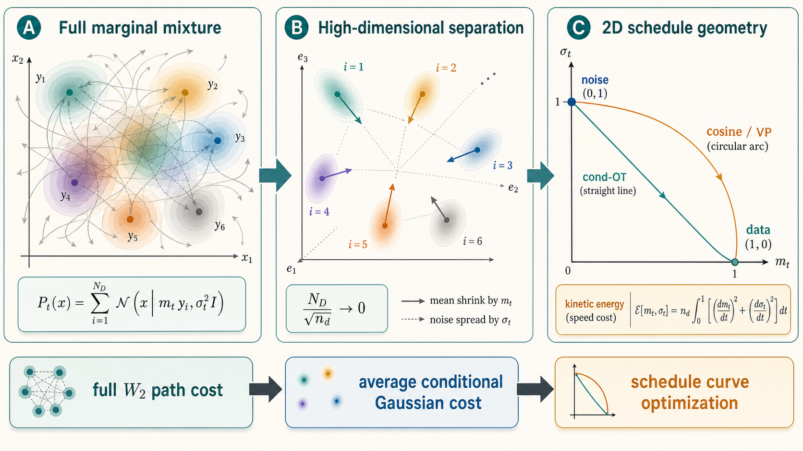

这张图的读法是：左边表示低维直觉下 mixture components 可能大量重叠，full $\mathcal{W}_2$ path cost 不能只看单个 component；中间表示高维近似下 components 更分离，overlap / coupling 变弱；右边表示在这个近似下，full cost 可以被替换成 average conditional Gaussian cost，最后降到 $(m_t,\sigma_t)$ 平面里的 schedule curve optimization。

这样 full marginal kinetic cost 就可以近似拆成 conditional costs 的平均：

$$
\text{full mixture path cost}
\approx
\text{average cost of conditional Gaussian paths}.
$$

对单个 conditional Gaussian path 来说，它只有两个 schedule degrees of freedom：mean scale $m_t$ 和 noise width $\sigma_t$。因此平均 conditional kinetic cost 就退化成

$$
n_{\mathrm d}
\int_0^\tau dt
\left[
(\partial_t m_t)^2
+
(\partial_t\sigma_t)^2
\right].
$$

这里的 $n_{\mathrm d}$ 来自“每个维度都在贡献同样类型的移动或扩散成本”。所以这个高维条件的真正作用是：把一个复杂 mixture distribution 的 $\mathcal{W}_2$ path cost，近似拆成许多几乎独立的 conditional Gaussian path costs，然后再把这些 costs 汇总成 $(m_t,\sigma_t)$ 平面里的二维 kinetic energy。

这不是说真实图像或城市数据一定严格满足 $N_{\mathrm D}/\sqrt{n_{\mathrm d}}\to0$。更准确地说，作者在这里借用一个高维理论结果，给 cond-OT / cosine schedule 的 practical suboptimality 一个可分析的近似解释：在这个近似世界里，优化 full diffusion speed cost 可以被替换为优化二维 schedule curve 的 kinetic energy。

在这个近似下，diffusion speed cost 可以写成：

$$
\int_0^\tau dt\,[v_2(t)]^2
\simeq
\tau n_{\mathrm d}\mathcal{E}_{\mathrm c}.
\tag{93}
$$

这里 $\mathcal{E}_{\mathrm c}$ 是 conditional kinetic energy。这个量不是另一个新的 loss，而是 $(m_t,\sigma_t)$ 这条 schedule curve 的平均 kinetic energy。按原文引用的高维近似，它可以读成：

$$
\mathcal{E}_{\mathrm c}
=
\frac{1}{\tau}
\int_0^\tau dt\,
\left[
(\partial_t\sigma_t)^2
+
(\partial_t m_t)^2
\right].
$$

这个公式也可以逐项理解。

第一项 $(\partial_t m_t)^2$ 来自 mean 的移动。因为 conditional mean 是 $m_t\boldsymbol{y}$，所以它的时间变化是

$$
\partial_t(m_t\boldsymbol{y})
=
(\partial_t m_t)\boldsymbol{y}.
$$

移动均值的 squared cost 会包含 $\|\boldsymbol{y}\|^2(\partial_t m_t)^2$。数据标准化后，平均 $\|\boldsymbol{y}\|^2$ 约等于 $n_{\mathrm d}$，所以它贡献一个 $n_{\mathrm d}(\partial_t m_t)^2$ 量级的成本。

第二项 $(\partial_t\sigma_t)^2$ 来自 Gaussian cloud 的扩散宽度变化。$\sigma_t$ 是每个维度的 standard deviation；如果 $\sigma_t$ 变化，每个维度都在改变 noise width。因为有 $n_{\mathrm d}$ 个维度，所以这部分也积累出 $n_{\mathrm d}(\partial_t\sigma_t)^2$ 量级的成本。

把这两个方向加起来，就得到：

$$
\begin{aligned}
\int_0^\tau dt\,[v_2(t)]^2
&\leadsto
n_{\mathrm d}
\int_0^\tau dt\\
&\quad
\left[
(\partial_t\sigma_t)^2
+
(\partial_t m_t)^2
\right].
\end{aligned}
$$

这里的箭头 $\leadsto$ 要按“近似替代”来读，不是严格恒等。左边是 full distribution path 在 $\mathcal{W}_2$ space 中的 kinetic cost；右边是 conditional Gaussian schedule 在 $(m,\sigma)$ 参数平面中的 kinetic cost，并且乘上维度因子 $n_{\mathrm d}$。

这一步很关键，因为它把抽象的 Wasserstein path optimization 降维成一个二维 schedule curve optimization。原本的问题是：

$$
\text{在所有 probability paths } \mathcal{P}_t
\text{ 中，哪条 path 最小化 }
\int_0^\tau dt\,[v_2(t)]^2?
$$

经过 conditional Gaussian / high-dimensional approximation 后，问题变成：

$$
\text{在所有 curves }(m_t,\sigma_t)
\text{ 中，哪条 curve 最小化 }
\int_0^\tau dt\,
\left[
(\partial_t\sigma_t)^2
+
(\partial_t m_t)^2
\right]?
$$

所以 Eq. (93) 的真正作用不是给出一个新的 sampler，而是给后面的 Eq. (94)-Eq. (95) 铺路。意思是：一旦 cost 被降到 $(m,\sigma)$ 平面，schedule 选择就变成一个普通的二维几何问题。

在这个二维平面里，横轴可以看成 $m$，表示还保留多少 data signal；纵轴可以看成 $\sigma$，表示加了多少 noise。forward diffusion 的起点是 data 端：

$$
(m,\sigma)=(1,0),
$$

终点是 noise 端：

$$
(m,\sigma)=(0,1).
$$

如果不额外限制 $(m,\sigma)$ 必须满足什么关系，那么从 $(1,0)$ 到 $(0,1)$ 的最短路径就是平面里的直线。并且为了最小化 squared speed cost，不仅要走直线，还要匀速走。这个“无约束平面里的匀速直线”对应的就是 cond-OT schedule。

如果要求 VP diffusion 的约束

$$
m_t^2+\sigma_t^2=1,
$$

那么 $(m_t,\sigma_t)$ 不能在整个平面里自由走，而必须待在单位圆上。从 $(1,0)$ 到 $(0,1)$ 的可行路径就不是直线，而是单位圆第一象限的圆弧。为了让 squared speed cost 最小，就要沿这个圆弧以恒定角速度走。这个“VP 约束圆上的匀角速度圆弧”对应的就是 cosine schedule。

所以这句话可以更直白地读成：

$$
\begin{aligned}
&\text{无 VP 约束}\\
&\Rightarrow \text{平面直线最短}\\
&\Rightarrow \text{cond-OT},
\end{aligned}
$$

$$
\begin{aligned}
&\text{有 VP 约束}\\
&\Rightarrow \text{只能走单位圆弧}\\
&\Rightarrow \text{cosine schedule}.
\end{aligned}
$$

如果没有额外约束，从 $(m,\sigma)=(1,0)$ 到 $(0,1)$ 的最短路径是直线。constant-speed 直线给出：

原文先写出 Cauchy--Schwarz 下界：

$$
\begin{aligned}
&n_{\mathrm d}
\int_0^\tau dt\,
\left[
(\partial_t\sigma_t)^2
+
(\partial_t m_t)^2
\right]\\
&\geq
n_{\mathrm d}
\frac{
(\sigma_0-\sigma_\tau)^2
+
(m_0-m_\tau)^2
}{\tau}.
\end{aligned}
\tag{94}
$$

这条式子就是二维版本的“固定端点时，匀速直线让 squared speed integral 最小”。它可以先拆成两个一维问题来看。

先看 $\sigma$ 方向。$\sigma_t$ 从起点 $\sigma_0$ 走到终点 $\sigma_\tau$，所以整段变化量是：

$$
\sigma_\tau-\sigma_0
=
\int_0^\tau dt\,\partial_t\sigma_t.
$$

对右边用 Cauchy--Schwarz：

$$
\left(
\int_0^\tau dt\,\partial_t\sigma_t
\right)^2
\leq
\left(
\int_0^\tau dt\,1^2
\right)
\left(
\int_0^\tau dt\,(\partial_t\sigma_t)^2
\right)
=
\tau
\int_0^\tau dt\,(\partial_t\sigma_t)^2.
$$

把左边换成 $(\sigma_\tau-\sigma_0)^2$，再除以 $\tau$，得到：

$$
\int_0^\tau dt\,(\partial_t\sigma_t)^2
\geq
\frac{(\sigma_\tau-\sigma_0)^2}{\tau}.
$$

$m$ 方向完全一样。因为

$$
m_\tau-m_0
=
\int_0^\tau dt\,\partial_t m_t,
$$

所以

$$
\int_0^\tau dt\,(\partial_t m_t)^2
\geq
\frac{(m_\tau-m_0)^2}{\tau}.
$$

把两个方向加起来，就得到 Eq. (94) 中括号里的下界。也就是说，二维 curve 的 squared speed cost

$$
\int_0^\tau dt
\left[
(\partial_t\sigma_t)^2
+
(\partial_t m_t)^2
\right]
$$

至少等于两个坐标方向端点变化量的平方和除以总时间：

$$
\int_0^\tau dt\,(\partial_t\sigma_t)^2
\geq
\frac{(\sigma_\tau-\sigma_0)^2}{\tau},
\qquad
\int_0^\tau dt\,(\partial_t m_t)^2
\geq
\frac{(m_\tau-m_0)^2}{\tau}.
$$

等号条件可以不用抽象地记“两个函数成比例”，而是直接从问题本身读出来。

先只看 $\sigma_t$。我们已经知道它必须从 $\sigma_0$ 走到 $\sigma_\tau$，所以总变化量固定：

$$
\int_0^\tau dt\,\partial_t\sigma_t
=
\sigma_\tau-\sigma_0.
$$

现在问题是：在所有满足这个总变化量的速度函数 $\partial_t\sigma_t$ 里，哪一个让

$$
\int_0^\tau dt\,(\partial_t\sigma_t)^2
$$

最小？答案是：$\partial_t\sigma_t$ 必须在每个时刻都相同。因为平方会惩罚波动；如果某些时刻比平均速度快，另一些时刻比平均速度慢，总变化量虽然不变，但平方积分会变大。

把这个 constant speed 记作 $c_\sigma$：

$$
\partial_t\sigma_t
=
c_\sigma.
$$

由于它还必须满足总变化量约束：

$$
\int_0^\tau dt\,c_\sigma
=
\tau c_\sigma
=
\sigma_\tau-\sigma_0.
$$

所以

$$
c_\sigma
=
\frac{\sigma_\tau-\sigma_0}{\tau}.
$$

因此等号成立时：

$$
\partial_t\sigma_t
=
\frac{\sigma_\tau-\sigma_0}{\tau}.
$$

$m_t$ 方向完全一样。设 constant speed 为 $c_m$：

$$
\partial_t m_t
=
c_m.
$$

总变化量要求：

$$
\int_0^\tau dt\,c_m
=
\tau c_m
=
m_\tau-m_0.
$$

所以

$$
c_m
=
\frac{m_\tau-m_0}{\tau}.
$$

也就是：

$$
\partial_t m_t
=
\frac{m_\tau-m_0}{\tau}.
$$

所以“Cauchy--Schwarz 取等号”在这里的具体含义就是：$\sigma_t$ 和 $m_t$ 都按 constant speed 从起点走到终点。不是只要求路径短，而是要求时间参数化也均匀。

在 diffusion schedule 的标准端点

$$
(m_0,\sigma_0)=(1,0),
\qquad
(m_\tau,\sigma_\tau)=(0,1)
$$

下，这就给出：

$$
m_t=1-\frac{t}{\tau},
\qquad
\sigma_t=\frac{t}{\tau}.
$$

这就是 conditional OT schedule。

如果加上 VP constraint：

$$
m_t^2+\sigma_t^2=1,
$$

路径必须在单位圆上走。这时不能再走直线，只能沿圆弧走。作者把圆弧参数化为：

$$
(m_t,\sigma_t)
=
(\cos\theta_t,\sin\theta_t).
$$

因为

$$
\partial_t m_t
=
-
(\partial_t\theta_t)\sin\theta_t,
\qquad
\partial_t\sigma_t
=
(\partial_t\theta_t)\cos\theta_t,
$$

所以

$$
(\partial_t\sigma_t)^2
+
(\partial_t m_t)^2
=
(\partial_t\theta_t)^2.
$$

因此原文得到：

$$
\begin{aligned}
&n_{\mathrm d}
\int_0^\tau dt
\left[
(\partial_t\sigma_t)^2
+
(\partial_t m_t)^2
\right]\\
&=
n_{\mathrm d}
\int_0^\tau dt\,
(\partial_t\theta_t)^2\\
&\geq
n_{\mathrm d}
\frac{
(\theta_0-\theta_\tau)^2
}{\tau}.
\end{aligned}
\tag{95}
$$

这条式子同样来自 Cauchy--Schwarz。等号成立要求 angular speed constant：

$$
\partial_t\theta_t
=
\frac{\theta_\tau-\theta_0}{\tau}.
$$

标准 VP endpoint 对应 $\theta_0=0$、$\theta_\tau=\pi/2$，因此：

$$
m_t=\cos\left(\frac{\pi t}{2\tau}\right),
\qquad
\sigma_t=\sin\left(\frac{\pi t}{2\tau}\right).
$$

这就是 cosine schedule。

所以 cond-OT 和 cosine schedule 的地位可以这样读：

它们不是完整 data distribution space 中的全局最优 transport。

它们是在 conditional Gaussian 参数空间里，把 schedule 做成尽量短、尽量匀速的工程近似。

这解释了为什么它们在实践中有效，也解释了为什么作者仍然称它们为 suboptimal：真正的 optimal protocol 应该让整体 distribution $\mathcal{P}_t$ 沿 $\mathcal{W}_2$ geodesic 走，而不是只让 conditional Gaussian 的 $(m_t,\sigma_t)$ 走直线或圆弧。

---

## 十三、non-conservative force：为什么它会让 bound 变差

如果 external force 是 conservative，它可以写成 potential 的梯度形式：

$$
\boldsymbol{f}_t(\boldsymbol{x})
=
-
\nabla U_t(\boldsymbol{x}).
$$

这意味着 force field 由一个标量函数 $U_t$ 决定。沿闭合回路走一圈时，conservative force 做的净功为零；它没有内在旋转方向。对 probability flow 来说，这种 force 更接近“沿势能地形推动 distribution 直接移动”。

如果 external force 不是 conservative，它就不能写成某个 scalar potential 的梯度。此时 velocity field 中会出现不能写成 potential gradient 的部分。直观上，它会让 probability current 出现旋转、环流或无效绕行。

一个最简单的二维例子是旋转场：

$$
\boldsymbol{f}(x,y)
=
(-y,x).
$$

这个力场会让点绕着原点转圈。它不是把点直接推向某个低势能位置，而是不断制造 rotation。对 distribution 来说，这类力会让 probability mass 在空间里绕行，而不是只做最短 transport。

原文 Swiss-roll 实验中的矩阵

$$
\begin{pmatrix}
H_t & -G_t\\
G_t & H_t
\end{pmatrix}
$$

正好体现了这个差别。$H_t$ 部分像径向收缩或扩张；$G_t$ 部分是反对称旋转项。当 $g=0$ 时，$G_t=0$，force 没有旋转成分，更接近 conservative case。当 $g>0$ 时，$G_t$ 引入旋转，force 变成 non-conservative。

在这种情况下：

$$
T_t\dot{S}^{\mathrm{tot}}_t
>
[v_2(t)]^2.
$$

也就是说，系统产生的 entropy production 不再全部用于把 distribution 从起点搬到终点；一部分被浪费在 non-conservative circulation 上。

这对 diffusion model 的含义是：如果 forward process 引入强 non-conservative force，那么它可能增加 generation 对 initial mismatch 的 sensitivity。此时仅看 $\mathcal{W}_2$ speed 不够，必须回到 general bound：

$$
\frac{1}{\tau}
\frac{(\Delta \mathcal{W}_1)^2}{D_0}
\leq
\int_0^\tau dt\,T_t\dot{S}^{\mathrm{tot}}_t.
$$

这也是文章用 stochastic thermodynamics 而不只用 optimal transport 的原因。Optimal transport 主要刻画“最短搬运路径”；entropy production 还能刻画“有多少额外的不可逆环流和耗散”。

---

## 十四、数值实验的逻辑

作者的实验不是为了展示一个新 SOTA generator，而是验证三件事：

第一，主不等式在可计算的低维例子中成立。

第二，optimal transport schedule 的 upper bound 更小，生成对初始误差更鲁棒。

第三，当加入 non-conservative force 时，entropy production bound 比单纯 Wasserstein speed 更合适。

### 14.1 一维 Gaussian mixture

作者先用一维 Gaussian mixture 作为目标数据分布：

$$
q(\boldsymbol{x})
=
\frac{1}{2}\mathcal{N}(\boldsymbol{x}\mid m^{\mathrm{a}},\sigma^2)
+
\frac{1}{2}\mathcal{N}(\boldsymbol{x}\mid m^{\mathrm{b}},\sigma^2).
\tag{96}
$$

这个例子好处是 velocity field 可以解析计算，因此可以精确比较。这里的解析 velocity 不是凭空来的，而是由 conditional Gaussian dynamics 对原始数据 $\boldsymbol{y}$ 做后验平均得到。

原文写成：

$$
\boldsymbol{\nu}^{\mathcal{P}}_t(\boldsymbol{x})
=
\frac{\partial_t\sigma_t}{\sigma_t}
\boldsymbol{x}
-
\frac{m_t}{\mathcal{P}_t(\boldsymbol{x})}
\left(
\frac{\partial_t\sigma_t}{\sigma_t}
-
\frac{\partial_t m_t}{m_t}
\right)
\mathbb{E}_{\mathcal{P}_t^{\mathrm c},q}
[
\boldsymbol{y}
].
\tag{97}
$$

这条式子的关键不是代数复杂，而是它把“给定 clean source $\boldsymbol{y}$ 的 conditional velocity”变成了“只观察 noisy position $\boldsymbol{x}$ 时的 marginal velocity”。因此推导要分三步看。

第一步，marginal distribution 是 conditional Gaussian mixture：

$$
\mathcal{P}_t(\boldsymbol{x})
=
\int d\boldsymbol{y}\,
\mathcal{P}_t^{\mathrm c}(\boldsymbol{x}\mid\boldsymbol{y})q(\boldsymbol{y}).
$$

这里 $q(\boldsymbol{y})$ 是 clean data distribution，$\mathcal{P}_t^{\mathrm c}(\boldsymbol{x}\mid\boldsymbol{y})$ 是从 clean sample $\boldsymbol{y}$ 出发，加噪到时间 $t$ 后得到 $\boldsymbol{x}$ 的 conditional Gaussian。也就是说，当前的 $\boldsymbol{x}$ 不是来自一个确定的 $\boldsymbol{y}$，而是可能来自很多 clean sources。

对每个 conditional component，有自己的 probability current：

$$
\partial_t\mathcal{P}_t^{\mathrm c}(\boldsymbol{x}\mid\boldsymbol{y})
=
-\nabla\cdot
\left[
\boldsymbol{\nu}_t^{\mathcal{P}^{\mathrm c}}(\boldsymbol{x}\mid\boldsymbol{y})
\mathcal{P}_t^{\mathrm c}(\boldsymbol{x}\mid\boldsymbol{y})
\right].
$$

把所有 $\boldsymbol{y}$ 的 conditional currents 加起来，就得到 marginal current。因此 marginal velocity 不是简单选某一个 $\boldsymbol{y}$ 的速度，而是 conditional velocity 的 posterior-weighted average：

$$
\boldsymbol{\nu}_t^{\mathcal{P}}(\boldsymbol{x})
=
\int d\boldsymbol{y}\,
\boldsymbol{\nu}_t^{\mathcal{P}^{\mathrm c}}(\boldsymbol{x}\mid\boldsymbol{y})
\frac{
\mathcal{P}_t^{\mathrm c}(\boldsymbol{x}\mid\boldsymbol{y})q(\boldsymbol{y})
}{
\mathcal{P}_t(\boldsymbol{x})
}.
$$

这里的权重

$$
r_t(\boldsymbol{y}\mid\boldsymbol{x})
=
\frac{
\mathcal{P}_t^{\mathrm c}(\boldsymbol{x}\mid\boldsymbol{y})q(\boldsymbol{y})
}{
\mathcal{P}_t(\boldsymbol{x})
}
$$

可以读成“看到 noisy position $\boldsymbol{x}$ 后，它来自 clean source $\boldsymbol{y}$ 的 posterior-like weight”。分母 $\mathcal{P}_t(\boldsymbol{x})$ 的作用只是归一化：

$$
\int d\boldsymbol{y}\,
r_t(\boldsymbol{y}\mid\boldsymbol{x})
=
1.
$$

所以 Eq. (97) 里出现 $\mathcal{P}_t(\boldsymbol{x})$，不是额外加了一个物理项，而是因为 mixture average 必须先变成对 $\boldsymbol{y}$ 的条件权重。

第二步，写出 conditional Gaussian 的 velocity。前面 schedule 的设定是：

$$
\mathcal{P}_t^{\mathrm c}(\boldsymbol{x}\mid\boldsymbol{y})
=
\mathcal{N}(\boldsymbol{x}\mid m_t\boldsymbol{y},\sigma_t^2\mathbf I).
$$

这里还需要先解释：为什么突然可以写出一个 $\boldsymbol{\nu}_t^{\mathcal{P}^{\mathrm c}}$ 的公式。它不是额外假设，而是 Fokker--Planck equation 的 probability current 定义。

原文 Eq. (1) 把 forward Fokker--Planck equation 写成 continuity equation：

$$
\partial_t\mathcal{P}_t(\boldsymbol{x})
=
-\nabla\cdot
\left[
\boldsymbol{\nu}_t^{\mathcal{P}}(\boldsymbol{x})
\mathcal{P}_t(\boldsymbol{x})
\right].
$$

这里括号里的量是 probability current：

$$
\boldsymbol{J}_t(\boldsymbol{x})
=
\boldsymbol{\nu}_t^{\mathcal{P}}(\boldsymbol{x})
\mathcal{P}_t(\boldsymbol{x}).
$$

对 overdamped Fokker--Planck dynamics，这个 current 又可以写成 drift current 加 diffusion current：

$$
\boldsymbol{J}_t(\boldsymbol{x})
=
\boldsymbol{f}_t(\boldsymbol{x})\mathcal{P}_t(\boldsymbol{x})
-
T_t\nabla\mathcal{P}_t(\boldsymbol{x}).
$$

第一项是 force / drift 把概率质量往 $\boldsymbol{f}_t$ 的方向推。第二项是 diffusion 把概率质量从高密度区域推向低密度区域，所以它带有 $-\nabla\mathcal{P}_t$。把 current 除以 density $\mathcal{P}_t$，就得到 probability-current velocity：

$$
\boldsymbol{\nu}_t^{\mathcal{P}}(\boldsymbol{x})
=
\frac{\boldsymbol{J}_t(\boldsymbol{x})}{\mathcal{P}_t(\boldsymbol{x})}
=
\boldsymbol{f}_t(\boldsymbol{x})
-
T_t
\frac{\nabla\mathcal{P}_t(\boldsymbol{x})}{\mathcal{P}_t(\boldsymbol{x})}.
$$

因为

$$
\frac{\nabla\mathcal{P}_t(\boldsymbol{x})}{\mathcal{P}_t(\boldsymbol{x})}
=
\nabla\ln\mathcal{P}_t(\boldsymbol{x}),
$$

所以

$$
\boldsymbol{\nu}_t^{\mathcal{P}}(\boldsymbol{x})
=
\boldsymbol{f}_t(\boldsymbol{x})
-
T_t\nabla\ln\mathcal{P}_t(\boldsymbol{x}).
$$

conditional density $\mathcal{P}_t^{\mathrm c}(\boldsymbol{x}\mid\boldsymbol{y})$ 也服从同一套 forward dynamics。区别只是初始条件不同：marginal density 从 data distribution $q(\boldsymbol{y})$ 出发，而 conditional density 是固定某个 clean source $\boldsymbol{y}$ 后，从一个点源出发再加噪。对固定的 $\boldsymbol{y}$，它仍然受同一个 $\boldsymbol{f}_t$ 和 $T_t$ 控制。因此直接把上面的 current velocity 定义应用到 conditional density 上：

$$
\boldsymbol{\nu}_t^{\mathcal{P}^{\mathrm c}}(\boldsymbol{x}\mid\boldsymbol{y})
=
\boldsymbol{f}_t(\boldsymbol{x})
-
T_t
\nabla_{\boldsymbol{x}}
\ln\mathcal{P}_t^{\mathrm c}(\boldsymbol{x}\mid\boldsymbol{y}).
$$

接下来把 schedule 参数化代进去。由 Eq. (23)：

$$
\boldsymbol{f}_t(\boldsymbol{x})
=
(\partial_t\ln m_t)\boldsymbol{x}
=
\frac{\partial_t m_t}{m_t}\boldsymbol{x}.
$$

由 Eq. (22)：

$$
T_t
=
\partial_t\left(\frac{\sigma_t^2}{2}\right)
-
\sigma_t^2\partial_t\ln m_t.
$$

第一项可以改写为：

$$
\partial_t\left(\frac{\sigma_t^2}{2}\right)
=
\sigma_t\partial_t\sigma_t
=
\sigma_t^2
\frac{\partial_t\sigma_t}{\sigma_t}.
$$

第二项可以改写为：

$$
\sigma_t^2\partial_t\ln m_t
=
\sigma_t^2
\frac{\partial_t m_t}{m_t}.
$$

所以 temperature / diffusion intensity 是：

$$
T_t
=
\sigma_t^2
\left(
\frac{\partial_t\sigma_t}{\sigma_t}
-
\frac{\partial_t m_t}{m_t}
\right).
$$

把 $\boldsymbol{f}_t$ 和 $T_t$ 都代回 conditional current velocity，就得到 Appendix G 使用的公式：

$$
\boldsymbol{\nu}_t^{\mathcal{P}^{\mathrm c}}(\boldsymbol{x}\mid\boldsymbol{y})
=
\frac{\partial_t m_t}{m_t}\boldsymbol{x}
-
\sigma_t^2
\left(
\frac{\partial_t\sigma_t}{\sigma_t}
-
\frac{\partial_t m_t}{m_t}
\right)
\nabla_{\boldsymbol{x}}\ln
\mathcal{P}_t^{\mathrm c}(\boldsymbol{x}\mid\boldsymbol{y}).
$$

因此，这一步的逻辑是：

$$
\begin{aligned}
&\text{Fokker--Planck current}\\
&\Rightarrow
\boldsymbol{\nu}
=
\boldsymbol{f}
-
T\nabla\ln P\\
&\Rightarrow
\text{对 conditional Gaussian density 使用同一公式}\\
&\Rightarrow
\text{代入 }(m_t,\sigma_t)\text{ schedule}.
\end{aligned}
$$

它不是从 Gaussian score 本身突然推出的；Gaussian score 只是下一步用来把 $\nabla_{\boldsymbol{x}}\ln\mathcal{P}_t^{\mathrm c}$ 具体算掉。

因此 conditional Gaussian 的 score 是：

$$
\nabla_{\boldsymbol{x}}
\ln \mathcal{P}_t^{\mathrm c}(\boldsymbol{x}\mid\boldsymbol{y})
=
-
\frac{\boldsymbol{x}-m_t\boldsymbol{y}}{\sigma_t^2}.
$$

把这个 score 代入 Appendix G 的 conditional velocity 公式：

$$
\boldsymbol{\nu}_t^{\mathcal{P}^{\mathrm c}}(\boldsymbol{x}\mid\boldsymbol{y})
=
\frac{\partial_t m_t}{m_t}\boldsymbol{x}
-
\sigma_t^2
\left(
\frac{\partial_t\sigma_t}{\sigma_t}
-
\frac{\partial_t m_t}{m_t}
\right)
\nabla_{\boldsymbol{x}}\ln
\mathcal{P}_t^{\mathrm c}(\boldsymbol{x}\mid\boldsymbol{y}),
$$

为了看清代入过程，先临时记两个系数：

$$
a_t
=
\frac{\partial_t m_t}{m_t},
\qquad
b_t
=
\frac{\partial_t\sigma_t}{\sigma_t}
-
\frac{\partial_t m_t}{m_t}.
$$

这里 $a_t$ 是 signal coefficient $m_t$ 的相对变化率，$b_t$ 是 noise scale 和 signal scale 的相对变化率之差。用这个临时记号，conditional velocity 公式变成：

$$
\boldsymbol{\nu}_t^{\mathcal{P}^{\mathrm c}}(\boldsymbol{x}\mid\boldsymbol{y})
=
a_t\boldsymbol{x}
-
\sigma_t^2 b_t
\nabla_{\boldsymbol{x}}\ln
\mathcal{P}_t^{\mathrm c}(\boldsymbol{x}\mid\boldsymbol{y}).
$$

而 conditional Gaussian score 是：

$$
\nabla_{\boldsymbol{x}}
\ln \mathcal{P}_t^{\mathrm c}(\boldsymbol{x}\mid\boldsymbol{y})
=
-
\frac{\boldsymbol{x}-m_t\boldsymbol{y}}{\sigma_t^2}.
$$

现在逐项代入。原式的第二项是：

$$
-
\sigma_t^2 b_t
\nabla_{\boldsymbol{x}}\ln
\mathcal{P}_t^{\mathrm c}(\boldsymbol{x}\mid\boldsymbol{y}).
$$

把 score 放进去：

$$
\begin{aligned}
-
\sigma_t^2 b_t
\nabla_{\boldsymbol{x}}\ln
\mathcal{P}_t^{\mathrm c}(\boldsymbol{x}\mid\boldsymbol{y})
&=
-
\sigma_t^2 b_t
\left[
-
\frac{\boldsymbol{x}-m_t\boldsymbol{y}}{\sigma_t^2}
\right]\\
&=
b_t(\boldsymbol{x}-m_t\boldsymbol{y}).
\end{aligned}
$$

这里发生了两件事。第一，原式前面的负号和 score 里的负号相乘，变成正号。第二，前面的 $\sigma_t^2$ 和分母里的 $\sigma_t^2$ 抵消。所以 diffusion/noise 项最后不是保留成 $\sigma_t^2$，而是变成一个直接作用在 displacement $\boldsymbol{x}-m_t\boldsymbol{y}$ 上的项。

因此 conditional velocity 变成：

$$
\begin{aligned}
\boldsymbol{\nu}_t^{\mathcal{P}^{\mathrm c}}(\boldsymbol{x}\mid\boldsymbol{y})
&=
a_t\boldsymbol{x}
+
b_t
(\boldsymbol{x}-m_t\boldsymbol{y})\\
&=
a_t\boldsymbol{x}
+
b_t\boldsymbol{x}
-
b_t m_t
\boldsymbol{y}.
\end{aligned}
$$

再把 $a_t$ 和 $b_t$ 展开。因为

$$
a_t+b_t
=
\frac{\partial_t m_t}{m_t}
+
\left(
\frac{\partial_t\sigma_t}{\sigma_t}
-
\frac{\partial_t m_t}{m_t}
\right)
=
\frac{\partial_t\sigma_t}{\sigma_t},
$$

所以上式可以整理成：

$$
\boldsymbol{\nu}_t^{\mathcal{P}^{\mathrm c}}(\boldsymbol{x}\mid\boldsymbol{y})
=
\frac{\partial_t\sigma_t}{\sigma_t}\boldsymbol{x}
-
m_t
\left(
\frac{\partial_t\sigma_t}{\sigma_t}
-
\frac{\partial_t m_t}{m_t}
\right)
\boldsymbol{y}.
$$

这里可以看到 Eq. (97) 的两项已经出现了：一项和当前 noisy position $\boldsymbol{x}$ 成正比，另一项和 clean source $\boldsymbol{y}$ 成正比。

第三步，对所有可能的 $\boldsymbol{y}$ 做 posterior-weighted average：

$$
\begin{aligned}
\boldsymbol{\nu}_t^{\mathcal{P}}(\boldsymbol{x})
&=
\int d\boldsymbol{y}
\left[
\frac{\partial_t\sigma_t}{\sigma_t}\boldsymbol{x}
-
m_t
\left(
\frac{\partial_t\sigma_t}{\sigma_t}
-
\frac{\partial_t m_t}{m_t}
\right)
\boldsymbol{y}
\right]
r_t(\boldsymbol{y}\mid\boldsymbol{x})\\
&=
\frac{\partial_t\sigma_t}{\sigma_t}\boldsymbol{x}
-
m_t
\left(
\frac{\partial_t\sigma_t}{\sigma_t}
-
\frac{\partial_t m_t}{m_t}
\right)
\bar{\boldsymbol{y}}_t(\boldsymbol{x}),
\end{aligned}
$$

其中

$$
\bar{\boldsymbol{y}}_t(\boldsymbol{x})
=
\int d\boldsymbol{y}\,
\boldsymbol{y}\,
r_t(\boldsymbol{y}\mid\boldsymbol{x})
=
\frac{1}{\mathcal{P}_t(\boldsymbol{x})}
\int d\boldsymbol{y}\,
\boldsymbol{y}
\mathcal{P}_t^{\mathrm c}(\boldsymbol{x}\mid\boldsymbol{y})q(\boldsymbol{y}).
$$

原文把最后一个未归一化的分子记成：

$$
\mathbb{E}_{\mathcal{P}_t^{\mathrm c},q}[\boldsymbol{y}]
:=
\int d\boldsymbol{y}\,
\boldsymbol{y}
\mathcal{P}_t^{\mathrm c}(\boldsymbol{x}\mid\boldsymbol{y})q(\boldsymbol{y}).
$$

所以

$$
\bar{\boldsymbol{y}}_t(\boldsymbol{x})
=
\frac{
\mathbb{E}_{\mathcal{P}_t^{\mathrm c},q}[\boldsymbol{y}]
}{
\mathcal{P}_t(\boldsymbol{x})
}.
$$

把这个写法代回上一行，就得到 Eq. (97)。这也解释了一个容易误解的点：$\mathbb{E}_{\mathcal{P}_t^{\mathrm c},q}[\boldsymbol{y}]$ 在原文符号里不像普通 normalized expectation，而是一个带 likelihood weight 的未归一化积分；真正的 posterior mean 是 $\bar{\boldsymbol{y}}_t(\boldsymbol{x})$。

现在再回头读 Eq. (97)，它可以分成两项。

第一项

$$
\frac{\partial_t\sigma_t}{\sigma_t}\boldsymbol{x}
$$

来自 noise scale 的变化。$\sigma_t$ 增长越快，样本位置 $\boldsymbol{x}$ 被整体向外扩散的速度越大；如果 $\sigma_t$ 下降，它也可以表示整体向内收缩。这一项不需要判断 $\boldsymbol{x}$ 来自哪个 clean component，因为它只依赖当前 noisy coordinate。

第二项

$$
-
\frac{m_t}{\mathcal{P}_t(\boldsymbol{x})}
\left(
\frac{\partial_t\sigma_t}{\sigma_t}
-
\frac{\partial_t m_t}{m_t}
\right)
\mathbb{E}_{\mathcal{P}_t^{\mathrm c},q}
[
\boldsymbol{y}
]
$$

来自 signal coefficient $m_t$ 和 noise coefficient $\sigma_t$ 的相对变化。它需要知道：当前 noisy position $\boldsymbol{x}$ 更可能来自哪个 clean data point $\boldsymbol{y}$。如果 $\boldsymbol{x}$ 位在两个 mixture peaks 之间，这个 posterior mean 会在两个 clean sources 之间折中；如果 $\boldsymbol{x}$ 明显靠近某一个 peak，它就更接近那个 peak 的 clean source。

括号里的差值

$$
\frac{\partial_t\sigma_t}{\sigma_t}
-
\frac{\partial_t m_t}{m_t}
$$

衡量的是 noise scale 和 signal scale 的相对变化速度。如果二者按同一个相对速度变化，也就是

$$
\frac{\partial_t\sigma_t}{\sigma_t}
=
\frac{\partial_t m_t}{m_t},
$$

第二项消失。直观地说，这时 signal 和 noise 只是一起做同比例缩放，conditional source ambiguity 不会额外改变 marginal velocity。只有当 noise 和 signal 的相对比例在变时，模型才需要根据 $\boldsymbol{x}$ 反推出它更可能来自哪个 clean source，并用这个 posterior source 修正速度场。

对双 Gaussian mixture，原文把这个 expectation 写成：

$$
\begin{aligned}
\mathbb{E}_{\mathcal{P}_t^{\mathrm c},q}
[
\boldsymbol{y}
]
=&
\frac{1}{2}
\frac{
\sigma^2m_t\boldsymbol{x}
+
\sigma_t^2m^{\mathrm a}\mathbf{1}
}{
\sigma_t^2+\sigma^2m_t^2
}
\mathcal{N}^{\mathrm a}\\
&+
\frac{1}{2}
\frac{
\sigma^2m_t\boldsymbol{x}
+
\sigma_t^2m^{\mathrm b}\mathbf{1}
}{
\sigma_t^2+\sigma^2m_t^2
}
\mathcal{N}^{\mathrm b}.
\end{aligned}
\tag{98}
$$

这里 $\mathcal{N}^{\mathrm a}$ 和 $\mathcal{N}^{\mathrm b}$ 表示当前 noisy position $\boldsymbol{x}$ 在两个 mixture components 下的 likelihood 权重。直观地说，Eq. (98) 在做一件事：看到 noisy sample $\boldsymbol{x}$ 后，估计它原来更可能来自左边峰还是右边峰，再把这个估计 clean source 放回 Eq. (97) 里计算 velocity。

所以 Eq. (97)-Eq. (98) 的作用是让 Fig. 6 的数值验证不依赖神经网络近似。作者可以直接计算 true forward velocity field，然后专门检验 speed-accuracy bound 本身。

有了这个解析 velocity，就可以精确比较：

$$
\eta
=
\frac{(\Delta\mathcal{W}_1)^2}{\tau D_0},
\qquad
c_1
=
\int_0^\tau dt\,[v_{\mathrm{loss}}(t)]^2,
\qquad
c_2
=
\int_0^\tau dt\,[v_2(t)]^2.
$$

理论要求：

$$
\eta\leq c_1\leq c_2.
$$

Fig. 6 不是只展示一个 density evolution。它有两层证据。

第一层是 panel (a)：直接看三种 schedule 的 forward path 和 estimated reverse path。它回答的是：不同 schedule 是否真的改变了中间生成轨迹。

第二层是 panel (b)-(e)：换四种 reverse 初始扰动，分别检查 integrated inequality 和 instantaneous inequality。它回答的是：主不等式是不是只对某一个扰动成立，还是对不同类型的 reverse error 都成立。

### Fig. 6(a)：三种 schedule 的 density path

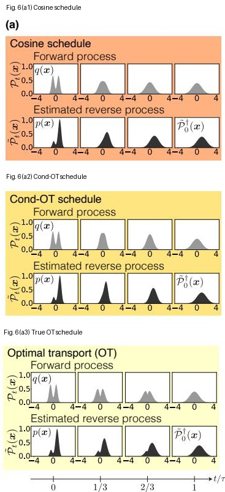

panel (a) 每一组都按同一个顺序读。上排是 forward process：从 data distribution $q(x)$ 出发，逐步走向终点 Gaussian $\mathcal{P}_{\tau}(x)=\mathcal{N}(x\mid 0,1)$。下排是 estimated reverse process：从扰动过的 reverse 初始分布 $\tilde{\mathcal{P}}_0^\dagger(x)=\mathcal{N}(x\mid 1,1)$ 出发，沿估计的 reverse velocity 往 data side 走。横向四个小框对应 $t=0,\tau/3,2\tau/3,\tau$。

cosine schedule 和 cond-OT schedule 的共同问题是：forward process 在早期就比较明显地抹平双峰结构。换句话说，数据里的 two-peak structure 很快被压成更接近单峰的形状。到了 reverse process 里，它们虽然最终也能回到类似双峰的数据形状，但双峰结构的恢复发生得比较晚，中间轨迹不够平滑。

OT schedule 的对照意义在这里。它不是因为终点不同而更好，三种 schedule 的 forward 终点都是同一个 Gaussian noise distribution。它的优势在于中间路径：双峰结构不是突然消失再突然恢复，而是在 forward 和 reverse 中更接近平稳运输。这就是前面 Wasserstein geodesic / constant-speed path 的可视化版本。

因此 panel (a) 先给一个直观判断：schedule 的差异主要体现在 path geometry，而不只是 endpoint accuracy。

### Fig. 6(b)：reverse 初始分布均值偏移

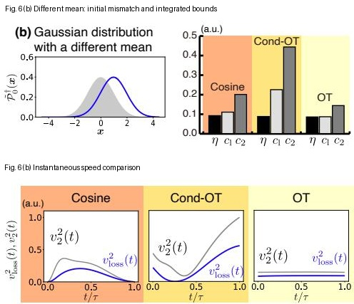

panel (b) 把 reverse 初始分布设成一个 mean shifted Gaussian。左上角蓝色曲线是 $\tilde{\mathcal{P}}_0^\dagger(x)=\mathcal{N}(x\mid 1,1)$，灰色曲线是 forward terminal distribution $\mathcal{P}_{\tau}(x)=\mathcal{N}(x\mid 0,1)$。所以这里测试的是：如果 reverse process 一开始就从“均值偏了”的 noise distribution 出发，最终误差会如何被 schedule 放大或控制。

右上角 bar graph 检查 integrated relation：

$$
\eta\leq c_1\leq c_2.
$$

在 cosine、cond-OT、OT 三组里，黑色的 $\eta$ 都小于中间 bound $c_1$，而 $c_1$ 又小于更外层的 $c_2$。这说明主不等式在 mean perturbation 下成立。

底部曲线检查 instantaneous relation：

$$
[v_{\mathrm{loss}}(t)]^2
\leq
[v_2(t)]^2.
$$

cosine 的 $v_2^2(t)$ 和 $v_{\mathrm{loss}}^2(t)$ 都集中在中间时段；cond-OT 的 bound 在后期变大；OT 的两条曲线更平、更接近。这个 panel 的信息不是“OT 的 final sample 肉眼上一定差很多”，而是“OT 的 error-speed bound 更紧，误差增长更接近 constant-speed control”。

### Fig. 6(c)：reverse 初始分布方差偏移

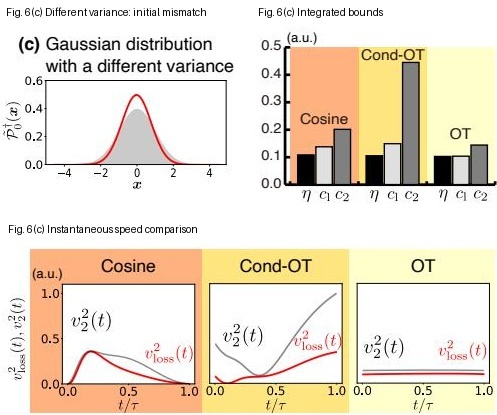

panel (c) 换成 variance perturbation。左上角红色曲线和灰色 Gaussian 的中心相同，但宽度不同。因此这里不是测试 mean shift，而是测试 reverse 起点的 scale / spread 错了会怎样。

这个 panel 的读法和 panel (b) 一样。右上角 bar graph 仍然显示：

$$
\eta\leq c_1\leq c_2.
$$

底部曲线也仍然满足：

$$
[v_{\mathrm{loss}}(t)]^2
\leq
[v_2(t)]^2.
$$

但它补充了一个重要点：speed-accuracy relation 不是只控制位置偏移误差，也能控制 scale mismatch。也就是说，reverse 初始 distribution 的错误可以是“整体挪错了”，也可以是“宽窄错了”。两种情况下，forward path 的 speed cost 仍然给出 reverse sensitivity 的上界。

### Fig. 6(d)：reverse 初始分布是 Gaussian mixture

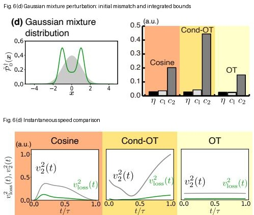

panel (d) 更进一步，把 reverse 初始扰动换成 Gaussian mixture。绿色曲线不是单个 Gaussian，而是多峰结构；灰色曲线仍然是标准 Gaussian terminal distribution。这个设置测试的是：如果 reverse 起点的错误不是简单的均值或方差偏差，而是形状结构本身变复杂，speed-accuracy relation 是否还成立。

右上角 bar graph 显示 integrated inequality 依然成立。底部时间曲线也显示 local inequality 依然成立。这里的重点是 robustness：Eq. (83) 和 Eq. (80) 不要求 reverse 初始误差必须是 Gaussian-like small perturbation。只要用同一套 forward velocity 和同一套 divergence / Wasserstein error 定义，非 Gaussian 的 reverse perturbation 也可以放进同一个 bound 里。

这个 panel 也解释了为什么作者要在 Fig. 6(b)-(e) 里换多种 $\tilde{\mathcal{P}}_0^\dagger$。如果只看 panel (b)，读者可能会以为结果只是 mean-shift toy case；panel (d) 说明 bound 对 distribution shape error 也有效。

### Fig. 6(e)：reverse 初始分布是 uniform distribution

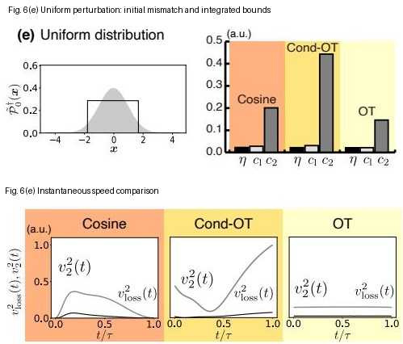

panel (e) 使用 uniform distribution 作为 reverse 初始扰动。它比 Gaussian mixture 更极端，因为它有 sharp support boundary，不再是 smooth Gaussian tail。这个设置测试的是：当 reverse 起点在形状上明显不像 terminal Gaussian 时，数值关系是否仍然稳定。

结果和前面一致：bar graph 仍然满足 $\eta\leq c_1\leq c_2$，底部曲线仍然满足 $[v_{\mathrm{loss}}(t)]^2\leq [v_2(t)]^2$。这说明作者不是只验证了一个“好看的”perturbation，而是在 mean、variance、mixture、uniform 四类 perturbation 下重复检查了同一组理论关系。

### Fig. 6 的结论怎么读

Fig. 6 的主结论不是“OT 在一维 Gaussian mixture 上把 sample 质量提升了很多”。作者反而提醒：这个例子太简单，OT 的 final response improvement 没有比 cosine 和 cond-OT 大到数量级差异。

真正要读出的结论有三层。

第一，panel (a) 说明 schedule 改变的是整条 path 的 geometry。cosine 和 cond-OT 并非失效，但它们在中间时间对双峰结构的破坏和恢复更不均匀；OT 更接近平滑运输。

第二，panel (b)-(e) 说明主不等式不是单一扰动下的巧合。不同 reverse 初始扰动下，$\eta\leq c_1\leq c_2$ 都成立，且 local relation $[v_{\mathrm{loss}}(t)]^2\leq [v_2(t)]^2$ 也成立。

第三，$c_2=\int_0^\tau dt\,[v_2(t)]^2$ 只依赖 forward process，所以同一个 schedule 下，不同 perturbation 的 $c_2$ 应该保持一致；$\eta$ 则依赖具体 reverse 起点，因此会随 panel (b)-(e) 的 perturbation 类型变化。这正好对应理论分工：forward path 给出 sensitivity 上界，具体 reverse perturbation 决定实际 response。

Table I 进一步给出 $\eta$ 的数值。四种扰动里，OT 的 $\eta$ 都最小，但差距不大：

| Reverse initial perturbation | Cosine | Cond-OT | OT |
|---|---:|---:|---:|
| Different mean | $9.188\times10^{-2}$ | $8.781\times10^{-2}$ | $8.537\times10^{-2}$ |
| Different variance | $1.078\times10^{-1}$ | $1.047\times10^{-1}$ | $1.022\times10^{-1}$ |
| Gaussian mixture | $2.764\times10^{-2}$ | $2.674\times10^{-2}$ | $2.611\times10^{-2}$ |
| Uniform | $2.142\times10^{-2}$ | $2.068\times10^{-2}$ | $2.033\times10^{-2}$ |

所以作者的态度是谨慎的：OT schedule 的 bound 更紧、$\eta$ 也更小，这支持 speed-accuracy relation 的方向；但一维双峰例子太简单，不能把它读成“OT 一定在所有任务上显著提升 final quality”。这为后面的 Swiss-roll 和 image experiments 留出空间。

### 14.2 二维 Swiss-roll 与 non-conservative force

第二个实验使用 Swiss-roll dataset，并显式引入 non-conservative force：

$$
\begin{aligned}
\boldsymbol{f}_t(\boldsymbol{x})
&=
\begin{pmatrix}
H_t & -G_t\\
G_t & H_t
\end{pmatrix}
\boldsymbol{x},\\
H_t
&=
-h\left(1-\frac{t}{\tau}\right)
-
T_t,\\
G_t
&=
g\left(1-\frac{t}{\tau}\right),\\
T_t
&=
T_{\mathrm{fin}}
\left(\frac{t}{\tau}\right)^2.
\end{aligned}
\tag{99}
$$

这个矩阵可以拆成两部分：

$$
\begin{pmatrix}
H_t & 0\\
0 & H_t
\end{pmatrix}
+
\begin{pmatrix}
0 & -G_t\\
G_t & 0
\end{pmatrix}.
$$

第一部分是 isotropic contraction / expansion。它只按径向缩放 $\boldsymbol{x}$，不会引入旋转。

第二部分是 rotation generator。因为

$$
\begin{pmatrix}
0 & -G_t\\
G_t & 0
\end{pmatrix}
\begin{pmatrix}
x_1\\
x_2
\end{pmatrix}
=
\begin{pmatrix}
-G_tx_2\\
G_tx_1
\end{pmatrix},
$$

它会把向量转向切向方向，制造绕原点的 circulation。

因此 $g$ 控制 non-conservativity。$g=0$ 时 $G_t=0$，force 没有旋转部分，更接近 conservative case；$g>0$ 时，$G_t$ 引入旋转 current。这个旋转并不直接缩短 data-to-noise transport path，却会增加 entropy production，所以它正好用来测试 general bound Eq. (77)，而不是只测试 conservative bound Eq. (79)。

Fig. 7 的作用是把 Fig. 6 的一维验证推进到一个更难的情形。Fig. 6 主要说明：不同 schedule 会改变 path geometry，speed-accuracy inequality 在多种 reverse 初始扰动下成立。Fig. 7 则进一步问：如果 forward dynamics 里存在 non-conservative circulation，只看 Wasserstein displacement speed 是否还够？还是必须使用更一般的 entropy-production cost？

这张图要按四步读：

$$
\begin{aligned}
&\text{设定 non-conservative strength}\\
&\to \text{观察 Swiss-roll density path}\\
&\to \text{检查 instantaneous bound}\\
&\to \text{检查 integrated response}.
\end{aligned}
$$

先看实验设置。作者固定

$$
h=1.1,
\qquad
T_{\mathrm{fin}}=0.5,
\qquad
g\in\{0,3,5\}.
$$

reverse process 的初始分布不是正好等于 forward terminal distribution，而是使用一个 variance perturbation：

$$
\tilde{\mathcal{P}}_0^\dagger(\boldsymbol{x})
=
\mathcal{N}(\boldsymbol{0},0.9^2\mathbf I).
$$

这样做的目的和 Fig. 6 一样：故意给 reverse generation 一个初始误差，然后看这个误差在不同 schedule / force 下会被放大多少。

### Fig. 7(a)-(d)：先看 density path，而不是先看 bar graph

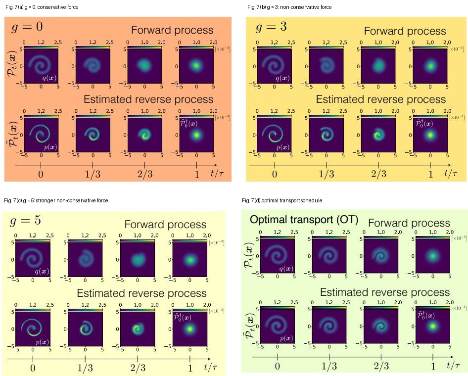

Fig. 7(a)-(d) 的版式是固定的。每个 panel 上排是 forward process，下排是 estimated reverse process。横向四个时间点是：

$$
t=0,\quad \tau/3,\quad 2\tau/3,\quad \tau.
$$

上排的起点是 training data $q(\boldsymbol{x})$，也就是 Swiss-roll。随着 forward time 增大，它被扩散到接近 Gaussian noise。下排的起点是 estimated reverse process 最终生成出来的分布 $p(\boldsymbol{x})$，右端对应扰动过的 reverse 初始 noise distribution $\tilde{\mathcal{P}}_0^\dagger(\boldsymbol{x})$。图中仍然用 forward time $t$ 来排列，所以读下排时要记住：它是在展示 reverse dynamics 对应到 forward-time 坐标后的整条路径。

这里的数据不是一维双峰，而是二维 Swiss-roll。颜色图的两个坐标轴就是 data space $\mathbb{R}^2$ 的两个坐标。读图时不要只看最后的生成样本，还要看中间时间的形状如何被搬运、扩散和恢复，因为本文讨论的是 path cost，不只是 endpoint quality。

panel (a) 是 $g=0$。这时 force 没有旋转项，所以是 conservative external force。forward process 会把 Swiss-roll 逐渐扩散成接近 Gaussian 的 blob；estimated reverse process 试图从扰动过的 Gaussian 起点回到 Swiss-roll。但下排生成出来的 $p(\boldsymbol{x})$ 和上排原始 $q(\boldsymbol{x})$ 已经有明显差异：roll 的细长结构没有很好恢复。

这个点很关键：$g=0$ 只是 conservative，不等于 optimal。它满足没有 non-conservative circulation，但它的 path 仍然可以离最优 transport path 很远。因此 conservative schedule 仍然可能产生较高的 sensitivity。

panel (b) 和 panel (c) 分别是 $g=3$ 和 $g=5$。随着 $g$ 增大，force 里的旋转分量更强。forward path 中 Swiss-roll 不只是被扩散，还受到旋转 current 的影响；reverse path 中结构恢复更不稳定。直观地说，non-conservative force 把 probability mass 带上了额外的环流路线。这种环流会增加耗散，但不直接帮助把 data distribution 以更短路径送到 noise distribution。

panel (d) 是 optimal transport schedule。和 $g=0,3,5$ 相比，OT 的 forward path 更像是把 Swiss-roll 结构平滑地运输到 Gaussian，estimated reverse path 也更好地恢复了 training data 的 roll structure。这个 panel 的作用是给出视觉对照：如果 path 接近 optimal transport，同样的 reverse 初始误差会造成更小的生成偏差。

所以 Fig. 7(a)-(d) 的第一层结论是：二维 Swiss-roll 比一维 Gaussian mixture 更能放大 schedule 差异。Fig. 6 里 OT 的 final response improvement 不大；Fig. 7 里，OT 和非 OT schedules 的视觉差异已经明显得多。

### Fig. 7(e)：再看 local bound，解释为什么要用 entropy production

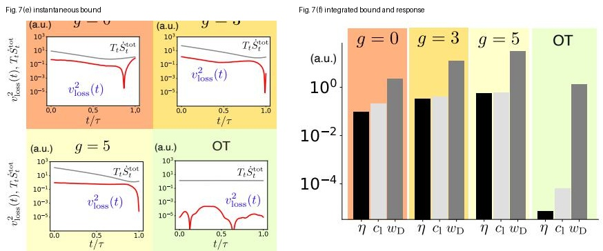

看完 density path 之后，下一步才是问：这些视觉差异能不能被理论 bound 解释？Fig. 7(e) 检查的是 local / instantaneous inequality：

$$
[v_{\mathrm{loss}}(t)]^2
\leq
T_t\dot{S}^{\mathrm{tot}}_t.
$$

这里右侧不是 $[v_2(t)]^2$，而是 entropy-production cost $T_t\dot{S}^{\mathrm{tot}}_t$。原因是 Fig. 7 专门引入了 non-conservative force。当 force 有旋转 current 时，distribution 的 Wasserstein displacement speed 不能完全记录所有耗散。probability mass 可以在局部绕圈，endpoint displacement 不一定增加很多，但 path irreversibility 会增加。这部分额外代价需要由 entropy production 记录。

panel (e) 的四个小图分别对应 $g=0,3,5$ 和 OT。每个小图里，$T_t\dot{S}^{\mathrm{tot}}_t$ 是上界曲线，$[v_{\mathrm{loss}}(t)]^2$ 是误差速度曲线。图上要看的不是某个时刻的具体数值，而是整段时间里误差速度是否始终被 entropy-production cost 压住。

结果是：四种 schedule 下都有

$$
[v_{\mathrm{loss}}(t)]^2
\leq
T_t\dot{S}^{\mathrm{tot}}_t.
$$

这说明 Eq. (80) 在二维 Swiss-roll、score-estimated velocity、non-conservative force 的设置下仍然成立。

这里也把 Fig. 7 和 Fig. 6 区分开了。Fig. 6 主要在一维 conservative / OT geometry 中比较 $[v_2(t)]^2$ 和 $[v_{\mathrm{loss}}(t)]^2$。Fig. 7 则说明：一旦加入 non-conservative force，真正控制 reverse sensitivity 的是更一般的 entropy-production cost。

### Fig. 7(f)：最后用 integrated bound 闭合结论

Fig. 7(f) 把 Fig. 7(e) 里的瞬时关系压缩成三个积分量，检查：

$$
\eta
\leq
c_1
\leq
w_D,
$$

其中

$$
\eta
=
\frac{(\Delta\mathcal{W}_1)^2}{\tau D_0},
\qquad
c_1
=
\int_0^\tau dt\,[v_{\mathrm{loss}}(t)]^2,
\qquad
w_D
=
\int_0^\tau dt\,T_t\dot{S}^{\mathrm{tot}}_t.
$$

这三个量分别对应三层意思。

第一，$\eta$ 是实际 response。它衡量 reverse 初始扰动最后造成了多大 Wasserstein error change。

第二，$c_1$ 是 error-speed 的累计量。它比 $\eta$ 更接近 proof 里的中间 bound。

第三，$w_D$ 是 forward dynamics 的 thermodynamic cost。它只看 forward protocol 的耗散代价，用来给 reverse sensitivity 提供上界。

Fig. 7(f) 的纵轴是 log scale。每组有三根 bar：黑色是 $\eta$，浅灰是 $c_1$，深灰是 $w_D$。读这个图时先在每组内部看 hierarchy：

$$
\eta
\leq
c_1
\leq
w_D.
$$

这个 hierarchy 在 $g=0,3,5$ 和 OT 四组里都成立。然后再横向比较不同 protocol：随着 $g$ 从 $0$ 增加到 $3$、$5$，$w_D$ 明显升高，$\eta$ 也升高。这正是文章想强调的 trade-off：forward process 里引入更强的 non-conservative circulation，会带来更高 entropy production，也会让 reverse generation 对初始误差更敏感。

作者报告的 response function $\eta$ 为：

| schedule / force | $\eta$ |
|---|---:|
| $g=0$ | $9.301\times 10^{-2}$ |
| $g=3$ | $3.430\times 10^{-1}$ |
| $g=5$ | $5.615\times 10^{-1}$ |
| OT | $7.221\times 10^{-6}$ |

这个表有两个读法。

第一，纵向比较 $g=0,3,5$。non-conservative force 越强，$\eta$ 越大。也就是说，旋转式 probability current 确实提高了 generation sensitivity。

第二，比较 $g=0$ 和 OT。即使 $g=0$ 是 conservative，它的 $\eta$ 仍然远大于 OT。这说明“conservative”只是去掉旋转耗散，不自动等于“optimal”。真正降低 response 的，是 forward path 接近最小耗散 / optimal transport path。

Fig. 7 的线性结论可以写成：

$$
\begin{aligned}
&\text{stronger non-conservative circulation}\\
&\to \text{larger entropy-production cost}\\
&\to \text{larger reverse sensitivity}\\
&\to \text{worse recovery of Swiss-roll structure}.
\end{aligned}
$$

反过来，OT schedule 给出的链条是：

$$
\begin{aligned}
&\text{near-optimal transport path}\\
&\to \text{smaller thermodynamic cost}\\
&\to \text{smaller response}\\
&\to \text{better recovery of training structure}.
\end{aligned}
$$

这就是 Fig. 7 相比 Fig. 6 更强的地方：它不仅验证 inequality，还把 non-conservative dissipation、path cost 和 generation robustness 三者连成了一条可见的因果链。

### 14.3 真实图像 latent diffusion / flow matching

Fig. 8 是数值实验的第三层。Fig. 6 证明主不等式不是纯理论形式，在一维可解析 toy example 里能算。Fig. 7 证明当存在 non-conservative force 时，entropy-production cost 能解释更差的 robustness。Fig. 8 则回答最后一个问题：这套 speed-accuracy relation 是否能放到真实图像生成模型里计算，而不只是低维 toy data？

这张图要按三步读：

$$
\begin{aligned}
&\text{把真实图像转到 latent space}\\
&\to \text{观察 forward / estimated reverse samples}\\
&\to \text{在 latent space 中计算 }\eta\text{ 和 }c_2.
\end{aligned}
$$

作者使用的是已有 trained flow matching model，而不是在本文里重新训练一个 SOTA image generator。两个数据集是 downscaled CelebA-HQ 和 LSUN bedrooms。图像不是直接在 pixel space 中做 diffusion，而是先被表示到 latent space，latent dimension 是：

$$
n_{\mathrm{d}}=4096.
$$

这个选择很关键。Pixel space 的维度太高，直接估计 density path、Wasserstein distance、Pearson divergence 都很困难；latent space 仍然高维，但比 raw image space 更可操作。也就是说，Fig. 8 的目标不是展示视觉质量评价，而是展示本文的 relation 在 practical latent diffusion / latent flow matching setting 中仍然能被数值估计。

### Fig. 8(a)-(b)：先看真实图像样本轨迹

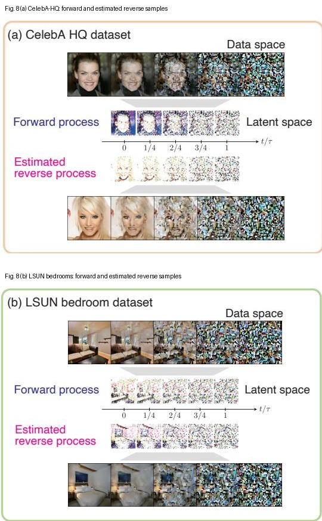

panel (a) 是 CelebA-HQ，panel (b) 是 LSUN bedrooms。两个 panel 的结构相同。

最上方的 data-space row 展示 forward process 的视觉效果：从可辨认的真实图像出发，随着 diffusion time 增加，图像逐渐失去语义结构，最后接近 noise-like image。对于 CelebA-HQ，这意味着人脸结构逐渐被破坏；对于 LSUN bedrooms，这意味着房间布局、床、墙面等空间结构逐渐消失。

中间的 latent-space strip 是真正发生动力学计算的地方。模型的 velocity field 作用在 latent variable 上，而不是直接作用在 pixel image 上。图中把 latent process 以可视化方式展示出来，是为了帮助读者看到 forward process 和 estimated reverse process 的时间方向；但理论量 $\eta$ 和 $c_2$ 的计算发生在 latent coordinates 中。

下方的 estimated reverse process 展示从 standard Gaussian latent noise 出发，沿 learned reverse velocity 回到 image-like samples 的过程。对 CelebA-HQ，reverse path 逐渐恢复出人脸；对 LSUN bedrooms，reverse path 逐渐恢复出卧室场景。这里要注意：这些图片只是说明模型确实在做真实图像生成任务，不是 Fig. 8 的主要定量证据。真正的定量证据在 panel (c)。

panel (a)-(b) 的作用因此是建立“实验不是低维 toy data”的语境：

$$
\begin{aligned}
&\text{real images}\\
&\to \text{latent representation}\\
&\to \text{latent forward / reverse flow}\\
&\to \text{decoded visual samples}.
\end{aligned}
$$

如果只看 data-space images，容易误以为作者在 pixel space 上直接验证不等式。实际上，Fig. 8 的核心是 latent-space verification。

### Fig. 8(c)：再看 latent-space speed-accuracy bound

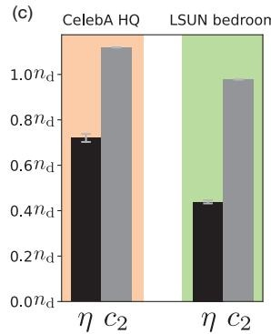

panel (c) 检查的是 conservative / OT-style relation：

$$
\eta
\leq
c_2.
$$

这里

$$
\eta
=
\frac{(\Delta\mathcal{W}_1)^2}{\tau D_0},
\qquad
c_2
=
\int_0^\tau dt\,[v_2(t)]^2.
$$

这两个量的角色不同。$\eta$ 是 actual response：reverse 初始分布和真实 forward terminal distribution 的差异，最后造成多大的 generation error change。$c_2$ 是 forward path cost：它只依赖 forward velocity field 的 squared speed integral。

在 trained flow matching model 中，作者把 learned forward velocity 记为 $\boldsymbol{u}^{\theta^*}_t(\boldsymbol{x})$。forward latent trajectory 由

$$
\partial_t\boldsymbol{x}_t
=
\boldsymbol{u}^{\theta^*}_t(\boldsymbol{x}_t)
$$

给出，estimated reverse trajectory 由

$$
\partial_{\tilde t}\tilde{\boldsymbol{x}}_{\tilde t}^{\dagger}
=
-
\boldsymbol{u}^{\theta^*}_{\tau-\tilde t}
\left(
\tilde{\boldsymbol{x}}_{\tilde t}^{\dagger}
\right)
$$

给出。estimated reverse process 的初始 latent samples 来自 standard Gaussian：

$$
\tilde{\boldsymbol{x}}_0^\dagger
\sim
\mathcal{N}(\boldsymbol{0},\mathbf I).
$$

对 $c_2$，作者使用 Appendix G 的 Eq. (G20) 作为 empirical estimator：

$$
c_2
=
\int_0^\tau dt
\int d\boldsymbol{x}\,
\left\|
\boldsymbol{u}^{\theta^*}_t(\boldsymbol{x})
\right\|^2
\mathcal{P}_t(\boldsymbol{x})
=
\tau
\mathbb{E}_{\mathcal U,\mathcal{P}_t}
\left[
\left\|
\boldsymbol{u}^{\theta^*}_t(\boldsymbol{x})
\right\|^2
\right].
$$

这个式子说明 $c_2$ 不要求显式知道高维 density $\mathcal{P}_t(\boldsymbol{x})$ 的 closed form。原因是右边本质上是一个 expectation，而 expectation 可以用 samples 估计。

先把 $c_2$ 拆成两层平均。第一层是在时间上积分：

$$
c_2
=
\int_0^\tau dt\,
\mathbb{E}_{\boldsymbol{x}\sim\mathcal{P}_t}
\left[
\left\|
\boldsymbol{u}^{\theta^*}_t(\boldsymbol{x})
\right\|^2
\right].
$$

第二层是在每个时间 $t$，对当时 forward distribution $\mathcal{P}_t$ 下的 latent points 求平均。也就是说，如果我们能在时间 $t$ 采到很多 forward latent samples

$$
\boldsymbol{x}^{(1)}_t,
\boldsymbol{x}^{(2)}_t,
\ldots,
\boldsymbol{x}^{(M)}_t
\sim
\mathcal{P}_t,
$$

那么当时的 expectation 可以近似为：

$$
\mathbb{E}_{\boldsymbol{x}\sim\mathcal{P}_t}
\left[
\left\|
\boldsymbol{u}^{\theta^*}_t(\boldsymbol{x})
\right\|^2
\right]
\approx
\frac{1}{M}
\sum_{i=1}^{M}
\left\|
\boldsymbol{u}^{\theta^*}_t
\left(
\boldsymbol{x}^{(i)}_t
\right)
\right\|^2.
$$

再处理时间积分。Appendix G 把 $t$ 看成从 $[0,\tau]$ 均匀抽样的随机变量，即

$$
t
\sim
\mathcal{U}(0,\tau).
$$

如果每次随机抽一个时间 $t_j$，再沿 forward process 采一个 latent point $\boldsymbol{x}_{t_j}^{(j)}\sim\mathcal{P}_{t_j}$，那么

$$
c_2
\approx
\frac{\tau}{M}
\sum_{j=1}^{M}
\left\|
\boldsymbol{u}^{\theta^*}_{t_j}
\left(
\boldsymbol{x}_{t_j}^{(j)}
\right)
\right\|^2.
$$

这就是 Monte Carlo 估计的含义。我们不需要把 $\mathcal{P}_t(\boldsymbol{x})$ 的高维 density 写出来，只需要能做两件事：第一，沿 forward process 生成 latent samples；第二，把这些 samples 输入 learned velocity field，计算 $\|\boldsymbol{u}^{\theta^*}_t(\boldsymbol{x})\|^2$。大量 sample 的平均值乘上 $\tau$，就近似原来的 time-space integral。

对 $\eta$，难点在 $D_0$。理论上

$$
D_0
=
\int d\boldsymbol{x}\,
\frac{
\left(
\mathcal{P}_0^\dagger(\boldsymbol{x})
-
\tilde{\mathcal{P}}_0^\dagger(\boldsymbol{x})
\right)^2
}{
\mathcal{P}_0^\dagger(\boldsymbol{x})
}
$$

是 Pearson $\chi^2$-type divergence。在 high-dimensional latent space 里直接估计这个量不稳定。作者因此使用 Appendix G 的 Eq. (G21) 作为小扰动近似。这个近似可以直接从 Taylor expansion 看出来。

为了简化符号，先记

$$
P(\boldsymbol{x})
=
\mathcal{P}_0^\dagger(\boldsymbol{x}),
\qquad
\tilde P(\boldsymbol{x})
=
\tilde{\mathcal{P}}_0^\dagger(\boldsymbol{x}).
$$

两者很接近，表示成：

$$
\tilde P(\boldsymbol{x})
=
P(\boldsymbol{x})
+
\delta P(\boldsymbol{x}).
$$

因为二者都是 normalized probability density，所以

$$
\int d\boldsymbol{x}\,\delta P(\boldsymbol{x})
=
0.
$$

这句话很重要：它会让 KL expansion 里的 first-order term 消失。

KL divergence 是：

$$
D_{\mathrm{KL}}(P\Vert\tilde P)
=
\int d\boldsymbol{x}\,
P(\boldsymbol{x})
\ln
\frac{P(\boldsymbol{x})}{\tilde P(\boldsymbol{x})}.
$$

把 $\tilde P=P+\delta P$ 代进去：

$$
\ln
\frac{P}{\tilde P}
=
\ln
\frac{P}{P+\delta P}
=
-
\ln
\left(
1+\frac{\delta P}{P}
\right).
$$

当 $\delta P/P$ 很小时，使用 Taylor expansion：

$$
\ln(1+\epsilon)
=
\epsilon
-
\frac{1}{2}\epsilon^2
+
O(\epsilon^3).
$$

令

$$
\epsilon
=
\frac{\delta P}{P},
$$

得到：

$$
\ln
\frac{P}{\tilde P}
=
-
\frac{\delta P}{P}
+
\frac{1}{2}
\left(
\frac{\delta P}{P}
\right)^2
+
O\left[
\left(
\frac{\delta P}{P}
\right)^3
\right].
$$

再乘上 $P$ 并积分：

$$
\begin{aligned}
D_{\mathrm{KL}}(P\Vert\tilde P)
&=
\int d\boldsymbol{x}\,
P
\left[
-
\frac{\delta P}{P}
+
\frac{1}{2}
\left(
\frac{\delta P}{P}
\right)^2
+
O\left(
\left(
\frac{\delta P}{P}
\right)^3
\right)
\right]\\
&=
-
\int d\boldsymbol{x}\,\delta P
+
\frac{1}{2}
\int d\boldsymbol{x}\,
\frac{(\delta P)^2}{P}
+
O[(\delta P)^3].
\end{aligned}
$$

第一项为零，因为 $\int \delta P=0$。第二项正是 Pearson $\chi^2$-type divergence：

$$
D_0
=
\int d\boldsymbol{x}\,
\frac{(\delta P)^2}{P}.
$$

所以当 $\mathcal{P}_0^\dagger$ 和 $\tilde{\mathcal{P}}_0^\dagger$ 很接近时，KL divergence 和 Pearson divergence 在二阶近似下满足：

$$
D_{\mathrm{KL}}
\left(
\mathcal{P}_0^\dagger
\Vert
\tilde{\mathcal{P}}_0^\dagger
\right)
=
\frac{1}{2}D_0
+
O\left[
\left(
\delta\mathcal{P}_0^\dagger
\right)^3
\right].
$$

这个近似的含义是：在 very small distribution mismatch 附近，KL 和 Pearson divergence 都在测量同一个二阶局部距离，只是系数差了 $1/2$。因此可以用

$$
D_0
\approx
2D_{\mathrm{KL}}
\left(
\mathcal{P}_0^\dagger
\Vert
\tilde{\mathcal{P}}_0^\dagger
\right)
$$

来估计 response function 里的 normalization factor。

这样做的原因很实际。高维 Gaussian 之间的 KL divergence 有 closed form，只需要 mean 和 covariance：

$$
D_{\mathrm{KL}}
\left(
\mathcal{N}_0
\Vert
\mathcal{N}_1
\right)
=
\frac{1}{2}
\left[
\operatorname{tr}
\left(
\Sigma_1^{-1}\Sigma_0
\right)
+
(\mu_1-\mu_0)^\top
\Sigma_1^{-1}
(\mu_1-\mu_0)
-
d
+
\ln
\frac{\det\Sigma_1}{\det\Sigma_0}
\right].
$$

相比之下，直接估计 $\chi^2$ divergence 需要在高维空间里估计 density ratio：

$$
\frac{
\tilde P(\boldsymbol{x})-P(\boldsymbol{x})
}{
P(\boldsymbol{x})
}.
$$

这个 ratio 在高维下很容易因为 tail samples、有限样本密度估计误差或 $P(\boldsymbol{x})$ 很小的区域而变得不稳定。KL 的 Gaussian closed form 避开了这个问题。

作者还假设相关 Gaussian covariance 和 identity matrix 成比例。这个假设把 covariance 从完整高维矩阵简化成 scalar variance：

$$
\Sigma
=
s^2\mathbf I.
$$

这样可以避免估计、求逆和取 determinant 一个 $4096\times4096$ covariance matrix。换句话说，这不是一个新的理论假设，而是为了让 high-dimensional latent-space diagnostic 在有限样本下数值可行。

panel (c) 的 bar graph 展示了两个数据集上的结果。每个数据集有两根 bar：黑色是 $\eta$，灰色是 $c_2$。误差条来自 5 次计算，每次使用 $3\times10^4$ 个 latent samples。

图中要看的第一件事是 inequality：

$$
\eta
\leq
c_2.
$$

CelebA-HQ 和 LSUN bedrooms 两组都满足这个关系。这说明 Eq. (79) 不只在 toy examples 里成立，也能在真实图像 latent space 中被数值验证。

第二件事是量级。$\eta$ 和 $c_2$ 没有相差到完全失去意义的程度。也就是说，这个 upper bound 不是一个纯形式上永远成立但极其松的界；在这个实验设置中，它仍然保留了一定的定量解释力。

### Fig. 8 的结论边界

Fig. 8 的结论不是“这个 bound 可以替代 FID、CLIP score 或人类偏好评价”。它验证的是另一件事：在真实图像 latent diffusion / flow matching model 中，本文的 speed-accuracy relation 有可计算性。

它的线性逻辑是：

$$
\begin{aligned}
&\text{trained latent flow model gives a velocity field}\\
&\to \text{forward and reverse trajectories can be sampled}\\
&\to c_2 \text{ can be estimated from velocity norms}\\
&\to \eta \text{ can be estimated from latent distribution mismatch}\\
&\to \eta\leq c_2\\
&\quad \text{can be checked on real image datasets}.
\end{aligned}
$$

因此，Fig. 8 把本文从 low-dimensional validation 推到 practical model diagnostics：即使我们不能完整重建 high-dimensional density path，也可以用 sampled trajectories 和 learned velocity field 去估计 speed-accuracy quantities。

---

## 十五、incomplete estimation：如果 velocity field 没学准怎么办

主结果假设 velocity field 准确重构：

$$
\hat{\boldsymbol{\nu}}_t
=
\boldsymbol{\nu}^{\mathcal{P}}_t.
$$

实际训练中，这个条件一般不完全成立。作者在 discussion 中给出一个 generalized bound：

$$
\frac{|\Delta \mathcal{W}_1|}{\sqrt{\tau D_{\max}}}
\leq
\sqrt{
\int_0^\tau dt\,T_t\dot{S}^{\mathrm{tot}}_t
}
+
\sqrt{1+\frac{1}{D_{\max}}}
\sqrt{\tau L_\alpha(\theta_\alpha^*)}.
\tag{100}
$$

这里 $L_\alpha(\theta_\alpha^*)$ 是训练后的 objective function residual，可以对应 score matching 或 flow matching loss。$D_{\max}$ 是整个过程中 Pearson divergence 的最大值。

这条式子非常关键，因为它把实际 diffusion model 的误差拆成两部分。为了看清它和 Eq. (77) 的关系，先把左边读出来：

$$
\frac{|\Delta \mathcal{W}_1|}{\sqrt{\tau D_{\max}}}.
$$

它仍然是在度量 normalized generation sensitivity，只是从 $(\Delta\mathcal{W}_1)^2/(\tau D_0)$ 的平方形式，变成了取平方根后的形式，并且把 $D_0$ 换成了整个过程中可能出现的最大 mismatch：

$$
D_{\max}
:=
\max_{t\in[0,\tau]}D_t.
$$

为什么要用 $D_{\max}$？因为 velocity field 没学准时，两个 distributions 不再被同一个 exact flow 搬运，Pearson divergence 不一定保持为 $D_0$。前面 accurate case 中 $D_{\tau-t}=D_0$ 的简化不再成立，所以只能用整个时间段里的最大值来控制误差。

第一部分：

$$
\sqrt{\int_0^\tau dt\,T_t\dot{S}^{\mathrm{tot}}_t}
$$

来自 forward schedule/protocol 本身。它是 Eq. (77) 右边的平方根，仍然表示 forward path 的 thermodynamic speed cost。

第二部分：

$$
\sqrt{1+\frac{1}{D_{\max}}}
\sqrt{\tau L_\alpha(\theta_\alpha^*)}
$$

来自 velocity/score 没有学准。这里的 $\alpha$ 可以是 score matching，也可以是 flow matching：

$$
\alpha\in\{\mathrm{SM},\mathrm{FM}\}.
$$

$L_\alpha(\theta_\alpha^*)$ 是训练结束后的 residual loss。如果 velocity / score 完全学准，那么

$$
L_\alpha(\theta_\alpha^*)=0.
$$

此时第二项消失；同时 accurate flow 会让 $D_{\max}=D_0$，Eq. (100) 就退回 Eq. (77) 的平方根形式。

如果 $L_\alpha(\theta_\alpha^*)$ 不为零，estimated reverse process 的误差来源就不再只有 initial distribution mismatch。它还包括 velocity field 本身的偏差。原文 Appendix F 的推导本质上是在 Eq. (80) 的局部误差速度控制里多加一项：

$$
\text{error speed}
\lesssim
\text{forward thermodynamic speed}
+
\text{learned velocity residual}.
$$

对时间积分后，这个 residual 就变成 Eq. (100) 右边的第二项。

因此，optimal transport schedule 不是无条件最优。如果一个 OT-like schedule 让训练目标更难优化，导致 $L_\alpha$ 变大，那么总 bound 反而可能变差。

这给出一个更实际的判断：

好的 noise schedule 需要同时满足两件事。

第一，它让 forward distribution path 的 speed cost 小。

第二，它让 score/velocity learning problem 不太难。

---

## 十六、Sec. V：discussion 不是附录，而是在界定这条 bound 的位置

原文的 discussion 有一个清晰功能：防止读者把主结果读成“一个漂亮但孤立的不等式”。作者依次说明这条 bound 和已有 thermodynamic inequality、已有 machine learning bound、传统 schedule 经验、energy-based models 之间的关系。

第一，作者说明本文结果不是 thermodynamic uncertainty relation 的直接复述。thermodynamic uncertainty relation 通常控制某个 observable $r(\boldsymbol{x})$ 的速度：

$$
\dot{S}^{\mathrm{tot}}_t
\geq
\frac{
\left[
\partial_t
\mathbb{E}_{\mathcal{P}_t}[r]
\right]^2
}{
T_t
\mathbb{E}_{\mathcal{P}_t}
\left[
\|\nabla r\|^2
\right]
}.
$$

本文看起来相似，因为也在比较 speed 和 entropy production。但对象不同。thermodynamic uncertainty relation 的 Cauchy--Schwarz 是：

$$
\begin{aligned}
&
\left(
\int d\boldsymbol{x}\,
\mathcal{P}_t(\boldsymbol{x})
\boldsymbol{\nu}^{\mathcal{P}}_t(\boldsymbol{x})
\cdot
\nabla r(\boldsymbol{x})
\right)^2\\
&\leq
\left(
\int d\boldsymbol{x}\,
\mathcal{P}_t(\boldsymbol{x})
\|
\boldsymbol{\nu}^{\mathcal{P}}_t(\boldsymbol{x})
\|^2
\right)
\left(
\int d\boldsymbol{x}\,
\mathcal{P}_t(\boldsymbol{x})
\|
\nabla r(\boldsymbol{x})
\|^2
\right).
\end{aligned}
\tag{101}
$$

这里的 observable 是普通 scalar observable $r(\boldsymbol{x})$。它只看一个 forward process 中某个统计量的变化。

本文主结果用的 Cauchy--Schwarz 结构不同：

$$
\begin{aligned}
&
\left(
\int d\boldsymbol{x}\,
\delta\mathcal{P}_t(\boldsymbol{x})
\boldsymbol{\nu}^{\mathcal{P}}_t(\boldsymbol{x})
\cdot
\nabla\psi(\boldsymbol{x})
\right)^2\\
&\leq
\left(
\int d\boldsymbol{x}\,
\mathcal{P}_t(\boldsymbol{x})
\|
\boldsymbol{\nu}^{\mathcal{P}}_t(\boldsymbol{x})
\|^2
\right)
\left(
\int d\boldsymbol{x}\,
\frac{
[
\delta\mathcal{P}_t(\boldsymbol{x})
]^2
\|
\nabla\psi(\boldsymbol{x})
\|^2
}{
\mathcal{P}_t(\boldsymbol{x})
}
\right).
\end{aligned}
\tag{102}
$$

两者差别在第二个因子。Eq. (101) 里是 $\mathcal{P}_t\|\nabla r\|^2$，所以它度量的是一个 observable 在当前分布下有多敏感。Eq. (102) 里是 $[\delta\mathcal{P}_t]^2\|\nabla\psi\|^2/\mathcal{P}_t$，所以它度量的是两条 reverse distributions 的 density-ratio mismatch。再加上 $\psi$ 是 Kantorovich potential，满足 $\|\nabla\psi\|\leq1$，才会出现 $D_0$ 和 $\mathcal{W}_1$。

所以 thermodynamic uncertainty relation 关心一个 forward observable 的变化；本文关心的是 true reverse process 和 estimated reverse process 之间的 $\mathcal{W}_1$ distance 如何变化。为了得到这个结果，作者必须使用 Kantorovich potential 和 $\delta\mathcal{P}_t/\mathcal{P}_t$，而不是直接选择一个普通 observable。

第二，作者说明本文结果也不是平凡的 $\mathcal{W}_1\leq\mathcal{W}_2$。平凡不等式比较的是同一对分布之间的两个静态距离。本文比较的是两件不同的东西：

$$
\partial_t
\mathcal{W}_1
\left(
\mathcal{P}_{\tau-t}^{\dagger},
\tilde{\mathcal{P}}_{\tau-t}^{\dagger}
\right)
\quad\text{versus}\quad
v_2(t)
=
\lim_{\Delta t\to 0}
\frac{
\mathcal{W}_2(\mathcal{P}_t,\mathcal{P}_{t+\Delta t})
}{
\Delta t
}.
$$

左边是 reverse-side error distance 的变化速度，右边是 forward-side distribution motion 的速度。两者通过 dynamics 和 Pearson divergence 连起来，所以主结果不是一个静态 metric fact，而是一个 path-level bound。

第三，作者把本文和已有 machine learning convergence bounds 区分开。已有一些结果会问：如果训练 loss 不为零，或者初始训练数据有扰动，最终生成误差如何变化？这些 bound 主要控制 score / velocity estimation error。本文的重点不同：即使 velocity field 学得准确，只要 forward protocol 本身的 speed cost 高，estimated reverse process 也可能对 reverse initial mismatch 更敏感。

原文举了一个已有 bound 的形式：

$$
\mathcal{W}_2
\left(
\mathcal{P}_t,
\mathcal{P}^{\mathrm p}_t
\right)
\leq
\exp
\left(
\int_0^t dt'\,
K_{\mathrm L}(t')
\right)
\mathcal{W}_2
\left(
\mathcal{P}_0,
\mathcal{P}^{\mathrm p}_0
\right).
\tag{103}
$$

这里 $\mathcal{P}^{\mathrm p}_t$ 表示 initial data distribution 被扰动后的 forward process，$K_{\mathrm L}(t)$ 是 external force 的 Lipschitz constant。这个 bound 问的是：如果一开始的 training data distribution 被扰动，forward dynamics 会怎样放大或收缩这个 perturbation。

这和本文问题不同。本文问的是：forward process 已经给定，estimated reverse process 的起点和真实 reverse 起点不完全一致时，最后的 generation error 会怎样受 forward protocol cost 控制。因此 Eq. (103) 是 data perturbation / convergence bound；Eq. (77) 是 reverse initial mismatch / protocol robustness bound。

这就是 generalized bound 的意义。它把误差来源分成两块：

$$
\text{generation error bound}
\lesssim
\text{forward protocol cost}
+
\text{velocity estimation residual}.
$$

因此，noise schedule 的理论选择不能只看训练 loss，也不能只看 OT geometry。好的 schedule 必须同时让 distribution path 低耗散，并且让 score / velocity learning 不难。

第四，作者重新解释传统 noise schedules。cosine schedule 和 cond-OT schedule 以前主要是经验上好用：cosine 在 VP / DDPM constraint 下效果强，cond-OT 在 flow matching 中采样效率好。本文给它们一个统一解释：它们都是在简化 schedule space 中接近 constant-speed short path 的 suboptimal protocols。它们不是全局最优，因为真正的最优对象是整个 $\mathcal{P}_t$ 在 $\mathcal{W}_2$ space 中的 geodesic，而不是只让 $(m_t,\sigma_t)$ 在二维参数平面中走直线或圆弧。

第五，作者讨论 entropy production 和 energy-based models 的关系。Hopfield networks、Boltzmann machines 和很多 energy-based models 都依赖 energy 或 free energy。它们通常隐含 detailed balance 或 equilibrium-like structure。diffusion model 更一般，因为 forward process 可以有 non-conservative force，系统不一定满足 detailed balance。在这种情况下，energy function 未必有清晰物理定义，但 entropy production rate 仍然可以定义。

这就是作者强调 entropy production 的原因：它比 energy/free energy 更适合描述 nonequilibrium generative dynamics。没有 non-conservative force 时，entropy production 可以退化到 potential / free-energy-like language；有 non-conservative force 时，entropy production 仍然记录不可逆 circulation 和 dissipative cost。

最后，future studies 的逻辑也和主线一致。作者提出几个方向。

第一，可以把 thermodynamic uncertainty relation 用到 diffusion process 中任意 observable 的结构破坏速度，例如图像结构、latent feature 或其他 data statistics 被 forward diffusion 破坏得有多快。

第二，可以重新研究 path-probability-based diffusion。原始 diffusion model 的 likelihood lower bound 和 path probability ratio 有历史联系；如果把这条线推进到 Markov jump process 或 graph diffusion，可能更适合离散数据或组合状态空间。

第三，可以连接 Schrödinger bridge。Schrödinger bridge 本质上是 path-space KL minimization，而 stochastic thermodynamics 也把 entropy production 写成 path probability KL。这意味着 bridge、entropy production 和 diffusion protocol design 之间有一条自然通道。

第四，可以反向使用 sensitivity。如果目标不是 faithfully reproduce training distribution，而是 deliberately generate novel or diverse samples，那么增加 non-conservative force 或放宽 protocol optimality 可能提升 output diversity。这里作者不是建议盲目加噪，而是指出：sensitivity 既可以被压低以获得 robustness，也可以被调高以获得更强偏离能力。

所以 Sec. V 的总逻辑是：主不等式给出一个新的 protocol-design 视角，但它不是万能评价指标；它和训练误差、感知质量、具体 sampler、数据类型之间还需要进一步连接。

---

## 十六补、Appendix 公式补线：主文结论背后的证明链

Appendix 不是额外材料。它承担的是“把主文里看起来直接成立的公式补成可检查推导”的功能。按逻辑顺序看，Appendix A 解释为什么 conditional score matching / conditional flow matching 可以替代 marginal objective；Appendix B 解释 conditional Gaussian 的均值和协方差怎么从 Fokker--Planck 方程推出；Appendix C 解释 DDIM-style 坐标变换；Appendix D 证明 path probability KL 等于 entropy production；Appendix E 证明主不等式里用到的 Pearson $\chi^2$ divergence 为什么可以保持常数；Appendix F 证明 Eq. (100) 的 incomplete-estimation 版本；Appendix G 给出数值实验里的 velocity field 和 non-conservative force 计算细节。

### A. conditional objective 为什么不改变优化方向

主文使用 conditional objective 的原因是 practical：真实 marginal score $\nabla\ln\mathcal{P}_t(\boldsymbol{x})$ 难直接得到，但 conditional Gaussian score $\nabla\ln\mathcal{P}^c_t(\boldsymbol{x}\mid\boldsymbol{y})$ 可计算。Appendix A 要证明的不是两个 loss 数值完全一样，而是它们对参数 $\theta$ 的梯度一样。梯度一样意味着 optimizer 看到的是同一个更新方向。

score matching 的 marginal objective 是：

$$
L_{\mathrm{SM}}(\theta)
=
\mathbb{E}_{\mathcal{P}_t,\mathcal{U}}
\left[
\left\|
\boldsymbol{s}^{\theta}_t(\boldsymbol{x})
-
\nabla\ln\mathcal{P}_t(\boldsymbol{x})
\right\|^2
\right].
\tag{A1}
$$

这里 $\mathcal{U}$ 表示 $t$ 在 $[0,\tau]$ 上均匀采样。这个 objective 直接要求 network 拟合 marginal score。

conditional objective 则写成：

$$
L^c_{\mathrm{SM}}(\theta)
=
\mathbb{E}_{\mathcal{P}^c_t,q,\mathcal{U}}
\left[
\left\|
\boldsymbol{s}^{\theta}_t(\boldsymbol{x})
-
\nabla\ln\mathcal{P}^c_t(\boldsymbol{x}\mid\boldsymbol{y})
\right\|^2
\right].
\tag{A2}
$$

这里先从数据分布 $q(\boldsymbol{y})$ 采样 clean data $\boldsymbol{y}$，再从 conditional transition $\mathcal{P}^c_t(\boldsymbol{x}\mid\boldsymbol{y})$ 采样 noisy data $\boldsymbol{x}$。

关键推导是对 $\theta$ 求梯度：

$$
\begin{aligned}
\nabla_{\theta}L^c_{\mathrm{SM}}(\theta)
&=
\frac{2}{\tau}
\int_0^{\tau}dt
\int d\boldsymbol{x}
\int d\boldsymbol{y}\,
\mathcal{P}^c_t(\boldsymbol{x}\mid\boldsymbol{y})q(\boldsymbol{y})
[
\nabla_{\theta}\boldsymbol{s}^{\theta}_t(\boldsymbol{x})
]
\cdot
\left(
\boldsymbol{s}^{\theta}_t(\boldsymbol{x})
-
\frac{\nabla\mathcal{P}^c_t(\boldsymbol{x}\mid\boldsymbol{y})}
{\mathcal{P}^c_t(\boldsymbol{x}\mid\boldsymbol{y})}
\right)\\
&=
\frac{2}{\tau}
\int_0^{\tau}dt
\int d\boldsymbol{x}\,
\mathcal{P}_t(\boldsymbol{x})
[
\nabla_{\theta}\boldsymbol{s}^{\theta}_t(\boldsymbol{x})
]
\cdot
\left(
\boldsymbol{s}^{\theta}_t(\boldsymbol{x})
-
\frac{\nabla\mathcal{P}_t(\boldsymbol{x})}
{\mathcal{P}_t(\boldsymbol{x})}
\right)\\
&=
\nabla_{\theta}L_{\mathrm{SM}}(\theta).
\end{aligned}
\tag{A3}
$$

这一步用了两个事实。第一，marginal distribution 是 conditional distribution 对 clean data 的混合：

$$
\mathcal{P}_t(\boldsymbol{x})
=
\int d\boldsymbol{y}\,
\mathcal{P}^c_t(\boldsymbol{x}\mid\boldsymbol{y})
q(\boldsymbol{y}).
$$

第二，$\nabla$ 是对 $\boldsymbol{x}$ 求导，$q(\boldsymbol{y})$ 不依赖 $\boldsymbol{x}$，所以

$$
\int d\boldsymbol{y}\,
q(\boldsymbol{y})
\nabla\mathcal{P}^c_t(\boldsymbol{x}\mid\boldsymbol{y})
=
\nabla\mathcal{P}_t(\boldsymbol{x}).
$$

因此，conditional score matching 没有改变最终要学的 marginal score，只是把不可访问的 marginal score objective 改写成一个可采样、可计算的 conditional objective。

flow matching 的逻辑完全平行。marginal objective 是：

$$
L_{\mathrm{FM}}(\theta)
=
\mathbb{E}_{\mathcal{P}_t,\mathcal{U}}
\left[
\left\|
\boldsymbol{u}^{\theta}_t(\boldsymbol{x})
-
\boldsymbol{\nu}^{\mathcal{P}}_t(\boldsymbol{x})
\right\|^2
\right].
\tag{A4}
$$

conditional objective 是：

$$
L^c_{\mathrm{FM}}(\theta)
=
\mathbb{E}_{\mathcal{P}^c_t,q,\mathcal{U}}
\left[
\left\|
\boldsymbol{u}^{\theta}_t(\boldsymbol{x})
-
\boldsymbol{\nu}^{\mathcal{P}^c}_t(\boldsymbol{x}\mid\boldsymbol{y})
\right\|^2
\right].
\tag{A5}
$$

对参数求梯度后，作者得到：

$$
\begin{aligned}
\nabla_{\theta}L^c_{\mathrm{FM}}(\theta)
&=
\frac{2}{\tau}
\int dt
\int d\boldsymbol{y}
\int d\boldsymbol{x}\,
\mathcal{P}^c_t(\boldsymbol{x}\mid\boldsymbol{y})q(\boldsymbol{y})
[
\nabla_{\theta}\boldsymbol{u}^{\theta}_t(\boldsymbol{x})
]
\cdot
\left(
\boldsymbol{u}^{\theta}_t(\boldsymbol{x})
-
\boldsymbol{\nu}^{\mathcal{P}^c}_t(\boldsymbol{x}\mid\boldsymbol{y})
\right)\\
&=
\frac{2}{\tau}
\int dt
\int d\boldsymbol{x}\,
\mathcal{P}_t(\boldsymbol{x})
[
\nabla_{\theta}\boldsymbol{u}^{\theta}_t(\boldsymbol{x})
]
\cdot
\left(
\boldsymbol{u}^{\theta}_t(\boldsymbol{x})
-
\boldsymbol{\nu}^{\mathcal{P}}_t(\boldsymbol{x})
\right)\\
&=
\nabla_{\theta}L_{\mathrm{FM}}(\theta).
\end{aligned}
\tag{A6}
$$

这里比 score matching 多用一个 velocity-current identity：

$$
\boldsymbol{\nu}^{\mathcal{P}}_t(\boldsymbol{x})
\mathcal{P}_t(\boldsymbol{x})
=
\int d\boldsymbol{y}\,
\boldsymbol{\nu}^{\mathcal{P}^c}_t(\boldsymbol{x}\mid\boldsymbol{y})
\mathcal{P}^c_t(\boldsymbol{x}\mid\boldsymbol{y})
q(\boldsymbol{y}).
\tag{A7}
$$

这句话的物理含义是：marginal probability current 等于所有 conditional currents 的加权混合。也就是说，如果每个 clean sample $\boldsymbol{y}$ 都诱导一条 conditional path，那么把这些 conditional paths 按数据分布混合起来，就得到真实 marginal path 的流速。

### B. conditional Gaussian 的均值和协方差怎么来

Appendix B 对应主文 Eq. (24)-Eq. (25)。主文直接写出 conditional transition 是 Gaussian：

$$
\mathcal{P}^c_t(\boldsymbol{x}\mid\boldsymbol{y})
=
\mathcal{N}
\left(
\boldsymbol{x}
\mid
\boldsymbol{\mu}_t(\boldsymbol{y}),
\Sigma_t
\right).
$$

Appendix B 解释 $\boldsymbol{\mu}_t(\boldsymbol{y})$ 和 $\Sigma_t$ 怎么由 Fokker--Planck dynamics 决定。

conditional density 满足 continuity form：

$$
\partial_t
\mathcal{P}^c_t(\boldsymbol{x}\mid\boldsymbol{y})
=
-
\nabla\cdot
\left[
\boldsymbol{\nu}^{\mathcal{P}^c}_t(\boldsymbol{x}\mid\boldsymbol{y})
\mathcal{P}^c_t(\boldsymbol{x}\mid\boldsymbol{y})
\right].
\tag{B1}
$$

如果 force 是线性的：

$$
\boldsymbol{f}_t(\boldsymbol{x})
=
\mathsf{A}_t\boldsymbol{x}
+
\boldsymbol{b}_t,
$$

则 conditional velocity 是：

$$
\begin{aligned}
\boldsymbol{\nu}^{\mathcal{P}^c}_t(\boldsymbol{x}\mid\boldsymbol{y})
&:=
\mathsf{A}_t\boldsymbol{x}
+
\boldsymbol{b}_t
-
T_t
\nabla\ln
\mathcal{P}^c_t(\boldsymbol{x}\mid\boldsymbol{y})\\
&=
\left(
\mathsf{A}_t
+
T_t\Sigma_t^{-1}
\right)
\left(
\boldsymbol{x}
-
\boldsymbol{\mu}_t(\boldsymbol{y})
\right)
+
\mathsf{A}_t
\boldsymbol{\mu}_t(\boldsymbol{y})
+
\boldsymbol{b}_t.
\end{aligned}
\tag{B2}
$$

第二行来自 Gaussian score：

$$
\nabla\ln
\mathcal{N}
(\boldsymbol{x}\mid\boldsymbol{\mu},\Sigma)
=
-
\Sigma^{-1}
(\boldsymbol{x}-\boldsymbol{\mu}).
$$

均值方程从 definition 出发：

$$
\boldsymbol{\mu}_t(\boldsymbol{y})
=
\int d\boldsymbol{x}\,
\boldsymbol{x}
\mathcal{P}^c_t(\boldsymbol{x}\mid\boldsymbol{y}).
$$

对时间求导并代入 Eq. (B1)：

$$
\begin{aligned}
\partial_t
\boldsymbol{\mu}_t(\boldsymbol{y})
&=
\int d\boldsymbol{x}\,
\boldsymbol{x}
\partial_t
\mathcal{P}^c_t(\boldsymbol{x}\mid\boldsymbol{y})\\
&=
-
\int d\boldsymbol{x}\,
\boldsymbol{x}
\nabla\cdot
\left[
\boldsymbol{\nu}^{\mathcal{P}^c}_t
\mathcal{P}^c_t
\right]\\
&=
\int d\boldsymbol{x}\,
\boldsymbol{\nu}^{\mathcal{P}^c}_t(\boldsymbol{x}\mid\boldsymbol{y})
\mathcal{P}^c_t(\boldsymbol{x}\mid\boldsymbol{y})\\
&=
\mathsf{A}_t
\boldsymbol{\mu}_t(\boldsymbol{y})
+
\boldsymbol{b}_t.
\end{aligned}
\tag{B3}
$$

第三行是分部积分。直觉上，均值的变化率就是 velocity 的平均值。扩散项不直接移动均值，因为 $\int d\boldsymbol{x}\,\nabla\mathcal{P}^c_t=0$。

协方差定义为：

$$
\Sigma_t
=
\int d\boldsymbol{x}\,
[
\boldsymbol{x}-\boldsymbol{\mu}_t(\boldsymbol{y})
]
[
\boldsymbol{x}-\boldsymbol{\mu}_t(\boldsymbol{y})
]^{\top}
\mathcal{P}^c_t(\boldsymbol{x}\mid\boldsymbol{y}).
$$

同样对时间求导、代入 Eq. (B1)，并使用 Eq. (B2) 中关于 centered variable $\boldsymbol{x}-\boldsymbol{\mu}_t$ 的线性项，可以得到：

$$
\partial_t\Sigma_t
=
\mathsf{A}_t\Sigma_t
+
\Sigma_t\mathsf{A}^{\top}_t
+
2T_t\mathsf{I}.
\tag{B4}
$$

这三个项有清楚含义。$\mathsf{A}_t\Sigma_t+\Sigma_t\mathsf{A}^{\top}_t$ 是 deterministic linear force 对 cloud shape 的拉伸、压缩或旋转；$2T_t\mathsf{I}$ 是 isotropic diffusion 注入的方差。

主文采用的 schedule 参数化是：

$$
\mathsf{A}_t
=
(\partial_t\ln m_t)\mathsf{I},
\qquad
\boldsymbol{b}_t
=
\boldsymbol{0},
\qquad
T_t
=
\partial_t
\left(
\frac{\sigma_t^2}{2}
\right)
-
\sigma_t^2
\partial_t\ln m_t.
$$

代入 Eq. (B3)-Eq. (B4)，均值和协方差演化变为：

$$
\partial_t
\boldsymbol{\mu}_t(\boldsymbol{y})
=
(\partial_t\ln m_t)
\boldsymbol{\mu}_t(\boldsymbol{y}),
\tag{B5}
$$

$$
\partial_t\Sigma_t
=
2(\partial_t\ln m_t)\Sigma_t
+
\left[
\partial_t(\sigma_t^2)
-
2\sigma_t^2
\partial_t\ln m_t
\right]
\mathsf{I}.
\tag{B6}
$$

逐分量写，就是：

$$
\partial_t
[
\boldsymbol{\mu}_t(\boldsymbol{y})
]_k
=
(\partial_t\ln m_t)
[
\boldsymbol{\mu}_t(\boldsymbol{y})
]_k,
\tag{B7}
$$

$$
\partial_t
\left(
[
\Sigma_t(\boldsymbol{y})
]_{kl}
-
\sigma_t^2\delta_{kl}
\right)
=
2(\partial_t\ln m_t)
\left(
[
\Sigma_t(\boldsymbol{y})
]_{kl}
-
\sigma_t^2\delta_{kl}
\right).
\tag{B8}
$$

由于初始条件是 $\boldsymbol{\mu}_0(\boldsymbol{y})=\boldsymbol{y}$、$\Sigma_0=0$，所以 Eq. (B7) 积分后得到：

$$
[
\boldsymbol{\mu}_t(\boldsymbol{y})
]_k
=
m_t[\boldsymbol{y}]_k.
\tag{B9}
$$

Eq. (B8) 的括号项初始为 $0$，并且满足 homogeneous linear ODE，所以它始终为 $0$：

$$
[
\Sigma_t(\boldsymbol{y})
]_{kl}
-
\sigma_t^2\delta_{kl}
=
0.
\tag{B10}
$$

因此得到主文使用的 closed form：

$$
\boldsymbol{\mu}_t(\boldsymbol{y})
=
m_t\boldsymbol{y},
\qquad
\Sigma_t
=
\sigma_t^2\mathsf{I}.
\tag{B11}
$$

这一步很重要：$m_t$ 控制 data point 的 deterministic shrink / amplification，$\sigma_t$ 控制 isotropic noise width。VE、VP、cond-OT 这些 schedule 的差异，很多时候就是在选择 $m_t$ 和 $\sigma_t$ 怎么走。

### C. DDIM-style 坐标变换为什么能把 drift 吸收掉

Appendix C 解释主文 Eq. (33)-Eq. (35) 的坐标变换。起点是带线性 drift 的 Fokker--Planck equation：

$$
\partial_t\mathcal{P}_t(\boldsymbol{x})
=
-
\nabla\cdot
\left[
\left(
(\partial_t\ln m_t)\boldsymbol{x}
-
T_t
\nabla\ln\mathcal{P}_t(\boldsymbol{x})
\right)
\mathcal{P}_t(\boldsymbol{x})
\right].
\tag{C1}
$$

这里第一项 $(\partial_t\ln m_t)\boldsymbol{x}$ 是 deterministic scaling drift。坐标变换的目的就是把这个 drift 从坐标系中吸收掉：

$$
\bar{\boldsymbol{x}}
=
\frac{\boldsymbol{x}}{m_t}.
\tag{C2}
$$

因为 $\boldsymbol{x}=m_t\bar{\boldsymbol{x}}$，density 也要乘 Jacobian：

$$
\mathcal{P}_t(\boldsymbol{x})
=
\bar{\mathcal{P}}_t(\bar{\boldsymbol{x}})
m_t^{-n_{\mathrm d}}.
$$

对左边 $\partial_t\mathcal{P}_t(\boldsymbol{x})$ 求导时，必须同时处理三件事：$\bar{\mathcal{P}}_t$ 本身变了，Jacobian $m_t^{-n_{\mathrm d}}$ 变了，固定 $\boldsymbol{x}$ 时 $\bar{\boldsymbol{x}}=\boldsymbol{x}/m_t$ 也在移动。因此：

$$
\begin{aligned}
\partial_t\mathcal{P}_t(\boldsymbol{x})
&=
m_t^{-n_{\mathrm d}}
\partial_t
\bar{\mathcal{P}}_t(\bar{\boldsymbol{x}})
-
n_{\mathrm d}
(\partial_t\ln m_t)
m_t^{-n_{\mathrm d}}
\bar{\mathcal{P}}_t(\bar{\boldsymbol{x}})\\
&\quad
-
(\partial_t\ln m_t)
m_t^{-(n_{\mathrm d}+1)}
\boldsymbol{x}\cdot
\nabla_{\bar{\boldsymbol{x}}}
\bar{\mathcal{P}}_t(\bar{\boldsymbol{x}}).
\end{aligned}
\tag{C3}
$$

右边也做同样变换。deterministic scaling drift 会产生两个项：一个来自 divergence 的 $n_{\mathrm d}\partial_t\ln m_t$，一个来自坐标方向上的 $\boldsymbol{x}\cdot\nabla_{\bar{\boldsymbol{x}}}$。扩散项会多出 $m_t^{-2}$，因为 $\nabla=m_t^{-1}\nabla_{\bar{\boldsymbol{x}}}$：

$$
\begin{aligned}
&-
\nabla\cdot
\left[
\left(
(\partial_t\ln m_t)\boldsymbol{x}
-
T_t\nabla\ln\mathcal{P}_t(\boldsymbol{x})
\right)
\mathcal{P}_t(\boldsymbol{x})
\right]\\
&=
-
n_{\mathrm d}
(\partial_t\ln m_t)
m_t^{-n_{\mathrm d}}
\bar{\mathcal{P}}_t(\bar{\boldsymbol{x}})
-
(\partial_t\ln m_t)
m_t^{-(n_{\mathrm d}+1)}
\boldsymbol{x}\cdot
\nabla_{\bar{\boldsymbol{x}}}
\bar{\mathcal{P}}_t(\bar{\boldsymbol{x}})\\
&\quad
+
\nabla_{\bar{\boldsymbol{x}}}\cdot
\left[
T_t
\nabla_{\bar{\boldsymbol{x}}}
\ln\bar{\mathcal{P}}_t(\bar{\boldsymbol{x}})
\bar{\mathcal{P}}_t(\bar{\boldsymbol{x}})
m_t^{-(n_{\mathrm d}+2)}
\right].
\end{aligned}
\tag{C4}
$$

把 Eq. (C3) 和 Eq. (C4) 对比，两个 drift/Jacobian 项正好抵消。剩下的是 rescaled coordinate 里的纯 diffusion equation：

$$
\partial_t
\bar{\mathcal{P}}_t(\bar{\boldsymbol{x}})
=
-
\nabla_{\bar{\boldsymbol{x}}}\cdot
\left[
\left(
-
\frac{T_t}{m_t^2}
\nabla_{\bar{\boldsymbol{x}}}
\ln
\bar{\mathcal{P}}_t(\bar{\boldsymbol{x}})
\right)
\bar{\mathcal{P}}_t(\bar{\boldsymbol{x}})
\right].
\tag{C5}
$$

在 DDIM 对应的特殊参数化中，代入 $T_t=-\partial_t\ln m_t$，得到：

$$
\partial_t
\bar{\mathcal{P}}_t(\bar{\boldsymbol{x}})
=
-
\nabla_{\bar{\boldsymbol{x}}}\cdot
\left[
\left(
\frac{\partial_t\ln m_t}{m_t^2}
\nabla_{\bar{\boldsymbol{x}}}
\ln
\bar{\mathcal{P}}_t(\bar{\boldsymbol{x}})
\right)
\bar{\mathcal{P}}_t(\bar{\boldsymbol{x}})
\right].
\tag{C6}
$$

所以 DDIM-style 变换的核心不是“换个符号”，而是把 deterministic scaling 从 dynamics 中搬到坐标系里。换完坐标后，剩下的 stochastic spreading 由 effective diffusion coefficient $T_t/m_t^2$ 控制。

### D. path probability KL 为什么等于 entropy production

Appendix D 是整篇文章热力学解释的底座。主文说 entropy production 可以写成 forward path probability 和 backward path probability 的 KL divergence。Appendix D 把这句话拆开证明。

第一种 backward path 是 dual dynamics。作者先写 path-level KL：

$$
D_{\mathrm{KL}}
(
\mathbb{P}_{\mathrm F}
\|
\mathbb{P}_{\mathrm B}
)
=
\sum_{N=0}^{N_{\tau}-1}
\int d\Gamma\,
\mathbb{P}_{\mathrm F}(\Gamma)
\ln
\frac{
\mathcal{T}_{N\Delta t}
(
\boldsymbol{x}_{(N+1)\Delta t}
\mid
\boldsymbol{x}_{N\Delta t}
)
}{
\mathcal{T}^{\dagger}_{N\Delta t}
(
\boldsymbol{x}_{(N+1)\Delta t}
\mid
\boldsymbol{x}_{N\Delta t}
)
}.
\tag{D1}
$$

目标是证明它在 $\Delta t\to0$ 时变成：

$$
S^{\mathrm{tot}}_{\tau}
=
\int_0^{\tau}dt
\left[
\frac{1}{T_t}
\int d\boldsymbol{x}\,
\|
\boldsymbol{\nu}^{\mathcal{P}}_t(\boldsymbol{x})
\|^2
\mathcal{P}_t(\boldsymbol{x})
\right].
\tag{D2}
$$

关键是单步 transition ratio。forward transition 和 dual transition 都是短时间 Gaussian kernel，区别在于 dual dynamics 多了 $-2\boldsymbol{\nu}^{\mathcal{P}}_t$。因此 log-ratio 展开为：

$$
\begin{aligned}
&
\ln
\frac{
\mathcal{T}_{N\Delta t}
(
\boldsymbol{x}_{(N+1)\Delta t}
\mid
\boldsymbol{x}_{N\Delta t}
)
}{
\mathcal{T}^{\dagger}_{N\Delta t}
(
\boldsymbol{x}_{(N+1)\Delta t}
\mid
\boldsymbol{x}_{N\Delta t}
)
}\\
&=
\frac{
\|
\boldsymbol{\nu}^{\mathcal{P}}_{N\Delta t}
(
\boldsymbol{x}_{N\Delta t}
)
\|^2
}{
T_{N\Delta t}
}
\Delta t
+
\frac{
[
\boldsymbol{x}_{(N+1)\Delta t}
-
\boldsymbol{x}_{N\Delta t}
-
\boldsymbol{f}_{N\Delta t}
(
\boldsymbol{x}_{N\Delta t}
)
\Delta t
]
\cdot
\boldsymbol{\nu}^{\mathcal{P}}_{N\Delta t}
(
\boldsymbol{x}_{N\Delta t}
)
}{
T_{N\Delta t}
}.
\end{aligned}
\tag{D3}
$$

第一项是 deterministic 的 squared current cost。第二项是 noise increment 和 velocity 的 cross term。对 forward transition 取期望时，noise increment 的均值为 $0$，所以 cross term 消失：

$$
\begin{aligned}
&\int d\Gamma\,
\mathbb{P}_{\mathrm F}(\Gamma)
\ln
\frac{
\mathcal{T}_{N\Delta t}
(
\boldsymbol{x}_{(N+1)\Delta t}
\mid
\boldsymbol{x}_{N\Delta t}
)
}{
\mathcal{T}^{\dagger}_{N\Delta t}
(
\boldsymbol{x}_{(N+1)\Delta t}
\mid
\boldsymbol{x}_{N\Delta t}
)
}\\
&=
\frac{\Delta t}{T_{N\Delta t}}
\int d\boldsymbol{x}_{N\Delta t}\,
\|
\boldsymbol{\nu}^{\mathcal{P}}_{N\Delta t}
(
\boldsymbol{x}_{N\Delta t}
)
\|^2
\mathcal{P}_{N\Delta t}
(
\boldsymbol{x}_{N\Delta t}
).
\end{aligned}
\tag{D4}
$$

对所有 time steps 求和并取极限，就是 Riemann sum：

$$
\begin{aligned}
D_{\mathrm{KL}}
(
\mathbb{P}_{\mathrm F}
\|
\mathbb{P}_{\mathrm B}
)
&=
\sum_{N=0}^{N_{\tau}-1}
\frac{\Delta t}{T_{N\Delta t}}
\int d\boldsymbol{x}\,
\|
\boldsymbol{\nu}^{\mathcal{P}}_{N\Delta t}
(\boldsymbol{x})
\|^2
\mathcal{P}_{N\Delta t}
(\boldsymbol{x})\\
&\to
\int_0^{\tau}dt
\left[
\frac{1}{T_t}
\int d\boldsymbol{x}\,
\|
\boldsymbol{\nu}^{\mathcal{P}}_t(\boldsymbol{x})
\|^2
\mathcal{P}_t(\boldsymbol{x})
\right]
=
S^{\mathrm{tot}}_{\tau}.
\end{aligned}
\tag{D5}
$$

第二种 backward path 使用 ordinary backward transition。此时 stochastic total entropy 写成 endpoint density ratio 加 transition ratio：

$$
s^{\mathrm{tot}}_{\tau}
=
\ln
\frac{
\mathcal{P}_0(\boldsymbol{x}_0)
}{
\mathcal{P}_{N_{\tau}\Delta t}
(
\boldsymbol{x}_{N_{\tau}\Delta t}
)
}
+
\sum_{N=0}^{N_{\tau}-1}
\ln
\frac{
\mathcal{T}_{N\Delta t}
(
\boldsymbol{x}_{(N+1)\Delta t}
\mid
\boldsymbol{x}_{N\Delta t}
)
}{
\mathcal{T}_{N\Delta t}
(
\boldsymbol{x}_{N\Delta t}
\mid
\boldsymbol{x}_{(N+1)\Delta t}
)
}.
\tag{D6}
$$

于是 path KL 可以拆成两项：

$$
\begin{aligned}
D_{\mathrm{KL}}
(
\mathbb{P}_{\mathrm F}
\|
\mathbb{P}'_{\mathrm B}
)
&=
\mathbb{E}_{\mathbb{P}_{\mathrm F}}
[
s^{\mathrm{tot}}_{\tau}
]\\
&=
\int d\Gamma\,
\mathbb{P}_{\mathrm F}(\Gamma)
\ln
\frac{
\mathcal{P}_0(\boldsymbol{x}_0)
}{
\mathcal{P}_{N_{\tau}\Delta t}
(
\boldsymbol{x}_{N_{\tau}\Delta t}
)
}\\
&\quad
+
\sum_{N=0}^{N_{\tau}-1}
\int d\Gamma\,
\mathbb{P}_{\mathrm F}(\Gamma)
\ln
\frac{
\mathcal{T}_{N\Delta t}
(
\boldsymbol{x}_{(N+1)\Delta t}
\mid
\boldsymbol{x}_{N\Delta t}
)
}{
\mathcal{T}_{N\Delta t}
(
\boldsymbol{x}_{N\Delta t}
\mid
\boldsymbol{x}_{(N+1)\Delta t}
)
}.
\end{aligned}
\tag{D7}
$$

第一项只看初末分布。把 path marginalize 掉后，它就是 Shannon entropy 的变化：

$$
\begin{aligned}
&\int d\Gamma\,
\mathbb{P}_{\mathrm F}(\Gamma)
\ln
\frac{
\mathcal{P}_0(\boldsymbol{x}_0)
}{
\mathcal{P}_{N_{\tau}\Delta t}
(
\boldsymbol{x}_{N_{\tau}\Delta t}
)
}\\
&=
\int d\boldsymbol{x}_0\,
\mathcal{P}_0(\boldsymbol{x}_0)
\ln\mathcal{P}_0(\boldsymbol{x}_0)
-
\int d\boldsymbol{x}_{N_{\tau}\Delta t}\,
\mathcal{P}_{N_{\tau}\Delta t}
(
\boldsymbol{x}_{N_{\tau}\Delta t}
)
\ln
\mathcal{P}_{N_{\tau}\Delta t}
(
\boldsymbol{x}_{N_{\tau}\Delta t}
)\\
&=
\int_0^{\tau}dt\,
\dot{S}^{\mathrm{sys}}_t.
\end{aligned}
\tag{D8}
$$

第二项对应 bath entropy。短时间展开 transition ratio 后，主导项是 force 与 probability velocity 的内积：

$$
\begin{aligned}
&\int d\Gamma\,
\mathbb{P}_{\mathrm F}(\Gamma)
\ln
\frac{
\mathcal{T}_{N\Delta t}
(
\boldsymbol{x}_{(N+1)\Delta t}
\mid
\boldsymbol{x}_{N\Delta t}
)
}{
\mathcal{T}_{N\Delta t}
(
\boldsymbol{x}_{N\Delta t}
\mid
\boldsymbol{x}_{(N+1)\Delta t}
)
}\\
&=
\frac{\Delta t}{T_{N\Delta t}}
\int d\boldsymbol{x}\,
\mathcal{P}_{N\Delta t}(\boldsymbol{x})
\boldsymbol{f}_{N\Delta t}(\boldsymbol{x})
\cdot
\boldsymbol{\nu}^{\mathcal{P}}_{N\Delta t}(\boldsymbol{x})
+
O((\Delta t)^2).
\end{aligned}
\tag{D9}
$$

求和并取极限得到：

$$
\sum_{N=0}^{N_{\tau}-1}
\int d\Gamma\,
\mathbb{P}_{\mathrm F}(\Gamma)
\ln
\frac{
\mathcal{T}_{N\Delta t}
(
\boldsymbol{x}_{(N+1)\Delta t}
\mid
\boldsymbol{x}_{N\Delta t}
)
}{
\mathcal{T}_{N\Delta t}
(
\boldsymbol{x}_{N\Delta t}
\mid
\boldsymbol{x}_{(N+1)\Delta t}
)
}
=
\int_0^{\tau}dt\,
\frac{
\int d\boldsymbol{x}\,
\mathcal{P}_t(\boldsymbol{x})
\boldsymbol{f}_t(\boldsymbol{x})
\cdot
\boldsymbol{\nu}^{\mathcal{P}}_t(\boldsymbol{x})
}{
T_t
}
=
\int_0^{\tau}dt\,
\dot{S}^{\mathrm{bath}}_t.
\tag{D10}
$$

合并 Eq. (D7)、Eq. (D8)、Eq. (D10)，就得到：

$$
D_{\mathrm{KL}}
(
\mathbb{P}_{\mathrm F}
\|
\mathbb{P}'_{\mathrm B}
)
=
\int_0^{\tau}dt\,
\dot{S}^{\mathrm{sys}}_t
+
\int_0^{\tau}dt\,
\dot{S}^{\mathrm{bath}}_t
=
S^{\mathrm{tot}}_{\tau}.
\tag{D11}
$$

所以主文把 entropy production 写成 path-level KL，不是类比，而是等价：entropy production 衡量的是 forward path ensemble 和相应 backward path ensemble 的可区分性。

### E. Pearson $\chi^2$ divergence 为什么能保持常数

主结果的证明里有一个看起来容易矛盾的点：reverse error 会增长，但 $D_{\tau-t}$ 又被说成 time-independent。Appendix E 说明保持常数的是 Pearson $\chi^2$ divergence，不是 $\mathcal{W}_1$ error distance。

定义 density difference：

$$
\delta\mathcal{P}_t(\boldsymbol{x})
=
\mathcal{P}_t(\boldsymbol{x})
-
\tilde{\mathcal{P}}_t(\boldsymbol{x}).
$$

在 velocity field 被准确重构时，$\mathcal{P}_t$ 和 $\tilde{\mathcal{P}}_t$ 都被同一个 velocity field $\boldsymbol{\nu}^{\mathcal{P}}_t$ 推动。因此：

$$
\partial_t
\mathcal{P}_t
=
-
\nabla\cdot
(
\boldsymbol{\nu}^{\mathcal{P}}_t
\mathcal{P}_t
),
\qquad
\partial_t
\tilde{\mathcal{P}}_t
=
-
\nabla\cdot
(
\boldsymbol{\nu}^{\mathcal{P}}_t
\tilde{\mathcal{P}}_t
).
$$

于是 $\delta\mathcal{P}_t$ 也满足同一个 transport equation：

$$
\partial_t
\delta\mathcal{P}_t
=
-
\nabla\cdot
(
\boldsymbol{\nu}^{\mathcal{P}}_t
\delta\mathcal{P}_t
).
$$

对 Pearson divergence 求导：

$$
\begin{aligned}
\partial_t
D_{\tau-t}
&=
\int d\boldsymbol{x}\,
\partial_t
\frac{
[
\delta\mathcal{P}_t(\boldsymbol{x})
]^2
}{
\mathcal{P}_t(\boldsymbol{x})
}\\
&=
\int d\boldsymbol{x}
\left[
\frac{
2\delta\mathcal{P}_t
}{
\mathcal{P}_t
}
\partial_t\delta\mathcal{P}_t
-
\left(
\frac{
\delta\mathcal{P}_t
}{
\mathcal{P}_t
}
\right)^2
\partial_t\mathcal{P}_t
\right]\\
&=
\int d\boldsymbol{x}
\left[
2
\nabla
\left(
\frac{\delta\mathcal{P}_t}{\mathcal{P}_t}
\right)
\cdot
\boldsymbol{\nu}^{\mathcal{P}}_t
\delta\mathcal{P}_t
\right]
-
\int d\boldsymbol{x}
\left[
2
\nabla
\left(
\frac{\delta\mathcal{P}_t}{\mathcal{P}_t}
\right)
\cdot
\boldsymbol{\nu}^{\mathcal{P}}_t
\frac{\delta\mathcal{P}_t}{\mathcal{P}_t}
\mathcal{P}_t
\right]\\
&=
0.
\end{aligned}
\tag{E1}
$$

最后两项完全一样，只是写法不同，因为 $\delta\mathcal{P}_t=(\delta\mathcal{P}_t/\mathcal{P}_t)\mathcal{P}_t$。所以 $D_{\tau-t}$ 常数的含义是：两条 density 的相对 mismatch 被共同 transport 时不会凭空增加。但 $\mathcal{W}_1$ 可以变化，因为同样的 density-ratio mismatch 被搬到更远的位置后，transport distance 可以变大。

### F. velocity field 没学准时，为什么多出 training residual

Appendix F 是 Eq. (100) 的证明。主结果 Eq. (77) 假设 learned velocity 准确；Appendix F 放松这个假设。

令 estimated velocity 和真实 velocity 的差为：

$$
\delta\boldsymbol{\nu}_t(\boldsymbol{x})
:=
\boldsymbol{\nu}^{\mathcal{P}}_t(\boldsymbol{x})
-
\tilde{\boldsymbol{\nu}}_t(\boldsymbol{x}).
$$

真实 density 和 estimated density 的差满足：

$$
\begin{aligned}
\partial_t
\delta\mathcal{P}_t(\boldsymbol{x})
&=
-
\nabla\cdot
\left(
\boldsymbol{\nu}^{\mathcal{P}}_t(\boldsymbol{x})
\mathcal{P}_t(\boldsymbol{x})
-
\tilde{\boldsymbol{\nu}}_t(\boldsymbol{x})
\tilde{\mathcal{P}}_t(\boldsymbol{x})
\right)\\
&=
-
\nabla\cdot
\left(
\boldsymbol{\nu}^{\mathcal{P}}_t(\boldsymbol{x})
\delta\mathcal{P}_t(\boldsymbol{x})
+
\delta\boldsymbol{\nu}_t(\boldsymbol{x})
\tilde{\mathcal{P}}_t(\boldsymbol{x})
\right).
\end{aligned}
\tag{F1}
$$

和 Eq. (85) 相比，多出来的就是 $\delta\boldsymbol{\nu}_t\tilde{\mathcal{P}}_t$。这正是 learning residual 进入 bound 的位置。

对任意 time-independent 1-Lipschitz test function $\psi$，有：

$$
\begin{aligned}
\partial_t
\left(
\mathbb{E}_{\mathcal{P}_t}[\psi]
-
\mathbb{E}_{\tilde{\mathcal{P}}_t}[\psi]
\right)
&=
\int d\boldsymbol{x}\,
\psi(\boldsymbol{x})
\partial_t
\delta\mathcal{P}_t(\boldsymbol{x})\\
&=
\int d\boldsymbol{x}\,
\nabla\psi(\boldsymbol{x})
\cdot
\left(
\boldsymbol{\nu}^{\mathcal{P}}_t
\delta\mathcal{P}_t
+
\delta\boldsymbol{\nu}_t
\tilde{\mathcal{P}}_t
\right).
\end{aligned}
\tag{F2}
$$

第一项和主证明一样，用 entropy production 与 Pearson divergence 控制。第二项用 velocity residual 的 $L^2(\mathcal{P}_t)$ norm 控制。经过 triangle inequality、Cauchy--Schwarz 和 $\|\nabla\psi\|\leq1$，得到：

$$
\begin{aligned}
&
\left|
\partial_t
\left(
\mathbb{E}_{\mathcal{P}_t}[\psi]
-
\mathbb{E}_{\tilde{\mathcal{P}}_t}[\psi]
\right)
\right|\\
&\leq
\sqrt{
T_t\dot{S}^{\mathrm{tot}}_t
D_{\tau-t}
}
+
\sqrt{
1+D_{\tau-t}
}
\sqrt{
\int d\boldsymbol{x}\,
\|
\delta\boldsymbol{\nu}_t(\boldsymbol{x})
\|^2
\mathcal{P}_t(\boldsymbol{x})
}.
\end{aligned}
\tag{F3}
$$

把 $\psi$ 取成 $\mathcal{W}_1$ 的 optimal Kantorovich potential，就得到 incomplete-estimation 的 instantaneous bound：

$$
\left|
\partial_t
\mathcal{W}_1
(
\mathcal{P}_t,
\tilde{\mathcal{P}}_t
)
\right|
\leq
\sqrt{D_{\tau-t}}
\sqrt{
T_t\dot{S}^{\mathrm{tot}}_t
}
+
\sqrt{
1+D_{\tau-t}
}
\sqrt{
\int d\boldsymbol{x}\,
\|
\delta\boldsymbol{\nu}_t(\boldsymbol{x})
\|^2
\mathcal{P}_t(\boldsymbol{x})
}.
\tag{F4}
$$

这里的结构很清楚：第一项是 protocol sensitivity，第二项是 model-estimation error。

对时间积分，用 triangle inequality 和 Cauchy--Schwarz 得到：

$$
\begin{aligned}
|\Delta\mathcal{W}_1|
&\leq
\int_0^{\tau}dt'\,
\left|
\partial_{t'}
\mathcal{W}_1
(
\mathcal{P}_{t'},
\tilde{\mathcal{P}}_{t'}
)
\right|\\
&\leq
\sqrt{D_{\max}}
\sqrt{
\tau
\int_0^{\tau}dt'\,
T_{t'}\dot{S}^{\mathrm{tot}}_{t'}
}
+
\sqrt{
1+D_{\max}
}
\sqrt{
\tau
\int_0^{\tau}dt'
\int d\boldsymbol{x}\,
\|
\delta\boldsymbol{\nu}_{t'}(\boldsymbol{x})
\|^2
\mathcal{P}_{t'}(\boldsymbol{x})
}.
\end{aligned}
\tag{F5}
$$

最后一步把 velocity residual integral 识别成训练后的 objective value。对 score matching 或 flow matching，记 $\alpha\in\{\mathrm{SM},\mathrm{FM}\}$，则：

$$
\frac{
|
\Delta\mathcal{W}_1
|
}{
\sqrt{\tau D_{\max}}
}
\leq
\sqrt{
\int_0^{\tau}dt\,
T_t\dot{S}^{\mathrm{tot}}_t
}
+
\sqrt{
1+\frac{1}{D_{\max}}
}
\sqrt{
\tau
L_{\alpha}
(
\theta^*_{\alpha}
)
}.
\tag{F6}
$$

这就是主文 Eq. (100) 的证明来源。它告诉我们：如果 velocity field 没学准，protocol 本身再 low-cost，也会被 residual loss 拉坏。

### G. 数值实验里的 velocity field 不是黑箱

Appendix G 说明实验里如何计算或估计 $\boldsymbol{\nu}^{\mathcal{P}}_t$。这部分重要，因为 Fig. 6 和 Fig. 7 不是只画 qualitative trend，而是在数值上检查 Eq. (80) 的 local bound。

一维实验的 data distribution 是 Gaussian mixture：

$$
q(\boldsymbol{x})
=
\frac{1}{2}
\mathcal{N}
(
\boldsymbol{x}
\mid
m^{\mathrm a},
\sigma^2
)
+
\frac{1}{2}
\mathcal{N}
(
\boldsymbol{x}
\mid
m^{\mathrm b},
\sigma^2
).
\tag{G1}
$$

由于 forward path 是 conditional Gaussian mixture，marginal density 是：

$$
\mathcal{P}_t(\boldsymbol{x})
=
\int d\boldsymbol{y}\,
\mathcal{P}^c_t(\boldsymbol{x}\mid\boldsymbol{y})
q(\boldsymbol{y}).
$$

对时间求导并使用 conditional continuity equation：

$$
\begin{aligned}
\partial_t
\mathcal{P}_t(\boldsymbol{x})
&=
\partial_t
\left[
\int d\boldsymbol{y}\,
\mathcal{P}^c_t(\boldsymbol{x}\mid\boldsymbol{y})
q(\boldsymbol{y})
\right]\\
&=
-
\nabla\cdot
\left(
\frac{
\int d\boldsymbol{y}\,
\boldsymbol{\nu}^{\mathcal{P}^c}_t(\boldsymbol{x}\mid\boldsymbol{y})
\mathcal{P}^c_t(\boldsymbol{x}\mid\boldsymbol{y})
q(\boldsymbol{y})
}{
\mathcal{P}_t(\boldsymbol{x})
}
\mathcal{P}_t(\boldsymbol{x})
\right).
\end{aligned}
\tag{G2}
$$

和 marginal continuity equation 对比，得到 marginal velocity：

$$
\boldsymbol{\nu}^{\mathcal{P}}_t(\boldsymbol{x})
=
\int d\boldsymbol{y}\,
\frac{
\boldsymbol{\nu}^{\mathcal{P}^c}_t(\boldsymbol{x}\mid\boldsymbol{y})
\mathcal{P}^c_t(\boldsymbol{x}\mid\boldsymbol{y})
q(\boldsymbol{y})
}{
\mathcal{P}_t(\boldsymbol{x})
}.
\tag{G3}
$$

这和 Eq. (A7) 是同一个思想：marginal velocity 是 conditional velocities 的 posterior-weighted average。

对主文 schedule 参数化，conditional velocity 写成：

$$
\begin{aligned}
\boldsymbol{\nu}^{\mathcal{P}^c}_t(\boldsymbol{x}\mid\boldsymbol{y})
&=
(\partial_t\ln m_t)\boldsymbol{x}
-
\left[
\partial_t
\left(
\frac{\sigma_t^2}{2}
\right)
-
\sigma_t^2
\partial_t\ln m_t
\right]
\nabla\ln
\mathcal{P}^c_t(\boldsymbol{x}\mid\boldsymbol{y})\\
&=
\frac{\partial_t m_t}{m_t}\boldsymbol{x}
-
\sigma_t^2
\left(
\frac{\partial_t\sigma_t}{\sigma_t}
-
\frac{\partial_t m_t}{m_t}
\right)
\nabla\ln
\mathcal{P}^c_t(\boldsymbol{x}\mid\boldsymbol{y}).
\end{aligned}
\tag{G4}
$$

因为 $\mathcal{P}^c_t(\boldsymbol{x}\mid\boldsymbol{y})=\mathcal{N}(\boldsymbol{x}\mid m_t\boldsymbol{y},\sigma_t^2\mathsf{I})$，其 score 是 $-(\boldsymbol{x}-m_t\boldsymbol{y})/\sigma_t^2$。代入 Eq. (G3) 后：

$$
\begin{aligned}
\boldsymbol{\nu}^{\mathcal{P}}_t(\boldsymbol{x})
&=
\int d\boldsymbol{y}
\left[
\frac{\partial_t m_t}{m_t}\boldsymbol{x}
+
\left(
\frac{\partial_t\sigma_t}{\sigma_t}
-
\frac{\partial_t m_t}{m_t}
\right)
(
\boldsymbol{x}-m_t\boldsymbol{y}
)
\right]
\frac{
\mathcal{P}^c_t(\boldsymbol{x}\mid\boldsymbol{y})
q(\boldsymbol{y})
}{
\mathcal{P}_t(\boldsymbol{x})
}\\
&=
\frac{\partial_t\sigma_t}{\sigma_t}\boldsymbol{x}
-
\frac{m_t}{\mathcal{P}_t(\boldsymbol{x})}
\left(
\frac{\partial_t\sigma_t}{\sigma_t}
-
\frac{\partial_t m_t}{m_t}
\right)
\mathbb{E}_{\mathcal{P}^c_t,q}[\boldsymbol{y}].
\end{aligned}
\tag{G5}
$$

这里的 $\mathbb{E}_{\mathcal{P}^c_t,q}[\boldsymbol{y}]$ 不是普通 prior mean，而是给定当前 noisy position $\boldsymbol{x}$ 后，对 clean source $\boldsymbol{y}$ 的 posterior-weighted numerator。对两峰 Gaussian mixture，可以显式算成：

$$
\begin{aligned}
\mathbb{E}_{\mathcal{P}^c_t,q}[\boldsymbol{y}]
&=
\frac{1}{2}
\frac{
\sigma^2m_t\boldsymbol{x}
+
\sigma_t^2m^{\mathrm a}\boldsymbol{1}
}{
\sigma_t^2+\sigma^2m_t^2
}
\mathcal{N}^{\mathrm a}
+
\frac{1}{2}
\frac{
\sigma^2m_t\boldsymbol{x}
+
\sigma_t^2m^{\mathrm b}\boldsymbol{1}
}{
\sigma_t^2+\sigma^2m_t^2
}
\mathcal{N}^{\mathrm b}.
\end{aligned}
\tag{G6}
$$

其中 $\mathcal{N}^{\mathrm a}$ 和 $\mathcal{N}^{\mathrm b}$ 分别是 noisy observation $\boldsymbol{x}$ 来自两个 mixture components 的 marginal Gaussian factor。Eq. (G5)-Eq. (G6) 让一维实验可以直接算真实 velocity，而不必先训练 neural network。

二维 Swiss-roll 实验需要处理 non-conservative force。代入主文 Eq. (99) 后，conditional mean 满足：

$$
\partial_t
\boldsymbol{\mu}_t(\boldsymbol{y})
=
\begin{pmatrix}
H_t & -G_t\\
G_t & H_t
\end{pmatrix}
\boldsymbol{\mu}_t(\boldsymbol{y}).
\tag{G7}
$$

矩阵里 $H_t$ 控制 radial contraction / expansion，$G_t$ 控制 rotation。这个线性系统的解是：

$$
\begin{aligned}
\boldsymbol{\mu}_t(\boldsymbol{y})
&=
\exp
\left(
\int_0^t dt'\,H_{t'}
\right)
\begin{pmatrix}
\cos\int_0^t dt'\,G_{t'} & -\sin\int_0^t dt'\,G_{t'}\\
\sin\int_0^t dt'\,G_{t'} & \cos\int_0^t dt'\,G_{t'}
\end{pmatrix}
\boldsymbol{\mu}_0(\boldsymbol{y}).
\end{aligned}
\tag{G8}
$$

所以 non-conservative force 在 conditional mean 上的效果非常直观：先用 $H_t$ 缩放，再用 $G_t$ 旋转。作者用 unitary matrix

$$
\mathsf{P}
=
\frac{1}{\sqrt{2}}
\begin{pmatrix}
i & -i\\
1 & 1
\end{pmatrix}
\tag{G9}
$$

把 rotation-scaling matrix 对角化。

实验中具体使用的 $\mathsf{A}_t$ 是：

$$
\mathsf{A}_t
=
\begin{pmatrix}
H_t & -G_t\\
G_t & H_t
\end{pmatrix}
=
\begin{pmatrix}
-
h(1-t/\tau)-T_{\mathrm{fin}}(t/\tau)^2
&
-
g(1-t/\tau)\\
g(1-t/\tau)
&
-
h(1-t/\tau)-T_{\mathrm{fin}}(t/\tau)^2
\end{pmatrix}.
\tag{G10}
$$

这里 $g$ 是 non-conservative rotation strength。$g=0$ 时没有旋转 circulation；$g$ 变大时，forward path 会产生更强环流，从而提升 entropy production 和 sensitivity bound。

协方差仍从 Eq. (B4) 来：

$$
\mathsf{A}_t\Sigma_t
+
\Sigma_t\mathsf{A}^{*}_t
+
2T_t\mathsf{I}
-
\partial_t\Sigma_t
=
0.
\tag{G11}
$$

由于 $H_t<0$，矩阵指数积分收敛，可以把协方差写成 Lyapunov-type integral：

$$
\begin{aligned}
\Sigma_t
&=
\int_0^{\infty}ds\,
e^{\mathsf{A}_t s}
(
2T_t\mathsf{I}
-
\partial_t\Sigma_t
)
e^{\mathsf{A}^{*}_t s}\\
&=
-
\frac{T_t}{H_t}\mathsf{I}
-
\int_0^{\infty}ds\,
e^{\mathsf{A}_t s}
\partial_t\Sigma_t
e^{\mathsf{A}^{*}_t s}.
\end{aligned}
\tag{G12}
$$

再进入 diagonalized coordinates，令 $\tilde{\mathsf{A}}_t=\mathsf{P}^{*}\mathsf{A}_t\mathsf{P}$、$\tilde{\Sigma}_t=\mathsf{P}^{*}\Sigma_t\mathsf{P}$，得到：

$$
\tilde{\Sigma}_t
=
-
\frac{T_t}{H_t}\mathsf{I}
+
\frac{1}{2}
\begin{pmatrix}
[
\partial_t\tilde{\Sigma}_t
]_{11}/H_t
&
[
\partial_t\tilde{\Sigma}_t
]_{12}/(H_t+iG_t)\\
[
\partial_t\tilde{\Sigma}_t
]_{21}/(H_t-iG_t)
&
[
\partial_t\tilde{\Sigma}_t
]_{22}/H_t
\end{pmatrix}.
\tag{G13}
$$

这一步的意义是把 covariance equation 拆成四个 scalar equations：

$$
\partial_t
[
\tilde{\Sigma}_t
]_{ii}
=
2T_t
+
2H_t
[
\tilde{\Sigma}_t
]_{ii},
\qquad
i=1,2,
\tag{G14}
$$

$$
\partial_t
[
\tilde{\Sigma}_t
]_{12}
=
2(H_t+iG_t)
[
\tilde{\Sigma}_t
]_{12},
\tag{G15}
$$

$$
\partial_t
[
\tilde{\Sigma}_t
]_{21}
=
2(H_t-iG_t)
[
\tilde{\Sigma}_t
]_{21}.
\tag{G16}
$$

初始协方差为 $0$，off-diagonal equations 是 homogeneous ODE，因此 off-diagonal terms 始终为 $0$。diagonal terms 得到：

$$
\tilde{\Sigma}_t
=
\left[
e^{2\int_0^t dt'\,H_{t'}}
\int_0^t ds\,
e^{-2\int_0^s dt'\,H_{t'}}
T_s
\right]
\mathsf{I}.
\tag{G17}
$$

因为 $\tilde{\Sigma}_t$ 是 identity 的倍数，变回原坐标仍然是 identity 的倍数：

$$
\Sigma_t
=
\left[
e^{2\int_0^t dt'\,H_{t'}}
\int_0^t ds\,
e^{-2\int_0^s dt'\,H_{t'}}
T_s
\right]
\mathsf{I}.
\tag{G18}
$$

这说明 Swiss-roll 实验里 non-conservative force 主要通过 conditional mean 的旋转改变 path geometry；covariance 仍保持 isotropic。这个设定让作者可以把 non-conservative circulation 的影响和 anisotropic diffusion 的影响分开。

最后，optimal transport velocity 没有解析式时，作者用 kernel conditional expectation 估计。给定 optimal plan $\pi^*(\boldsymbol{x}_0,\boldsymbol{x}_{\tau})$，linear interpolation 是：

$$
\boldsymbol{x}_t
=
(1-t/\tau)\boldsymbol{x}_0
+
(t/\tau)\boldsymbol{x}_{\tau}.
$$

若要估计当前位置 $\boldsymbol{x}$ 的 OT velocity，就在所有 transport pairs 中找中间点 $\boldsymbol{x}_t$ 接近 $\boldsymbol{x}$ 的 pair，并对它们的 straight-line velocity 加权平均：

$$
\mathbb{E}_{\pi^*}
\left[
\frac{
\boldsymbol{x}_{\tau}
-
\boldsymbol{x}
}{
\tau-t
}
\kappa(\boldsymbol{x}_t,\boldsymbol{x})
\right].
\tag{G19}
$$

这里 $\kappa$ 是 normalized Gaussian kernel。它近似条件分布 $p(\boldsymbol{x}_0,\boldsymbol{x}_{\tau}\mid\boldsymbol{x}_t=\boldsymbol{x})$。所以 Eq. (G19) 的角色是：用 finite samples 从 OT plan 中估计 Eulerian velocity field。

真实图像实验里，作者不再解析构造 forward velocity，而是直接使用训练好的 flow matching velocity field $\boldsymbol{u}^{\theta^*}_t(\boldsymbol{x})$。为了计算 Eq. (80) 右侧的 speed cost，需要估计

$$
c_2
:=
\int_0^{\tau}dt\,
[
v_2(t)
]^2.
$$

由于 probability-flow / flow-matching 语境下 $[v_2(t)]^2=\int d\boldsymbol{x}\,\|\boldsymbol{u}^{\theta^*}_t(\boldsymbol{x})\|^2\mathcal{P}_t(\boldsymbol{x})$，所以作者用 trajectory samples 做 Monte Carlo estimate：

$$
c_2
=
\int_0^{\tau}dt
\int d\boldsymbol{x}\,
\|
\boldsymbol{u}^{\theta^*}_t(\boldsymbol{x})
\|^2
\mathcal{P}_t(\boldsymbol{x})
=
\tau
\mathbb{E}_{\mathcal{U},\mathcal{P}_t}
\left[
\|
\boldsymbol{u}^{\theta^*}_t(\boldsymbol{x})
\|^2
\right].
\tag{G20}
$$

这里 $\mathcal{U}$ 仍然表示从 $[0,\tau]$ 均匀抽时间。Eq. (G20) 的意义是把一个 time-space integral 改写成 sample average：随机取一个时间 $t$，再取这个时间上的 sample $\boldsymbol{x}$，平均 velocity norm square，最后乘上 $\tau$。

另一方面，response function 需要 $D_0$：

$$
\eta
=
\frac{
(\Delta\mathcal{W}_1)^2
}{
D_0
}.
$$

高维 image latent space 中直接估计 Pearson $\chi^2$ divergence 很不稳定。作者因此利用“小扰动下 KL 和 Pearson divergence 的二阶等价”。设

$$
\delta\mathcal{P}^{\dagger}_0
=
\tilde{\mathcal{P}}^{\dagger}_0
-
\mathcal{P}^{\dagger}_0.
$$

当两者差异较小时，对 log ratio 做 Taylor expansion，可以得到：

$$
D_{\mathrm{KL}}
\left(
\mathcal{P}^{\dagger}_0
\|
\tilde{\mathcal{P}}^{\dagger}_0
\right)
=
\int d\boldsymbol{x}\,
\mathcal{P}^{\dagger}_0(\boldsymbol{x})
\ln
\frac{
\mathcal{P}^{\dagger}_0(\boldsymbol{x})
}{
\tilde{\mathcal{P}}^{\dagger}_0(\boldsymbol{x})
}
=
\frac{1}{2}D_0
+
O
\left(
[
\delta\mathcal{P}^{\dagger}_0(\boldsymbol{x})
]^3
\right).
\tag{G21}
$$

所以在 image experiment 中，$D_0$ 不是直接按 Pearson definition 硬算，而是先假设两个 reverse initial distributions 都近似 Gaussian，再计算 Gaussian KL，最后用 $D_0\approx2D_{\mathrm{KL}}$ 估计。这个处理是数值稳定性的选择：高维 $\chi^2$ 直接估计容易爆，而 Gaussian KL 只需要均值和协方差。

这一组 Appendix 公式把主文的技术地基补齐了。主文讲的是：

$$
\begin{aligned}
&\text{forward protocol cost}\\
&\Rightarrow \text{reverse robustness bound}.
\end{aligned}
$$

Appendix 则补上：

$$
\begin{aligned}
&\text{conditional training is valid}\\
&\Rightarrow \text{Gaussian schedule formulas are valid}\\
&\Rightarrow \text{entropy production is path KL}\\
&\Rightarrow \text{Pearson mismatch is transported consistently}\\
&\Rightarrow \text{incomplete learning adds residual loss}\\
&\Rightarrow \text{experiments compute the same velocity quantities}.
\end{aligned}
$$

---

## 十七、和我们已有阅读线的关系

这篇文章和前面几条线都能接上。

### 17.1 和 diffusion / flow matching 线

DDPM、score SDE、probability flow ODE、flow matching 都可以被读成：选择一个 forward distribution path，然后学习 reverse velocity 或 score。

本文把这个选择 path 的问题提升为 thermodynamic protocol design：

$$
\begin{aligned}
&\text{choose schedule}\\
&\Longrightarrow \text{choose probability path}\\
&\Longrightarrow \text{choose entropy production and Wasserstein speed cost}.
\end{aligned}
$$

所以它不是替代 score matching 或 flow matching，而是给这些方法加了一个上层几何准则。

### 17.2 和 HJB / sampler 线

HJB 和 stochastic control 关心的是：在给定 cost 和 dynamics 下，最优控制如何推动 distribution 或 particle system。

本文的 optimal protocol 也是一个控制问题，只是 cost 被写成：

$$
\int_0^\tau dt\,[v_2(t)]^2
$$

或：

$$
\int_0^\tau dt\,T_t\dot{S}^{\mathrm{tot}}_t.
$$

因此，HJB 线和本文的共同点是：生成不是一次性拟合目标分布，而是设计一条从 base distribution 到 data distribution 的动态路径。

差异在于，本文没有直接解 HJB PDE，而是用 stochastic thermodynamics 和 OT geometry 给出 bound 和 protocol criterion。

### 17.3 和 variational inference / free energy 线

VI 通常最小化 distribution mismatch，例如 KL divergence 或 ELBO。

本文关注的是 path-level mismatch 和 irreversible cost。entropy production 可以写成 path probability 的 KL divergence：

$$
S_\tau^{\mathrm{tot}}
=
D_{\mathrm{KL}}(\mathbb{P}_{\mathrm{F}}\|\mathbb{P}_{\mathrm{B}}).
$$

这和 free-energy / variational 语言的共同点是：都把 inference 或 learning 写成 distribution-level discrepancy 的最小化。

差异在于，本文强调的是 nonequilibrium path 的不可逆性，而不是单个静态 posterior 或 latent variable objective。

### 17.4 和 Synthetic_City 的关系

如果 Synthetic_City 后续使用 diffusion / flow / bridge model 生成 census summaries、PUMA allocation 或 spatial population fields，那么本文给出一个直接提醒：

不要只问“模型能不能从 noise 生成 target”，还要问“从 condition/base 到 target 的 probability path 是否合理”。

在城市问题中，observation 往往包括 census summaries、PUMA-level targets、spatial constraints 和 mobility signals。它们没有清晰的物理 PDE，但仍然可以有 distributional protocol：

$$
\begin{aligned}
&\text{coarse demographic summaries}\\
&\rightarrow \text{intermediate spatial allocation}\\
&\rightarrow \text{fine synthetic population}.
\end{aligned}
$$

本文的启发是：如果这个 protocol 在 distribution space 中绕路太多，或者存在强 non-conservative correction，那么 reverse generation 可能对初始 noise、conditioning error 或 coarse constraints 更敏感。

因此，它可以作为 Synthetic_City 里 generative pipeline 的一个诊断原则：

$$
\text{good generator}
\neq
\text{only low training loss};
$$

还应该有：

$$
\text{stable and low-cost distributional path}.
$$

---

## 十八、这篇文章的强处和限制

强处在于，它把 noise schedule 的选择从经验工程问题改写成一个可分析的 thermodynamic / OT problem。过去我们说 cosine schedule 或 cond-OT schedule 有效，往往是经验解释；本文说明它们有效的原因可能是：它们在某个简化空间里接近 constant-speed short path。

第二个强处是，它明确区分了两种 error source：schedule/protocol 的 speed cost 和 learned velocity 的 residual error。这比单纯说“OT schedule 最好”更真实。

限制也很清楚。

第一，主结果的最干净形式依赖 accurate velocity field。真实模型中 score/velocity estimation error 往往不可忽略。

第二，accuracy 被定义成 $\Delta\mathcal{W}_1$ 和 response function，不等于图像生成里常用的感知质量指标。

第三，$D_0$ 是 reverse 初始分布 mismatch 的度量，而很多实际模型中这个 mismatch 不容易准确估计。

第四，true $\mathcal{W}_2$ geodesic 在高维复杂数据上很难计算。cond-OT、cosine 或 rectified-flow-style schedules 更像可实现近似。

第五，bound 是 upper bound。降低 upper bound 通常有帮助，但不保证在所有 finite model 和 finite data 情况下都直接降低 observed error。

---

## 十九、最终记忆版

这篇文章可以记成一句话：

diffusion model 的 forward noising process 不只是“把数据弄脏”，而是在 probability space 中选择一条从 data 到 noise 的 nonequilibrium path；这条 path 的 entropy production / Wasserstein speed cost 控制 reverse generation 对初始噪声误差的敏感性。

最核心的不等式是：

$$
\frac{1}{\tau}
\frac{(\Delta \mathcal{W}_1)^2}{D_0}
\leq
\int_0^\tau dt\, T_t\dot{S}^{\mathrm{tot}}_t.
$$

没有 non-conservative force 时，它变成：

$$
\frac{1}{\tau}
\frac{(\Delta \mathcal{W}_1)^2}{D_0}
\leq
\int_0^\tau dt\,[v_2(t)]^2.
$$

最优 protocol 是：

$$
\text{no non-conservative force}
\quad+\quad
\text{constant-speed }\mathcal{W}_2\text{ geodesic}.
$$

它对我们后续读生成模型的意义是：不要只看 denoising loss 或 score network，还要看整个 generative process 的 distributional path 是否几何上合理、热力学上低耗散、对条件误差足够鲁棒。
