# Predicting human mobility flows in cities using deep learning on satellite imagery

## 0. 这篇文章在解决什么问题

这篇文章的目标不是预测单个人下一步去哪，也不是生成一条完整 route sequence。它处理的是更粗一层的 collective OD flow prediction：

给定城市中每个空间单元的遥感图像和空间邻接结构，预测任意 origin census tract 到任意 destination census tract 的通勤流量。

也就是说，模型要学的是：

```text
satellite-observed urban context
    ↓
tract-level spatial representation
    ↓
spatial interaction pattern
    ↓
origin-destination flow matrix
```

这一点很重要。文章的关键词是 mobility flow，不是 route trajectory。一个 OD flow $y_{ij}$ 只记录从区域 $i$ 到区域 $j$ 的人数，不记录这些人经过哪些道路、以什么顺序经过哪些 edge、是否存在多条 corridor。它适合回答“城市空间结构能否解释区域之间的人流强度”，但不能直接回答“给定 OD 后如何生成可执行路径”。

作者的核心动机是：传统 OD flow 数据通常来自调查、手机信令、GPS、社交媒体等数据源。这些数据昂贵、更新慢、存在隐私限制，并且在 data-poor regions 很难获得。相比之下，卫星遥感图像公开、覆盖广、时间戳明确，可以持续观测 built environment、land cover、building density、road structure 和 urban morphology。于是文章提出一个问题：

如果没有历史 mobility flow，能不能只从 satellite imagery 中提取城市空间上下文，并预测城市内部的 OD flow？

文章给出的模型叫 Imagery2Flow。它的基本回答是：可以，但这不是简单地把图像特征拼起来做回归。作者把流程拆成三步：

```text
Step 1: self-supervised satellite image embedding

Step 2: graph attention network learns spatial interaction

Step 3: OD decoder predicts flow intensity
```

这条路线的创新点在于输入端。模型不依赖人口、POI、手机轨迹或历史 flow 作为主要输入，而是尝试让 satellite imagery 成为描述 urban context 的主信息源。

## 1. Introduction 的线性逻辑

文章开头先把 human mobility 放到城市系统里。城市不是静态容器，而是由空间网络、人类活动和人-环境互动共同构成的 complex adaptive system。交通管理、城市规划、疫情传播、灾害响应和能源消耗都依赖对人流模式的理解。因此，预测 OD flows 不是一个孤立的机器学习任务，而是城市治理中关于“人在哪里流动、流动强度是多少”的基础问题。

接着作者回顾两类方法。

第一类是 mechanistic models。Gravity Model、Intervening Opportunities Model 和 Radiation Model 都属于这一类。它们用人口、距离、机会等少数变量概括移动机制。这类模型的优点是结构清楚、可解释；缺点是变量和函数形式比较简化，很难捕捉城市中复杂的空间异质性。

第二类是 machine learning / deep learning models。随着人流网络更复杂，GNN、STGNN 和 dynamic GNN 被用于建模 OD flows。这里作者强调一个关键点：OD flow 天然适合图建模，因为 spatial units 可以作为 nodes，邻接关系、交通连接、历史 flows、距离都可以作为 edges 或 edge features。

但是已有 deep learning 方法存在输入依赖问题。很多模型需要详细 socioeconomic variables、land use、POI、mobile phone data 或历史 OD flows。这些数据在大城市和数据富集地区较容易获得，在 data-poor regions 则很困难；同时，个人轨迹类数据还受到隐私和访问限制。

于是 introduction 的转折点是 remote sensing。卫星图像可以低成本、大范围、长期连续地观测城市地表：道路、建筑、工业区、绿地、水体、城市边界扩张、建成环境密度等。这些 physical attributes 与人类活动相互影响。已有研究用遥感图像做 population mapping 或 activity volume mapping，但还缺少一种方法能够直接从 satellite imagery 预测 fine-grained OD flows，并且保持 accuracy 和 generalizability。

因此，文章的问题可以压缩成：

```text
historical mobility data is expensive/private/incomplete

satellite imagery is open/global/timestamped

urban physical form influences mobility

therefore learn:
satellite image context → OD flow matrix
```

这个问题设定也决定了后文实验的重点。作者不仅要证明模型预测准，还要证明三件事：第一，遥感图像确实包含 mobility-relevant 的空间上下文；第二，模型在不同城市和不同时间上有一定迁移能力；第三，预测误差和城市形态、土地利用、空间异质性之间存在可解释关系。

## 2. 任务对象：从空间单元到 OD flow matrix

文章在 Results 开始先定义对象。研究区域是美国前十大 Metropolitan Statistical Areas，记为 M1 到 M10。每个 MSA 被切成 $N$ 个 census tracts。一个 census tract 是图上的一个 node。

对任意两个区域 $i$ 和 $j$，$y_{ij}$ 表示从 $i$ 到 $j$ 的人流量。本文实验中，$y_{ij}$ 来自 2020 LODES commuting flows，因此具体含义是居住地到工作地之间的通勤人数。

这让预测任务变成：

```text
input:
    satellite image patch for each tract
    adjacency graph among tracts
    distance between tract centroids

output:
    OD flow intensity y_ij for origin i and destination j
```

这里有两个容易混淆的点。

第一，模型不是从图像中直接预测每条边上的 traffic count。它预测的是区域对之间的 OD demand。两个 tract 即使不相邻，也可以有通勤流。

第二，图结构不是 OD flow graph，而是 geographical adjacency graph。GAT 用这个图学习 neighborhood context；最终 OD decoder 再对任意 origin-destination embedding 组合进行 flow prediction。

这意味着 Imagery2Flow 的图结构主要承担 context propagation 的作用，而不是把真实 commuting graph 当成训练时可见的拓扑。这也是作者强调 transferability 的原因：如果测试城市没有历史 OD flows，只要有 census tract 边界、邻接关系、距离和遥感图像，模型原则上仍然可以运行。

## 3. Figure 1：文章整体架构

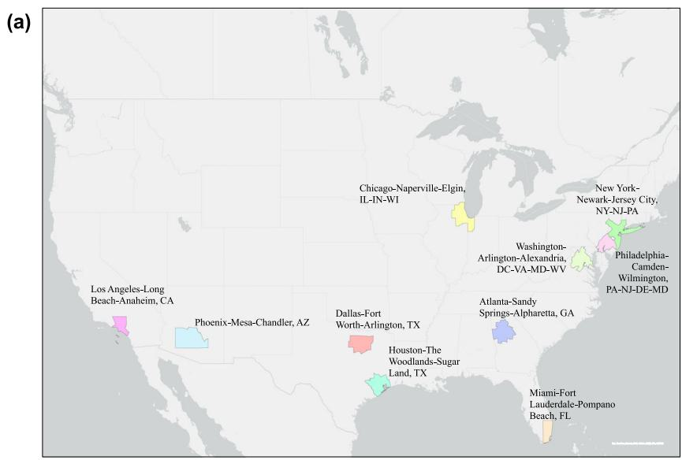

Fig. 1a 给出实验城市范围。M1 到 M10 分别是 New York、Los Angeles、Chicago、Dallas、Houston、Washington DC、Philadelphia、Miami、Atlanta 和 Phoenix 对应的 MSA。这个 panel 的作用不是展示模型，而是说明实验不是单城案例，而是跨美国十个最大 metropolitan regions 的比较。

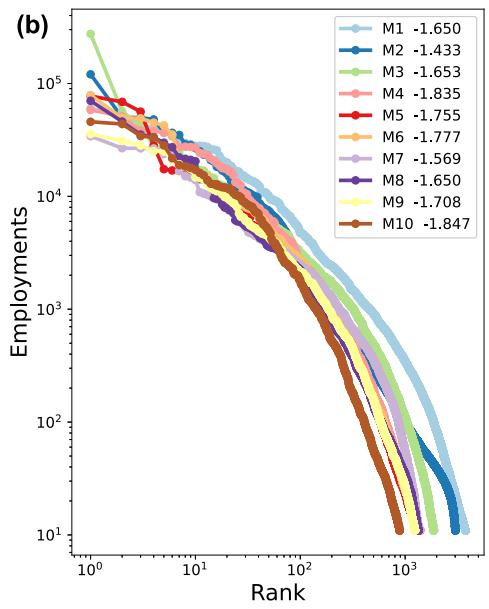

Fig. 1b 展示每个 MSA 的 job count rank distribution，并指出它们近似遵循 Zipf's law。这个 panel 为后文 urban centrality 分析埋伏笔：工作机会在空间上的集中或分散，会影响 commuting distance distribution，也会影响模型在不同城市之间的迁移。

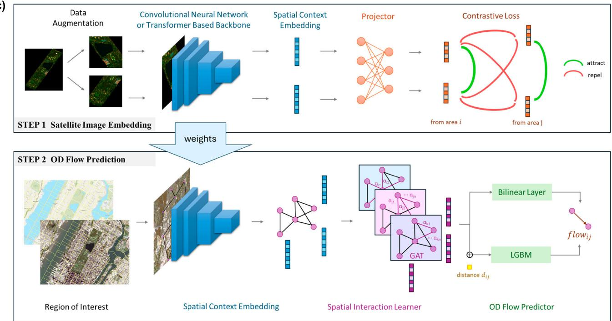

Fig. 1c 是全篇最重要的架构图。它有上下两条线。

上半部分是 satellite image embedding。对于同一个 geographic area，作者做两次 data augmentation，得到两个不同视图。这两个视图经过 CNN 或 Transformer backbone 得到 embedding，再经过 projector 到 latent space。contrastive loss 会把同一区域的两个视图拉近，把不同区域的视图推远。

下半部分是 OD flow prediction。训练好的 image encoder 把每个 tract 的 satellite image patch 编码成 spatial context embedding。然后 GAT 在 census tract adjacency graph 上传播邻域信息，得到带有空间交互信息的 node embeddings。最后用 bilinear layer 或 LGBM decoder 预测 $flow_{ij}$。

所以 Fig. 1c 的线性逻辑是：

```text
remote sensing image patch
    ↓
self-supervised visual embedding
    ↓
node feature on tract adjacency graph
    ↓
GAT-based spatial interaction learning
    ↓
origin/destination embeddings + distance
    ↓
OD flow prediction
```

这里有一个关键建模选择：作者没有直接把两个区域的图像拼接起来做 pairwise regression，而是先通过 adjacency graph 学 tract-level context。这样做的含义是，一个区域的 mobility role 不只由自身地表图像决定，也由它周围的城市结构决定。

## 4. Module 1：satellite image embedding

第一模块要解决的问题是：一块遥感图像怎样变成一个可用于 OD prediction 的向量？

设区域 $i$ 的 satellite image patch 为 $v_i$。模型不会直接用人工设计的 land-use features，而是用 self-supervised contrastive learning 学一个 representation。对同一张图像做两次随机增强，得到两个视图：

```text
v_i
    ↓ random crop / resize / color distortion
tilde v_i1, tilde v_i2
```

这两个视图来自同一个 tract，所以它们构成 positive pair。其他 tract 的视图构成 negative pairs。模型学习的目标是：同一 tract 的不同增强视图在 latent space 中接近，不同 tract 的视图远离。

对应的 image encoder 写成：

$$
r_{it}
= f(\widetilde{v}_{it}),
\qquad
t\in\{1,2\}.
\tag{1}
$$

这里 $f(\cdot)$ 是视觉 backbone。原文 Methods 文字说明后续实验使用 ViT-L/16；公式中的 $f$ 可以理解为 generic backbone。$r_{it}$ 是增强视图 $\widetilde v_{it}$ 的 representation。

然后 projector $g(\cdot)$ 把 representation 投影到 contrastive loss 使用的 latent space：

$$
z_{it}
= g(r_{it})
= W^{(2)}\sigma\!\left(W^{(1)}r_{it}\right),
\qquad
t\in\{1,2\}.
\tag{2}
$$

这一步的作用是把“用于下游任务的 representation”与“用于 contrastive training 的 latent vector”分开。$r_{it}$ 是 image embedding；$z_{it}$ 是 projector 输出。contrastive learning 中常见这种设计，因为 projector 可以吸收一部分训练目标带来的变形，让 backbone representation 更适合迁移。

NT-Xent loss 写成：

$$
\ell_i
=
-\log
\frac{
\exp\!\left(\operatorname{sim}(z_{i1},z_{i2})/\tau\right)
}{
\sum_{k=1}^{N}\mathbf{1}_{[k\ne i]}
\exp\!\left(\operatorname{sim}(z_{i1},z_{k1})/\tau\right)
+
\sum_{k=1}^{N}
\exp\!\left(\operatorname{sim}(z_{i1},z_{k2})/\tau\right)
}.
\tag{3}
$$

这个公式可以按分子和分母读。

分子是 positive pair 的相似度。$z_{i1}$ 和 $z_{i2}$ 来自同一区域 $i$ 的两次增强。如果它们相似，分子变大，loss 变小。

分母包含 batch 中所有候选视图。第一项遍历其他区域的第一个视图，第二项遍历所有区域的第二个视图。它们构成 contrastive classification 的竞争对象。

$\tau$ 是 temperature。$\tau$ 越小，softmax 对相似度差异越敏感；$\tau$ 越大，分布更平滑。原文设置 $\tau=0.5$。

这一步训练完成后，每个 census tract 得到一个 satellite image embedding $r_i$。这个 $r_i$ 不是人口、POI 或手工土地利用变量，而是图像中地物、建成环境和空间纹理的 latent representation。

## 5. Module 2：GAT 如何学习 spatial interaction

仅有 $r_i$ 还不够。一个 tract 的通勤角色不仅取决于它自身的图像，也取决于它在城市空间中的位置：周边是什么区域、与哪些区域邻接、离其他区域有多远。

因此作者把每个 MSA 写成一个 graph：

```text
node:
    census tract

node feature:
    satellite image embedding r_i

edge:
    geographical adjacency

edge feature:
    travel distance between tract centroids
```

GAT 的第一步是为 node $i$ 和它的邻居 $j$ 计算 raw attention score：

$$
s_{ij}
=
a\!\left(
Wh_i
\;\|\;
Ve_{ij}
\;\|\;
Wh_j
\right),
\qquad
j\in N_i.
\tag{4}
$$

这里 $h_i$ 是当前层 node $i$ 的 hidden state，初始时可以理解为 satellite embedding。$e_{ij}$ 是 $i$ 和 $j$ 之间的 edge feature，这里主要是距离。$W$ 和 $V$ 是可训练线性变换。符号 $\|$ 表示 concatenation。$a(\cdot)$ 把拼接后的信息压成一个标量 score。

这个 score 的意义是：当更新 node $i$ 时，邻居 $j$ 的信息应该有多重要。它不是固定的距离衰减函数，而是由模型学习出来的 attention weight 前体。

接着用 softmax 把 raw scores 归一化：

$$
\alpha_{ij}
=
\frac{
\exp\!\left(\sigma(s_{ij})\right)
}{
\sum_{k\in N_i}
\exp\!\left(\sigma(s_{ik})\right)
}.
\tag{5}
$$

归一化之后，$\alpha_{ij}$ 是 node $i$ 在聚合邻居时给 node $j$ 的权重。所有邻居权重加起来为 1。这样模型可以表达“某些相邻区域对当前区域的 mobility role 更重要，另一些相邻区域只是地理上接近但功能影响较弱”。

最后做 message passing：

$$
h_i'
=
\sigma\!\left(
\sum_{j\in N_i}
\alpha_{ij}Wh_j
+
Uh_i
\right).
\tag{6}
$$

这一步有两部分。

第一部分 $\sum_{j\in N_i}\alpha_{ij}Wh_j$ 是 neighbor aggregation。它把邻居的特征按 attention weight 加权平均。

第二部分 $Uh_i$ 是 self information。它保留 node $i$ 自身的视觉上下文，避免更新后完全变成邻域平均。

所以 GAT 的作用不是“预测 flow”本身，而是把每个 tract 的 node embedding 从 purely visual context 更新为 spatially contextualized embedding：

```text
visual tract embedding
    ↓
neighbor-aware tract embedding
```

这一步对 OD flow 任务很关键，因为同样的建筑纹理在不同空间位置上可能对应不同 mobility role。一个 commercial-looking 区域在城市核心、郊区副中心或高速公路旁边，可能产生完全不同的 OD interactions。

## 6. Module 3：OD decoder 与 BMC Loss

GAT 输出每个 tract 的更新后 embedding。接下来要预测 origin $i$ 到 destination $j$ 的 flow。

Imagery2Flow 的基本 decoder 是 bilinear transformation：

$$
\hat y_{ij}
=
\left(h_i^{org}\right)^{\top}
A
h_j^{dst}.
\tag{7}
$$

这里 $h_i^{org}$ 是 origin 角色下的 node embedding，$h_j^{dst}$ 是 destination 角色下的 node embedding，$A$ 是可训练矩阵。这个公式可以理解为一个 learned compatibility score：如果 origin embedding、destination embedding 和矩阵 $A$ 共同给出高匹配度，则预测 flow 更大。

Bilinear decoder 的优点是结构紧凑，能直接端到端训练。缺点是表达能力有限。因此作者还提出 Imagery2Flow-LGBM：先用 GAT 训练 node embeddings，再把 origin embedding、destination embedding 和 distance 输入 LGBM decoder。LGBM 作为 tree ensemble，通常更擅长 tabular regression 和非线性 feature interaction，所以性能更强。

OD flow 数据高度偏斜。大多数 OD pairs 的流量较小，少数 OD pairs 承载很大流量。如果直接用 MSE，模型很容易被大量低流量样本主导，或者在高流量样本上产生不稳定误差。作者先对 flow intensity 做 $\log_2$ transformation，再使用 BMC Loss：

$$
\begin{aligned}
\mathrm{loss}
&=
\mathrm{BMC}(\log y,\log \hat y)
\\
&=
-\log
\frac{
\exp\!\left(
-\frac{\left\|\log y-\log\hat y\right\|_2^2}{\tau}
\right)
}{
\sum_{\ell=1}^{K}
\exp\!\left(
-\frac{\left\|\log y^{(\ell)}-\log\hat y\right\|_2^2}{\tau}
\right)
}.
\end{aligned}
\tag{8}
$$

这个公式和 Eq. (3) 的 contrastive loss 有结构相似性。对一个 prediction $\log\hat y$ 来说，它自己的 label $\log y$ 是 positive target；batch 中其他 labels $\log y^{(\ell)}$ 是 competing targets。loss 要求 prediction 更接近正确 target，而不是接近 batch 中其他 target。

更线性地看，Eq. (8) 是把 regression 暂时改写成一个 batch 内的 classification 问题。先固定 batch 中某一个样本。它的预测值是 $\log\hat y$，正确标签是 $\log y$。batch 里一共有 $K$ 个真实标签：

```text
log y^(1), log y^(2), ..., log y^(K)
```

其中一个就是这个样本自己的正确标签 $\log y$。现在作者不直接问“$\log\hat y$ 距离 $\log y$ 有多远”，而是问：

```text
在 batch 里的 K 个候选标签中，
prediction log y_hat 最应该匹配哪一个 label？
```

于是对每个候选标签 $\log y^{(\ell)}$，先计算一个 squared distance：

$$
D_\ell
=
\left\|\log y^{(\ell)}-\log\hat y\right\|_2^2.
$$

如果 $\log\hat y$ 很接近某个候选标签，$D_\ell$ 就小；如果差得远，$D_\ell$ 就大。然后把距离转成相似度：

$$
\exp\!\left(-\frac{D_\ell}{\tau}\right).
$$

这里负号很重要。距离越小，指数项越大；距离越大，指数项越小。$\tau$ 是 temperature，在原文里写作 $\tau=2\sigma^2_{noise}$。它控制 softmax 的敏感程度。$\tau$ 小时，模型会很严格地区分最接近的 label；$\tau$ 大时，距离差异被平滑，多个 label 都可能获得相近概率。

把所有候选标签的相似度加起来，就是 Eq. (8) 的分母：

$$
\sum_{\ell=1}^{K}
\exp\!\left(
-\frac{\left\|\log y^{(\ell)}-\log\hat y\right\|_2^2}{\tau}
\right).
$$

它的作用是 normalization。也就是说，模型把当前 prediction $\log\hat y$ 分配给 batch 中每个 candidate label 的概率加起来必须是 1。

正确标签对应的相似度就是分子：

$$
\exp\!\left(
-\frac{\left\|\log y-\log\hat y\right\|_2^2}{\tau}
\right).
$$

因此分子除以分母就是：

```text
当前 prediction 在 batch 内被分到正确 label 的 softmax probability
```

最后取 $-\log$，就变成 cross-entropy loss：

```text
correct label probability high  → loss small
correct label probability low   → loss large
```

所以 Eq. (8) 不是一个普通 MSE。普通 MSE 只看当前预测和当前标签之间的绝对距离：

$$
\left\|\log y-\log\hat y\right\|_2^2.
$$

BMC Loss 还看当前预测和 batch 中其他标签之间的相对距离。它希望预测值不只是靠近正确标签，而且要比靠近其他标签更靠近正确标签。

先做 $\log_2$ transformation 也有必要。OD flow intensity 是 heavy-tailed 的：大量 OD pairs 只有很小 flow，少数 OD pairs 有很大 flow。如果直接在原始 $y$ 上训练，误差尺度会被大流量样本支配；如果只用普通 MSE，又容易因为低流量样本数量太多而学成保守预测。$\log_2$ 把绝对差异压缩成相对差异，例如从 10 到 20 和从 100 到 200 都对应类似的 log-scale 增量。这样模型更接近在学习 flow 的 multiplicative scale。

在 log scale 上再用 BMC，目的就是同时处理两件事：

```text
log transform:
    压缩 heavy-tailed flow intensity 的数值尺度

BMC normalization:
    在 batch 内校正 label distribution 的不平衡，
    让预测必须从多个候选 flow labels 中识别正确目标
```

严格说，实际 batch 训练时会形成一个 prediction-label distance matrix：每个 prediction 都和 batch 中每个 label 比较。Eq. (8) 展示的是其中一行，也就是“某一个 prediction 面对 $K$ 个 candidate labels”的 loss。

这样做的意义是：模型不只是最小化一个点估计误差，而是在 batch 内学习 label distribution 的相对区分。对于 highly imbalanced regression，这能缓解大批低流量样本对训练的支配。

作者还使用 minibatch subgraph sampling。这个设计服务于 inductive learning：训练时采样部分 nodes 和对应 subgraph，测试 origins 不作为训练 origins 出现。这样评估不是“在同一个 graph 上补全已见 nodes 的 flows”，而更接近“把模型应用到 unseen origins / unseen regions”。

## 7. Experiments：数据、划分和基线比较

实验对象是美国前十大 MSA 的 census tract-level commuting flows。ground truth 来自 2020 LODES Origin-Destination Employment Statistics。作者去掉少于 10 个 commuters 的 flows，因为这些低强度 flows 不稳定，可能更像噪声。

遥感输入有两套：

```text
Sentinel-2:
    10 m resolution

Landsat-8:
    30 m resolution
```

作者分别训练 10m 和 30m 版本，以比较空间分辨率对性能的影响。

每个 MSA 内部按 population stratified sampling 划分 census tracts：

```text
60% train
20% validation
20% test
```

注意，划分单位是 origin tracts。训练时只有 origin 属于训练集的 flows 参与 loss 和 gradient update；测试时评估未作为训练 origins 出现的 flows。再通过 5-fold cross-validation 覆盖整个城市。

以 New York MSA 为例，数据包含 4953 个 census tracts 和 120,559 条 flows。flow intensity 均值为 22.3，中位数为 16。均值高于中位数，说明分布右偏，和后文使用 log transformation / BMC Loss 的动机一致。

作者比较的 baseline 包括四类：

```text
mechanistic:
    Radiation Model
    Gravity Model

tree-based ML:
    XGBoost
    LGBM

neural gravity:
    Deep Gravity-P
    Deep Gravity-V

graph-based neural:
    SIGCN
    GMEL
```

Table 1 的结论按层次读更清楚。

第一层，traditional mechanistic models 整体弱于 ML / DL 方法。Radiation Model 参数少，适合更粗粒度、长距离迁移类问题；在 tract-level intra-urban commuting flows 上表现不如数据驱动模型。Gravity Model 的表现随城市规模和空间结构波动。

第二层，tree-based models 已经很强。XGBoost 和 LGBM 使用 origin visual features、destination visual features 和 distance 作为输入，说明 satellite embeddings 本身已经包含预测 mobility 的有效信息。

第三层，Deep Gravity-V 优于 Deep Gravity-P。Deep Gravity-P 使用 population 和 distance；Deep Gravity-V 使用 satellite visual features 和 distance。这个比较支持作者的核心主张：视觉上下文比单纯人口变量更能描述复杂城市环境。

第四层，GNN-based models 能进一步利用 spatial structure。GMEL、SIGCN 和 Imagery2Flow 都把 graph representation learning 放进 OD flow prediction，但它们对图的使用方式不同。SIGCN 依赖 known flows 构图，因此迁移到没有历史 flows 的城市时受限。Imagery2Flow 使用 geographical adjacency graph 和 satellite imagery，因此更适合 data-poor transfer setting。

第五层，Imagery2Flow-LGBM 在多数指标上最好。主文给出的总体提升是：使用 10m Sentinel-2 imagery 时，相对传统 ML visual-feature baselines，RMSE 降低 4.5% 到 13.9%，MAE 降低 1.3% 到 10.8%，CPC 提高 1.3% 到 2.6%。

## 8. Figure 2：New York 中模型表现怎样被拆开看

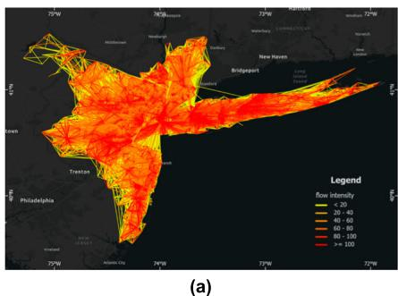

Fig. 2a 是 New York MSA 的真实 commuting flows。这个 panel 给出 observed OD structure：大量 flows 集中在城市核心和主要通勤方向上，同时也存在跨区域长距离联系。

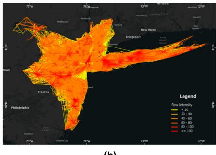

Fig. 2b 是 Imagery2Flow-LGBM 使用 10m Sentinel-2 imagery 的预测。它的作用是让读者直接比较 predicted flows 与真实 flows 的空间形态，而不是只看 RMSE/MAE/CPC。

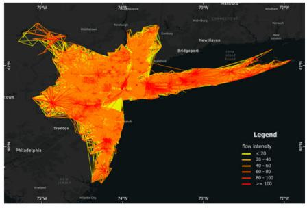

Fig. 2c 是 30m Landsat-8 imagery 的预测。它和 Fig. 2b 对比的是分辨率问题：10m 能看到更细粒度的地表纹理，但 30m 仍然保留了较多城市形态信息。

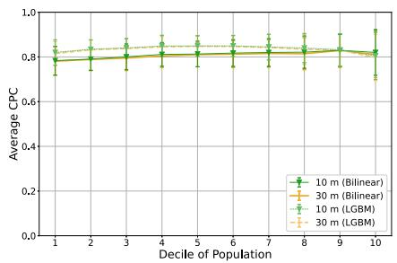

Fig. 2d 把 origins 按 population 分成十个 deciles。这里的分组单位不是 OD pair，而是 origin census tract。作者先按每个 origin tract 的人口从高到低排序，再切成十个数量相同的组。decile 1 是人口最多的 10% origin areas，decile 10 是人口最少的 10% origin areas。

这样分组是在检查一个很具体的问题：

```text
模型是不是只在人口密集区表现好？
```

如果模型的输入主要来自 POI、社交媒体 check-ins 或 mobile-phone-derived activity signals，那么这个担忧很自然。因为这类数据本身往往有 sampling bias。人口密集、商业活跃、平台使用率高的区域，POI 记录更完整，社交媒体和手机信令也更丰富；人口稀疏、郊区、低活动密度区域，数据可能更稀疏、更噪声化。

如果模型依赖这类输入，那么它的性能可能会随着 origin population decile 系统性变化：

```text
high-population origins:
    input information rich
    prediction easier
    CPC higher

low-population origins:
    input information sparse
    prediction harder
    CPC lower
```

Fig. 2d 的结果是 CPC 在不同 deciles 上相对稳定。它不是说所有人口组的误差完全一样，而是说模型没有出现明显的“只在人口密集 origins 上好、在人口稀疏 origins 上坏”的单调退化。Imagery2Flow-LGBM 在前九个 deciles 中整体更优，只在最低人口组附近略有下降。

作者用这个结果支持一个输入侧的论点：remote sensing imagery 的覆盖方式不同于 POI 或 social sensing。卫星图像对整个 MSA 做连续空间观测，不会因为某个 census tract 人口少就没有图像。低人口郊区、工业区、绿地边缘和高人口中心区一样，都有可观测的 spectral / spatial texture。

因此，Fig. 2d 的逻辑不是“遥感图像一定比 POI 更好”，而是更具体地说：

```text
satellite imagery provides spatially uniform coverage
    ↓
input richness is less tied to population density
    ↓
prediction performance is less sensitive to origin population decile
```

这一步也和文章的 data-poor region 叙事相连。作者想证明 Imagery2Flow 不只是适合 Manhattan 这类数据丰富区域，也能在 population density 较低、POI/social-media 数据可能不足的区域保持可用性。Fig. 2d 正是在 origin population 维度上验证这种稳定性。

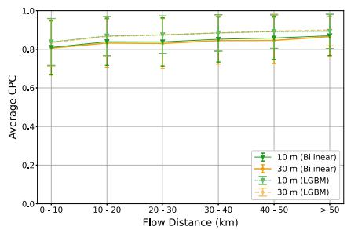

Fig. 2e 按 OD distance 分组。模型在短距离和长距离 flows 上都保持较好 CPC。这个结果重要，因为很多 mobility models 最容易学到的是 distance decay；如果长距离 flows 完全预测不好，说明模型只学了短程通勤的惯性。

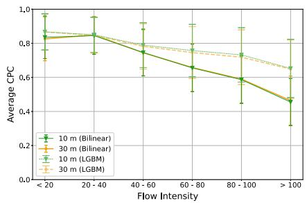

Fig. 2f 按 flow intensity 分组。随着流量变大，误差更明显，尤其是 bilinear Imagery2Flow 下降更快。Imagery2Flow-LGBM 在 high-intensity flows 上更稳，仍能保持约 0.6 的 CPC。这个 panel 直接对应前面的 data imbalance 问题：大流量 OD pairs 很少，但对整体通勤结构非常重要。

因此 Fig. 2 的作用不是重复 Table 1，而是把“预测准”拆成三个维度：

```text
across origin population levels:
    是否只在人口密集区有效？

across OD distances:
    是否只学会短距离流动？

across flow intensities:
    是否能处理少数大流量 OD pairs？
```

## 9. Correlation to urban morphology：为什么要看距离衰减

如果模型只是一个 black-box regressor，那么高 CPC 并不一定说明它学到了城市流动机制。作者进一步检查：预测出来的 OD flows 是否能复现城市 mobility 中常见的 distance decay pattern。

distance decay 指的是，origin 和 destination 越远，移动概率或流量通常越低。已有研究常用 power law 或 exponential form 描述这种关系。作者在十个 MSA 中比较 observed flows 和 predicted flows 的 distance distribution，并用 Akaike weights 比较 exponential、power law 和 truncated power law。补充材料给出的结果是十个城市中 exponential form 的 Akaike weight 均为 1.00，因此主文使用：

$$
P(d)
\sim
e^{-\lambda d}.
$$

这里 $d$ 是 commuting distance，$\lambda$ 是 distance decay exponent。$\lambda$ 越大，长距离通勤下降越快；$\lambda$ 越小，长距离通勤比例越高。

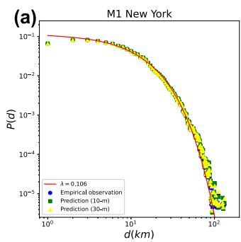

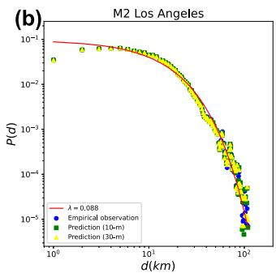

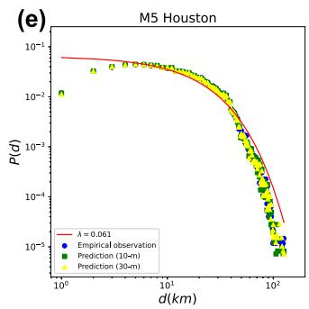

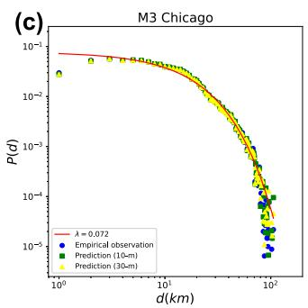

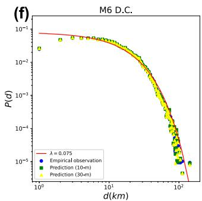

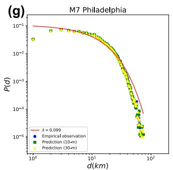

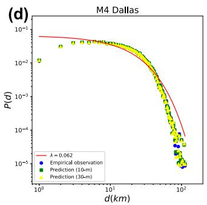

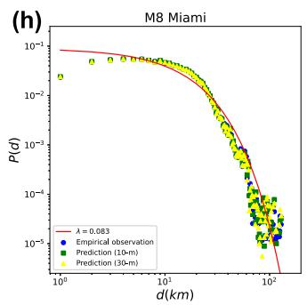

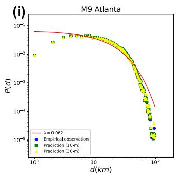

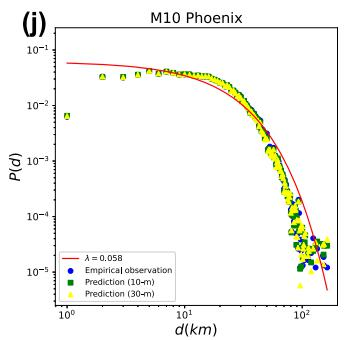

Fig. 3 的十个 panels 对应十个 MSA。每个 panel 都比较 observed distance distribution 与 Imagery2Flow-LGBM predicted distribution。红线是 empirical observations 的 exponential fit。作者的核心判断是：预测 flows 的 distance distribution 与真实 flows 很接近，补充表中 KL 和 JS divergence 很小。

这一步的意义不是说模型“发现”了 exponential distance decay。更准确地说，它说明模型从 satellite imagery 和 graph context 中预测出的 OD flows，没有破坏真实 commuting system 的宏观距离结构。也就是说，模型不仅在逐条 OD flow 上拟合得不错，还复现了 city-level mobility distribution。

## 10. Compactness 和 centrality 怎样进入解释

得到每个城市的 $\lambda$ 后，作者进一步问：哪些 urban morphology indices 与 $\lambda$ 相关？

第一类是 compactness。作者使用 Boyce-Clark Shape Index，记作 BCSI。它的思想是：从城市形状的中心向边界发出 $n$ 条等角度 rays，测量每条 ray 的长度 $r_i$。如果所有方向长度相近，城市形状接近圆形，BCSI 较小；如果某些方向伸得很远、某些方向很短，形状不规则，BCSI 较大。

主文给出的 BCSI 形式是：

$$
BCSI
=
\sum_i
\left|
\frac{r_i}{\sum_{i=1}^{n}r_i}
\times 100
-
\frac{100}{n}
\right|.
$$

这个公式的直觉是：每条 ray 在总半径中的占比，如果都等于 $100/n$，说明所有方向均匀；偏离越大，形状越不规则。作者使用 36 条 rays。

文章发现 BCSI 和 $\lambda$ 强相关。这里要先把 $\lambda$ 的方向读清楚。前面距离分布写成 $P(d)\sim e^{-\lambda d}$，所以 $\lambda$ 越大，距离增加时通勤概率下降越快，长距离通勤占比越低；$\lambda$ 越小，尾部下降越慢，说明长距离通勤更常见。因此，BCSI 与 $\lambda$ 正相关可以读成：形状越不规则、越不 compact，distance decay 越快；形状越接近均衡 radial form，distance decay 越慢。

作者对这个结果的解释是：在更 compact 的城市中，不同方向的 urban extent 更均衡，长距离通勤不一定意味着穿越破碎、狭长或方向性很强的城市形态。换句话说，compactness 在这里不是简单说“所有东西都更近”，而是说城市空间更连续、更均衡，长距离 home-work commuting 的结构性成本可能更低。于是长距离通勤比例可以更高，对应更小的 $\lambda$。

这个结论看起来和部分个体手机轨迹研究相反。那些研究常见的说法是：compact city 中设施更密集，人的日常活动半径更小，radius of gyration 下降更快。两者不一定矛盾，因为它们测量的对象不同。

第一，本文使用的是 collective commuting survey data，活动类型固定为 home-work commuting。通勤是住处和工作地之间的制度化、周期性流动，目的地主要由就业空间决定。手机轨迹研究通常混合工作、购物、娱乐、社交等多种活动。对这些日常活动来说，compact city 的设施密度确实可能减少远距离移动需求；但对通勤来说，即使生活服务更近，工作地仍可能分布在城市另一端或另一个就业中心。

第二，本文的距离是 census tract centroid 到 census tract centroid 的距离，不是个体真实行走、驾车或公交路径距离。这个 centroid-to-centroid measurement 会引入 aggregation effect。一个 tract 内部的实际出发点和到达点被压缩成两个几何中心，真实路线中的绕行、道路网络约束、换乘结构和 intra-tract variation 都被折叠掉了。因此，这里的 distance decay 更像是区域间通勤流的宏观距离衰减，而不是个体级轨迹长度分布。

第三，不同城市的 travel mode preference 和时间变化也会影响长距离通勤。高速公路依赖、公共交通覆盖、郊区铁路、通勤时间容忍度、远程办公比例变化，都会改变“同样的几何距离”在不同城市里的实际成本。所以 BCSI 与 $\lambda$ 的相关性不能被读成单一几何因果，而应读成 urban form、transport system 和 employment distribution 共同作用后的统计信号。

第二类解释变量是 centrality。这里的 centrality 不是网络科学里单个节点的 betweenness centrality，而是城市就业和人口在空间上是否集中。作者主要看两个量：population density 和 job distribution。

population density 的作用是提供城市空间组织的粗略信号。人口密度较高的城市更容易形成复杂的中心体系：早期可能由单一中心吸纳人口和活动，但随着拥堵、土地价格、可达性约束和产业分化增强，城市可能从 monocentric structure 走向 polycentric structure。也就是说，density 本身不是机制终点，它更像是中心结构演化的一个外显指标。

job distribution 更直接。作者把每个 census tract 作为 commuting destination，统计其中的 job count，然后按 job count 从高到低排序，画出 job count vs rank 的 log-log 关系，也就是 Fig. 1b。这个曲线的斜率表示就业机会随 rank 下降得多快。如果排名第一、第二的少数 tract 占据大量就业机会，后面的 tract 很快掉下去，曲线下降更陡，城市更接近 monocentric。如果很多 tract 都有可观的 job count，曲线下降更慢，说明就业中心不止一个，城市更接近 polycentric。

主文报告 $\lambda$ 与 population density、employment distribution slope 都有强相关，Pearson 相关约在 0.70 到 0.74 左右。这一步的含义是：distance decay 不只是由几何距离本身决定，也由目的地机会的空间分布决定。

在 monocentric city 中，大量工作机会集中在少数中心，通勤流会被强烈拉向这些中心。距离衰减主要由“居民住在哪里”和“中心离居民多远”共同决定。在 polycentric city 中，工作机会分布在多个中心，远距离通勤的含义会发生变化：它可能是跨中心流动，也可能是某个外围居住区连接到另一个就业节点。由于目的地机会更分散，长距离 flow 不一定像单中心城市中那样受到同一种中心-外围结构约束，所以 distance decay pattern 会不同。

因此，这一节的逻辑不是“compactness 或 centrality 单独决定 $\lambda$”，而是：

$$
\text{urban morphology}
\rightarrow
\text{job-residence spatial organization}
\rightarrow
\text{commuting distance distribution}
\rightarrow
\lambda.
$$

BCSI 捕捉城市外形的 radial irregularity，centrality 捕捉就业和人口的空间集中方式。两者共同说明：Imagery2Flow 预测出的 OD flows 不只是数值上接近 ground truth，也保留了与城市形态相关的宏观 mobility structure。

## 11. Spatial Heterogeneity：为什么平均指标不够

Table 1 和 Fig. 2 给的是整体表现，但平均指标会掩盖空间差异。作者进一步看 prediction error 在城市内部如何分布。

主文以 New York 为例，其他九个 MSA 放在 Supplementary Figs. 2-10 和 11-19。作者观察到一个总体规律：模型在 suburban areas 往往更准，在 urban center 附近误差更大。这被解释为 saturation effect。高人口、高流量、高活动强度区域更容易出现较大误差；遥感估计人口、植被指数、碳排放等任务中也常见类似现象。

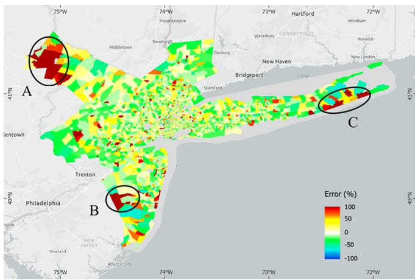

Fig. 4a 显示 New York 中使用 10m Sentinel-2 imagery 的 origin-level prediction errors。地图上的 A、B、C 标注不是类别预测结果，而是作者用于解释误差来源的空间案例。

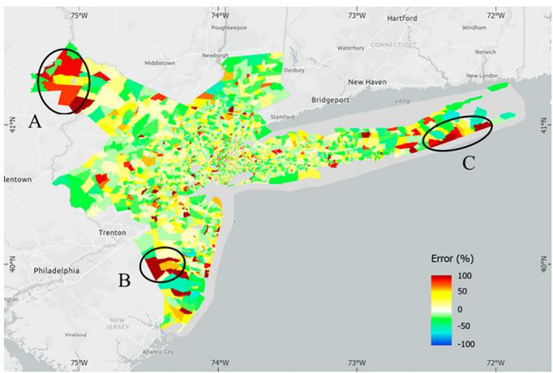

Fig. 4b 是 30m Landsat-8 版本。它和 Fig. 4a 的空间误差结构相似，说明一部分误差来自城市功能和社会空间结构，而不只是遥感分辨率。

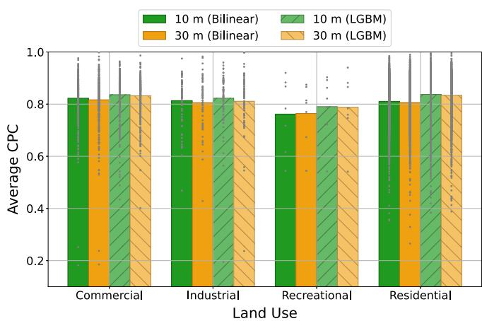

Fig. 4c 按 origin tract 的 dominant land use 分组，比较 CPC。commercial、industrial、recreational、residential 等类别对应不同城市功能。模型在 recreational 等类别上更容易出错，说明地表外观和实际出行功能之间可能存在 mismatch。

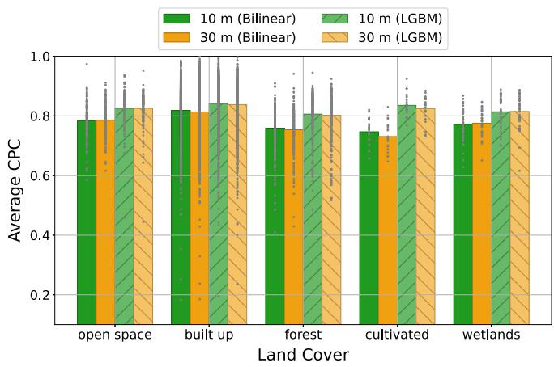

Fig. 4d 按 land cover 分组。vegetation-dominated areas 可能包含 greenbelts、wildlife management areas、regional parks、wetlands 等。这些区域在遥感图像上视觉复杂，但通勤生成机制不一定由植被外观直接决定，因此模型性能较弱。

作者把误差来源分成三类：

```text
A: vegetation cover
    greenbelt, wildlife management area, regional park

B: diverse land use / urban function
    recreational, school, industrial, airfield, commercial, landmarks

C: socioeconomic heterogeneity
    income, age, ethnicity, demographic composition
```

这部分是文章解释能力的关键限制。Satellite imagery 能看到 built environment，但看不到居民年龄、收入、职业结构、制度因素和出行偏好。比如一个 median age 较高的社区，即使建筑形态看起来和普通 residential area 相似，实际通勤流也可能偏低。模型在这种地方高估 flow 并不奇怪。

## 12. Spatial transferability：跨城市迁移为什么有时成功、有时失败

作者接下来做 cross-city transfer。记 “City A-City B” 为：模型在 City A 上训练，然后直接用 City B 的 satellite imagery、census tract graph structure 和 OD distance 预测 City B 的 OD flows。这里的关键问题不是同一个城市内 train/test 能不能拟合，而是：

```text
source city learned mapping
    ->
target city satellite + graph context
    ->
target city OD flow prediction
```

如果这个过程成功，说明模型学到的不是某个城市内部的记忆，而是某种可以跨城市迁移的 built-environment-to-mobility mapping。

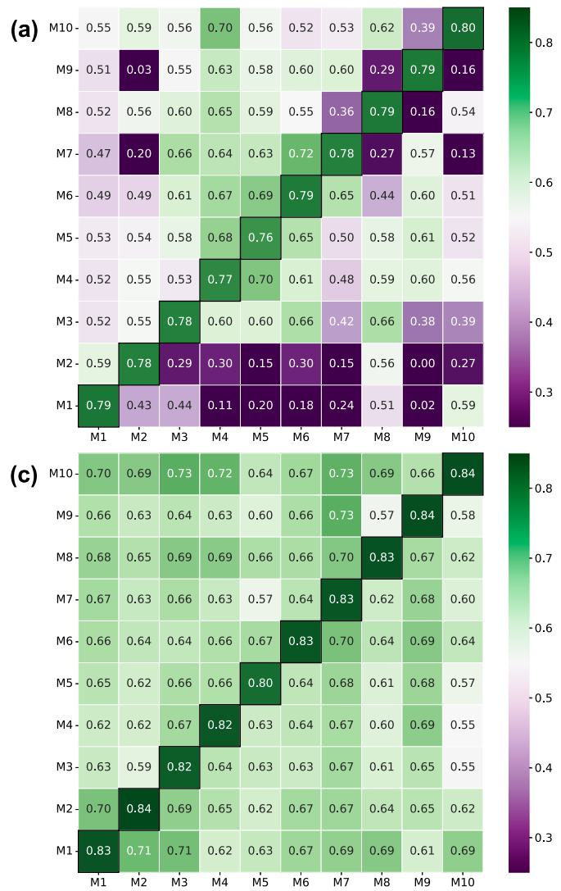

Fig. 5 的每个 panel 都是一个 transfer matrix。横轴是 training MSA，也就是模型参数来自哪个城市；纵轴是 target MSA，也就是模型被应用到哪个城市。每个格子的数字是 target city 上的 CPC，颜色越绿表示预测流量和真实通勤流越一致，颜色越紫表示 transfer performance 越差。对角线是 within-city setting：在同一个 MSA 内训练和测试。非对角线才是真正的 cross-city transfer。

十个 MSA 的代号是：M1 New York，M2 Los Angeles，M3 Chicago，M4 Dallas，M5 Houston，M6 Washington DC，M7 Philadelphia，M8 Miami，M9 Atlanta，M10 Phoenix。

Fig. 5a 是 Sentinel-2 10m imagery + bilinear decoder。这个 panel 先给出最原始的 zero-shot transfer 图景。对角线基本都在较高水平，说明每个城市内部模型都能学到可用的 OD flow mapping。但离开对角线后，表现立刻变得很不均匀：有些 source-target pair 仍然可以保持中高 CPC，有些 pair 则掉到很低。

这说明 bilinear Imagery2Flow 的跨城市迁移不是稳定同质的。模型 architecture 可以被重复使用，但学到的参数会强烈依赖 source city 的空间结构。换句话说，satellite imagery 中确实有 mobility-relevant information，但不同城市的地表形态、道路结构、住房-就业分布和通勤制度不同，同一套参数不一定能直接解释另一个城市。

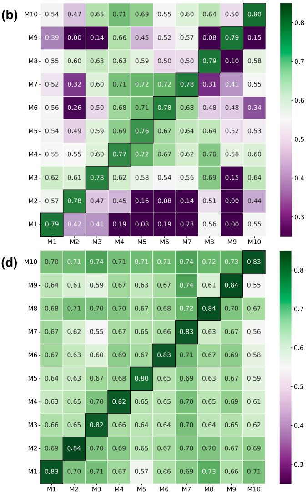

Fig. 5b 是 Landsat-8 30m imagery + bilinear decoder。它和 Fig. 5a 的区别主要是 image resolution：从 10m Sentinel-2 换成 30m Landsat-8。读这个 panel 的目的，是检查 transfer failure 是否主要来自遥感分辨率不足。

结果不是这样。Fig. 5b 的整体结构和 Fig. 5a 很相似：对角线仍然高，非对角线仍然有明显高低差，某些城市对依然很弱。这说明 spatial transferability 的主要瓶颈不是 10m 和 30m 的分辨率差异，而是城市之间的 contextual mismatch。30m imagery 仍然能捕捉大尺度 land cover、building density、urban expansion pattern 等信息；但这些信息如何映射到 OD flows，仍然受城市类型差异影响。

Fig. 5c 是 Sentinel-2 10m imagery + LGBM decoder。它和 Fig. 5a 使用同样的 10m image source，但把 bilinear decoder 换成 LGBM decoder。这个对照是在问：如果 decoder 更擅长处理 nonlinear feature interactions，跨城市迁移会不会更稳？

图上可以看到，Fig. 5c 比 Fig. 5a 明显更“绿”。很多原本很低的非对角线格子被抬高，整体 transfer matrix 更均匀。直观地说，GAT encoder 提供 origin/destination 的 neighborhood-aware embeddings，distance 提供 OD pair 的空间阻抗，LGBM decoder 则更灵活地组合这些特征。相比 bilinear decoder 的简单双线性交互，LGBM 更能吸收非线性关系，所以跨城市时不那么容易崩。

Fig. 5d 是 Landsat-8 30m imagery + LGBM decoder。它和 Fig. 5c 的相似性很重要：即使使用 30m imagery，只要 decoder 足够稳，transfer matrix 仍然可以保持较高水平。这再次说明，跨城市迁移依赖的不只是像素级细节，而是更大尺度的 urban context pattern。

Fig. 5 的阅读重点不是“哪个格子最大”，而是三个规律。

第一，对角线通常更好。within-city prediction 比 cross-city transfer 更容易，因为训练和测试来自同一个城市系统，城市空间结构、土地利用、人口分布、交通网络和通勤制度的分布更一致。对角线高并不意外，它提供的是一个 city-specific upper reference。

第二，bilinear Imagery2Flow 的 transfer matrix 有明显高低差。某些城市对表现较好，比如 Dallas-Houston 和 Washington DC-Philadelphia；某些城市对很差，比如 Los Angeles-Atlanta、Miami-Atlanta 等。这说明跨城市 transfer 不是简单由城市规模决定，而是与 source city 和 target city 的空间语境是否相似有关。

第三，Imagery2Flow-LGBM 的 transfer 更稳。原因不是 LGBM 看到了 target city 的真实 OD flows，而是它作为 decoder 时，对 GAT embeddings、distance 和 nonlinear tabular interactions 的表达能力更强。它降低了 bilinear decoder 对 source-city-specific interaction pattern 的依赖，所以跨城市应用时更不容易出现极低 CPC。

还有一个容易忽略的点：transfer matrix 不一定对称。City A -> City B 和 City B -> City A 的值可以不同。原因是这个实验不是在计算两个城市之间的静态相似度，而是在测试一个方向性的 domain adaptation 问题。一个 source city 如果空间结构更复杂、样本分布更宽，学到的映射可能更容易覆盖另一个 city；反过来，较窄的 source distribution 未必能解释更复杂的 target distribution。

作者用 land cover similarity 和 urban sprawl typology 来解释这些差异。

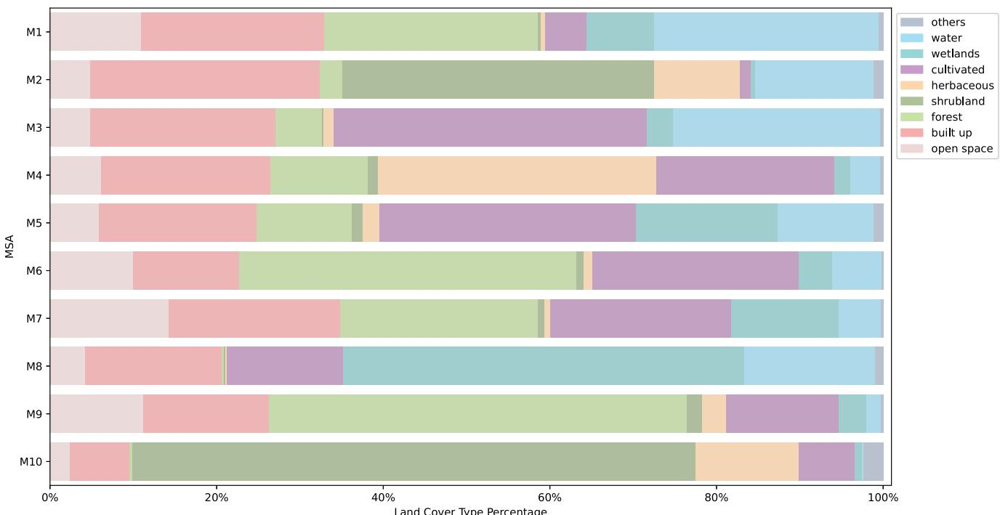

Fig. 6 展示十个 MSA 的 land cover type distribution。Washington DC 和 Philadelphia 的 geographic contexts 较相似，这帮助解释它们之间 transfer 较好。某些 transfer pair 失败，则可能因为主要 land cover types 差异较大。

但作者也指出，land cover alone 不能解释所有现象。例如 Dallas-Houston 在主导 land use 不完全相同的情况下仍然 transfer 良好；Philadelphia-New York 和 Washington DC-New York 即使有相似 land cover，transfer 也不理想。

因此文章进一步引入 urban sprawl typologies。十个 MSA 大致落入三类：

```text
Type 1:
    Less-Intensive
    Most-Compact
    Less-Mixed
    Less Monocentric Development
    examples: Los Angeles, Chicago, Miami, Atlanta, Phoenix

Type 2:
    More-Intense
    More-Compact
    More-Mixed
    Polycentric Development
    examples: New York, Dallas, Houston

Type 3:
    Least-Intensive
    Less-Compact
    Most-Mixed
    Most-Monocentric Development
    examples: Washington DC, Philadelphia
```

这个解释的重点是：模型迁移的不是“某一种地物类别”，而是遥感图像中隐含的 spatial arrangement pattern。两个城市如果在建筑密度、住房-就业混合、空间功能组织、polycentric / monocentric structure 上相似，GAT 学到的 neighborhood aggregation 和 OD interaction pattern 更可能迁移。

同时，transfer matrix 的不对称性也很重要。A 到 B 和 B 到 A 不一定一样，因为训练城市的样本分布、城市规模、空间异质性和数据噪声不同。空间迁移不是一个对称相似度问题，而是一个 domain adaptation 问题。

## 13. Temporal transferability：为什么 2020 模型能推到过去

为了验证模型是否学到了 built environment 与 commuting flows 的关系，作者还做 temporal transfer。模型用 2020 data 训练，然后输入 2010 和 2002 的 Landsat-5 imagery，预测过去年份的 OD flows。由于 Sentinel-2 在 2015 年前不可用，历史实验使用 Landsat-5；Phoenix 使用 2004 替代 2002。

Table 2 的主结论是：Imagery2Flow-LGBM 在 2010 和 2002/2004 上的 CPC 均超过 0.67。这个结果说明，模型不是只能记住 2020 年的城市特征，而是对较慢变化的 built environment-mobility relationship 有一定捕捉能力。

这里需要谨慎理解 temporal transfer。它不是短期 mobility forecasting。卫星图像反映的是建筑、道路、城市边界、土地覆盖等慢变量，不适合描述日内、周内或突发事件造成的 mobility fluctuation。因此文章讨论的 temporal transfer 更像：

```text
urban built environment at year t
    ↓
commuting flow structure at year t
```

而不是：

```text
recent trajectory sequence
    ↓
next-hour mobility forecast
```

这也是本文与 STGNN time-series forecasting 的边界。

## 14. Discussion：作者如何定位贡献与局限

Discussion 先重申贡献：Imagery2Flow 提供了一种从公开 satellite imagery 推断 fine-grained OD flows 的方法，可以在 survey data 或 mobile phone data 缺失时辅助交通规划、城市规划、疫情建模和灾害响应。

作者特别强调，本文不是 time-series forecasting，而是学习 exogenous mechanism of geographic contexts on mobility OD flow patterns。这里的 exogenous 指的是：模型从城市地表和建成环境这些外部空间条件出发，推断 mobility flows，而不是从历史 flow sequence 中外推未来。

这一定位决定了它的优点和局限。

优点是数据可获得性强。遥感图像公开、全球覆盖、时间戳清楚，在 data-poor regions 中比 POI、手机轨迹和 survey flows 更容易获得。

局限是社会解释不足。Satellite imagery 看不到 income、age、ethnicity、employment type、travel preference、policy restrictions 等变量。因此模型可以捕捉 built environment 与 mobility 的统计关系，但不能完整解释社会行为机制。

另一个局限是时间分辨率。遥感图像适合捕捉 monthly、quarterly、annual 或长期 land change，不适合捕捉 daily mobility cycle、special events、weather shocks 或短期交通扰动。作者明确说 short-term variables 和 self-cyclical effects of human mobility 不是本文重点。

最后，实验只在美国大 MSA 上做。跨国家、跨尺度、融合 remote sensing 和 social sensing，是未来工作方向。

## 15. Methods：baseline mobility models 的公式逻辑

Methods 部分把前面使用的 baselines 和 metrics 具体写出来。这里保留原文公式编号，方便回查。

### 15.1 Radiation Model

Radiation Model 是 parameter-free 的 collective mobility model。它假设从 $i$ 到 $j$ 的 flow 由三个量决定：origin population $m_i$、destination population $m_j$、以及从 $i$ 出发、半径小于 $d_{ij}$ 的圆形区域内的人口 $m_{ij}$。$O_i$ 是 origin $i$ 的 total outflow，$M$ 是系统总人口。

$$
\hat y_{ij}
=
O_i
\frac{1}{1-\frac{m_i}{M}}
\frac{
m_i m_j
}{
\left(m_i+m_{ij}\right)
\left(m_i+m_j+m_{ij}\right)
}.
\tag{9}
$$

这个公式的机制直觉是 intervening opportunities：如果 $i$ 和 $j$ 之间已经有很多人口和机会，那么从 $i$ 直接流向 $j$ 的概率会下降。它不需要拟合参数，但也因此灵活性有限。主文指出，它更适合粗粒度、长距离迁移；在 census tract-level commuting 上表现较弱。

### 15.2 Gravity Model

Gravity Model 用物理引力类比 spatial interaction。origin 和 destination 的吸引/排斥通常由 population 或 activity mass 表示，距离通过 deterrence function $f(d_{ij})$ 抑制 flow：

$$
\hat y_{ij}
=
K m_i m_j f(d_{ij}).
\tag{10a}
$$

这里 $K$ 是比例系数，$f(d_{ij})$ 可以是 power law、exponential decay 或其他距离阻尼函数。$m_i m_j$ 越大，潜在互动越强；$d_{ij}$ 越大，互动越弱。

Singly constrained gravity model 固定每个 origin 的 total outflow $O_i$。按照文字说明和 standard constrained gravity form，Eq. (10b) 应读为：对 origin $i$ 来说，所有 destination 的预测 flow 加总等于 $O_i$，每个 destination 获得的份额由 destination mass 和距离阻尼共同决定。

$$
\hat y_{ij}
=
O_i
\frac{
m_j f(d_{ij})
}{
\sum_k m_k f(d_{ik})
}.
\tag{10b}
$$

这一步提升了拟合精度，但也引入一个限制：如果迁移到新城市时不知道 origin total outflow $O_i$，这个模型的优势就难以使用。作者用这一点解释 Deep Gravity 在 transferability 上受限。

### 15.3 Deep Gravity

Deep Gravity 把 gravity formula 中手工指定的非线性函数换成 MLP。作者比较两个版本：

$$
\hat y_{ij}
=
\mathrm{MLP}(m_i,m_j,d_{ij}).
\tag{11a}
$$

Eq. (11a) 是 Deep Gravity-P，用 population 和 distance。

$$
\hat y_{ij}
=
\mathrm{MLP}(r_i,r_j,d_{ij}).
\tag{11b}
$$

Eq. (11b) 是 Deep Gravity-V，用 remote sensing visual embeddings $r_i,r_j$ 和 distance。主文结果中 Deep Gravity-V 优于 Deep Gravity-P，说明 satellite visual features 确实提供了 population 之外的信息。

但 Deep Gravity 仍然是 pairwise MLP。它没有像 GAT 那样显式传播 neighborhood context，因此在捕捉 spatial interaction pattern 上弱于 Imagery2Flow-LGBM。

## 16. Metrics：RMSE、MAE、CPC 分别看什么

作者使用三个指标。RMSE 是平方误差平均后的平方根：

$$
RMSE
=
\sqrt{
\frac{
\sum_{i,j}
\left(y_{ij}-\hat y_{ij}\right)^2
}{
n
}
}.
\tag{12}
$$

RMSE 对大误差更敏感。因此 high-intensity flows 如果预测错，会显著推高 RMSE。

MAE 是绝对误差平均：

$$
MAE
=
\frac{
\sum_{i,j}
\left|y_{ij}-\hat y_{ij}\right|
}{
n
}.
\tag{13}
$$

MAE 更像平均每条 OD pair 错了多少人，对极端误差没有 RMSE 那么敏感。

CPC 是 mobility flow literature 中常用的 OD matrix similarity 指标：

$$
CPC
=
\frac{
2\sum_{i,j}\min(y_{ij},\hat y_{ij})
}{
\sum_{i,j}y_{ij}
+
\sum_{i,j}\hat y_{ij}
}.
\tag{14}
$$

这个公式可以这样读：分子取每个 OD pair 上真实值和预测值的重叠部分，再乘 2；分母是真实总流量加预测总流量。若预测和真实完全一致，$\min(y_{ij},\hat y_{ij})=y_{ij}=\hat y_{ij}$，CPC 等于 1。若两者几乎没有重叠，CPC 接近 0。

相比 RMSE 和 MAE，CPC 更关注 OD matrix 的整体流量重叠结构。因此作者认为 CPC 更能代表 predicted mobility flow patterns 是否接近真实 patterns。

## 17. 补充材料在主文论证中的作用

补充材料不是额外故事，而是支撑主文三个关键判断。

第一，Supplementary Note 2 支撑 distance decay 结论。它用 KL divergence 和 JS divergence 比较 observed 与 predicted distance distributions，并用 Akaike weights 比较 exponential、power law、truncated power law。十个 MSA 中 exponential 的 Akaike weight 都为 1.00，所以主文才把 $P(d)\sim e^{-\lambda d}$ 作为后续 morphology analysis 的基础。

第二，Supplementary Note 4 支撑 satellite imagery features 的有效性。POI2Flow 使用 OpenStreetMap socioeconomic numerical vector 替代 visual features。在 New York 10m imagery setting 中，Imagery2Flow 的 RMSE/MAE/CPC 为 16.47/8.97/0.79，POI2Flow 为 25.62/11.51/0.74；LGBM 版本中 imagery 与 POI 的 CPC 都约 0.83，但 imagery 版本 RMSE 和 MAE 略好。

第三，Supplementary Table 5 支撑 backbone 选择。ViT-L/16 在 New York 中整体略优，尤其在 10m bilinear 和 LGBM setting 下给出较低 RMSE/MAE，因此作者后续实验使用 ViT-L/16。

这些补充结果共同服务于主线：模型性能不是只来自 LGBM 或距离特征，satellite image embedding、BMC Loss、GAT spatial context 和 decoder 共同贡献了结果。

## 18. 对 Synthetic_City / route generation 的启发与边界

这篇文章对 Synthetic_City 有价值，但它解决的问题层级和 route generation 不同。

它的价值在于 condition encoding。Imagery2Flow 说明 satellite imagery / built environment 可以作为一种外生 spatial context，用来预测 aggregate mobility demand。对于 Synthetic_City，如果条件 $c$ 包括 census summaries、PUMA attributes、land use、built environment 或 satellite-derived features，这篇文章支持一个方向：不要只把 condition 当作 tabular covariates，而可以先学 spatial context embedding，再通过 graph message passing 注入邻域结构。

它的第二个价值是 transferability analysis。文章提醒我们，跨城市迁移失败往往不是模型 architecture 失败，而是 spatial heterogeneity 和 urban typology mismatch。对于 Synthetic_City，若一个生成模型在某些区域泛化差，需要区分三类问题：输入 context 是否缺关键社会变量，空间结构是否 domain shifted，目标分布是否有城市类型差异。

它的第三个价值是 metric design。RMSE/MAE 只能看数值误差，CPC 更接近 OD matrix overlap。对于 route generation，类似地不能只看 feasibility 或 edge-level overlap，还需要评估 corridor-level mode structure 和 generated distribution 是否覆盖真实 OD patterns。

但它的边界也很明确。

第一，它预测 aggregate OD flow，不生成 path order。它没有处理一条 route 的 edge sequence、turn-by-turn feasibility 或 multi-corridor choice。

第二，它的 graph 是 geographical adjacency graph，不是 road network path graph。GAT 学的是 tract-level context propagation，不是道路拓扑上的 sequential decision process。

第三，它用 satellite imagery 解释 slow-changing built environment 对 commuting flows 的影响，不处理 day-to-day dynamics、实时 congestion、event shocks 或 individual-level behavioral sequence。

所以这篇文章更适合作为“空间上下文如何进入 mobility generation / prediction”的参考，而不是 route generation 的完整理论框架。它提供的是 condition side 的建模启发，不是 target path distribution 的采样理论。

## 19. 一句话总结

Imagery2Flow 把开放遥感图像转成 tract-level spatial context embedding，再用 GAT 学邻域空间交互，用 bilinear 或 LGBM decoder 预测 OD flow；它证明 built environment 中确实含有 aggregate commuting flow 的可学习信号，但它仍停留在 OD flow matrix 层级，没有触及 route-level multi-modal corridor selection 和 sequential path generation。
