# Jim Fan：MineDojo 与开放式具身智能

- Video: [MINEDOJO: Building Open-Ended Embodied Agents with Internet-Scale Knowledge](https://slideslive.com/38996758/minedojo-building-openended-embodied-agents-with-internetscale-knowledge)
- Speaker: Linxi "Jim" Fan
- Context: NeurIPS 2022 Foundation Models for Decision Making workshop
- Transcript: [transcript.md](../../youtube/transcripts/38996758-minedojo-building-openended-embodied-agents-internet-scale-knowledge/transcript.md)
- Slides: [curated/index.md](../../youtube/slides/38996758-minedojo-building-openended-embodied-agents-with-internetscale-knowledge/curated/index.md)

这场 talk 的主线不是“用 Minecraft 又做了一个 RL benchmark”，而是一个更明确的问题：如果 GPT-3 这类模型已经从互联网文本里吸收了大量知识，为什么它仍然不是一个真正能在世界中行动的 agent？Jim Fan 的回答沿着一条线展开：语言模型缺的不是知识量，而是 agency；要获得 agency，agent 需要开放世界、互联网规模的行为知识，以及能把语言知识转成行动反馈的模型。MineDojo 就是在 Minecraft 中把这三件事接起来的一套基础设施。

## 1. 00:00-03:10：问题从“看见世界”转向“主动作用于世界”

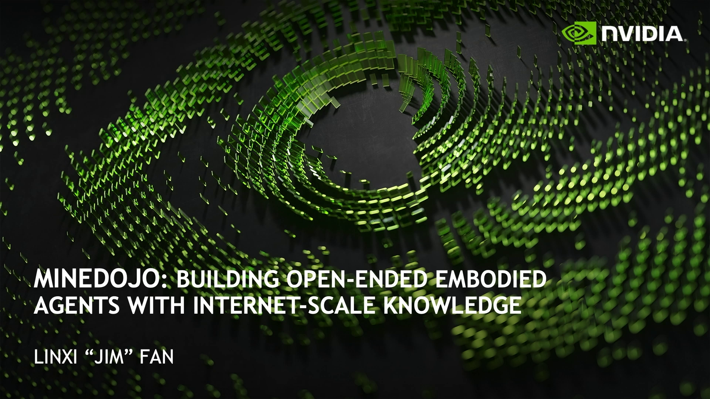

talk 开头用 Held 和 Hein 的小猫实验建立核心区分。两只刚出生的小猫看到的视觉序列几乎一样，但只有右边那只主动移动的小猫能够形成正常的视觉-运动闭环；左边那只被动小猫虽然接收了同样的视觉刺激，却没有控制自己的运动，所以后来在视觉悬崖和接近物体反应等测试中表现异常。

这个例子的作用不是做生物学铺垫，而是把“数据暴露”和“行动经验”分开。被动观察可以让系统积累输入模式，但不能让系统学会“我的动作怎样改变后续观察”。真正的 embodied intelligence 需要的是一个闭环：

$$
\text{observation} \rightarrow \text{action} \rightarrow \text{consequence} \rightarrow \text{updated behavior}.
$$

Jim Fan 随后把 GPT-3 类比成一只强大的被动小猫。GPT-3 读过大量文本，能复述、联想和生成，但它主要是在符号层面积累知识。它没有通过持续行动来校准自己的知识，所以会 hallucinate，也会给出和物理经验不兼容的答案。

因此，talk 的目标不是“让语言模型更会说话”，而是“让语言知识变得 executable”。所谓 embodied GPT-3，指的是一个能接收语言目标、在动态世界里行动、通过后果修正行为的 agent。它至少要满足三点：

- 它能理解复杂、语义丰富、开放世界的自然语言目标。
- 它不是只会一小组任务，而是要向 massively multitask 甚至 open-ended multitask 推进。
- 它不能完全从零试错，而要继承互联网和人类社群积累出来的世界知识。

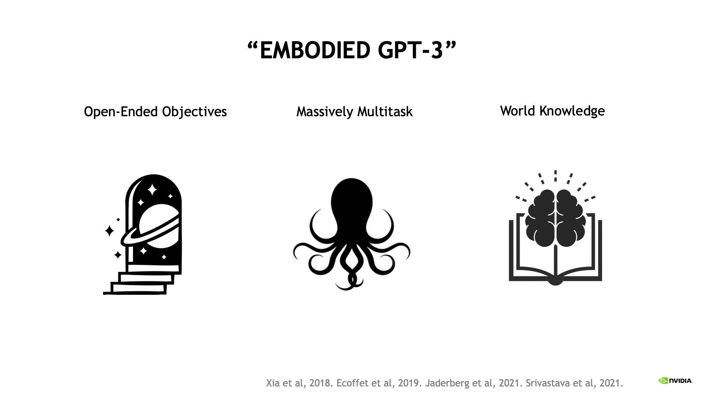

这张 slide 把 embodied GPT-3 的目标收成三个条件：open-ended objectives、massively multitask、world knowledge。它对应的不是三个独立功能模块，而是一个 agent 能否从“语言知识系统”转成“行动系统”的三道门槛：目标必须能由语言开放指定，任务数量不能被固定 benchmark 封死，行动时还要能调用大量外部世界知识。

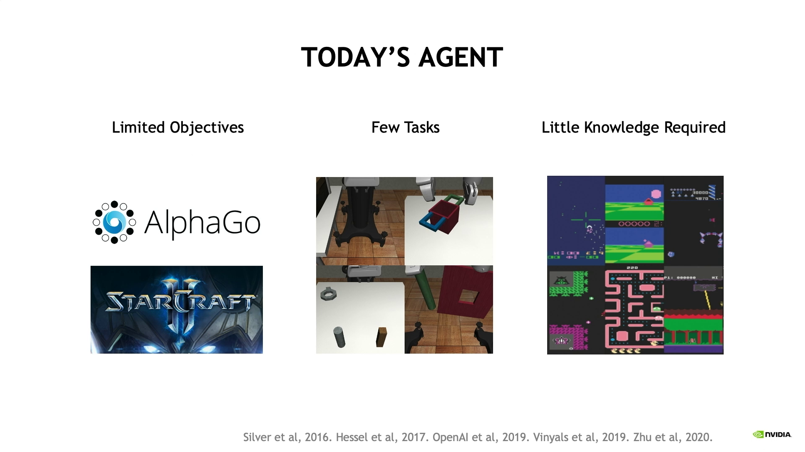

这一节最后把现有 agent 的局限说清楚。AlphaGo、StarCraft、Dota 里的 agent 很强，但它们通常围绕一个明确的胜负函数训练。机器人学习中的任务集也常常只有几十个任务。Atari 式 RL 还能依靠从零探索，因为环境相对小、目标清楚、奖励定义明确。但开放世界不一样：状态巨大，目标开放，长程因果关系复杂，纯 tabula rasa 探索会非常低效。

## 2. 03:10-05:58：开放式 agent 需要三类基础设施

Jim Fan 接着给出一个清晰的 recipe。第一层是 open-ended environment。agent 的能力上限受环境复杂度限制：如果环境只有少数状态、少数动作和固定目标，那么 agent 最多只能学会这个小世界里的技巧。地球之所以能通过自然演化产生多样生命，是因为它本身足够开放。研究中需要的是一个“低保真地球”：足够复杂，又能在实验室集群上运行。

第二层是 massive pre-training data。开放世界里的随机探索几乎不可行，因为有用事件太稀疏，目标链条太长，动作组合太多。人类玩家已经在互联网上留下了大量 walkthrough、教程、wiki、论坛问答和视频解说。这些数据可以同时扮演两种角色：一是 reference manual，告诉 agent 怎样做事；二是 interest prior，告诉 agent 什么事情值得做。

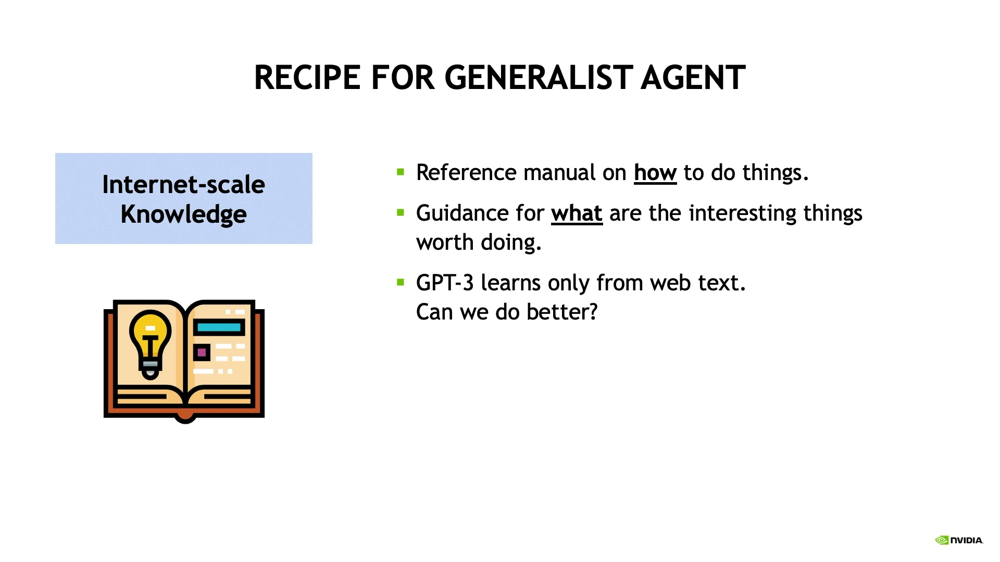

第三层是 foundation active kitten。环境和数据本身不会自动产生 agent，还需要一个模型把多模态互联网数据转成可行动信号。语言在这里有两个作用：它是人给 agent 下任务的接口，也是视频行为、视觉对象、合成规则和任务语义之间的桥。

这三层要求共同指向 Minecraft。Minecraft 是一个程序生成的 3D voxel 世界，里面有地形、采矿、合成、战斗、建造、资源管理和生存机制。它没有唯一分数，也没有固定剧情，所以不像棋类或 Atari 那样天然围绕一个目标函数组织。更重要的是，Minecraft 有庞大的玩家生态：上亿玩家不断生产视频、教程、wiki 页面和论坛讨论。这意味着它既是一个可交互环境，也是一个被人类文化反复解释过的世界。

所以 MineDojo 的设定不是“选择一个游戏做实验”，而是选择一个同时满足三件事的场域：世界足够开放，数据足够多，语言描述和行为过程之间存在大量自然对齐。

## 3. 07:13-10:12：MineDojo 先把开放世界变成可复现实验对象

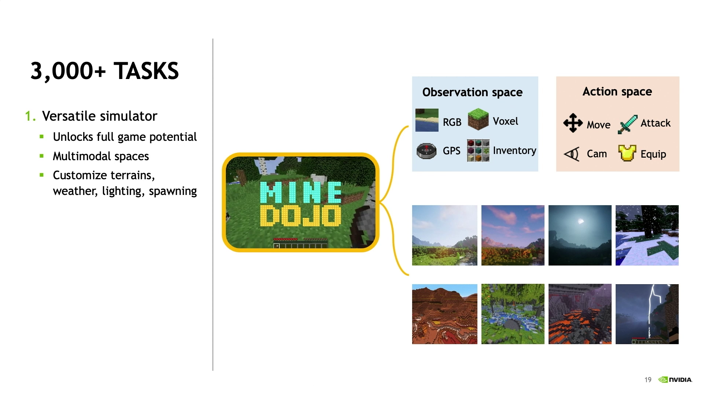

进入 MineDojo 本体后，第一步不是训练模型，而是先把 Minecraft 组织成一个可研究的 benchmark。原因很直接：如果没有可复现的任务定义、观察空间、动作空间和评估方式，“开放式智能”就会停留在口号上。

MineDojo 提供了超过 3,000 个任务，并把 Minecraft 的多模态状态暴露给 agent。观察可以包括 RGB 画面、voxel 结构、GPS 信号和背包状态；动作不仅包括前后左右移动，还包括视角控制、攻击、使用物品和库存管理。环境也可以细粒度定制，例如地形、天气、方块摆放和怪物生成。

这些任务首先分成 programmatic tasks 和 creative tasks。programmatic tasks 大约 1,500 个，它们有明确的成功条件，可以用 Python 写成 ground-truth reward 或 success check。比如采集某种资源、使用一棵工具链、击败某类怪物。这类任务适合标准 RL，因为系统可以自动判断 agent 是否成功。

creative tasks 也大约 1,500 个，但它们没有简单的程序化成功标准。比如“建一座房子”或“装饰一个场景”，难点不是执行某个固定动作序列，而是判断结果是否符合语义和审美目标。Jim Fan 把这类问题类比为图像生成评估：我们很难用几行规则判断图像是否真的是一只“好猫”，同样也很难用几行代码判断一个 Minecraft 建筑是否真的是“房子”。

第三类特殊任务是 play-through，也就是击败 Ender Dragon。它在 Minecraft 中不是强制目标，但对玩家来说是一个里程碑任务。这个任务特别重要，因为它暴露了开放世界 agent 的长程问题：从采集基础资源，到合成装备，到探索维度，到战斗准备，再到最终击败 boss，整个 episode 可能超过百万个 action step。MineDojo 支持这个任务，但 Jim Fan 也明确承认，它已经远超当前 MineCLIP/RL 方法能稳定解决的范围。

这里的线性逻辑是：MineDojo 先用 programmatic tasks 保留可量化评估，再用 creative tasks 保留开放世界的语义复杂性，最后用 Ender Dragon 暴露长程计划的真正难度。

## 4. 10:12-14:20：任务和知识来自玩家生态，而不只是研究者手工设计

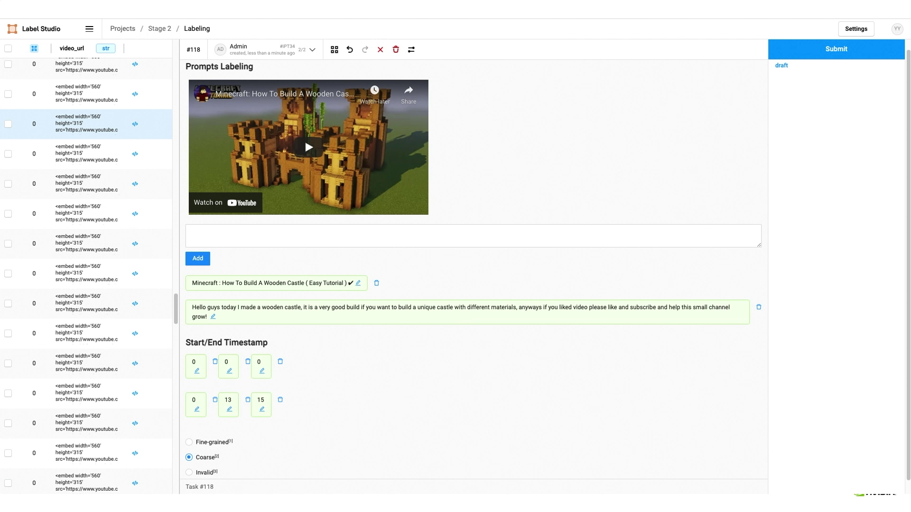

有了任务类型后，talk 下一步解释这些任务从哪里来。programmatic tasks 比较直接，因为 Minecraft 中的方块、物品、怪物和地形都可以枚举。研究者可以写模板，例如“collect $n$ units of $x$”或“combat $y$ at night”，再通过组合生成大量任务变体。

creative tasks 不能这样处理。它们的价值恰恰在于来自真实玩家想做的事，而不是研究者在办公室里凭空写出的任务表。因此 MineDojo 使用两条来源扩展 creative tasks。第一条是 YouTube：看 Minecraft 玩家实际在视频里做什么，再把这些活动转写成任务。第二条是 GPT-3：由于 Minecraft 大量出现在互联网语料中，GPT-3 已经知道很多 Minecraft 玩法、物品和任务形式，可以被用来 brainstorm 任务，甚至生成 step-by-step guidance。

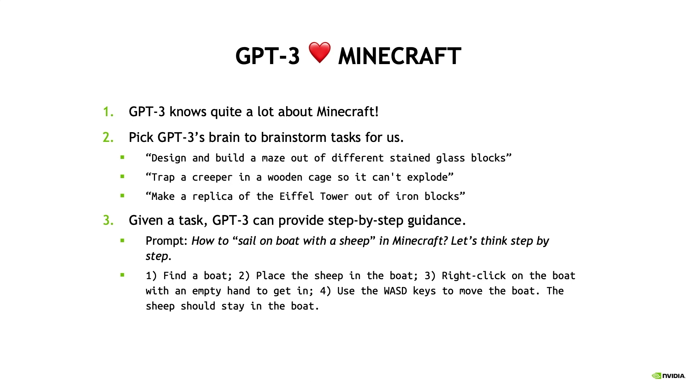

这一步有一个微妙但重要的点：GPT-3 在这里不是最终 agent，而是任务生态的辅助生成器。它的作用是利用文本世界知识帮助研究者扩展任务空间，但这些任务最终仍要回到 Minecraft 环境中，由 embodied agent 执行。

任务之外，MineDojo 还构建了互联网知识库。第一部分是 YouTube。Minecraft 是最常被视频化和解说的游戏之一，玩家通常边玩边讲解自己正在做什么。MineDojo 收集了 70 多万个视频和约 20 亿词 transcript。这里最关键的是 time-aligned transcript：语言不是孤立文本，而是和视频中的行为同步出现，所以天然提供了“语言描述如何对应视觉行为”的弱监督信号。

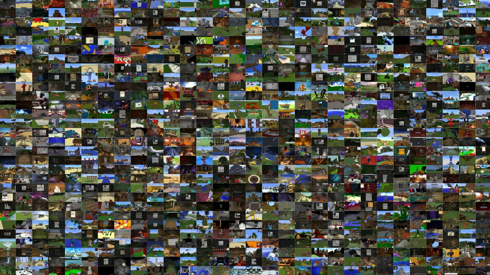

第二部分是 Wiki。Minecraft 社区已经整理了大量机制说明，包括怪物行为、合成配方、物品用途、方块属性和游戏规则。这类材料更像结构化世界知识，可以告诉 agent 世界里有哪些实体、它们之间有什么规则关系。

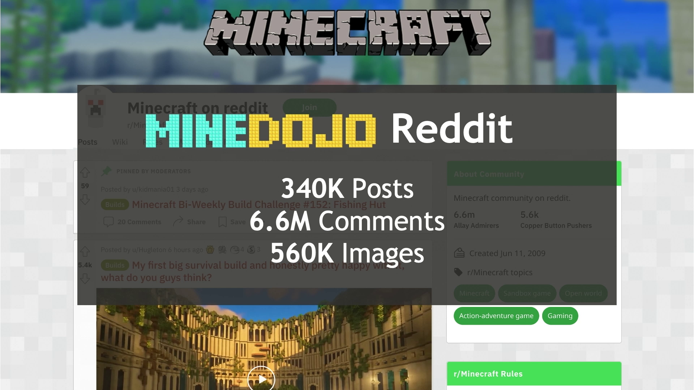

第三部分是 Reddit。玩家会在论坛里问问题、回答问题、展示失败案例和提供策略。例如“为什么我的小麦农场不生长”，社区回答可能指出光照不足。这类数据不像 Wiki 那样规整，但它包含了大量经验性因果知识：问题是什么，原因是什么，应该怎么修。

所以 MineDojo 不是单纯把 Minecraft 当 simulator。它真正利用的是一个组合：

$$
\text{interactive world} + \text{human gameplay videos} + \text{wiki rules} + \text{forum problem solving}.
$$

这个组合让 Minecraft 从一个游戏变成了一个可供 embodied foundation model 学习的社会-技术环境。

## 5. 14:20-16:15：MineCLIP 把语言目标变成可优化的 reward

有了视频和 transcript 后，MineDojo 的核心模型是 MineCLIP。它的思想类似 OpenAI CLIP，但配对对象从“图像-文本”变成“Minecraft 视频片段-文字描述”。模型通过 contrastive learning 学会判断一段行为视频和一段文字是否匹配。

这一步解决的是 open-ended RL 的一个核心瓶颈：reward 不可扩展。传统 RL 要先定义 reward function。对于“采集 10 个木头”这种任务，手工 reward 还能写；但对于“建一个漂亮的地下神庙”“带一只羊坐船”“做一个像样的农场”这样的任务，手写 reward 很快不可行。MineCLIP 的目标就是把语言描述转成一个 learned scoring function。

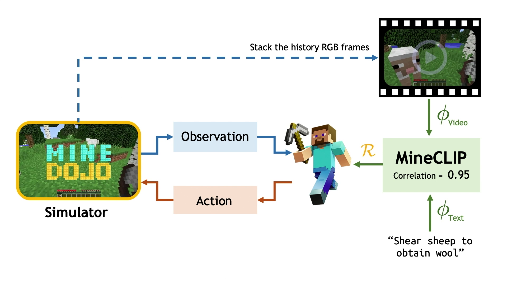

推理链条可以按四步读。第一，用户或 benchmark 给出自然语言任务，例如“shear sheep to obtain wool”。第二，agent 在 MineDojo simulator 中行动，并产生一段行为视频。第三，MineCLIP 比较这段视频和语言任务的匹配程度。第四，这个匹配分数被作为 RL reward，反馈给 PPO 等强化学习算法。

因此 MineCLIP 不是 policy，也不是 planner。它更像一个语言条件的 reward model：

$$
\text{language goal} \rightarrow \text{behavior clip} \rightarrow \text{MineCLIP score} \rightarrow \text{RL update}.
$$

这条链条的意义在于，它把“开放语言目标”转成了“可优化的连续反馈”。如果只用最终 success/failure，很多任务的奖励会极度稀疏；但 MineCLIP 可以在中间行为还没有完全成功时提供一个相对平滑的方向信号。

## 6. 16:18-18:30：实验首先验证 MineCLIP reward 是否有用

实验部分的第一层问题是：MineCLIP 给出的 learned reward 能不能真的帮助 RL？作者比较了几类 reward。第一类是 sparse reward，只在任务成功时给信号。这种方式最干净，但很多任务学不动，因为 agent 很难靠随机探索碰到成功状态。

第二类是 manual dense reward。研究者利用 simulator 的 privileged state，为每个任务手写更平滑的奖励。例如 agent 离目标更近、拿到关键物品、完成中间步骤时给奖励。这类 reward 往往效果好，但它是 oracle-like 的，因为每个任务都要单独设计，而且很多 creative task 根本没法写出可靠 dense reward。

第三类是 MineCLIP reward。它不依赖每个任务的手写规则，而是用同一个语言-视频匹配模型处理多个任务。agent 的行为越像语言 prompt 描述的目标，reward 越高。

结果的读法是：MineCLIP reward 在多项任务上接近 manual dense reward，并明显优于 sparse reward。这个结果验证的不是“agent 已经通用智能”，而是一个更具体的命题：从互联网视频-文本对齐中学到的 reward model，可以替代一部分手工 reward engineering。

对比 OpenAI CLIP 的结果也很重要。直接把真实图像领域训练出来的 CLIP 拿到 Minecraft 里用，效果很差，甚至可能提供反向信号。这说明“通用互联网预训练”不是魔法。Minecraft 的视觉风格、动作语义和物品关系都有强 domain specificity，所以 reward model 必须在目标环境相关数据上对齐。

## 7. 18:30-20:04：泛化实验区分 reward 的泛化和 policy 的泛化

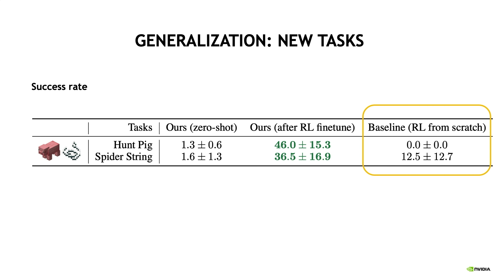

下一层问题是泛化。这里要区分两个对象：MineCLIP reward model 和 agent policy。MineCLIP 可以 open-vocabulary 地接受新任务描述，但这不意味着当前 policy 能 zero-shot 完成新任务。原因是 policy 是在特定任务和环境分布下被 RL 更新出来的，它学到的是行动策略，不是语言理解本身。

实验中，zero-shot 到 unseen tasks 的效果并不好，这是预期内的结果。但经过少量 RL fine-tuning 后，使用 MineCLIP 预训练结构的 agent 明显优于从零训练。这说明 MineCLIP 的价值在于提供可迁移的训练信号和视觉表征，而不是直接给出一个无所不能的 zero-shot policy。

第三个泛化维度是环境外观变化。训练时 agent 只看默认地形、晴天、中午；测试时换到不同地形、天气和昼夜周期。性能下降不可避免，因为 policy 没见过这些分布。但带有 frozen MineCLIP visual encoder 的 agent 下降更小。原因是 MineCLIP 的视觉编码器看过大量真实 Minecraft gameplay 视频，覆盖了很多天气、地形和视觉场景，所以它带来了一定的 out-of-distribution robustness。

这部分结论可以线性总结为三句话：reward model 可以比手工 reward 更可扩展；policy 本身仍然需要针对任务继续学习；互联网规模环境内数据能提高视觉鲁棒性。

## 8. 20:06-23:09：MineDojo 与 VPT 互补，当前方法还没有解决长程开放任务

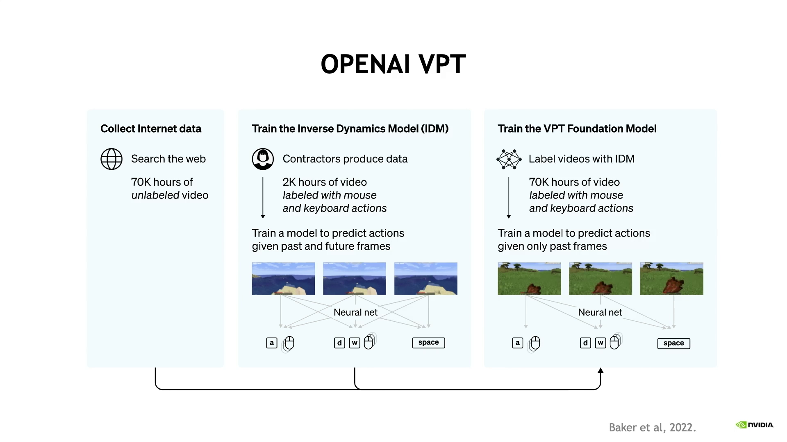

结尾部分把 MineDojo 放到同时期工作里定位。OpenAI 的 VPT 通过从 YouTube 视频中学习行为克隆，证明了 in-the-wild gameplay video 可以用于学习 Minecraft 行为。VPT 的强项是长程行为模仿，因为它直接从人类视频里学动作序列；但它不是语言条件的。MineDojo/MineCLIP 的强项是开放词汇语言目标和 reward model；但它处理的任务 horizon 相对短。

所以两者不是简单竞争关系，而是互补关系。VPT 更接近“从视频中学行为策略”，MineCLIP 更接近“从视频-语言对齐中学奖励函数”。如果把它们放在同一条研究线上，VPT 解决的是 behavior prior，MineCLIP 解决的是 language-conditioned objective。

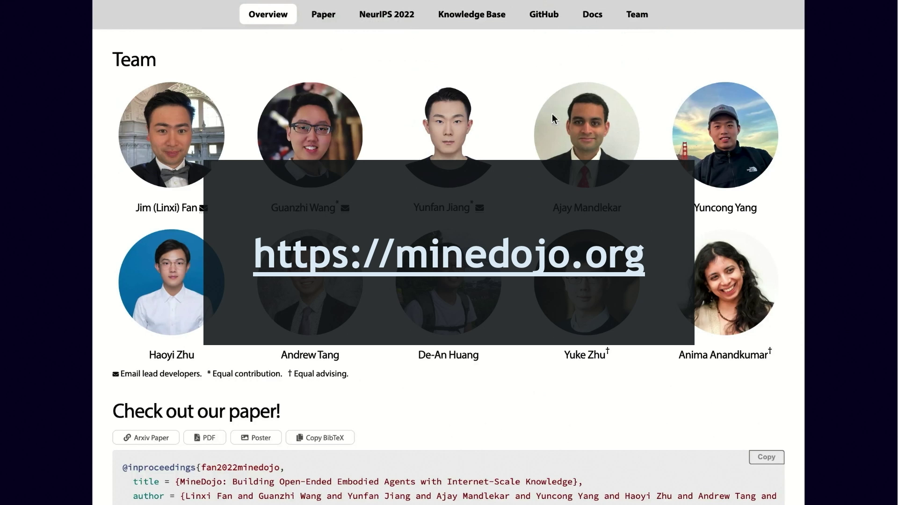

Jim Fan 也强调，当前 agent 还远远达不到人类玩家的创造力。人类能在 Minecraft 里建冬季仙境、地下神庙、甚至 CPU 电路，但当前方法主要还停留在中短程任务。MineDojo 的贡献更像是把问题系统化：环境、任务、数据、模型、评估和开源工具都搭起来，让社区可以在同一平台上推进。

Q&A 中的 Ender Dragon 问题把局限说得更直接。MineCLIP 目前无法可靠支持百万步级别的任务，因为单一视频-语言匹配分数很难在极长 horizon 上持续提供有效反馈。Jim Fan 提出的更自然路线不是把所有能力压进一个 monolithic model，而是引入层级结构：大语言模型先在语言空间里把“击败 Ender Dragon”分解成许多短程步骤，再让 embodied agent 执行每个较短的子任务。

这个回答很关键，因为它说明 MineDojo 的未来方向不是单纯“更大 PPO”或“更大视觉编码器”，而是要把 high-level planning、language decomposition、grounded reward 和 low-level control 接成一个层级系统。

## 9. 对我们研究框架的启发

这场 talk 和我们最近看的 HJB、HJ-sampler、VI primer 有一个共同问题：研究中真正该学习的对象是什么？传统 RL 往往直接学 policy，或者为每个任务手写 reward。MineDojo 的转向是先学一个语言-视频对齐的 reward potential。这个对象不是最终行动策略，但它决定了策略怎样被训练。

这和 HJB 里的“不要直接学高维向量场，而是学标量势函数”有一个结构类比。两者都在做对象替换：把一个难以直接学习、难以解释、难以泛化的对象，换成一个更可组合的中间对象。HJB 学的是 value/scalar potential；MineDojo 学的是 language-conditioned reward model。前者把控制方向编码进势函数梯度，后者把语言目标编码进视频行为评分。

对城市与社会模拟问题来说，MineDojo 的启发不在 Minecraft 本身，而在它的三层工程逻辑。第一层是环境或状态空间，例如城市路网、活动空间、建筑物、POI 和人口分布。第二层是人类行为知识库，例如轨迹、街景、遥感、POI 文本、社交媒体、规划文本和调查数据。第三层是 learned scoring function，用来评价一条生成路径、一个活动序列或一个 agent 行为是否符合某种语义目标和社会约束。

如果把这个逻辑迁移到 mobility 或 synthetic population 研究中，我们真正缺的可能不只是“更强的生成器”，而是一个能把条件、约束、语义目标和行为轨迹连接起来的 learned reward / constraint model。也就是说，模型不应只回答“生成一条最可能路径”，还应该能回答：

- 这条路径是否符合给定 OD、活动目的和城市语义？
- 它是否违反了已知空间约束或社会约束？
- 在同一条件下，还有哪些 plausible alternatives？
- 哪些部分是确定的，哪些部分是不确定的？

从这个角度看，MineDojo 提供的是一种开放世界研究范式：先把环境、任务和人类知识沉积组织起来，再学习一个能把自然语言目标、观测轨迹和优化信号接起来的中间模型。这个范式和后续要推进的 amortized inverse problem、conditional generation、agent population dynamics 都能接上。
