# Jim Fan：Robotics' End Game 与机器人版 scaling law

- Video: [Robotics End Game: Nvidia Jim Fan](https://www.youtube.com/watch?v=3Y8aq_ofEVs)
- Speaker: Jim Fan, NVIDIA Robotics
- Transcript: [transcript.md](../../youtube/transcripts/3Y8aq_ofEVs-robotics-end-game-nvidia-jim-fan/transcript.md)
- Slides: [curated/index.md](../../youtube/slides/3Y8aq_ofEVs-robotics-end-game-nvidia-jim-fan/curated/index.md)

这场 talk 的主线很清楚：Jim Fan 不是在单独介绍某个机器人模型，而是在问一个更大的问题：大语言模型已经走到了 pretraining、instruction tuning、reasoning RL、auto-research 这条 scaling 路线上，机器人能不能也复制出一条等价路线？他的回答是可以，但复制对象不能是 token，而必须是物理世界状态、动作数据和可交互环境。

## 1. 00:00-04:00：从 LLM endgame 推出 robotics 的 Great Parallel

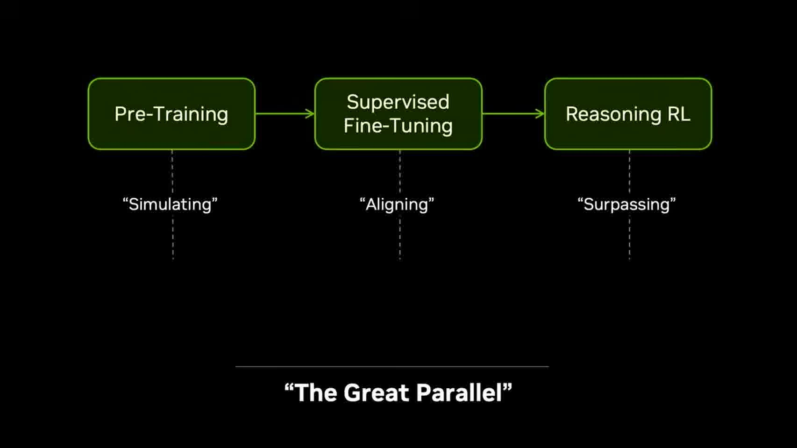

Jim Fan 开头先回忆 2016 年 OpenAI 收到第一台 DGX-1 的场景，然后把今天的 LLM 发展压成三步：第一步是 pretraining，本质上是在互联网文本上学习一个“下一个 token 的模拟器”；第二步是 supervised fine-tuning，把通用模拟器对齐到人类可用的交互形式；第三步是 reinforcement learning，让模型不只是模仿，而是能在推理和任务表现上超过纯 imitation。

这三步构成他所谓的 LLM endgame。它的关键不只是“模型更大”，而是形成了一条可持续加速的闭环：

$$
\text{simulate} \rightarrow \text{align} \rightarrow \text{surpass}.
$$

于是 robotics 的问题就被重新表述了：机器人领域能不能也找到一个等价的 pretraining object？如果语言模型模拟的是下一个 token，那么机器人模型应该模拟什么？Jim Fan 的答案是：模拟下一个 physical world state。也就是说，机器人预训练的核心不应该先是动作标签，而应该是世界状态如何随时间演化。

## 2. 04:00-06:00：VLA 仍然太语言中心，视频模型开始提供世界模拟能力

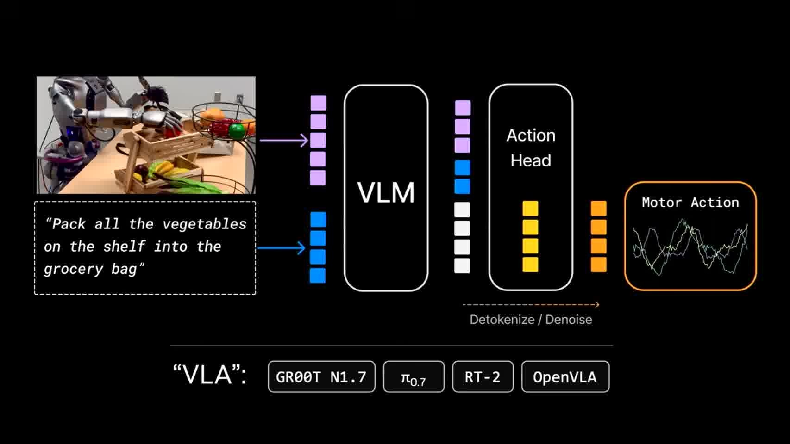

Jim Fan 接着批评当前很多 Vision-Language-Action model。它们表面上已经把视觉、语言、动作放到同一个模型里，但参数和建模重心仍然主要给了语言。换句话说，这类模型通常更擅长理解 nouns 和指令语义，而不一定真正掌握 physics 和 verbs。

这就是他对 VLA 的核心判断：语言可以帮助机器人理解任务，但如果模型的主要能力仍然来自语言建模，那么它对物理动态、接触、惯性、摩擦、失败恢复等问题的理解会很薄。机器人要做的是行动，不只是描述行动。

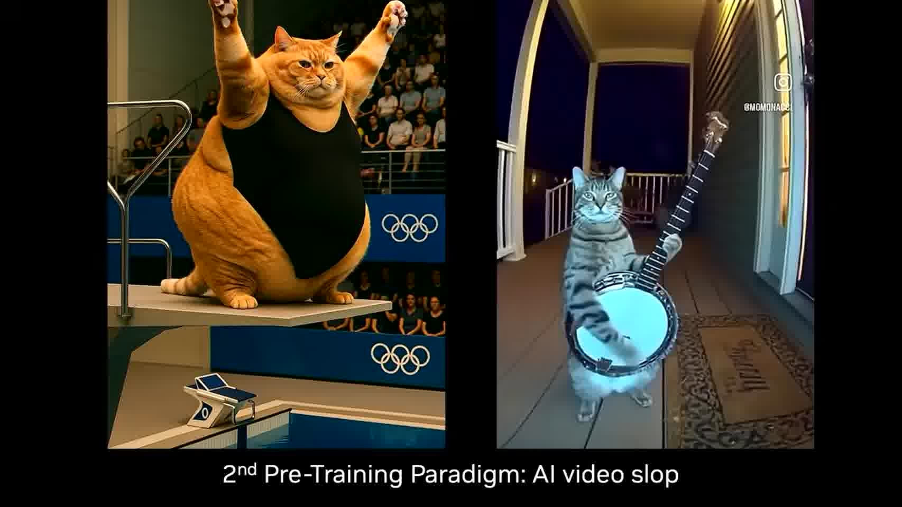

第二条路线来自视频生成模型。Jim Fan 一开始把网络上的 AI video slop 当作笑点，但马上把问题翻过来：这些视频模型之所以能生成水花、反射、重力、猫跳跃等现象，是因为它们内部已经开始学某种 next-world-state simulator。

这里的关键转折是：视频生成不只是娱乐内容生成，它可能是机器人预训练的物理基础。只要一个模型能在视觉空间里预测未来几秒的世界状态，它就已经学到了一部分物理世界的动态结构。

## 3. 06:00-08:00：DreamZero 把“预测未来”接到“选择动作”

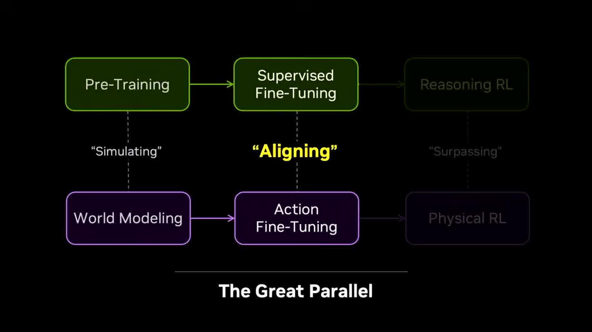

DreamZero 是 Jim Fan 用来说明 robotics alignment 的核心例子。它的思路是：模型先在视频世界模型里“梦见”接下来几秒会发生什么，再同时解码动作。动作在这里不是附属标签，而是和未来状态一起被建模的连续高维信号。

线性地说，DreamZero 做了三件事。第一，它从当前视觉状态出发预测短期未来。第二，它把动作也放进同一个预测框架里，使动作成为改变未来状态的变量。第三，它让机器人执行时可以可视化自己的 dream，如果 dream 预测对了，动作往往也对；如果 dream hallucinate，动作也会失败。

这使机器人策略从“看见图像后直接输出动作”变成：

$$
\text{current observation} \rightarrow \text{imagined future} \rightarrow \text{motor action}.
$$

这个结构和我们之前读 world model、JEPA、HJ/HJB 相关材料时看到的共同点很明显：真正有用的对象不是单个动作标签，而是一个能承载未来演化的中间动力学空间。

## 4. 08:00-11:00：数据瓶颈从 teleoperation 转向 data wearables

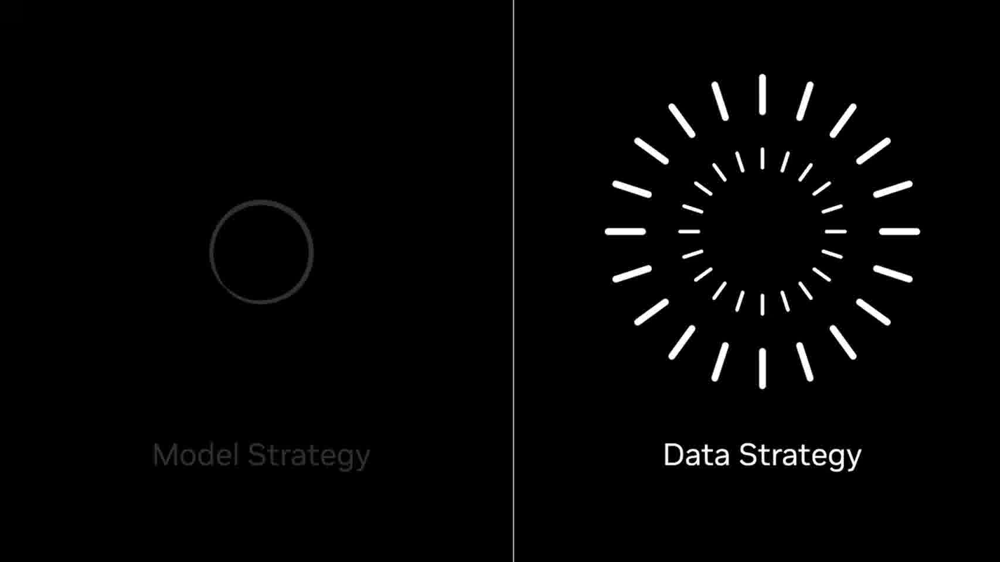

讲完模型后，Jim Fan 转向数据。机器人领域过去几年很依赖 teleoperation，也就是人通过 VR、遥操作设备或复杂手套直接控制机器人。这确实能提供高质量动作数据，但它有一个硬上限：每台机器人每天最多只能产生 24 小时数据，实际有效数据可能远低于这个上限。

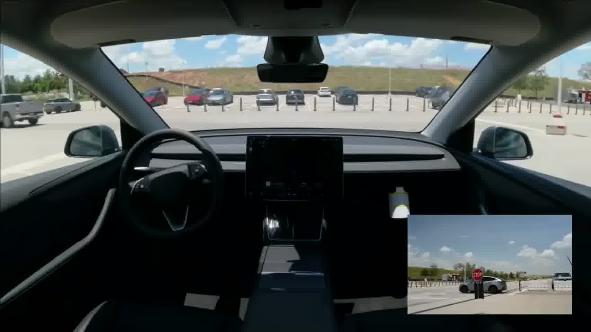

因此，teleop 的问题不是“不好用”，而是“不够可扩展”。如果机器人 scaling law 真的需要百万小时、千万小时甚至更大规模的数据，纯 robot-in-the-loop 的采集方式会被物理时间卡死。

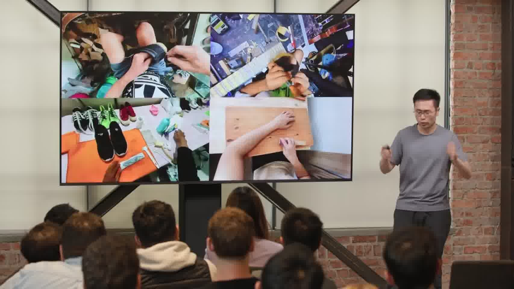

UMI 和类似 data wearable 的意义就在这里。它把采集对象从“控制机器人完成任务”改成“让人类在自然操作中携带传感器”。这一步把机器人身体暂时移出采集环节，使数据采集更接近人类动作本身，而不是每次都被机器人硬件、延迟、故障和维护成本限制。

## 5. 11:00-14:30：EgoScale 把人类第一视角视频变成 dexterity scaling law

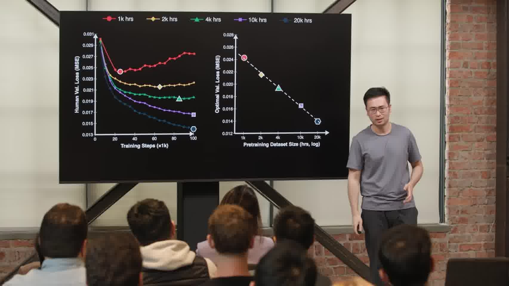

Jim Fan 随后推进到 EgoScale。它利用大量 egocentric video，也就是人类第一视角视频，并配合手部位置跟踪和语言标注，让模型从真实人类操作中学习 dexterity。这里的数据来源更接近自动驾驶里的 FSD flywheel：用户不是专门为机器人采集数据，而是在日常行动中自然留下操作轨迹。

EgoScale 的关键结果是出现了 dexterity scaling law。随着预训练小时数增加，validation loss 呈现相当干净的 log-linear 下降关系。这一点很重要，因为它把 robotics 从“经验性调参”推进到类似语言模型的 scaling 叙事：如果数据、模型和任务形式足够稳定，能力可能随数据规模系统性提高。

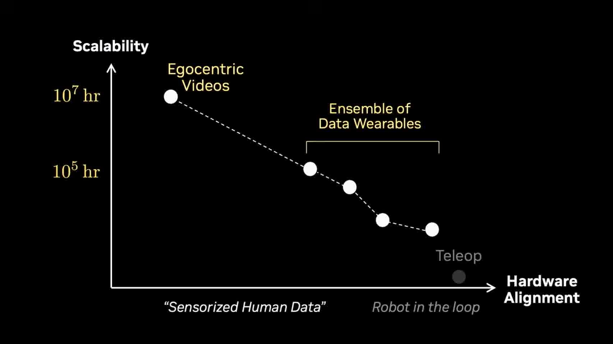

这张图给出数据策略的坐标系。横轴是和真实机器人硬件的对齐程度，纵轴是可扩展性。teleop 最贴近机器人硬件，但最不 scalable；egocentric video 最 scalable，但离具体机器人硬件较远；data wearable 位于中间。Jim Fan 的判断是：要真正走向大规模 robotics，必须把这几类数据混合起来，而不是押注单一来源。

## 6. 14:30-17:00：环境也要 scale，compute 开始等价于 environment 和 data

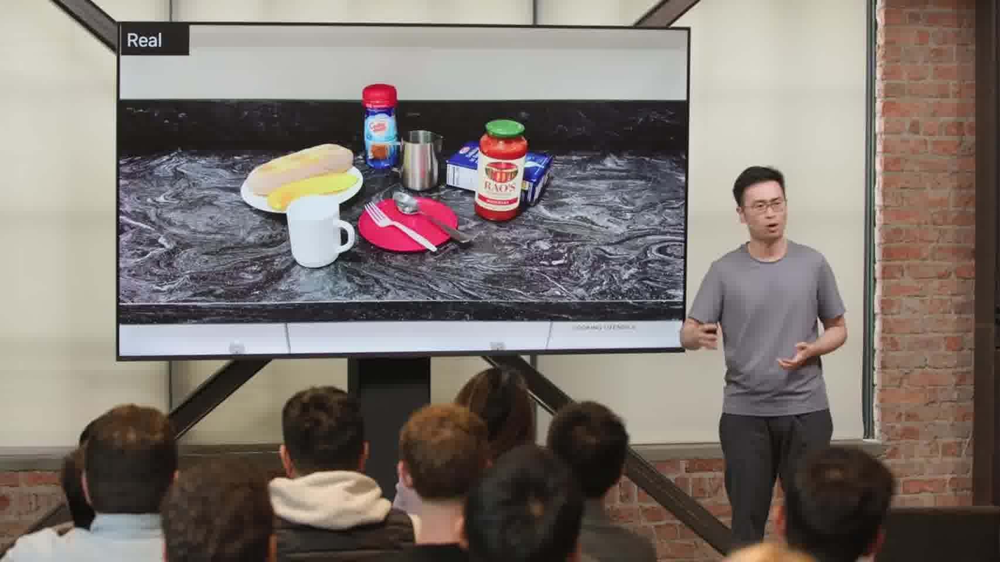

数据之外，Jim Fan 还强调环境扩展。LLM frontier labs 会购买和构造大量 coding environments 来做 RL，机器人也需要类似的环境规模。但真实机器人环境很难扩展到百万级，因为那意味着百万台机器人、百万个场景和大量维护。

他的解决方向是 world scan：用 iPhone 或其他设备扫描真实场景，自动抽取物体，再在物理模拟器中合成可交互环境。这一步把真实世界的复杂性转成可复制、可并行、可重置的训练环境。

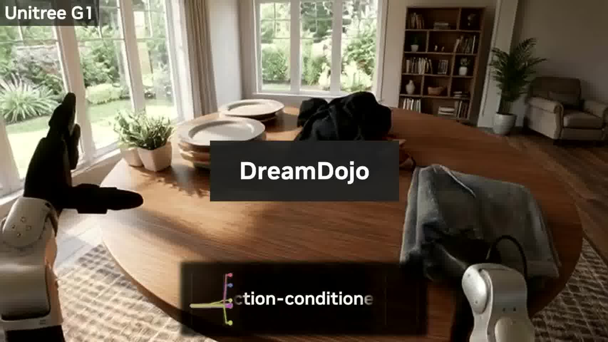

DreamDojo 则更进一步，不一定依赖传统物理引擎，而是用数据驱动的世界模型学习不同机器人的 mechanics。这里的目标不是只还原视觉，而是让生成环境能响应 action condition。也就是说，环境不仅要看起来像真实世界，还要在动作作用下演化得像真实世界。

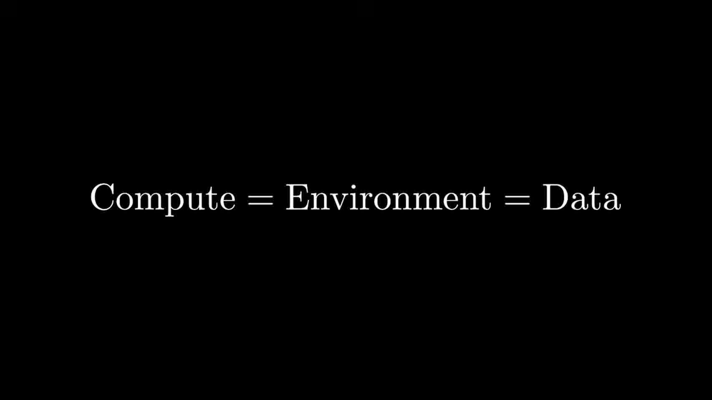

最后这句话是整场 talk 的压缩版：

$$
\text{compute} = \text{environment} = \text{data}.
$$

在机器人语境里，compute 不只是训练更大模型，而是用来生成、模拟、扫描、重建和并行运行更多世界。环境越多，交互数据越多；交互数据越多，策略和世界模型越强。

## 7. 17:00-20:00：机器人 endgame 的三个目标

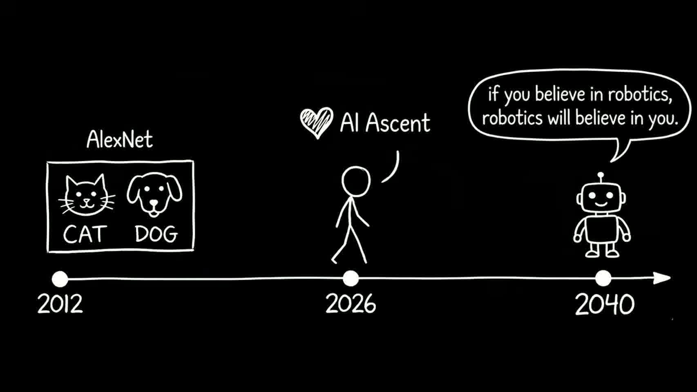

收尾部分，Jim Fan 把 robotics endgame 画成三层 achievement。第一层是 physical Turing test：机器人在真实世界中完成复杂操作，使观察者难以区分是人还是机器人在执行。第二层是 physical API：人类可以像调用软件 API 一样，把物理任务交给机器人系统执行。第三层是 physical auto-research：机器人不仅执行任务，还能设计、改进、制造下一代机器人或实验系统。

这条路线的研究含义是：机器人不是单纯的硬件问题，而是一个世界模型、动作策略、数据 flywheel、可扩展环境和自动化科研闭环共同组成的系统问题。它和我们前面读过的 generative world model、JEPA、HJB/HJ sampler 都有共同核心：模型必须学习一个能承载未来演化的中间对象，不能只拟合表面输入输出。

对我们当前研究的启发也很直接。如果我们研究的是城市、交通、人口或基础设施系统，真正可借鉴的不是“机器人”这个应用本身，而是这条 scaling 逻辑：找到可模拟的世界状态，找到可扩展的行为数据，找到能连接条件、状态和未来演化的中间表征，再把采样、控制和评估闭合起来。
