# Kaiming He: Learning Deep Representations

Source: [Deep Learning Bootcamp: Kaiming He](https://www.youtube.com/watch?v=D_jt-xO_RmI)

Transcript: [transcript.md](../../youtube/transcripts/D_jt-xO_RmI-deep-learning-bootcamp-kaiming-he/transcript.md)

Curated slides: [curated/index.md](../../youtube/slides/D_jt-xO_RmI-deep-learning-bootcamp-kaiming-he/curated/index.md)

## 0. 这场 Talk 的位置

这场讲座表面上是在回顾深度学习的发展史，但它真正的主线不是“模型年表”，而是一个更基础的问题：

**为什么深度学习的核心是 representation learning？**

Kaiming He 的讲法很线性。他先说明，现实中的原始对象通常太复杂，不能直接在原始空间里解决任务；然后用图像任务展示 CNN 怎样把原始像素逐层变成高层语义；接着解释为什么网络加深以后会遇到初始化、归一化和优化问题；最后把同一套“模块组合成表征”的语言推广到序列、语言、蛋白质和 Vision Transformer。

所以这场 talk 的骨架可以压成一条线：

**raw data 太复杂，因此需要 representation；representation 可以由深层模块组合学出来；但深层网络要真的可训练，就必须解决信号传播和优化几何；一旦这些机制成立，同一套思想就可以从图像扩展到序列、语言、蛋白质和通用视觉模型。**

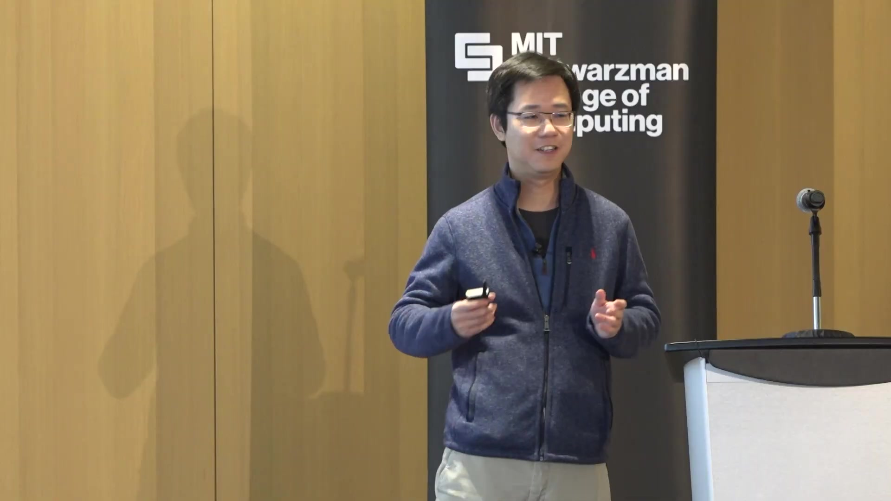

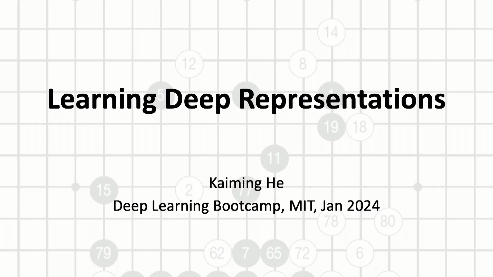

## 1. Representation Learning：为什么不直接在原始空间解决问题

讲座一开始先把 deep learning 的主角换掉。主角不是某个分类器，也不是某个 benchmark，而是 representation。

原始数据通常是低层、庞大、无结构的。例如图像是像素矩阵，语音是波形，文本是词序列，围棋是棋盘状态，蛋白质是氨基酸序列。这些对象在原始空间里都非常高维，而且大多数坐标并不直接对应任务所需要的概念。

因此，一个学习系统不能只是在原始空间里机械搜索。它必须先把原始对象变成另一种表示：

**这个表示要压缩掉不重要的细节，保留对任务有用的结构，并且让后续分类、预测、控制或生成更容易。**

这就是 He 在开头强调的判断：deep learning is representation learning。

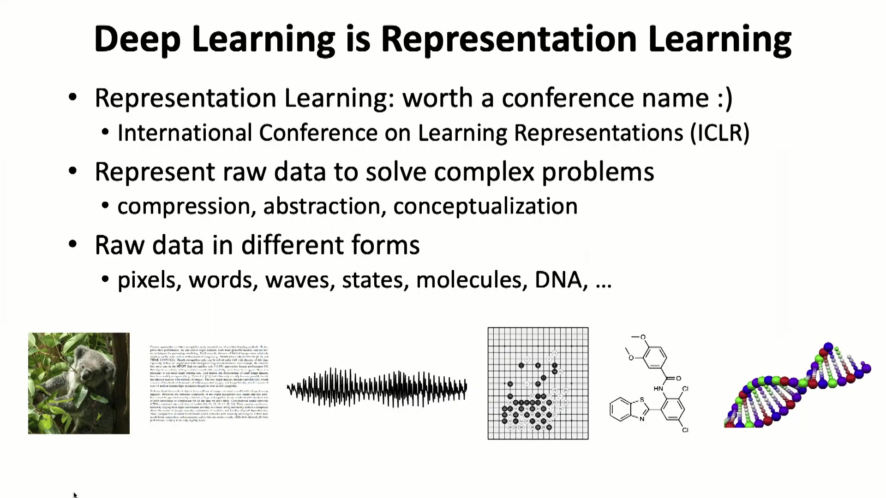

围棋例子把这个问题讲得很清楚。一个棋盘状态如果直接按原始组合空间来数，状态空间极其巨大。可是人类下棋时并不是在原始棋盘组合里暴力搜索，而是会形成更高层的结构判断，例如局部形状、势力范围、眼位、攻防关系和胜率判断。

这说明“好表征”不是把原始状态照搬一遍，而是把原始状态变成更接近决策结构的对象。

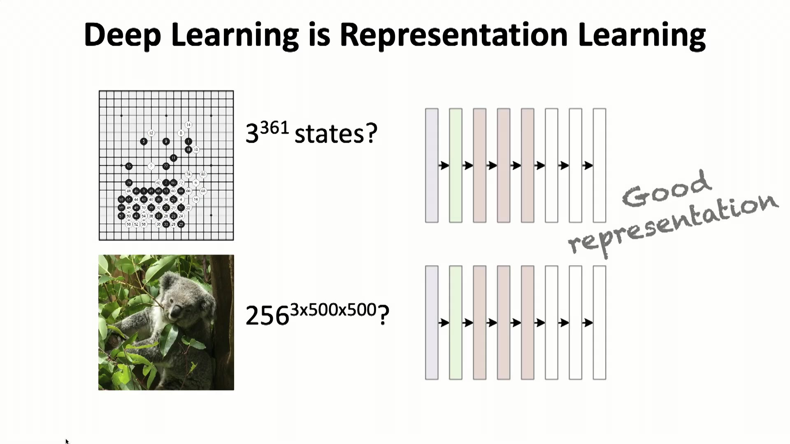

AlphaGo 的例子进一步说明，表征不是装饰性的中间层，而会直接改变系统能力。即使后面的强化学习和 Monte Carlo tree search 保持基本一致，表征网络更深、更强，整体 Elo 也会提高。

这里的含义是：复杂智能系统的性能并不只取决于搜索算法本身，也取决于它用什么 representation 来理解当前状态。

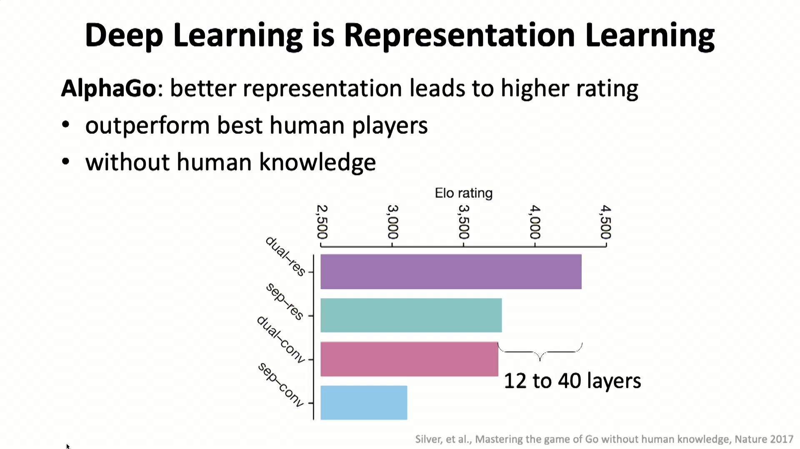

接下来，He 给出深度学习的关键工程思想：不是人工一次性设计一个复杂函数，而是把很多简单模块组合起来，让它们通过数据学习出复杂函数。

这句话是整场 talk 的核心。

传统机器学习里，很多表征来自人工特征工程。人先定义边缘、纹理、词频、局部统计量，再把这些特征交给分类器。但深度学习把这部分工作交给模型本身：人设计的是可组合模块，例如 convolution、pooling、normalization、attention、residual connection；模型通过反向传播学习这些模块里的参数。

所以深度学习并不是完全消除了人的设计，而是改变了人的设计位置：

人不再手工写出每个任务的特征，而是设计一种可以从数据中学习特征的模块化机制。

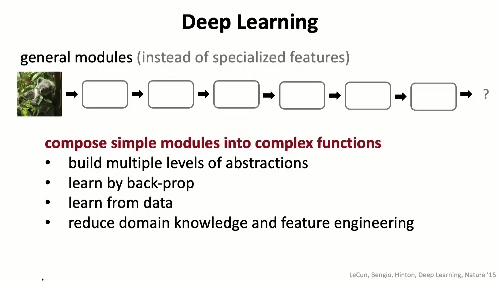

到这里，第一层逻辑已经建立起来：

原始空间太复杂，所以要学 representation；representation 不是手工特征的静态列表，而是由可训练模块逐层组合出来的中间结构。

## 2. 图像表征：从手工特征到 CNN

讲座随后进入图像。图像是 representation learning 最直观的例子，因为像素本身几乎不包含显式语义。一个像素只是亮度或颜色值，但任务需要识别的是边缘、局部纹理、部件、物体以及场景关系。

所以问题变成：

**怎样从局部像素开始，逐层构造越来越抽象的视觉表征？**

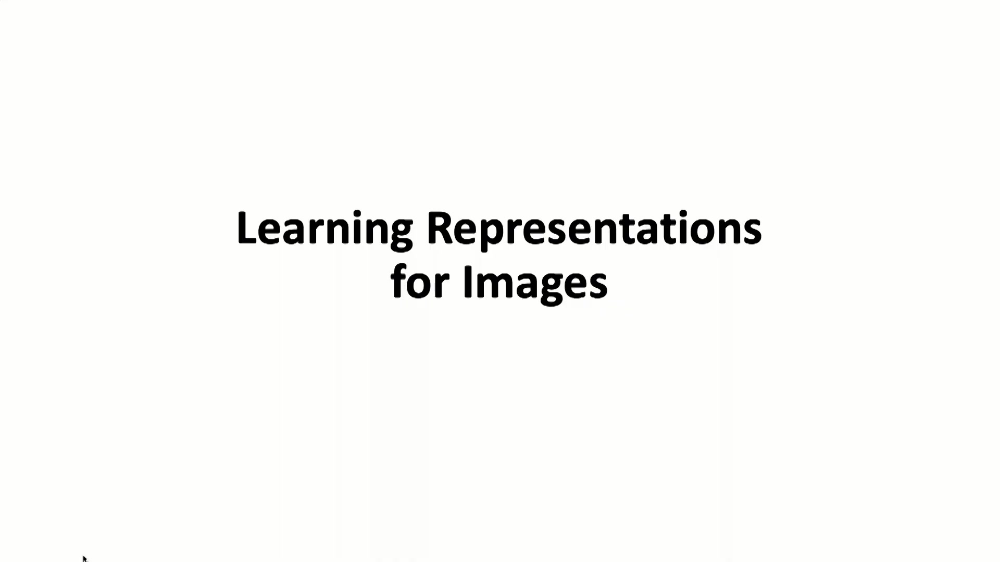

He 在这里没有直接跳到 AlexNet，而是先把 CNN 的基本逻辑放回 LeNet。原因是：AlexNet 的革命性不在于它凭空发明了 CNN，而在于它把 LeNet 已经证明过的模块化 CNN 路线放大到了 ImageNet 规模。

因此，这一段的线性顺序应该是：

先理解 LeNet 给出了什么基本结构；再理解这些结构为什么当时没有立刻引爆；然后再看 AlexNet 到底把哪些维度 scale up；最后才进入可视化、transfer learning 和后面的 VGG。

### 2.1 LeNet：CNN 的基本结构先出现了

LeNet 是这条线的早期关键节点。它已经包含了 CNN 后来长期保留的基本结构：卷积层、池化或下采样层、全连接层，以及端到端反向传播。

He 对 LeNet 的强调不是“这个模型很早”，而是“这个模型已经把图像结构写进了神经网络”。CNN 被称为 translation-invariant architecture，是因为同一个局部操作可以在图像不同位置重复使用；如果输入图像整体平移几个像素，模型仍然应该得到相近的识别结果。

也就是说，CNN 一开始就不是普通 MLP 的任意替代品，而是针对图像空间结构设计出来的表征机器。

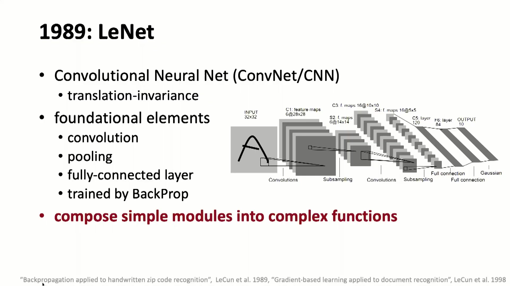

### 2.2 卷积层：从 fully connected 到 locally connected，再到 weight sharing

卷积层的逻辑最好按三步展开。

第一步是 fully connected layer。在全连接层里，每个输出神经元都连接到每个输入神经元。如果输入图像很大，这会带来大量参数，而且这种连接方式并没有利用图像的局部性。

第二步是 locally connected layer。它把每个输出神经元只连接到输入图像的一个小窗口。这样做符合视觉直觉：边缘、角点、笔画、纹理这些低层模式通常只需要局部像素就能识别，不需要一开始就看整张图。

第三步才是 convolution。卷积在 locally connected 的基础上再前进一步：不同空间位置使用同一组权重。也就是说，一个卷积核在左上角学到的边缘检测器，也可以在右下角继续使用。

所以，卷积层不是一个孤立技巧，而是沿着这条线来的：

fully connected 参数太多，也不利用局部性；locally connected 利用局部性，但不同位置仍然各学一套参数；convolution 再加入 spatial weight sharing，使同一种局部模式可以跨位置复用。

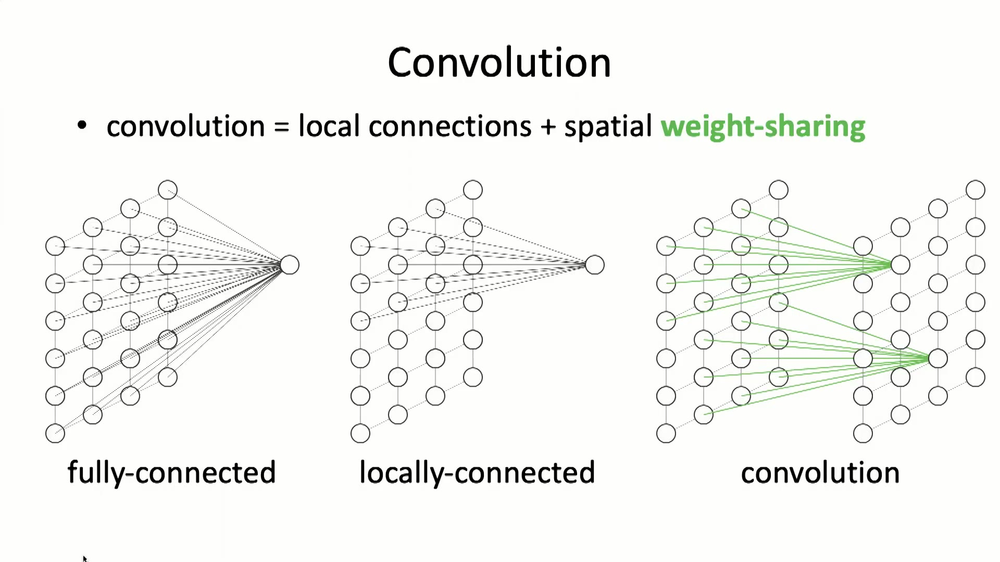

### 2.3 Pooling：降低空间尺寸，同时获得局部不变性

卷积层之后，He 接着讲 pooling。Pooling 的第一层作用很直接：缩小 feature map，降低后续计算量。

但它还有第二层作用：local invariance。如果一个局部结构在小窗口内轻微抖动，比如边缘或笔画移动了几个像素，模型仍然应该认为它是相似的结构。Pooling 把这种局部稳定性写进网络，让下一层不必对每一个微小位移都重新学习。

因此，卷积和 pooling 在 LeNet 里承担的角色不同：

卷积负责从局部区域提取可复用模式；pooling 负责把这些模式变成更稳定、更抽象的空间表示。

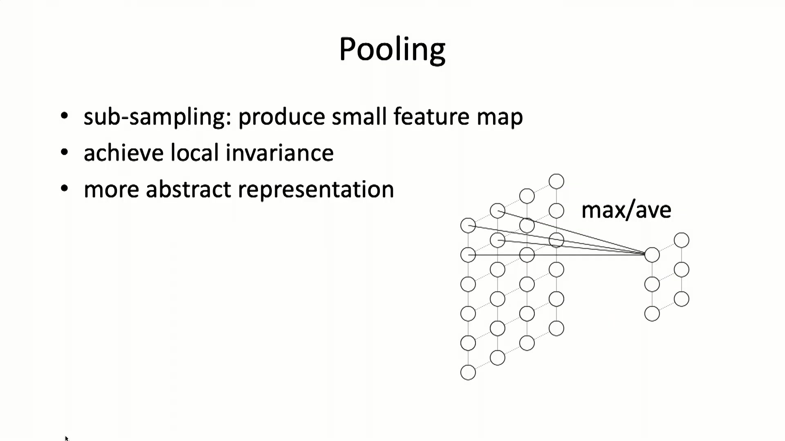

### 2.4 LeNet step by step：像素怎样变成分类表征

接下来，He 按 LeNet 的计算过程逐步展开。这个过程很重要，因为它展示了 CNN 表征是如何一层层形成的。

输入图像首先是一个灰度图，所以它只有一个通道。例子里的空间大小是 $32\times 32$。

第一组卷积核大小是 $5\times 5$，输出 6 个通道。卷积以后，空间尺寸变成 $28\times 28$，于是得到第一组低层 feature maps。

然后做第一次 pooling，把每个空间维度缩小一半，feature map 从 $28\times 28$ 变成 $14\times 14$。

接着做第二组卷积，仍然使用 $5\times 5$ 的 kernel，但输出通道数变成 16。此时空间尺寸进一步变成 $10\times 10$。

再做第二次 pooling，空间尺寸变成 $5\times 5$。

最后，把这个 $5\times 5$ 的空间 feature map flatten，交给全连接层，输出 10 个类别。

所以 LeNet 的线性过程是：

raw pixels $\rightarrow$ 局部边缘和笔画 $\rightarrow$ 更稳定的局部 feature maps $\rightarrow$ 更高层的局部组合 $\rightarrow$ flatten 后的全局分类表征 $\rightarrow$ class prediction。

这就是早期 CNN 的基本表征逻辑。

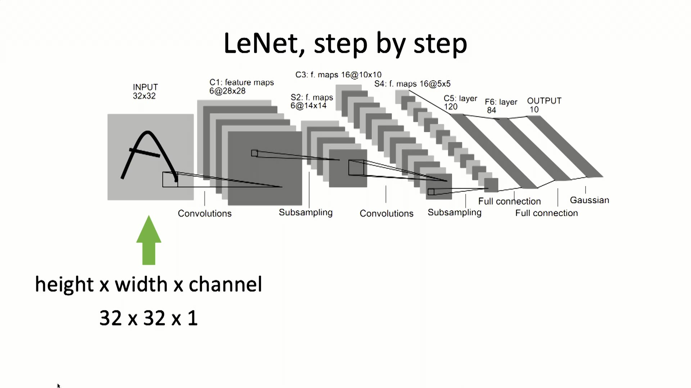

### 2.5 为什么 LeNet 没有立刻引爆

LeNet 的结构已经很接近后来 CNN 的核心形式，但它在提出后并没有马上改造整个计算机视觉领域。He 给出的原因很直接：当时缺少足够大的数据和足够强的计算。

MNIST 在当时已经是重要数据集，但它只有 50,000 张训练图像、10 个类别。这个规模足够训练一个小模型，却不足以说服整个计算机视觉社区相信 CNN 可以处理更复杂的自然图像识别。

因此，LeNet 到 AlexNet 之间不是“模型思想从无到有”的断裂，而是“已有思想等待数据和计算条件成熟”的阶段。

### 2.6 AlexNet：真正的 thesis 是 scale up CNN

2012 年的 AlexNet 是下一次跃迁。He 对 AlexNet 的概括很明确：这篇论文只有一个核心 thesis，就是 scale up convolutional neural networks。

这里的 scale up 不是单指模型更深，而是至少包含四个维度。

第一，数据规模变大。AlexNet 在 ImageNet 上训练，数据规模达到约一百万张图像、1,000 个类别。这和 MNIST 的 50,000 张图像、10 个类别不是一个量级。更关键的是，它证明了神经网络可以直接在大规模 raw pixels 上端到端训练。

第二，模型规模变大。AlexNet 有超过 6,000 万个参数和 60 多万个神经元。这个规模在当时远大于许多传统视觉模型。

第三，正则化和训练技巧更成熟。大模型加大数据并不自动成功，因为 overfitting 会变得严重。AlexNet 使用 data augmentation 和 dropout 来降低过拟合，这两种技术后来都成为深度学习训练的常规组件。

第四，GPU 工程进入关键位置。AlexNet 展示了 GPU 训练的潜力，并涉及数据并行和模型并行：不同样本可以分到不同 GPU，模型的不同 filter 或 layer 也可以分布到不同 GPU，以降低计算和显存压力。

所以，AlexNet 的意义不是“突然出现一个更好的 CNN”，而是把 CNN 放进了一个新的系统条件里：

大规模数据、大模型、正则化技术、GPU 工程共同成熟，CNN 才从早期架构变成深度学习革命的核心证据。

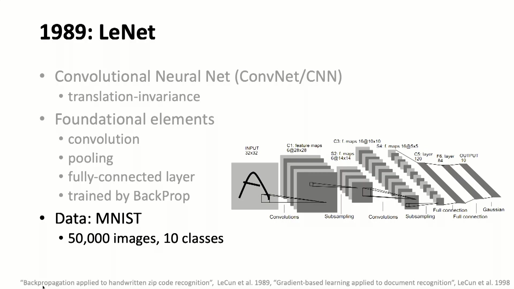

### 2.7 AlexNet 和 LeNet 的差别：同一种模块语言被放大了

He 接着把 LeNet 和 AlexNet 放在一起比较。这个比较很关键，因为它避免了一个误解：AlexNet 并不是完全换了一套语言。高层看，它仍然是 convolutional layers、pooling layers 和 fully connected layers 的组合。

真正的差别在于三点。

第一，AlexNet 更深。相比 LeNet，它多了三层卷积层和一层 pooling。更深的网络可以从更大数据里学习更高层抽象，因此具有更强的 representation power。

第二，AlexNet 使用 ReLU，而 LeNet 使用 sigmoid。Sigmoid 在输入过大或过小时容易出现梯度接近零的问题；ReLU 只有在输入小于零时梯度为零，因此在深层网络里更容易保留非零梯度。这让反向传播更容易穿过深层结构。

第三，AlexNet 更宽。这里的“宽”主要指通道数更多。更多 channels 意味着每一层可以同时表示更多类型的特征，因此模型不只是层数增加，横向 feature capacity 也增加了。

所以 AlexNet 的革命性不是单点突破，而是同一套 CNN 模块语言在深度、宽度、数据、正则化和 GPU 工程上的系统放大。

### 2.8 AlexNet 之后：可视化让社区看见表征层级

AlexNet 成功后，计算机视觉社区开始认真理解 neural network 到底学到了什么。可视化工作的核心问题是：

什么样的输入会激活某个特定 feature？

做法可以理解成从 feature space 反推 pixel space：先把某个 feature map 设成 one-hot，然后用反向传播把这个激活模式传回像素空间，观察它对应什么视觉模式。

可视化结果提供了一条很清楚的层级图像。第一层通常是边缘检测器或颜色检测器；第二层开始出现纹理、局部形状、圆角和细线；第三层以后逐渐出现更语义化的局部结构；更深层甚至会对狗头、鸟身、动物眼睛等高层模式产生响应。

这一步的重要性在于：它让人看到 CNN 并不是黑箱地直接从像素跳到标签，而是在中间形成了层级表征。

这些高层表征恰恰是传统计算机视觉几十年来很难手工设计出来的东西。

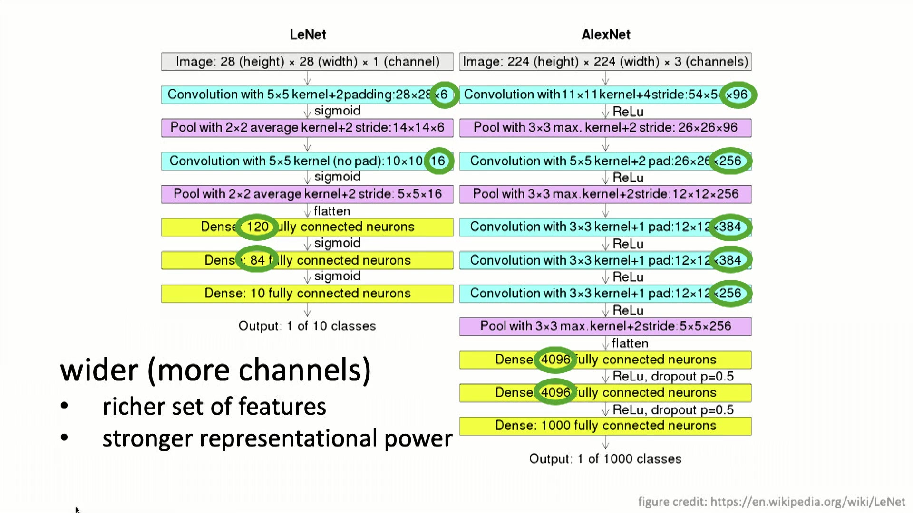

### 2.9 Transfer learning：AlexNet 之后真正改变使用方式的发现

可视化之后，He 特别强调另一个发现：deep representations are transferable。甚至在他的评价里，这是 deep learning revolution 中最重要的发现之一。

这里的逻辑是这样的。

如果一个大网络在 ImageNet 这样的大规模数据集上学到了高层视觉表示，那么这些表示不一定只对 ImageNet 有用。因为很多视觉任务共享低层边缘、纹理、中层部件和高层语义结构。

于是，对于一个小数据集，我们不一定要从头训练一个大网络。可以先拿 ImageNet 预训练网络，把已经学到的 representation 迁移过来，再在小数据集上 fine-tune 一部分层。

这一步改变了深度学习的使用方式。它让没有大规模专属数据的任务也能使用深层 CNN，进而把深度学习推广到大量小规模视觉任务中。

这也是后面 foundation model 思想的早期形式：先在大规模数据上学通用 representation，再把它迁移到下游任务。

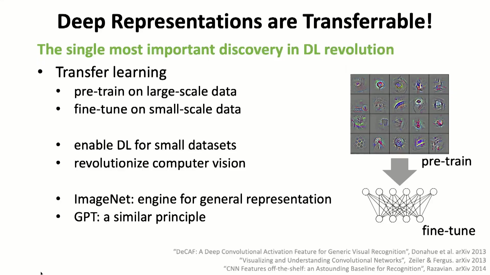

到这里，图像部分的第一条线才完整闭合：

LeNet 给出 CNN 的基本模块；AlexNet 把同一套模块语言放大到 ImageNet 和 GPU 时代；可视化说明深层 CNN 确实学到了层级表征；transfer learning 则说明这些表征可以迁移，而不只是服务于单个分类器。

## 3. VGG：把“深度”这个变量单独拿出来检验

AlexNet 之后，一个自然问题出现了：如果深度表征有用，那是不是网络越深越好？

VGG 的作用，就是把这个问题从经验直觉推进成更清楚的实验判断。它没有引入很多复杂组件，而是刻意采用一种非常朴素的设计：卷积层、池化层、全连接层，并且卷积层几乎都使用 $3\times 3$ kernel。

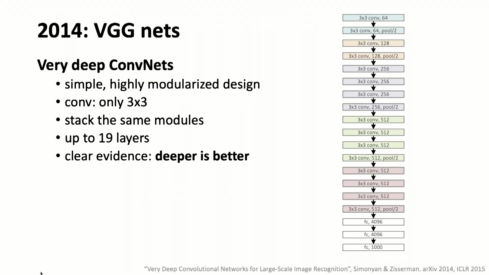

这一步的关键不是“VGG 又提出了一个新模块”，而是“VGG 尽量减少了其他变量”。在 VGG 之前，很多网络变好时，深度、宽度、模块设计、训练技巧往往一起变化，因此很难判断性能提升到底是不是来自深度本身。

VGG 的做法更像一个控制实验：把模块设计保持得非常简单，只按照规则不断增加 $3\times 3$ 卷积层。这样一来，如果更深的版本系统性优于更浅的版本，就更有理由说 depth 本身确实在提升 representation power。

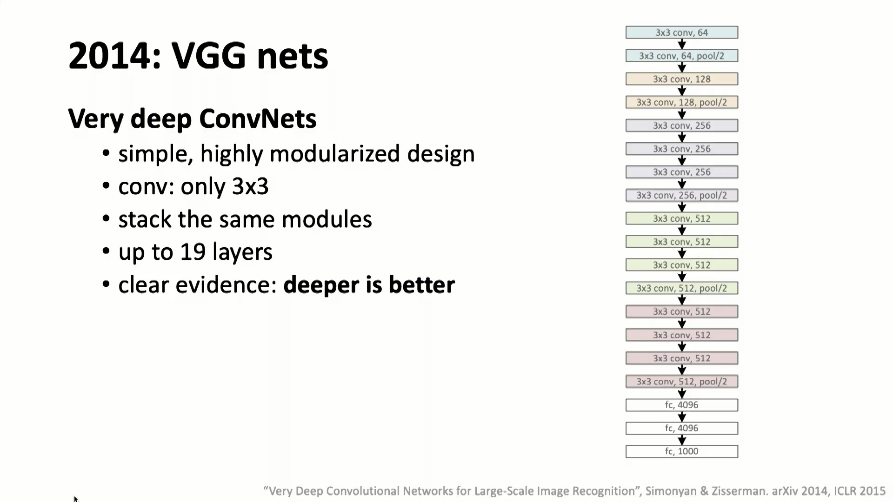

所以 VGG 在这条历史线里的意义是：它让“deeper is better”第一次变成很有说服力的经验结论。更深的网络可以形成更多层级的中间特征，也可以在 classification、detection、segmentation 等任务里作为强 backbone。

但 He 立刻指出一个 caveat：VGG 当时并不是完全从随机初始化开始端到端训练出来的。更深版本常常需要 stage-wise training：先训练一个较浅网络，再往上加几层，然后继续 fine-tune。

这个细节很重要，因为它说明 VGG 虽然证明了深度有价值，但还没有完全解决“深层网络如何从零开始稳定训练”的问题。也就是说，VGG 把问题推进到了下一层：

**如果我们相信更深的网络更有表达力，那怎样让很深的网络从初始化开始就能训练起来？**

## 4. 初始化：让深层网络从一开始就有健康的信号传播

初始化要解决的问题不是最终模型能表达什么，而是训练刚开始时信号能不能穿过很多层。

He 的推理从一个线性层开始。设一层把输入 $x$ 变成输出 $y$，权重为 $W$。如果输入各维度和权重大致独立，那么一层之后输出方差会被某个比例因子缩放。直观地说，这个比例因子和输入维度以及权重方差有关：

$$
\mathrm{Var}(y) \approx n\,\mathrm{Var}(W)\,\mathrm{Var}(x).
$$

一层里这个缩放看起来不严重，但深层网络会把这个缩放重复很多次。如果每一层的缩放因子都略小于 1，那么很多层相乘以后，信号会消失；如果每一层都略大于 1，那么信号会爆炸。

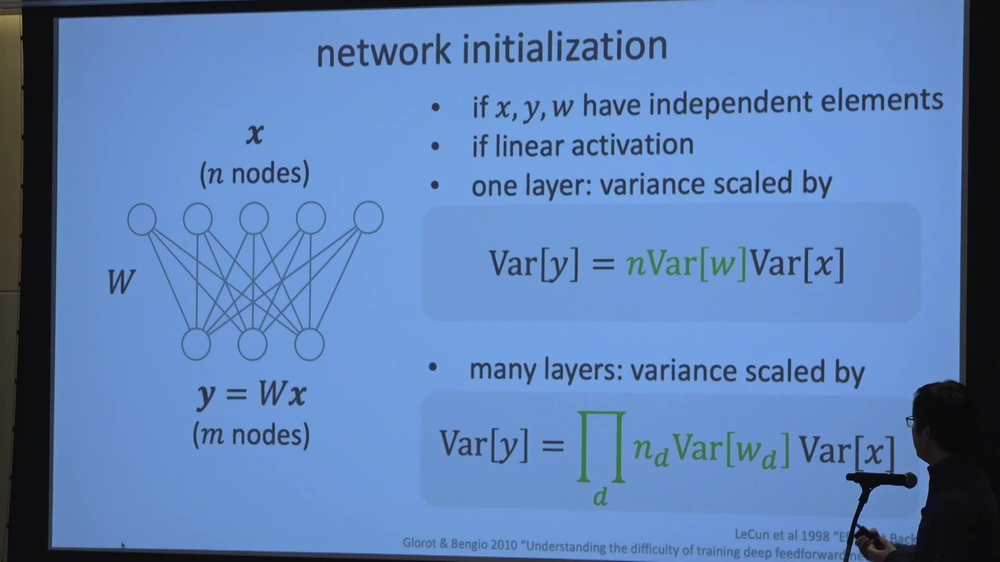

反向传播也有同样问题。梯度从后往前传时，也会不断乘上每一层的缩放因子。因此初始化必须同时照顾 forward signal 和 backward gradient：前向激活不能逐层消失或爆炸，反向梯度也不能逐层消失或爆炸。

这就是为什么初始化不是随便给权重一个小随机数。它实际上是在设置每一层的初始方差，使深层网络一开始就处在一个可训练的尺度上。

接着 He 说明，激活函数会改变方差传播规则。线性激活或近似对称激活下，可以使用类似 Xavier initialization 的思路，让前向和反向方差保持平衡。但 ReLU 会把负半轴截断为零，相当于让大约一半信号不再通过。

因此，如果还沿用线性激活下的方差设定，ReLU 网络里的信号会被系统性压低。Kaiming initialization 的核心就是把 ReLU 的这种“半边截断”算进去，重新设置权重方差，使深层 ReLU 网络也能从头训练。

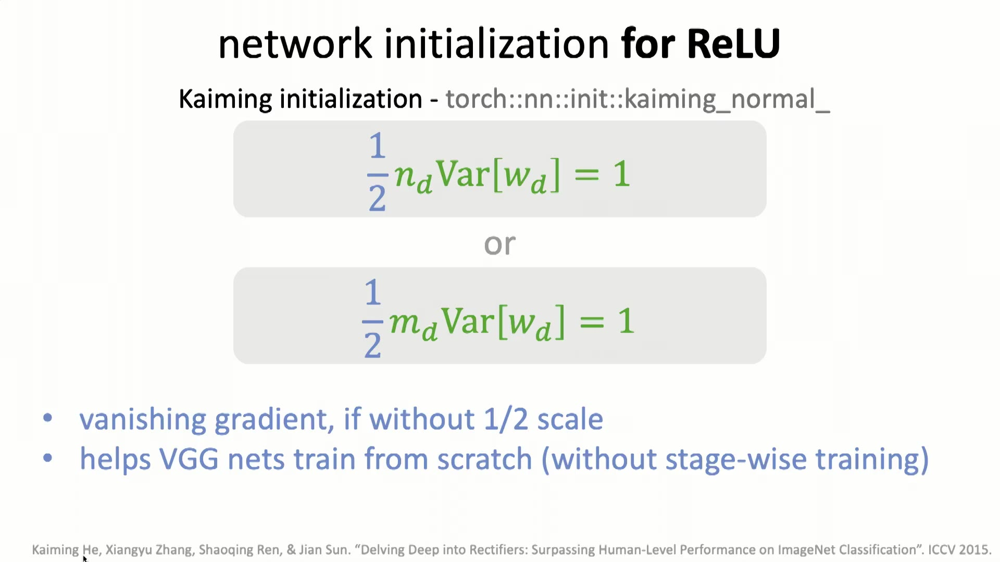

所以从 VGG 到 initialization 的逻辑是连续的：

VGG 说明深度有价值；stage-wise training 暴露出深层网络从零训练很难；初始化理论则解释了为什么难，并给出让深层 ReLU 网络直接从 scratch 开始训练的条件。

## 5. Inception 与 Normalization：更经济的结构，以及训练过程中的稳定器

初始化解决的是训练起点，但网络结构本身仍然要继续发展。接下来 He 讲 GoogLeNet / Inception，它回答的是另一个问题：

**如果深层网络越来越大，怎样让每一层既有表达力，又不让计算成本失控？**

Inception module 的思路是把一个层级内部拆成多个分支。同一个输入可以同时经过 $1\times 1$、$3\times 3$、$5\times 5$ 卷积，也可以经过 pooling。不同分支对应不同尺度的特征抽取，最后再把它们合并。

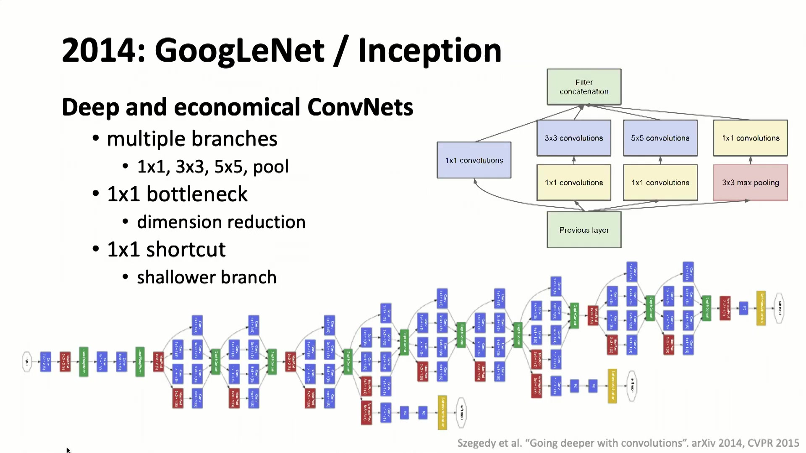

这里的直觉是：同一张 feature map 里可能同时需要局部纹理、中等尺度结构和更大感受野的信息。如果只选一种卷积核大小，就等于提前替模型决定了唯一尺度；Inception 则让多个尺度并行存在，再由后续层学习如何组合。

$1\times 1$ 卷积在这里不是装饰。它可以在不改变空间位置的情况下混合通道，并控制通道数。放在大卷积之前时，它相当于 bottleneck：先降低通道维度，再做较贵的 $3\times 3$ 或 $5\times 5$ 运算，从而节省计算。

所以 Inception 代表的是“深而经济”的结构设计：模型仍然很深、很有表达力，但每个模块内部会主动管理计算量。

不过，复杂模块也带来新的训练问题。结构越复杂，每一层中间激活的分布越容易变化；前一层参数一更新，后一层看到的输入分布也会跟着变。这样训练过程就不只是“找一个好函数”，还要不断适应内部信号尺度的变化。

normalization 模块就是在这个位置出现的。它把网络内部的激活重新拉回稳定尺度，让后面的层不至于一直追着前面层的分布变化。

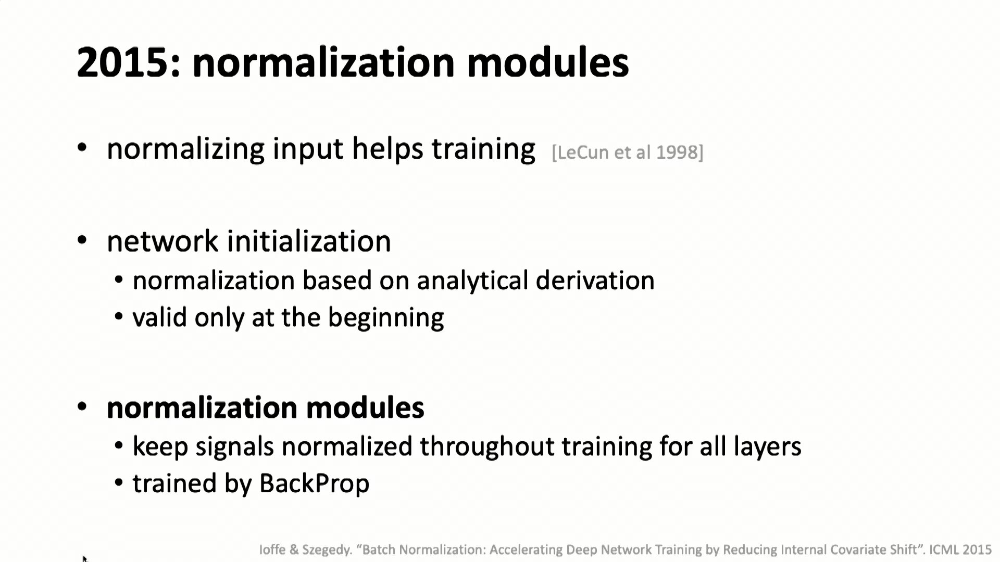

Normalization 的计算可以按三步理解。第一步，选一个 support set，也就是决定在哪些维度上统计均值和方差。第二步，用这个均值和方差把激活标准化。第三步，再加一个可学习的 affine transformation，例如 scale 和 shift，让网络在需要时可以恢复或调整表示能力。

第三步很重要。直接标准化会减少自由度；可学习的 scale/shift 则把被标准化压掉的一部分表达能力补回来。所以 normalization 不是简单地把所有激活硬压成同一个分布，而是在“稳定尺度”和“保留可学习自由度”之间折中。

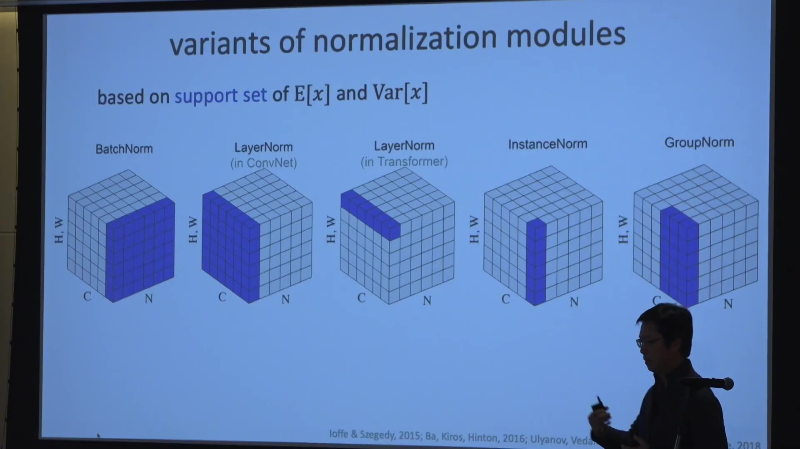

不同 normalization 方法的区别，主要在于 support set 不同。BatchNorm 会使用 batch 维度统计量；LayerNorm 更关注单个样本内部的特征维度；InstanceNorm 和 GroupNorm 又对应不同的空间、通道组织方式。

因此，这些方法不是一条简单排名，而是服务于不同训练场景。大 batch 图像训练中 BatchNorm 很自然；而序列模型、Transformer 或 batch size 不稳定的场景中，LayerNorm 往往更稳。

Normalization 的实际效果可以线性理解为两层。第一层，它让模型更容易 start training，避免一开始就发散或停滞。第二层，即使模型本来能训练，它也能让收敛更快、优化更稳定。

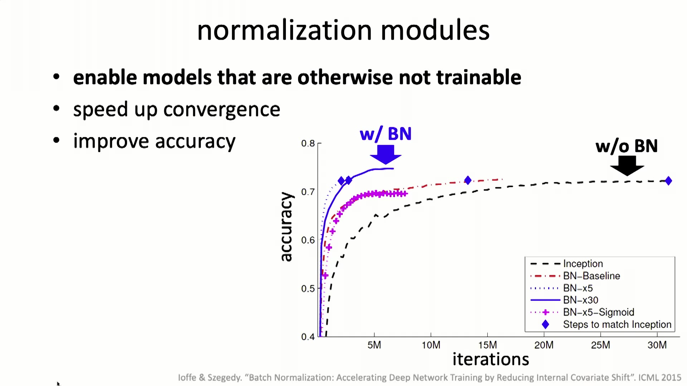

到这里，深层网络已经有了三类条件：VGG 证明深度有价值，initialization 稳定训练起点，normalization 稳定训练过程。但 ResNet 还要解决一个更深的优化问题。

## 6. ResNet：深度为什么突然变成可扩展的方向

ResNet 部分是整场 talk 的中心之一。它回答的问题不是“网络能不能更深”，而是：

**为什么普通深层网络变深以后，训练误差反而会变差？**

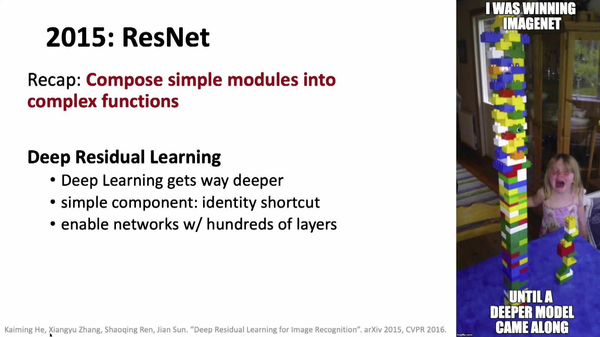

这个现象叫 degradation problem。它和 overfitting 不一样。Overfitting 是训练误差低、测试误差高；degradation 是更深的 plain network 连训练误差都更高。

这说明问题不在泛化，也不在容量不足。更深的模型理论上容量更大，应该至少能表达浅模型已经学到的函数。真正的问题是：普通参数化下，优化器找不到那个本来应该存在的好解。

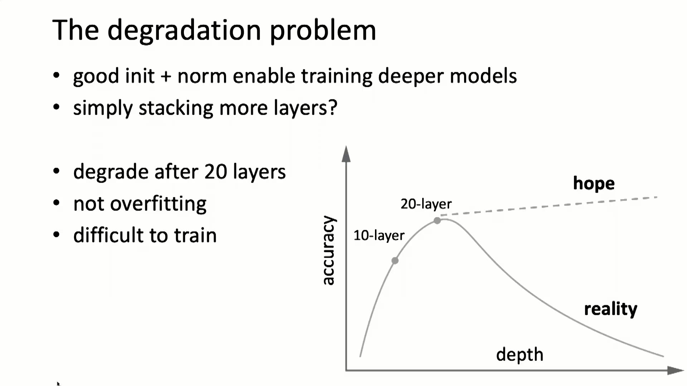

He 用一个思想实验把这个问题拆开。假设一个浅层网络已经能达到不错的训练误差。如果我们在它后面继续加层，那么理论上更深网络不应该更差，因为新增层只要学成 identity mapping，就可以原样传递浅层网络的输出。

换句话说，从函数空间角度看，深网络应该至少包含浅网络的解。它可以先复制浅网络，再在此基础上做改进。

但经验上 plain network 做不到这一点。它不是没有这个解，而是很难把新增层优化成足够接近 identity 的形式。因此 degradation 暴露出的不是表达能力问题，而是 identity mapping 在普通网络参数化中并不容易被优化出来。

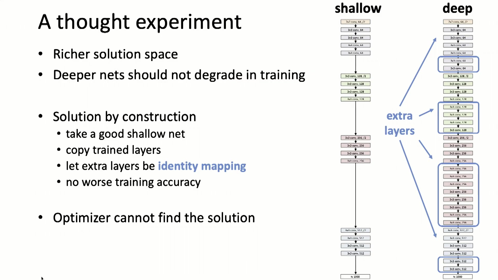

ResNet 的核心改写就是把一个子网络要学的目标从完整映射 $H(x)$ 改成 residual：

$$
F(x)=H(x)-x.
$$

于是这个 block 的输出写成：

$$
H(x)=F(x)+x.
$$

这不是形式上的代数游戏，而是把优化任务换了一个坐标系。Plain network 必须让若干层直接学出 $H(x)$；residual block 则让 skip connection 先把 $x$ 原样送到输出端，权重层只负责学习在 $x$ 上需要增加的变化量 $F(x)$。

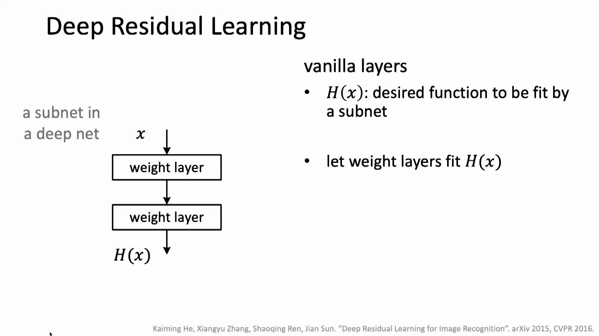

这样一来，identity mapping 变成了非常容易实现的情况。如果 identity 本身就是最优，那么只要让 residual branch 输出 $F(x)=0$ 就够了。如果 identity 只是接近最优，那么 residual branch 只需要学一个很小的修正。

所以 residual learning 的真实含义是：每个 block 不必从头重写表示，而是做小的、保守的、增量式修改。单个修改可以很小，但很多 residual blocks 叠加以后，仍然可以组合出非常复杂的函数。

这也解释了为什么 residual connection 同时改善前向和反向传播。前向时，信号可以沿 identity path 穿过很深网络，不会被每个 block 强行重写。反向时，梯度也有一条更直接的路径返回浅层，从而减轻深层网络的优化压力。

还有一个容易被忽略的点：ResNet 也改变了初始化直觉。因为 block 默认可以接近 identity，所以 residual branch 的权重可以初始化得很小，甚至让它一开始近似输出零。这样，整个深网络在训练初期就像许多 identity mappings 的堆叠，信号更容易传播。

构造 ResNet 时，不再需要为几百层逐层设计不同结构。你只要设计一个 residual block，然后把这个 block 反复堆叠，就能得到很深的网络。He 特别强调，这之后深度学习的结构设计开始越来越像“设计 block，然后堆 block”。后来的 Transformer block 也可以放在这条线里理解。

CIFAR-10 的深度实验展示了这件事。plain network 加深后出现退化，而 ResNet 可以随着深度增加继续改善。

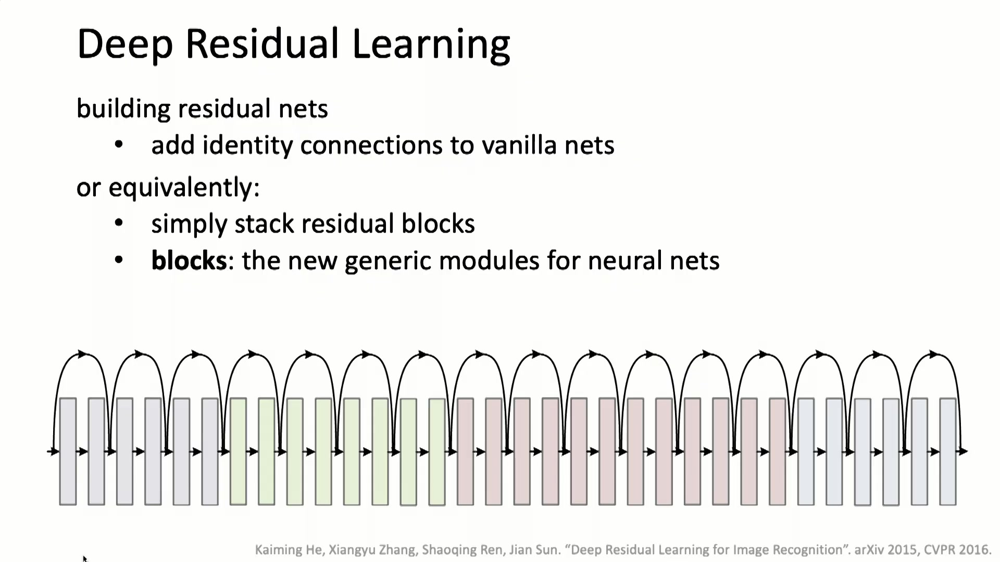

这说明 ResNet 的贡献不是“加了一个 shortcut”这么简单。它真正改变的是深层网络的优化几何：让 identity 成为结构上容易走通的路径，让每个 block 只学习增量变化，并让深度从理论容量转化为真实可训练的 representation power。

到这里，图像部分的线性逻辑才完整闭合：

CNN 让图像表征可学习；VGG 证明深度本身有价值；initialization 让深层网络可以从头开始训练；Inception 管理深层结构的计算成本；normalization 稳定训练过程；ResNet 则把“更深”变成真正可扩展、可优化的方向。

## 7. 从图像到序列：同一套模块语言迁移

讲座最后从图像转向序列。这里的关键不是重新讲一遍 NLP，而是说明 representation learning 的模块化思想可以跨领域迁移。

序列对象和图像不同。图像的局部结构主要在二维空间上展开，而序列的结构沿时间或位置展开。文本、语音、DNA、蛋白质序列都属于这类对象。

所以问题变成：

**怎样让模型在序列中表示上下文关系？**

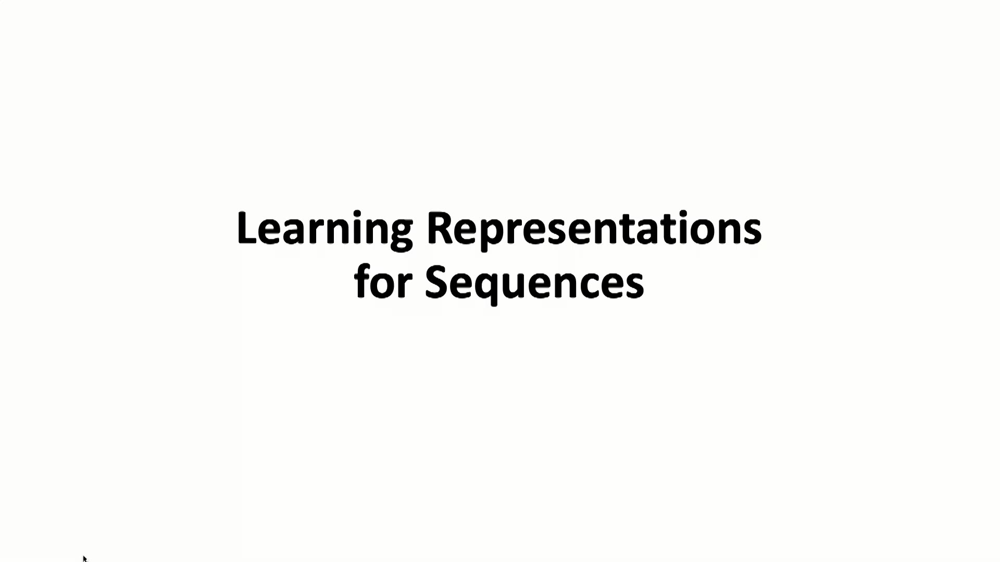

RNN 的自然思路是递归。当前时间步接收当前输入 $x_t$ 和上一个 hidden state，再产生新的 hidden state $h_t$。这个 $h_t$ 一方面用于当前输出，另一方面继续传给下一个时间步。

如果把 RNN 沿时间轴展开，它其实也体现了前面 CNN 里反复出现的两个原则：local connection 和 weight sharing。每个时间步只直接连接当前输入和前一时刻状态，这是局部连接；同一个 RNN cell 在所有时间步复用同一套参数，这是时间维度上的权重共享。

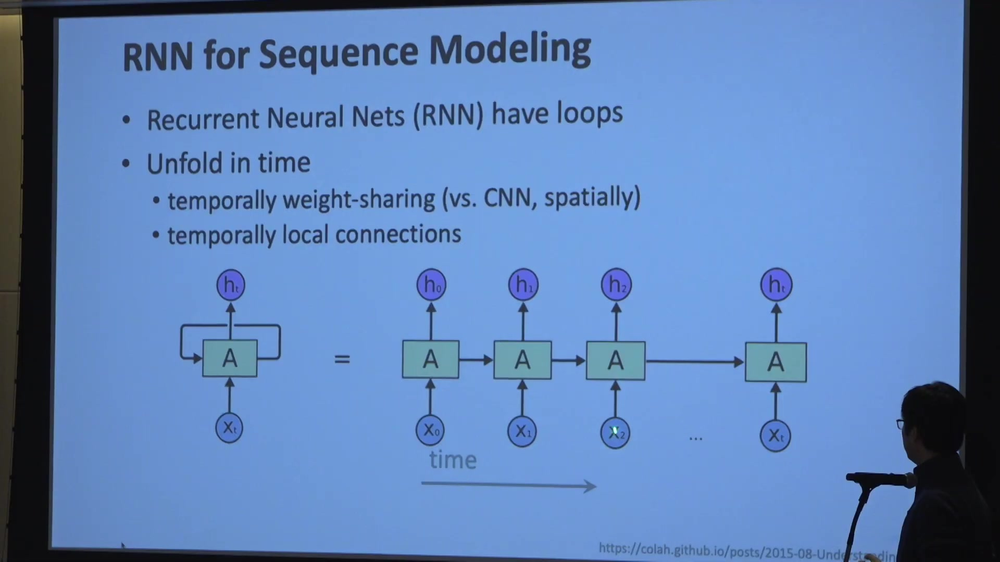

深层 RNN 则是在每个时间步上堆叠多个 recurrent units。这样，一个高层 hidden state 既依赖低层表示，也依赖过去时间步。它可以表达复杂上下文，但训练会更难，因为时间方向和层级方向都会拉长梯度路径。

He 这里特别提到一个重要现象：Google Neural Machine Translation 里的深层 LSTM 仍然需要 residual connections。没有 residual connections 时，几层以后就会出现 degradation；有了 residual connections，模型可以训练到更深。

这说明 ResNet 的意义并不局限于 2D 图像。Residual connection 解决的是深层组合里的优化问题，而这个问题在 CNN、RNN 甚至后来的 Transformer 中都会出现。

CNN 也可以用于序列。做法是把序列看成一条一维信号，再把一小段连续时间窗口当成卷积窗口。例如，用长度为 3 的 kernel 处理文本时，模型可以在位置 $t$ 同时看 $x_{t-2},x_{t-1},x_t$；处理语音或时间序列时，也可以用同样方式在局部时间片上提取模式。

这和 RNN 的计算顺序不同。RNN 在同一层里有时间递归关系：要算 $h_t$，通常必须先知道 $h_{t-1}$；要算 $h_{t-1}$，又必须先知道 $h_{t-2}$。所以一个长序列会形成一条时间依赖链，后面位置要等待前面位置先算完。这种结构天然不利于 GPU 并行，因为很多时间步不能同时计算。

CNN 的序列卷积则是 feed-forward 的。这里的 feed-forward 不是泛泛地说“有前向传播”，而是指同一层内部没有时间递归依赖：第 $t$ 个位置的卷积输出只依赖上一层输入窗口里的若干 token，不依赖同一层第 $t-1$ 个位置的输出。因此，同一层中所有位置的卷积可以一起计算。

这就是 CNN 比 RNN 更容易并行的原因：RNN 沿时间轴逐步推进，CNN 则可以把整条序列上的局部窗口一次性批量展开，让 GPU 同时处理许多位置。

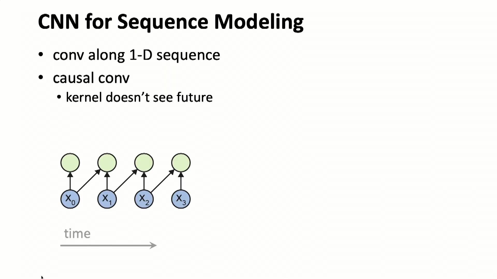

但普通 1D CNN 的上下文长度受 kernel size 和层数限制。一个小卷积核只能看到附近几个时间步；要看到更远位置，就必须堆更多层。WaveNet 通过 causal convolution 和 dilated convolution 扩大感受野：causal 保证当前位置只看过去，不偷看未来；dilation 让卷积核跳着看更远的历史。

不过，即使有 dilation，要捕捉很长上下文仍然需要较深网络。因此这条线也会再次遇到 residual connection 的需求。

attention 改变了 RNN 和 CNN 的取舍。RNN 的优点是能看完整历史，但不利于并行；CNN 的优点是并行友好，但上下文受局部窗口限制。Attention 试图同时获得两者优点：每个位置可以直接看序列中的其他位置，同时计算仍然是 feed-forward 的。

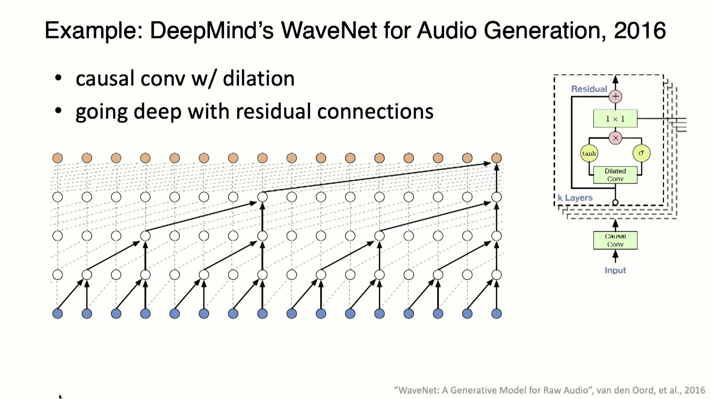

因此，这张对比图可以线性读成：

RNN 通过递归获得长程上下文，但牺牲并行性；CNN 通过局部卷积获得高并行性，但长程上下文需要层级堆叠；attention 让每个位置直接访问全局上下文，同时保持 feed-forward 计算。

Transformer 正是把 attention 变成核心模块。不过 He 这里的重点不是技术细节，而是说明 Transformer 仍然延续了前面那些基本模块语言。

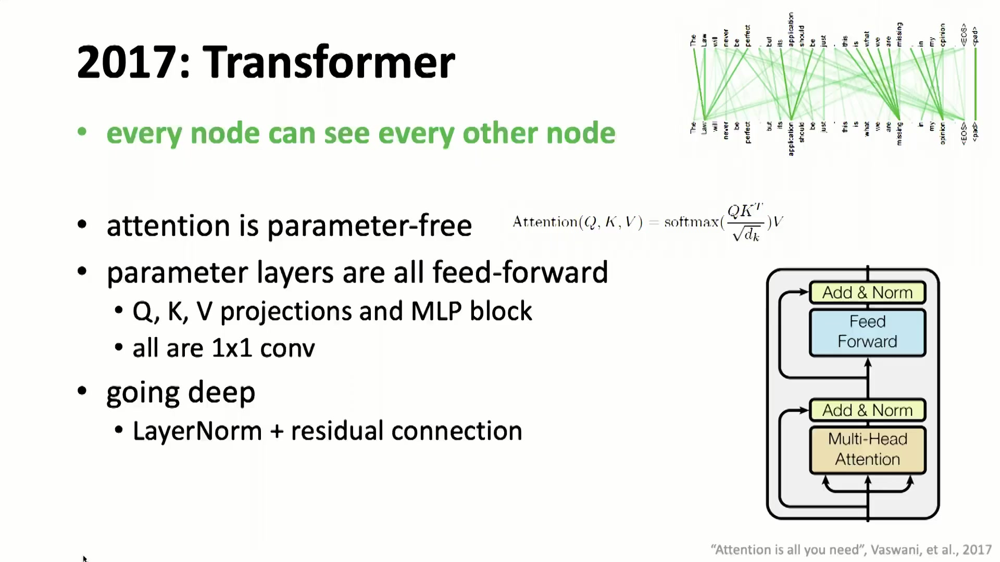

一个容易误解的点是：attention computation 本身在给定 $Q,K,V$ 之后可以看成 parameter-free，它计算的是位置之间的关系权重。但 Transformer 当然不是没有参数。参数主要在生成 $Q,K,V$ 的线性投影层，以及后面的 MLP block 里。

这些参数层从结构上看很像沿 token 维度共享的 $1\times 1$ convolution：每个 token 位置用同一套线性变换处理自己的表示。因此，local connection 和 weight sharing 仍然存在，只是全局信息交互交给了 attention。

同时，Transformer 是很深的模型，所以它继续依赖 residual connection 和 normalization。换句话说，前面图像部分讲的优化机制并没有过时，而是被带进了序列模型。

GPT 展示的是另一条重要路径：用大规模自监督预测任务学习语言 representation。

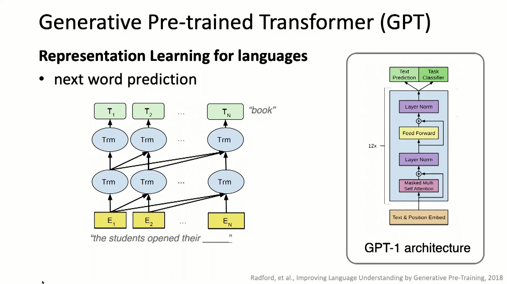

next-token prediction 表面上只是预测下一个词，但为了做好这个任务，模型必须在内部形成语法、语义、事实、推理模式和上下文关系的表示。训练目标是预测下一个 token，真正有迁移价值的是中间形成的 representation。

这也把 talk 前面讲过的 transfer learning 接回来：GPT 先在大规模文本上预训练，再迁移到更小、更具体的任务。它和 AlexNet/ImageNet 的关系在结构上很相似，都是先用大规模任务学通用 representation，再迁移到下游场景。

AlphaFold 说明同一套 representation learning 思想还可以进入科学问题。蛋白质序列不是自然语言，但它也是序列；氨基酸之间的远程相互作用对结构预测至关重要。

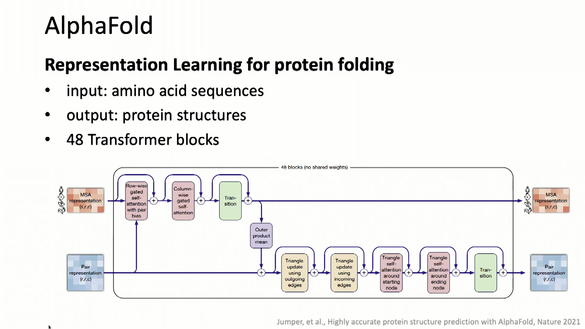

因此，AlphaFold 不是简单地把 NLP 模型搬到生物学里，而是说明 Transformer block、residual connection、normalization 这些模块可以在完全不同的问题上重新组合。输入从词序列变成氨基酸序列，输出从语言预测变成蛋白质结构，但核心仍然是学习一种能组织复杂关系的 representation。

Vision Transformer 则形成一个回环。最初，CNN 是图像建模的主导结构，因为它内置了局部性和平移共享。后来 Transformer 在序列中成功之后，又被带回视觉领域：把图像切成不重叠 patch，把 patch 当作 token，再通过 Transformer 处理这串 token。

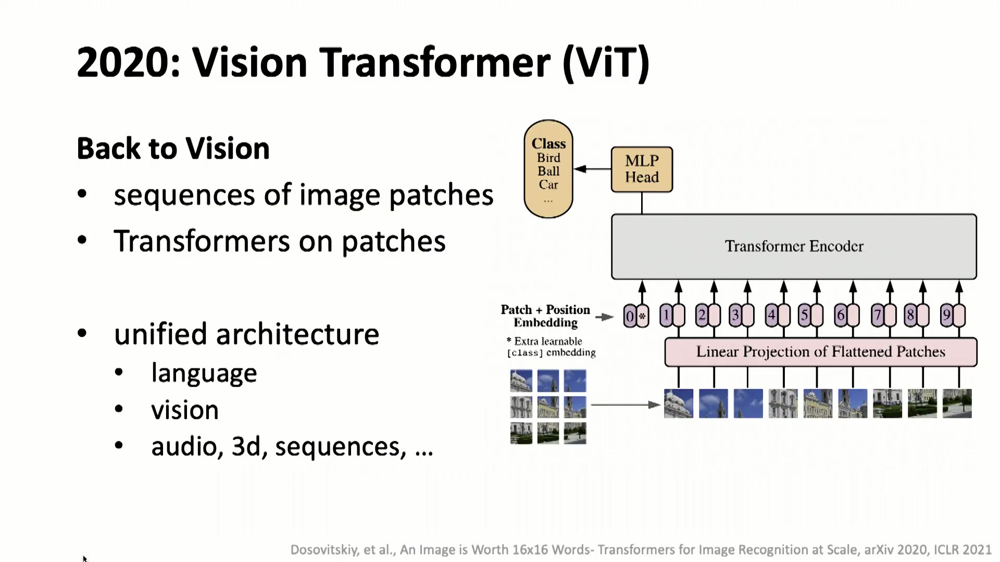

这不是简单地抛弃 CNN，而是说明 representation learning 的核心模块可以跨数据模态迁移。图像可以被看成二维像素网格，也可以被重新表示成 patch sequence。换一种表示以后，原来为序列开发的模块就能回到视觉任务中。

最后的 takeaways 回到最开始的判断：深度学习的关键是通过组合简单模块来学习复杂表征。不同领域的模型名字在变，但底层问题相似：

如何把原始对象变成可预测、可迁移、可组合的 representation。

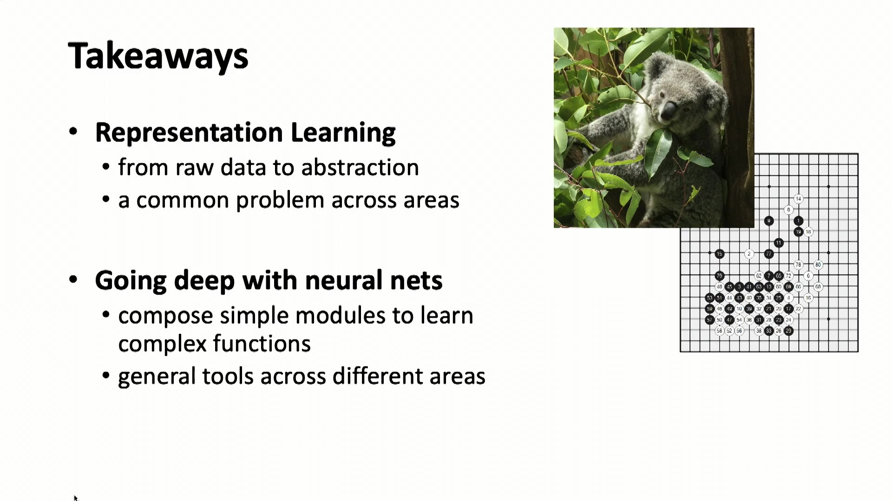

## 8. 和我们当前研究框架的连接

这场 talk 对我们当前研究的价值，不在于补一个 CNN/Transformer 史，而在于它给出了一个很稳定的分析框架：

**复杂任务往往不是直接在原始空间里解，而是先寻找一个更合适的中间表示。**

这和我们最近读过的几条线可以接起来。

在 HJB / HJ-sampler 里，直接学习高维控制场很难，所以问题被改写成学习标量势函数或 score / Hamilton-Jacobi potential。这里的势函数就是一种任务相关 representation：它不是最终样本本身，而是组织生成路径和控制方向的中间结构。

在 VI primer 里，直接处理复杂后验很难，所以用 variational family、latent variable、normalizing flow 或 surrogate model 来表示后验。这里的 latent representation 决定了不确定性如何被压缩、保留和传播。

在 world model 里，agent 不直接在原始像素世界里规划，而是在 learned latent dynamics 里想象未来。这里的 latent state 也是 representation：它必须保留足够的动力学信息，又要比原始观测更便于预测。

放回我们的 synthetic city / amortized inverse problem 问题，条件输入 $\mathbf c$ 可能是 census summaries、marginals 或约束；输出 $\mathbf p$ 可能是 joint distribution、copula、population assignment 或 route / location pattern。这个问题不能只理解成一个普通的 $\mathbf c\mapsto \mathbf p$ 回归。

更深的问题是：

给定有限 summaries 时，哪些 hidden structures 必须被 representation 保留下来？哪些不确定性应该被显式表达？哪些结构可以通过模块设计、约束或生成过程写进模型？

从这场 talk 的角度看，我们之后要关注的不只是“模型能不能生成结果”，而是模型内部是否形成了合适的表示层：

它是否把 census constraints、spatial correlation、mobility convention、household structure 和 uncertainty 都放到了可学习、可组合、可检查的 representation 里。

这也是 ResNet 部分对我们有用的地方。架构不是只增加参数量，而是在改变优化几何。Residual connection、normalization、initialization 这些机制提醒我们：如果一个研究问题很难训练，未必只是数据不够或模型不够大，也可能是问题的参数化方式不适合优化。

因此，这场讲座可以作为一个基础参照：

当我们遇到高维对象、复杂约束和不适定反演时，第一反应不应该是直接拟合原始输出，而应该问：这个问题需要什么 representation，什么模块能稳定地学到这个 representation，以及这个 representation 是否能支持迁移、推断和不确定性表达。

## 9. Self-Check

本地已完成三类材料整理：

- Transcript: [transcript.md](../../youtube/transcripts/D_jt-xO_RmI-deep-learning-bootcamp-kaiming-he/transcript.md)
- Curated slide index: [curated/index.md](../../youtube/slides/D_jt-xO_RmI-deep-learning-bootcamp-kaiming-he/curated/index.md)
- Curated contact sheet: [contact_sheet.jpg](../../youtube/slides/D_jt-xO_RmI-deep-learning-bootcamp-kaiming-he/curated/contact_sheet.jpg)

当前 curated slide 已替换为 1080p 关键帧。第一次高清抽帧后，我又对少数抽到讲者镜头的时间点做了相邻秒级重定位，确保 `convolution`、`normalization`、`ResNet`、`AlphaFold` 和 `takeaways` 等关键图能对应到 slide 内容本身。

补充检查：raw slide index 里共有 125 个抽取帧，时间从 `00:00:24` 覆盖到 `01:15:38`，没有发现整段主题缺失的情况。当前 curated set 保留 37 张关键图，刻意排除了讲者镜头、重复过渡帧和可读性很差的中间帧。AlexNet 段落的主要 slide 已保留为 `12-alexnet-2012.jpg`；LeNet/AlexNet 的逐项比较主要在正文中展开，因为对应 raw frame 可读性较差，不适合作为正式插图。

2026-05-09 复查后，已按 talk 的线性顺序重写 `VGG -> initialization -> Inception -> normalization -> ResNet -> sequence models` 这段。主要修正是：把 Inception 放回初始化之后；补上 VGG 的 stage-wise training caveat；补上初始化的方差传播逻辑；补上 normalization 的 support set 和 affine 恢复自由度；补上 ResNet 中 identity、residual branch、小增量修改、梯度路径和 block-stacking 之间的因果链。
