# 最优传输讲座一：深度学习的几何观点

- Video: [最优传输的理论与计算系列讲座之一：深度学习的几何观点](https://www.bilibili.com/video/BV1qQ4y1q7V8/)
- Speaker: 顾显峰
- Transcript: [transcript.md](../../youtube/transcripts/BV1qQ4y1q7V8-optimal-transport-lecture-01-geometric-view-deep-learning/transcript.md)
- Slides: [curated/index.md](../../youtube/slides/BV1qQ4y1q7V8-optimal-transport-lecture-01-geometric-view-deep-learning/curated/index.md)

这节课是最优传输系列的第一讲，目标不是先给完整数学证明，而是先建立一个几何直觉：深度学习里很多看似工程化的问题，本质上都可以理解成“在数据流形上学习结构和概率分布”。最优传输在这里扮演的角色，是把概率分布之间的变换写成一个带几何结构的最小代价映射。

注：ASR 把“最优传输”多次识别成“自由传输”。下面统一写作“最优传输”。

## 1. 00:00-08:00：最优传输先回答“怎样最经济地移动概率质量”

顾显峰先给出最优传输的基本问题：给定两个概率分布，怎样以总代价最小的方式把一个分布变成另一个分布。这个说法里有三个对象：源分布、目标分布、传输代价。最优传输要找的是一个移动方案，使得所有概率质量都被送到目标分布，同时总运输成本最小。

这一定义有两种理解方向。第一种是概率视角：它可以度量两个分布之间的距离，也可以构造一个分布到另一个分布的映射。第二种是几何视角：传输映射往往来自某个势函数的梯度，因而携带曲面、凸性、奇异集等几何结构。

讲座随后列出几类算法路线。Kantorovich 线性规划和 Sinkhorn 方法是很多机器学习应用最熟悉的路线；几何变分法来自凸几何和 Alexandrov-Minkowski 传统；Benamou-Brenier 流体力学路线把传输看成密度随时间流动；Monge-Ampere 方程则把最优传输和强非线性 PDE 接起来。

这一节真正建立的是：最优传输不是单一算法，而是一套同时连接概率、几何、流体、PDE 和优化的语言。

## 2. 08:00-12:00：几何口诀是“代价决定支撑，势能微分映射”

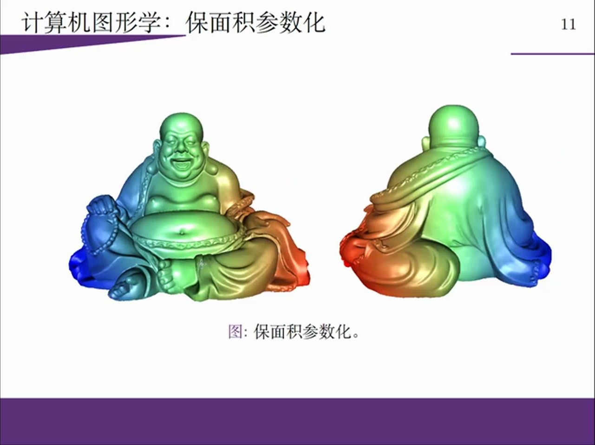

顾显峰强调最优传输的几何图像。他用一组支撑曲面托住一个势函数来说明：传输代价决定支撑曲面的形状，势函数由这些支撑面包络出来，而传输映射来自势函数的微分或广义微分。

线性地说，这里有三步。第一步，先给定 cost function，它规定从 $x$ 运到 $y$ 的代价。第二步，cost function 决定一组支撑函数或支撑曲面。第三步，这些支撑曲面的包络形成一个势函数，势函数在某点的梯度或次梯度给出该点应该被送到哪里。

所以最优传输映射不是任意神经网络映射。它有一个强结构：

$$
T(x) = \nabla \phi(x),
$$

其中 $\phi$ 是某种凸势函数或广义势函数。这个结构后来会成为讲座解释生成模型和模式坍塌的关键。

## 3. 12:00-25:00：从计算几何、医学图像到光学设计，OT 先作为几何工具出现

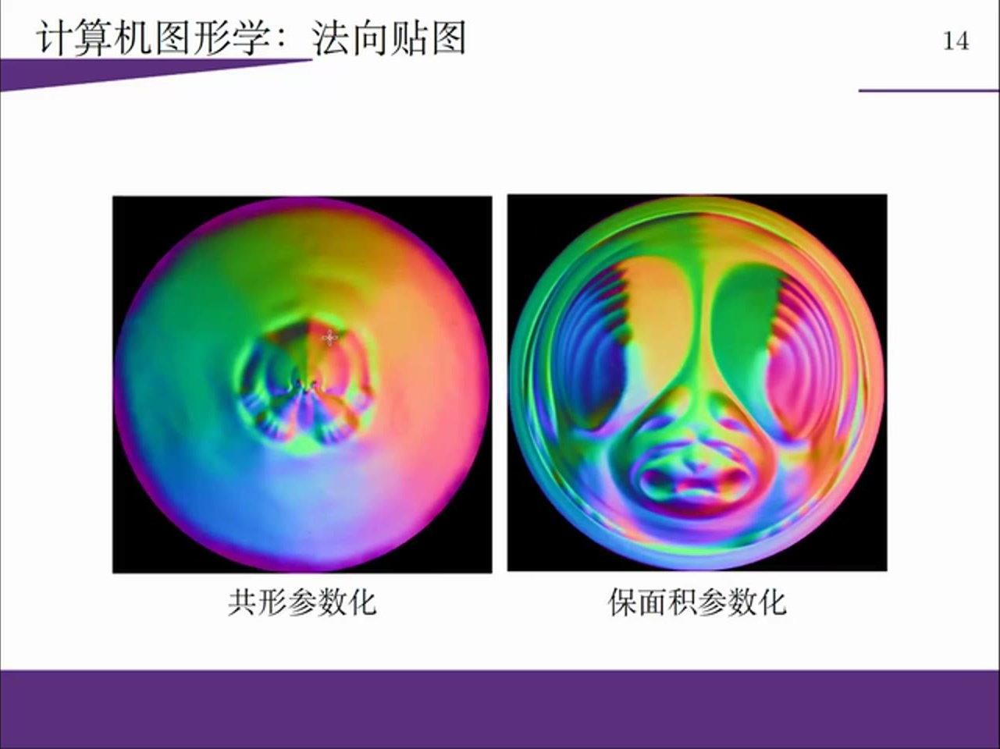

讲座接着用计算机图形学说明为什么几何视角重要。这里不是随便罗列应用，而是沿着“二维曲面参数化 $\rightarrow$ 三维体积映射 $\rightarrow$ 光线能量重分配”逐步把最优传输的几何含义具体化。

第一步是曲面参数化。曲面参数化时，保角映射能保持局部角度，但可能造成严重面积畸变；而最优传输可以把曲面面积分布推到平面上，再构造保面积参数化。

这一步的逻辑是：曲面不是直接被“摊平”，而是先把曲面上的面积测度推到平面，再在平面上用最优传输把这个非均匀面积分布变成均匀分布。这样得到的参数化就不只是视觉上展开，而是在测度意义上保面积。

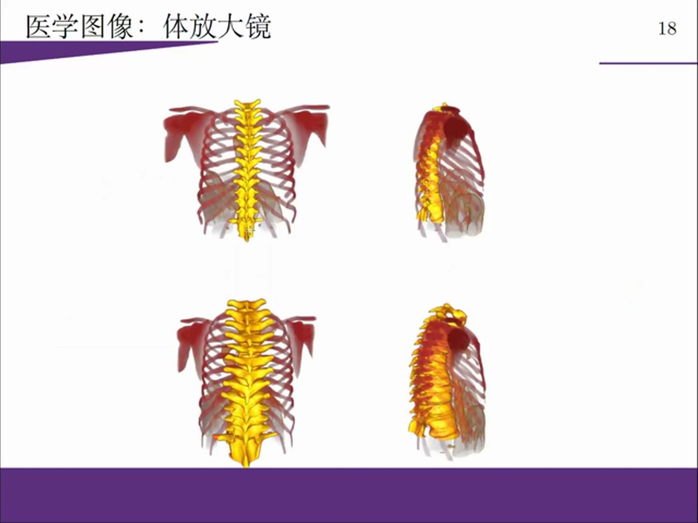

第二步是从二维面积推广到三维体积。医学图像中的体式放大镜也是同一逻辑。三维医学图像不能像普通照片那样用物理放大镜局部放大，因此需要构造一个三维体积映射，把某些结构区域放大，同时控制整体体积或测度关系。最优传输提供了这种体积重分配的数学框架。

这一步的重点是：最优传输不是只能处理平面图像，它处理的是测度。二维时测度可以是面积，三维时测度可以是体积，高维时也可以是数据分布。只要问题能写成“把一个测度变成另一个测度，同时控制代价”，它就落到同一套语言里。

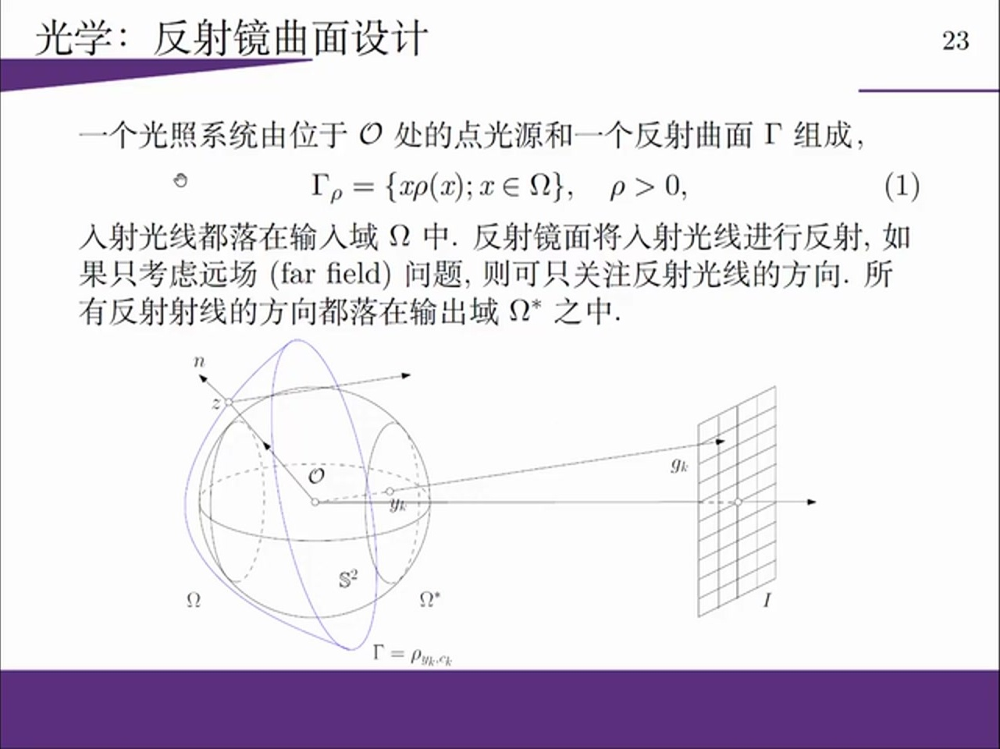

第三步是光学设计。点光源经过反射镜或透镜后，希望在远处墙面形成指定光强分布。传统遮挡式幻灯片会损失能量，而最优传输式设计是重新分配光线方向，使能量不被浪费，只改变空间分布。

这里最关键的是：讲者关心的不是一个抽象距离，而是势函数本身。反射镜或透镜的曲面形状可以由最优传输势函数决定。因此，在光学设计里，最优传输的输出不是“两个分布有多远”，而是一个真实可制造的几何曲面。

因此，最优传输在深度学习之前已经是一个成熟的几何重分配工具。讲座先铺这些例子，是为了让后面“数据分布也是几何对象”这一步不显得突兀。

## 4. 25:00-35:00：深度学习的第一层几何假设是 data manifold

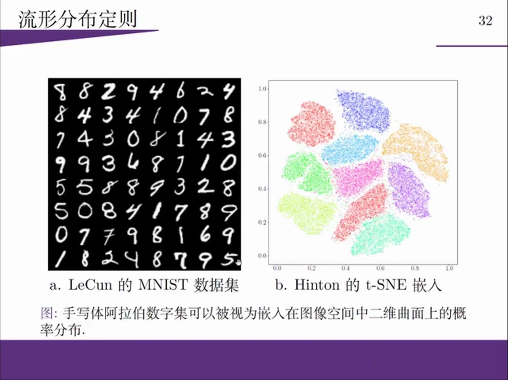

进入深度学习后，顾显峰先从 MNIST 解释 data manifold。每张 $28 \times 28$ 图像可以看成 $\mathbb{R}^{784}$ 中的一个点。大量手写数字样本形成一个点云，而这个点云并不是填满整个 784 维空间，而是集中在低维流形附近。

这一步非常关键。深度学习处理的不是任意高维空间，而是嵌入在高维空间里的低维结构。LeCun 的 MNIST 样本、Hinton 的 t-SNE 可视化，都在说明同一件事：图像数据虽然表面维度高，但有效自由度远低于背景空间维度。

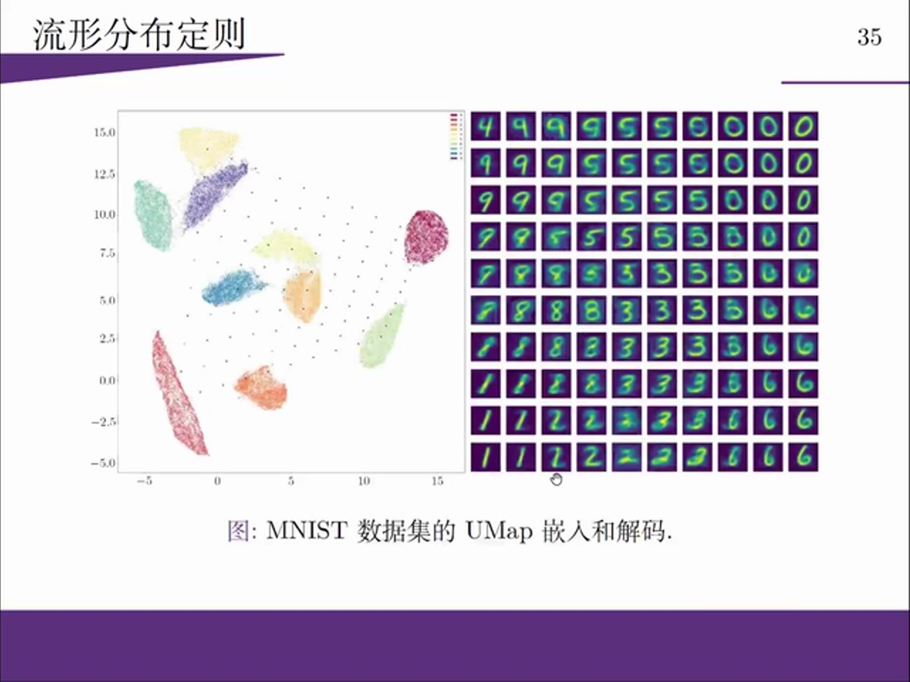

编码器和解码器可以用几何语言重新解释。编码器把数据流形上的点映到低维 latent space，解码器把 latent space 的点映回数据流形。机器学习里叫 feature、latent code 或 embedding；几何里可以理解成局部坐标、参数化或 chart。

这里的线性关系是：

$$
\text{high-dimensional data point}
\rightarrow
\text{low-dimensional latent coordinate}
\rightarrow
\text{reconstructed data point}.
$$

如果 latent space 中采样点落在真实分布的支撑集内，解码结果会合理；如果采样点落在不同类别支撑集之间，就会出现混淆图像。这就是模式混淆的几何来源：不是 decoder 不会画图，而是 latent 采样没有尊重数据分布的支撑结构。

## 5. 35:00-43:00：自动编码器是在学习流形结构

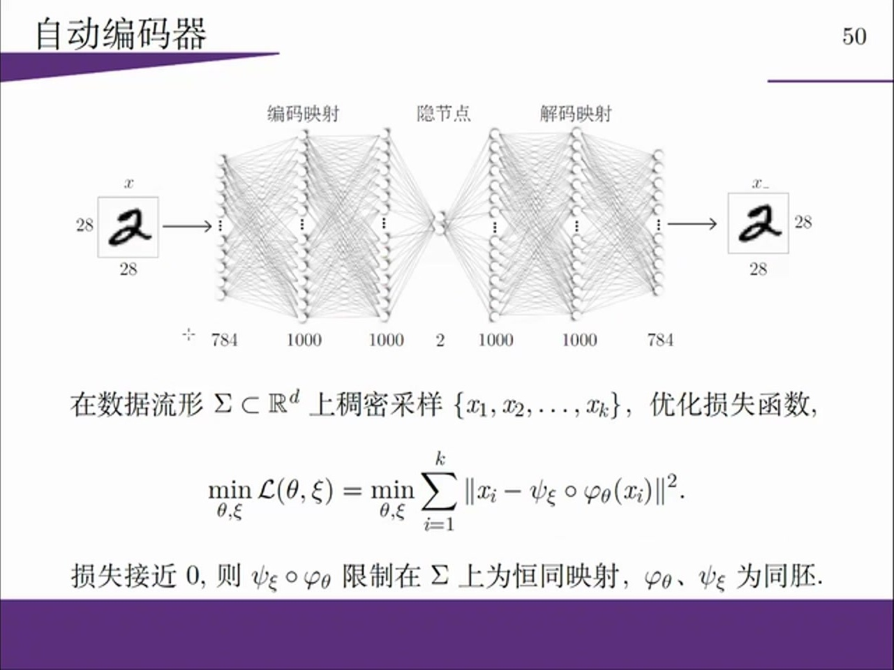

顾显峰接着把 autoencoder 放回流形学习。输入图像经过 encoder 到 bottleneck，再经过 decoder 回到原图。如果 reconstruction loss 很小，就说明 encoder 和 decoder 在数据流形上近似互逆。

这不是单纯的压缩算法，而是一个几何操作：encoder 学到从流形到 latent 坐标的参数化，decoder 学到从 latent 坐标回到流形的嵌入。瓶颈层维度对应 latent manifold 的坐标维数。

讲座还用一组数学定理解释为什么神经网络有可能逼近这些映射。这里原本很容易被压缩，需要按顺序读。

第一层是一般位置定理。它说明当嵌入空间维度足够高时，流形的自交、缠绕和复杂嵌入会变得更容易解开。讲者用它解释为什么很多深度网络前几层会先把宽度做大：更高维的中间空间可以让原本纠缠的数据结构更容易分开。

第二层是 Whitney embedding。它告诉我们，光滑流形可以嵌入到足够高维的欧氏空间中。对应到深度学习，这支持了一个直觉：低维数据流形可以被神经网络编码到某个表征空间里，再通过解码映射恢复回来。

第三层是 Urysohn lemma。它和分类有关：如果两个闭集可以分开，就存在一个连续函数在一个集合上取 0，在另一个集合上取 1，并在中间连续过渡。分类器要学的很多时候就是这类把不同类别分开的函数。

第四层是 Kolmogorov-Arnold / universal approximation。它说明复杂连续函数可以由简单函数的组合来逼近。深度网络的意义就在于用多层简单模块的复合去逼近复杂映射，而不是一次性手写出完整变换。

第五层是微分同胚群的嵌套分解。讲者强调，复杂变换可以由许多接近恒等的小变换复合出来。这个观点和深层网络的模块化结构非常接近：每一层只做一个相对简单的变换，很多层复合后形成复杂表征。

所以这里的核心不是“引用一堆定理证明神经网络万能”，而是建立一条几何解释链：高维空间有助于解缠，嵌入定理保证流形可表示，分类函数可以连续分离，简单模块复合可以逼近复杂映射，深层结构则把这种复合变成可训练模型。

这一节建立的判断是：深度学习首先学的是 manifold structure。只有先学到数据集中哪些点是可能的、哪些点构成低维结构，后面才谈得上在这个结构上学习概率分布。

## 6. 43:00-50:00：概率分布学习需要 Wasserstein 空间

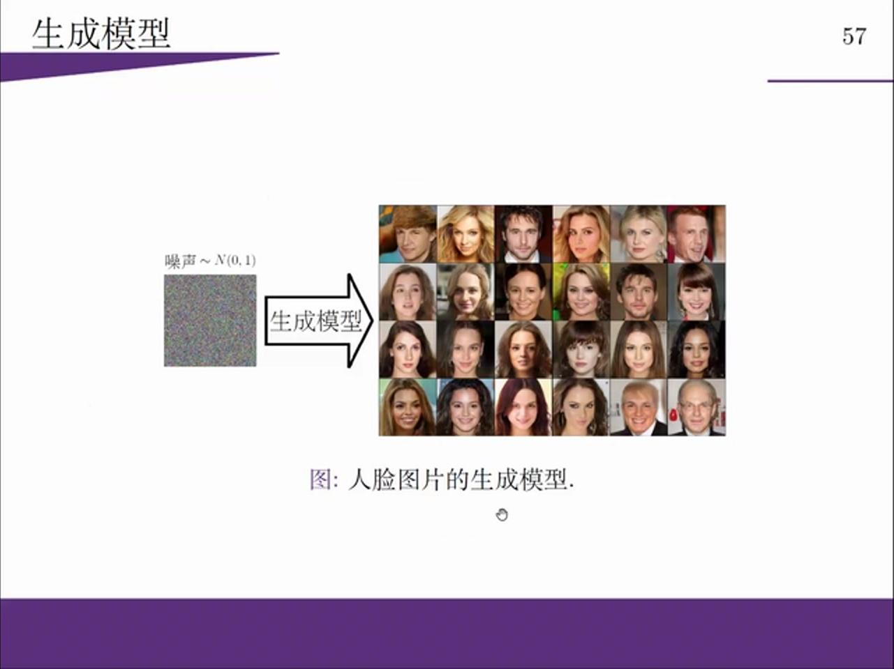

如果 autoencoder 主要学习流形结构，那么生成模型还要学习流形上的概率分布。latent space 中通常有一个简单噪声分布，例如 Gaussian 或 uniform；生成模型要把它推到数据流形上的真实分布。

最优传输给出一种直接语言：

$$
z \sim p_{\text{noise}}
\quad \xrightarrow{G} \quad
x \sim p_{\text{data}}.
$$

这里的生成器 $G$ 可以理解成把噪声分布传输到数据分布的映射。判别器或距离函数则试图区分生成分布和真实分布之间的差距。

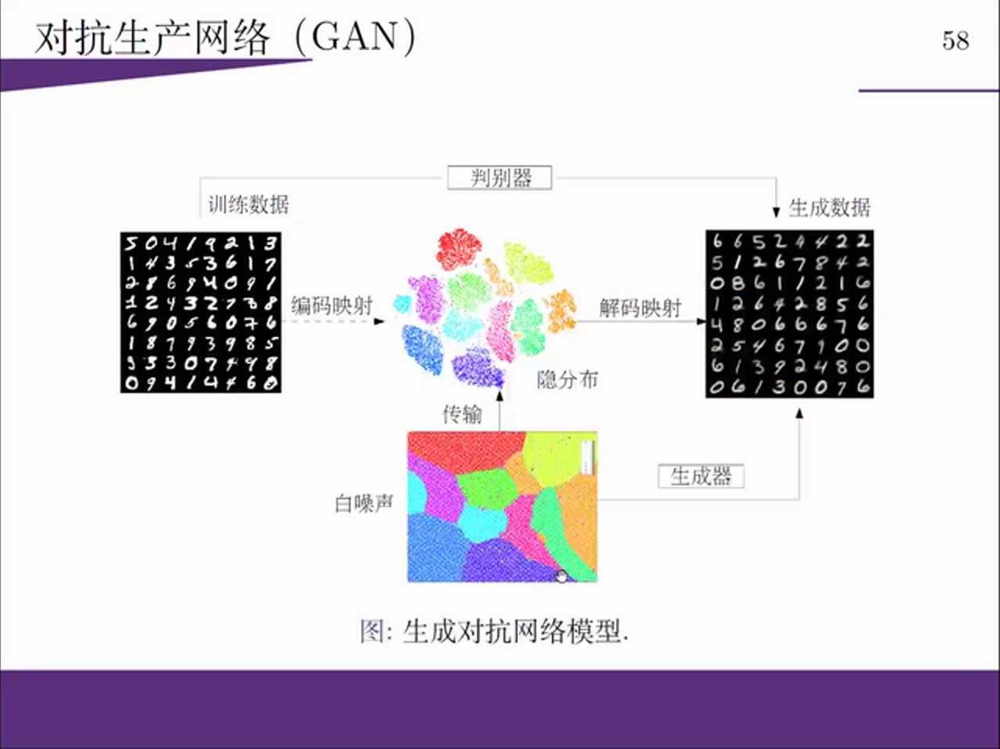

从这个角度看，GAN 的生成器和判别器不只是对抗关系。生成器在构造一个传输映射，判别器在估计分布差距。如果二者都在逼近某种传输结构，那么纯粹对抗不一定是最有效的组织方式；合作式地利用判别器信息，也许能更有效地更新生成器。

顾显峰用这个视角解释模式坍塌和模式混淆。真实数据分布可能有多个 mode 或多个支撑分支。如果生成器只能覆盖其中一部分，就出现 mode collapse；如果生成器把样本放到支撑集之间，就出现 mode confusion。

## 7. 50:00-57:00：为什么直接学习传输映射会遇到奇异几何

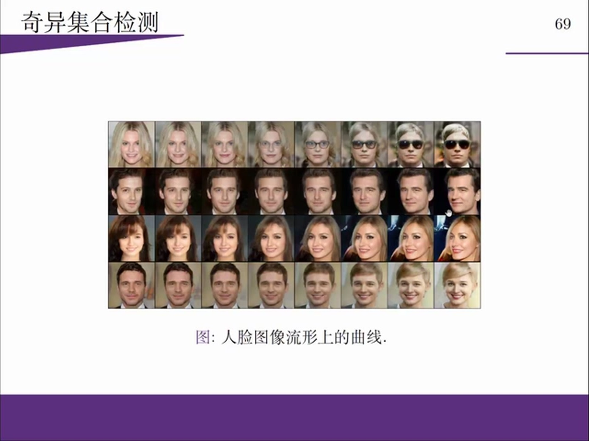

讲座最后把模式坍塌进一步解释成最优传输映射的奇异性问题。Brenier 最优映射来自势函数的梯度，但势函数可能只是连续而不可处处可微。一旦势函数在某些集合上不可微，它的梯度映射就会跳变。

这对神经网络很致命。普通深度网络擅长表达连续映射，但真正的最优传输映射可能在奇异集处不连续。如果直接让网络学习这个映射，目标函数本身就可能超出网络表达族的自然范围，于是训练会出现无法稳定覆盖所有 mode 的问题。

所以顾显峰提出的关键观点是：不要直接用神经网络表达最优传输映射，而应该表达它背后的势函数。势函数整体上更连续，映射的不连续性可以通过势函数的广义微分来表达。线性地说：

$$
\text{learn } \phi
\quad \text{instead of directly learning} \quad
T = \nabla \phi.
$$

这和我们之前读 HJB/HJ sampler 时遇到的“学标量势函数而不是直接学高维向量场”高度相似。区别是这里的势函数来自最优传输的 Brenier structure，而 HJB 里的势函数来自控制代价或 Hamilton-Jacobi 方程。

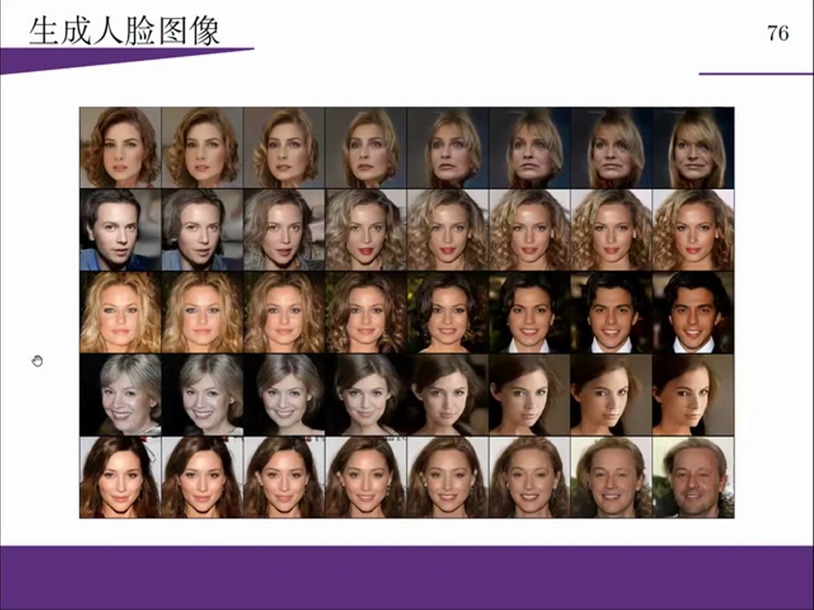

人脸生成例子说明了这个想法。latent space 中的直线经过生成映射会变成数据流形上的曲线。正常情况下，这条曲线应该穿过合理的人脸变化；如果穿过奇异边界，就可能出现概率极低但生理上仍可解释的特殊人脸。讲座用这个例子说明：生成模型的失败不只是工程调参问题，也可能来自数据流形边界和最优传输奇异集。

## 8. 57:00-78:30：Q&A 里补出的几个研究判断

后半段问答不是普通闲聊，里面补出了几个对深度学习很有用的判断。

第一，latent dimension 的选择目前仍然高度经验化。讲者提到人脸实验中 1000、500、100 维效果都还可以，但降到 50 或 75 维就变差。这说明流形维度不是随意越低越好，而要能承载数据的真实变化。维度太高会增加计算成本，维度太低会切掉真实变化方向。

第二，normalizing flow 和最优传输都可以看成分布变换，但二者强调点不同。flow 强调可逆、可计算密度和雅可比行列式；最优传输强调在所有传输映射中寻找最小代价映射。它不只是“可逆映射”，还带着代价最优性和势函数结构。

第三，高维计算仍然是最优传输应用的工程瓶颈。理论上最优传输适用于任意维分布，但数值求解、奇异集检测、势函数表达和高维采样仍然很难。因此，“OT 语言很统一”和“OT 工程上很容易”是两回事。

第四，奇异集合和流形边界不能被忽略。讲者解释人脸生成中的异常过渡时，实际上是在说：数据流形边界附近可能存在概率极低但几何上可达的点。生成模型如果不了解这些边界，就容易产生奇怪样本。

第五，讲者反复强调数据流形的拓扑和几何在深度学习中被低估。很多方法隐含地假设流形连通、简单、无复杂 handle，但真实数据流形可能有多支撑、多连通分支和复杂边界。模式坍塌、模式混淆、生成失败都可能和这些几何事实有关。

这节课的核心结论可以压成一句话：深度学习不是只在高维欧氏空间里拟合函数，而是在数据流形上同时学习几何结构和概率分布；最优传输提供了一种把这两件事统一起来的语言。
