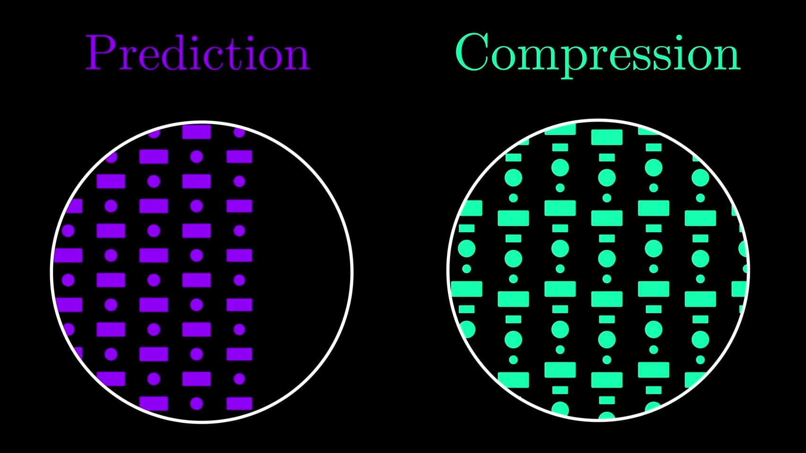
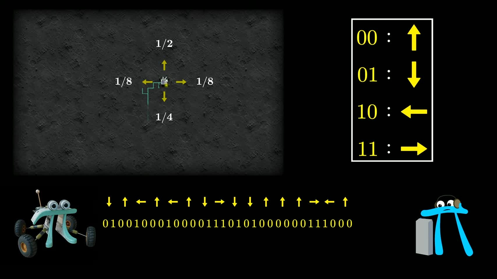
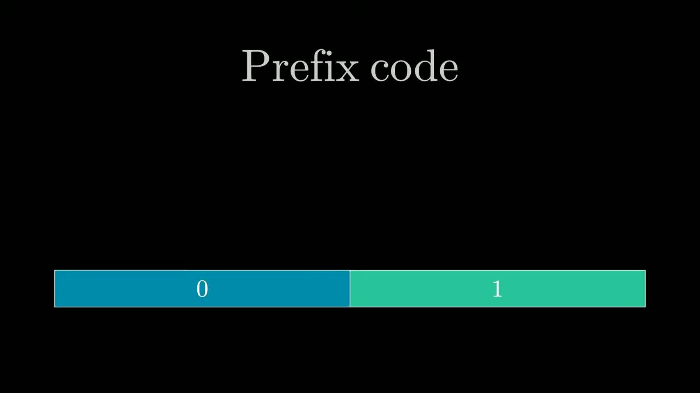
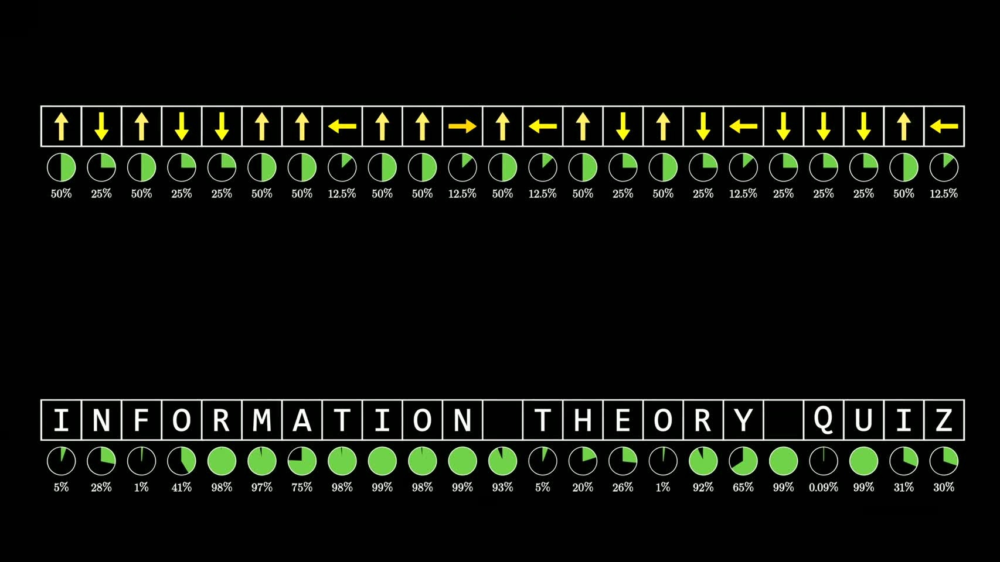
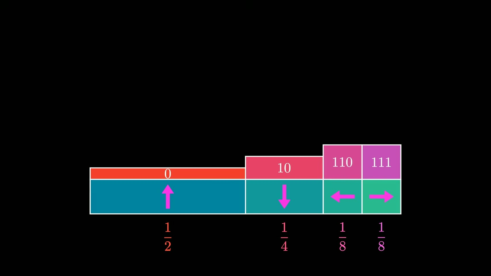

# 3Blue1Brown: Reinventing Entropy

- Video: [Reinventing Entropy | Compression is Intelligence Part 1](https://www.youtube.com/watch?v=l6DKRf-fAAM)
- Channel: 3Blue1Brown
- Duration: 32:19
- Transcript: `youtube/transcripts/l6DKRf-fAAM-3blue1brown-reinventing-entropy-compression-intelligence-part1/`
- Slides: `youtube/slides/l6DKRf-fAAM-reinventing-entropy-compression-is-intelligence-part-1/curated/`

这期视频不是从 entropy 的定义开始，而是反过来问一个更朴素的问题：如果我们想把文本压缩到尽可能短，压缩的极限到底由什么决定？沿着这个问题往下走，information、entropy、entropy rate 和后面要讲的 cross entropy 都不是孤立术语，而是从“如何给消息分配 bit”这件事里被一步步逼出来的。

主线可以这样抓：压缩首先需要知道哪些消息更常见；知道分布之后，还要受可解码性的约束；如果一个压缩器真的已经最优，它输出的 bitstream 应该像随机噪声一样没有剩余结构；由此可以倒推出单个消息的信息量；再把信息量对分布求平均，就得到 entropy；到了自然语言，概率不再是固定表格，而是依赖上下文的预测模型，于是 compression 和 language modeling 连接起来。

## 1. 00:00-03:19：从文本压缩问“极限”问题

视频开头先把问题放在文本编码上。ASCII 给每个字符固定 8 bit，这种做法稳定、简单，但它把所有字符都当成同等重要、同等常见的对象。实际英文显然不是这样：常见字母、常见词、常见句法结构反复出现，后面的字符也常常被前面的上下文强烈限制。

所以压缩问题的第一层不是“能不能少用几个 bit”，而是“数据里到底有哪些结构可以不用逐字记录”。如果一个片段非常可预测，编码器就不应该为它支付和随机片段一样的代价；如果一个片段真的不可预测，压缩器也没有魔法，它只能把这部分不确定性保留下来。

这里引出视频和现代 AI 的接口。语言模型通常被描述为 next-token prediction，训练目标里会出现 cross entropy。3Blue1Brown 的入口是：prediction 和 compression 在数学上是同一件事的两面。一个模型如果能更好地预测下一个 token，它也就能更高效地编码真实文本；反过来，文本压缩效率可以被看作模型是否捕捉到语言结构的一种度量。

这也是标题里 “compression is intelligence” 的来源。不过视频并没有把这句话当成严格定理。更稳妥的说法是：压缩理论和智能模型之间有一条很深的数学通道，因为二者都在处理“从上下文中减少不确定性”的问题。

## 2. 03:19-08:39：机器人例子先把概率变成码长

为了把抽象问题变简单，视频构造了一个月球机器人。机器人只接收四种指令：up、down、left、right。关键不在这四个指令本身，而在它们出现的概率不同：up 最常见，down 次之，left 和 right 更少见。

第一种朴素方案是给四个指令各分配固定长度的二进制码。因为四个对象刚好可以用两位 bit 区分，所以每条指令都花 2 bit。这套方案肯定可解码，但它没有利用分布差异。up 出现很多次，却每次都付 2 bit；罕见指令也付同样价格。

第二个学生的改进是 variable-length code：把最常见的 up 设成最短码，把 down 设成长一点的码，把更少见的 left 和 right 设成更长的码。这样单次指令的编码长度不再相同，但平均下来更短。直觉很清楚：如果一个事件出现得多，就值得给它省空间；如果一个事件少见，让它偶尔多付一点 bit，不会太影响总体平均成本。

这里有一个容易被跳过但很重要的点：短码不能随便发。编码之后，接收端必须能从连续 bitstream 里恢复原来的指令序列。如果某个短码同时也是另一个长码的开头，接收端读到这段 bit 时就不知道该停在哪里。因此视频引入 prefix code，也就是任何一个合法码字都不能是另一个合法码字的前缀。

这一步把“概率分布”和“可解码结构”绑在一起。压缩不是简单地把高频对象写短，而是在一棵受 prefix-free 约束的码树里安排空间。

## 3. 08:39-10:46：码树解释短码为什么会消耗空间

接下来视频把所有可能的 bit string 画成一棵二叉树。第一层只有 0 和 1，第二层是 00、01、10、11，继续往上就是更长的 bit string。这个图的关键性质是：树上某个节点代表的字符串，会成为它上方整片区域中所有字符串的前缀。

因此，当我们把 0 分配给 up 时，不只是用了一个短码。因为 prefix code 要求不能再有任何码字以 0 开头，所以整个左半边空间都被 up 占掉了。把 10 分配给 down，也会占掉右半边中的一半。left 和 right 如果分别拿到 110、111，就各占剩余空间的一小块。

这时会出现一个很漂亮的对齐：码字占据的空间比例，刚好和指令概率对上。up 出现概率最高，所以它占掉最大的码空间，也对应最短码；罕见指令占的空间小，对应更长码。这里不是视觉巧合，而是信息论的核心直觉：一个消息越可能出现，它在最优编码中就应该被安排到越大的 prefix 区域，也就是更短的路径。

不过到这里还不能直接宣布“这就是最优”。因为读者可能会问：有没有某种更聪明的方案，不是逐个指令编码，而是把很长一串指令放在一起编码，从而进一步降低平均 bit 数？视频下一步就是回答这个疑问。

## 4. 10:46-14:47：完美压缩为什么应该像随机噪声

第三个学生不急着设计具体代码，而是先问：一个真正完美的压缩结果应该长什么样？他的回答是，完美压缩之后的 bitstream 应该看起来像随机噪声。这里的随机噪声指每一位都是独立公平的 0 或 1。

这个判断背后的逻辑是：如果压缩结果还存在可预测结构，那说明它还能被继续压缩。比如某些 bit pattern 特别常见，就可以再给这些 pattern 分配更短表示。只有当输出已经像公平抛硬币一样，没有任何偏差、重复模式或可利用结构时，压缩才像是走到了尽头。

视频回到机器人例子说明这一点。用前面的最优 prefix code 编码时，输出 bit 的分布确实像公平硬币。因为 up 的概率是二分之一，所以第一位为 0 的概率也是二分之一；如果第一位是 1，后续分支里的概率又继续对半分。于是对接收端来说，压缩后的 bitstream 没有多余规律可抓。

随后视频把视角从单个指令切到完整消息。如果一个压缩消息有 n 位，那么从接收端看，它属于长度为 n 的所有 bit string 中的一个。若压缩结果真像随机噪声，这些长度相同的 bit string 就应该等可能。也就是说，所有被压到 n 位的原始消息，在这个完美方案里也应该是等可能的。

为什么这说明它们不可再压？可以继续用码树看。如果你想把其中一个等可能消息挪到更短的位置，它会占用更大的 prefix 空间，于是别的消息就必须被推到更深处。你给一个消息省下的一位，会让多个同等可能消息多付代价。对等可能消息来说，最公平也最优的办法就是给它们同样长度的编码。

这一步非常关键。它不是直接给出 entropy，而是先建立一个判断标准：最优压缩会把可预测结构榨干，剩下的编码应当像随机噪声。信息论后面的定义，就是从这个标准反推出来的。

## 5. 14:47-17:47：information 是从完美压缩倒推出来的

如果一个消息在完美编码里用了 n 位，那么它对应的概率应该是二的负 n 次方。把这句话反过来看：一个概率为 p 的消息，在理想压缩里应该需要多少 bit？答案就是 negative log2(p)。这就是 Shannon information 的来源。

重要的是，视频强调这不是随手定义一个函数来“度量惊讶”。它是从完美压缩的码树结构中被迫出现的。bit 长度和概率之间必须满足这样的对应关系，才能让最优编码输出像随机噪声，也才能让高概率消息拿到短码、低概率消息拿到长码。

negative log2(p) 的直觉可以理解为：要把可能性空间不断二分多少次，才能缩到某个事件的概率大小。概率越低，需要的二分次数越多，所以信息量越高；概率越接近 1，几乎没有不确定性需要排除，所以信息量很低。

现实中，很多概率并不是二的整数次幂，所以一个事件的信息量常常不是整数 bit。这不意味着编码器真的会写出 4.19 个 bit 的单个码字。更准确的说法是：信息量给出一个抽象的压缩下界；当我们编码长消息、把许多事件合在一起时，这些小数信息量可以累积，最终整体编码长度再落到整数 bit 上。

所以这一节完成了第一个定义的“发明”：information 是一个消息在理想压缩中应当支付的 bit 代价，也是该消息概率在压缩问题中的自然尺度。

## 6. 17:47-20:48：语言序列把单符号编码推广成上下文概率

机器人例子太整齐：概率都是二的幂，指令之间独立同分布。自然语言完全不同。一个字符或 token 的概率高度依赖前文，且概率值通常不会刚好对应整数 bit。

视频用一个本地小 GPT 给某个英文短语的每个下一字符分配概率。这里要注意：模型给出的概率不一定等于真实语言概率。视频先把这个问题放下，暂时只把模型概率当成一个可用的预测分布。

对完整短语来说，整句话的概率可以拆成一连串条件概率的乘积：第一个字符的概率、给定第一个字符后第二个字符的概率、给定前两个字符后第三个字符的概率，依次往后。把这些概率转成 information 时，log 会把乘法变成加法。于是完整消息的信息量就可以看成每一步下一字符信息量的累加。

这一步把 compression 和 prediction 精确地接起来。一个预测模型每一步都给真实下一个字符分配概率；分配得越高，那一步的信息代价越低；分配得越低，那一步就更贵。编码一个文本，就是沿着文本逐步支付这些预测失败或不确定性带来的代价。

这里也解释了为什么 fractional bits 有意义。单个字符未必能被写成小数位长度的码字，但一整段文本的信息量是许多小数代价的和。真正的压缩算法可以在整段消息层面接近这个总值，而不是强行给每个字符一个独立整数码。

## 7. 20:48-24:23：概率从哪里来，Shannon 从 corpus 走向人类预测器

到这里，所有计算都依赖一个前提：我们知道每一步下一个字符的概率。但自然语言的“真实概率”并不是一张现成表格。哪怕有大量语料，也只能统计有限长度的 n-gram。比如看到 `th` 后面常跟什么字母，这可以从书里数出来；但上下文一长，很多具体字符串在语料中根本没有出现过，直接计数就失效了。

这恰好是语言最有压缩潜力的地方。越长的上下文往往越能限制后续内容，也越能让文本变得可预测。如果统计方法只能处理短上下文，它就会错过语言中最重要的可压缩结构。

Shannon 的做法很有启发性。他不是只把语言看成 corpus 里的频率表，而是把人当成语言模型。早期实验里，他让 Betty Shannon 猜书中每一个下一个字母；猜对时只记一个占位符，猜错时写下真实字母。这个被缩短的文本之所以仍然“含有同样信息”，是因为如果有一个完全相同的预测者再次参与游戏，只要给她这些纠错信息，就能重建原文。

这个实验当然不是严格可复现的概率测量，因为同一个人不一定两次都猜一样。但它表达了一个核心思想：语言的可压缩性不是只存在于表面统计里，而存在于某种能利用上下文、语法、语义和世界知识的预测机制里。

后来 Shannon 在 1950 年关于 printed English 的论文中改进实验，让更多人参与，并记录猜到正确字母之前需要多少次尝试，再把尝试次数转成隐含概率。这里的技术细节不是本视频重点。重点是，Shannon 为了估计语言 entropy，已经在探测一种黑箱模型的预测能力。今天我们设计语言模型，本质上是在把当年只能询问的人类黑箱，变成可以训练、评估和部署的机器黑箱。

## 8. 24:23-29:11：entropy 是平均信息量，也是无噪编码的极限

有了 information 之后，entropy 的定义就自然出现了。对一个由符号组成的信号，我们不只关心某个具体消息有多少信息，还关心平均每个符号需要多少信息。这个平均值就是 entropy。

在机器人例子里，前面已经做过一次这样的计算：每条指令有一个概率，每个码字有一个长度，把概率和码长加权平均，就得到平均 bits per instruction。因为那个编码刚好是完美的，每个码长又刚好等于对应事件的信息量，所以这个加权平均也就是平均信息量。

视频用横条图给出直观画法：每个事件的条宽是它的概率，条上方的高度是这个事件的信息量。把每个小矩形面积加起来，就是“概率加权的信息量”，也就是 entropy。

这个量有两层含义。粗略地说，它衡量分布的不确定性。分布越尖，一个结果越占主导，entropy 越低；分布越平均，可能性越分散，entropy 越高。如果可选符号更多且概率分散，每个具体结果也更难预测，entropy 也会升高。

更精确地说，entropy 的单位是 bits，因为它描述的是在该分布下编码消息时，平均每个符号不可避免要付出的最小 bit 数。Shannon 的 noiseless coding theorem 就是在这个意义上给出压缩极限：任何编码都不能长期低于这个限制，同时又存在编码方案可以任意接近这个限制。

这一步也解释了为什么 entropy 不应该被理解成一个孤立公式。它在这条叙事里是“最优压缩的平均代价”。先有概率分布和码树约束，再有 information，最后才有 entropy。

## 9. 29:11-30:51：语言需要 entropy rate，而不是一个固定符号分布

前面那种 entropy 公式只适用于每个新符号都来自同一个固定分布的情形。机器人指令可以这样近似，但自然语言不行。语言中每个位置的分布都随上下文改变，所以要讨论的是 stochastic process 的 entropy rate：在所有可能文本和上下文上，平均每个字符还剩多少不可预测信息。

这就不能靠一个干净的 histogram 精确算出来。语言没有一条简单公式告诉我们每个上下文之后的真实分布是什么。Shannon 因此使用观察和人类预测实验来估计英文的可压缩性。

视频提到一个很强的数字：当受试者至少看到前面 100 个字符的上下文时，Shannon 估计英文 entropy 大约是每字符 1 bit。这个数字的直觉冲击在于，英文表面上有许多字母选择，但在足够上下文中，大部分选择已经被语法、词汇和语义压缩掉了，剩下的不确定性可以接近每个字符只问一个 yes/no 问题。

这个结论也把自然语言重新带回现代模型。如果一个高质量语言模型能在编码和解码两端共享，它就能用自己的预测分布帮助压缩文本，并在实践中接近这种 entropy rate 的限制。视频说后续部分会展示具体算法，这里先把概念位置放好。

## 10. 30:51-31:12：cross entropy 是下一步，不是本集已经完成的结论

视频最后把话题转向 cross entropy，但这一集主要是在铺路。现在已经有了三个层次：

第一，information 描述某个具体消息在理想编码中要花多少 bit。第二，entropy 描述真实分布下平均不可避免的编码代价。第三，如果我们没有真实分布，只能用一个模型分布来编码真实数据，那么编码代价会受模型预测质量影响。

cross entropy 正是第三层的问题：用模型给出的概率去编码真实样本时，平均要付多少代价。它为什么会成为 LLM pretraining 的 loss，也就不再只是机器学习惯例，而是信息论意义上的压缩代价。模型给真实 token 的概率越高，代价越低；模型分布越偏离真实语言结构，代价越高。

不过这只是下一集的入口。本集真正完成的是更基础的一条线：从最优压缩出发，重新发明 information 和 entropy，再把自然语言压缩问题推进到“需要一个好的预测模型”。

## 11. 和最近阅读线的关系

这期视频适合放在 entropy、world model、生成模型和 representation learning 之间当桥。它提供的不是某个新模型，而是一种判断模型是否学到结构的尺度：模型能否把数据中可预测的部分解释掉，只把真正不可预测的部分留给编码。

对 LLM 来说，next-token prediction 可以被看成文本压缩问题。cross entropy 不是一个任意 loss，而是用模型分布编码真实文本的平均成本。

对 world model 来说，关键不只是复原像素或轨迹，而是学习一个能压缩未来不确定性的状态表示。好的 world model 应该把环境中稳定、可预测、可组合的结构放进 latent state，让后续预测只面对剩余的不确定性。

对 diffusion 和生成模型来说，模型要学的也不是单张样本的表面外观，而是数据分布中哪些变化是有规律的，哪些变化是真正的噪声。生成质量和压缩视角之间的连接在于：只有捕捉到分布结构，模型才能用更少的隐含描述生成合理样本。

对复杂系统或城市生成问题，这条线也有启发。一个模型如果只是复刻局部统计，可能看起来像数据，却未必抓住宏观约束、交互结构和恢复动力学。压缩视角提醒我们：真正有解释力的 representation，应该能减少对未来状态、空间分布或系统响应的不确定性。

最短的总结是：entropy 衡量的是在最懂真实分布的情况下，平均仍然无法避免的不确定性；cross entropy 衡量的是当我们用一个模型去近似真实分布时，实际要为预测误差多付出的编码代价。本集的核心贡献，是把这两个概念从压缩问题中线性地推出来，而不是把它们当成现成公式。
