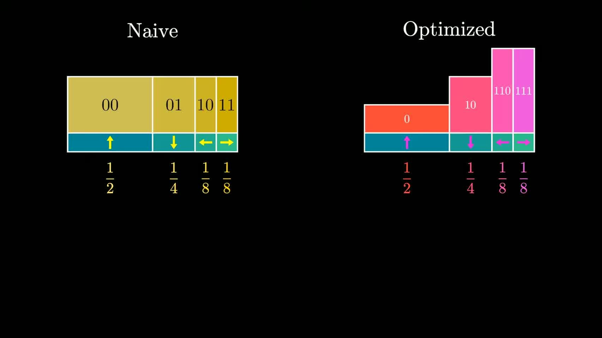

# 3Blue1Brown: Reinventing Entropy

- Video: [Reinventing Entropy | Compression is Intelligence Part 1](https://www.youtube.com/watch?v=l6DKRf-fAAM)
- Channel: 3Blue1Brown
- Duration: 32:19
- Transcript: `youtube/transcripts/l6DKRf-fAAM-3blue1brown-reinventing-entropy-compression-intelligence-part1/`
- Slides: `youtube/slides/l6DKRf-fAAM-reinventing-entropy-compression-is-intelligence-part-1/curated/`

这期视频的主线很干净：从“文本最少需要多少 bit 才能编码”这个工程问题出发，把 compression、prediction、entropy 和 cross entropy 串成一条线。它没有一开始就把 entropy 当成热力学或抽象公式，而是把 entropy 解释成“如果你真正知道数据分布，平均还必须支付多少编码代价”。

## 1. 00:00-04:53：问题不是 ASCII 低效，而是数据有结构

开头从文本编码讲起。ASCII 给每个字符固定 8 bit，这当然简单，但它没有利用任何分布结构。英文文本里某些字符和词远比其他字符常见，上下文也会强烈约束后面可能出现什么。如果编码方案对所有符号一视同仁，就会把可预测的部分也当成随机噪声来付费。

视频的第一个转向是：压缩不是简单缩文件，而是把数据中的规律变成更短的描述。只要某些事件更常见，或者某些序列更容易被上下文预测，编码就可以把这些结构吃掉。真正不可压缩的部分，才是剩下的不确定性。

## 2. 04:53-08:39：概率分布决定代码长度

接下来视频用 variable-length code 说明基本原则：常见事件应该分配短码，罕见事件可以分配长码。这样平均编码长度会下降。

但这件事有一个约束：编码必须能被无歧义地解码。prefix code 的作用就是让解码器读到某个码字时，不会怀疑它是不是另一个更长码字的前缀。这一步把“概率分布”和“可解码结构”连起来：你不能随便给短码，必须在可解码的码树里安排短码和长码。

这部分最适合保留的直觉是：一个编码器其实在下注。它押注哪些消息会更常见，然后把短路径留给这些消息。如果押对了，平均代价低；押错了，就会浪费 bit。

## 3. 13:24-20:48：信息量就是预测失败时付出的代价

中段把单个符号推广到序列。一个完整文本的编码代价，可以看成模型沿着文本逐步给出概率，然后把每一步的“不意外程度”累积起来。

如果模型非常确定下一个字符或词，而且它确实猜对了，那么编码成本很低。如果模型认为某个结果极不可能，但真实数据偏偏出现了这个结果，编码成本就会很高。于是 prediction 和 compression 变成同一件事的两种说法：

- prediction 说的是模型给真实下一个符号分配了多少概率。
- compression 说的是因为这个概率分配，真实符号最终需要多少 bit 才能编码。

这也是为什么语言模型训练里的 cross entropy 不只是一个机器学习黑箱 loss。它在信息论上就是“用这个模型分布去编码真实文本时，平均要付多少代价”。

## 4. 29:11-31:06：entropy 是真实分布下不可避免的平均代价

到这里，entropy 的角色才自然出现。它不是先验的神秘量，而是当你知道真实分布，并按最优方式编码时，平均仍然绕不开的 bit 数。

如果分布很尖，事件高度可预测，entropy 低。编码器可以把常见结果压得很短。反过来，如果分布很平，每个结果都差不多可能，entropy 高。没有明显结构可利用，压缩空间就小。

cross entropy 则是在真实分布之外再加上一层模型误差：如果你用一个不准确的模型分布编码真实数据，平均代价会比最优 entropy 更高。这个额外代价就是模型没有学到真实结构的惩罚。

## 5. 31:06-31:41：为什么说 compression is intelligence

视频最后把概念拉回现代 AI。语言模型如果能更好地压缩文本，说明它更好地捕捉了文本中的统计结构：词频、语法、语义、上下文、风格、事实关联，都以概率分布的形式进入编码代价。

这句话需要谨慎理解。压缩不是智能的全部。一个模型可能只压缩表面统计而缺少行动、规划、因果和目标。但压缩确实给了一个强测量：模型是否抓住了可预测结构，是否能把数据中不需要逐字记忆的部分变成更短的内部描述。

## 6. 和当前研究线的连接

这期视频适合当作 entropy / cross entropy / representation learning 的入口。它对后面几条线都有接口：

- 对 LLM，cross entropy 是训练目标，也是文本压缩代价。
- 对 world model，核心问题变成在 latent state 里压缩和预测世界结构，而不是复原所有像素细节。
- 对生成模型，好的 latent 或 score 不是只会采样，而是捕捉分布中的可压缩结构。
- 对城市生成或复杂系统建模，关键不是生成一个表面像真的样本，而是学习哪些宏观约束、交互规律和不确定性真正决定了可行世界。

可以把这期笔记压缩成一句话：entropy 衡量的是在最懂分布的情况下仍然剩下多少不确定性；cross entropy 衡量的是模型不够懂分布时多付了多少编码代价。
