# Amy Zhang：Representations for Hierarchical Reinforcement Learning

Source: [transcript](../../youtube/transcripts/nyXXX3fIzMw-amy-zhang-representations-hierarchical-rl/transcript.md), [curated slides](../../youtube/slides/nyXXX3fIzMw-amy-zhang-representations-for-hierarchical-reinforcement-learning-may-30-2025/curated/index.md), [YouTube](https://www.youtube.com/watch?v=nyXXX3fIzMw)

这场 talk 的主问题不是“怎样给 RL 再加一层网络”，而是：

> 什么样的表示，能把长程任务拆成可复用、可组合、可规划的中间结构？

Amy Zhang 的线性逻辑可以写成：

```text
long-horizon sparse reward
→ temporal skills / options
→ old options framework
→ modern HRL instability
→ goal-conditioned and MI-based skill learning
→ skill reuse problem
→ compositionality and relational MDPs
→ hand-designed attribute abstraction
→ learned factored abstraction
→ controllability and locality beyond factored settings
```

这条线里最重要的转折是：hierarchy 的核心不是“多层策略”本身，而是“高层使用什么抽象变量”。如果抽象变量选错，高层 policy 只是多了一个更大的动作空间；如果抽象变量选对，长程任务会变成短程技能的组合问题。

## 1. 00:10-00:13：为什么需要 hierarchy

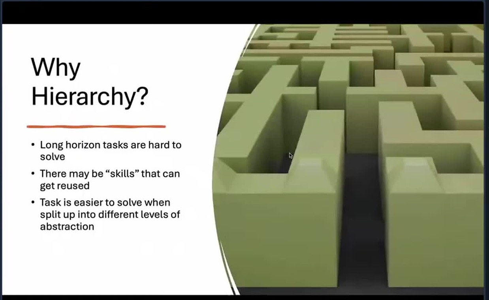

Amy Zhang 一开始把 hierarchical RL 的目标限制在一类很具体的问题上：long-horizon tasks with sparse reward。

Long horizon 的意思是，agent 需要做很多步动作才能看到最终结果。Sparse reward 的意思是，在到达目标之前，环境几乎不给有效学习信号。比如导航到校园里的 bell tower，在走到 tower 之前，单步动作本身并不会告诉 agent “你做得对不对”。如果只在 primitive action 层面学习，credit assignment 会很难：最后成功或失败要归因到前面哪一步动作，信号非常稀薄。

Hierarchy 的第一层直觉，是把一个长程目标拆成几个更短的中间目标。UT campus 的例子是：

```text
start somewhere on campus
→ first reach the CS building / GDC
→ from there locate the tower
→ walk to the tower
```

这里 GDC 不是最终目标，而是 waypoint / subgoal。它的作用是降低规划难度。原本 agent 要在整个校园空间里直接搜索到 tower；加入 subgoal 后，它先解决一个局部可达目标，然后再解决下一段。任务没有改变，但搜索空间和时间尺度改变了。

所以 hierarchy 不是说 agent 变聪明了，而是说决策单位变粗了。Flat RL 每一步都问“下一个 primitive action 是什么”；hierarchical RL 先问“接下来应该完成哪个中间目标或调用哪个 skill”，然后让低层 policy 执行细节。

## 2. 00:13-00:16：skill hierarchy 需要两种抽象

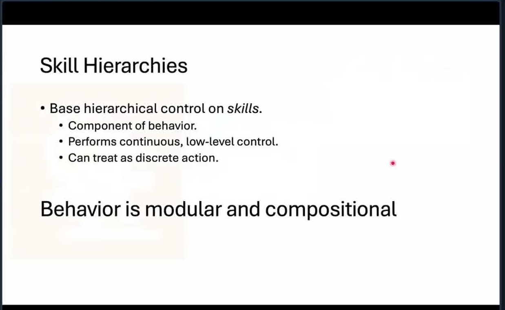

Skill 是 hierarchy 里的基本行为单元。它不是单个 action，而是一段能持续执行的低层控制过程。比如对 humanoid robot 来说，primitive action 可能是每个关节的力矩；但高层更希望使用“向北走 10 步”“走到门口”“抓起杯子”这样的行为单元。

这就引出两种抽象。

第一种是 state abstraction。原始 state 可能是机器人相机看到的像素图像。高层不应该直接在像素空间里规划，它需要一个更简洁的状态描述，比如当前位置、目标方向、是否在某栋楼附近。记为：

$$
z_s = \phi(s).
$$

这里 $\phi$ 把原始状态 $s$ 映射成高层可用的抽象状态 $z_s$。

第二种是 action abstraction。原始 action 可能是连续低层控制，例如关节力矩。高层不直接选择这些动作，而是选择 skill、option 或 subgoal。可以写成：

$$
o_t \sim \pi_{\mathrm{high}}(o \mid \phi(s_t)),
$$

$$
a_t \sim \pi_{\mathrm{low}}(a \mid s_t,o_t).
$$

这两行的含义是：高层在抽象状态上选择一个 skill $o_t$，低层再根据当前原始状态和这个 skill 输出 primitive action $a_t$。

所以 hierarchical RL 不是只有 action abstraction。它同时需要 state abstraction 和 action abstraction。没有 state abstraction，高层不知道自己在规划什么；没有 action abstraction，高层仍然被迫逐步控制低层动作。

这也解释了为什么 Amy Zhang 后面会把 hierarchy 和 representation learning 绑在一起。真正难的不是把 policy network 分成 high-level 和 low-level，而是找到一个能支持 skill reuse 的表示空间。

## 3. 00:16-00:24：options framework 把 skill 形式化

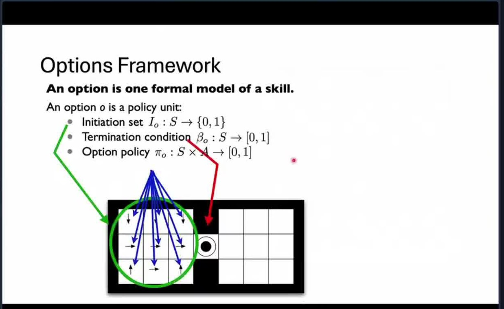

Sutton 的 options framework 给 skill 一个正式定义。一个 option $o$ 由三部分组成：

$$
o = (I_o,\pi_o,\beta_o).
$$

$I_o$ 是 initiation set，表示这个 option 可以从哪些状态启动。

$\pi_o(a \mid s)$ 是 option policy，表示 option 启动以后，在每个状态下应该采取什么 primitive action。

$\beta_o(s)$ 是 termination condition，表示 option 到达状态 $s$ 时是否终止。

用四房间 gridworld 解释最清楚。假设 agent 在左侧房间里，目标是穿过 hallway 到右侧房间。一个自然的 option 是“走到 hallway”。它的 initiation set 是左侧房间里的状态；它的 policy 是在左侧房间内把 agent 引导到 hallway 的局部策略；它的 termination condition 是 agent 到达 hallway 时停止。

Primitive action 也可以被看成一种特殊 option。比如 action $a=\text{up}$ 可以写成：

$$
I_o(s)=1,\qquad \beta_o(s)=1,\qquad \pi_o(a'\mid s)=\mathbf 1[a'=a].
$$

这表示它可以在任何状态启动，只执行一步，然后立即终止，并且总是选择同一个 primitive action。

这个形式化很重要，因为它说明 option 不是“模糊的技能直觉”，而是半马尔可夫决策过程中的 temporally extended action。高层 policy 选择 option 后，不一定下一步马上重新决策；option 可能持续多个 time steps。

## 4. 00:20-00:24：options 为什么能加快 value propagation

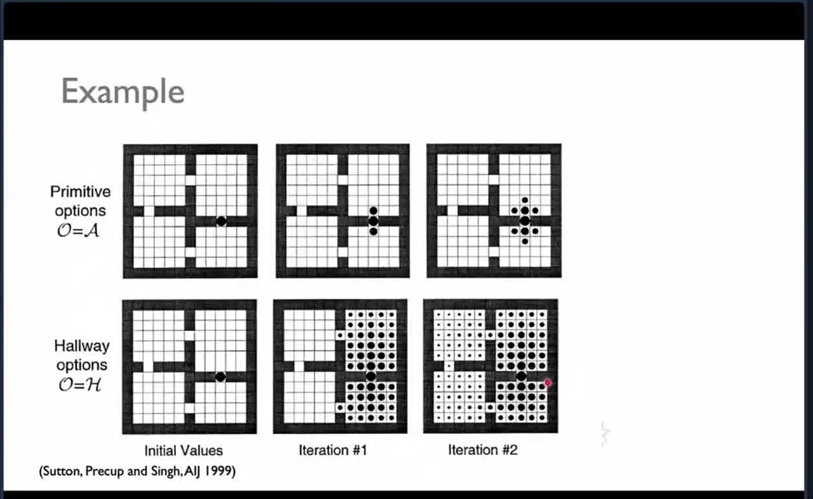

四房间例子的核心作用，是说明 option 为什么能缩短 effective horizon。

如果 action set 只有 primitive actions $\{\text{up},\text{down},\text{left},\text{right}\}$，value information 只能一格一格传播。目标在 hallway 处时，第一轮更新只会让目标附近的一格变得有价值，第二轮再往外扩一格。长程任务里，这种传播非常慢。

如果 action set 里有 hallway options，情况变了。一个 option 可以从房间内任意状态直接把 agent 带到 hallway。这样目标值不再只能沿着 primitive step 扩散，而是可以沿着 option 的 initiation set 一次性传播到整间房间。于是 value propagation 的步长变长了，规划层面的 horizon 变短了。

但这个例子也暴露出一个限制。如果目标不是 hallway，而是房间中间的某个格子，而 action set 只有 hallway options，那么 agent 反而无法精确到达目标。因为所有 hallway options 都终止在 hallway，不会终止在房间内部。

所以 options 不能完全替代 primitive actions。合理的 action abstraction 通常要同时保留：

```text
primitive actions for local adjustment
+
options for long-distance value propagation
```

这一步很关键。Hierarchy 的目的不是把低层动作全部丢掉，而是在不同时间尺度之间建立接口。低层动作负责细节，options 负责跨越长程结构。

## 5. 00:24-00:27：现代 HRL 的第一个问题：option collapse

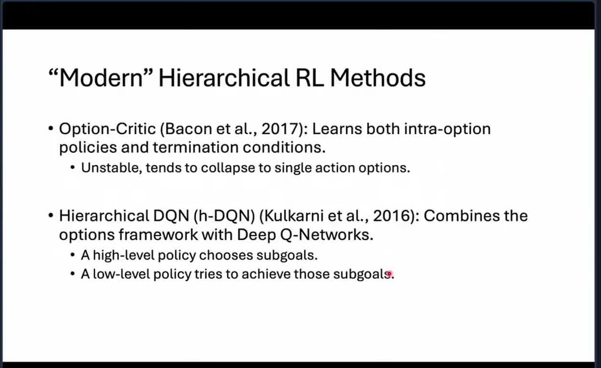

Amy Zhang 接着转向 deep RL 时代的 hierarchical methods。她先讲 Option-Critic 和 Hierarchical DQN。

Option-Critic 的目标是同时学习 intra-option policies 和 termination conditions。也就是说，它不再要求研究者手工设计 hallway option，而是希望网络从 task reward 中学出 options。

问题在于，learning signal 仍然来自原始任务。如果原始任务本身是 long-horizon sparse reward，那么 options 的学习信号也一样稀疏。低层 option 还没成形，高层 policy 就不知道该选什么；高层 policy 还不稳定，低层 option 又没有稳定目标。两层同时学习会产生 nonstationarity。

更具体地说，高层 policy 依赖低层 options 的效果：

$$
\pi_{\mathrm{high}}(o\mid s)
\quad\text{is meaningful only if}\quad
P(s'\mid s,o)
\quad\text{is stable}.
$$

如果低层 option policy $\pi_o$ 一直在变，那么同一个 option $o$ 今天可能把 agent 带到 hallway，明天可能停在墙边。高层看到的是一个不断变化的 action model，它很难收敛。

Option-Critic 的常见失败模式是 collapse to single-action options。也就是说，学出来的 option 退化成只持续一步的 primitive action。表面上模型有 options，实际上又回到了 flat RL。

这解释了为什么仅仅“让网络自己学 options”不够。Hierarchy 需要一个独立于最终稀疏 reward 的 skill-learning signal，否则低层 skill 很难先稳定下来。

## 6. 00:27-00:31：goal-conditioned RL 把低层 skill 从最终任务中分离

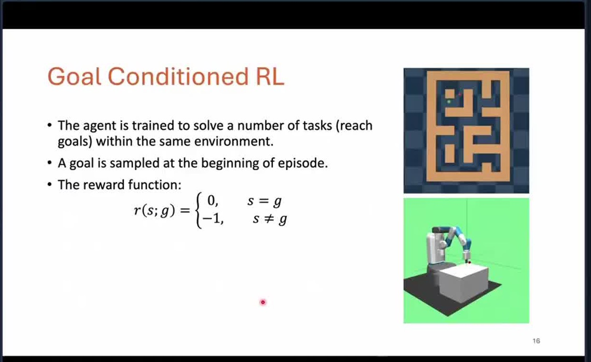

一个解决思路是先训练 low-level goal-conditioned policy，再在它之上训练 high-level policy。低层 policy 不再直接追求最终 task reward，而是学习到达各种 goal。

普通 policy 写成：

$$
\pi(a\mid s).
$$

Goal-conditioned policy 写成：

$$
\pi(a\mid s,g).
$$

这里 $g$ 是目标状态或目标表示。训练时，每个 episode 开始先采样一个 goal，agent 的目标是尽快到达它。一个简单 reward 可以写成：

$$
r(s,g)=
\begin{cases}
0, & s=g,\\
-1, & s\ne g.
\end{cases}
$$

这个 reward 的含义是：每多走一步就多付出 $-1$，到达 goal 后停止扣分，所以最优策略会倾向于最短路径。

HERO 这类方法使用 goal-conditioned low-level policies，并用 goal relabeling 增加学习信号。即使 agent 没有到达原始指定 goal，它到达了某个实际状态 $g'$，也可以把这段经验重新解释成“以 $g'$ 为目标的一次成功尝试”。这样 low-level policy 可以从更多轨迹中学习。

这一步的理论意义是把低层学习从最终任务 reward 中解耦出来。低层不需要等待“完成完整任务”才得到信号，它只需要学习局部 goal-reaching。高层之后再把这些 goal-reaching skills 组合成完整任务。

## 7. 00:29-00:31：DIAYN 用 mutual information 学 task-agnostic skills

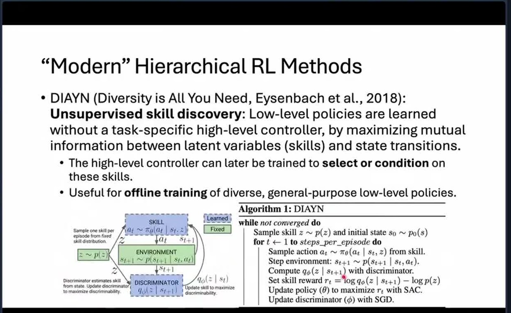

另一条路线是 task-agnostic skill learning。DIAYN 的直觉是：即使没有外部任务，也可以先学一组彼此可区分、覆盖状态空间的 skills。

它引入 latent skill variable $z$，训练 policy：

$$
\pi(a\mid s,z).
$$

目标是让不同 $z$ 导致不同的 state transitions，使得观察轨迹后能推断出当前使用的是哪个 skill。用信息论语言说，就是提高 skill identity 和 visited states 之间的 mutual information：

$$
I(z;s).
$$

如果 $z_1$ 和 $z_2$ 导致的行为没有区别，那么从 state 中无法判断 skill，mutual information 低。反过来，如果每个 skill 都产生可区分的状态分布，那么 $I(z;s)$ 高。

这种方法的优点是低层 skills 可以在没有具体下游任务时预训练。训练完后冻结 low-level skills，再让 high-level policy 在下游任务中选择 skill。

但 Amy Zhang 马上指出，这类方法虽然缓解了 high/low level 同时训练的不稳定，却没有真正解决 skill reuse。因为每个 skill 往往绑定到某个特定 state region 或特定行为模式。它能学到 diverse skills，不等于学到 reusable skills。

## 8. 00:31-00:34：关键缺口是 skill reuse，而不只是 skill diversity

现代 HRL 方法的共同进步是把 low-level learning 和 high-level learning 分开。Goal-conditioned policy 用 reachability 训练低层，DIAYN 用 mutual information 训练低层。这样高层不必在低层还没稳定时同时学习。

但这里还有一个更深的问题：低层 skill 是否能在不同 context 中复用？

回到四房间例子。如果四个房间形状相同，那么“从房间内部走到上方 hallway”和“从房间内部走到右侧 hallway”应该是可复用技能。我们不希望每个房间都单独学两个 hallway options。理想情况是：

```text
same local room structure
→ same hallway-reaching skill
→ reused in many rooms
```

这和 skill diversity 不一样。Diversity 只要求技能彼此不同；reuse 要求技能能脱离特定全局状态，在多个相似局部结构中反复使用。

这就是 talk 的主转折。Amy Zhang 不再满足于“学一些低层 skills”，而是开始问：

> 什么样的 abstraction 能让同一个 skill 在不同任务、不同位置、不同对象组合中复用？

答案会引向 compositionality、relational MDP 和 factored abstraction。

## 9. 00:34-00:36：compositionality 说明为什么 factorization 有用

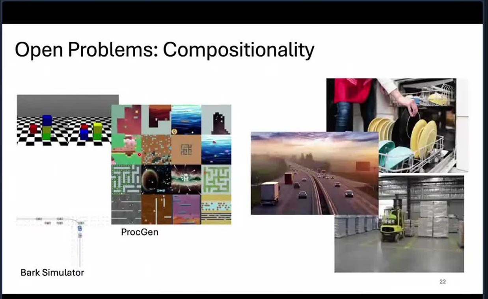

Compositional generalization 的核心是：环境由若干可复用的低层因素组成，新任务是这些因素的新组合。

Block stacking 是最直观的例子。每个 block 的物理规则类似，差别主要是颜色、位置和相互关系。训练时见过红块移动、蓝块移动、绿块叠在黄块上，不代表测试时只能处理这些原组合；模型应该能把“移动一个 block”“把一个 block 放到另一个 block 上”这些规则组合到新目标里。

Driving 也类似。不同场景里车辆数量、位置、道路布局会变，但每辆车的局部动力学和交互规则具有共享结构。Procedurally generated games 也是这样：关卡布局无限多，但底层规则固定。

所以 factorization 的作用，是把“看起来巨大无比的状态空间”拆成多个重复出现的因子。模型不再把每个完整场景当成全新对象，而是识别：

```text
same object type
same local relation
same transition rule
new global combination
```

这正是 hierarchy 可以发挥作用的地方。低层 skill 处理局部 factor transition，高层 planner 组合这些 transitions。

## 10. 00:34-00:36：组合泛化有不同形式

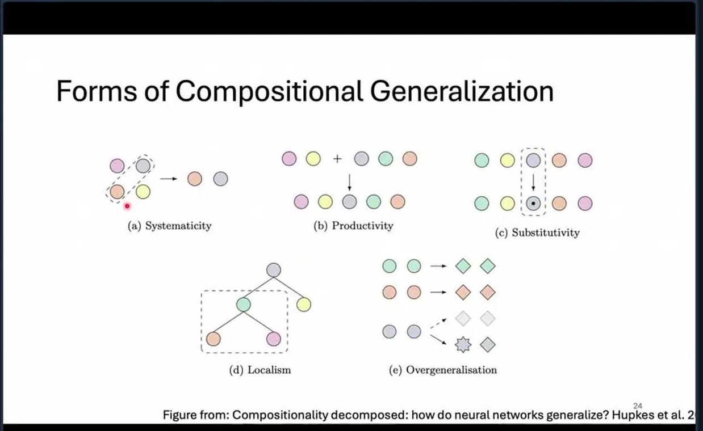

Amy Zhang 引用语言领域的 compositionality taxonomy，用来说明 RL 中的组合泛化不是单一概念。

Systematicity 指已知部件和规则的重新组合。比如训练见过“红块放蓝块上”和“绿块放黄块上”，测试时要求“红块放黄块上”。部件没变，组合变了。

Productivity 指模型能推广到比训练更长的组合。比如训练只见过两步 stacking，测试要求四步 stacking。这里难点不是单步技能，而是长程组合。

Substitutivity 指可替换部件的泛化。如果两个对象在某个任务中等价，模型应该能把一个替换成另一个，而不重新学习整套策略。

Localism 指组合操作是否局部。很多物理任务的变化只影响局部对象和关系，而不是全局状态全部重写。如果模型能利用这种局部性，泛化会更容易。

Overgeneralization 指模型是否能处理规则例外。这个在自然语言里更明显，在物理和机器人里对应的是：规则通常共享，但某些对象或环境条件会打破普通规律。

这组概念的作用不是做分类学，而是提醒我们：skill reuse 要依赖具体的组合结构。如果任务的组合方式是局部、可替换、可扩展的，hierarchy 才有明确抓手。

## 11. 00:36-00:38：relational MDP 把 factorized structure 写进 MDP

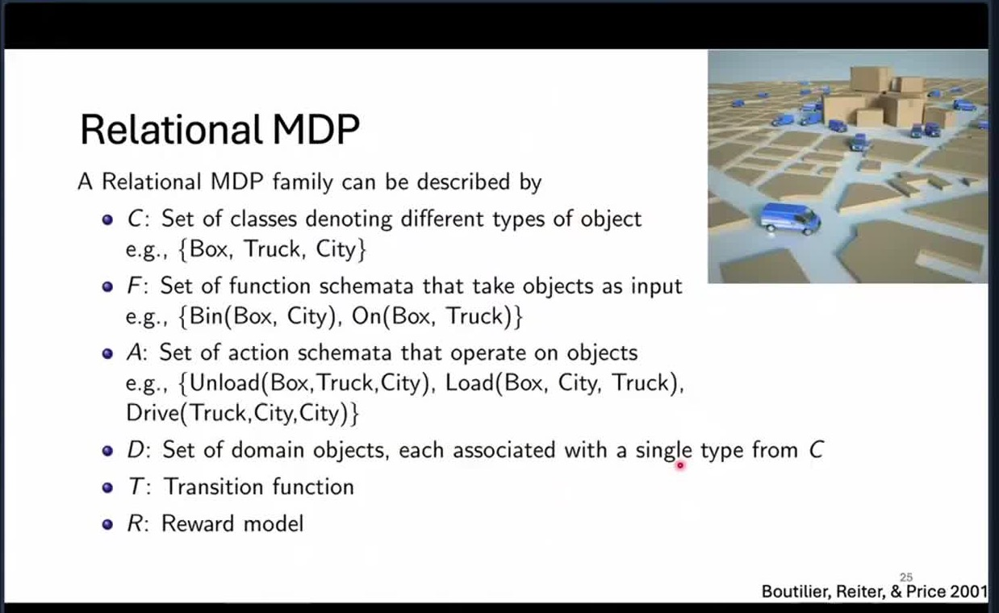

Relational MDP 是普通 MDP 的结构化版本。普通 MDP 写成：

$$
\mathcal M=(\mathcal S,\mathcal A,P,R,\gamma).
$$

Relational MDP 进一步说明状态和动作不是无结构集合，而是由 object types、objects、relations 和 action schemata 组成。

Slide 上的例子是运输任务。对象类型包括：

```text
Box, Truck, City
```

动作 schema 包括：

```text
Load(Box, Truck, City)
Unload(Box, Truck, City)
Drive(Truck, City, City)
```

这里的关键是 schema。一个具体城市实例里可能有不同数量的 boxes、trucks 和 cities，但 “load a box onto a truck in a city” 这个规则可以复用。对象变了，规则不变。

Relational MDP 因而提供了 hierarchy 的自然定义。低层技能可以对应某类 relation 的局部改变，例如把一个 box 装上某辆 truck；高层规划可以在 relation graph 上组合这些局部改变，完成完整运输任务。

这比普通 MDP 更适合 compositional generalization。因为普通 MDP 会把每个完整状态当成一个整体，relational MDP 则把状态拆成对象和关系，使“同一规则作用于不同对象组合”变得可表达。

## 12. 00:38-00:41：attribute planner 的目标是把巨大 goal space 变成图搜索

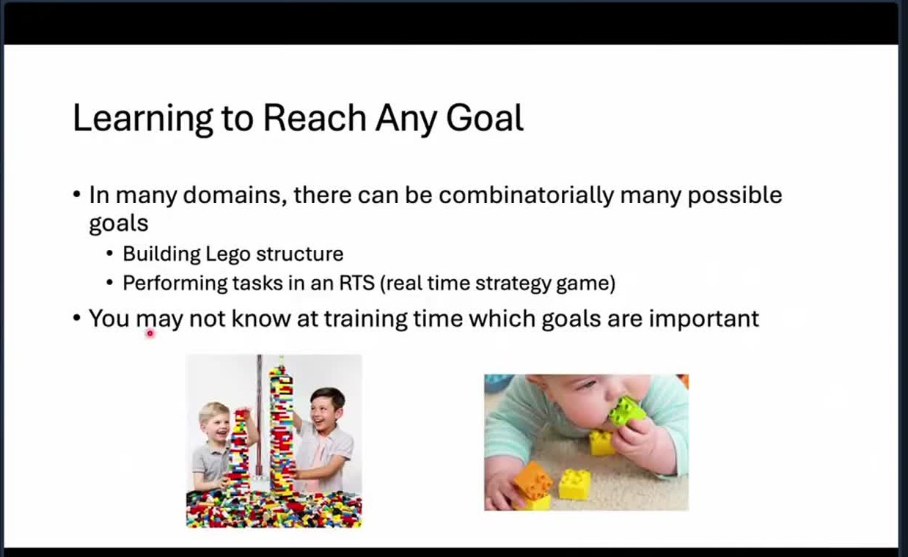

Block stacking 的 goal space 是 combinatorial 的。假设有多个 blocks，每个 goal 可以指定哪些 block 在哪些 block 上、左右关系是什么、哪些关系无所谓。可能目标数随对象数爆炸。

Flat RL 的做法是直接训练一个 policy 去 reach any goal。问题是，长程稀疏 reward 会让训练很难，而且训练时不可能覆盖所有组合目标。

Attribute planner 的想法是换一个问题表述：

```text
do not learn a flat policy over all goals
learn local transitions in attribute space
then plan over the attribute transition graph
```

也就是说，低层 policy 不负责完整目标，只负责从一个 attribute configuration 到邻近的 attribute configuration。高层则在 attribute graph 上做 Dijkstra 或 A* 这样的图搜索，找到从当前 attributes 到目标 attributes 的路径。

这一步把 long-horizon RL 转成了两部分：

```text
local control problem:
    can I move from attribute set rho_i to nearby rho_j?

global planning problem:
    which sequence of attribute sets leads to the final goal?
```

因此 attribute planner 不是把 RL 做得更深，而是把任务拆成 “可学习的局部转移” 和 “可搜索的全局组合”。

## 13. 00:40-00:44：attribute 是用户关心的高层二值关系

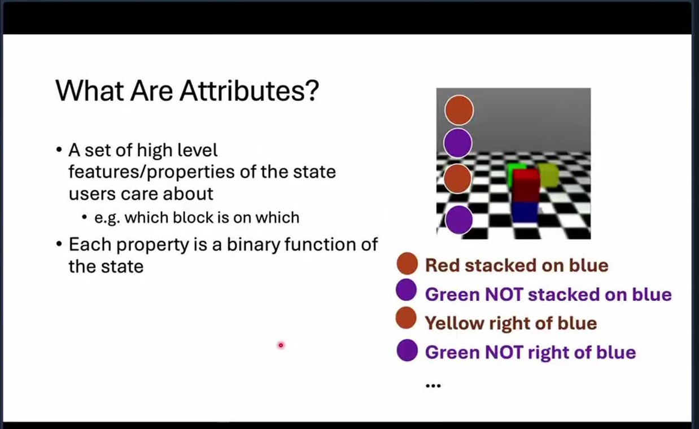

Attribute 是状态的高层属性，通常是二值函数：

$$
\rho_k(s)\in\{0,1\}.
$$

在 block stacking 中，attribute 可以是：

```text
red stacked on blue
green not stacked on blue
yellow right of blue
green not right of blue
```

把所有 attributes 组合起来，就得到一个 attribute vector：

$$
\rho(s) = (\rho_1(s),\rho_2(s),\ldots,\rho_m(s)).
$$

它不是完整状态。它丢掉了像素细节、纹理、照明等信息，只保留任务关心的 relational facts。这个压缩是有目的的：高层规划不需要知道每个像素，只需要知道哪些关系成立、哪些关系还没成立。

Attribute planner 有三个组件。

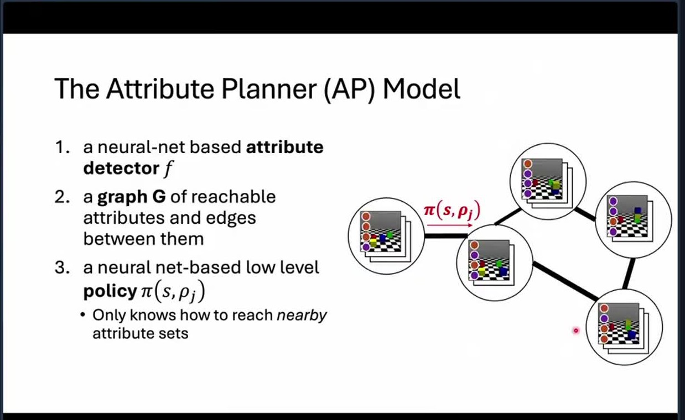

第一，attribute detector $f$。它把原始像素状态 $s$ 映射到 attributes：

$$
f(s)\approx \rho(s).
$$

第二，attribute graph $G$。图的节点是 attribute sets，边表示从一个 attribute set 到另一个 attribute set 的局部转移曾经被观察到或被认为可达。

第三，low-level policy $\pi(s,\rho_j)$。它只知道如何从当前状态 $s$ 到达邻近 attribute set $\rho_j$，不需要解决完整任务。

执行时流程是：

```text
current pixel state
→ detect current attributes rho_0
→ search graph G for a path from rho_0 to goal attributes
→ call low-level policy to reach the next subgoal
→ re-detect attributes and replan
```

这里 replan 很重要。低层 policy 不一定每次都成功到达计划中的 attribute node。执行一个 subgoal 后，系统重新检测当前 attributes，再从新位置搜索。这让方法比一次性 open-loop plan 更稳健。

## 14. 00:44-00:49：attribute planner 的实验证明“正确抽象”比 flat RL 更关键

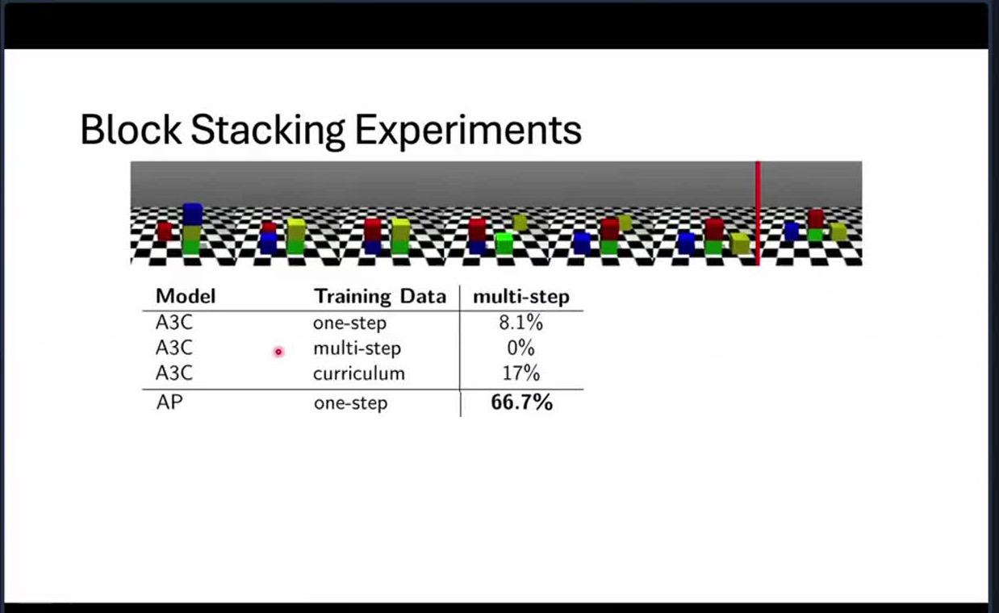

Block stacking 实验里，flat A3C 在 long-horizon sparse reward 下表现很差。训练在 one-step tasks 上，再测试 multi-step tasks，只有约 8% success；直接训练 multi-step tasks 甚至接近 0%；用 curriculum 从简单到复杂逐步训练，能到约 17%。

Attribute planner 达到约 66%。这个差距不是因为它的神经网络更大，而是因为它改变了问题结构。

Flat RL 面对的是：

```text
pixel state + final goal
→ primitive actions
→ sparse final reward
```

Attribute planner 面对的是：

```text
pixel state
→ attributes
→ graph path over attributes
→ local low-level control
```

也就是说，它把稀疏长程 reward 问题转成图搜索和局部控制问题。高层不需要从 reward 里慢慢学出所有组合；它直接在 attribute graph 上搜索可达路径。

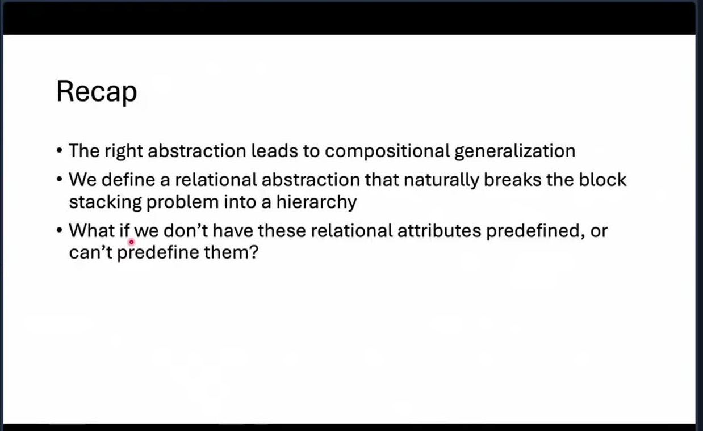

Recap slide 的重点是：right abstraction leads to compositional generalization。这里的 “right” 不是审美上的 right，也不是说这个 attribute 在人类语言里听起来合理，而是说它在整个 hierarchical control loop 里能工作。

Attribute abstraction 在这个方法里不是一个孤立表示，而是一个接口。它夹在三件事之间：

```text
raw observation / pixel state
→ attribute detector
→ attribute graph and planner
→ low-level policy execution
→ new raw state
```

如果这个接口选得好，原始像素里的复杂变化会被压成高层关系，planner 可以在这些关系上搜索，low-level policy 可以把相邻关系变化真实执行出来。这样长程任务才会从“在像素和 primitive action 上试错”变成“在 attribute graph 上组合局部转移”。

所以一个好的 abstraction 必须同时满足三点。

第一，它能被检测。模型必须能从原始 state 判断当前 attribute 是否成立。形式上，就是 detector $f$ 要能从像素状态 $s$ 预测 attribute vector：

$$
f(s)\approx \rho(s).
$$

如果 detector 不可靠，高层 planner 的起点就错了。比如真实状态里红块并没有在蓝块上，但 detector 误判为已经在上面，那么 planner 会以为某个子目标已经完成，后续 graph search 就会从错误节点出发。

第二，它能被控制。低层 policy 必须能把一个 attribute set 改成邻近 attribute set。也就是说，对于 graph 上的一条边

$$
\rho_i \to \rho_j,
$$

low-level policy $\pi(s,\rho_j)$ 应该有较高概率把真实状态从满足 $\rho_i$ 推到满足 $\rho_j$。如果某个 attribute 只是能被观察，但 agent 无法稳定改变它，它就不能作为 skill 的目标。比如“房间光照颜色”可以被检测，但如果 robot 不能控制灯光，那么把它放进 attribute graph 只会制造不可执行的边。

第三，它能被组合。高层 planner 必须能把一串 attribute transitions 拼成完整任务。单个 attribute transition 只解决局部变化；compositional generalization 要求这些局部变化可以串起来：

```text
rho_0
→ rho_1
→ rho_2
→ ...
→ rho_goal
```

如果 attribute 过于低层，比如接近像素 patch，它也许可检测、可局部改变，但 graph 会太大，planner 很难组合出长程任务。如果 attribute 过于高层，比如直接写成“完成整座塔”，它也许接近最终目标，但低层 policy 很难一步执行。合适的 abstraction 要处在中间尺度：比 pixel 更抽象，但比 full task 更局部。

这三点对应三个失败位置。

如果一个变量可检测但不可控制，它对 skill learning 没用，因为 low-level policy 无法把它当成 subgoal 执行。它最多是环境描述，不是行动接口。

如果一个变量可控制但不能组合，高层规划仍然困难，因为 planner 无法把局部动作拼成长程结构。它可能是一个 useful motor primitive，但不是一个好的 planning symbol。

如果一个变量可组合但无法从观测中可靠检测，执行时会失效，因为 agent 无法知道自己当前处在 graph 的哪个节点，也无法判断某个 subgoal 是否已经完成。

所以 attribute abstraction 的价值在于，它正好把感知、控制和规划连接起来。Detector 负责回答“我现在在哪个 attribute node”；low-level policy 负责回答“我能不能走到相邻 node”；planner 负责回答“哪些 node sequence 能到最终目标”。只有这三个问题同时成立，right abstraction 才会真的带来 compositional generalization。

## 15. 00:49-00:57：从 hand-designed attributes 到 learned factored abstraction

Attribute planner 的限制很明显：它假设 relational attributes 已经由人预先定义。现实中，我们往往不知道应该用哪些 attributes，也不一定能手工标注。

因此下一步是 learned factored abstraction。Amy Zhang 把这个问题拆成三个子问题。

第一是 factorization problem。模型要从像素或高维状态中抽取 factors，例如每个 object 的表示。

第二是 correspondence problem。模型要在时间中追踪同一个 factor 的 identity。也就是说，当前帧里的红块和下一帧里的红块必须被识别为同一个对象，而不是每一帧重新打乱。

第三是 combinatorial problem。抽取出 factors 后，模型要能利用它们组合泛化，而不是只是得到一堆 object embeddings。

这里还有一个重要区分：object representation 可以拆成 action-invariant features 和 action-dependent features。

Action-invariant features 是 object type，例如红块、蓝块、truck、box。它们通常不随动作改变，但 reward 或 goal 会用它们指定任务。

Action-dependent features 是 object state，例如位置、速度、姿态。它们会随动作变化，决定低层 dynamics。

如果把这两类信息混在一起，模型很难知道“哪个东西应该保持 identity，哪个东西应该随 action 更新”。所以 factored abstraction 不只是 object detection，而是要把 type 和 state 的角色分开。

## 16. 00:52-00:57：NCS 把数据抽象成 per-factor transition graph

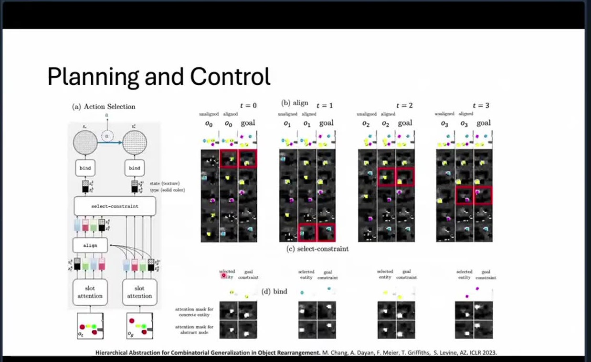

Neural Constraint Satisfaction, NCS，是从 hand-designed attribute planner 往 learned factor abstraction 走的一步。

它仍然保持两层结构。

高层做 graph search。不同的是，图不再是人工 attribute graph，而是从数据中学到的 factor-level transition graph。

低层做 object movement。它负责执行某个 factor 的局部移动，而不是理解完整全局目标。

NCS 的建图逻辑是：如果一段 transition 中只有一个 object 在移动，其他 objects 基本静止，那么这段 transition 不应该被记录成“整个全局状态从 $S$ 到 $S'$”。它应该被记录成“某个 factor 从状态 $u$ 到状态 $u'$”。

也就是说，图的边从 global transition 变成 per-factor transition：

$$
S_t \to S_{t+1}
\quad\leadsto\quad
u_t^{(i)} \to u_{t+1}^{(i)}.
$$

这样做的好处是 skill reuse。假设训练时看过粉色方块从左边移动到右边。测试时需要蓝色方块做同样移动。如果图是 global state graph，这两个任务看起来是不同全局状态；如果图是 factor transition graph，模型可以把“移动一个对象”的 transition 迁移到另一个同类型对象上。

因此 NCS 的核心不是“用了 slot attention / transformer”这些具体组件，而是它把 transition graph 的单位从 whole state 降到了 factor。这个单位变化才是组合泛化的来源。

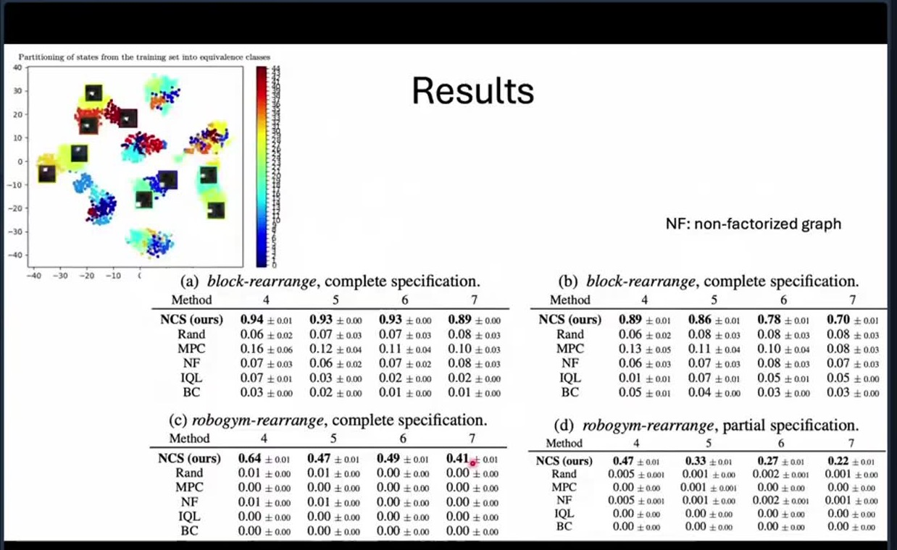

实验结果里，random policy 只有 6%-8% success，MPC 和 non-factorized graph 也明显较低。Non-factorized graph 的失败很有解释性：它虽然也建图，但图节点仍是全局状态，所以无法复用单个 object transition。它能记住发生过的整体配置，却不能把其中一个对象的局部移动抽出来迁移到新组合中。

这说明 factorization 对 hierarchy 不是锦上添花，而是 skill reuse 的结构前提。没有 factorization，高层图搜索会变成对巨大状态图的记忆；有 factorization，图搜索才变成对局部可复用 transitions 的组合。

## 17. 00:57-01:03：beyond factored setting 的问题是 controllability 和 locality

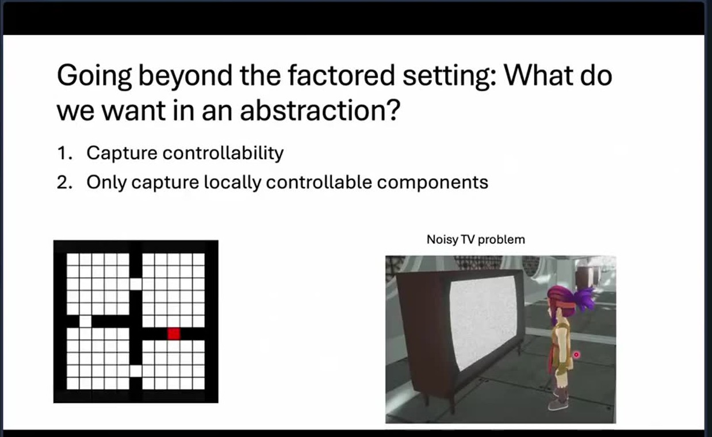

前面的两组方法都依赖 factored structure。Attribute planner 假设 attributes 给定；NCS 假设 factors 存在并可学习。最后一段问的是：如果不能假设清晰的 factors，我们还想从 abstraction 中得到什么？

Amy Zhang 给出两个原则。

第一，capture controllability。抽象应该保留 agent 能控制的部分，丢掉不可控扰动。Noisy TV problem 就是反例。一个电视屏幕不断显示随机噪声，如果 exploration bonus 奖励“新状态”，agent 可能永远盯着电视，因为每一帧噪声都不同。可是这些变化不可控，也不帮助完成任务。把它们写进 state abstraction，只会制造无限多无用状态，破坏 skill reuse。

第二，只保留 locally controllable components。低层 skill 通常只在局部范围内执行。例如在四房间环境里，agent 学一个“走到本房间 hallway”的 option 时，不需要知道其他房间发生了什么。远处状态对当前 low-level skill 没有直接作用。

这可以理解成一种 $k$-step locality。低层 goal-conditioned policy 如果只执行 $k$ 步，那么它真正需要关心的是 $k$ 步内可影响和可到达的状态部分，而不是整个环境。

所以 beyond factored setting 的 abstraction 目标不是重构完整 state，而是：

```text
keep what the agent can affect
keep what matters within the local skill horizon
drop uncontrollable exogenous variation
drop far-away irrelevant state
```

这和她前面讲的 state abstraction 一致。好的 representation 不是信息越多越好，而是要对控制问题有用。

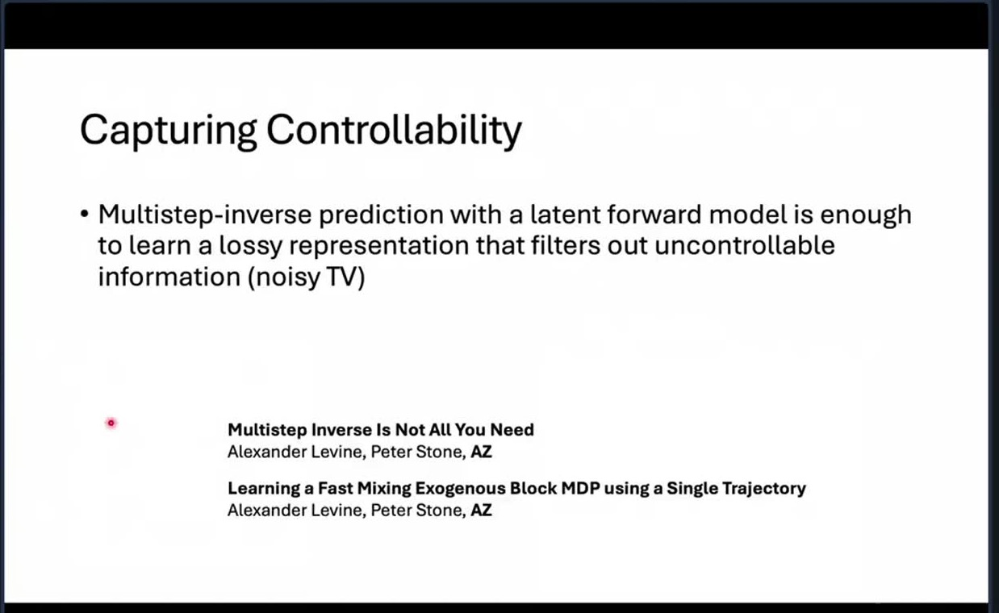

她最后提到 multi-step inverse prediction 和 latent forward model 可以帮助捕捉 controllability。直觉是：如果某个状态变量会影响“从当前到未来的动作推断”或“动作导致的未来变化”，它更可能是 controllable / task-relevant；如果某个变量只是外部随机噪声，它很难稳定地帮助 inverse prediction。

这部分还不是完整方法展示，更像未来方向：把 controllable state learning 和 hierarchical skill learning 结合起来，使 hierarchy 不再依赖手工 factored structure。

## 18. 01:04-01:10：Q&A 1，层级深度和 option 数量没有通用答案

第一个问题问的是：如何确定 hierarchy 的层数，以及需要多少 options？

Amy Zhang 的回答比较谨慎。Talk 里的方法主要是 two-level hierarchy：一个 high-level planner，一个 low-level policy。对于非常长的 horizon，多层 hierarchy 可能有意义。比如把许多 four-room maps 拼成更大的地图，可以有：

```text
within-room level
→ group-of-rooms level
→ whole-building level
```

但在 block stacking 这类问题里，两层可能已经足够，因为低层自然对应移动单个 object，高层自然对应组合 object transitions。

Option 数量的问题更难。Option-Critic 和 DIAYN 往往要预设 skill 数量。Goal-conditioned methods 似乎绕开了这个问题，因为每个 goal 都可以看成一个 option；但这也意味着 option space 可能和 state space 一样大，甚至连续无限大。

所以这里没有完美解。她的判断是：continuous goal space 可以避免手动指定有限 option 数，但高层 policy 会面对一个很大的 action/goal space。真正重要的开放问题是：

> 怎样找到最小但足够有用的一组 options？

这个问题和 abstraction 直接相关。好的 abstraction 应该把无限多 raw goals 压缩成有限或低维的可复用 subgoals，使高层规划不至于爆炸。

## 19. 01:10-01:12：Q&A 2，continual learning 中何时 reuse，何时 learn

第二个问题问 compositionality 对 continual learning 是否有帮助。

Amy Zhang 的回答可以拆成两类新环境。

第一类是 old components 的新组合。比如 agent 见过若干对象、关系和局部技能，现在遇到一个新的布局或新的组合目标。这时 compositional generalization 很有用，因为 agent 不应该重新学习所有东西，而应该复用已有 components 和 skills。

第二类是真正新东西。比如出现了从未见过的对象类型、动力学规律或任务机制。这时旧技能不足以解释新环境，agent 需要继续学习。

因此 continual learning 里的关键判断是：

```text
is this new task close to old tasks?
→ reuse old skills

is this new task far from old tasks?
→ learn new skills / update abstraction
```

她提到 bisimulation metrics 这类任务距离可以作为判断工具。如果新任务和旧任务在 reward / transition consequences 上很近，就可以 reuse；如果距离很远，就说明需要学习。

这个回答和整场 talk 的主线一致。Reuse 不是盲目复用，而是基于抽象空间里的相似性判断。

## 20. 01:13-01:16：Q&A 3，LLM 可以做高层 policy，但不能替代 grounding

第三个问题问 LLM 能不能作为 high-level policy。

Amy Zhang 的态度是：在很多任务上可以，而且很有价值。高层 policy 往往需要世界知识和抽象规划。比如“计划一次去日本的旅行”，LLM 知道订机票、去机场、订酒店、安排路线这些高层步骤。它从互联网语言数据里学到大量常识，因此很适合作为高层 planner 或 abstraction proposer。

但限制也很清楚。LLM 的知识主要来自语言。如果任务需要真实物理交互、环境探索、低层控制或很少被语言记录的领域知识，LLM 不能只靠文本解决。比如某些机器人操作、深海潜水、特殊工业环境，关键知识来自 embodied interaction，而不是网页文本。

所以更合理的定位是：

```text
LLM:
    provides high-level priors, task decomposition, symbolic plans

RL / control:
    grounds those plans in environment interaction and low-level execution
```

这和 hierarchy 很自然地接上。LLM 可以帮助生成 high-level subgoals，但 low-level policies 必须通过环境交互学会可执行性。否则高层计划只是语言上的合理，不一定在当前环境中可达。

## 21. 这场 talk 对我们当前问题的启发

这场 talk 对 route generation / mobility prediction 的启发，不是把 HRL 直接搬过去，而是借用它对“结构”的分解方式。

Route generation 的目标可以写成：

$$
\gamma \sim p_{\mathrm{data}}(\gamma\mid o,d,t).
$$

这里 $\gamma$ 是路径，条件是 origin、destination 和 time。难点不只在 feasibility。Feasibility 只保证路径能在图上走通，但真实分布还有 corridor mode 和 sequential edge order。也就是说，路径生成至少有三层结构：

```text
which corridor / mode?
→ which ordered edge sequence within that corridor?
→ is each transition graph-feasible?
```

这和 Amy Zhang 的 hierarchy 有一个很强的类比。High-level planner 不应该直接逐边生成完整路径，而可以先选择 corridor-level abstraction；low-level generator 再在 corridor 内生成可执行 edge sequence。换句话说：

```text
high-level:
    choose a reusable route abstraction / corridor / subgoal chain

low-level:
    realize it as an executable graph path
```

这里的关键问题就变成：什么是 route generation 里的 attribute 或 factor？

可能的候选包括 corridor identity、road class sequence、transfer nodes、bridge/tunnel/bottleneck points、OD pair 的 spatial relation、time-dependent congestion regime。它们不是每条 edge 的细节，而是高层路径模式的结构变量。

如果只做 edge-level diffusion 或 AR generation，模型可能在 feasibility 上做得不错，却无法稳定选择正确 corridor。这对应 Amy Zhang 说的：低层控制可以执行，但高层抽象没学好，skill reuse 和组合泛化仍然失败。

因此，这场 talk 给我们的研究问题提供了一个更明确的表述：

> 不是只问“如何生成一条可行路径”，而是问“如何学习一个能表达 corridor mode、局部可达性和 sequential realization 的层级表示”。

这个表述比单纯讨论 forward diffusion 如何破坏连续分布更贴近 graph path generation 的困难。因为路径的多模态结构是离散的、组合的、可复用的，不能只靠连续 FP / EP 语言解释。

## 22. 需要继续读的论文线索

这场 talk 里最值得沿着问题读的线有三组。

第一组是 options 和 modern HRL：Sutton options framework、Option-Critic、h-DQN、HERO、DIAYN。读这组的目的不是复现算法，而是理解为什么“学 skill”会 collapse、为什么要把 low-level skill learning 和 high-level planning 分开。

第二组是 Composable Planning with Attributes。它是这场 talk 的中心例子，最直接回答“给定正确 abstraction，hierarchy 如何产生组合泛化”。

第三组是 learned factor abstraction / controllability。NCS、slot attention、multi-step inverse prediction、exogenous Block MDP 这条线回答的是“如果 attributes 不给定，表示应该怎样学”。

如果把它接到我们的 route generation 问题，优先顺序应该是：

```text
Composable Planning with Attributes
→ goal-conditioned / contrastive RL 的 reachability 表示
→ graph path / corridor abstraction 的信息论或层级生成框架
```

原因是：我们现在最缺的不是新的 decoder，而是一个能把 corridor mode 和 edge-order realization 分开的抽象层。
