# Amy Zhang：从状态抽象到层级强化学习

这组材料不是一条单篇论文的线性解读，而是 Amy Zhang 几条 talk 共同构成的研究脉络。它们反复回答同一个问题：

> 强化学习为什么很难泛化，以及什么样的表示、上下文和层级结构，才能让 agent 不只是记住一个训练环境，而是学到可迁移的决策结构？

这里最容易被折叠的地方是：她讲的不是“给 RL 加一个更强的神经网络”，也不是单纯做 representation learning。她关心的是 representation 应该保留什么信息、丢掉什么信息，以及这种表示怎样服务于 long-horizon control、OOD generalization 和 compositional planning。

## 0. 资料来源和阅读顺序

本笔记整合了 5 个 talk：

1. **Amy Zhang Explores Generalization in RL by Exploiting Latent Structure and Bisimulation Metrics**
   Transcript: [transcript.md](../../youtube/transcripts/Sn8x2MS48xk-amy-zhang-latent-structure-bisimulation-oatml/transcript.md)
   Slides: [slides](../../youtube/slides/Sn8x2MS48xk-amy-zhang-explores-generalization-in-rl-by-exploiting-latent-structure-and-bisim)

2. **Exploring Context for Better Generalization in Reinforcement Learning @ UCL DARK**
   Transcript: [transcript.md](../../youtube/transcripts/akeUVn6WQoU-amy-zhang-context-generalization-rl-ucl-dark/transcript.md)
   Slides: [slides](../../youtube/slides/akeUVn6WQoU-amy-zhang-exploring-context-for-better-generalization-in-reinforcement-learning)

3. **Leveraging Structure and Abstractions for OOD Generalization, CoRL 2023 OOD Workshop**
   Transcript: [transcript.md](../../youtube/transcripts/KyURDq7rkuU-amy-zhang-structure-abstractions-ood-generalization-corl2023/transcript.md)
   Slides: [slides](../../youtube/slides/KyURDq7rkuU-ood-workshopcorl-2023-amy-zhang-leveraging-structure-and-abstractions-for-ood-ge)

4. **Representations for Hierarchical Reinforcement Learning, May 30, 2025**
   Transcript: [transcript.md](../../youtube/transcripts/nyXXX3fIzMw-amy-zhang-representations-hierarchical-rl/transcript.md)
   Slides: [slides](../../youtube/slides/nyXXX3fIzMw-amy-zhang-representations-for-hierarchical-reinforcement-learning-may-30-2025)

5. **Amy Zhang, UT Austin @ Sekeh Lab x NSF x SDSU Summer Bootcamp 2025**
   Transcript: [transcript.md](../../youtube/transcripts/mEXbX_VwWzc-amy-zhang-sekeh-lab-summer-bootcamp-2025/transcript.md)
   Slides: [slides](../../youtube/slides/mEXbX_VwWzc-amy-zhang-ut-austin-sekeh-lab-x-nsf-x-sdsu-summer-bootcamp-2025)

我把它们重新组织成一条线：

1. 先看 RL 的 generalization gap。
2. 再看 state abstraction 和 bisimulation：什么信息对决策真的相关。
3. 再看 context：任务变化不是噪声，而是结构。
4. 再看 hierarchy：长程任务需要可复用的技能和组合。
5. 最后看 generative RL：把策略诱导出的轨迹分布当成生成模型来理解。

## 1. 问题起点：RL 的失败不只是优化失败，而是泛化结构失败

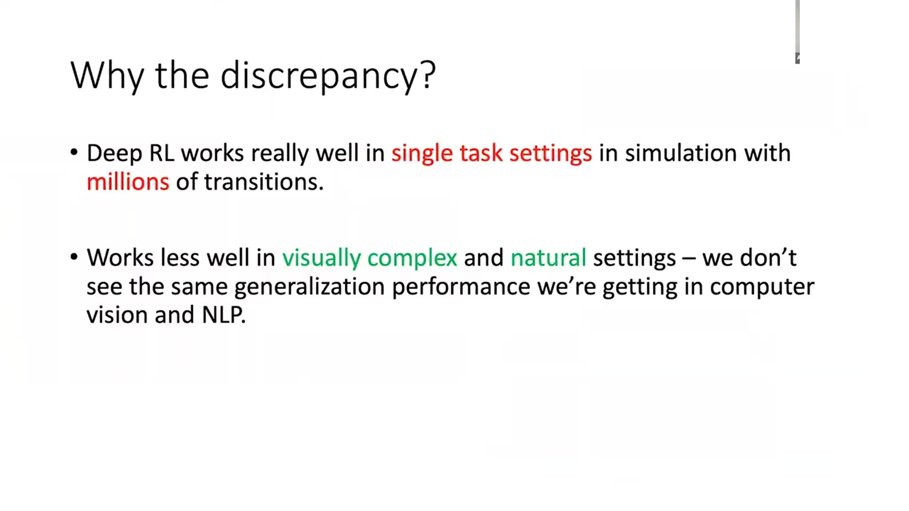

Amy Zhang 对 deep RL 的判断很直接：deep RL 已经在很多单任务、仿真、数据量充足的设置里取得成功，但这并不等于它已经解决了真实环境中的智能问题。

线性地说，问题有三层。

第一层，很多成功是在 single-task setting 里得到的。环境固定，奖励固定，初始分布固定，训练和测试差异很小。agent 可以通过大量试错把这一个环境拟合得很好。

第二层，真实世界不是单任务。机器人、自动驾驶、城市系统、医疗决策这些问题里，观测会变，目标会变，动力学会变，干扰因素会变。训练环境里的好策略，不一定能迁移到新的环境。

第三层，普通深度网络容易把所有可见变化都编码进去。它可能同时记住任务相关因素和任务无关因素。比如背景纹理、光照、摄像机角度、视觉 distractor 都可能进入表示。这样一来，表示看起来很丰富，但对决策来说并不干净。

所以她真正追问的是：如果我们希望 RL agent 泛化，表示空间不能只是“压缩观测”，而必须压缩到那些对 reward、transition 和 policy 真的相关的变量上。

## 2. 她的主线：用抽象结构约束表示学习

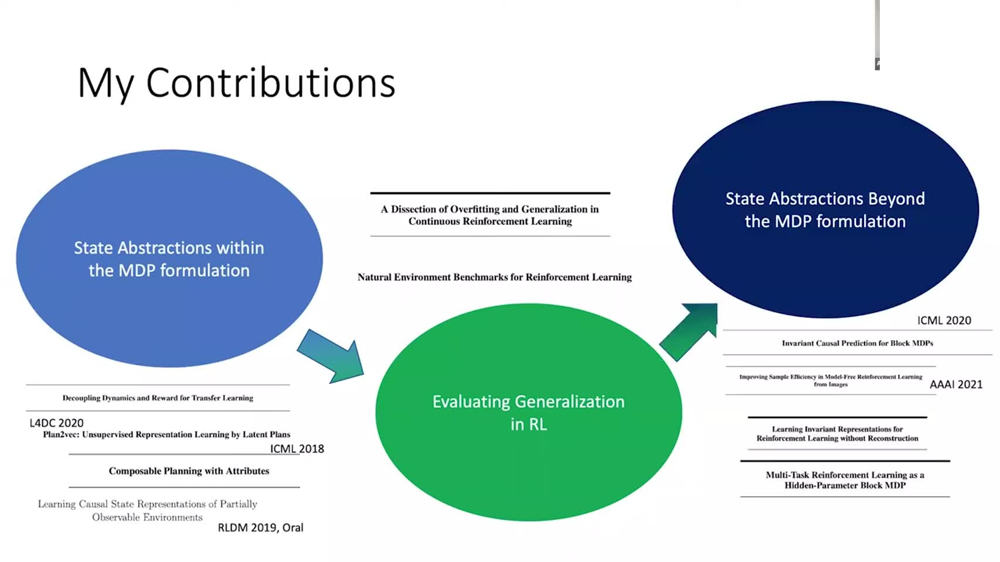

这张图基本概括了她的研究路线。

左边是 **state abstractions within the MDP formulation**。这里的 MDP 是 Markov Decision Process，中文常译为马尔可夫决策过程。它是 RL 最基本的环境模型：agent 处在某个 state，选择一个 action，环境根据 transition rule 跳到下一个 state，同时给出 reward。这个过程不断重复，agent 的目标是在长期上获得更高 return。

MDP 的关键假设是 Markov property：下一步会发生什么，只需要看当前 state 和当前 action，不需要把完整历史都记住。也就是说，如果当前 state 已经把决策所需的信息概括完整，那么过去轨迹怎样到达这里，对下一步 transition 和 reward 就不再额外重要。

在这个框架下，state abstraction 问的是：在同一个 MDP 内部，哪些原始状态可以被视为“等价”？这里的等价不是视觉相似，也不是像素相似，而是 decision equivalence。也就是说，如果两个状态虽然观测图像不同，但对每个 action 都给出相同的 immediate reward，并且会通向相同类型的未来状态，那么对决策来说，它们没有必要被分开。

更具体地说，假设两个状态 $s_1$ 和 $s_2$ 看起来不同。我们逐个动作检查：

```text
take action a in s_1
    -> reward?
    -> next-state distribution?

take action a in s_2
    -> reward?
    -> next-state distribution?
```

如果对所有动作 $a$，这两组结果都一样，或者在抽象后的状态空间里等价，那么 $s_1$ 和 $s_2$ 对 policy 的意义就是一样的。一个最优 agent 不需要知道它到底在 $s_1$ 还是 $s_2$，因为不管选择哪个 action，回报和未来后果都不会改变。

所以 “within the MDP formulation” 的意思是：先把决策问题本身固定住。

第一，环境固定。例如同一个 maze、同一个机器人、同一个控制频率、同一套可选动作。agent 面对的不是一批不同任务，而是同一个任务环境。

第二，reward function 固定。例如目标始终是走到同一个出口，撞墙始终有惩罚，到达出口始终有奖励。也就是说，什么叫“好”、什么叫“坏”在这个 MDP 里不变。

第三，transition dynamics 固定。例如机器人向左走以后会怎样移动、撞到墙会怎样反弹、地面摩擦如何影响速度，这些状态转移规则不变。也就是说，同一个 state-action pair 在统计上会产生同一种 next-state distribution。

在这三个东西固定以后，state abstraction 才开始问：原始观测里哪些差异其实不影响决策？比如两个画面一个亮一点、一个暗一点，或者背景纹理不同，但机器人位置、速度、目标位置、墙的位置都一样。对 agent 来说，这两个观测虽然像素不同，但采取每个动作后的 reward 和未来转移都一样。那它们就应该被压到同一个抽象状态里。

反过来，如果两个画面看起来很像，但一个状态里门是开的，另一个状态里门是关的，那么它们不能被压到一起。因为同样执行“向前走”，一个会通过门，一个会撞上障碍；它们的 future consequences 不同，对最优 policy 的影响也不同。

因此，这里的压缩标准不是：

```text
Can I reconstruct the original pixels?
```

而是：

```text
Do I keep all information needed to choose the optimal action?
```

这就是 fixed-MDP 内部的 state abstraction。它的目标是在一个固定 reward 和固定 dynamics 的决策问题里，丢掉视觉噪声、背景纹理、光照等 decision-irrelevant variation，同时保留位置、速度、障碍、目标、可达性等 decision-relevant variables。后面 “beyond the MDP formulation” 才进一步讨论：如果 reward 或 dynamics 本身也会跨任务变化，抽象应该怎样改变。

中间是 **evaluating generalization in RL**。这条线问的是：RL 的泛化不能只看训练回报，也不能只看同分布测试。需要构造能暴露过拟合和环境变化的 benchmark。

右边是 **state abstractions beyond the MDP formulation**。这条线进一步问：如果任务不是一个固定 MDP，而是一族 MDP 呢？如果不同任务共享某些结构，但又有不同 dynamics 或 reward 呢？这就进入 hidden-parameter MDP、contextual MDP、OOD generalization 等设置。

所以她的核心不是“representation learning for RL”这个泛泛标签，而是更具体的一句话：

> 为了让 RL 泛化，我们需要学到 decision-relevant abstraction。

这里的 decision-relevant 很重要。表示不是越保真越好，而是要保留对最优决策有影响的信息。

## 3. State abstraction：什么时候两个状态可以算“一样”

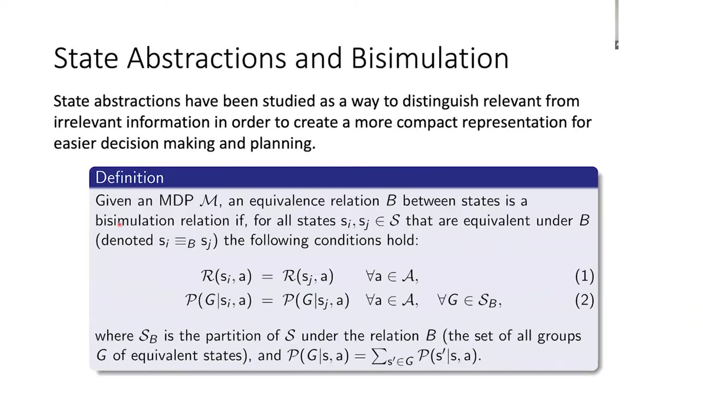

先从一个普通 MDP 开始：

$$
\mathcal M = (\mathcal S,\mathcal A,P,R,\gamma).
$$

这里 $\mathcal S$ 是状态空间，$\mathcal A$ 是动作空间，$P$ 是转移概率，$R$ 是奖励函数，$\gamma$ 是折扣因子。

如果只从像素或观测距离出发，两个状态是否相似很难判断。两张图片可能很像，但对应的行动后果完全不同；两张图片可能很不一样，但对决策来说完全等价。

因此 state abstraction 不是问：

> 两个观测在外观上是否相似？

而是问：

> 两个状态在决策后果上是否相似？

Bisimulation 给了一个严格版本。两个状态 $s_i$ 和 $s_j$ 如果在抽象关系 $B$ 下等价，那么它们至少要满足两件事。

第一，对任意动作 $a$，即时奖励相同：

$$
R(s_i,a)=R(s_j,a).
$$

第二，对任意动作 $a$，它们转移到每个抽象状态组 $G$ 的概率相同：

$$
P(G\mid s_i,a)=P(G\mid s_j,a).
$$

这句话的意思是：我们不要求两个状态转移到完全同一个具体像素状态，但要求它们转移到同一类“抽象后果”的概率一样。

这样一来，抽象不是任意压缩，而是有决策语义的压缩。被合并的状态应该拥有相同的 reward profile 和 transition profile。它们可以在视觉上不同，但在控制问题里等价。

## 4. Bisimulation metric：从硬等价变成可学习距离

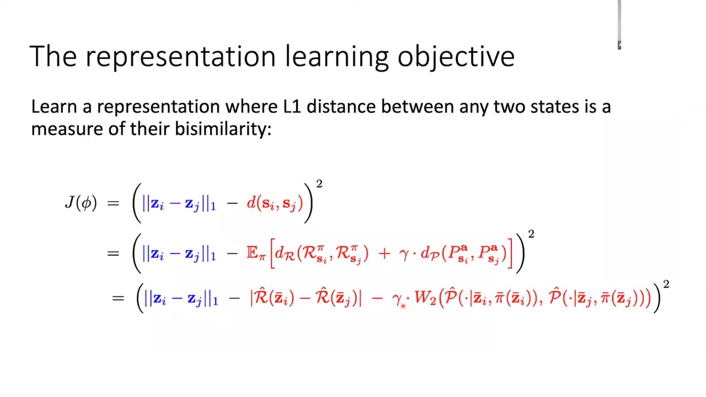

严格的 bisimulation relation 太硬。真实深度 RL 里，状态通常是连续的、高维的、带噪声的，不可能只做离散等价类划分。因此下一步自然是把“等价”放松成“距离”。

线性地说，目标从：

$$
s_i \equiv_B s_j
$$

变成：

$$
d_{\mathrm{bisim}}(s_i,s_j) \text{ 有多小？}
$$

这个距离不是普通欧氏距离。它要同时考虑两类差异。

第一类是 reward difference。两个状态在同一个动作下得到的即时奖励差别越大，它们就越不应该被认为相似。

第二类是 transition difference。两个状态在同一个动作后进入未来状态分布的方式越不同，它们也越不应该被认为相似。

于是 representation learning 的目标可以理解成：

$$
\|\phi(s_i)-\phi(s_j)\| \approx d_{\mathrm{bisim}}(s_i,s_j).
$$

这里 $\phi(s)$ 是神经网络学到的状态表示。更线性地看，训练目标在做三步对齐。

第一步，网络先把高维状态 $s_i,s_j$ 映射成 latent 表示 $\phi(s_i),\phi(s_j)$。

第二步，在 latent space 里计算两点之间的距离。这个距离是模型当前认为的“两个状态有多不一样”。

第三步，把这个 latent distance 拉向 bisimulation distance。也就是说，如果两个状态的 reward 很接近、后续转移分布也很接近，模型就应该把它们放近；如果它们导致完全不同的奖励或未来，模型就应该把它们放远。

因此这个目标不是让表示重构原始观测，而是让表示空间的距离反映决策相关距离。

这一步很关键。普通 autoencoder 会倾向于保留所有能重构图像的因素，包括背景、纹理、颜色、摄像机视角。Bisimulation-style representation 则要求模型只保留影响 reward 和 future transition 的因素。也就是说，它把“什么值得记住”这个问题交给控制结构来定义。

## 5. 从一个 MDP 到一族 MDP：context 不是附加变量，而是任务结构

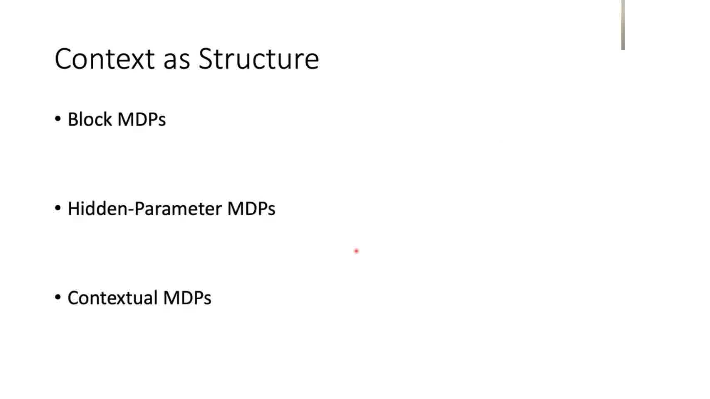

如果环境固定，state abstraction 已经很有用。但泛化问题通常不是“同一个 MDP 里的状态变化”，而是“训练和测试来自不同但相关的 MDP”。

这时就需要 context。这里的 context 不是“额外输入一个标签”这么简单，而是在说明：任务之间的差异本身也有结构。只要这个结构能被表示出来，agent 就可以判断当前任务和过去哪些任务相近、哪些经验可以迁移、哪些策略需要调整。

在这组 talk 里，context 可以按三层理解。

第一层，Block MDP。观测很复杂，但背后有一个较低维的 latent state。视觉上看到的是高维图像，真正决定转移和奖励的是隐藏状态。比如不同图片可能有不同背景、纹理和摄像机角度，但它们背后对应的物体位置、速度和接触关系才是控制相关变量。Block MDP 的作用，就是把“高维观测”和“低维控制状态”区分开。

第二层，Hidden-Parameter MDP。不同任务共享同一种结构，但由某个隐藏参数控制。例如机器人质量、摩擦系数、目标位置、动力学参数不同。每个任务是一个 MDP，隐藏参数决定具体是哪一个。这里的关键不是“任务很多”，而是“任务之间的变化可以用少数隐藏参数解释”。如果模型能推断这个隐藏参数，就能知道当前环境应该怎样调整策略。

第三层，Contextual MDP。不同任务由 context $c$ 索引：

$$
\mathcal M_c = (\mathcal S,\mathcal A,P_c,R_c,\gamma).
$$

也就是说，context 不是普通输入特征，而是用来组织任务族的变量。它告诉 agent 当前面对的是哪一种环境、哪一种动力学、哪一种奖励结构。Block MDP 解决“观测里哪些东西是真状态”，Hidden-Parameter MDP 解决“当前任务由哪个隐藏参数控制”，Contextual MDP 则把这些任务放进一个统一的任务族里讨论泛化。

## 6. HiP-BMDP：把隐藏上下文、状态表示和动力学一起学

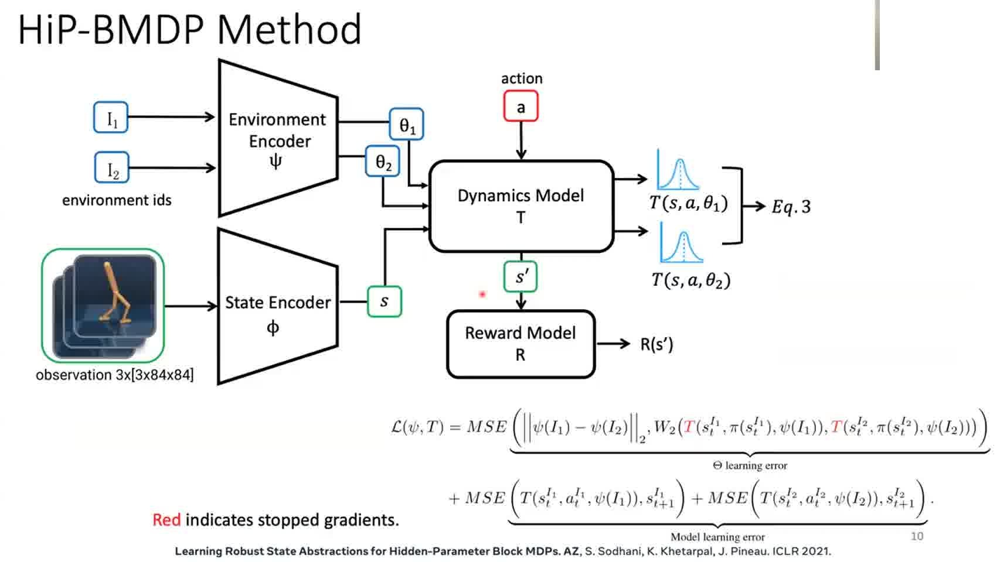

HiP-BMDP 的直觉是：如果任务之间确实共享结构，那么我们不应该为每个任务都重新学一套完全独立的模型。

线性地说，它把问题拆成几层。

第一层是 observation encoder。高维观测先被压到抽象状态表示。这个表示应该捕捉与控制相关的状态，而不是保留所有视觉细节。

第二层是 environment encoder。模型需要从交互经验中推断当前环境的隐藏参数或上下文。这个上下文解释了为什么同样的动作在不同任务里会产生不同后果。

第三层是 dynamics model 和 reward model。给定状态表示、动作和上下文，模型预测下一步状态和奖励。

因此 HiP-BMDP 不是在做最普通意义上的 domain adaptation。普通 domain adaptation 常见的目标是：训练域和测试域分布不同，所以要学一个更稳定的 representation，让 source domain 学到的东西能迁移到 target domain。这个思路通常把差异当成需要被消除或对齐的 nuisance variation。

HiP-BMDP 的问题设定更进一步。它不是只问“怎样让不同 domain 的表示更接近”，而是问：任务之间到底哪一部分应该相同，哪一部分允许不同？如果所有任务都共享某些控制相关状态，那么这些不变部分应该进入公共 state representation。如果不同任务的摩擦、质量、目标位置或转移规律不同，那么这些可变部分不应该被压进同一个黑盒 state，而应该由 context 单独解释。

所以这里的建模动作是一次结构分解：

```text
observation
→ shared abstract state
→ action plus task context
→ task-specific transition and reward prediction
```

这条链条的含义是：公共表示负责承载任务族里稳定的东西，context 负责承载任务之间变化的东西。这样模型在预测 dynamics 或 reward 时，不是只看一个混合后的 embedding，而是明确知道“这是当前状态”“这是当前动作”“这是当前任务的差异来源”。

这对 OOD generalization 很关键。测试任务如果不是训练任务的简单重复，模型不能只记住训练任务里的表面模式。它至少需要知道变化发生在哪个层次：是观测外观变了，还是隐藏物理参数变了，还是奖励目标变了。只有变化的位置被显式分离出来，模型才有可能把训练任务中学到的共享规律带到新任务里，再用新的 context 调整具体行为。

反过来说，如果所有变化都被混进一个黑盒 embedding，模型也许能在训练任务上拟合得很好，但我们很难知道它到底学到了共享结构，还是只记住了训练域的相关性。遇到 OOD task 时，这种 embedding 缺少可解释的调节旋钮：它不知道该保持哪些规律不变，也不知道该在哪里做 task-specific adjustment。HiP-BMDP 想解决的正是这个问题。

## 7. Contextual MDP：OOD 泛化要利用任务之间的共享结构

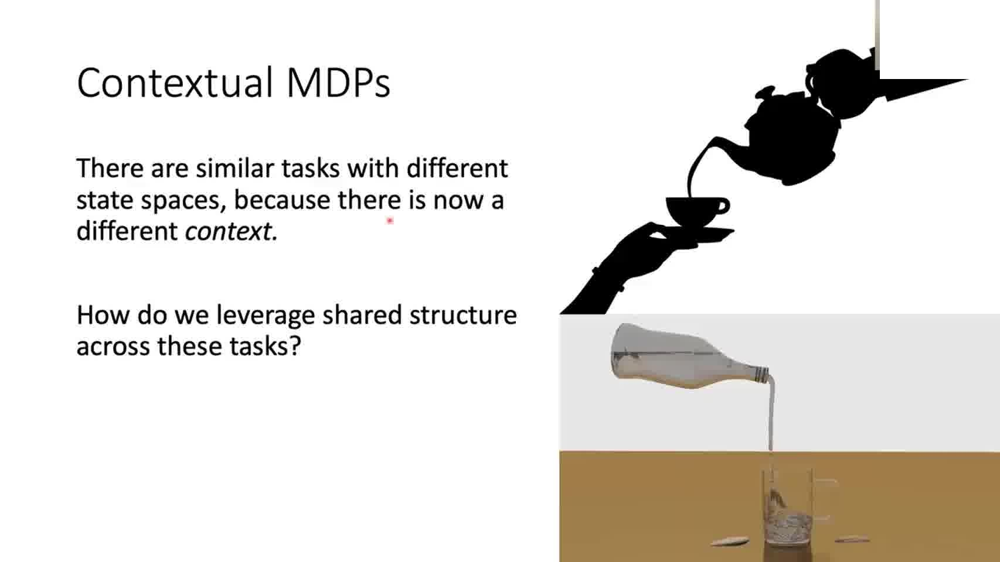

Contextual MDP 进一步把问题说清楚：我们面对的不是一堆完全无关的任务，而是一组有共享结构的任务。

如果任务之间没有任何共享结构，泛化就没有根据。你在一个 MDP 里学到的策略、表示或 dynamics，对另一个 MDP 没有理由有效。

但如果任务之间共享状态空间、动作空间、局部几何或动力学规律，只是在某些 context 上发生变化，那么 agent 就可以利用这些共享结构。

因此这里的 OOD generalization 不是神秘能力，而是一个结构性假设：

> 训练任务和测试任务虽然不同，但它们被同一个任务族生成，并且这个任务族内部存在可学习的连续性或组合性。

这句话也解释了为什么她特别关注 context representation。因为 context representation 的作用就是把任务差异放进一个可学习、可比较、可外推的空间里。

## 8. Generalization bound：为什么 context 的连续性有意义

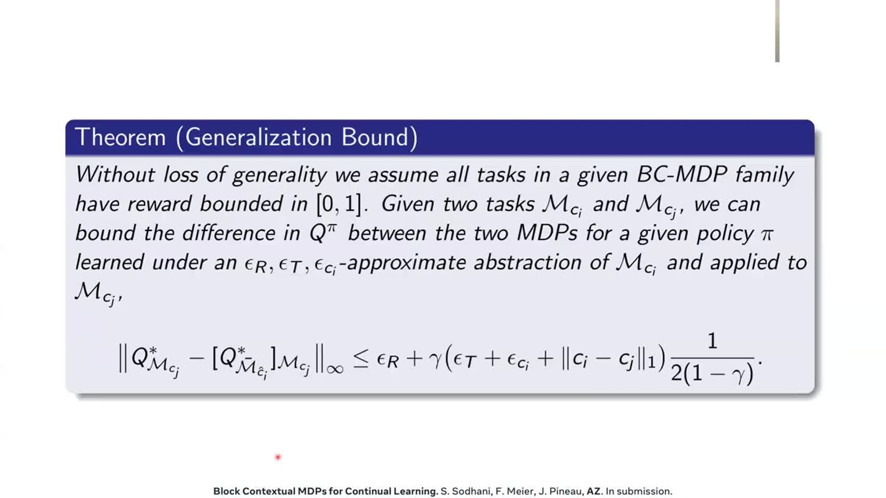

这张 slide 的核心不是要我们记住某个常数项，而是要说明：OOD generalization 什么时候可以被理论上控制。答案不是“模型足够大就会泛化”，而是任务族本身必须有结构，并且这个结构要能被 context representation 表达出来。

先看 theorem 的对象。作者假设我们面对的是一个 BC-MDP family，也就是一组由 context 索引的任务。每个任务写成 $\mathcal M_{c_i}$ 或 $\mathcal M_{c_j}$。这里 $c_i$ 和 $c_j$ 不是普通样本特征，而是任务级变量：它可以表示不同摩擦系数、不同机器人参数、不同目标位置、不同地图布局，或者其他会改变 dynamics/reward 的环境因素。

然后 theorem 比较两个任务。一个是训练或源任务 $\mathcal M_{c_i}$，另一个是测试或目标任务 $\mathcal M_{c_j}$。模型在 $\mathcal M_{c_i}$ 上学习到一个近似抽象模型 $\hat{\mathcal M}_{c_i}$，再把这个学到的东西用于 $\mathcal M_{c_j}$。问题是：这样迁移过去后，value 或 $Q$ function 会差多少？

slide 上的 bound 可以按下面的方式读：

$$
\left\|
Q^*_{\mathcal M_{c_j}}
-
\left[Q^*_{\hat{\mathcal M}_{c_i}}\right]_{\mathcal M_{c_j}}
\right\|_\infty
\le
\epsilon_R
+
\frac{\gamma}{2(1-\gamma)}
\left(
\epsilon_T
+
\epsilon_{c_i}
+
\|c_i-c_j\|_1
\right).
$$

左边是目标任务上的 value mismatch。第一项 $Q^*_{\mathcal M_{c_j}}$ 表示：如果我们真的知道目标任务 $\mathcal M_{c_j}$，理论上能得到的最优 $Q$。第二项 $\left[Q^*_{\hat{\mathcal M}_{c_i}}\right]_{\mathcal M_{c_j}}$ 表示：我们用源任务 $\mathcal M_{c_i}$ 上学到的抽象模型来决策，然后把这个决策放到目标任务 $\mathcal M_{c_j}$ 中评估。两者的差，就是“从源任务泛化到目标任务”带来的误差。

右边把这个误差拆成几类来源。

第一，$\epsilon_R$ 是 reward abstraction error。它表示抽象状态或表示没有完全保留 reward 相关信息。如果抽象后连奖励都预测不准，那么迁移到新任务时自然会出错。

第二，$\epsilon_T$ 是 transition abstraction error。它表示抽象模型没有完全保留 transition dynamics。如果同一个抽象状态和动作在真实环境里会导向不同后果，而模型没有捕捉到这种差异，value 估计也会偏。

第三，$\epsilon_{c_i}$ 是与 source context 相关的近似误差。它提醒我们：即使在训练任务 $\mathcal M_{c_i}$ 上，context 或任务参数也可能没有被完美识别。也就是说，泛化误差不只来自 test task，也来自 source task 的表示本身是否准确。

第四，$\|c_i-c_j\|_1$ 是最关键的项。它直接度量 source context 和 target context 在 context space 里的距离。如果 $c_i$ 和 $c_j$ 很近，theorem 允许我们说：这两个任务应该相似，迁移误差可以较小。如果 $c_i$ 和 $c_j$ 很远，那么即使训练任务拟合得很好，也不能指望它无成本迁移到测试任务。

前面的系数 $\frac{\gamma}{2(1-\gamma)}$ 表示误差会被时间尺度放大。$\gamma$ 越接近 $1$，agent 越重视长远未来；这时一个小的 transition 或 context 误差会沿着多步 rollout 累积，因此 bound 会变松。reward 被假设 bounded in $[0,1]$，是为了把 value scale 固定住，否则误差大小没有统一尺度。

所以 bound 的直觉可以简化成：

$$
\text{test error}
\;\lesssim\;
\text{training error}
+ \text{context mismatch}
+ \text{model/estimation error}.
$$

这时就能看出 context geometry 的作用。bound 里真正把 train task 和 test task 接起来的是 $\|c_i-c_j\|_1$。如果 context 只是“任务 1、任务 2、任务 3”这种离散 ID，那么 $\|c_i-c_j\|_1$ 没有实际含义，模型也不知道哪个任务更接近哪个任务。这样的 context 只能记忆任务，不能支持外推。

真正有用的 context representation 必须带有几何结构。距离近的 context 应该对应相似的 dynamics、reward 或 value function；距离远的 context 则允许对应更大的任务差异。只有这样，bound 中的 context mismatch 才能变成一个可解释、可控制的泛化项。

这也解释了为什么她的工作反复把泛化问题写成 representation problem。泛化不是最后评估时才突然发生的能力，而是在表示空间构造时就已经被决定了：如果 context space 没有把任务相似性组织出来，后面的 policy learning 就没有可靠的外推基础。

## 9. Hierarchy：长程任务需要不同时间尺度的表示

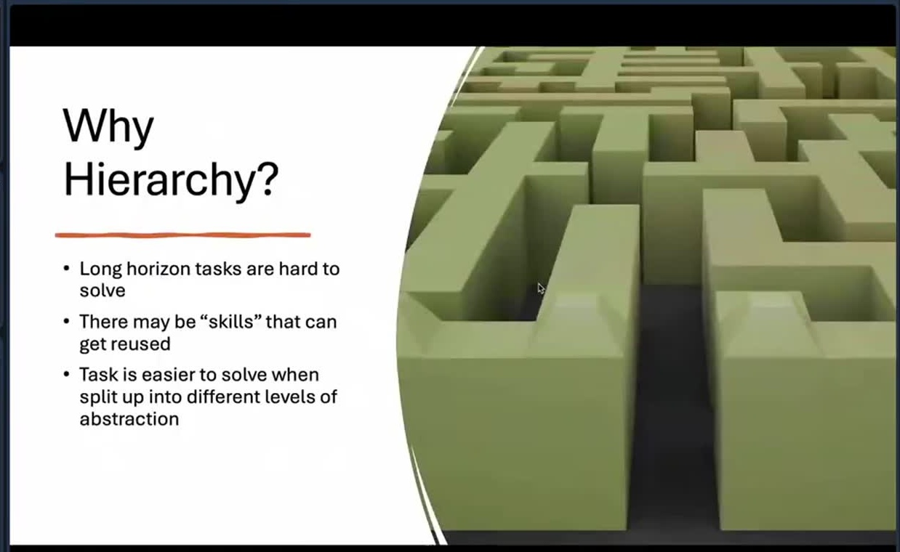

前面讨论的是状态和任务之间的抽象。进入 hierarchical RL 后，问题换成时间尺度。

长程任务难，是因为低层动作和最终结果之间隔了很多步。一个动作现在看起来没有 reward，但它可能是几十步以后成功的必要准备。只在 primitive action 层面搜索，组合空间会非常大。

Hierarchy 的基本想法是：不要让高层策略直接控制每一个低层动作，而是让它选择更粗的行为单元。

可以写成：

$$
z_t \sim \pi_{\mathrm{high}}(z\mid s_t),
$$

$$
a_t \sim \pi_{\mathrm{low}}(a\mid s_t,z_t).
$$

这里 $z_t$ 可以是 option、skill、subgoal 或 attribute transition。高层决定“接下来要完成什么子目标”，低层负责“怎样执行具体动作”。

这不是单纯为了让模型更复杂，而是为了把 long-horizon problem 拆成多个 shorter-horizon problem。高层处理规划，低层处理控制。

## 10. Skill hierarchy：行为应该是模块化和可组合的

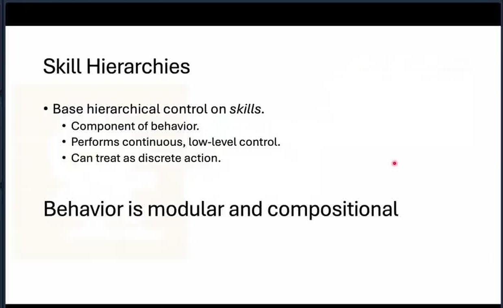

Skill hierarchy 的核心判断是：复杂行为通常不是不可分割的一整段 policy，而是由可复用模块组合出来的。

线性地说，一个好的 skill 至少要满足三件事。

第一，它应该有相对稳定的效果。如果调用一个 skill，结果每次都完全随机，高层就无法规划。

第二，它应该能在不同任务中复用。比如“移动到门口”“抓住物体”“把方块放到另一块上面”这些技能，在很多任务中都可能有用。

第三，它应该能组合。单个 skill 本身不一定解决完整任务，但多个 skill 的组合可以完成更长程目标。

所以 hierarchy 和 abstraction 是同一个问题的两个侧面。State abstraction 是在状态空间里找等价结构，skill hierarchy 是在行为空间和时间轴上找可复用结构。

## 11. Goal-conditioned RL：把目标变成策略的条件变量

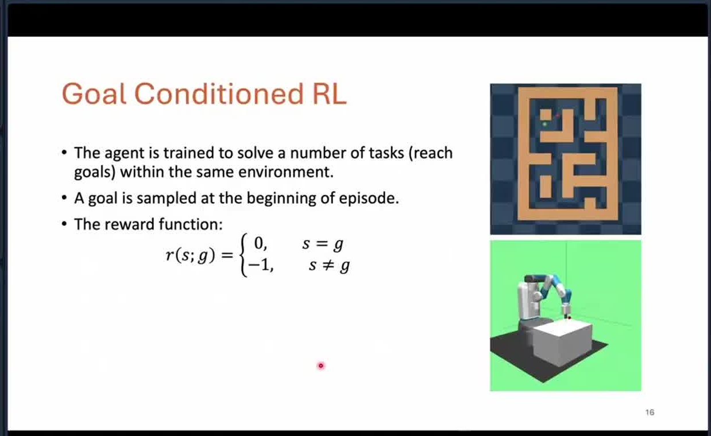

Goal-conditioned RL 是 hierarchical RL 里常见的接口。策略不再只写成：

$$
\pi(a\mid s),
$$

而是写成：

$$
\pi(a\mid s,g).
$$

这里 $g$ 是目标状态或目标描述。agent 的任务不是最大化一个固定 reward，而是在给定目标 $g$ 后尽快达到它。

最简单的 reward 可以写成：

$$
r(s,g)=
\begin{cases}
1, & s=g,\\
0, & s\ne g.
\end{cases}
$$

但真正的问题不是这个公式，而是目标空间太大。如果每个目标都要重新训练一个策略，泛化仍然很差。模型需要学到一个可泛化的 goal representation，知道哪些目标近、哪些目标远、哪些目标可以通过同一个子技能到达。

这就把 goal-conditioned RL 又拉回到了 representation learning。目标不是一个孤立标签，而是状态空间或属性空间中的一个点。

## 12. Attribute planner：用属性图组织可组合规划

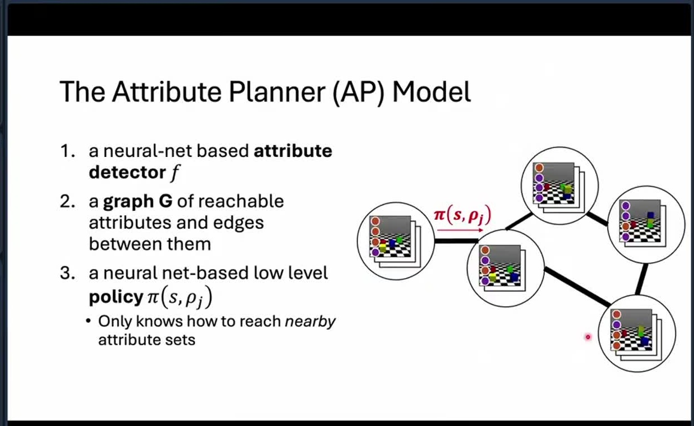

Attribute planner 进一步把状态抽象成一组属性。

例如在 block stacking 里，原始状态可以是像素图像或物体坐标，但高层规划更关心的是：

1. 红块是否在蓝块上面。
2. 绿块是否在红块旁边。
3. 某个堆叠关系是否已经成立。

这些属性构成一个抽象状态。Attribute planner 做三件事。

第一，训练 attribute detector，把原始状态映射到属性集合。

第二，构造属性图，图上的边表示从一个属性集合转移到另一个属性集合是否可达。

第三，训练低层策略，只负责实现相邻属性之间的局部转移。

这样一来，高层规划就不必在原始状态空间里搜索，而是在属性图上搜索。低层控制也不必理解完整任务，只需要学会“从当前属性变到下一个属性”。

## 13. Hierarchy 的关键开放问题：属性从哪里来

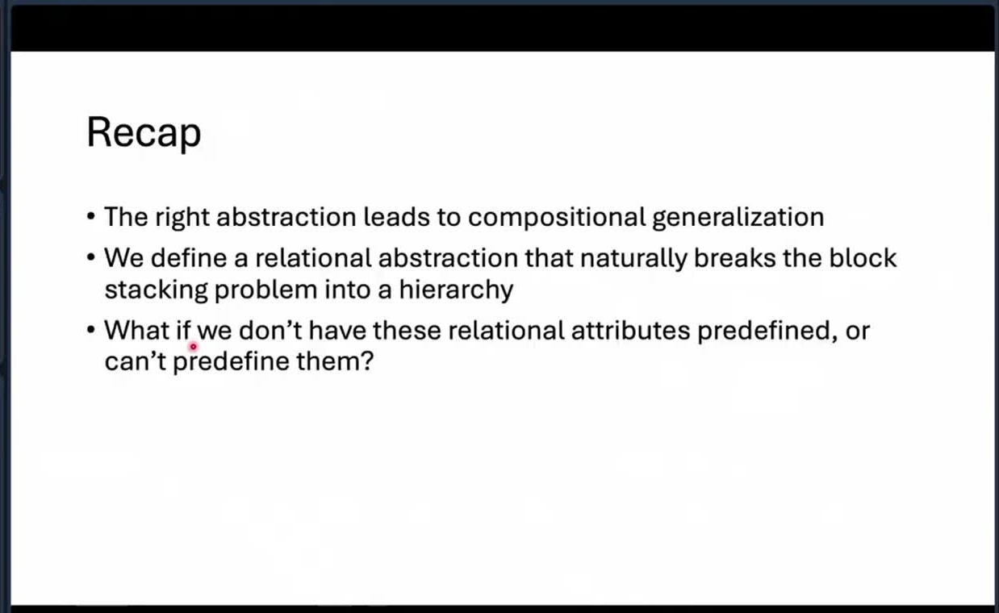

这张 recap 其实指出了 hierarchy 的核心难点。

如果我们已经有正确的 relational attributes，那么问题会简单很多。比如已经知道“红块在蓝块上”“门已打开”“钥匙已拿到”这些属性，高层规划可以很自然地组合它们。

但真实问题里，属性往往不是预先给好的。模型需要从数据中发现哪些抽象变量适合作为高层规划单位。

因此 hierarchy 的难点不只是“怎么训练 high-level policy”，而是：

> 什么样的抽象，既能被低层可靠实现，又能被高层组合规划？

这和前面的 state abstraction 完全接上了。一个好的抽象不是视觉上好看，而是要同时满足可检测、可控制、可组合。

## 14. Generative models as world models：生成模型和 RL 的接口

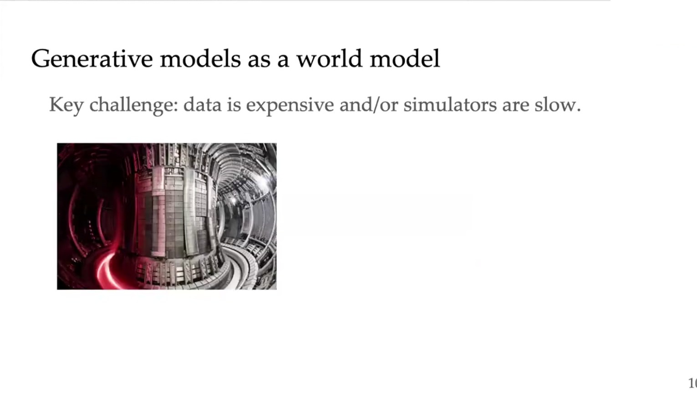

在 2025 bootcamp talk 里，她把讨论推进到 generative models 和 RL 的关系。

先从 world model 开始。这里的 world model 要按宽义理解：它不只是预测下一帧图像，也是在模拟“如果 agent 采取某个动作，环境会产生什么后果”。最基本的形式可以写成：

$$
\hat p(s_{t+1}\mid s_t,a_t).
$$

如果 world model 足够好，agent 可以在模型里试错，而不是每次都和真实环境交互。slide 里强调的 key challenge 是：真实数据很贵，真实模拟器也可能很慢。因此生成模型的价值不是“生成好看的样本”，而是提供一个可查询、可 rollout、可评估策略的近似环境。这个想法和 David Ha 的 World Models、模型式 RL、simulation-based planning 都有联系。

但 Amy Zhang 这里的重点不是传统“先学 dynamics，再做 planning”的套路，而是更进一步地问：

> RL 本身能不能被理解成一种 generative modeling？

这个问题会把 RL、goal-reaching、diffusion policy 和 generative AI 接起来。

## 15. Interactive generative model：policy 诱导的是轨迹分布

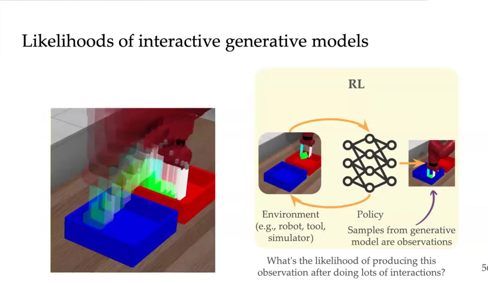

普通生成模型通常从噪声或条件变量出发，生成一个样本：

$$
x \sim p_\theta(x).
$$

RL 不一样。策略不是一次性吐出一个静态样本，而是在环境中反复交互：

$$
a_t \sim \pi_\theta(a_t\mid s_t),
$$

$$
s_{t+1}\sim P(s_{t+1}\mid s_t,a_t).
$$

因此策略和环境共同诱导出一条轨迹分布：

$$
\tau=(s_0,a_0,s_1,a_1,\dots),
$$

$$
p_\pi(\tau).
$$

这就是 interactive generative model 的意思。RL policy 可以看成一个生成过程，但它生成的不是一张图，而是一段和环境耦合的行为轨迹。

这里比普通生成模型多了一层闭环。普通生成模型的输出不会反过来改变数据分布；但 RL 里动作会改变环境状态，新的状态又会影响下一步动作。因此 likelihood 不是一次性样本的概率，而是整条 interaction trace 的概率。

这一步也能解释为什么 goal-reaching 和 likelihood 会联系起来。如果我们关心某个 goal state $g$，就可以问：

$$
p_\pi(s_T=g\mid s_0)
$$

有多大。训练策略就可以被理解成提高目标状态在未来轨迹分布中的 likelihood。

## 16. RL as generative AI：从样本生成到结果生成

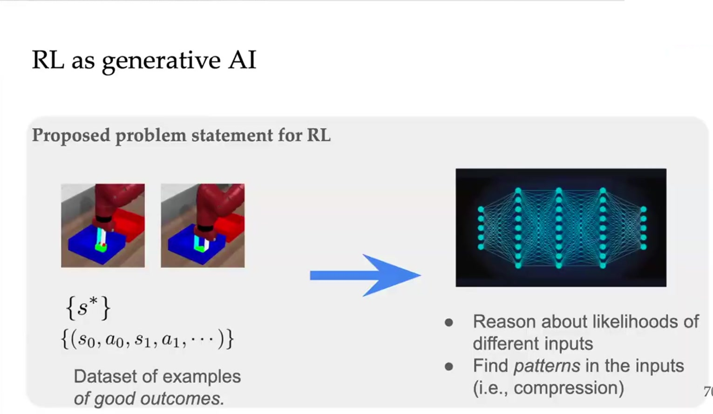

这张图把 RL 问题重新表述成一个生成问题。左边不是普通图片或文本样本，而是一组 good outcome examples。图里给了两种形式：一种是目标状态集合 $\{s^*\}$，另一种是交互轨迹集合 $\{(s_0,a_0,s_1,a_1,\cdots)\}$。也就是说，示例可以只告诉我们“最后应该到达什么状态”，也可以告诉我们“一条成功行为序列大概长什么样”。

普通 generative AI 的对象是静态样本。给定数据集 $\{x\}$，模型学习数据分布：

$$
x \sim p_{\mathrm{data}}(x).
$$

训练完成后，模型直接生成新的 $x$。如果是图像模型，$x$ 是图像；如果是语言模型，$x$ 是文本序列。关键点是：生成对象本身就是模型输出。

RL as generative AI 的对象不一样。agent 不能直接把 outcome 打印出来。它只能在环境中采取动作，动作经过环境 dynamics 以后形成轨迹：

$$
\tau = (s_0,a_0,s_1,a_1,\cdots).
$$

然后我们再从轨迹里读出 outcome：

$$
o = o(\tau).
$$

所以 generative RL 的目标更准确地说是：学习一个 policy $\pi$，让它诱导出的 trajectory distribution $p_\pi(\tau)$，经过 outcome map $o(\tau)$ 以后，产生接近目标分布的 outcome：

$$
o(\tau),\quad \tau\sim p_\pi(\tau),
\qquad
o(\tau)\sim p_{\mathrm{target}}(o).
$$

这里 $o(\tau)$ 可以是最终状态、轨迹摘要、任务完成结果，或者某种可观测行为模式。比如机器人插孔任务里，outcome 可以是“peg 最终插进 hole”；导航任务里，outcome 可以是“到达某个区域”；技能学习里，outcome 可以是“产生某种可区分的运动模式”。

这一步把 RL 的问题从“最大化一个手写 reward”改写成“生成一类想要的 outcomes”。如果我们有一组成功 outcome examples，就可以问：当前 policy 生成这些 outcomes 的 likelihood 有多高？哪些 actions 会让目标 outcome 更可能出现？训练 policy 就变成了提高目标 outcome 在交互轨迹分布中的概率。

这也解释了图右边的两句话。第一，模型需要 reason about likelihoods of different inputs。也就是说，它要判断哪些状态、动作、轨迹或 outcome 在当前 policy 和环境下更可能出现。第二，模型要 find patterns in the inputs，也就是压缩 good outcomes 之间的共同结构。不是每条成功轨迹都要死记硬背；模型应该学到“哪些状态差异不重要”“哪些中间结构反复出现”“哪些动作序列能稳定导致成功”。

这和 Ben Eysenbach 的 self-supervised RL 很接近。Eysenbach 的 C-learning / contrastive RL 把 goal-reaching 写成未来状态分类或 density ratio estimation：给定当前状态和动作，判断某个 goal $g$ 成为未来状态的相对可能性。因此他的核心对象是 future-state likelihood 或 goal-conditioned value：

$$
\text{How likely is goal } g \text{ under the future state distribution?}
$$

Amy Zhang 这里把这个 likelihood 视角再往外推一层。她关心的不只是某个 goal state 能不能被 reach，而是能不能把整个交互过程理解成 outcome generation：policy 生成 trajectory，trajectory 产生 outcome，outcome distribution 要匹配 examples of good outcomes。

二者的差异可以这样理解。

Eysenbach 更强调从 agent 自己的 experience 中学习 future-state likelihood、goal-conditioned value 和 self-supervised skill。重点是：在没有人工 reward 的情况下，如何利用时间结构本身构造训练信号。

Amy Zhang 更强调这些 likelihood 和 representation 应该如何组织，才能支持更大的泛化问题。她前面讲 abstraction、context 和 hierarchy，都是在回答同一个问题：如果 outcome generation 要跨任务、跨环境、跨长程组合泛化，agent 不能只记住轨迹样本，而要知道哪些结构可复用，哪些差异由 context 控制，哪些长程目标需要 hierarchy 来分解。

## 17. Generalization 是 GenAI + RL 的下一层问题

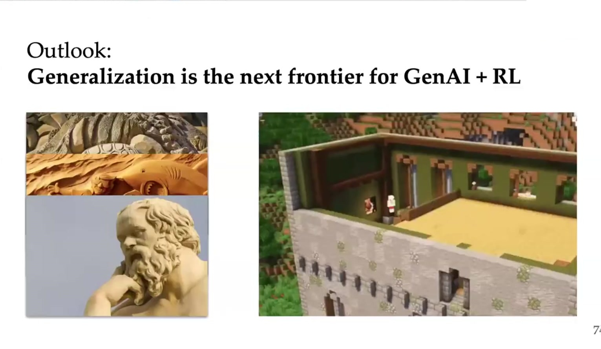

最后的 outlook 很清楚：如果 generative AI 和 RL 要结合，下一步关键不是只让模型在一个环境里生成动作，而是让它能够泛化。

这里的泛化至少有三种。

第一，状态泛化。视觉变化、背景变化、观测噪声不应该破坏决策。

第二，任务泛化。目标、奖励、动力学参数变化时，agent 应该利用共享结构迁移。

第三，组合泛化。训练时见过的技能、属性或子目标，应该能在测试时组合成新的长程任务。

这三种泛化分别对应她的三条技术线：

1. State abstraction 和 bisimulation 处理状态泛化。
2. Contextual MDP 和 hidden-parameter MDP 处理任务泛化。
3. Hierarchical RL 和 attribute planning 处理组合泛化。

## 18. 和我们之前读过的几条线怎么接

这组材料可以放在我们已有阅读框架里的“RL representation / amortized inverse problem / generative dynamics”交叉位置。

和 Eysenbach 相比，Amy Zhang 更关注抽象结构。Eysenbach 关心怎样从未来状态预测、contrastive objective 和 likelihood 中得到 value learning。Amy Zhang 关心的是：未来状态预测和 value learning 使用的状态、目标、上下文表示，应该怎样组织，才能泛化到新环境。

和 VI primer 相比，Amy Zhang 不是在做后验推断的变分近似，但她同样面对一个结构问题：高维观测里有很多无关变量，必须找到低维且任务相关的 latent structure。VI primer 里 conditional dependence structure 决定了近似后验怎么写；Amy Zhang 这里 MDP / Contextual MDP / hierarchy structure 决定了 RL 表示怎么学。

和 HJB / HJ-sampler 相比，她不从 PDE 或控制势函数出发，而是从 MDP 抽象出发。HJB 那条线把高维向量控制场压到标量势函数；Amy Zhang 这条线把高维状态、任务和行为压到 decision-relevant abstraction。两者共同点是：都不直接在原始高维对象上硬学，而是寻找一个更结构化的中间对象。

## 19. 对 synthetic city / 城市生成问题的启发

如果把这组思想放回我们的 synthetic city 问题，最重要的不是照搬 RL，而是借用她的分析方式。

我们的问题里有两类观测：condition，比如 census summaries；target，比如 PUMA 或更细粒度的空间分布。两者都不是清晰的物理方程，也没有像 PDE 那样明确的守恒律。因此不能直接套 physics-informed residual。

但这不等于没有结构。可以按 Amy Zhang 的方式问三件事。

第一，什么是 decision-relevant 或 generation-relevant abstraction？在城市问题里，原始变量很多，但不是所有变量都同等重要。可能真正决定 joint distribution 的，是收入、家庭结构、通勤、地理可达性、住房类型等若干潜在结构。

第二，什么是 context？不同城市、不同 PUMA、不同 census condition 可以看成不同 context。模型不应该只把它们当作普通输入，而应该学习一个 context representation，使相似的城市条件在 latent space 中接近。

第三，什么是 compositional structure？城市分布可能不是一个整体模式，而是若干局部结构、群体结构和空间结构的组合。例如不同 demographic group、不同 commuting corridor、不同 neighborhood type，可能对应不同生成机制。

因此，一个更自然的研究表述不是：

> 给定 summaries，恢复一个最可能的 joint distribution。

而是：

> 给定 constraints 和 context，学习一族 plausible joint distributions，并刻画哪些结构由观测强约束，哪些结构仍然存在不确定性。

这和之前讨论的 amortized inverse problem 正好接上。Amy Zhang 提供的不是概率推断公式，而是一套结构化思考方式：先找抽象，再找上下文，再找组合，再谈泛化。

## 20. 后续阅读重点

下一步如果要精读 Amy Zhang 的论文，不应该按年份机械推进，而可以按问题线推进。

第一组：state abstraction 和 bisimulation。重点读 Learning Invariant Representations for Reinforcement Learning without Reconstruction、Deep Bisimulation for Control、Learning Robust State Abstractions for Hidden-Parameter Block MDPs。

第二组：context 和 OOD generalization。重点读 Contextual MDP、Block Contextual MDP、CARE 这条线，理解她怎样把任务变化写成上下文结构。

第三组：hierarchical RL 和 compositional generalization。重点读 Composable Planning with Attributes，以及后续关于 hierarchical representations 的工作。

第四组：RL as generative AI。重点追她最近把 goal-reaching、interactive likelihood、diffusion policy 和 generative models 接起来的方向。

这组材料的核心结论可以压成一句话：

> Amy Zhang 的研究主线，是把 RL 泛化问题从“更强策略网络”改写成“更正确的抽象、上下文和层级结构”问题。
