# Ben Eysenbach：Self-Supervised Reinforcement Learning 主线

- Materials: `youtube/transcripts/*ben-eysenbach*/`
- Curated slides: `youtube/slides/ben-eysenbach-self-supervised-rl-series-curated/`
- Scope: 这篇笔记整合 Ben Eysenbach 的一组 talk，包括 DIAYN、C-Learning、contrastive RL、thesis defense、RLDM 2025 tutorial，以及近期关于 self-supervised agents 的讲座。

这组 talk 的中心问题很集中：如果 reinforcement learning 的目标是让 agent 学会在世界中行动，那么我们能不能减少人类写 reward、写任务、写技能、做 demonstration 的负担？Eysenbach 的回答不是简单地“把 RL 换成 supervised learning”，而是把 RL 改写成一类关于未来的概率学习问题：

$$
\text{current state/action}
\rightarrow
\text{future state distribution}
\rightarrow
\text{goal reachability / value / policy}.
$$

所以这条线可以按一个线性问题展开：

1. RL 为什么难？
2. 如果没有 reward，agent 还能学什么？
3. 学出来的 skill 如何变成下游任务能力？
4. goal-conditioned RL 为什么可以写成未来状态分类？
5. contrastive learning 为什么不只是表征预训练，而是 value learning？
6. 这些方法怎样走向长程规划、泛化和 generative RL？

## 1. RL 的难点不是只有算法，而是反馈结构本身

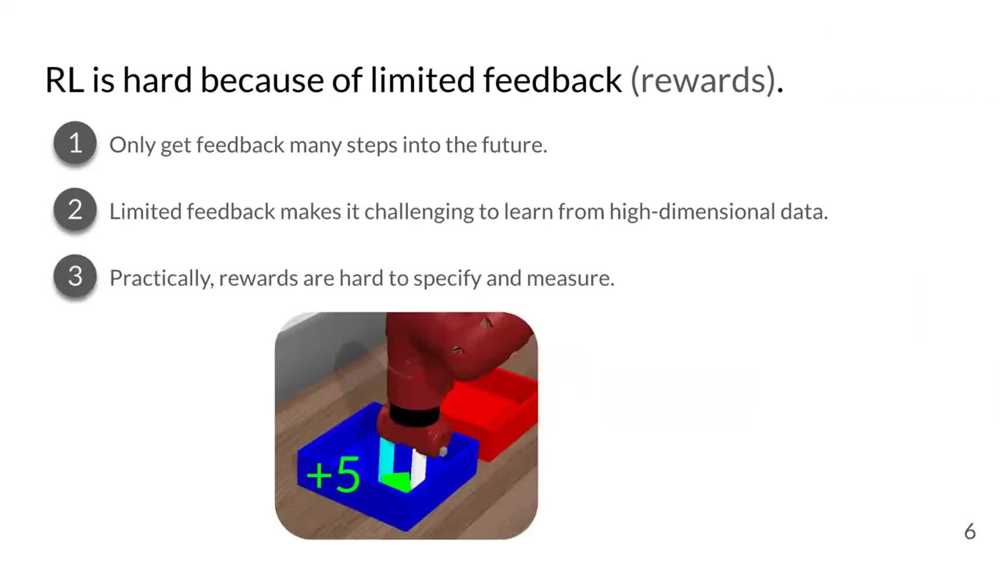

Eysenbach 对 RL 的问题设定不是从某个具体算法开始，而是先指出反馈结构的困难。普通监督学习里，训练样本通常直接告诉模型“这个输入对应什么输出”。RL 不一样。agent 做出一个动作以后，真正有用的反馈往往很晚才出现，而且这个反馈通常非常稀疏。

线性地说，RL 的困难至少有三层。

第一层是 long horizon。一个动作的好坏不一定马上显现。机器人现在向左移动一步，也许只有几十步以后才知道它是否帮助完成任务。

第二层是 sparse reward。很多环境里，绝大多数状态都没有明确 reward，只有最后成功或失败才给信号。这样一来，agent 在训练早期几乎不知道哪些探索方向值得保留。

第三层是 reward specification。即使我们知道想让 agent 做什么，把这个目标写成一个稳定、可优化、不被钻空子的 reward function 也很难。机器人、驾驶、医疗、城市系统这些真实任务里，目标往往不是一个干净的一维数值。

所以 Eysenbach 的问题不是“能不能再调一个更强的 RL 算法”，而是：能不能在 reward 还没给出来之前，先让 agent 从自己的经验中学到有用结构？

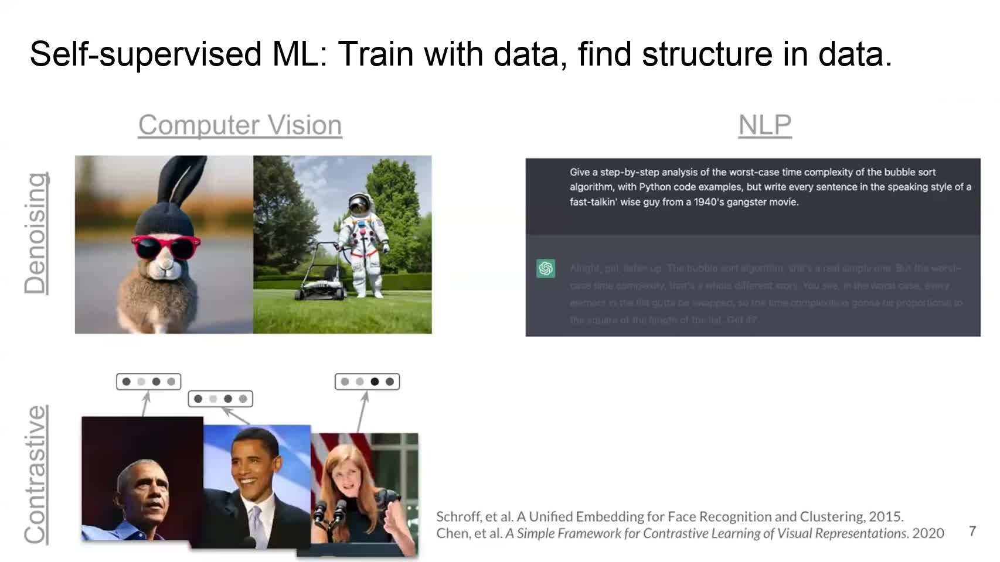

这里的类比来自 self-supervised learning。图像模型可以不靠人工标签，先从数据中学 visual representation；语言模型可以不靠每个任务的人工标注，先通过 next-token prediction 学语言结构。那么 RL 能不能也做类似的事？Eysenbach 给出的答案是：可以，但 RL 里的 self-supervision 不是图像增强，也不是 next-token prediction，而是利用时间结构本身。

换句话说，trajectory 自带一种监督信号：

$$
(s_t, a_t) \quad \text{之后会出现哪些未来状态？}
$$

这就是后面所有工作的共同入口。

## 2. DIAYN：没有外部 reward 时，先学习一组可区分的技能

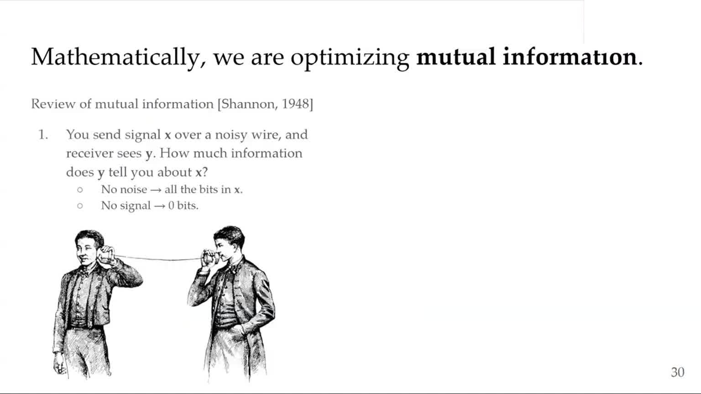

DIAYN 的出发点是：如果暂时没有下游任务 reward，那 agent 至少可以先学会“做出不同的事情”。这里的 skill 不是人手写的宏动作，而是一种 temporally extended behavior。例如，四足机器人向前走、向后走、跳跃、蹲下；机械臂推、抓、堆叠；这些都可以看成 skill。

但“不同”不能只是动作不同。真正有用的 skill 需要满足三个条件。

第一，skill 之间要有 diversity。不同 skill 应该访问不同区域、产生不同结果，而不是都原地抖动。

第二，skill 本身要 predictable。如果执行 skill 7，结果每次都完全随机，那它就不能被高层规划器稳定调用。

第三，skill 要能帮助下游任务。我们学习 skill 不是为了收藏行为模式，而是为了在未来 reward 出现时能更快组合、探索或初始化。

DIAYN 把这个想法写成一个通信游戏。先采一个 latent code $z$，把它交给 policy。policy 在环境里行动，产生一段 trajectory 或最终状态。然后 discriminator 看这个结果，猜 agent 当初拿到的是哪个 $z$。如果 discriminator 能从结果中猜出 $z$，说明不同 code 真的对应不同可区分行为。

于是 policy 得到的内在 reward 可以理解成：

$$
r_{\text{int}}(s,z) \approx \log q_\phi(z \mid s) - \log p(z).
$$

这不是环境 reward，而是“我的行为是否把 latent code 表达出来了”的 reward。最大化这个目标等价于提高 skill code 和状态结果之间的 mutual information：

$$
I(z; s).
$$

所以 DIAYN 的核心不是让 agent 追求某个外部任务，而是让 agent 学会把 latent code 翻译成可观察、可区分、可重复的行为。

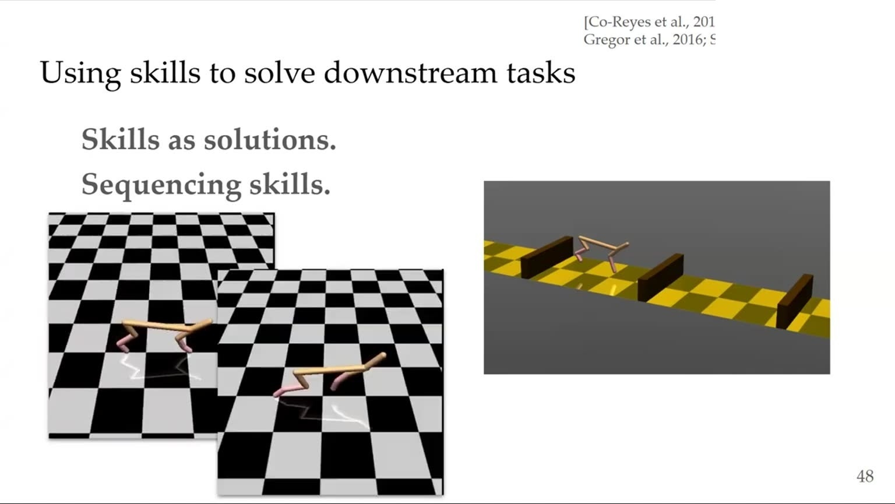

这一步和 hierarchical RL 的关系很直接。低层 policy 学出一组 skill 后，高层 policy 不必每一步都选择原始动作，而是选择哪个 skill 运行一段时间：

$$
\text{high-level controller}
\rightarrow
z_1, z_2, z_3,\ldots
\rightarrow
\text{low-level skill policy}.
$$

这样做可以把长程任务压缩成更短的决策序列。原来一千步的原始动作规划，可能变成二十个 skill 的组合问题。

但 DIAYN 也留下一个关键问题：多样技能一定对下游任务有用吗？答案不是自动成立。skill learning 需要进一步解释：它到底覆盖了什么行为空间？它什么时候能帮助 downstream reward maximization？这就进入 information geometry 那条线。

## 3. Information Geometry：skill learning 不是魔法，它是在策略空间里选覆盖

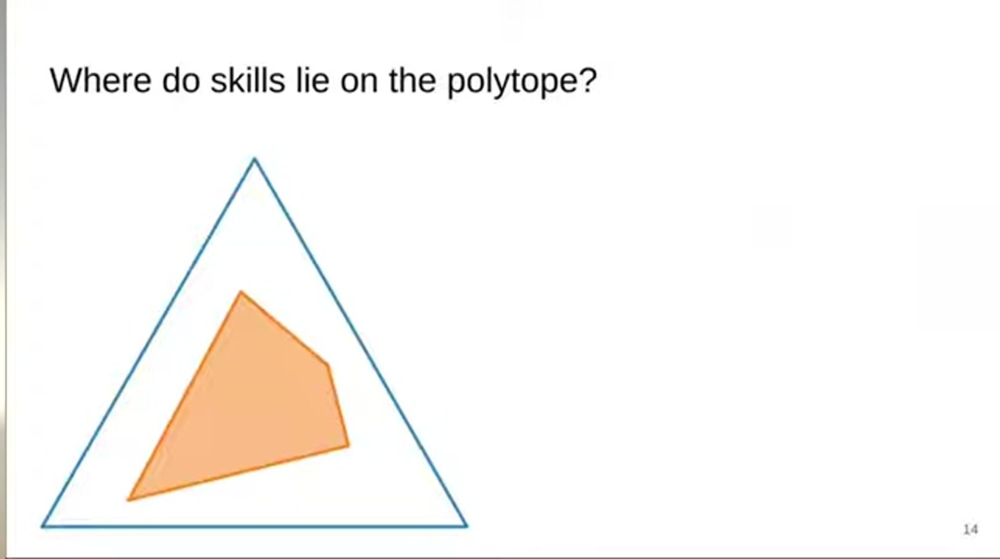

Eysenbach 后续的理论分析把 policy 看成一个会产生 state distribution 的对象。一个 policy 不只是“动作规则”，它还诱导一个 discounted future state distribution：

$$
d^\pi(s) = (1-\gamma)\sum_{t=0}^{\infty}\gamma^t P(s_t=s \mid \pi).
$$

这个式子可以一步一步读。

第一步，固定一个 policy $\pi$。一旦 policy 固定，agent 从初始状态出发，与环境交互，就会产生一条随机轨迹：

$$
s_0,a_0,s_1,a_1,s_2,\ldots
$$

因此在每个时间 $t$，都有一个状态分布：

$$
P(s_t=s\mid \pi).
$$

它表示：如果一直执行 policy $\pi$，第 $t$ 步落在状态 $s$ 的概率是多少。

第二步，不同时间步的重要性不一样。$\gamma^t$ 是折扣权重。越靠近当前时刻的状态，权重越大；越远的未来，权重越小。

第三步，前面的 $(1-\gamma)$ 是归一化因子，因为

$$
(1-\gamma)\sum_{t=0}^{\infty}\gamma^t = 1.
$$

所以 $d^\pi(s)$ 不是随便定义的权重和，而是一个真正的概率分布。等价地说，可以先随机抽一个未来时间

$$
P(T=t)=(1-\gamma)\gamma^t,
$$

再看执行 policy $\pi$ 后第 $T$ 步会落在哪个状态。于是

$$
d^\pi(s)=P(s_T=s\mid \pi).
$$

这个分布告诉我们：如果执行某个 policy，agent 在折扣意义下会把概率质量放在哪些状态上。它通常也叫 discounted state occupancy measure，或者 discounted future state distribution。

有了这个对象，reward maximization 可以写成一个几何问题。对于只依赖 state 的 reward $r(s)$，标准 discounted return 是

$$
R(\pi)=\mathbb E_\pi\left[\sum_{t=0}^{\infty}\gamma^t r(s_t)\right].
$$

把期望按状态展开：

$$
R(\pi)
=\sum_{t=0}^{\infty}\gamma^t\sum_s P(s_t=s\mid\pi)r(s).
$$

再把对时间的求和和对状态的求和交换：

$$
R(\pi)
=\sum_s r(s)\sum_{t=0}^{\infty}\gamma^t P(s_t=s\mid\pi).
$$

而根据 $d^\pi(s)$ 的定义，

$$
\sum_{t=0}^{\infty}\gamma^t P(s_t=s\mid\pi)
=\frac{1}{1-\gamma}d^\pi(s).
$$

所以

$$
R(\pi)=\frac{1}{1-\gamma}\sum_s r(s)d^\pi(s).
$$

如果把 return 乘上常数 $(1-\gamma)$ 做归一化，就得到：

$$
J(\pi) = \sum_s r(s)d^\pi(s).
$$

这个常数因子不改变哪个 policy 最优，因为所有 policy 都乘同一个 $\frac{1}{1-\gamma}$。因此在比较 policy 时，可以把 $J(\pi)$ 看成 reward 向量和 occupancy 向量的内积。

所以每个 policy 对应 state-distribution space 里的一个点 $d^\pi$；每个 reward function 对应一个方向 $r$；最大化 reward 就是在可达分布集合里找沿这个方向内积最大的点。

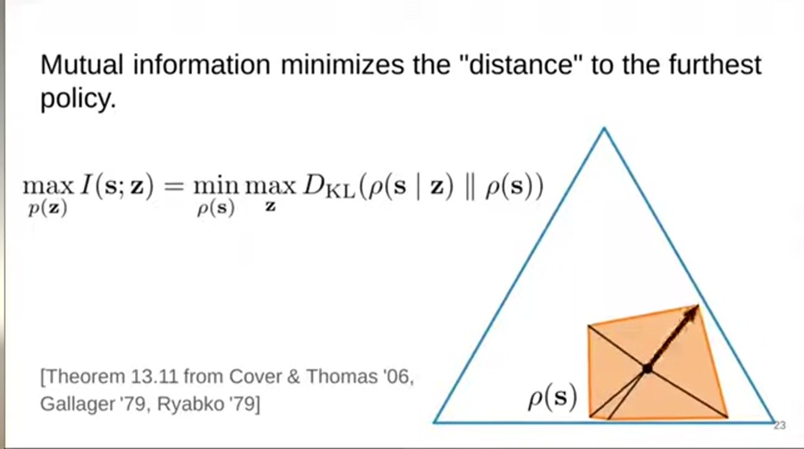

这带来一个很重要的判断：unsupervised skill learning 不可能保证覆盖所有可能的 reward。因为 reward function 可以无限多，下游任务也可以无限多；没有任何有限 skill set 能对所有任务都最优。

但 skill learning 仍然有价值。这里要把“有价值”说得更精确。上一段已经把 reward maximization 写成了一个几何问题：reward 是方向 $r$，policy 诱导的 occupancy $d^\pi$ 是 state-distribution space 里的点。给定一个具体 reward，最优 policy 就是在可达 occupancy 集合里，找沿着 $r$ 方向投影最大的那个点。

问题是，在 unsupervised 阶段，agent 还不知道未来的 $r$ 是什么。它不知道以后要追求速度、距离、能量效率、到达某个目标、避开某个区域，还是完成某种组合任务。因此，skill learning 不能被理解成“提前学会所有任务”。如果这样理解，它一定失败，因为有限个 skills 不可能覆盖无限多个 reward directions。

更合理的理解是：在 reward 缺席时，agent 先主动探索可达 occupancy 集合的结构。不同 skill code $z$ 对应不同 policy $\pi_z$，不同 policy 又对应不同 occupancy $d^{\pi_z}$。如果这些 occupancy 彼此分开、可重复、覆盖范围足够广，那么这些 skills 就像在行为空间里先选出一组 representative directions：

$$
z
\rightarrow
\pi_z
\rightarrow
d^{\pi_z}.
$$

这里的 “direction” 不是说物理空间里的上下左右，而是说行为会把 agent 推向哪些状态分布。例如，一个 skill 让机器人稳定向前移动，一个 skill 让它转向，一个 skill 让它靠近墙边，一个 skill 让它保持平衡，一个 skill 让它进入某类可控姿态。它们不对应具体下游任务，但对应不同的 reachable behavior modes。

这些 representative directions 在下游任务中有三种用法。

第一，它们可以作为 initialization。新任务出现时，agent 不必从随机动作开始，而可以从已经学会的 skill policies 出发微调。如果某个 skill 已经把 agent 带到接近目标的状态区域，下游 RL 只需要调整后半段行为。

第二，它们可以作为 exploration basis。随机探索是在 primitive action space 里抖动，很多尝试没有长期效果；skill-based exploration 则是在 temporally extended behavior space 里探索。选择一个 skill，等于执行一段有结构的行为，因此更容易到达新的状态区域，也更容易发现 sparse reward。

第三，它们可以作为 high-level planning nodes。高层 planner 不需要每一步都选择原始 action，而可以在 skill graph 上规划：先执行哪个 skill，到达哪个中间状态，再执行下一个 skill。这样长程任务被压缩成 skill sequence，决策 horizon 变短，planning problem 也更可处理。

所以这句话的核心不是“skill learning 能解决所有未来任务”，而是：

```text
unknown future reward
    ->
learn diverse controllable behavior modes
    ->
use them as reusable coordinates for downstream learning
```

因此，DIAYN 的正确理解不是：

$$
\text{learn skills} \Rightarrow \text{solve every future task}.
$$

更准确的理解是：

$$
\text{learn diverse predictable behaviors}
\Rightarrow
\text{cover useful parts of reachable state space}
\Rightarrow
\text{make downstream learning easier}.
$$

这也解释了为什么 Eysenbach 后来转向 goal-conditioned RL 和 future-state prediction。与其只学一组离散 skill，不如更直接地学习：从当前状态采取某个动作以后，哪些 future states 会变得可能。

## 4. C-Learning：把 goal-conditioned RL 改写成未来状态分类

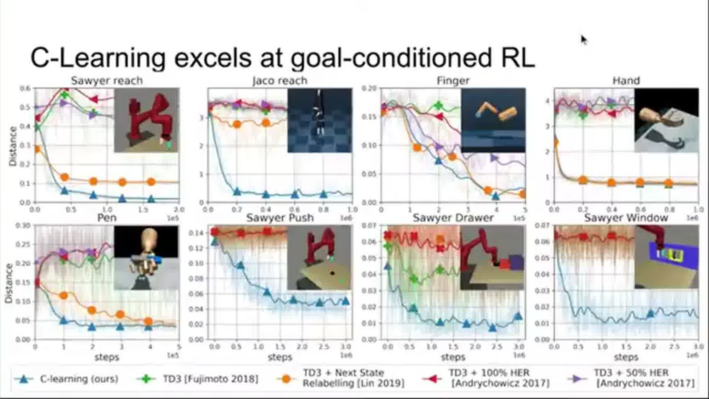

C-Learning 的问题设定是 goal-conditioned RL。给定当前状态 $s$、动作 $a$ 和目标状态 $g$，我们想知道这个动作是否有助于未来达到目标。传统写法会引入 reward：

$$
r_g(s') = \mathbf{1}[s' = g].
$$

然后学习 goal-conditioned $Q(s,a,g)$。但如果状态是图像，或者目标没有明确距离度量，这个 reward 很难写。C-Learning 的关键改写是：不要先写 reward，而是训练一个 future-state classifier。

这个 classifier 接收三样东西：

$$
(s_t, a_t, g).
$$

它要判断 $g$ 是不是来自执行 $a_t$ 之后的 future state。这里有两个分布需要分清。

第一个是 future distribution：

$$
p_{\text{future}}(g\mid s_t,a_t).
$$

它回答的问题是：从当前状态 $s_t$ 执行动作 $a_t$ 以后，在后续 trajectory 里看到目标状态 $g$ 的概率有多大。这个分布依赖当前 state-action pair，所以它包含 reachability 信息。

第二个是 background data distribution：

$$
p_{\text{data}}(g).
$$

它回答的问题是：如果不看当前 $s_t,a_t$，只是在整个 replay buffer 或数据集中随机抽一个状态，那么抽到 $g$ 的概率有多大。这个分布不关心当前动作，只反映 $g$ 在数据里本来有多常见。

因此，C-Learning 的分类问题不是简单判断 “$g$ 是否常见”，而是判断：

$$
\text{is } g \sim p_{\text{future}}(\cdot \mid s_t,a_t)
\quad \text{or} \quad
g \sim p_{\text{data}}(\cdot)?
$$

也就是说，模型要分辨：$g$ 是因为当前 $(s_t,a_t)$ 才更可能出现，还是它只是背景数据里本来就常见。

这一步很关键，因为 Bayes rule 会把分类器和 density ratio 连起来。分类器输出的是二分类概率：

$$
C_\theta(s,a,g)
=
P(g \text{ comes from the future} \mid s,a,g).
$$

这个概率本身还不是 value。真正有用的是它对应的 odds：

$$
\frac{C_\theta(s,a,g)}{1-C_\theta(s,a,g)}.
$$

因为正样本从 $p_{\text{future}}(g\mid s,a)$ 来，负样本从 $p_{\text{data}}(g)$ 来，所以这个 odds 对应的是：

$$
\frac{p_{\text{future}}(g \mid s,a)}{p_{\text{data}}(g)}.
$$

这个比值比单独的 $p_{\text{future}}(g\mid s,a)$ 更有信息。原因是有些状态本来就在数据集中很常见，即使它们在当前动作之后出现，也不一定说明当前动作特别有助于到达它们。除以 $p_{\text{data}}(g)$ 后，模型问的是：相对于背景频率，$g$ 是否因为当前 $(s,a)$ 而变得更可能？

所以 C-Learning 不是把 classifier 当成普通判别器，而是利用判别器恢复“这个目标相对背景数据而言有多像当前动作的未来”。如果 $g$ 在执行 $a$ 之后更可能出现，并且不是仅仅因为它在数据里本来常见，那么这个 density ratio 就高。反过来，如果 $g$ 只是随机常见状态，这个比值就不会高。

这就把 goal-conditioned control 改写成了一个选择动作的问题：

$$
a^* = \arg\max_a P(g \text{ will be future} \mid s,a).
$$

所以 C-Learning 的核心逻辑是：

$$
\text{future classification}
\rightarrow
\text{future density estimate}
\rightarrow
\text{goal-conditioned value}
\rightarrow
\text{policy}.
$$

这里的 “future state” 不能理解成 trajectory 里任意一个未来状态。C-Learning 需要的 future distribution 是 discounted future，也就是越近的未来权重越高、越远的未来权重越低。具体地说，可以先采一个随机时间偏移 $K$：

$$
P(K=k)
=
(1-\gamma)\gamma^k,
\quad
k=0,1,2,\ldots
$$

然后把 $s_{t+1+k}$ 当成当前 $(s_t,a_t)$ 的 future state。这个采样方式就是几何分布采样。它的作用是把 trajectory sampling 和 RL 里的 discount factor $\gamma$ 对齐：$\gamma$ 越大，远期状态被采到的概率越高；$\gamma$ 越小，训练目标越重视近未来。

因此，future-state classification 不是随便做一个监督学习任务。它实际在估计一个 discounted future occupancy：

$$
p_\gamma(g\mid s,a)
=
(1-\gamma)
\sum_{k=0}^{\infty}
\gamma^k
P(s_{t+1+k}=g\mid s_t=s,a_t=a).
$$

这个量回答的是：如果我现在在状态 $s$ 执行动作 $a$，之后继续按照当前 policy 行动，那么目标状态 $g$ 会以多大折扣概率出现在未来？

这个定义一写出来，就会自然产生 Bellman-style recursion。原因是 future 可以分成两部分：第一步之后立刻到达 $g$，或者第一步之后没有结束，继续从下一个 state-action pair 看未来。形式上可以写成：

$$
p_\gamma(g\mid s,a)
=
(1-\gamma)P(s_{t+1}=g\mid s,a)
+
\gamma\,
\mathbb{E}_{s'\sim P(\cdot\mid s,a),\,a'\sim\pi(\cdot\mid s')}
\left[
p_\gamma(g\mid s',a')
\right].
$$

这就是为什么 C-Learning 会出现类似 Bellman recursion 的结构。它不是因为作者硬把 RL 公式塞进 classifier，而是因为 discounted future distribution 本身就满足“当前一步 + 折扣后的未来”这种递推分解。

hindsight relabeling 也可以从这里理解。普通 goal-conditioned RL 里，如果一条 trajectory 没有到达原本指定的 goal，HER 会把 trajectory 中实际到达过的状态拿来重新标成 goal。这个操作看起来像一个实用技巧：虽然没完成原目标，但至少完成了某些 achieved goals。

在 C-Learning 里，这件事更自然。因为 positive sample 的定义本来就是：“$g$ 是否来自当前 $(s_t,a_t)$ 之后的 discounted future？” 只要某个状态 $s_{t+1+k}$ 真的出现在 trajectory 的未来，它就可以作为 $(s_t,a_t)$ 的 positive goal；只是它的权重应该随 $k$ 按 $\gamma^k$ 衰减。于是 hindsight relabeling 不再只是事后补救，而是 future-state classification objective 所需要的正样本构造方式。

所以这一段的逻辑可以压缩成：

```text
sample future states with geometric discount
    ->
estimate discounted future occupancy
    ->
obtain Bellman-style recursion
    ->
future states in the same trajectory become valid hindsight goals
```

## 5. Contrastive RL：contrastive learning 不是预训练，而是 value learning

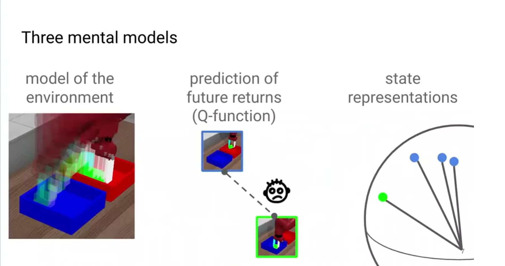

Contrastive Learning as Goal-Conditioned RL 是 C-Learning 的进一步抽象。它保留了同一个基本问题：给定当前 state-action 和目标 state，判断这个目标是否可能成为未来。但它用 contrastive representation 来实现这个判断。

具体地说，模型学习两个 embedding：

$$
\phi(s,a), \quad \psi(g).
$$

然后用它们的相似度作为打分函数：

$$
f(s,a,g) = \phi(s,a)^\top \psi(g).
$$

训练时，正样本是同一条 trajectory 里的 future state，负样本是别的状态。也就是说：

$$
(s_t,a_t,s_{t+k}) \quad \text{is positive},
$$

而随机采来的 $g^-$ 是 negative。

这里的 contrastive loss 可以按和 C-Learning 相同的线索读。正样本告诉模型：“这个目标确实出现在当前状态动作之后的未来”；负样本告诉模型：“这个目标只是从背景分布里随便抽到的”。如果模型要把正样本从一批负样本里挑出来，它就必须学会比较两件事：

$$
\text{how likely is } g \text{ under the future distribution}
$$

和

$$
\text{how likely is } g \text{ under the background data distribution}.
$$

因此 InfoNCE/contrastive objective 学到的相似度，本质上仍然指向一个 future density ratio。只是 C-Learning 用显式二分类器表示这个 ratio，contrastive RL 用 state-action embedding 和 goal embedding 的内积来表示这个 ratio。

这看起来像普通 contrastive representation learning，但在 Eysenbach 这里，它的含义更强。这个 score 估计的是“目标状态成为未来状态的相对可能性”。因此它可以被解释成 goal-conditioned value function：

$$
Q(s,a,g) \;\approx\; f(s,a,g).
$$

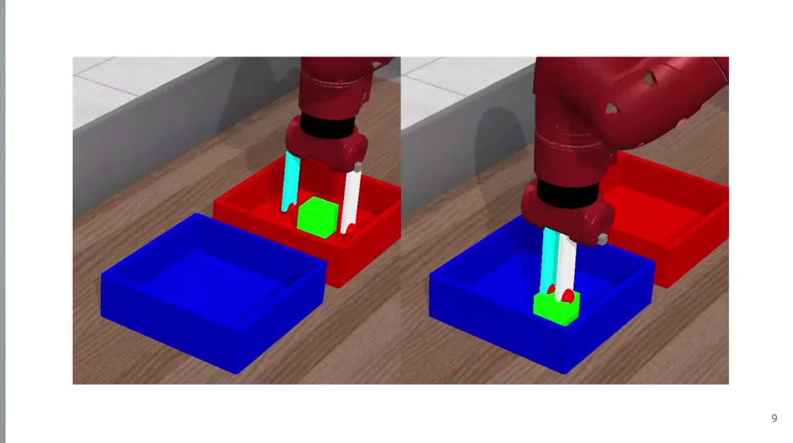

policy 的训练也因此很自然。给定目标 $g$，actor 选择动作 $a$，使得 $\phi(s,a)$ 和 $\psi(g)$ 更相似。直观地说，actor 在做的是：

$$
\text{choose the action whose predicted future is closest to the goal}.
$$

这和普通“先学 representation，再接 RL”不同。普通做法里，contrastive learning 只是预训练 encoder，后面还要另一个 critic、另一个 model、另一个 reward learner。Eysenbach 的论点是：如果 contrastive objective 直接用 future states 构造，那么它本身就已经在学习 value-like object。

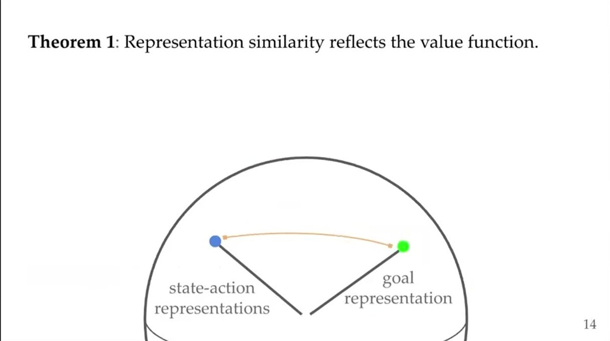

所以这里有一个重要口径需要统一。普通 contrastive learning 里，相似度常常被理解成 semantic similarity。例如，两张图都像“狗”，embedding 就应该接近；两句话语义相近，embedding 也应该接近。但在 goal-conditioned RL 里，contrastive score 的训练信号不是人工语义标签，也不是图像类别，而是 trajectory 里的时间关系。

正样本的定义是：目标 $g$ 出现在当前 $(s,a)$ 之后的未来。负样本的定义是：目标 $g$ 只是从背景数据分布里抽来的状态。因此，模型被训练去回答的问题不是：

```text
Does g look semantically similar to s?
```

而是：

```text
Is g likely to become a future state after taking action a in state s?
```

这就是为什么不能把 contrastive score 读成普通语义相似度：

$$
\text{contrastive score}
\neq
\text{just semantic similarity}.
$$

一个目标状态可能和当前状态在视觉上很像，但并不可达。例如隔着墙的房间看起来相似，但当前动作到不了那里。反过来，一个未来状态可能和当前状态视觉差异很大，但如果它确实会在当前动作之后出现，它就应该得到高 score。因此，这里的 similarity 更准确地说是 reachability similarity：两个 embedding 接近，不是因为它们“长得像”，而是因为目标 $g$ 在当前 $(s,a)$ 的 future occupancy 中概率高。

从 C-Learning 的角度看，这个 score 近似的是 future occupancy ratio：

$$
\frac{p_{\text{future}}(g\mid s,a)}
{p_{\text{data}}(g)}.
$$

分子表示 $g$ 在当前 state-action 后的未来中有多可能；分母表示 $g$ 在背景数据中本来有多常见。比值高，说明 $g$ 不是一般意义上的常见状态，而是相对于背景分布来说，特别像当前 $(s,a)$ 的未来。

而 goal-conditioned value function 本来也在回答类似问题：如果目标是 $g$，在状态 $s$ 执行动作 $a$ 有多好？如果“好”被定义成让 $g$ 更可能出现在未来，那么 future occupancy ratio 就可以作为 value-like signal。于是这条关系应该读成：

$$
\text{reachability similarity}
\rightarrow
\text{future occupancy ratio}
\rightarrow
\text{goal-conditioned value}.
$$

这也是为什么 Eysenbach 会把 RL 和概率建模联系起来。language model 最大化 next-token likelihood，学习的是“给定上下文，下一个 token 更可能是什么”。contrastive RL 学的是 future-state likelihood 或 density ratio，学习的是“给定当前 state-action，哪个 goal 更可能成为未来状态”。二者都在做条件概率建模，只是对象不同：

```text
language model:
    context -> next token likelihood

contrastive RL:
    state-action -> future goal likelihood / density ratio
```

所以 Eysenbach 的口径不是“把 RL 变成普通 representation learning”，而是“把 value learning 改写成关于未来状态的概率建模”。这也是 contrastive score 可以训练 actor 的原因：actor 选择的动作越能提高目标 $g$ 的 future likelihood，对应的 score 就越高。

## 6. Patterns in Time：自监督 RL 的监督信号来自时间和物理

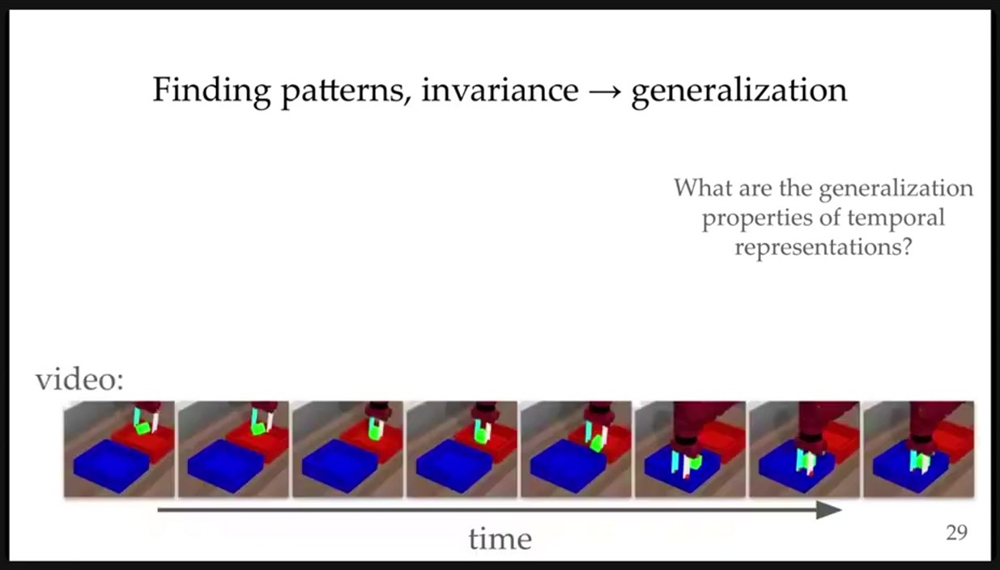

在 “patterns in time” 这条线里，Eysenbach 把 self-supervised RL 放到更大的自监督学习语境里。图像 contrastive learning 通常需要人工设计 augmentation：裁剪、颜色扰动、旋转、遮挡。问题是，哪些 augmentation 保留语义，哪些破坏语义，往往需要人类经验。

视频和轨迹不一样。时间本身提供了正样本关系。相邻帧、同一条轨迹的未来状态、从同一个行动过程里出现的状态，都携带了“物理上有关联”的信息。

这可以线性理解为：

$$
\text{same trajectory}
\Rightarrow
\text{temporal relation}
\Rightarrow
\text{reachability relation}
\Rightarrow
\text{useful representation for control}.
$$

这里的 pattern 不是静态图像里的纹理，而是 temporal pattern：哪些状态会自然跟在一起，哪些行动会把系统推向某些未来，哪些目标可以通过当前能力逐步达到。

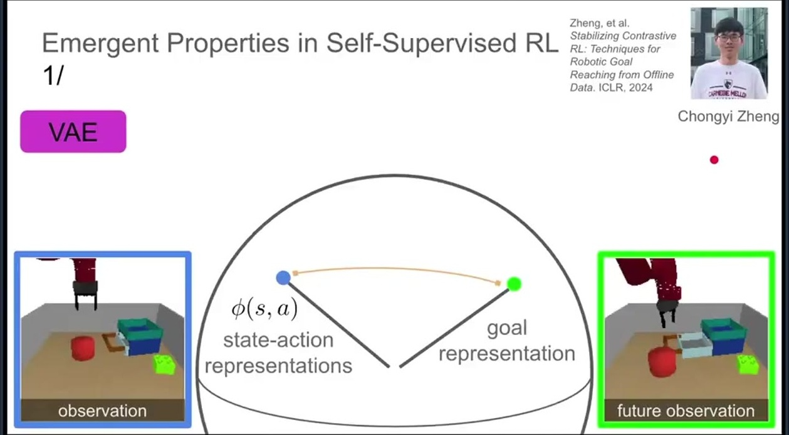

这也是他所谓 “third way” 的含义。今天很多人一谈 AI agent，会想到两条路线。第一条是 language model：从互联网文本中模仿人类生成。第二条是传统 RL：给 reward，让 agent 最大化回报。Eysenbach 想强调第三条路线：

$$
\text{agent learns from temporal experience itself}.
$$

它不完全是 imitation，因为目标不是复制人类行为；它也不完全是 reward maximization，因为训练信号不一定来自外部 reward。它更像是在时间序列中找结构，然后把这种结构转化成 reachability、representation 和 policy。

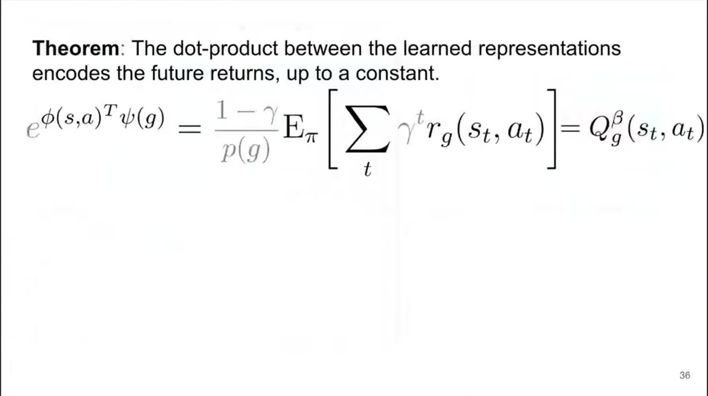

Fig. 13 把这个观点压成一个 theorem。图里的句子是：learned representations 的 dot product 会编码 future returns，只差一个常数因子。公式可以写成：

$$
e^{\phi(s,a)^\top \psi(g)}
=
\frac{1-\gamma}{p(g)}
\mathbb{E}_{\pi}
\left[
\sum_t \gamma^t r_g(s_t,a_t)
\right]
\approx
Q_g(s,a).
$$

先看左边。$\phi(s,a)$ 是 state-action representation，表示当前状态和动作；$\psi(g)$ 是 goal representation，表示目标状态。两者的 dot product $\phi(s,a)^\top\psi(g)$ 是 contrastive score。因为 contrastive softmax 通常在 log-score 空间工作，所以公式用 $e^{\phi(s,a)^\top\psi(g)}$ 把 log-score 变回正的 likelihood-ratio-like quantity。

再看中间。$r_g(s_t,a_t)$ 是和目标 $g$ 对应的 reward。最简单的理解是：如果未来状态到达或匹配目标 $g$，这个 reward 就高；否则低。$\sum_t \gamma^t r_g(s_t,a_t)$ 是从当前 $(s,a)$ 出发后，对目标 $g$ 的 discounted return。$\mathbb{E}_\pi[\cdot]$ 表示这个 return 还要对 policy $\pi$ 产生的未来轨迹取期望。

前面的 $(1-\gamma)$ 是折扣归一化。因为 $\sum_t \gamma^t$ 的总权重是 $1/(1-\gamma)$，乘上 $(1-\gamma)$ 后，discounted future 可以被读成一个归一化的 future distribution。分母 $p(g)$ 是 background goal distribution，也就是目标 $g$ 在数据里本来有多常见。除以 $p(g)$ 的作用和前面 density ratio 一致：它不是只问 $g$ 是否常见，而是问 $g$ 是否相对于背景频率更像当前 $(s,a)$ 的未来。

所以这条公式的逻辑是：

```text
contrastive dot product
    ->
exponentiated future-density score
    ->
normalized discounted return for goal g
    ->
goal-conditioned value-like quantity
```

这就把 “third way” 说清楚了。它不是 imitation，因为公式里没有要求复制人类动作；它也不是传统 reward maximization，因为 reward-like signal 是从 future-state contrastive learning 里恢复出来的。representation learning 和 value learning 在这里合并了：学到的不是一个中性的 embedding，而是一个能告诉 policy “哪个动作会让目标更可能成为未来”的表示。

这条线和我们之前看的 diffusion / flow / HJB 有一个共同点：它们都不是只学习静态样本，而是在学习某种时间展开结构。区别在于，HJB 用 value function 和 PDE 描述最优控制；Eysenbach 这条线则用 trajectory data、future-state classification 和 contrastive score 来学习 value-like object。

## 7. 长程任务：只会“朝目标走”还不够，还需要抽象和规划

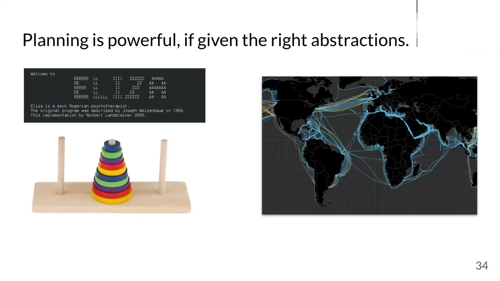

Goal-conditioned policy 学会之后，一个自然问题是：它能不能直接解决长程任务？Eysenbach 的回答比较谨慎。短程目标可以通过局部 reachability 解决，但长程目标往往需要中间子目标、图结构或抽象规划。

这可以分成两层。

第一层，local goal-reaching。给定当前状态和附近目标，policy 可以选择动作，让目标更可能成为未来状态。

第二层，long-horizon planning。如果目标很远，直接用一个 policy 从当前状态贪心追目标，可能会失败。因为局部看起来更接近目标的动作，不一定能绕过障碍、穿过门、走到正确房间。

所以需要一个中间结构：

$$
\text{states/goals}
\rightarrow
\text{learned graph or abstraction}
\rightarrow
\text{subgoal sequence}
\rightarrow
\text{local goal-conditioned policy}.
$$

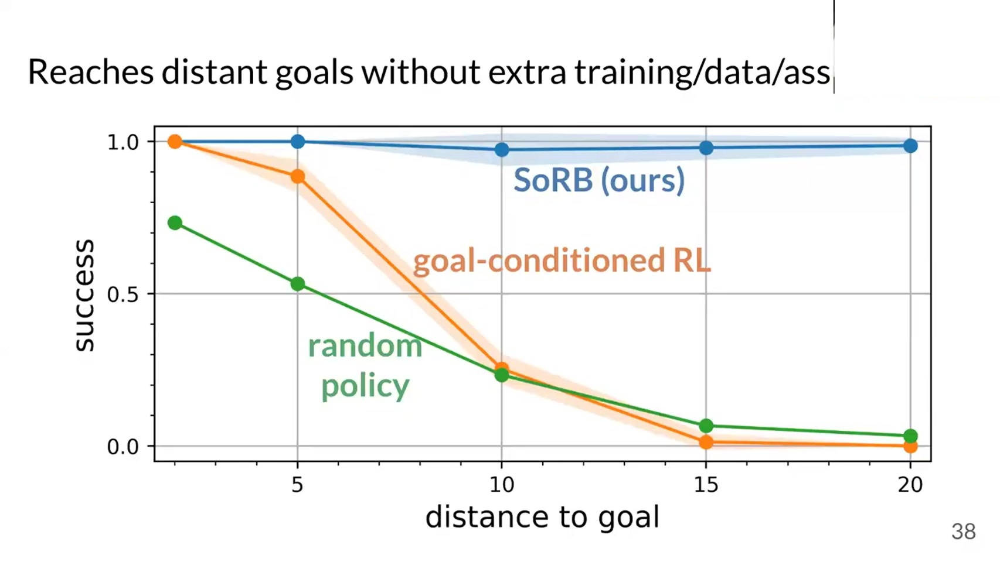

这就是他 thesis defense 里强调的 “planning is powerful, if given the right abstractions”。learned representation 不能只服务于单步 action selection，还应该让系统能构造图、估计可达性、寻找中间节点。

线性地说，contrastive/GCRL 学到的是一个低层可达性接口：

$$
(s,g) \mapsto \text{how reachable is } g?
$$

而长程规划还需要在这个接口上再叠一层：

$$
g_{\text{final}}
\rightarrow
g_1,g_2,\ldots,g_K
\rightarrow
\text{execute local policies}.
$$

这也解释了为什么 hierarchical RL 和 goal-conditioned RL 在他的工作里并不是两条完全分开的线。DIAYN 学离散 skill，GCRL 学目标到达，planning 学子目标序列；三者都在回答同一个问题：如何把长程行为拆成可复用、可组合、可学习的中间结构。

## 8. RL as Generative Modeling：从“最大化 reward”到“生成满足条件的行为”

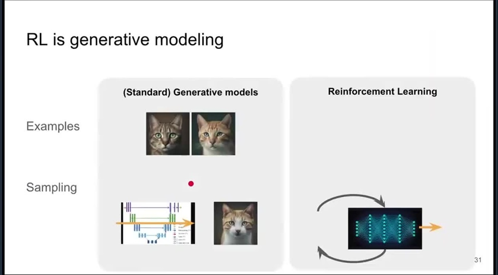

Eysenbach 近期 talk 里还有一个更前沿的口径：RL 可以被理解成 generative modeling。传统 RL 的语言是：

$$
\text{given reward} \rightarrow \text{find optimal policy}.
$$

generative modeling 的语言则是：

$$
\text{given condition} \rightarrow \text{generate sample}.
$$

如果把 trajectory 或 behavior 看成样本，那么 RL 就可以被重新表述为：

$$
\text{given goal / prompt / constraint}
\rightarrow
\text{generate behavior that satisfies it}.
$$

这句话需要拆开。生成模型里，模型不是只输出一个标签，而是从条件分布里生成样本。例如，给定文本 prompt，语言模型生成一个 token sequence；给定图像条件，diffusion model 生成一张图。对应到 RL，样本不再是静态文本或图像，而是一段会在环境中展开的 trajectory：

$$
\tau = (s_0,a_0,s_1,a_1,\ldots).
$$

condition 也不一定只是 reward。它可以是目标状态、语言指令、约束、偏好，或者某种“要产生什么行为”的描述：

$$
c = \text{goal / prompt / constraint}.
$$

于是 generative RL 的问题可以写成：

$$
p(\tau \mid c).
$$

也就是说，agent 要生成一条满足条件 $c$ 的可行动轨迹。

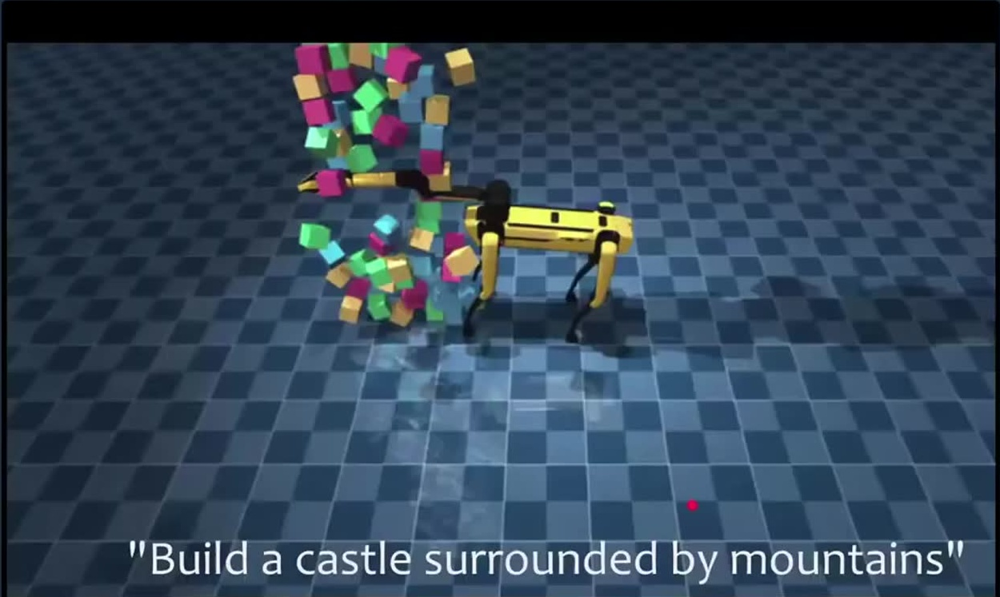

这和语言模型很像。语言模型给定 prompt，生成文本；generative RL 给定目标，生成行动序列。不同之处在于，行动序列会进入环境，受到 dynamics 和 feasibility 约束。

这个不同点很关键。文本生成只需要 token sequence 在语言空间里合理；行为生成还必须被环境动力学接受。一个 policy 不能随便生成“已经到达目标”的状态，它必须一步一步选择动作，让环境从当前状态真实转移到后续状态。因此，RL as generative modeling 不是把环境丢掉，而是把环境看成生成过程的一部分：

$$
\pi(a_t \mid s_t,c)
\quad \text{proposes action},
$$

$$
p(s_{t+1} \mid s_t,a_t)
\quad \text{checks physical/dynamical feasibility}.
$$

在这个视角下，value function 或 contrastive score 的作用也更清楚：它们不是额外外挂的评价器，而是在告诉生成过程哪些未来轨迹更可能满足条件。

这也让我们更容易理解他为什么反复强调 probability。goal-conditioned RL 可以看成学习：

$$
P(g \mid s,a),
$$

也就是当前动作会让目标在未来出现的概率。policy 则可以看成反过来利用这个概率：

$$
P(a \mid s,g).
$$

这和生成模型里的条件分布非常接近。核心不是“RL 不再需要 value”，而是 value 可以被看成一种关于未来事件的 log probability 或 density ratio。

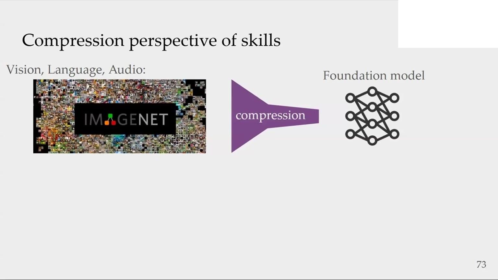

从这个角度看，skill learning 也有了另一种解释。skill 不是孤立的动作模板，而是对庞大行为空间的一种压缩。一个 latent code $z$ 对应一类行为；goal-conditioned representation 对应一套 reachability geometry；planning graph 对应长程行为的离散骨架。它们都在把“巨大的可能行为空间”压缩成可学习、可组合、可泛化的结构。

## 9. 和 Ben Eysenbach 学术脉络的关系

这组视频可以按研究时间线读成四段。

第一段是 **DIAYN / unsupervised skill learning**。问题是：没有 reward 时能不能学行为？答案是通过 mutual information 让 skill code 和状态结果可区分。

第二段是 **C-Learning / future-state classification**。问题是：goal-conditioned RL 能不能不用手写 reward？答案是把“到达目标”改写成“目标是否来自未来”的分类问题。

第三段是 **contrastive RL / temporal representation**。问题是：contrastive learning 是否只是 encoder 预训练？答案是否定的。只要正样本来自 future state，contrastive score 就能近似 goal-conditioned value。

第四段是 **self-supervised agents / generative RL**。问题是：这些方法是否只能解决玩具任务？Eysenbach 的近期口径是把 RL 放进更广义的生成建模里：从目标、约束、prompt 或状态条件生成行为。

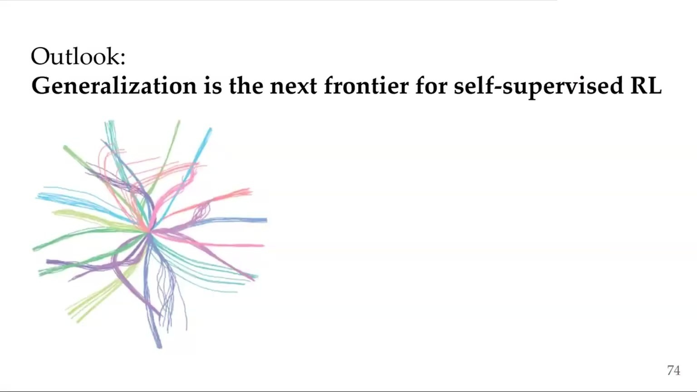

所以他的主线不是单纯“做 RL 算法优化”，而是持续推进一个统一观点：

$$
\text{RL can be reframed as probabilistic prediction about the future}.
$$

这个观点让 value learning、representation learning、model learning、goal reaching 和 skill learning 不再是五个分散模块，而可以用 future distribution / density ratio / contrastive score 串起来。

## 10. 和我们已读框架的连接

这条线和 HJB / HJ-sampler / VI primer 的关系很值得单独拎出来。

和 HJB 相比，Eysenbach 也在学习一个“面向未来”的对象。HJB 的 value function 表示从当前状态到终点还需要多少累计代价；Eysenbach 的 goal-conditioned value 表示从当前状态动作出发，目标在未来出现的可能性。二者都不是只看当前状态，而是在问：

$$
\text{from here, what futures are likely or optimal?}
$$

区别在于，HJB 通常有明确的 dynamics、cost 和 PDE 结构；Eysenbach 这条线则更数据驱动，主要从 trajectory 中构造正负样本，通过分类或 contrastive learning 学未来分布。

和 HJ-sampler 相比，二者都把路径和后验/未来联系起来。HJ-sampler 用随机过程和 log transform 得到 posterior path sampling；C-Learning 和 contrastive RL 用 trajectory 里的 future states 学 reachability。一个偏数学推断和采样，一个偏 RL 数据学习。

和 VI primer 相比，Eysenbach 的方法也有 amortization 味道。VI 把每个观测对应的后验推断 amortize 到一个网络里；goal-conditioned RL 把每个目标对应的控制问题 amortize 到一个 goal-conditioned policy 或 value function 里：

$$
g \mapsto Q(s,a,g), \quad g \mapsto \pi(a \mid s,g).
$$

但它和 VI 的差异也很清楚。VI 的核心目标是近似 posterior distribution，强调 uncertainty quantification；Eysenbach 的核心目标是学习可行动的 future reachability，强调 control 和 behavior generation。如果我们要把它用于 synthetic city，就不能简单把它当作 VI 替代品，而应该把它当成“从时空数据中学习可达性、兼容性和行为结构”的工具。

## 11. 对 synthetic city / mobility inverse problem 的启发

你现在的问题大致可以写成：

$$
\mathbf{c} \mapsto \mathbf{p},
$$

其中 $\mathbf{c}$ 是 census summaries、marginals、PUMA 约束等 observation，$\mathbf{p}$ 是 joint population、activity pattern、OD flow 或 trajectory distribution。这个问题天然 ill-posed：同一组 aggregate constraints 可能对应很多 plausible micro-level configurations。

Eysenbach 这条线给的启发不是“直接把城市问题改成 RL”，而是提供了一种中间层：从数据中学习哪些状态、地点、活动、路径在时间上和空间上彼此可达、可组合、可替代。

这里要避免过度外推。synthetic city 目前不是一个标准 RL 环境：我们通常没有显式 action space，也没有清楚的环境 step function，更没有像机器人那样的在线试错过程。因此，Eysenbach 这条线更适合作为 representation / reachability layer，而不是直接替代现有 conditional generation 或 inverse inference 框架。

更稳妥的接法是：先从轨迹数据里学一个“未来兼容性”分数，再把它作为下游生成或反演的结构约束。

可以把城市 mobility 数据里的正负样本这样构造：

$$
(\text{current place/time}, \text{action or transition}, \text{future place})
\quad \text{as positive},
$$

随机抽取的其他地点或其他人的 future place 作为 negative。这样训练出来的 score 不只是“两个地点语义相似”，而是“在这种条件下，一个地点是否可能成为另一个地点的未来”。

这对应城市里的一个 value-like object：

$$
f(x_t, a_t, g) \approx \log \frac{P(g \text{ appears in future} \mid x_t,a_t)}{P(g)}.
$$

如果这个对象学得好，它可以帮助三个任务。

第一，约束生成。生成 population 或 trajectory 时，不只是满足 marginals，还要满足 learned reachability geometry。

第二，corridor / mode 识别。某些 OD 条件下反复出现的路径走廊，可以看成 population-level 的 temporal pattern，而不只是单条最短路。

第三，uncertainty pruning。在同一组 aggregate observations 下，很多 micro configurations 都统计上可行；learned future compatibility 可以进一步筛掉动态上不合理的解。

所以它和我们之前的判断是一致的：如果没有清晰物理方程，也不代表只能做黑盒 conditional generation。我们仍然可以从 trajectory 的时间结构里构造自监督信号，学习一种“软物理”：

$$
\text{what futures are plausible under observed mobility dynamics?}
$$

这可能正是 synthetic city 里连接 conditional generation、amortized inverse problem、trajectory realism 和 agent-based simulation 的关键层。

## 12. 建议阅读顺序

如果要正式精读 Eysenbach，我建议不要先读最新长 talk，而是按概念递进读：

1. **Diversity is All You Need**：理解无 reward 学 skill 的基本想法。
2. **C-Learning**：理解 goal-conditioned RL 如何变成 future-state classification。
3. **Contrastive Learning as Goal-Conditioned RL**：理解 contrastive score 和 value function 的关系。
4. **The Information Geometry of Unsupervised RL**：理解 skill learning 的理论边界。
5. **RLDM 2025 tutorial / thesis defense**：最后再读综合版，把 skill、goal-reaching、planning、generative RL 串起来。

这条顺序能避免一个常见误解：把 Eysenbach 的工作看成很多互不相关的小算法。更准确地说，它们都在围绕同一个对象旋转：

$$
\text{discounted future state distribution}.
$$

DIAYN 用它来区分技能，C-Learning 用它来分类未来，contrastive RL 用它来学习 value，planning 用它来组织长程目标，generative RL 用它来生成满足条件的行为。
