# Locality-aware Parallel Decoding：让自回归图像生成并行化，但不丢掉局部一致性

- Video: https://www.youtube.com/watch?v=cPeGBXXHxZM
- Transcript: `youtube/transcripts/cPeGBXXHxZM-iclr2026-oral-locality-aware-parallel-decoding/transcript.md`
- Slides: `youtube/slides/cPeGBXXHxZM-locality-aware-parallel-decoding-for-efficient-autoregressive-image-generation/curated/`
- Speaker: Lu Kuang

## 1. 问题背景：自回归图像生成重新变重要，但太慢

这场 talk 从一个趋势开始：autoregressive modeling 在语言里已经是主流，而图像生成也重新出现自回归路线。GPT-4o image generation 让很多人看到 AR image generation 的潜力；更重要的是，统一多模态系统天然适合 next-token prediction。

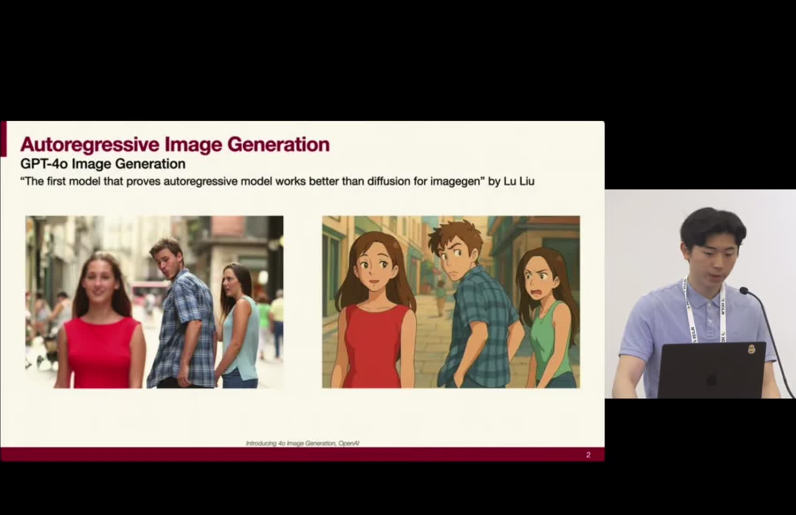

如果图像也能被编码成 token sequence，那么视觉和语言就能进入同一个自回归框架。问题在于，普通 AR image generation 太慢。高分辨率图像有大量 token，逐 token 生成会让 latency 随 token 数增长。

## 2. 两种已有范式各有问题

talk 把已有 AR image generation 分成两类。第一类是 flat token representation：把图像离散成 raster order token sequence，然后逐 token 做 next image token prediction。它和语言模型兼容，但速度慢。

第二类是 next-scale 或 next-resolution prediction，例如 VAR 思路。它一次并行预测下一尺度的 token，速度更快，但不再像普通 token sequence 那样自然兼容统一的 vision-language next-token 框架。

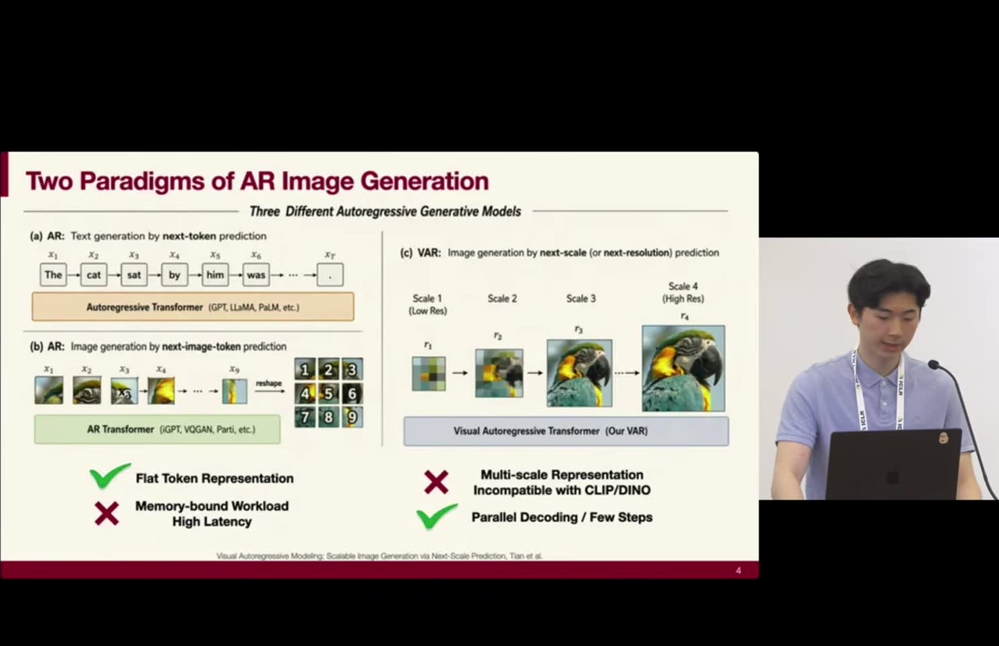

所以作者提出的问题是：能不能同时保留 flat token 的多模态兼容性，又获得接近并行生成的速度？

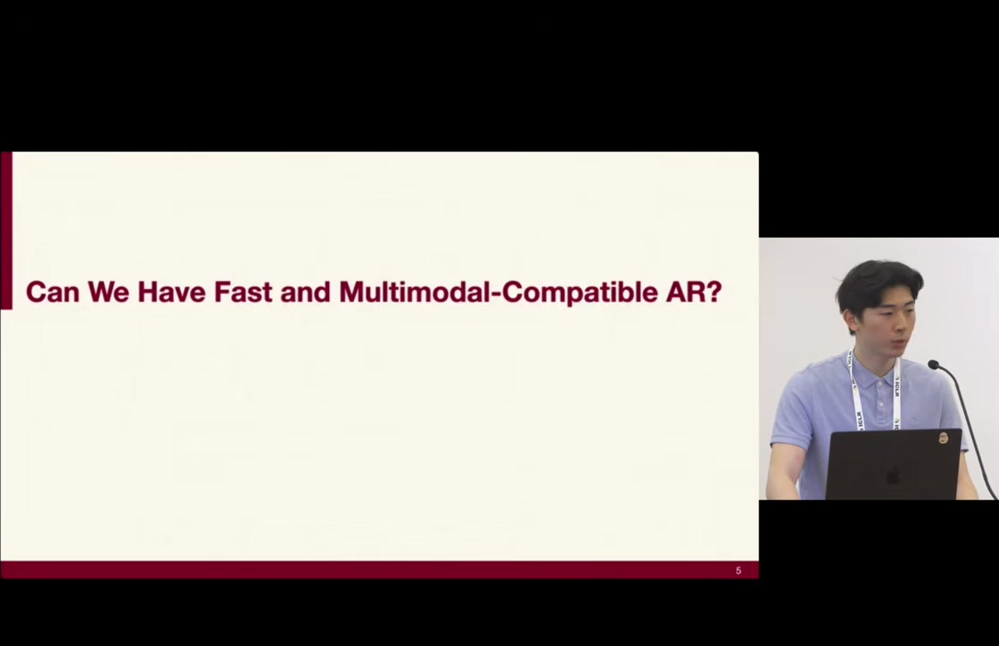

## 3. 第一层方法：把 token 的 context role 和 generation role 拆开

普通自回归生成里，每个已生成 token 同时扮演两个角色。它一方面作为 context 被后续 token attend；另一方面，它的 hidden state 负责输出下一个 token 的 logits。

这种绑定导致输入输出结构固定：输入一个 token，输出下一个 token。如果想一次预测多个位置，这个结构就不够灵活。

Locality-aware Parallel Decoding 的第一步是引入 position query tokens。已经生成的 token 继续负责 context；而要预测的位置由 position query token 表示。

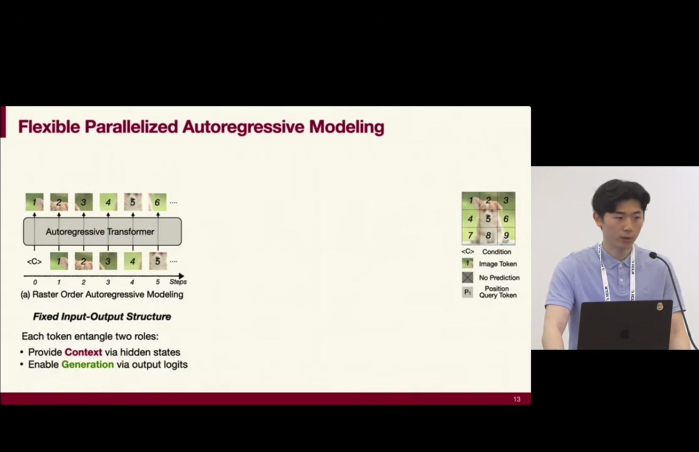

这样，模型就可以在同一次 forward pass 中指定任意一组目标位置，比如同时预测位置 3 和 5。context token 和 generation query 分离后，顺序和并行度都变成可控变量。

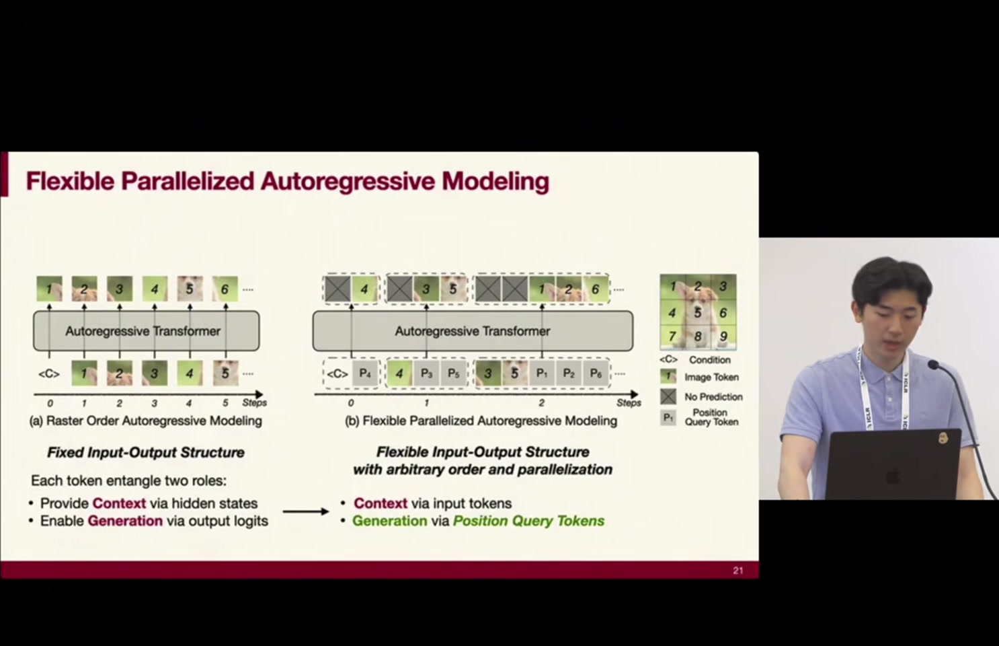

## 4. 训练：用 specialized attention mask 学会并行预测

训练时仍然使用 teacher forcing。ground-truth tokens 作为 context，position query tokens 作为要预测的位置。

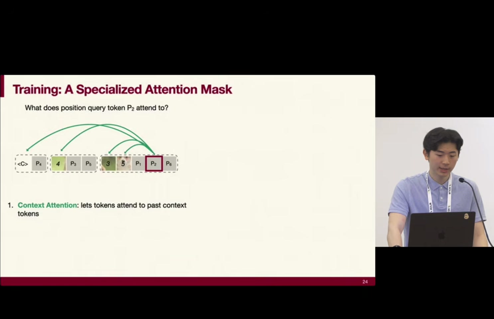

attention mask 有两层含义。第一，position query token 要能看到它前面的 ground-truth context token。第二，同一批并行预测的 position query tokens 也要互相看到。原因是并行采样本质上会让多个 token 独立生成，如果它们完全彼此隔离，就容易产生不一致图像；让 query tokens 之间共享信息，可以提高局部一致性。

## 5. 推断：把 encoding 和 decoding 融合成一个 forward pass

推断时理论上有两步。第一步是 encoding：把已生成 token 编码并放入 KV cache。第二步是 decoding：输入 position query tokens，预测下一批目标 token。

如果这两步分开做，就需要两个 forward pass，对 memory-bound transformer 来说会变慢。作者把 encoding attention 和 decoding attention 融合进一个 specialized attention mask，从而在单个 inference step 里完成。

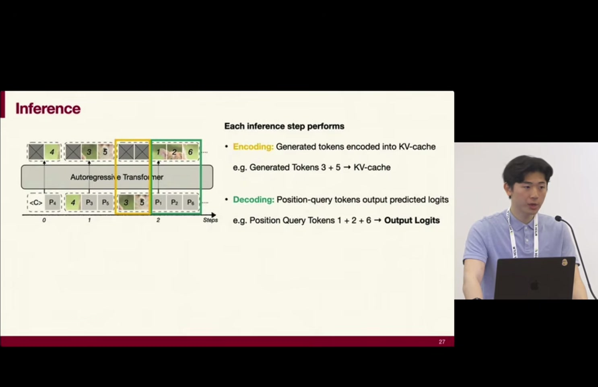

到这里，模型已经获得了一个能力：它可以选择一次预测多少 token，也可以选择按什么顺序预测。

## 6. 第二层方法：并行度和生成顺序不能随便选

并行度决定每一步生成多少 token。talk 里采用 cosine schedule：前期少生成，后期逐渐增加。这符合直觉，因为图像早期结构还不确定，过早大量并行容易造成错误；后期已有足够 context，可以提高并行度。

更关键的是生成顺序。作者观察已有 AR image model 的 attention map，发现图像 token 之间有强局部依赖。邻近 token 往往强相关。因此，如果并行生成一批彼此相邻的 token，它们会在缺少彼此真实值的情况下独立采样，容易产生扭曲或不连贯特征。

## 7. 为什么 raster order 和 random order 都不够好

raster order 的问题是：并行生成时，同一批 token 往往空间相邻，而相邻 token 又高度互相依赖，所以独立采样会破坏局部一致性。

random order 似乎解决了这个问题，因为并行生成的 token 离得远。但它带来另一个问题：这些 token 也离已经生成的 context 很远。AR 模型的优势在于强条件化，如果待生成 token 远离已有 context，生成质量也会下降。

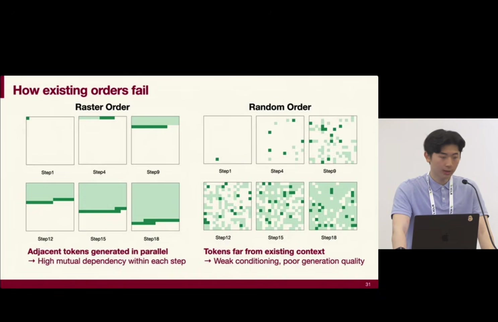

所以这里不是简单“越分散越好”，而是两个条件要同时满足。

## 8. Locality-aware generation ordering 的两个原则

作者把生成顺序设计成两个原则。

第一，当前要生成的 token 要靠近已经生成的 token。这样模型能获得强 context，避免无条件地猜局部结构。

第二，同一批并行生成的 token 之间要彼此远离。这样它们之间的强依赖不会被独立采样破坏。

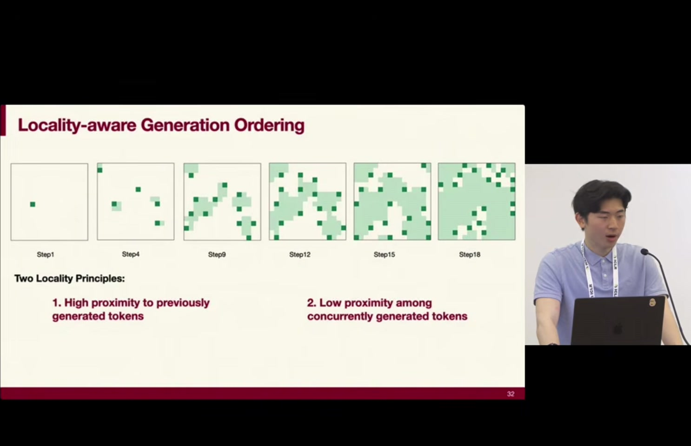

这就是 locality-aware 的含义：利用图像局部相关性，但不是让局部 token 同时生成，而是让每个新 token 靠近已有 context，同时避免同一批 token 之间太近。

## 9. 实验：速度提升来自减少 step，而不是放弃 AR 框架

结果部分显示，在 ImageNet 256 和 512 分辨率上，方法可以显著减少 inference latency，并保持或改善质量。talk 中提到 256 上可达到 13x 或 11x faster，512 上可达到 21x faster；在 text-to-image benchmark 上，速度提升甚至更大。

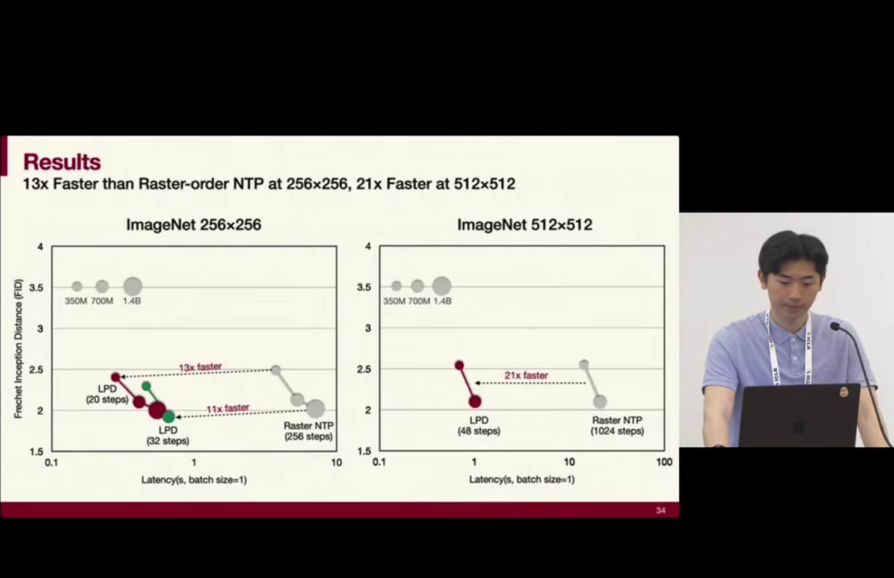

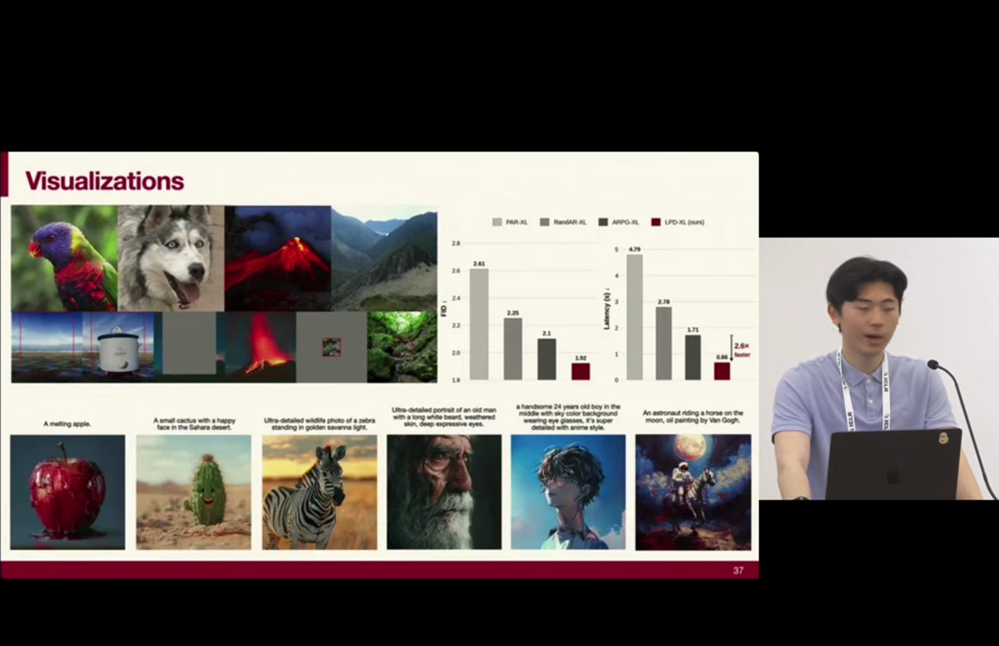

这里的重点是：它不是把 AR 变成 diffusion，也不是放弃 flat token 表示，而是在 AR 内部引入可控并行化。

## 10. Q&A 里的重要补充：并行采样最先坏在哪里

Q&A 里有人问：并行 decoding 推得太远时，最先坏掉的是视觉一致性还是时间一致性？speaker 的回答是，主要 failure mode 是 incoherent or distorted features，因为并行 token 本质上仍然独立采样。

如果要真正 joint sample 一批 token，就需要建模 $V^n$ 级别的联合分布，几乎不可行。locality-aware ordering 不是解决所有 joint sampling 问题，而是降低最危险的局部冲突。

另一个问题把它和 diffusion head 对比。speaker 的判断是，diffusion 可以在某种意义上 joint sample 多个 token，但 diffusion head 往往 compute-bound，效率不一定更好。也就是说，这篇工作的核心 trade-off 是：在保留 AR 多模态兼容性的同时，把最慢的逐 token decoding 尽量并行化。

## 11. 对我们阅读框架的意义

这篇 talk 和 SANA-Video 都在处理生成系统的效率问题，但层次不同。SANA-Video 从 video transformer 和 cache 结构入手，解决长视频中的时空序列成本；Locality-aware Parallel Decoding 从 autoregressive image token order 入手，解决图像 token 生成 step 数过多的问题。

对 synthetic city 或 conditional generation 来说，这篇给出的启发是：生成顺序本身就是 inductive bias。不是所有变量都应该按固定 raster 或随机顺序生成；如果变量之间有空间局部依赖，那么并行生成时就必须同时考虑“靠近已有 context”和“远离同批生成变量”这两个约束。
