# Max Simchowitz: Generative Control, Action Chunking, and Moravec's Paradox

- Video: [RI Seminar: Max Simchowitz: Generative Control, Action Chunking, and Moravec's Paradox](https://www.youtube.com/watch?v=UX1YXcRnFbs)
- Channel: CMU Robotics Institute
- Duration: 56:33
- Transcript: `youtube/transcripts/UX1YXcRnFbs-max-simchowitz-generative-control-action-chunking-moravec/`
- Slides: `youtube/slides/UX1YXcRnFbs-ri-seminar-max-simchowitz-generative-control-action-chunking-and-moravec-paradox/curated/`

这场 RI Seminar 可以看成 Simchowitz 把连续动作 imitation learning 的理论问题翻译给机器人社区。主线是：近年机器人 behavior cloning 确实出现了能力跃迁，但我们不能只把它归因于“大模型大数据”。他把可能的结构性原因拆成两个 intervention：action chunking 和 generative control。

## 1. 00:01-05:17：Moravec's paradox 重新定位机器人难题

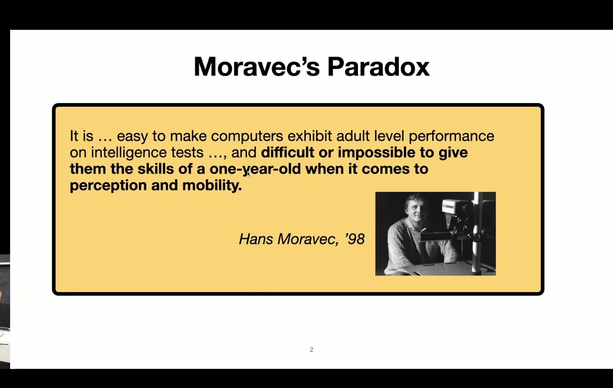

开场用 Moravec's paradox 作为入口：对人类容易的感知运动技能，对机器人反而很难。高层推理、棋类、语言任务可以被大型模型快速推进，但真实接触、操作、抓取、移动这些低层身体技能仍然困难。

Simchowitz 并不否认近年机器人 BC 的进步。他关注的是：这个 inflection point 来自哪里。是数据规模、模型规模、视觉 backbone，还是某些控制接口的结构变化？

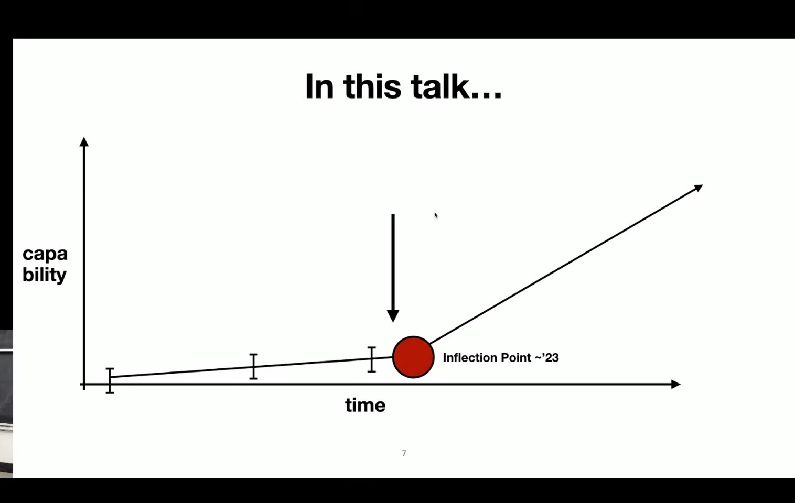

talk 很快给出路线图：先讲 action chunking，再讲 generative control。这个拆分很重要，因为它把工程进步拆成可分析的机制。

## 2. 05:17-13:06：robotic BC 的问题是 test-time error

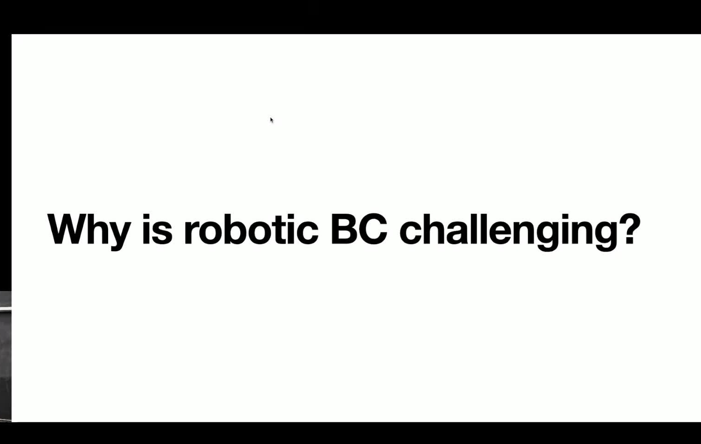

机器人 BC 的表面目标是拟合 expert actions。但真正关心的是 test-time system performance：policy 部署后，机器人是否完成任务。监督学习 loss 在 expert distribution 上低，不代表部署轨迹上错误也低。

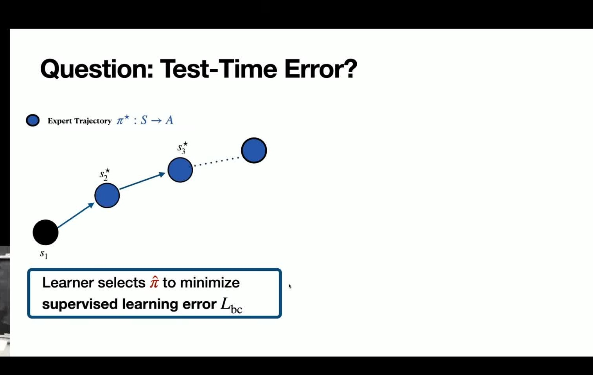

这和 RL Theory Seminar 的核心一致：policy 输出动作，动作改变状态，状态又成为下一步 policy 输入。这个闭环让小误差可能变成轨迹级失败。连续动作尤其麻烦，因为错误不是离散的对错，而是几何偏移。

## 3. 19:35-24:46：action chunking 改变时间尺度

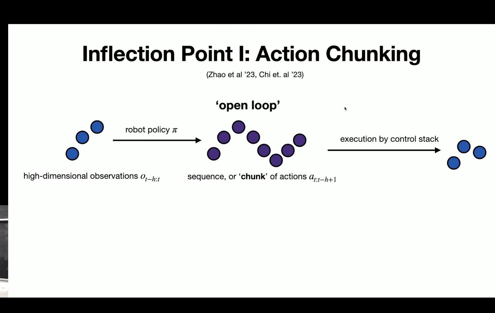

Action chunking 的核心是：policy 不再每个时间步只输出一个瞬时动作，而是输出一段动作序列。这样控制接口从高频点动作变成低频局部计划。

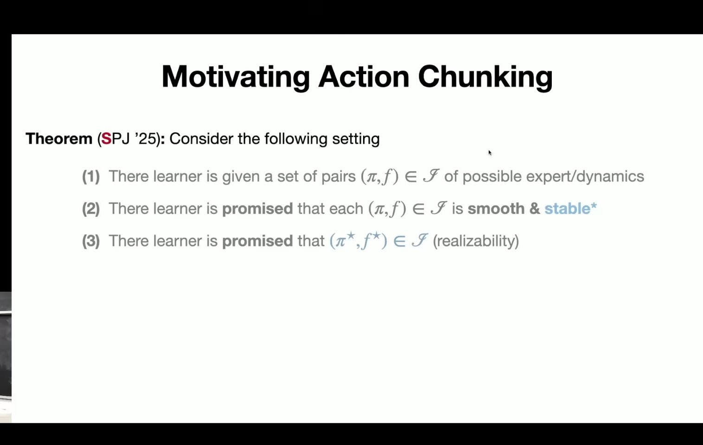

这有两个效果。第一，它减少了每一步监督误差进入闭环的频率。第二，它让 policy 学的是一段局部行为形状，而不是每一帧的动作点估计。对接触丰富的任务，这种局部轨迹可能比瞬时动作更稳定。

但 Simchowitz 很快强调 no free lunch。action chunking 的正面结果依赖某种 open-loop stability：一段动作执行出去后，系统不能因为没有每一步反馈就迅速偏离可恢复区域。

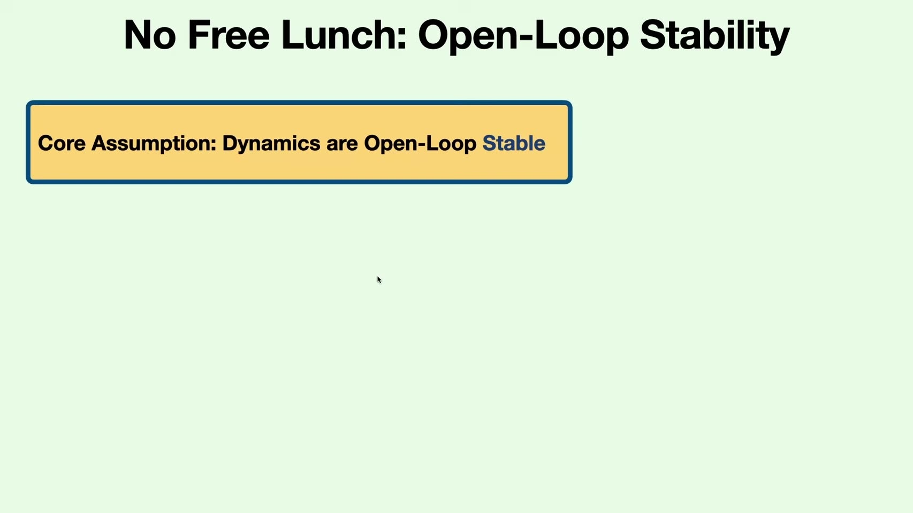

所以 action chunking 不是魔法。它改变了误差传播方式，但最终仍然要受 dynamics stability 约束。

## 4. 27:06-35:36：generative control 不只是多模态动作分布

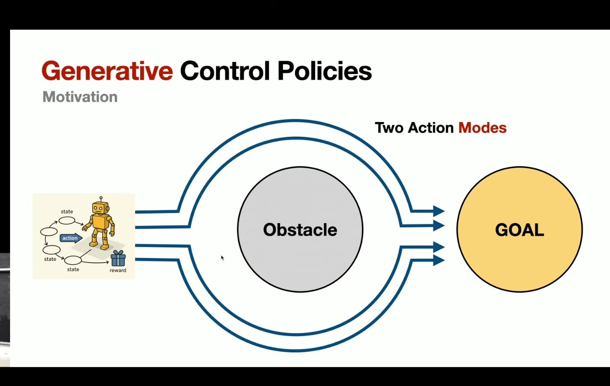

第二个 intervention 是 generative control policies。常见解释是多模态：同一个任务可能有多种完成方式，普通 regression 会把多种动作平均成一个无效动作，生成式 policy 可以采样不同模式。

Simchowitz 对这个解释更谨慎。他通过 taxonomy 和实验问题指出，GCPs 的收益未必只来自 distribution learning。即使某些多模态结构被削弱，生成式 policy 有时仍然保留优势。

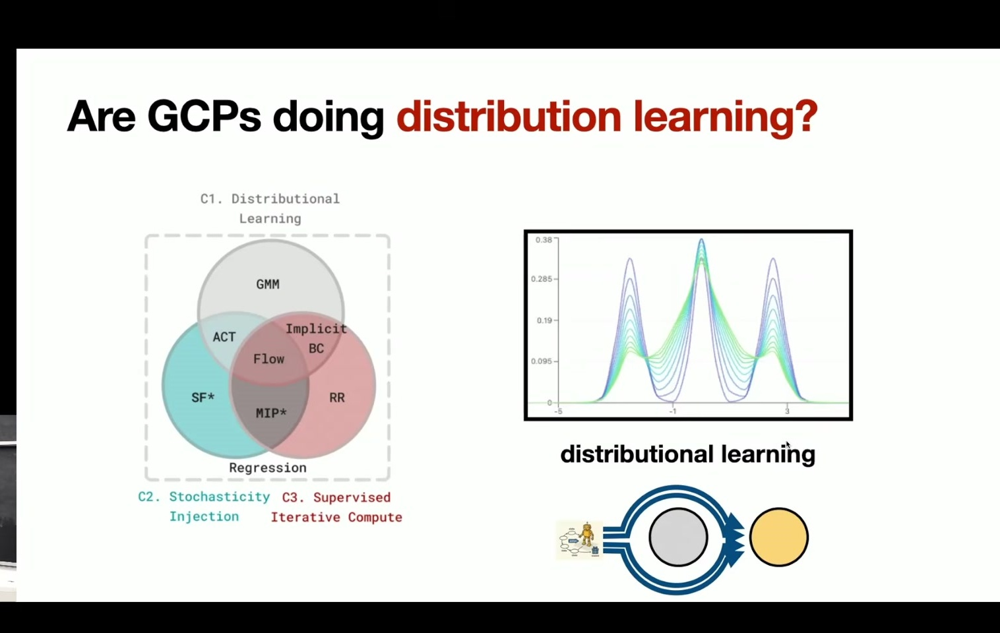

这迫使我们问一个更深的问题：generative model 作为 policy 时，除了表达分布，还提供了什么计算结构？

## 5. 39:17-46:05：GCP 可能提供 inference-time computation

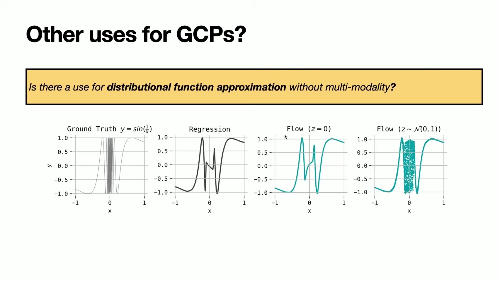

后半段给出的更强解释是：generative control 可能在动作空间里提供一种 iterative computation。diffusion、flow 或 sampling 过程不是一次性回归动作，而是在推理时逐步构造动作候选。这相当于给 policy 额外的 test-time compute。

这点和多模态解释不同。多模态说的是“能表示多个答案”；inference-time computation 说的是“能在生成过程中搜索、修正、逐步靠近好答案”。对机器人接触任务，这种迭代过程可能比单次前向回归更适合复杂动作地形。

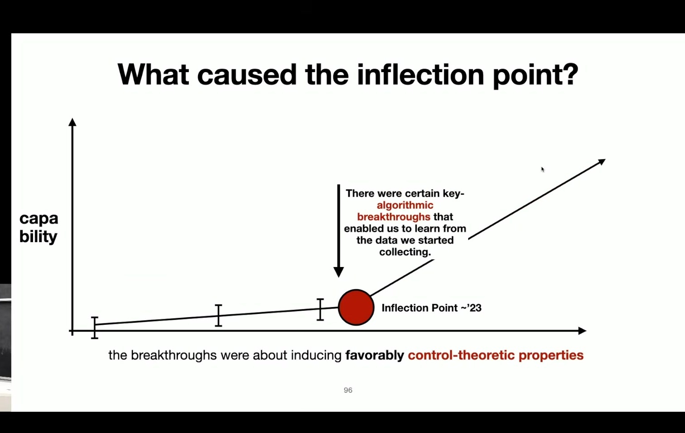

最后回到 inflection point：action chunking 改变时间尺度，generative control 改变 action representation 和 inference structure。二者共同解释了为什么近年 BC 系统突然更能做真实机器人任务。

## 6. 和当前研究线的连接

这场 talk 适合和三类材料放在一起：

- 和 Simchowitz RL Theory Seminar：理论 talk 解释 continuous-action imitation 为什么会坏，RI talk 解释近期机器人系统为什么可能变好。
- 和 LeCun world model：LeCun 强调 action-conditioned prediction 和 planning，Simchowitz 强调即便是 imitation/control，也必须处理稳定性和 test-time computation。
- 和 generative model for control：diffusion policy、flow policy、ACT 等不是简单把图像生成模型搬到机器人，而是在控制接口上重写 action representation。

最值得保留的一句话是：action chunking 和 generative control 都不是“更花哨的 BC”，它们分别改变了时间尺度和动作空间计算方式，因此可能直接触碰连续控制中误差放大的核心问题。
