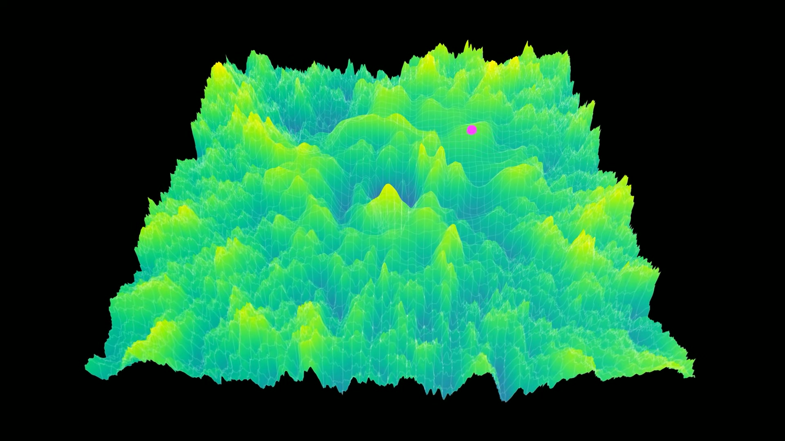
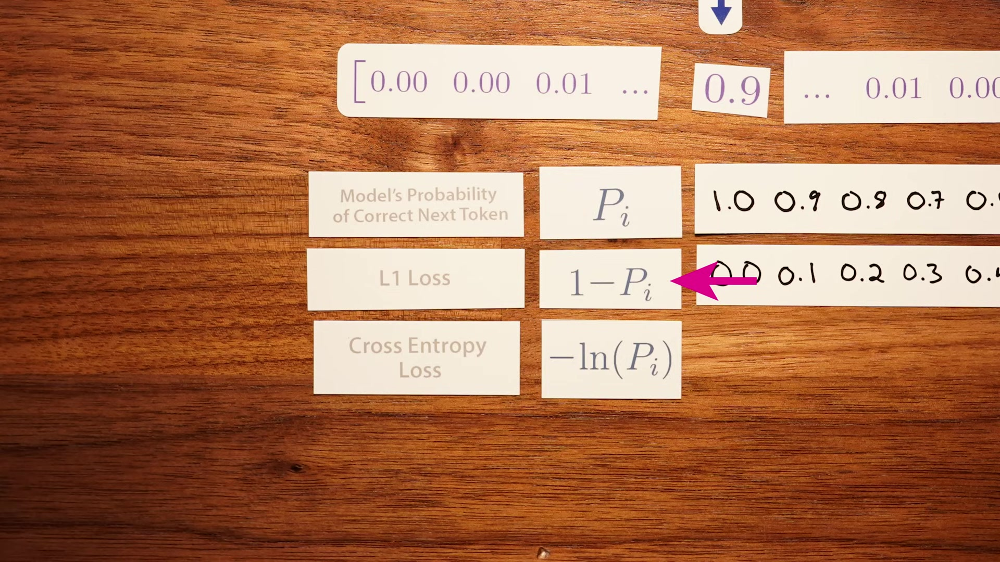
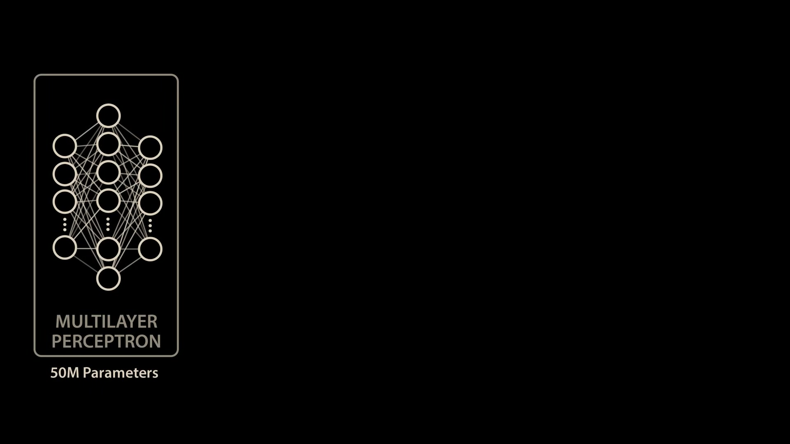
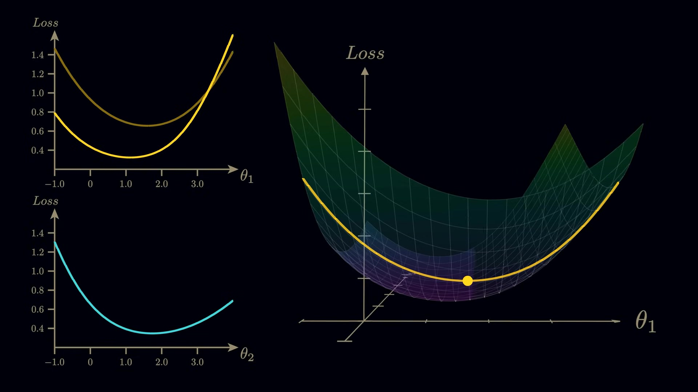
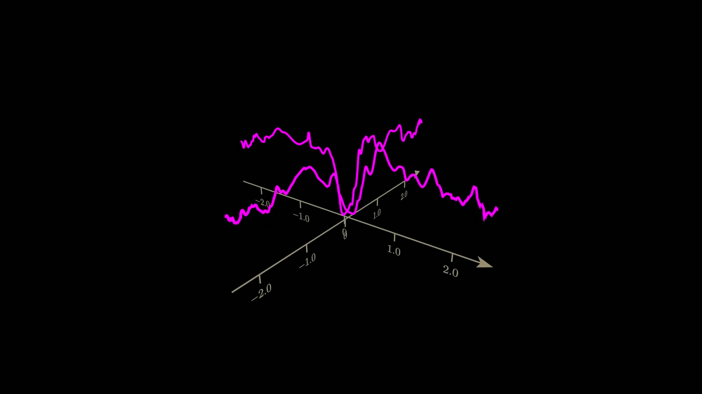
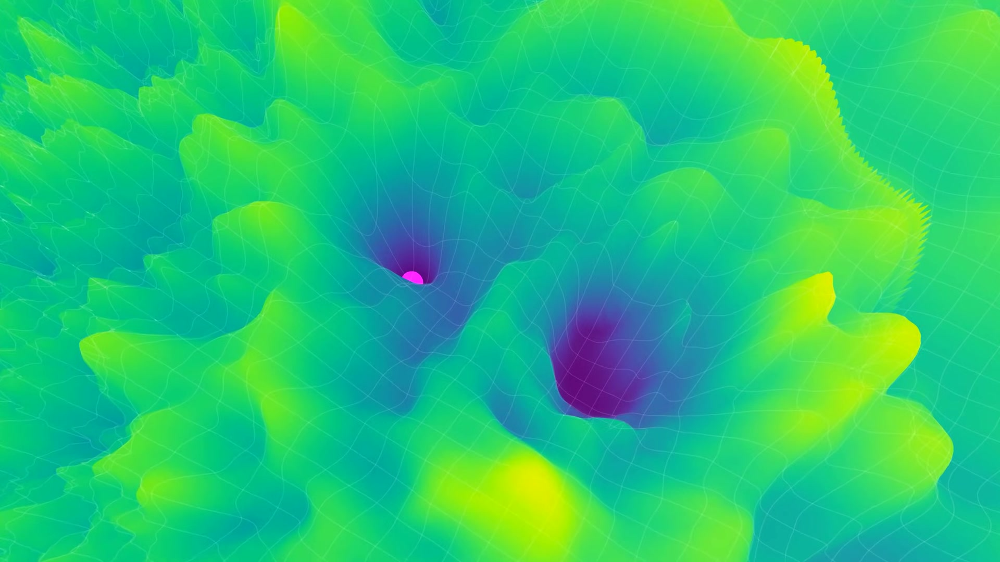
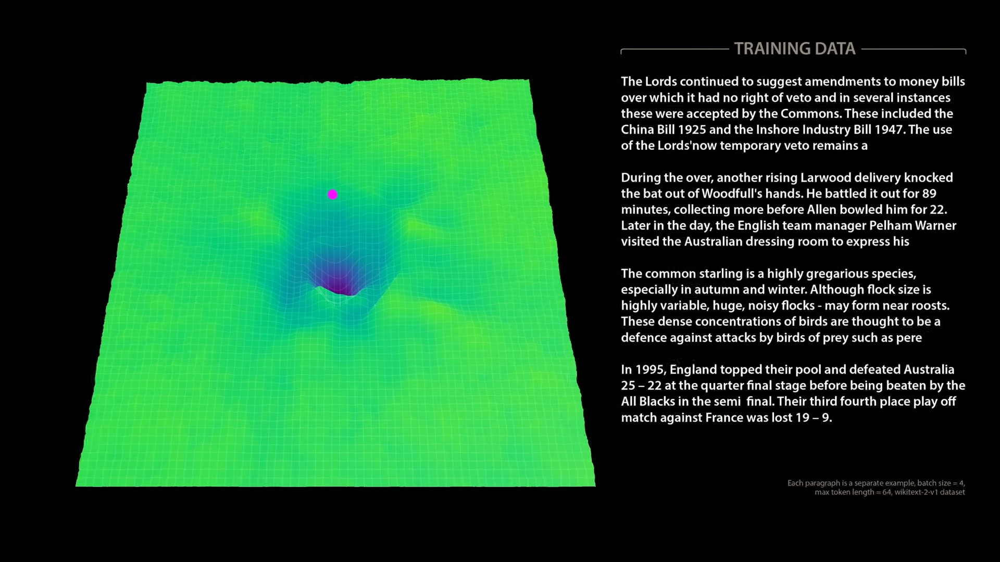
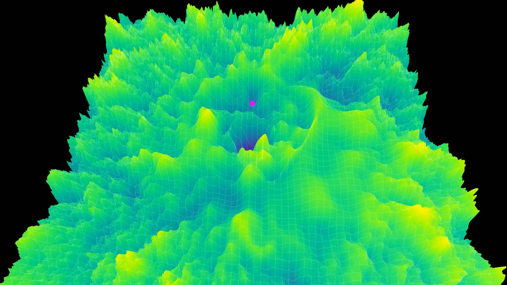

# Welch Labs: The Misconception that Almost Stopped AI

- Video: [The Misconception that Almost Stopped AI](https://www.youtube.com/watch?v=NrO20Jb-hy0)
- Series: How Models Learn, Part 1
- Channel: Welch Labs
- Duration: 22:56
- Transcript: `youtube/transcripts/NrO20Jb-hy0-the-misconception-that-almost-stopped-ai-how-models-learn-part1/`
- Slides: `youtube/slides/NrO20Jb-hy0-the-misconception-that-almost-stopped-ai-how-models-learn-part-1/semantic_curated/`

这集视频的核心不是解释 gradient descent 的标准比喻，而是拆掉这个比喻。我们常把模型训练想象成一个点在二维山谷上往下走，担心它卡在 local minimum。视频用 Llama 3.2 的真实 loss landscape 可视化说明：这个图像对低维模型有用，但对十亿参数模型只是一个极低维投影。真正的学习更像在高维空间里移动以后，原来看到的二维切片本身发生变化。

## 1. 00:00-03:10：local minima 曾经让神经网络训练看起来不可行

开头先把问题放在历史语境里。Hinton 早期曾经怀疑用 gradient descent 训练多层神经网络，因为低维直觉告诉我们：如果 loss landscape 有很多局部低谷，模型很容易掉进去，之后再也出不来。

现代深度学习显然没有被这个问题挡住。于是视频的问题变成：早期直觉哪里错了？是因为没有 local minima，还是因为高维模型里 local minima 的含义和二维图像完全不同？

## 2. 03:08-07:22：从 next-token prediction 到 cross entropy loss

视频用一个具体语言模型例子建立训练对象。给定一句话，模型把文本切成 token，并在每个位置预测下一个 token 的概率分布。以“the capital of France is Paris”为例，模型在某个位置会给 Paris 一个概率，也会给其他可能 token 一个概率。

训练需要一个数字衡量预测好坏。直接用“1 减去正确 token 概率”可以表达错误，但现代语言模型更常用 cross entropy loss。它的直觉是：正确答案概率越低，惩罚增长越快。训练 LLM 就是在海量 token 位置上持续降低这个 loss。

这一步为后面可视化铺路：loss 不是抽象目标，而是由模型参数、输入文本和目标 token 共同决定的标量。

## 3. 07:20-12:40：单个参数和两个参数的可视化说明参数之间强耦合

视频先尝试只改变 Llama 的一个参数，看正确 token 概率和 loss 如何变化。对单个参数而言，我们可以画出一条曲线，甚至看起来能找到一个最佳参数值。

但这个想法马上失败。改变第二个参数后，第一个参数对应的 loss 曲线形状也会改变。也就是说，模型参数不是独立旋钮。每个参数对输出的作用都依赖其他参数当前取值。

把两个参数一起可视化时，可以画出一个小小的 loss surface；但 Llama 有十亿级参数。如果每个参数只试很少几个值，组合数量也会爆炸到不可计算。于是穷举 loss landscape 不可能，必须依赖 gradient：在当前位置计算每个参数方向上的局部 slope，然后朝 loss 下降方向走一步。

## 4. 13:02-16:43：二维 loss landscape 只是高维空间的随机切片

为了可视化十亿参数模型，视频选择两个随机方向，在这两个方向上移动模型参数并测量 loss。这样得到的二维图像看起来确实像山地，有坡、谷、悬崖和平台。

但这个图像非常容易误导。它不是模型真实 loss landscape 的地图，只是从当前位置沿两个随机方向看到的切片。gradient descent 在训练时并不局限于这两个方向，而是在完整高维空间里移动。只要真正的好方向不落在可视化平面上，二维图里就看不到它。

这解释了为什么“局部谷底”在高维里不再像二维图上那么可怕。要真正卡住，模型需要在所有参数方向上都没有可下降方向。维度越高，这种完全被围住的情形直觉上越不典型。

## 5. 17:01-20:31：wormhole 现象说明切片会随学习改变

视频最有价值的部分是所谓 wormhole visualization。作者只用一个短句训练模型时，参数实际上只移动了一点点，但二维可视化里的低 loss 区域像突然打开一样出现。看起来不是模型慢慢走到山谷底部，而是山谷本身从原图里冒出来。

原因是：gradient descent 在完整高维空间里移动后，我们再沿同样两个随机方向看出去，看到的是一个新的切片。高维位置稍微改变，低维切片的形状就可能大变。二维画面中的“地形变化”不是物理地形在移动，而是观察视角变了。

当训练从单句改成 WikiText batch 后，这个现象变得更平滑。每个 batch 会让当前附近 loss 下降，但换到下一个 batch，局部地形又会改变，上一批学到的收益也会部分消失。真实训练就是在这种 batch-to-batch 的高维切片变化中逐步找到泛化较好的参数区。

## 6. 20:29-22:57：这集真正留下的直觉

这集不是说 loss landscape visualization 没用，而是说它们不能被当作真实地图。对线性回归或两参数模型，loss surface 可以完整表达学习过程；对十亿参数模型，它只是一个 shadow。

因此，早期对 local minima 的担心不是完全荒谬，而是过度依赖低维图像。高维空间里可能存在大量近在咫尺、但在任意二维切片里不可见的下降方向。gradient descent 的强大之处，恰恰在于它能用 backprop 计算完整高维 gradient，而不是靠人类可视化的二维直觉。

这集自然接到第二集：既然关键是高维 gradient，那么问题就变成，backpropagation 如何在巨大模型里高效算出每个参数应该怎么动。
