# Welch Labs: Can Yann LeCun Reshape AI (again)?

- Video: [Can Yann LeCun Reshape AI (again)?](https://www.youtube.com/watch?v=v_jDvpEGTIg)
- Channel: Welch Labs
- Duration: 40:57
- Transcript: `youtube/transcripts/v_jDvpEGTIg-yann-lecun-can-reshape-ai-again-part2/`
- Slides: `youtube/slides/v_jDvpEGTIg-can-yann-lecun-reshape-ai-again/semantic_curated/`

这期视频是 Welch Labs JEPA 系列的第二部分，核心问题不是“LeCun 是否反对 LLM”，而是：如果目标是能控制机器人、预测动作后果、并在世界中规划的 agent，那么 VLA 这种从 vision-language 直接到 action 的路线是不是缺少一个明确的 world model。视频的叙事顺序是从视觉编码器开始，经过 vision-language model，再到机器人控制，把 JEPA 当作一条逐层替代主流 VLA stack 的路线。

## 1. 00:00-02:44：问题从 VLA demo 进入 LeCun 的批评

开头用 Physical Intelligence 的机器人 demo 建立冲突。VLA 模型看起来已经能剥蔬菜、折纸、倒垃圾，似乎是当前 embodied AI 最强路线之一。但 LeCun 的判断非常激进：这类模型会失败，因为它们没有显式预测行动后果的能力。

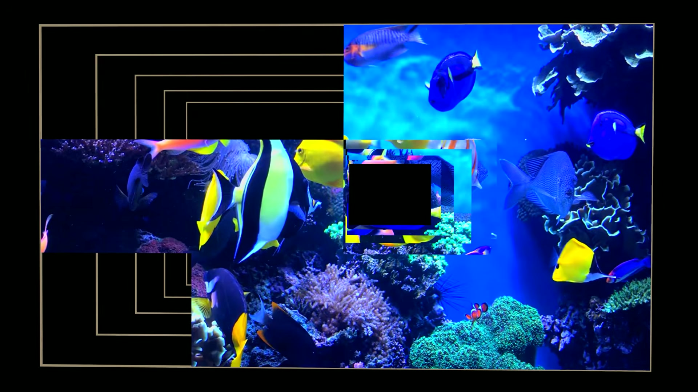

视频没有马上站队，而是把问题拆成三层：视觉 encoder 怎么学，vision-language model 怎么学，robot control system 怎么规划。这个拆法很重要，因为 JEPA 不是一个单点模型，而是一种把 prediction target 从表面输出换成 embedding output 的训练原则。

## 2. 02:42-08:31：从 CLIP 到 V-JEPA2，视觉表示不一定要由语言监督

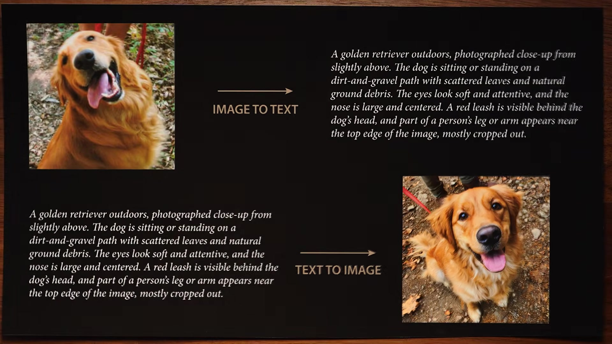

CLIP 的逻辑是把 image 和 caption 对齐。图像进 vision encoder，文字进 text encoder，匹配的图文 pair 在 embedding space 里靠近，不匹配的 pair 拉远。这条路线非常成功，因为它把视觉表示接到了语言模型可以使用的空间里。

V-JEPA2 则走另一条路。它不靠 caption，也不让语言定义视觉概念，而是在视频里遮掉 patch，让模型预测缺失部分的 embedding。训练目标不是“这张图该配哪句话”，而是“当前视频片段隐含了什么可预测结构”。LeCun 的哲学在这里很清楚：真实智能的起点不是语言，而是世界本身。

关键实验结果是，V-JEPA2 虽然没有语言监督，仍然可以和语言模型对齐，并在视频理解 benchmark 上取得很强结果。这一点反驳了一个常见直觉：视觉表示如果不是语言监督出来的，就很难被 VLM 使用。视频把它解释成 JEPA 路线的第一层优势：世界结构可以先独立学出来，再对齐到语言。

## 3. 08:29-14:12：VL-JEPA 把 VLM 的输出目标从 token 换成 text embedding

视频接着问：能不能把 JEPA 原则扩展到完整 VLM，而不只是视觉 encoder。

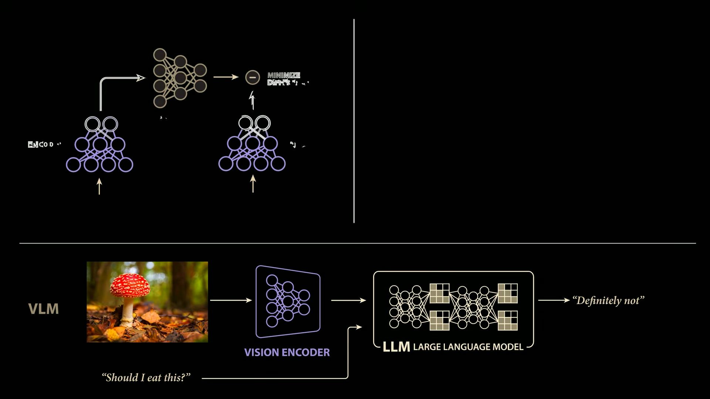

标准 VLM 接收图像 embedding 和 prompt，然后自回归地产生文本 token。JEPA 式 VLM 不直接生成目标文本，而是把目标文本也送进 encoder，训练 predictor 去预测目标文本的 embedding。这样，训练目标从“说出这一串具体 token”变成“预测语义上正确的输出表示”。

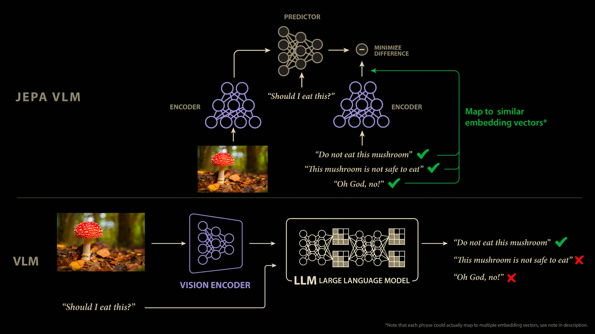

这个差别在视觉问答里很明显。比如图中蘑菇能不能吃，正确答案可以有很多措辞。自回归训练只把数据集里的某一种 phrasing 当成目标，其他语义等价回答会被惩罚。VL-JEPA 则把这些回答映到相近 embedding，减少了对表面措辞的过拟合。

视频引用 Meta 的结果说明，VL-JEPA 在相同视觉 encoder、相同数据和训练配置下，学习效率明显高于传统 VLM，并且小模型可以在一些视觉问答 benchmark 上超过更大模型。限制也很清楚：VL-JEPA 默认不是生成模型，它输出 embedding。实际使用时可以用候选答案检索，也可以额外训练 decoder 把 embedding 转回文本。

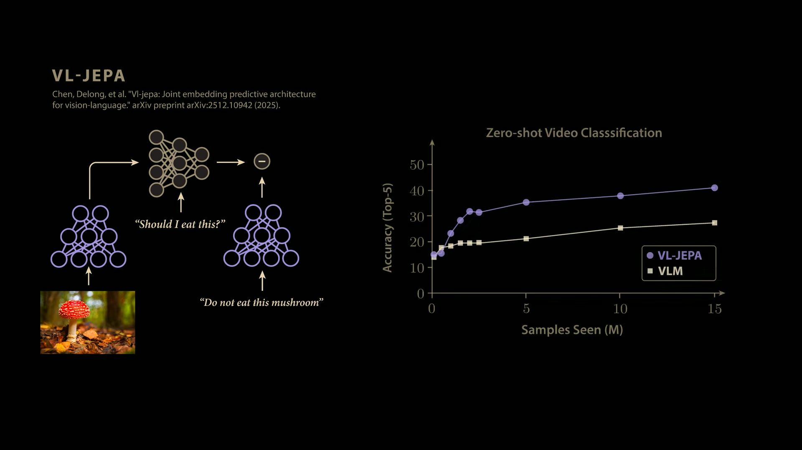

## 4. 17:06-22:27：LeCun 对 VLA 的两点批评

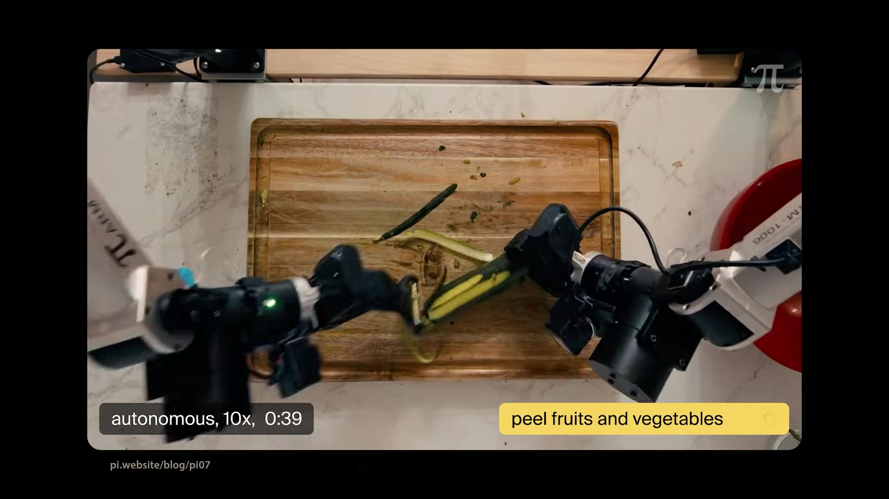

VLA 模型把 vision-language backbone 接到 robot action 上，训练时通常依赖大量 human demonstrations。LeCun 的第一点批评是 behavioral cloning 难以覆盖真实世界的变化。机器人可以在相似任务上泛化，但如果环境、物体、目标或接触方式偏离 demonstration distribution 太远，它就容易失效。

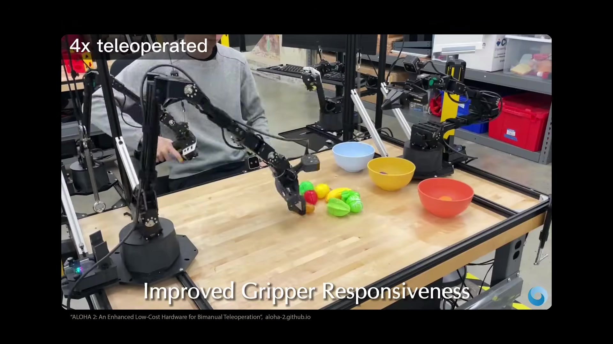

第二点批评更根本：VLA 通常是 end-to-end action prediction。每一步输入图像、语言和关节状态，输出下一段控制信号。模型可能内部形成某种隐式计划，但系统没有一个可以显式 roll out 的 consequence model。LeCun 认为可靠 agent 必须能在行动前预测动作后果，并把 inference 变成 search 或 optimization，而不是只做自回归动作生成。

这一步把 JEPA 和 Fei-Fei Li 的 taxonomy 接起来：VLA 更像 planner，直接输出 action；LeCun 要的是 simulator/world model，先预测 state transition，再用它规划 action。

## 5. 22:25-30:41：Push-T 例子展示 JEPA 如何变成 action-conditioned world model

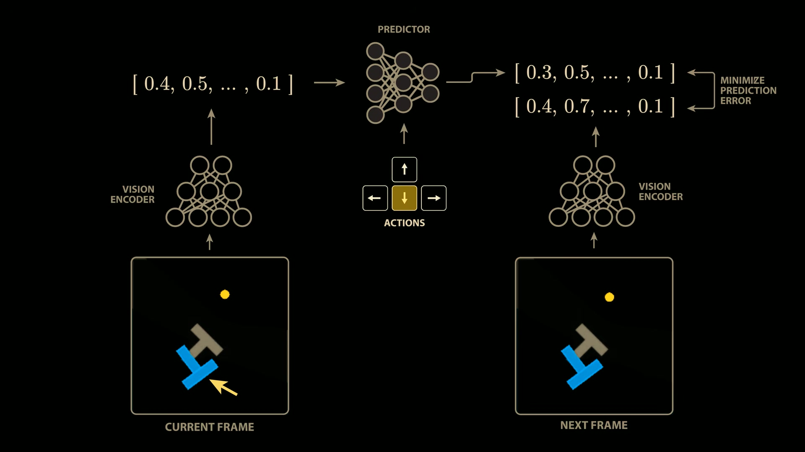

视频用 Push-T 任务具体解释 JEPA 机器人路线。机器人需要把一个 T 形物体推到目标位置，动作看起来只有上下左右，但由于物体会平移和旋转，动力学并不简单。

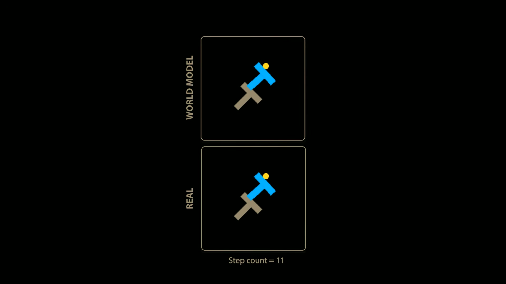

训练时，JEPA 接收当前图像 embedding 和 action，预测下一帧图像的 embedding。注意模型不是学习“人会怎么推”，而是学习“如果采取某个动作，世界会怎么变”。为了可视化，可以额外训练 decoder 把预测 embedding 转回图像，结果像一个学出来的简化物理模拟器。

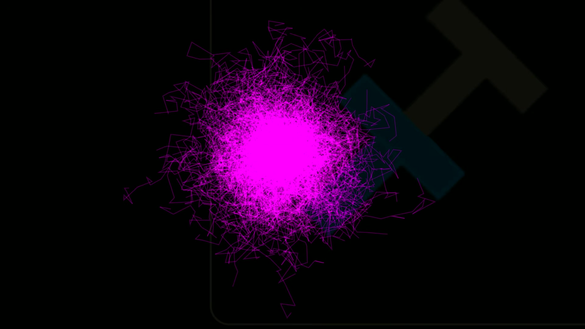

有了这个 world model 后，规划就可以显式进行。给定初始图像和目标图像，先把目标图像编码成 goal embedding；再采样很多候选 action trajectories，用 world model roll out 每条轨迹；最后比较预测终点 embedding 和 goal embedding 的距离。视频里的 cross entropy method 会保留表现最好的轨迹，再围绕它们重采样，逐步收敛到可执行方案。

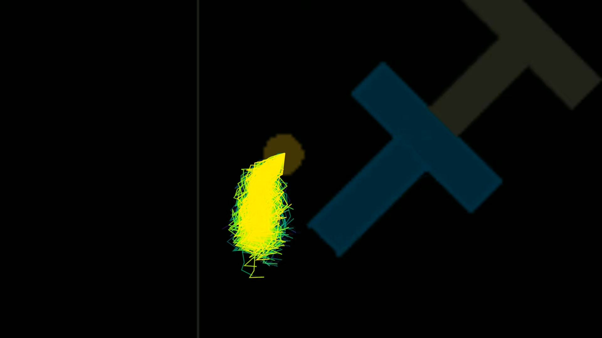

这个系统干净地回应了 LeCun 对 VLA 的批评：它不只是模仿 human actions，而是用 action-conditioned dynamics 搜索行动序列。但视频也很诚实地指出，当前 JEPA world model 在机器人性能上远落后于 VLA，能稳定规划的 horizon 很短。

## 6. 31:01-35:25：长 horizon 的答案是 hierarchy

LeCun 对长时程规划的回答是 hierarchical world model。低层模型保留大量细节，只做短期预测；高层模型丢掉部分细节，做更长 horizon 的抽象预测。原因很直接：细节越多，预测越快偏离现实；想预测更远，就必须抽象。

他用从纽约办公室去巴黎的例子说明：人不会用毫秒级肌肉控制规划整趟旅程，而是先计划去机场、坐飞机、抵达巴黎，再把每个子目标交给低层控制。这个 hierarchy 不需要语言作为接口，猫也能做层级规划。理想情况下，JEPA 通过短期低层预测和长期高层预测，自监督地学出合适的抽象层级。

## 7. 35:23-40:49：JEPA 的短期验证场景可能不在家务机器人，而在复杂系统控制

视频最后让 LeCun 说明未来几年怎么判断 JEPA 是否在起效。他没有只说机器人，而是提到 jet engine、airplane、chemical plant、power plant、patient treatment、stem cell differentiation、materials 和 catalysts 这些复杂系统。

共同点是：这些系统不能简化成少数显式方程，但又需要预测和控制。如果能从数据中学到 phenomenological world model，再用它做 planning/control，JEPA 的价值就不只限于机器人抓取。

这对本项目的接口很明显。synthetic city、urban dynamics、population synthesis 也属于难以写出完整方程但有大量观测和约束的复杂系统。JEPA 的启发不是“也去做机器人”，而是：能不能学一个可预测的 latent state，让控制、约束对齐和干预模拟发生在 latent dynamics 里。
