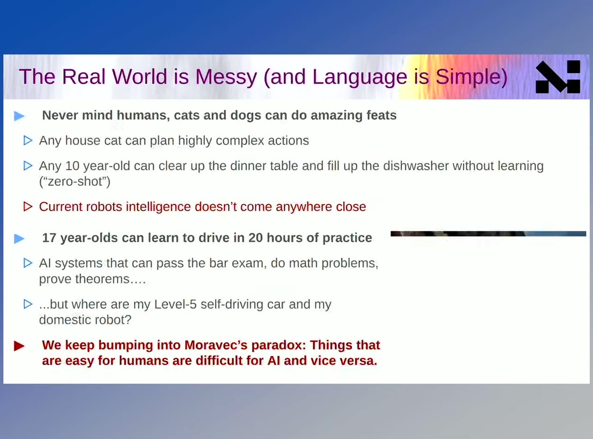
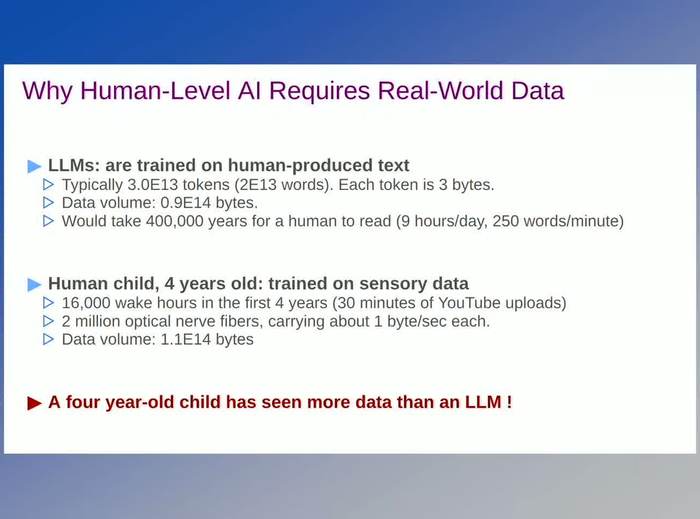
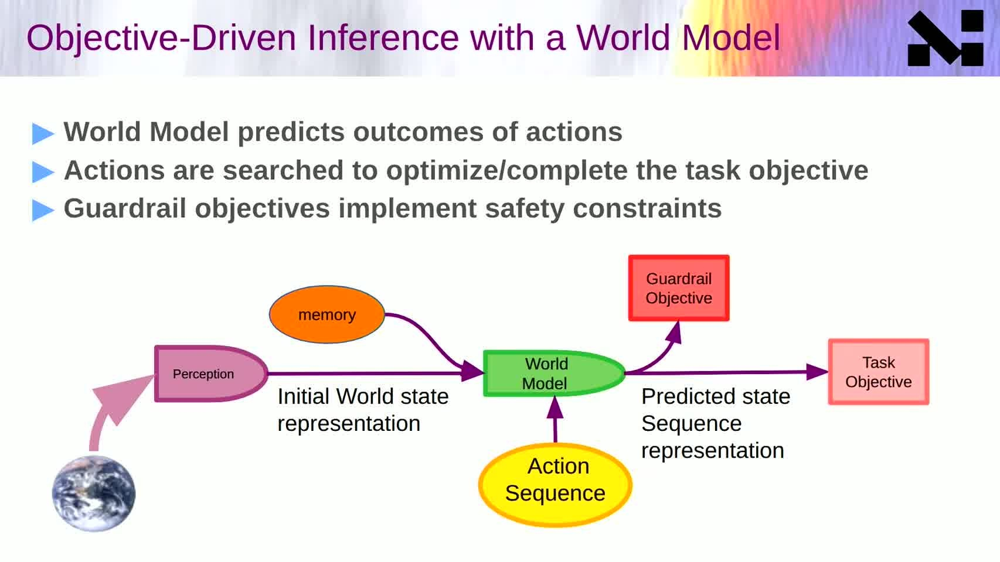
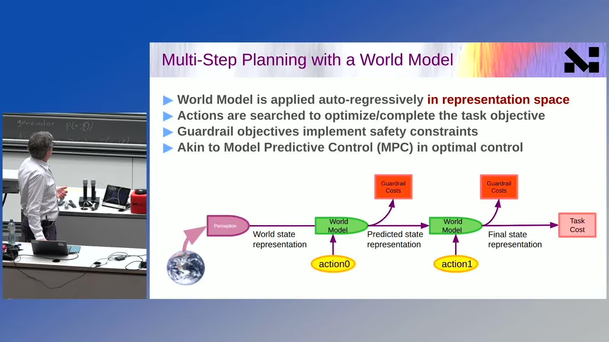
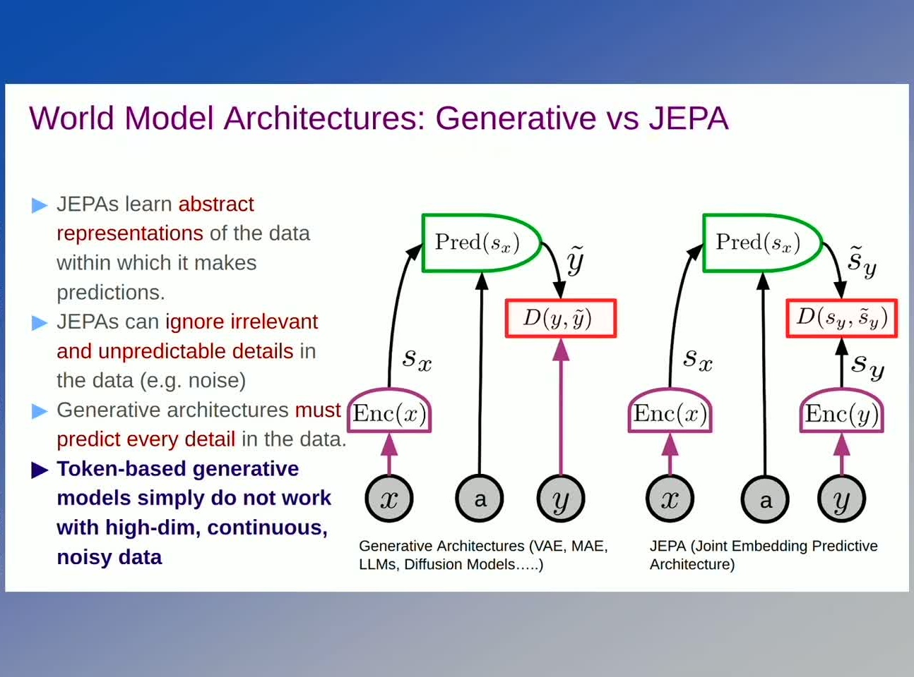
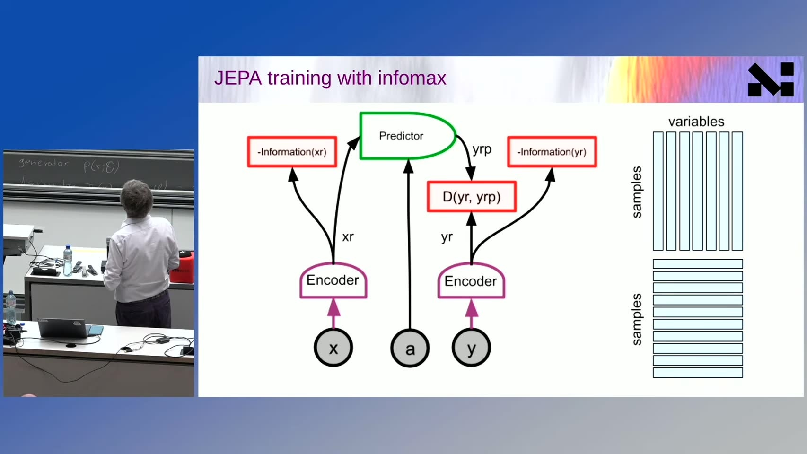
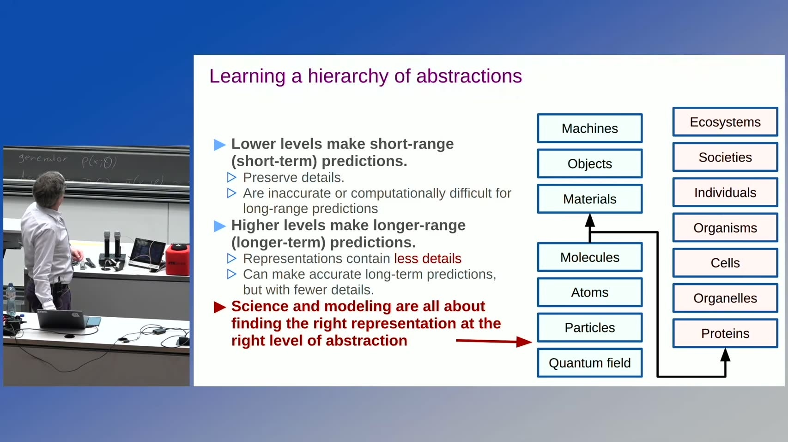
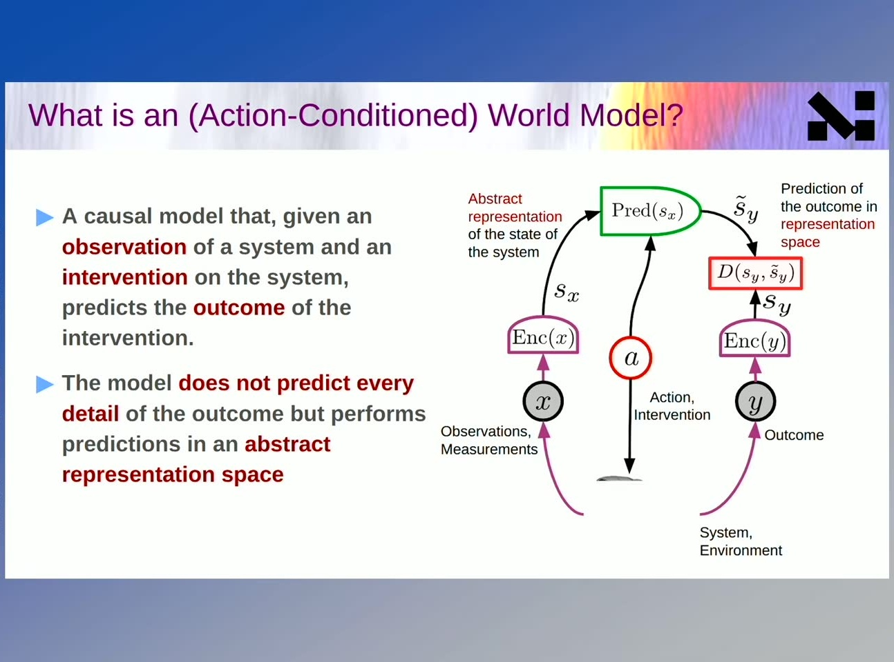
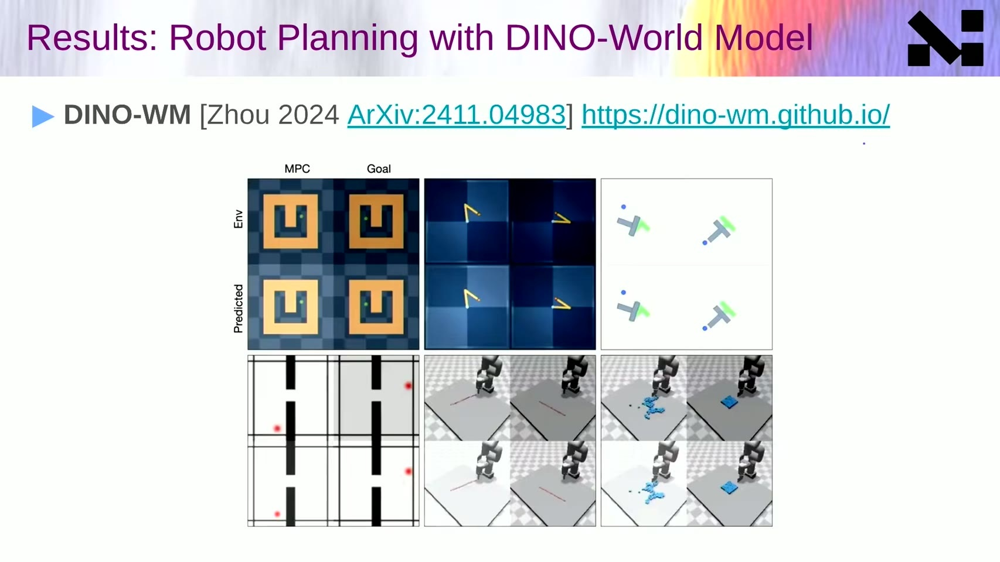

# Yann LeCun: World Models: Enabling the next AI revolution

- Video: [Yann LeCun: World Models: Enabling the next AI revolution](https://www.youtube.com/watch?v=72Xj8k5WQX4)
- Channel: Computer Vision and Geometry Group, ETH Zurich
- Duration: 58:54
- Transcript: `youtube/transcripts/72Xj8k5WQX4-yann-lecun-world-models-enabling-next-ai-revolution/`
- Slides: `youtube/slides/72Xj8k5WQX4-yann-lecun-world-models-enabling-the-next-ai-revolution/curated/`

这场 talk 的主线不是“LeCun 反对 LLM”，而是他试图把下一代 AI 的问题重新定位：真正的 agent 需要从现实世界数据中学习可预测的 latent world model，并用这个模型做目标驱动的规划。语言模型可以很强，但语言不是世界本身，next-token prediction 也不是行动智能的完整形态。

## 1. 00:00-10:12：机器学习和人类/动物学习之间还有断层

LeCun 开场故意说 machine learning sucks，意思不是现有模型没用，而是它们和人类、动物的学习效率相比仍然很差。人和动物能用极少样本学会新任务，有物理常识，能在没见过的场景里做 zero-shot 行动。当前 AI 系统虽然在文本、图像、代码上很强，但面对真实世界的连续状态、长时程行动和因果后果时仍然脆弱。

他随后把矛头指向语言中心主义。语言是人类经验的压缩产物，不是原始经验。小孩通过视觉、触觉、运动和交互获得的世界数据量巨大，而文本只记录了人类选择写下来的部分。如果智能体要在世界中行动，只靠人类文本不够。

这一步奠定了整场 talk 的问题意识：下一代 AI 需要 grounded learning，需要接触高带宽的真实世界感知数据。

## 2. 14:10-18:32：agentic system 的分叉点是有没有 world model

LeCun 把 agentic system 拆成两条路线。一条是 reactive 或直接映射式系统：输入 observation 和 goal，直接输出 action。另一条是 objective-driven system：内部有 world model，可以预测如果采取某个 action，未来 latent state 会怎样变化。

第二条路线的关键不是“生成未来画面”，而是“在内部模拟行动后果”。agent 有当前状态表示、目标或成本函数、动作候选和 world model。它可以在内部 rollout 多步动作，比较这些轨迹是否把状态推向目标，再选择动作。

这里的理论形状很接近控制：状态、动作、转移、代价、规划。区别在于状态不是手写物理变量，而是 learned latent representation。

## 3. 21:28-35:35：为什么不要直接预测像素

LeCun 对纯 generative prediction 的批评集中在一个问题：现实世界的未来是多解的，高维像素细节里有大量不可预测噪声。给定当前视频帧，未来可能有很多合理分支。如果训练目标要求模型生成下一帧像素，模型往往会在多种未来之间平均，得到模糊结果。

他的答案是 JEPA：不要预测表面输出，而是在 representation space 里预测。当前输入被编码成 latent，目标输入也被编码成 latent，predictor 学的是当前 latent 到未来 latent 的关系。这样模型可以忽略不可预测的低层细节，保留对对象、空间、物理和任务有用的结构。

这一步也引出 collapse prevention。只预测 embedding 容易退化成所有东西都映到同一个表示，所以 JEPA 需要额外机制让 representation 保持信息量。LeCun 在 talk 中把这个问题和 energy-based objective、architecture 约束放在一起讲。

## 4. 37:06-41:14：世界模型必须分层，并且要 action-conditioned

长时程预测不能一直停留在同一粒度。人类规划一趟旅程时，不会从肌肉动作级别模拟每一秒，而是先规划城市、机场、航班、交通，再把子目标交给低层控制。LeCun 用 hierarchy of abstractions 表达这个思想：越往高层，细节越少，horizon 越长；越往低层，细节越多，horizon 越短。

更关键的是 action-conditioned world model。一个只预测“未来可能怎样”的模型还不够，agent 需要预测“如果我做这个动作，未来怎样”。这才把 representation learning 接到 planning/control。

## 5. 48:11-56:58：I-JEPA、DINO、V-JEPA 是通往 embodied planning 的积木

talk 后半段把前面的原则落到现有系统：I-JEPA、DINOv2、V-JEPA 这类模型说明，视觉表示可以不靠像素重建或语言标签，也能学出可迁移的结构。LeCun 特别强调这些表示对视频理解、深度估计和机器人规划的意义。

但他也没有把现状说成已经解决。真正困难的是把 representation、action-conditioned prediction、long-horizon planning 和 real-world robustness 接起来。V-JEPA 等工作更像路线证明：latent predictive representation 是可能的，而且比直接像素生成更接近 world model 的需求。

## 6. 和当前研究线的连接

这场 talk 可以和三条线对接：

- 和 3Blue1Brown entropy 线：压缩和预测要发生在合适的表示空间里，不一定是 token 或像素表面。
- 和 VLA/robotics 线：直接从 observation 到 action 的 behavior cloning 不等于 world model；可靠 agent 需要可 rollout 的 consequence model。
- 和复杂系统建模线：城市、材料、化学过程、患者治疗这类系统也未必有完整可写方程，但可以尝试学习可预测、可规划的 latent state。

最值得保留的判断是：LeCun 的路线不是少用预测，而是换掉预测对象。下一代 AI 的核心预测对象不是下一个 token，也不是完整下一帧，而是和行动后果相关的 latent world state。
