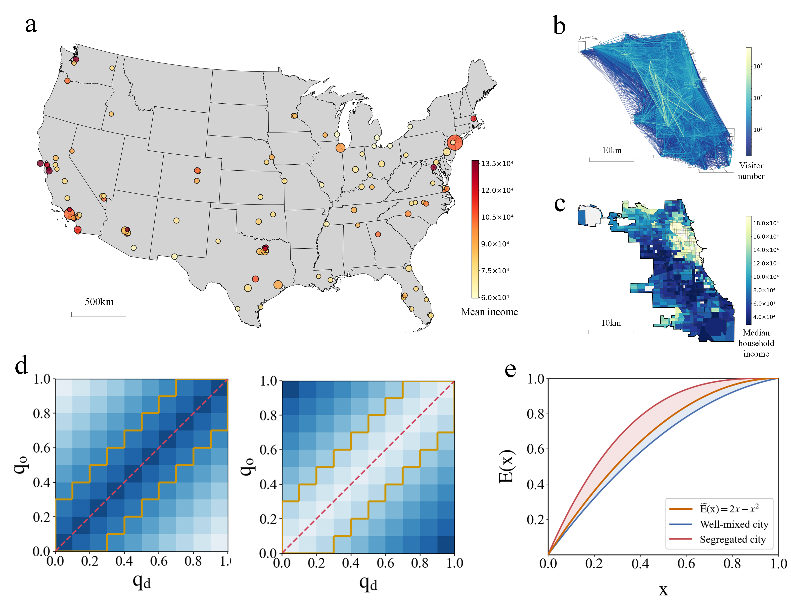
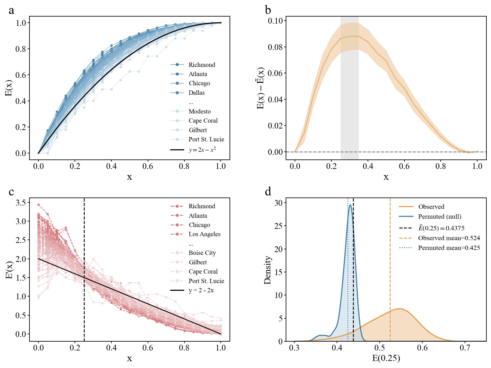
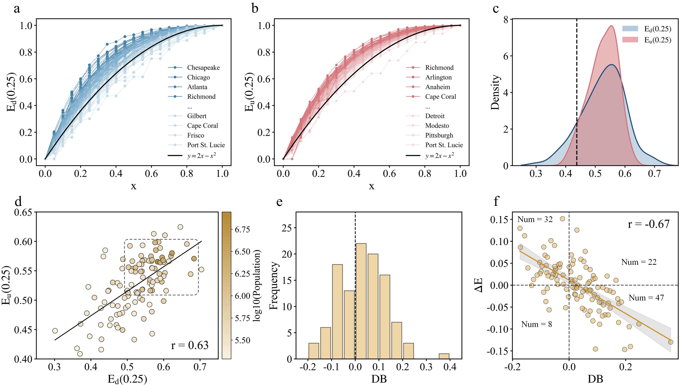
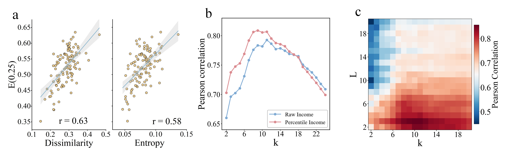
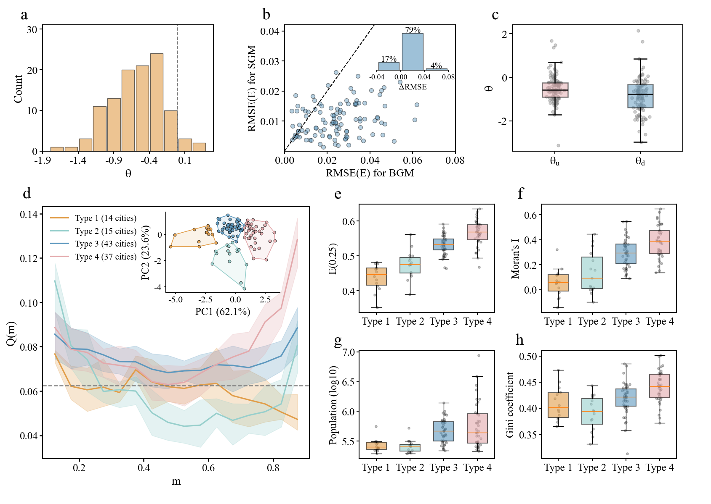

# Economic Distance Structures Urban Mobility in 109 U.S. Cities

## 0. 论文把“谁去哪里”改写成“跨越了多大的经济距离”

城市研究早已知道，人们更常访问社会经济背景相近的社区。但常见做法把人口粗分成高收入与低收入、若干收入组，随后比较组间流量。这样可以说明存在分层，却看不到流量怎样随连续收入差逐步衰减，也难以判断约束在哪个尺度最强。

本文把每个普查区在本市收入排序中的位置映射到 `[0,1]`，再把出发地与目的地的收入分位差定义为 `economic distance`。作者要沿着这条连续轴依次回答四个问题：

```text
城市流量是否集中在很短的经济距离？
    ↓
这种集中在向上与向下方向是否对称？
    ↓
它只是住宅空间分异的被动映射，还是仍有额外行为摩擦？
    ↓
不同城市、不同收入位置最终形成哪些内部结构？
```

对我们的灾后人口恢复研究，最直接的启发不是采用论文的 `0.25` 阈值，而是：**mobility conductance 可能随人群社会经济位置、流动方向和住宅空间结构系统性变化。** 同一个中心人口异常可能混合了不同群体完全不同的释放能力；只估计全体人口的单一 `G` 会把这些差异折叠掉。

## 1. 数据首先被聚合成“稳定日常结构”，不是事件动力学

作者使用美国 109 个城市的匿名手机位置流量，时间从 2019 年 1 月到 2020 年 2 月。数据以 census tract 为基本空间单元，记录由居住普查区到访问普查区的每日 OD 流。居住地由六周窗口内夜间最常访问的普查区推断；同一个人同一天对同一目的地无论访问多少次只计一次。

研究把整个观察期的日流量累加成每个城市的一张 OD 矩阵。因此论文研究的是疫情前相对稳定的城市日常流动结构，而不是小时、日或灾后阶段的时间演化。季节变化、临时冲击和个体轨迹顺序在聚合时被压掉。



图 1a-c 展示城市样本、芝加哥流量和普查区收入；真正的方法转换在图 1d-e。把 OD 矩阵的行列按收入分位排序后，经济相近地区之间的流量落在主对角线附近。若流量集中在对角线，说明日常活动更多停留在相近收入层；若向矩阵两侧展开，则跨收入流动更充分。原图注把黄色边界误写成靠近 `anti-diagonal`，但图面、Methods 与 `|q_o-q_d|` 定义都明确指向主对角线。

需要注意，作者先把每个出发普查区的流量归一化，使其对所有目的地的权重之和为 1。这意味着后续 `E(x)` 更接近“对出发普查区等权后的流量结构”，不是由全市原始出行次数直接加权的 trip-level CDF。大流量与小流量出发地在总指标中的权重因此被拉近。

## 2. 收入分位转换解决跨城市尺度，却主动丢掉绝对收入差

原文 Eq. (1) 把每个普查区的 median household income 按城市内部排序，再线性映射到 `[0,1]`。最低收入普查区为 0，最高收入普查区为 1。两个地区的经济距离定义为收入分位之差的绝对值。

这种做法有两个明确优点。第一，纽约与小城市的绝对收入尺度不同，分位值仍然可比；第二，连续排序避免人为设置“低/中/高收入”分类边界。

代价也同样明确。分位距离只保留相对次序，不保留美元差。一个城市中相邻 0.1 分位可能对应很小收入差，另一个城市可能对应巨大差距；两者在本文中仍被视为相同 economic distance。这里的“经济距离”因此应准确理解为**城市内部相对收入秩距离**，不是生活成本、支付能力或真实经济阻抗的完整度量。

## 3. `E(x)` 把整张 OD 矩阵压成一条累积分布曲线

原文 Eq. (2) 定义 `E(x)`：统计经济距离小于 `x` 的归一化 OD 权重占全部权重的比例。它就是每个城市流量经济距离的加权 CDF。

如果流动完全不受收入位置影响，出发和目的收入分位可以视为 `[0,1]` 上独立均匀抽样。单位正方形中距离主对角线小于 `x` 的面积为 `2x - x^2`，作者据此构造收入中性基准曲线。

于是：

```text
observed E(x) > neutral curve
    经济近邻流量过度集中

observed E(x) < neutral curve
    跨收入距离流量多于中性匹配
```

这个基准只消除了收入分位本身的几何效应。它没有控制地理距离、普查区面积、人口、就业中心或目的地功能；这些机制在后续住宅结构和 gravity model 中才部分进入。

## 4. `0.25` 不是四分之一人口，而是一段收入秩距离



图 2a 显示多数城市的 `E(x)` 位于收入中性曲线上方，说明日常流量普遍偏向经济相近的普查区。图 2b 进一步计算 `E(x)` 与中性曲线的平均差，差值在约 `0.25-0.35` 范围达到高位；图 2c 看导数后发现，经济距离小于约 `0.25` 时，经验流量密度通常高于中性密度，越过这一位置后迅速下降。

作者据此把约 `0.25` 分位距离称为 routine mobility 的“economic social radius”或结构边界。它的意思是，经济距离的额外集中主要累积在相差不超过约四分之一个城市收入秩区间的 OD 对中，并不是说居民只移动四分之一人口、四分之一城市半径或固定公里数。

作者随后用 `E(0.25)` 作为城市级汇总指标。在中性模型下，其理论值为 `0.4375`。101/109 个城市高于该值；图 2d 标出的经验均值是 `0.524`，正文近似写为 `0.53`，众数约 `0.57`。随机重排流量得到的均值为 `0.425`，明显更靠左。

替代阈值 `E(0.30)`、`E(0.35)` 以及整条曲线面积与 `E(0.25)` 的相关均超过 `0.95`，说明城市排序对邻近阈值稳健。不过 `0.25` 仍然是观察曲线峰值/平台后选择的经验代表尺度，不应被当作独立样本外发现的自然常数。

## 5. 同样的经济距离约束，在两个方向上不是同一种城市差异

作者把主对角线两侧分开。`upward flow` 指从较低收入分位普查区到较高收入分位普查区，`downward flow` 指相反方向。这里的“向上流动”只是一次访问在收入等级上的方向，**不是个人收入上升或代际社会流动。**

原文 Eq. (3)-Eq. (4) 分别定义方向条件下的 CDF `E_u(x)` 和 `E_d(x)`。由于各自除以该方向总流量，它们测的是“这个方向内部有多集中在短经济距离”，不表示该方向总量有多少。



图 3a-c 给出第一个结果：两个方向的 `E(0.25)` 均值都约为 `0.53`，但跨城市离散程度不同。向上流动的标准差为 `0.048`，曲线紧密聚集且普遍高于基准；向下流动标准差为 `0.073`，城市间变化更大。作者因此把向上方向解释为跨城市较一致的结构上限，把整体城市差异更多归因于向下方向。

整体 `E(0.25)` 与向下指标的相关为 `0.94`，与向上指标为 `0.85`；两个方向之间也正相关 `r=0.63`。大城市通常在两个方向都具有较高短距离集中。

然后作者另定义 raw directional bias：用未归一化流量计算向下与向上总量之差，再除以两者总和。正值表示向下流量总量占优。63.3% 的城市为正。

关键的耦合出现在图 3f。令 `Delta E = E_d(0.25) - E_u(0.25)`；图面与正文都显示 `DB` 与 `Delta E` **负相关 `r=-0.67`**，72.5% 城市位于符号相反的两个象限。也就是说，流量总量占优的方向反而在收入轴上扩展得更远，少数反方向被压缩在更短经济距离内。

这里原文存在明确内部错误：图 3 caption 写成“positive correlation (`r=0.67`)”，但同一 caption 又说城市集中在异号象限，图 3f 面板标注和正文均为 `r=-0.67`。本笔记采用图面与正文一致的负号，同时保留此审计记录。

## 6. 作者先问住宅分异能解释多少，再问它在哪个空间尺度最相关

经济距离结构可能只是住宅收入空间分布的影子：相近收入社区本来就彼此靠近，人们因地理距离短而在经济轴上看起来同质。作者用两类住宅分异指标拆解这个问题。

第一类是城市整体的 evenness/centralization，包括 Dissimilarity Index 和 Entropy Index。它们与 `E(0.25)` 的相关分别约为 `0.63` 和 `0.58`，说明全市收入分布不均确实关联日常流量集中，但解释力中等。

第二类是 clustering/exposure，强调相似收入普查区是否在空间上成片相邻。作者改变 `k` nearest neighbors 的邻域尺度，并分别使用原始收入与收入分位计算 Moran's I。



图 4b 显示，收入分位 Moran's I 与 `E(0.25)` 的相关普遍强于绝对收入版本，并在约 `k=9` 时达到 `r=0.82`。Join Count 的替代检验在 3 个收入类别、约 10 个近邻时达到最高相关 `r=0.86`。

作者据此提出一个尺度匹配解释：经济轴上 `0.25` 附近的流量集中，其空间基础不是单个紧邻普查区，也不只是全市收入均匀度，而是约 9-10 个近邻构成的中尺度收入团簇。

这仍然是跨城市相关峰值，不是证明“9 个近邻产生了 0.25 分位边界”的因果识别。邻域尺度是以普查区数量而非公里或出行时间定义，不同城市的实际空间范围也不同。

## 7. 回归显示空间聚类解释力更高，但“dominant driver”用词超过识别设计

作者用 109 个城市做嵌套 OLS。单独使用 Moran's I 时，调整后 `R^2=0.649`；单独使用 Dissimilarity Index 时为 `0.387`。二者共同进入后为 `0.704`；增加交互项后为 `0.719`。交互系数为负，表示一个维度很高时，另一个维度的边际统计解释力下降。

按方向分开后，住宅结构对向下集中度的调整后 `R^2=0.658`，对向上集中度为 `0.498`。Moran's I 的标准化系数也在向下方向更大。作者由此认为，向下流动更贴合住宅空间结构，向上约束更可能包含非住宅摩擦。

这些结果足以支持“住宅空间聚类是最强的跨城市统计关联因素之一”，但不足以支持因果意义上的 generator 或 driver。住宅分异、交通网络、就业布局、土地用途和移动结构可能共同形成；109 个城市的横截面 OLS 无法确定方向，也没有处理所有空间与测量误差。本文后面的“剩余 27%”同样只是模型未解释方差，不能自动解释成独立行为机制的份额。

## 8. 城市规模、收入差距和公交使用改变的是住宅结构与流动结构的耦合

作者再按人口规模、Gini 和公共交通使用率把城市分组。大城市的三类 `E(0.25)` 中位数都更高，意味着经济近邻流量更集中。但随着城市规模、收入不平等和公交使用率上升，住宅指标回归对 `E(0.25)` 的解释力下降，Moran's I 系数减弱，城市整体不均匀度的相对权重上升。

作者把这解释为 activity range 扩大：复杂大城市与公交网络让人们越过直接住宅邻域，因此 mobility structure 不再主要由附近住宅团簇决定，却仍可能受全市社会经济排序约束。

相反，高密度、较高种族多样性和老龄化被作者归入活动范围收缩类，相关分组中住宅结构解释力更高。这一段主要是分组回归与机制推测；它没有直接测量个体 activity-space radius，也没有因果识别公交改善会降低经济边界。

## 9. Gravity model 才开始测试经济距离是否超出地理距离

前面的分析都可能被“收入相近地区更靠近”解释。作者因此为每个城市拟合两套 gravity model。

Baseline gravity model 用出发地总流出、目的地总流入和地理距离解释 OD 流量。Economic-distance gravity model 在此基础上乘一个额外衰减项：经济分位差越大，若参数 `theta` 为负，预测流量越小。



109 个城市中 94% 的 `theta` 为负，平均值 `-0.57`，95% 置信区间为 `[-0.64,-0.50]`；只有 9 个城市的系数在 5% 水平不显著。按方向拟合时，向下流动的平均系数约 `-0.85`，比向上的 `-0.52` 更负，配对检验 `t=5.43`、`p<10^-6`。

这支持一个较窄但重要的结论：在控制作者模型中的 origin/destination size 与地理距离后，收入秩距离仍与 OD 流量负相关。它可以被解释为额外 economic-distance friction，但仍不是行为因果效应；目的、岗位、商业中心、交通供给和人口构成都可能同时与收入差相关。

整体 `R^2` 的中位提升只有约 `0.01`，说明新变量对逐 OD 流量方差的增量有限。作者进一步比较模型重建整条 `E(x)` 曲线的 RMSE，认为经济距离项更能恢复流量在收入轴上的结构。

这部分原文还有一组不能静默合并的不一致：正文写 90/109 个城市、即 83% 的结构 RMSE 改善；图 6b inset 标为 79%。图注把 `Delta RMSE` 定义为 `BGM - EGM`，却又说负值代表 EGM 改善；按这个定义应是正值才代表 `EGM RMSE` 更小。因而“多数城市改善”的方向从散点大多位于对角线下方仍可判断，但精确比例与图注符号需要作者更正后再引用。

## 10. `Q(m)` 把“全市集中”继续拆成“哪一段收入层最封闭”

`E(0.25)` 只告诉全城有多少流量落在短经济距离内，无法区分这种集中发生在低收入端、中间还是高收入端。作者沿收入对角线滑动一个宽度为 `0.25` 的方形窗口，定义 `Q(m)` 为窗口内 OD 权重占比。中性匹配下，窗口面积给出基准 `0.0625`。

平均 `Q(m)` 呈 U 型：低收入端和高收入端的局部流量集中都高于中间收入段。作者提取端点强度、高低端不对称、U 型深度和整体均值四个特征，再用 K-means 分成四类城市：

- Type 1，Flat mixed，14 城：曲线较平，整体过滤弱；
- Type 2，Low-concentrated deep-U，15 城：低收入端局部集中更强；
- Type 3，Symmetric shallow-U，43 城：两端较平衡，是最常见类型；
- Type 4，High-concentrated deep-U，37 城：高收入端局部集中最强。

图 6d-h 显示，从 Type 1 到 Type 4，整体 `E(0.25)`、Moran's I 和 Gini 大体上升；Type 4 同时具有最高流量集中与住宅聚类。作者据此把最强分层解释为 affluent enclosure，而不只是低收入人口被困在有限活动空间。

这是一种描述性 typology。K-means 的四类由解释性和稳定性共同选择，PCA 前两轴解释 85.79% 特征方差，但城市并非因此存在四个自然离散相；聚类边界仍依赖窗口宽度、四个手工特征和 K 值。

## 11. 论文最终提出的是一个多尺度 filter，而不是单一摩擦系数

全文收束时，作者把结果组织为三层：

```text
宏观层
    城市整体收入不均提供背景条件

中尺度
    约 9-10 个近邻形成的住宅收入聚类
    与 0.25 分位附近的短经济距离集中最强相关

OD 对层
    控制地理距离和节点规模后，经济分位差仍表现为额外负关联
```

方向不对称贯穿三层：向上短距离集中在城市间更稳定，向下方向贡献更多跨城市变化；向下流量与住宅结构相关更强，但 gravity coefficient 也更负。后两点看似冲突，实际测量不同对象：一个是城市级 CDF 集中度与住宅结构的关联，另一个是控制地理距离后的 OD 对衰减斜率。

论文的真正贡献不是证明社会经济属性“造成”每一次出行，而是给出一套连续、方向敏感、可跨城市比较的描述框架，把住宅排序、空间聚类和 OD 摩擦接到同一条收入秩轴上。

## 12. 对灾害人口 pressure-release 模型的第一层启发：`G` 不是全体人口共享的常数

我们的理论把外向人口释放近似写成 mobility conductance 乘以中心与外围之间的压力差。本文提示，conductance 至少应允许三种异质性：

```text
G = G(group, direction, urban structure)
```

低收入居民前往高收入区与高收入居民前往低收入区的日常基线并不对称；住宅团簇会改变实际可达目的地；即使公里距离相同，跨越更大收入秩差的流量仍可能更弱。灾害发生时，避难所位置、交通资源、远程工作能力、车辆拥有和风险信息可能进一步放大或反转这些差异。

因此，全体人口的负 `C_peak` 可能由高机动群体快速离开造成，同时低机动群体仍滞留中心；全体人口的正 `C_peak` 也可能掩盖部分群体已经释放。中心压力状态应至少按居住地收入分位或脆弱性分组重算。

## 13. 第二层启发：把日常结构当作灾前 conductance prior，而不是灾后机制证据

本文数据全部来自平常时期。它最适合为每个城市或群体提供灾前 mobility structure prior：

- `E_g(0.25)`：某群体日常流量是否局限在相近经济层；
- `theta_g`：控制地理距离后跨收入流量的额外衰减；
- directional indices：不同收入方向的基线约束；
- Moran's I / Join Count：住宅收入团簇和潜在邻域锁定；
- `Q(m)`：约束主要发生在收入轴的哪一端。

随后在灾害事件中检验这些灾前指标是否调节 `C_peak -> recovery rate` 的关系。例如：在住宅聚类高、跨经济距离摩擦强的城市，同样负的中心异常是否只代表短距离重分布，而不是进入多样化外围目的地？在高收入端 `Q(m)` 特别高的城市，高收入群体是否表现为更早外移但更快回流到封闭活动圈？

这里要避免把论文的 `0.25` 直接当作灾害分析窗口。它是收入秩距离，不是中心半径、50 km 外移阈值或灾害影响区边界。项目中的 near-home radial displacement、out-50 share 和 center visit share 仍是地理/行为量，需要与 income-rank distance 作为不同维度联合分析。

## 14. 一套可直接进入实证阶段的分组检验

可以按以下顺序把本文转成我们项目的扩展分析：

```text
Step 1
    用灾前时期建立 origin tract 的收入分位和日常 OD 基线

Step 2
    对每个事件分别计算不同收入分位组的 C_peak、外移量和恢复时间

Step 3
    把净流分成中心→更高收入目的地、中心→更低收入目的地
    同时保留双向总活动，避免只看净值

Step 4
    估计灾前 economic-distance friction 与住宅聚类
    是否调节 C_peak 对 recovery rate 的预测

Step 5
    检查 aggregate relation 是否由某一收入组主导
    并比较灾害类型、交通中断和城市规模
```

最关键的 falsification 是 Simpson-type reversal：如果总体上 `C_peak` 越负恢复越快，但分收入组后效应大幅减弱、消失或反号，就说明 aggregate pressure-release relation 部分来自群体构成和不对称 conductance，而不是一个统一人口流体的状态律。

## 15. 不能从本文直接推出什么

- 不能把 `economic distance = 0.25` 解释为固定美元差、公里距离或普适城市常数。
- 不能把 upward trip 称为个人社会经济上升；它只是访问目的地收入分位更高。
- 不能由横截面相关与 OLS 断言住宅聚类因果产生 mobility boundary。
- 不能由 gravity coefficient 断言收入差本身造成流量下降；未观测目的和土地用途仍可能混杂。
- 不能用一年多的聚合日常 OD 直接解释灾后逐日恢复动力学。
- 不能忽略 origin normalization；`E(x)` 不是原始出行次数的简单比例。
- 不能精确引用图 3 的正相关说法或图 6 的 RMSE 改善比例，除非作者修正内部不一致。

这篇论文对我们最有价值的结论可以压成一句话：**人口移动通道不仅有地理阻力，还有随相对经济位置和方向变化的结构性过滤；灾害中心是否“释放”必须继续追问是谁释放、向哪个社会经济层释放，以及这种流动是否只是停留在原有封闭活动圈内。**
