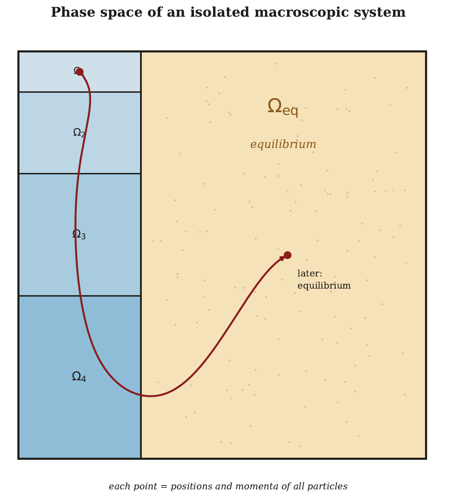
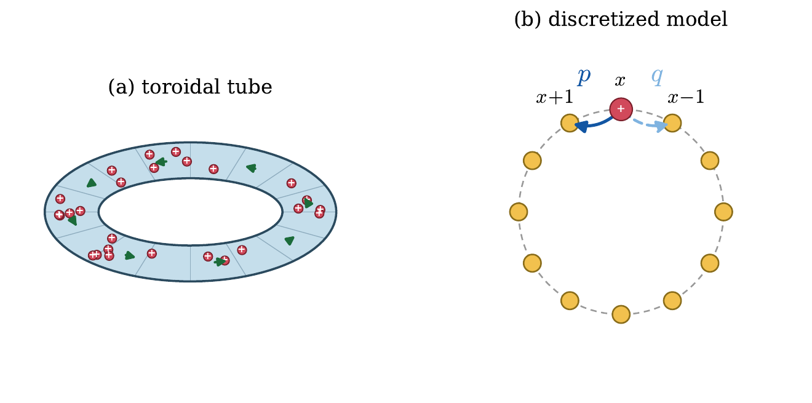
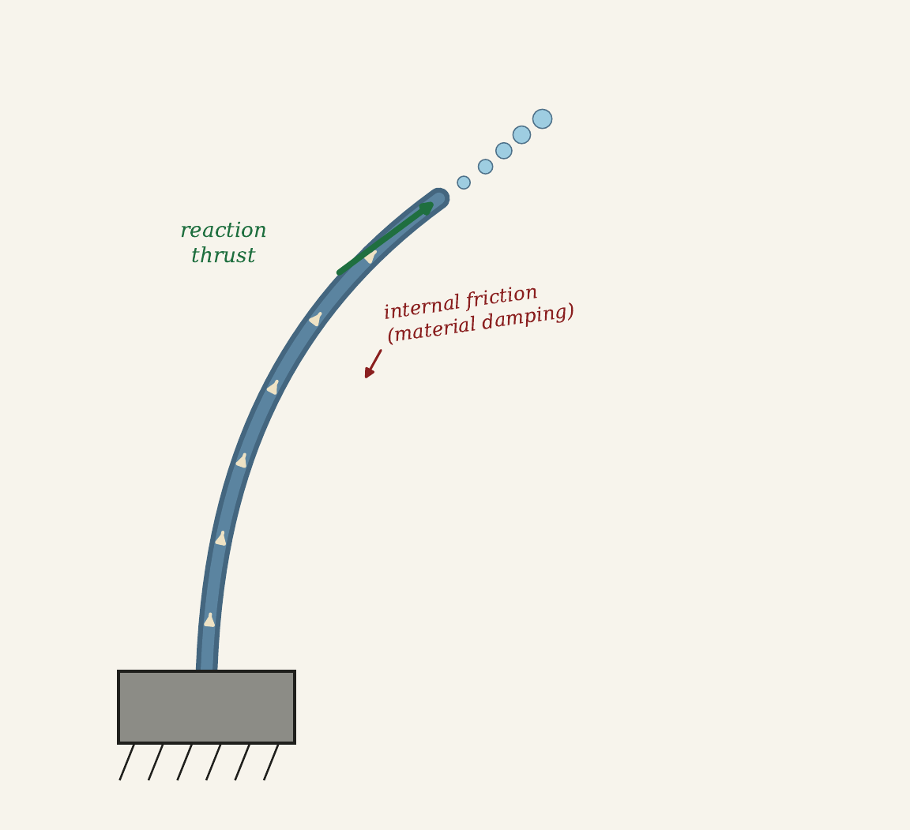

# Entropy and Frenesy: the Arrow and the Bustle of Time

## 0. 这篇文章真正想补上的缺口

这是一篇带有历史回顾和宣言性质的综述，不是一篇围绕单个新定理展开的研究论文。Christian Maes 从一个明确的不满足出发：我们习惯用熵增和熵产生描述不可逆过程，但一旦系统被持续驱动、远离平衡，熵产生并不足以决定系统会走哪条路径、响应有多快、最终占据哪个状态，或者哪一种耗散结构会被选中。

作者要补上的第二个量叫 `frenesy`。本文把它译为**躁动度**，必要时保留英文。它不是另一个熵，也不是“混乱程度”，而是路径上的时间对称动力学活动：系统跳了多少次、等待多久、逃逸率多大、有哪些状态容易到达。熵产生回答的是“时间箭头指向哪里、不可逆性有多强”，躁动度回答的是“在不管方向的情况下，系统究竟有多忙、有哪些路真的走得通”。

全文的主线因此不是“熵已经过时”，而是：

```text
平衡态把多个原本不同的概念压到一起
    ↓
远离平衡后，这些等价关系解体
    ↓
轨迹概率必须同时包含时间反对称项与时间对称项
    ↓
前者对应熵产生，后者对应躁动度
    ↓
二者共同决定响应、松弛和结构选择
```

对我们的灾后人口恢复研究，这篇文章最重要的提醒是：**中心人口异常的正负只记录了带方向的状态结果，不能自动告诉我们系统内部是否仍有高强度交换、通道是否可达、人口是否被低逃逸率锁住。** 如果要把“压力释放”写成动力学理论，就需要把净迁移方向与无方向活动强度分开测量。

## 1. 作者先区分三种“时间”，是为了把问题放到轨迹上

文章先从机械时间讲起。牛顿力学和相对论都可以度量一条轨迹经历了多久；微观动力学在通常条件下仍具有时间反演对称性。只看基本运动方程，向前播放和反向播放都可能成立，方程本身并没有告诉我们为什么热茶只会冷却、香水只会扩散。

宏观世界却额外呈现两种时间特征。第一种是**方向**：过去与未来不再对称，不可逆过程形成时间箭头。第二种是**躁动**：即使宏观净流为零，系统内部仍可能有大量跳跃、碰撞和交换。作者把前者交给熵产生，把后者交给躁动度。

这个铺垫很重要，因为躁动度不是某个时刻的状态变量。它必须从一段轨迹中读取。两张完全相同的城市人口快照，可能来自一座几乎静止的城市，也可能来自一座每天有大量双向交换、但净变化接近零的城市。单时刻状态不能区分它们，轨迹统计可以。

## 2. Clausius 熵先把热、温度与状态变化连起来

作者随后回到 Clausius。对准静态可逆过程，系统在每个时刻都足够接近平衡，吸收的可逆热量除以绝对温度形成一个全微分，即原文 Eq. (1)：

```text
reversible heat / temperature = entropy-state change
```

这一定义给出了热力学熵这个状态函数，也使总熵增加能够刻画不可逆损失。对于热机，环境与系统的总熵增加对应不能转化为有用功的耗散。于是 Clausius 熵首先属于平衡态及其准静态变换，它擅长连接热、功、效率与状态变化。

这一步建立了时间箭头，却没有回答微观可逆定律如何产生宏观不可逆性，也没有说明一个非平衡状态为什么需要某个具体时长才能松弛。

## 3. Boltzmann 熵解释“哪里更可能”，但还没解释“怎样过去”

Boltzmann 把熵从平衡态推广到由宏观变量定义的宏观状态。原文 Eq. (2)-Eq. (3) 的核心是：一个宏观状态所兼容的微观状态越多，其相空间体积越大，熵也越高。



图中的每个点代表所有粒子的位置和动量。蓝色小房间是低体积宏观状态，右侧黄色区域是占据相空间绝大多数体积的平衡宏观状态。一个从特殊初态出发的典型微观轨迹，极大概率会进入越来越大的房间。反向波动并非逻辑上不可能，只是其概率按原文 Eq. (4) 随熵差指数下降。

这套论证回答了“为什么平衡态 overwhelmingly likely”，但作者紧接着指出一个缺口：**相空间体积是静态的，它衡量目的地有多少微观实现，却不衡量门有多窄、通道是否堵塞、到达那里需要多久。**

可以把两个宏观状态想成两间房。后面的房间很大，因而 Boltzmann 熵很高；但如果两间房只由一扇极窄的门连接，系统仍可能在小房间里停留很久。大目的地不等于高可达性，更不等于短到达时间。玻璃化、亚稳态和动力学约束都是这种区别的典型表现。

这正是文章从熵转向躁动度的逻辑转折：熵给状态加权，动力学决定状态之间的实际通达。

## 4. 平衡态造成了一种“多个熵都是同一个东西”的错觉

在平衡或近平衡条件下，Clausius 熵、Boltzmann 熵、Gibbs/Shannon 形式、自由能下降和线性响应之间常有漂亮的等价关系。详细平衡还把正向与反向跃迁紧密联系起来。结果是，人们容易相信只要知道能量和熵，系统的响应与松弛就已被决定。

作者的判断是：这种统一性是平衡态的特殊产物。持续驱动打破时间反演对称性后，状态体积、热力学熵和具体动力学不再自动合并。两个系统可以承受相同驱动、产生相同熵，却因为等待时间、反应活性或逃逸率不同而出现不同稳态人口和不同电流。

因此，远离平衡时不能只问“这条轨迹耗散了多少”，还必须问“这套动力学给了它多少活动机会”。文章把后一个问题系统化为躁动度。

## 5. 躁动度的严格位置：它是路径作用量的时间对称部分

作者没有停留在“系统有多活跃”的口头比喻，而是把概念放进路径概率。对一段随机轨迹 `omega`，其概率可以写成某个路径作用量 `A(omega)` 的指数权重。把轨迹反向播放得到 `theta omega` 后，作用量自然分解为两部分：

```text
A = D - Sigma / 2

Sigma: 时间反演后改变符号，记录熵流/熵产生
D:     时间反演后保持不变，记录躁动度
```

这对应原文 Eq. (7)。`Sigma` 比较一条轨迹与其反向轨迹谁更可能，因此直接衡量时间箭头；`D` 不关心方向，但会对跳跃数、等待时间和逃逸率敏感。

作者把适用范围限定在一类具有物理热环境、弱耦合且满足局域详细平衡的随机模型中。在这类模型里，时间反对称部分可以识别为环境熵流，而剩余的时间对称部分才具有清楚的躁动度解释。文章并没有声称任意复杂社会系统都天然拥有同一套热力学分解。

## 6. 偏置随机游走把“净方向”与“活动量”拆开

论文用环形管中的带电胶体给出最具体的构造。外场驱动粒子沿环运动，粗粒化后，粒子在相邻格点间连续时间随机跳跃。向一个方向的跃迁率为 `p`，反方向为 `q`，两者之和决定逃逸率。



观察时间内，记两个方向的跳跃次数分别为 `N_counter` 和 `N_clock`。作者随后构造两个彼此独立的路径统计量：

```text
净流 J × t = N_counter - N_clock
总活动 N     = N_counter + N_clock
```

原文 Eq. (5)-Eq. (6) 把路径概率改写成这两个量的乘积。比率 `p/q` 只控制方向偏置，因此进入时间反对称的熵产生项；乘积 `p q` 与总跳跃数共同控制活动强弱，因此进入时间对称的躁动项。

这个例子揭示了全文最关键的辨析。假设两段轨迹都向外净移动 10 次：第一段可能发生 10 次向外、0 次向内；第二段可能发生 110 次向外、100 次向内。它们的净流相同，但总活动相差 21 倍。若只看净流或最终人口差，就会把完全不同的动力学误认为同一种过程。

同样，`p/q` 相同只说明方向偏置相同，并不固定 `p+q` 或 `p q`。系统可以在相同“箭头”下非常迟缓，也可以非常活跃。这就是“相同熵产生不足以决定响应”的最小模型证明。

## 7. 非平衡响应为什么必须多出一个 frenetic term

作者接着改变外场，从基准值加一个小扰动。原文 Eq. (10) 展开扰动前后的路径概率比，得到两类变化：外场改变了与净流有关的熵产生权重，也可能改变与总跳跃数有关的躁动权重。

把路径权重变化与观测量 `J` 相乘并平均，原文 Eq. (11) 给出电流响应的两项分解：

```text
current response
    = entropic correlation
    - frenetic correlation
```

第一项是电流自身波动与驱动的关系；第二项是电流与总活动的相关，并乘上活动参数对外场的敏感度。平衡态附近，由于时间反演对称性，时间反对称的 `J` 与时间对称的 `N` 的相关平均为零，于是熟悉的 Sutherland-Einstein / fluctuation-dissipation relation 被恢复。

一旦参考状态本身处于非平衡，第二项不再消失，而且符号并不固定。它可以增强响应，也可以抵消第一项，甚至造成 negative differential conductivity：驱动继续增强，净流的边际响应反而变负。

这点对我们的项目尤其重要。躁动度高不等价于恢复一定快。高活动可能意味着通道开放、重组迅速，也可能意味着大量往返、拥堵传播或无效循环。论文只告诉我们它会进入响应，**没有给出“躁动越高，恢复率必然越大”的普适单调律。**

## 8. 怎样观测躁动度：不要只量净位移

“躁动度”听起来抽象，但作者给出了可操作的测量方向。单粒子或单分子追踪可以直接统计单位时间内的跳跃、反转、构型变化、驻留时间和逃逸率；玻璃体系可以统计某时刻有多少粒子处于移动状态，以及这种活动在时空中的相关；介观输运可以使用穿过结点的事件计数与不规则性。

另一条路线是 `frenometry`：施加不偏向任何方向、但会改变势阱刚度或势垒高度的时间对称扰动，再从响应中隔离 frenetic contribution。它与通过倾斜势能测 mobility 不同，目标是改变“跳得容易不容易”，而不是直接推动“往哪边跳”。

对人口数据，最接近的观测量不是所谓“人口熵”，而是：

- 单位时间发生迁移的设备或人口占比；
- OD 边上双向流量之和，而非净流量；
- 个体离开中心后的驻留时间、返回时间与反转次数；
- 可达目的地数量、有效开放通道数和路径替代度；
- 同一净位移下的总旅行次数、总访问次数或状态切换数。

这些量都必须先定义观测窗口和基线。手机覆盖变化、设备活跃度变化也会伪造“活动下降”，因此不能把原始 ping 数直接当作躁动度。

## 9. 文章随后改变问题：耗散不只是损失，也可能打开新的结构

有了熵产生与躁动度的区分后，作者重新讨论耗散。传统叙事强调摩擦、废热和效率损失；现代非平衡视角则注意到，持续耗散往往是稳定功能和自组织存在的必要条件。热机需要冷端，细胞需要持续分解与回收，Bénard 对流和化学振荡也只有在持续驱动下才能维持。

但“有耗散就会产生结构”仍然太粗。文章区分两条路径。

第一条是**耗散诱导不稳定性**：在给定驱动下，引入某种很小的阻尼，反而使原来稳定的状态失稳。第二条是**驱动诱导稳定性**：在已有耗散通道的系统中，把驱动提高到足够强，原本在平衡态不能维持的结构获得稳定性。

两条路径都说明，结果不只取决于耗散总量，还取决于耗散发生在哪里、通过什么通道、怎样改变各模态之间的相位和逃逸率。

## 10. 花园水管例子说明“耗散分布”比“耗散大小”更关键



水流对弯曲管口施加随管口方向变化的非保守跟随力。水管材料内部的阻尼始终为正，并不存在一个隐藏的负摩擦元件；但少量阻尼会改变不同弯曲模态之间的相位关系，使外部水流在一个振荡周期内注入的净功超过阻尼损失，于是直管状态开始拍动。

作者借它说明，稳定性由驱动与阻尼的**组织方式**共同决定，而不是由“总阻尼越大越稳定”这种标量直觉决定。作者也诚实限定了论证强度：标准 Ziegler column 是确定性常微分方程系统，把其失稳阈值严格写成某个随机路径的 frenetic content，仍需要给出明确的噪声扩展和计算；本文主要提出结构类比，而不是完成该证明。

这类限定很重要。文章后半段关于 dissipative structure 和生命选择的部分包含研究纲领与物理直觉，证据强度不等同于前面随机游走的精确分解。

## 11. Frenetic selection：驱动扩大可能性，动力学选择实际落点

作者最后把躁动度推进到“选择”问题。持续驱动打破时间反演对称性，使平衡态下不存在的定向流、共存相和对称破缺成为可能；但在多个候选稳态之间，究竟哪一个被占据，还由驻留时间、逃逸率、状态可达性和反应活性决定。

长笛是文章给出的直觉例子。气流提供持续驱动并激发许多频率，管体边界条件和开孔造成的局部声能逃逸率选择最后被放大的音符。驱动提供可能性空间，具体的动力学门控选择结果。

随机游走中的 blowtorch effect 更接近可计算版本：在无偏置时，局部拥堵不一定改变环上的均匀稳态；存在定向驱动时，同一处局部低逃逸率会让概率堆积在拥堵上游。也就是说，打破时间反演对称性以后，系统不仅对“摩擦有多少”敏感，也对“摩擦放在哪里”敏感。

这与我们的“中心滞留”直觉有直接对应关系：相同总体移动受限程度，如果瓶颈位于中心外流边界，会形成中心人口堆积；如果限制发生在外围其他位置，中心指标可能完全不同。真正需要识别的是通道位置与方向，而不是一个全局 mobility reduction 数字。

## 12. 主命题与仍未解决的问题

文章最后把主命题压缩为两层。

第一，在满足局域详细平衡的一类非平衡随机系统中，轨迹概率的时间反对称部分与时间对称部分共同决定响应；平衡涨落耗散关系只是 frenetic contribution 因对称性消失的特殊情形。

第二，持续耗散释放了可调的时间对称动力学参数，这些参数能够改变稳态人口、电流、稳定性和结构选择。低熵资源与驱动提供持续过程，躁动度决定这些资源怎样沿不同自由度重新分配。

作者同时承认两个大缺口。量子系统缺少普遍可接受、可操作的轨迹与动力学活动定义；多体系统的事件数、等待时间和可达性会迅速变成高维对象，怎样降到少数集体变量而不丢失关键动力学尚不清楚。后者正是把这套框架迁移到城市系统时必须面对的问题。

## 13. 哪些是严格结果，哪些是研究纲领

本文的证据层次需要分开。

最坚实的部分是满足局域详细平衡的连续时间随机过程：路径作用量可以按时间反演分解，偏置随机游走明确展示净流与总活动，非平衡线性响应包含 entropic 和 frenetic 两项。

次一级是由既有非平衡统计物理研究支持的普遍解释：逃逸率、反应活性和动力学瓶颈可以改变稳态人口、电流和负微分响应。

更具宣言性质的是把 frenetic selection 作为耗散结构、生命组织乃至宇宙结构的一般选择原则。文章给出大量历史和物理例子，但没有提供一个覆盖这些尺度的统一定理。我们可以把它用作理论语言和假设生成器，不能把它当成已经验证的城市恢复定律。

## 14. 对灾害人口 pressure-release 主线的针对性改写

我们现有模型用 `C_peak` 表示峰值时中心附近的有符号人口异常：负值意味着中心已经净流出，正值意味着人口仍堆积在中心。这个量最接近论文中的**方向性结果**，但它既不是热力学熵产生，也不能单独代表路径活动。

建议在同一峰值窗口增加一个独立的 `A_peak`，专门描述无方向活动。它可以由以下观测组合构成：中心边界双向流量之和、移动设备占比、个体状态切换次数、中心平均驻留时间的倒数、可达外围分区数量，以及绕行路径使用率。所有分量先相对于同城同星期同时间段基线标准化，再考虑合成。

随后不是立即把 `A_peak` 塞进带固定正号的恢复方程，而是先检验：

```text
在相同 C_peak 下：

A_peak 高
    是对应更快离开恢复阈值，
    还是对应更多无效往返与拥堵？

这种关系
    是否随中心到外围通道可达性、灾害类型和交通中断而改变？
```

可以把原关系扩展成一个待估计而非先验定号的诊断模型：

```text
recovery rate
    = baseline
    + signed center-release effect
    + activity effect
    + release × activity interaction
```

其中中心释放项仍保留我们的主要假设：峰值时中心异常越负，后续恢复越快。活动项和交互项的符号应由数据决定。若高活动只在通道开放时加速恢复，而在堵塞时变成往返和拥挤，就会出现这篇论文强调的 operating-point dependence。

更强的检验不是回归中增加一个控制变量，而是寻找“净方向相近、总活动不同”的事件配对。若这两组事件的恢复速度系统性不同，就能直接证明 `C_peak` 尚未穷尽动力学状态；若加入 `A_peak` 后效应消失或翻转，则说明原先的 pressure-release 关系部分混入了通道活动机制。

## 15. 不能从这篇文章直接推出什么

- 不能把人口分布的 Shannon entropy 直接叫作论文中的 entropy production；二者对象不同。
- 不能把总访问量、手机 ping 数或平均位移任意一个单指标直接等同于 frenesy。
- 不能由“躁动度参与响应”推出“躁动度越大，恢复越快”；frenetic contribution 的符号可正可负。
- 不能由稳态随机游走直接推出灾后非平稳人口过程满足局域详细平衡。
- 不能由 `C_peak > 0` 单独判断是主动滞留、道路瓶颈、避难需求、中心吸引还是数据覆盖变化。

这篇文章对我们最持久的贡献可以压成一句话：**中心人口是否释放描述了迁移的有符号结果，而恢复动力学还取决于系统在峰值附近究竟有多活跃、哪些通道可达、概率在哪里因低逃逸率而堆积；这两类信息必须分别测量。**
