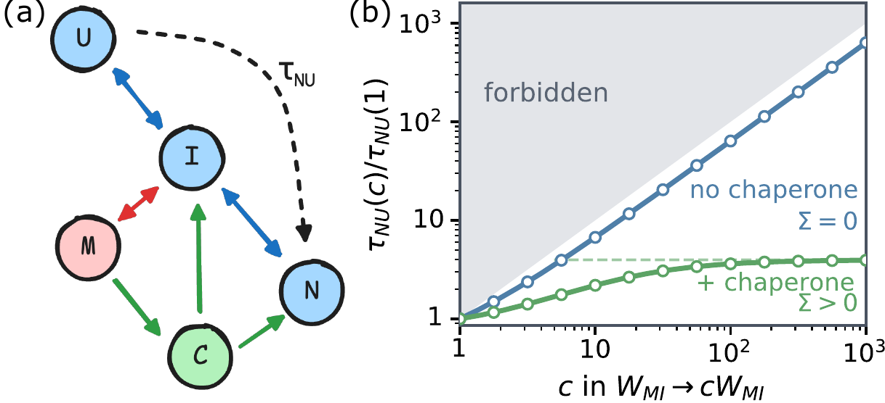
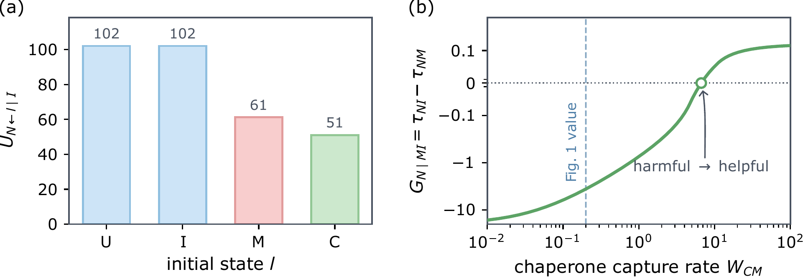
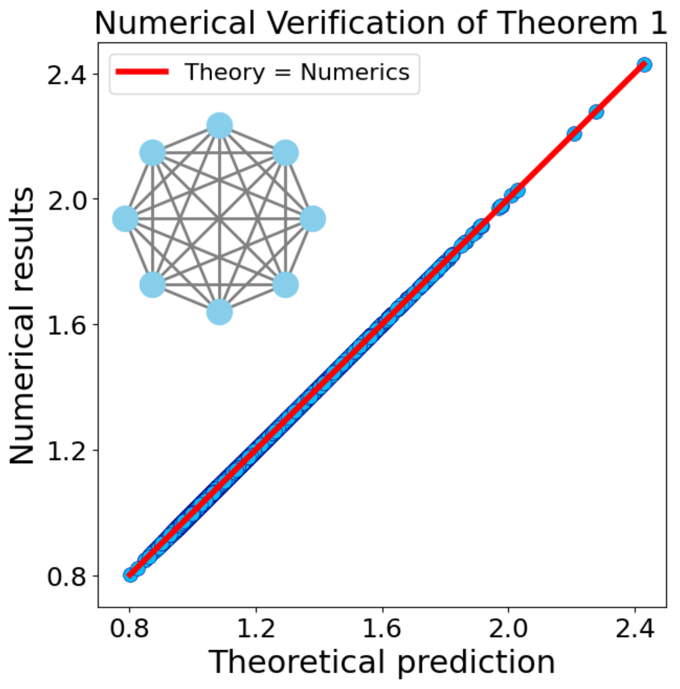

# Exact First-Passage Time Response Theory from Steady-State Response

## 0. 论文要解决的不是“首次到达时间是多少”，而是“改一条边后它怎样变”

Mean first-passage time，简称 MFPT，是系统从初始状态第一次到达目标状态所需时间的平均值。它可以表示蛋白质折叠时间、搜索者找到目标的时间、网络切换时间，也可以表示生态系统从扰动状态回到安全状态的平均时间。

MFPT 本身已有成熟计算方法。本文针对的是另一个问题：当某条跃迁速率被增强、削弱甚至删除时，任意起点到任意目标的 MFPT 会增加还是减少，增加多少，线性近似何时失效？

困难在于，MFPT 是一个带随机停止时刻的瞬态量。传统稳态响应理论研究固定长期分布或稳态电流，不能直接搬到“第一次到达就停止”的过程。作者的关键贡献不是先硬算 MFPT 的扰动，而是构造一个辅助系统，把首次到达事件变成可重复的稳态循环。随后，已有稳态概率响应公式就可以被转译成 MFPT 的精确响应。

全文逻辑是：

```text
先有单边扰动下的稳态概率响应恒等式
    ↓
给原系统添加“目标 → 起点”的极快重置边
    ↓
一次首次到达变成一个可重复更新周期
    ↓
MFPT 变成重置边稳态通量的倒数
    ↓
稳态概率响应被映射成 MFPT 响应
    ↓
响应进一步分成上游可达性、下游利弊和非线性屏蔽
```

对我们的项目，这篇论文提供的是一种**恢复时间与网络干预之间的机制语言**。它不直接证明 `C_peak` 决定恢复率；它告诉我们，一旦把“恢复”定义为首次进入某个恢复集合，就可以进一步问：开放哪条交通或迁移通道最能缩短到达恢复状态的时间，效果为何会被替代路径屏蔽。

## 1. 基本对象：连续时间 Markov 网络与有方向的速率

作者考虑不可约的连续时间 Markov 链。状态可以是构象、位置或任意离散动力学状态。速率矩阵中的 `W_mn` 表示从状态 `n` 跳到状态 `m` 的速率；注意下标顺序是“目的地在前、来源在后”。

记 `tau_kl` 为从状态 `l` 首次到达状态 `k` 的平均时间。因此：

```text
k = target state
l = initial state
tau_kl = mean first-passage time from l to k
```

论文只要求原链不可约，从而存在唯一稳态分布 `pi`。单边扰动写成 `W_mn -> W_mn + Delta W_mn`，允许增强边，也允许把它降低到零，但不能使速率为负。

这一套方向约定后面非常关键。`n` 是被扰动边的来源，`m` 是它把系统送去的状态。若 `m` 比 `n` 更接近目标 `k`，增强该边应有助于首次到达；若 `m` 更远，增强它会把轨迹导向绕路或陷阱。

## 2. 起点不是 MFPT，而是一条稳态概率更新公式

论文先引用作者此前得到的单边稳态响应结果。原文 Lemma 1，也就是 Eq. (1)，给出任意强度单边扰动后，新稳态概率 `pi'_k` 怎样由未扰动稳态概率和未扰动 MFPT 表示。

它的结构可以口头读成：

```text
state k 的新稳态权重
    = 原稳态权重
    × [1 + 边扰动强度 × k 对边两端的到达时间差
         / 一个由局部返回时间造成的有限扰动修正]
```

这里已经出现一个重要量：`tau_kn - tau_km`。它比较从被扰动边两端到目标 `k` 的距离。这个差决定把概率从 `n` 推到 `m` 对目标 `k` 是有利还是有害。

不过 Lemma 1 仍然只描述稳态概率。全文真正的新步骤，是把目标 MFPT 的变化变成某个辅助稳态概率的变化。

## 3. 极快重置为什么能把首次到达变成稳态量

考虑原系统中从起点 `l` 出发、第一次到达目标 `k` 的过程。作者在原网络上额外添加一条单向边：只要系统到达 `k`，就以速率 `W*_{lk}` 从 `k` 被送回 `l`。然后让这个重置速率趋于无穷大。

在这个极限里，系统几乎不会停留在目标 `k`。每次从 `l` 出发，经历一段随机路径首次抵达 `k`，随后立刻重置回 `l`，开始下一轮。原来只发生一次的 first-passage event 于是被拼成稳态更新过程：

```text
l 出发
  → 随机游走直到首次到达 k
  → 立即从 k 重置到 l
  → 再次出发
  → ……
```

长期来看，每一轮恰好穿过一次重置边。单位时间通过该边的稳态通量，就是单位时间完成多少轮首次到达；它的倒数自然是平均每轮时长。原文 End Matter 的 Eq. (12) 把这个关系写成：MFPT 等于极快重置极限下重置通量的倒数。

这一步同时解释了为什么一个瞬态停止时间能够由稳态量表示。作者不是假定两者相似，而是把原过程嵌入一个物理上可解释的 renewal cycle 中。

## 4. 响应对应关系是整篇论文的桥梁

现在分别在原系统与辅助重置系统中扰动同一条边 `n -> m`。由于重置边只负责完成一轮后返回起点，它不会改变到达目标以前的路径。于是扰动前后 MFPT 的比，可以写成辅助系统中目标状态稳态概率的反向比，得到原文 Eq. (2)：

```text
unperturbed MFPT / perturbed MFPT
    = fast-reset auxiliary steady probability after perturbation
      / fast-reset auxiliary steady probability before perturbation
```

直觉上，如果扰动让每轮更快完成，单位时间完成的轮数增加，重置通量和目标附近的辅助稳态权重也会增加；MFPT 因而下降。稳态响应与首次到达响应正好方向相反。

Eq. (2) 的价值在于，它允许作者直接把 Lemma 1 作用到辅助系统。然后再利用“到达目标以前，辅助系统和原系统具有相同 MFPT”这一性质，把所有辅助量消去，最终只留下未扰动原系统的 MFPT 与稳态概率。

## 5. 单边扰动的线性与有限响应

原文 Eq. (3a) 给出 `tau_kl` 对单条速率 `W_mn` 的精确一阶导数。它不是全网规模的复杂矩阵表达式，而是三个未扰动量的乘积：被扰动来源状态的稳态概率、边两端相对目标的到达时间差，以及起点到目标的路径对来源状态 `n` 的可达性。

Eq. (3b) 再把任意有限扰动下的 MFPT 变化写成“线性响应除以一个有限扰动分母”。因此完整响应曲线不是任意形状，而是一条由线性斜率与单个屏蔽量控制的有理曲线。

作者随后通过 Eq. (4) 给这三个部分命名：

```text
MFPT change
    = - perturbation strength
      × steady occupancy of perturbed source
      × downstream gain/loss
      × upstream accessibility
      / nonlinear screening
```

这不是事后的概念包装。每个因子都有不同的状态依赖，并控制不同方面：是否会碰到这条边、碰到后被送往更近还是更远的状态，以及有限扰动是否会被绕行路径逐渐吸收。

## 6. 第一因子：上游可达性决定“这条边会不会被采样”

作者把上游因子记为 `U_{k<-l|n}`。它只关心从起点 `l` 到目标 `k` 的 first-passage trajectories 在抵达目标前有多强地经过来源状态 `n`。

如果 `U=0`，从 `l` 到 `k` 的相关轨迹根本不会经过 `n`，再大幅改变 `n -> m` 也不影响 MFPT。若 `U` 很大，路径被强烈汇聚到 `n`，这条边就处于来源侧瓶颈位置，线性响应被放大。

这一区分避免了一个常见错误：某条边在全局网络中流量很大，不代表它对指定起点到指定目标重要。只有它处于这组 first-passage paths 的上游可达区域，扰动才会被实际采样。

在灾后恢复里，对某个受灾中心开放一条道路是否重要，首先取决于尚未恢复的人群是否会到达这条道路的入口。一个远离实际撤离路径的高容量通道，工程上很大，却可能有近零的 `U`。

## 7. 第二因子：下游 gain/loss 决定响应符号

下游因子 `G_{k|mn}` 比较从 `n` 与从 `m` 到目标 `k` 的 MFPT。因为增强 `W_mn` 会把系统更频繁地从 `n` 送到 `m`，所以：

- 若 `m` 到目标更快，增强该边会缩短 MFPT；
- 若 `m` 到目标更慢，增强该边会延长 MFPT；
- 若两端到目标的 MFPT 相同，任意强度的该边扰动都不改变目标 MFPT。

这个符号只依赖目标 `k` 和边两端，不依赖起点 `l`。同一条边对不同目标可能是 shortcut，也可能是 detour；但对固定目标，它对所有起点的利弊方向一致，区别只在起点是否容易采样它。

这也解释了为何“新增连接一定改善搜索”并不普遍成立。必须先说明目标是谁。没有目标定义，所谓 shortcut 只是几何名称，不是动力学结论。

## 8. 第三因子：非线性屏蔽决定有限干预是否饱和

非线性屏蔽因子 `Sigma_{k|mn}` 只依赖目标和被扰动边，不依赖起点。它在无穷小扰动时不出现，但决定把边增强很多以后，线性外推是否仍成立。

当 `Sigma=0`，从 `m` 继续到目标的轨迹实际上必须重新经过 `n`，该边构成真正的无旁路瓶颈。每次增强有害边都会继续增加陷阱进入频率，响应沿线性趋势持续放大。

当 `Sigma>0`，`m` 下游存在绕过 `n` 的路线。边增强到一定程度后，越来越多轨迹被旁路“救走”，额外增强的边际影响下降，MFPT 变化趋于平台。这就是 screening：不是干预没有作用，而是下游替代路径限制了其最大作用。

这三个因素共同解决了“边重要性”不能由单一 centrality 表示的问题。一条边需要同时满足：起点侧能被采样、终点侧真正改变到目标的距离、下游又缺少替代路径，才会产生巨大且不饱和的响应。

## 9. 一次有限测量可以重建整条响应曲线

因为 Eq. (3b) 把非线性压缩到单个分母参数，作者在 Eq. (5) 推出一个强结论：知道未扰动 MFPT、零扰动处的线性斜率，再测量一个有限扰动点，就能反推出屏蔽因子，并预测任意其他扰动强度下的整条响应曲线。

这不是一般非线性系统都具备的性质，而是单速率扰动下精确有理形式的结果。实验上，它意味着不需要为每个干预强度重新扫描完整网络；一个小扰动和一个有限扰动就足以判别曲线是否接近线性、何时开始饱和。

同一结构还给出曲率关系。原文 Eq. (10b) 表明二阶响应由一阶响应乘以屏蔽因子决定，因此斜率与曲率也可以反推出完整曲线。

## 10. 普适界限告诉我们一条边不可能无限放大全局时钟

作者从扰动后 MFPT 必须非负出发，得到 Eq. (6a)-Eq. (6b) 的 MFPT 不等式，再结合三角不等式得到 Eq. (7a)-Eq. (7b) 的相对对数响应界限。

最直观的结论是：把一条速率乘以 `c` 后，MFPT 的相对变化不会比 `c` 或 `1/c` 更极端。增强一条有害边可以让首次到达变慢，但其倍率受到速率倍率的普适包络约束；帮助边的加速也有对应边界。

Eq. (8)-Eq. (9) 进一步给出局部性：对固定被扰动边，最大响应出现在从该边来源状态开始的 MFPT；对固定目标任务，最强加速来自直接进入目标的最后一步。换句话说，最极端的首次到达加速发生在最局部的 source-edge-target 配置，而不是由远处任意边实现。

这些界限适合做结果审计。如果数值估计或实证拟合声称单条速率增加 10% 就让严格 Markov MFPT 缩短 90%，首先应检查状态定义、估计误差或模型假设是否被破坏。

## 11. 蛋白质折叠网络把三个因子分别显影



论文用一个最小蛋白质折叠网络解释屏蔽。系统从未折叠状态 `U` 出发，经中间态 `I` 到达天然折叠态 `N`。被增强的玫红色边 `I -> M` 把蛋白质送入错误折叠态 `M`，因此是有害的 trap-entry edge。

没有伴侣蛋白时，从 `M` 到 `N` 必须回到 `I`。这使 `Sigma=0`，陷阱没有下游逃生旁路；随着 `I -> M` 速率乘数 `c` 增大，折叠 MFPT 基本沿直线持续增长。

加入伴侣蛋白状态 `C` 后，`M -> C -> N` 提供不返回 `I` 的 productive rescue route，另一路 `C -> I` 则是无效释放。此时 `Sigma>0`，同样增强陷阱入口虽然仍会延长折叠时间，但响应逐渐饱和到有限平台。

这幅图的重要信息不是“伴侣蛋白有帮助”这一常识，而是它把帮助具体定位为**下游非线性屏蔽**：伴侣蛋白没有改变被扰动边本身，也不需要改变起点侧是否到达 `I`，它通过 `M` 后面的绕行路线限制陷阱的最大伤害。

补充材料再分别改变起点和伴侣捕获率，展示另外两个因子。



左图显示同一扰动对不同初态的 `U` 不同，因而响应幅度不同。右图则显示随着伴侣捕获率增加，边两端相对目标的 MFPT 差跨过零点，同一条边可以从 harmful 变成 helpful。边的作用不是固定标签，而取决于完整下游动力学。

## 12. 大规模随机网络验证的是公式，不是现实适用性



补充材料在 `10^5` 个随机试验中生成 8 状态全连接 Markov 链，随机选择 MFPT 起点与目标、被扰动边及扰动强度。直接重算得到的 MFPT 比值与精确公式落在对角线上。

这证明代数公式在设定的有限 Markov 链上得到数值验证，也说明有限响应不是小扰动近似。它不能证明真实蛋白、生态系统或城市满足 Markov 假设；现实适用性仍取决于状态构造、时间齐次性和转移率可识别性。

## 13. Target-resolved shortcut 消除了一个表面上的 Braess paradox

作者把从所有初态到固定目标 `k` 的 MFPT 平均，定义 target-resolved global MFPT。由 Eq. (11)，只要新增边把系统从 `n` 送到对目标 `k` 更近的 `m`，它就必然降低这个固定目标的平均首次到达时间。

此前文献报告“加入 shortcut 反而降低搜索效率”的 Braess-type paradox，使用的是进一步对所有目标再平均的指标。同一条边对某些目标是 shortcut，对另一些目标却是 detour；混合目标后总平均可以上升。

因此这里不是网络悖论被彻底否定，而是指标的目标语义被澄清。对固定目标，动力学 shortcut 按定义必然改善；对目标混合的任务，边的符号随目标变化，平均后可能出现反直觉结果。

这对灾害恢复指标同样重要。“恢复到什么”必须先固定。回到常住人口基线、恢复中心访问、恢复全市 OD 强度和恢复弱势群体可达性是不同目标；同一交通干预可能缩短其中一个 first-passage time，却延长另一个。

## 14. 多边扰动与计算优势来自递归，而不是新的闭式魔法

单边有限更新只依赖少量未扰动 MFPT 和稳态概率。对多条边，作者依次施加扰动：用 Lemma 1 更新稳态分布，用 Eq. (15) 更新 MFPT，再把更新后的量作为下一条边的基准。这样可以对任意有限边集得到精确递归结果。

当基准系统的完整 MFPT 矩阵和稳态分布已经算好，而新系统只改变 `K` 条边时，递归更新可比从头求逆更省计算。优势来自稀疏改动；若几乎所有边都变化，递归的依赖闭包扩大，收益会减弱。

因此这套方法适合干预筛选、局部参数扫描和网络版本更新，不意味着任意大网络的 MFPT 已变成常数时间计算。

## 15. 对灾后人口恢复框架的可执行连接

我们的现有 reduced model 用连续人口异常 `D(t)` 描述峰值后的指数松弛，并用 `C_peak` 解释事件间恢复率差异。MFPT 视角可以增加一个互补问题：

```text
不是只拟合平均衰减斜率，
而是定义一个“恢复集合”，
测量每个事件第一次稳定进入该集合需要多久。
```

第一步必须明确状态。可以把连续观测离散为“中心受困”“外向释放”“回流重平衡”“已恢复”等状态，或者把人口异常、中心异常与通道活动联合分箱。目标 `k` 不应只是一帧落入阈值，而应要求连续若干窗口维持在阈值内，避免噪声造成过早首次穿越。

第二步定义转移。某条 `n -> m` 边可以代表从中心受困状态进入外向释放状态，也可以代表空间 OD 网络中的一条迁移通道。两种建模层次不能混用：前者是 event-state Markov chain，后者是 population-location transition network。

第三步再解释三个响应因子：

- 上游可达性：尚未恢复的人群或事件轨迹是否会经过待干预的来源状态/通道入口；
- 下游 gain/loss：通过这条边后，距离所定义的恢复目标更近还是更远；
- 非线性屏蔽：下游是否存在替代路径，使继续扩容的边际收益趋于饱和。

这可形成一套比“道路越多恢复越快”更精确的干预假设。例如，开放一条中心外向通道只有在受困人口能到达入口、出口确实通往安全或回流网络、且没有其他可替代路线时，才会显著降低恢复 MFPT；已有多条旁路时，继续扩容会被屏蔽。

## 16. 与 `C_peak` 理论关系最清楚的地方

`C_peak` 仍然是峰值时系统所处状态的 reduced marker。它可以帮助区分首次到达过程从“中心仍堆积”还是“中心已释放”开始，并因此改变起点 `l`、状态占据和上游可达性。

MFPT 理论则关注在给定起点与目标后，改变一条转移率会怎样改变到达时间。二者的层次不同：

```text
C_peak hypothesis
    解释不同事件为什么具有不同恢复速度或恢复起点

MFPT response theory
    解释在一个给定状态网络里，哪条转移边控制恢复时间
```

最有价值的组合不是把 `C_peak` 塞进 Eq. (3a)，而是分层验证：先看 `C_peak` 是否预测恢复目标的 first-passage time；再在 `C_peak` 相近的事件中，检验通道开放度或转移率差异是否按 upstream / gain-loss / screening 结构解释剩余变化。

## 17. 使用这套理论前必须满足的边界

- 状态过程需要近似连续时间、时间齐次 Markov；灾后政策、信息和基础设施快速变化会破坏这一点。
- 论文研究单个实现机制下的平均首次到达时间，不覆盖完整 first-passage distribution 的尾部风险。
- 不可约性保证原系统稳态存在；真实灾害可能临时断网、形成不可达区域或吸收性离开。
- 观测到的 OD 流不是转移速率本身；设备抽样、停留时间和人口基数都需要进入估计。
- 单边扰动公式要求其余速率不变；道路开放常会同时改变绕行、目的地吸引和行为规则。
- 恢复目标若定义不稳，target-resolved shortcut 的符号也会随之改变。

这篇论文最持久的价值可以概括为：**它把一个全局恢复时钟对局部通道的敏感性精确拆成“能否到达入口、出口是否更接近目标、下游是否有旁路”三件事，并用快速重置构造证明这种分解不是比喻。**
