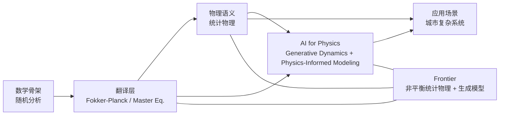

# Knowledge Map Overview

Research Collector 不把知识结构写成四个彼此独立的方向，而是写成一条连续的研究链。

## A Better Logic

### 1. 数学骨架

- 随机分析：Brownian motion, Ito calculus, SDE, path-space dynamics

### 2. 翻译层

- Fokker-Planck / Master equation：把路径级随机动力学翻译成密度演化

### 3. 物理语义层

- 统计物理：entropy, free energy, fluctuation theorems, NESS, irreversibility

### 4. AI for Physics 层

- 这一层继续展开成两条主线：
  - generative dynamics：score, diffusion, reverse-time SDE, flow matching
  - physics-informed modeling：variational / free-energy language, scientific inverse problems, scientific ML

### 5. 应用场景层

- 城市复杂系统：scaling, transport networks, migration dynamics, spatial diffusion

这里最重要的观点是：**Fokker-Planck 不是“又一个方向”，也不只是一个公共名词，而是一层翻译机制。**

它把“随机路径”翻译成“分布演化”，再进一步连接到：

- 统计物理对不可逆性、熵产生和自由能的解释
- AI for Physics 中的 diffusion / score / flow 模型对逆向生成和密度传输的构造
- 城市系统中迁移、扩散和网络流的连续极限表述

## Frontier Focus

当前最值得持续追踪的桥接主题是：

1. 非平衡统计物理 + 生成模型
2. 随机热力学 + 轨迹学习
3. variational free energy / ELBO 与物理先验生成模型
4. score-based diffusion / flow 在 scientific machine learning 中的物理化

