# Bernard Derrida: Large deviations of non-equilibrium diffusive systems

- Source video: https://www.youtube.com/watch?v=1faKoBxBvQU
- English transcript: [transcript.md](../transcripts/1faKoBxBvQU-bernard-derrida-large-deviations-of-non-equilibrium-diffusiv/transcript.md)
- Curated board frames: [curated/index.md](../slides/1faKoBxBvQU-bernard-derrida-large-deviations-of-non-equilibrium-diffusive-systems-lecture-i/curated/index.md)

## Board Overview

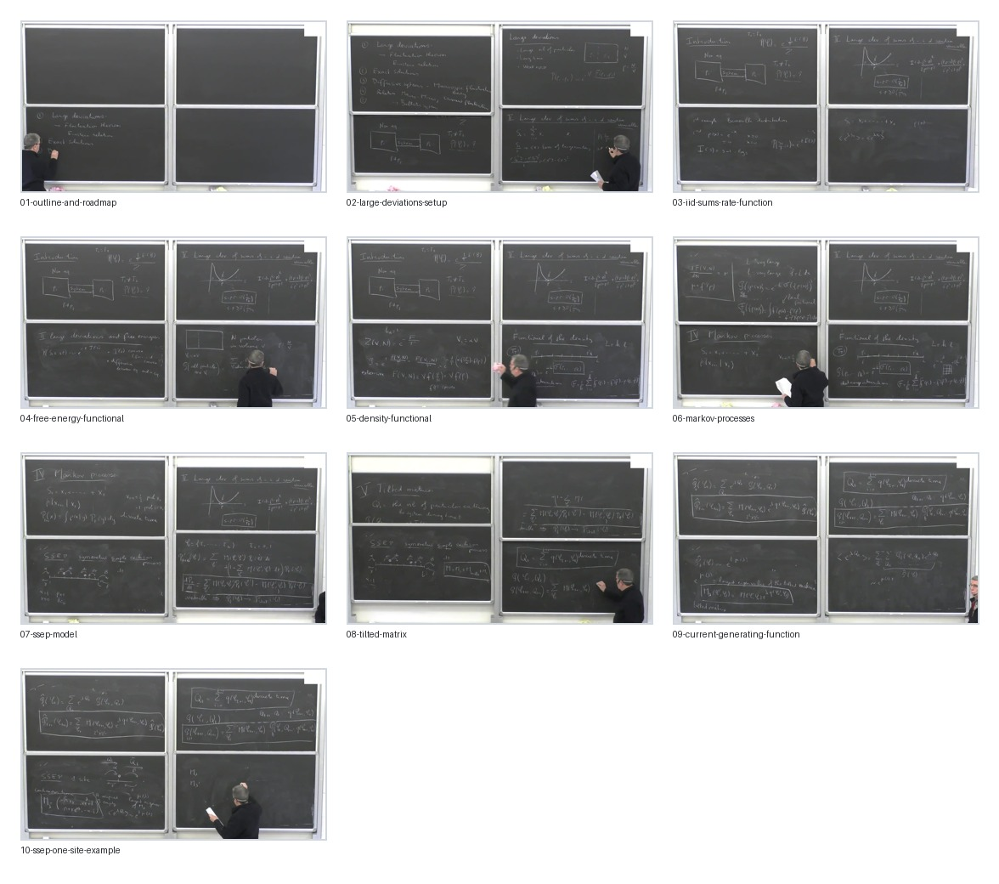

## 1. 开场：五讲路线图与问题设置

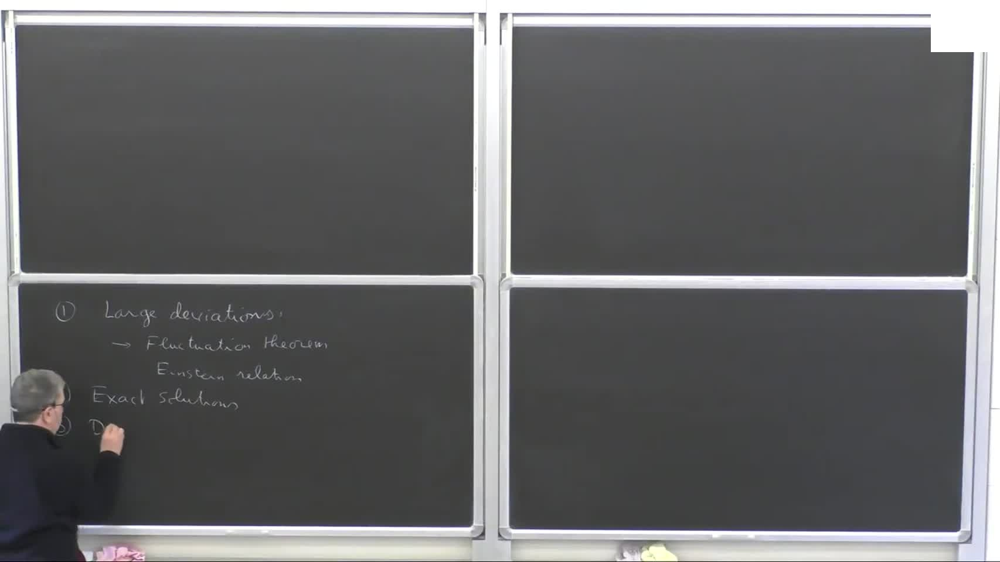

- 对应时间：`00:00:00-00:03:00`
- 中文整理：
Bernard Derrida 一开始先交代了整个系列课的结构。第一讲是 `large deviations` 的入门，同时会碰到 `fluctuation theorem` 和 `Einstein relation / fluctuation-dissipation relation`；第二讲讲 `exact solutions`；第三讲开始进入 `diffusive systems` 和 `macroscopic fluctuation theory`；后面还会回到 `micro-macro relation`、`current fluctuations`，以及如果时间够的话再碰 `ballistic systems`。

这个开场很重要，因为它说明这门课不是孤立地讲概率论技巧，而是要把这条链连起来：

```text
large deviations
-> fluctuation theorem / Einstein relation
-> diffusive systems
-> macroscopic fluctuation theory
-> current fluctuations
```

如果你从现在的研究主线看，这正好把 `随机过程`、`统计物理`、`非平衡扩散系统`、`current large deviations` 这些东西放到同一条路上。

## 2. 非平衡稳态与 large deviations 的基本问题

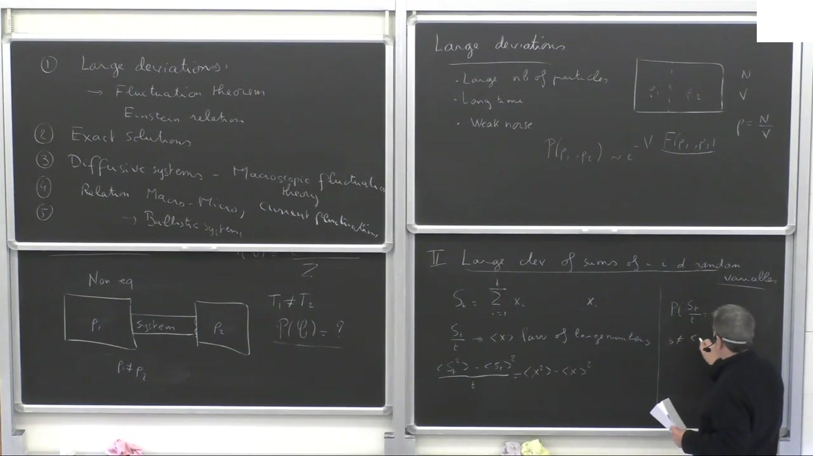

- 对应时间：`00:03:00-00:09:00`
- 中文整理：
他先从最经典的非平衡设置讲起：系统接触两个不同温度或不同粒子密度的 reservoir。平衡时，如果两端温度相同，我们知道微观构型服从 Gibbs ensemble；但一旦两端条件不同，系统即使到了稳态，你通常也不知道这个 steady-state distribution 的显式形式。

这一步的关键不是“稳态存在”，而是：

- 平衡统计物理的起点是已知分布；
- 非平衡稳态往往没有现成分布公式；
- 因此我们需要换一种方式提问。

Derrida 的做法是：不直接问“完整稳态分布是什么”，而是问“某个非常不典型的宏观事件发生的概率有多小”。这就是 large deviations 的入口。

他给出的直觉也很清楚：large deviations 对应的是由某个大参数控制的稀有事件，常见来源包括：

- 粒子数很大；
- 观测时间很长；
- 噪声很弱。

所以 large deviations 不是只研究“极少发生、没意义的罕见事件”，而是在研究：`偏离典型行为的概率如何以指数尺度衰减`。

## 3. 第一批例子：i.i.d. 求和、rate function 与 Gaussian 极限

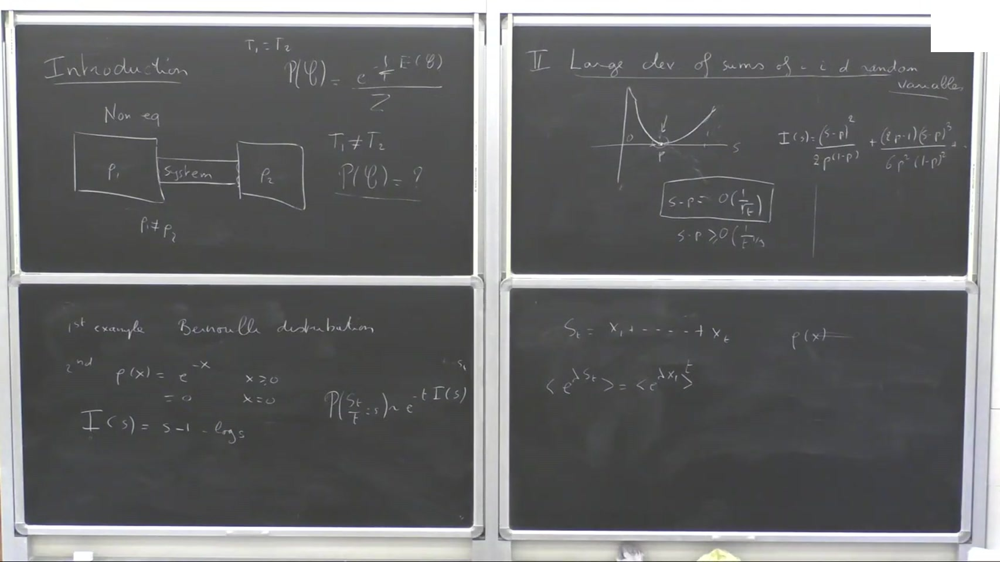

- 对应时间：`00:09:00-00:24:00`
- 中文整理：
接下来他先退回到最简单的情形：`S_t = X_1 + ... + X_t`，其中 `X_i` 是 i.i.d. 随机变量。

大框架是：

```text
P(S_t / t = s) ~ exp[-t I(s)]
```

这里 `I(s)` 就是 rate function。Bernard 用两个最基础的例子来建立直觉：

1. `Bernoulli` 分布：
   `X_i = 1` with probability `p`, `0` with probability `1-p`。
   这时可以直接算出显式的 `I(s)`，并看到它在 `s = p` 附近二次展开，局部近似就是 Gaussian。

2. 指数分布例子：
   他提到这也是少数能写出显式 `I(s)` 的简单模型之一。

这一段的核心不是具体公式，而是两个层次：

- `law of large numbers` 告诉你典型值在哪里；
- `central limit theorem` 只描述离典型值很近的小涨落；
- `large deviation function` 才描述真正远离典型值的指数级代价。

所以 large deviations 可以看作对 CLT 的“非微扰扩展”：不只是近似地看方差，而是完整地看稀有偏离的代价函数。

## 4. Generating function、Legendre 结构与 Gartner-Ellis

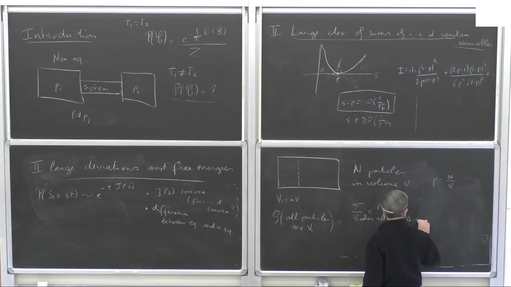

- 对应时间：`00:18:00-00:27:00`
- 中文整理：
在 i.i.d. 例子之后，他马上切到更一般的工具：生成函数与 saddle-point 近似。

如果定义

```text
<exp(lambda S_t)> ~ exp[t mu(lambda)]
```

那么当 `t` 很大时，`mu(lambda)` 和 `I(s)` 之间通过 Legendre 结构联系起来。Bernard 没有在这里停留太多数学细节，但把最重要的结论写出来了：

- 如果知道 `mu(lambda)`，通常可以参数化地恢复 `I(s)`；
- 这背后是 saddle-point / steepest-descent；
- 在适当条件下，这对应 `Gartner-Ellis theorem` 的思路。

对你来说，这一段最关键的启发是：

`large deviations` 不是孤立对象，而是和 `cumulant generating function` 天然成对出现的。

后面到 `current fluctuations` 和 `tilted matrix` 时，整套结构会再次出现，只是 `S_t` 不再是 i.i.d. 求和，而是 Markov 系统上的时间加和量或通量。

## 5. 为什么 large deviations 和 free energy 直接相连

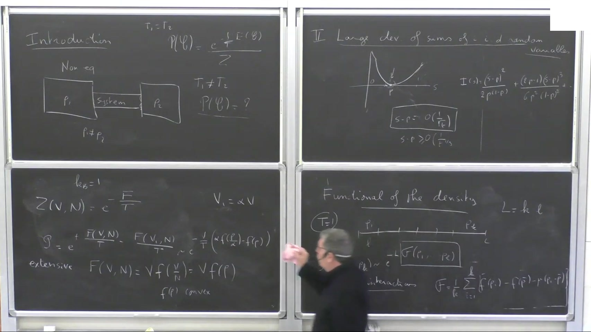

- 对应时间：`00:27:00-00:42:00`
- 中文整理：
这一段是整场讲座最值得记住的桥接点之一。Bernard 的意思很明确：

`large deviations` 并不是“纯概率里的稀有事件计算”，它和 `free energy` 本来就是一回事的两种说法。

他的例子是：在一个很大的体积里放很多粒子，问“所有粒子都挤在左半边 `V_1 = alpha V` 的概率是多少”。这个概率极小，但它并不神秘，它本质上就是：

```text
rare-event probability
~ partition-function ratio
~ exp[- free-energy difference ]
```

也就是说，所谓 large deviation function，其实就是自由能差在大系统极限下的密度化表达。

这一步有两个重要后果：

- equilibrium large deviations 往往继承 free energy 的凸性；
- 一旦去到非平衡，large deviation function 可能表现出和 equilibrium 很不一样的结构，甚至出现非凸相关现象。

这正是 Bernard 后面要走向 `macroscopic fluctuation theory` 的原因：非平衡系统里 large deviation functional 不再只是简单的 equilibrium free energy。

## 6. Density functional：从单个宏观量到空间分布

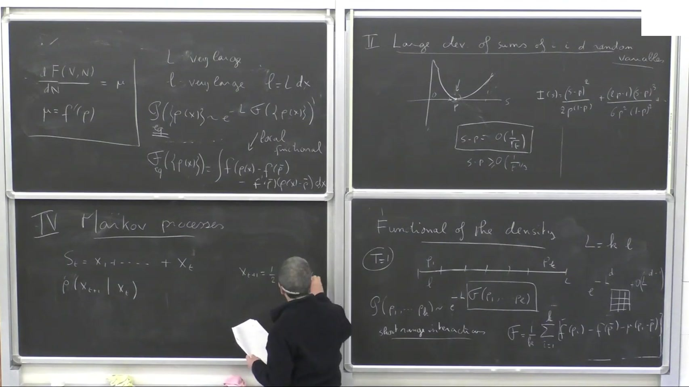

- 对应时间：`00:34:00-00:54:00`
- 中文整理：
在这里，问题从一个单独的宏观数值 `s` 推进到了整条密度剖面 `rho(x)`。

Bernard 讨论的是：把大系统再切成很多小盒子，问“第一个盒子的密度是 `rho_1`，第二个盒子是 `rho_2`，...，第 `k` 个盒子是 `rho_k`”这种空间分布事件的概率。

对短程相互作用的 equilibrium 系统，他写出的核心思想是：

```text
P({rho_i}) ~ exp[-L G({rho_i})]
```

而这个 functional `G` 在 equilibrium 下可以写成局域的 free-energy-density 结构。更连续地看，就是：

```text
G[rho(x)] = integral [ f(rho(x)) - f(rho_bar) - f'(rho_bar)(rho(x)-rho_bar) ] dx
```

这是一个非常重要的翻译层：

- 在概率论里，它是 density profile 的 large deviation functional；
- 在统计物理里，它是 free-energy-density 的空间积分；
- 在更后面的非平衡扩散系统里，它会升级成真正的 `macroscopic fluctuation theory` 的对象。

你如果和自己现在的知识图谱对照，可以把这里理解成：

`large deviations of profiles -> free energy functional -> non-equilibrium density functional`

## 7. 从 profile 到 dynamics：Markov process 与 master equation

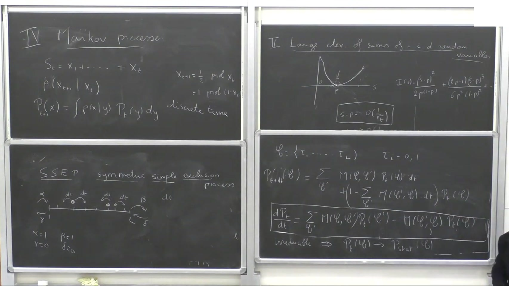

- 对应时间：`00:54:00-01:12:00`
- 中文整理：
讲到这一步，他开始把静态 large deviations 切到动力学对象上。方法是标准但非常关键：用 Markov process 来描述系统的时间演化。

主线是：

- 配置空间中的系统演化由 transition rates 决定；
- 概率分布 `P_t(C)` 满足 master equation；
- 当 Markov process 是 irreducible 的，就会走向唯一 steady state。

这里他拿 `SSEP` 作为后面的主要原型系统。你可以把这一步看成一座桥：

```text
equilibrium free-energy viewpoint
-> stochastic dynamics in configuration space
-> current fluctuations in Markov systems
```

这和你已有的 `master equation / Fokker-Planck` 背景是直接对上的。这里只不过 Bernard 选择的是离散配置的 Markov 链，而不是连续状态的扩散过程。

## 8. Current fluctuations 与 tilted matrix

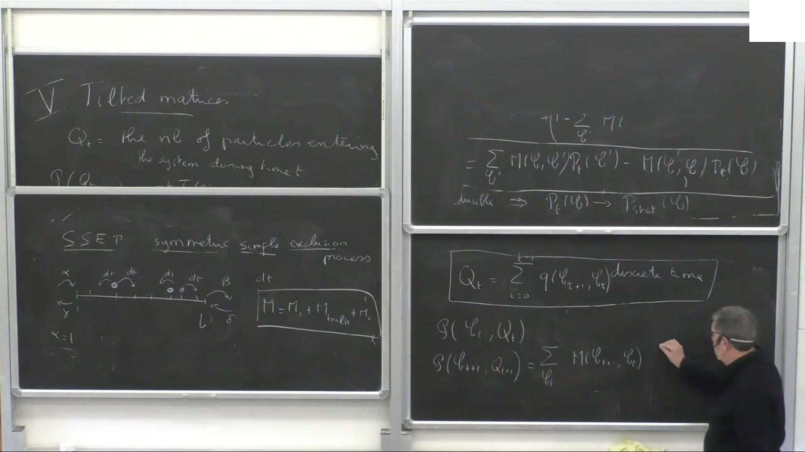
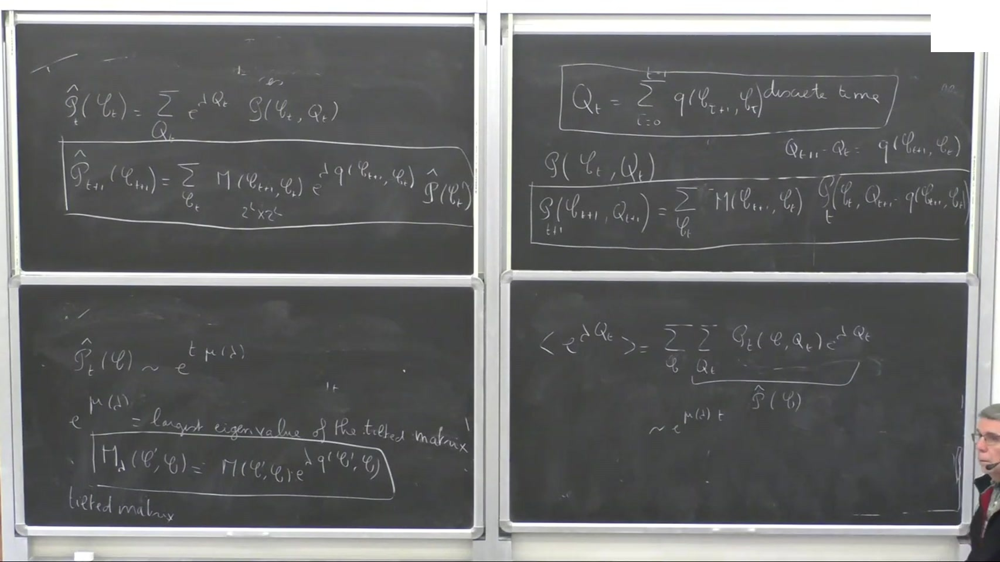

- 对应时间：`01:12:00-01:24:00`
- 中文整理：
这一段是 Lecture I 最核心的方法论部分。

Bernard 关心的是：观测很长时间 `t` 内通过系统的总粒子数 `Q_t`，它的平均、涨落以及 `large deviation function` 是什么。

他的方法是：

1. 不直接算 `Q_t` 的分布。
2. 先看生成函数 `⟨exp(lambda Q_t)⟩`。
3. 把原来的 Markov generator `M` 改造成 `tilted matrix`：

```text
M_lambda(C', C) = M(C', C) exp[lambda q(C', C)]
```

其中 `q(C', C)` 记录一次跃迁对电流/粒子流的贡献。

这时大时间极限下：

```text
<exp(lambda Q_t)> ~ exp[t mu(lambda)]
```

而 `mu(lambda)` 就是 `M_lambda` 的最大特征值。

这一点极其重要，因为它把一个看起来很难的时间累计量涨落问题，转换成了一个有限维线性代数问题：

`current large deviations -> tilted operator -> largest eigenvalue`

你如果从生成模型和随机热力学的角度看，这一步和前面 i.i.d. 例子里的 `mu(lambda)` 是同一结构的动力学版本。差别只是：

- 之前的 `mu(lambda)` 来自独立随机变量的积分；
- 这里的 `mu(lambda)` 来自 Markov generator 的谱。

## 9. 一站式例子：one-site SSEP / “quantum dot” 与 fluctuation theorem 对称性

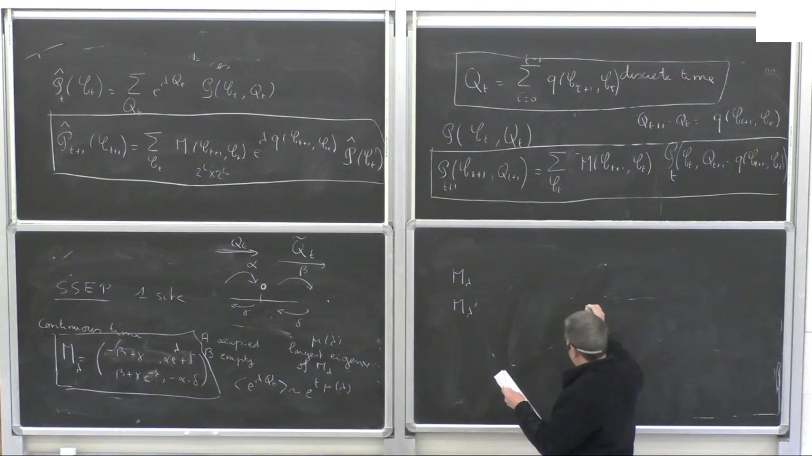

- 对应时间：`01:24:00-01:33:37`
- 中文整理：
最后 Bernard 用一个最小模型把前面的方法全部落地：`one-site SSEP`。系统只有两种状态：

- 空
- 占据

粒子可以从左或右 reservoir 进入或离开，所以完整系统只有 `2 x 2` 的 generator。这个例子的价值在于：

- 你可以手工把 `Markov matrix` 写出来；
- 也可以手工写出 `tilted matrix`；
- 再直接求最大特征值，得到 `mu(lambda)`。

更重要的是，他指出这个 `mu(lambda)` 还满足一个额外的对称性，粗略就是

```text
mu(lambda) = mu(constant - lambda)
```

常数由左右 reservoir 的进入/离开率组合给出。Bernard 把它解释成 `fluctuation theorem` 的一个具体实例，本质上和时间反演对称性有关。

对你来说，这一段有两个直接启发：

1. `current large deviations` 的许多结果并不一定从 PDE 开始，而是可以先从一个极小的 Markov toy model 完全做透。
2. `tilted operator + largest eigenvalue + symmetry relation` 这套框架，是后面读非平衡 current fluctuation 文献时最应该先掌握的工具。

## 10. 这场 Lecture I 的真正主线

如果把 Bernard 这一讲压缩成一条真正可复用的研究主线，我会写成：

```text
non-equilibrium steady states
-> rare events and large deviations
-> i.i.d. sums and rate functions
-> generating function / Legendre structure
-> free energy as equilibrium large-deviation functional
-> density-profile functional
-> Markov dynamics and master equation
-> current fluctuations
-> tilted matrix and largest eigenvalue
-> fluctuation-theorem symmetry
```

和你当前学习路径的对应关系也很清楚：

- `Stat_dynamics`：这里把 free energy、凸性、非平衡和涨落联系起来；
- `FTEC 5220`：这里把随机过程、Markov dynamics、生成函数和 long-time asymptotics 用在具体统计物理对象上；
- `Research_Collector` 主线：这讲为后面读 `MFT / current large deviations / non-equilibrium diffusive systems` 打底。

## 11. 建议你接下来怎么用这份讲座包

- 先看 [curated/index.md](../slides/1faKoBxBvQU-bernard-derrida-large-deviations-of-non-equilibrium-diffusive-systems-lecture-i/curated/index.md) 里的 10 张关键板书帧，抓住 Lecture I 的阶段划分。
- 再重点读 [transcript.md](../transcripts/1faKoBxBvQU-bernard-derrida-large-deviations-of-non-equilibrium-diffusiv/transcript.md) 的这些时间段：
  1. `00:00-00:09`：问题设置与 lecture roadmap
  2. `00:09-00:24`：i.i.d. large deviations
  3. `00:27-00:42`：free energy / density functional
  4. `00:54-01:12`：Markov process / master equation
  5. `01:12-01:33`：tilted matrix / current fluctuations
- 如果后面要做复现，最适合的第一个切口不是直接碰宏观涨落理论，而是：
  1. 重做 `Bernoulli` 例子的 `I(s)` 与 Gaussian 近似。
  2. 重做 `one-site SSEP` 的 tilted matrix 和最大特征值。

## 12. Self Check

我对这份整合稿做了这几类检查：

- 结构检查：主线覆盖了从 opening 到 one-site example 的整场 Lecture I，没有只停在前半段。
- 资源检查：文中引用的图像都来自 `curated/` 目录，对应的是 Bernard 的黑板讲座关键帧，不再混入错误视频。
- 内容边界：对于 transcript 中少数明显口语噪声段，我没有硬做逐句翻译，而是只保留板书和上下文能稳定支撑的内容。

边界说明：

- 这是黑板讲座，图像本身不如 PPT 那样信息密集，所以最终理解仍以整合稿和 transcript 为主。
- transcript 后半段有少量法语口音导致的误识别，但关键术语如 `large deviations`、`free energy`、`Markov process`、`SSEP`、`tilted matrix`、`fluctuation theorem` 已做过一轮清洗。
