# Energy-Based Transformers are Scalable Learners and Thinkers：线性笔记

- Video: [Energy-Based Transformers are Scalable Learners and Thinkers (Paper Review)](https://www.youtube.com/watch?v=RAEy3JZmIaA)
- Transcript: [transcript.md](../transcripts/RAEy3JZmIaA-energy-based-transformers-are-scalable-learners-and-thinkers/transcript.md)
- Slide frames: [index.md](../slides/RAEy3JZmIaA-energy-based-transformers-are-scalable-learners-and-thinkers-paper-review/index.md)
- Related code/project shown in slide: `energy-based-transformers.github.io`, `github.com/alexiglad/EBT`

## 作者与研究脉络

这篇文章的作者网络比较值得先交代清楚，因为它不是单纯从 NLP scaling 线里长出来的，而是几条线汇到一起：`energy-based model / world model / System 2 thinking`、`Transformer scaling`、`multimodal and embodied AI`、`LLM agents and knowledge systems`。

按项目页和 arXiv 页面，作者包括 [Alexi Gladstone](https://alexiglad.github.io/)、[Ganesh Nanduru](https://nanduruganesh.github.io/)、[Md Mofijul Islam](https://mmiakashs.github.io/)、[Peixuan Han](https://hanpx20.github.io/)、[Hyeonjeong Ha](https://hyeonjeongha.github.io/)、[Aman Chadha](https://www.amanchadha.com/about.htm)、[Yilun Du](https://yilundu.github.io/)、[Heng Ji](https://blender.cs.illinois.edu/hengji/research.html)、[Jundong Li](https://jundongli.github.io/)、[Tariq Iqbal](https://www.tiqbal.com/)。arXiv 记录显示论文在 2025-07-02 提交；Alexi Gladstone 个人主页和 Hyeonjeong Ha 主页都标注这篇工作为 ICLR 2026 Oral。

第一条线是 Alexi Gladstone 牵头的 `world models / System 2 thinking / self-supervised learning / multimodal learning`。BLENDER Lab 的人员页把 Alexi 列为 PhD student，方向正是 world models、System 2 thinking、自监督学习和多模态学习；他的个人主页也把 EBT 归到 reasoning、test-time compute、energy-based models、scaling law 等关键词下。也就是说，这篇文章的一作脉络不是只做语言模型 benchmark，而是试图把“推断时计算”改写成一种更一般的世界模型和能量优化框架。

第二条线来自 UVA 的人机协作、机器人和可信机器学习背景。Tariq Iqbal 是 UVA Systems and Information Engineering / Computer Science 助理教授，领导 Collaborative Robotics Lab，研究重点是让机器人在复杂人类环境中理解、预测并协作。Ganesh Nanduru 是 UVA Master of Computer Science 学生，也在 UVA Collaborative Robotics Lab 做机器学习、机器人和人机交互相关研究。Jundong Li 是 UVA ECE/CS 副教授，研究覆盖 graph machine learning、trustworthy/safe machine learning 和 LLM。Md Mofijul Islam 则是 UVA PhD 出身，曾在 Tariq Iqbal 的组里做多模态、多任务表示学习，当前在 AWS GenAI 做生成式 AI、LLM、代码生成、多智能体和多模态学习。

第三条线是 UIUC BLENDER Lab 的 NLP、多模态、知识系统和 agentic AI。Heng Ji 是 UIUC 计算机科学教授、BLENDER Lab 负责人，长期做 information extraction、多模态/多语言知识抽取、knowledge + LLM、AI for science 和 agentic AI。Hyeonjeong Ha 是 UIUC BLENDER Lab PhD student，方向包括 MLLM 的视觉感知、可信多模态框架、可解释性和鲁棒性。Peixuan Han 是 UIUC PhD student，研究 NLP、language agents、social reasoning、LLM safety 等。这个团队背景解释了为什么 EBT 论文虽然看起来是模型结构论文，却很强调 verifier、reasoning、uncertainty、agent 和泛化。

第四条线是 Yilun Du 的 EBM / compositional generative model / embodied intelligence 脉络。Yilun Du 当前是 Harvard Kempner Institute 和 CS 的 Assistant Professor，领导 Embodied Minds Lab；他的主页明确把研究重点放在 generative models、decision making、robot learning、embodied agents 和 scientific domains，并强调通过 learning energy landscapes 让模型在少数据和分布外场景下泛化。这条线非常关键，因为 EBT 里的 energy landscape、test-time optimization、compositional generalization 和我们之前读的 HJB/HJ-sampler 的“标量函数组织推断”能接上。

第五条线是产业 GenAI 和多模态工程经验。Aman Chadha 的主页显示他曾在 AWS 领导 GenAI 团队，并有 Stanford AI、多模态 AI、Apple on-device multimodal AI 等背景；Md Mofijul Islam 也在 AWS GenAI 做应用科学。这部分背景有助于理解论文为什么反复强调 scalability、parallelizability、training stability 和工程可扩展性。

所以，这篇文章的作者结构可以压成一句话：

`UVA/robotics-human-centered AI 提供自监督世界模型与真实系统动机，UIUC BLENDER 提供 LLM/多模态/知识系统与 reasoning 语境，Yilun Du 提供 EBM 和 energy landscape 的核心学术脉络，AWS/Stanford 线提供产业 GenAI 和 scaling 工程背景。`

## 核心判断

这份 EBT 材料的主线不是“又提出一种 Transformer 变体”，而是把预测问题的角色重新分配了一次。

标准自回归 Transformer 的工作方式是：给定上下文 $x$，模型一次前向传播直接输出下一个 token 的分布。EBT 的工作方式是：给定上下文 $x$ 和一个候选输出 $\hat y$，模型不直接给出答案，而是给出一个标量能量 $E_\theta(x,\hat y)$。低能量表示“这个候选输出和上下文更兼容”，高能量表示“不兼容”。于是推断阶段不再是一次前向传播，而是从一个随机候选输出出发，沿着能量下降方向一步步优化，直到找到更低能量的候选输出。

所以这篇工作的真正转向是：

`从直接生成答案，转向学习一个可在推断阶段反复查询和优化的 verifier / energy landscape。`

这也是它为什么把自己放进 `System 2 thinking` 叙事里：所谓 thinking，在这里并不是神秘的认知能力，而是一个可操作的计算定义，即推断阶段能否通过投入更多计算，让候选输出在 learned verifier 下变得更好。

## 1. 00:00-02:23：问题不是“模型更大”，而是“能不能无监督地学会推断时思考”

代表 frame：

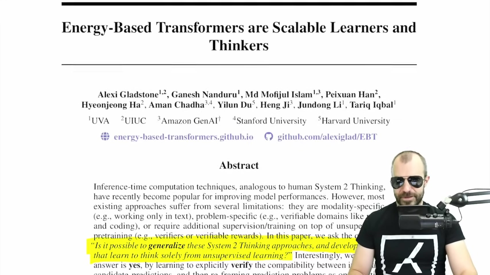

开头提出的问题很大：能不能把当前的 `System 2 thinking` 方法推广到任意问题、任意模态，并且只依靠无监督学习获得这种能力。

这句话要拆开读。当前很多 reasoning model 的提升来自推断时计算，例如 chain-of-thought、self-consistency、搜索、验证器、RL 训练等。但是这些方法往往依赖一个外部可验证信号。数学题可以比对答案，代码题可以跑单元测试，所以强化学习或 reward-based training 比较自然。可一旦进入语言、视频、连续状态空间、真实世界预测，很多任务没有清晰的规则化 reward，也没有容易写出的 verifier。

EBT 试图回答的就是这个空缺：如果没有外部 verifier，模型能不能自己学出一个内部 verifier，然后在推断阶段用它来改进输出。

因此开头的问题不是简单的“如何让 Transformer 更强”，而是：

`能否从无监督数据里学出一个标量评价函数，使模型在推断阶段可以靠优化这个评价函数来改进答案。`

## 2. 02:23-08:25：System 1 / System 2 的机器学习翻译

代表 frame：

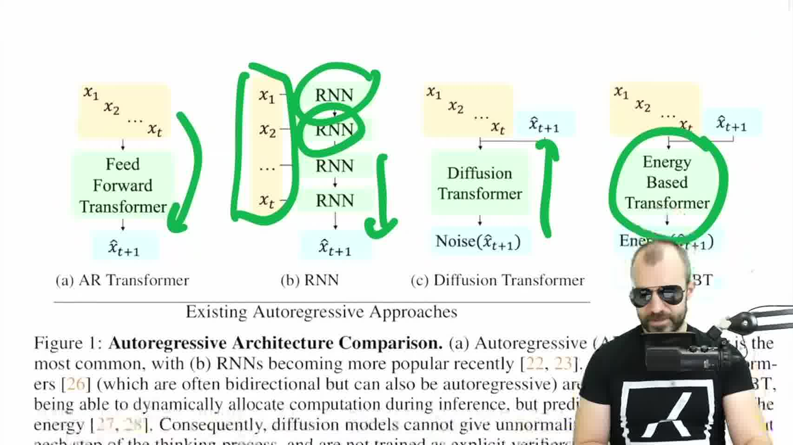

视频先用认知科学里的 `System 1` 和 `System 2` 做类比。`System 1` 是快速、直觉式、一次性反应；`System 2` 是慢速、显式、多步推理。

放到机器学习里，最简单的翻译是：

- `System 1` 更像一次 forward pass：输入上下文，模型直接吐出答案。
- `System 2` 更像 inference-time computation：同一个模型或同一个评价函数被反复使用，答案不是一次性生成，而是在多步计算中被改进。

这张图的读法也要按这个顺序来。左边的 autoregressive Transformer 是“一次计算得到下一步预测”。RNN 虽然按时间递归，但每个时刻仍然是在已有状态上推进。Diffusion Transformer 明确有多步反向过程。EBT 被放在最右侧，是因为它把“多步”放到了候选输出的优化上：同一个上下文下，候选输出会被反复送入能量模型，被能量梯度逐步修正。

这里需要保留一个批判点。视频讲者也提醒，`thinking` 是一个很重的词。EBT 论文把“多次使用模型、投入更多推断计算后表现变好”称为 thinking，这更像一个工程化指标，而不是完整认知意义上的思考。

所以读这一部分时，不必被 `thinking` 这个词带偏。更准确的理解是：

`EBT 关心的是 test-time compute scaling：推断阶段多花计算，性能能否系统性提高。`

## 3. 08:25-13:20：为什么当前 reasoning 路线还不够一般

代表 frame：

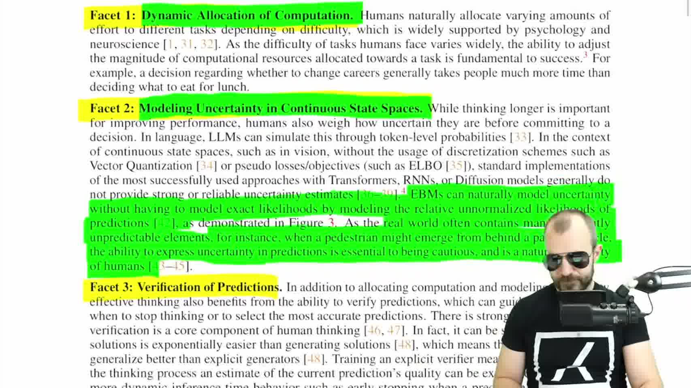

作者把 System 2 thinking 拆成三个性质。

第一是动态分配计算。简单问题不需要想很久，困难问题需要更多计算。对应到模型，就是不同输入或不同 token 可以使用不同数量的优化步，而不是固定一次 forward pass。

第二是不确定性建模。真实世界里很多预测不是单峰的，也不是完全确定的。例如行人是否会突然从车后出现，视频下一帧会怎么演化，语言中某个上下文后面有多个合理续写。这类任务需要模型表达“我有多不确定”，而不只是给出一个最可能答案。

第三是验证候选预测。很多时候，生成一个好答案很难，但判断某个答案是否合理相对容易。EBT 就把这点变成模型结构：模型不必直接生成答案，而是学习判断候选输出和输入是否兼容。

这张图里三条 facet 不是并列口号，而是后面模型结构的三层铺垫。动态计算解释为什么推断阶段要允许多步；不确定性解释为什么输出不能只是一点预测；验证解释为什么要学一个能评价候选输出的 energy function。后面的 EBT 机制就是沿着这三层往下落实。

这三点合起来，形成了 EBT 的建模目标：

`模型要学一个能评价候选输出的能量函数；推断阶段再用这个能量函数来搜索、优化和验证候选输出。`

## 4. 13:20-22:40：Energy function 到底是什么

代表 frames：

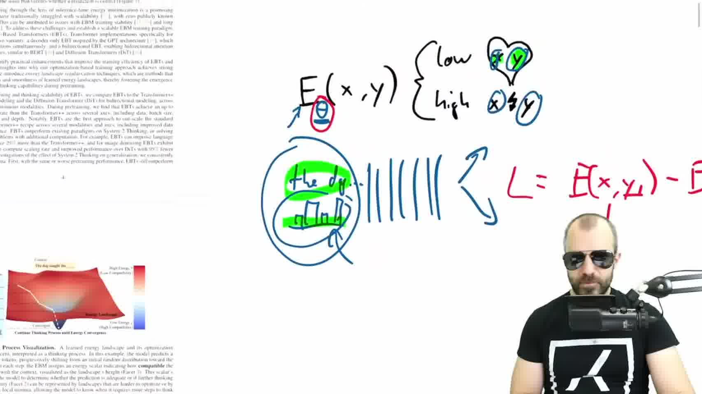

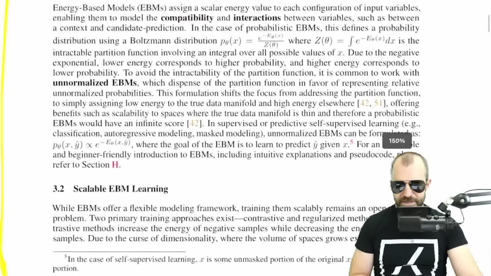

Energy-based model 的核心对象是一个标量函数：

$$
E_\theta(x,\hat y).
$$

其中 $x$ 是输入或上下文，$\hat y$ 是候选输出。这个函数的输出不是 token，不是图像，也不是概率分布的归一化值，而是一个标量能量。

第一张图把这个抽象式子画成了最小机制：输入 $x$ 和候选 $\hat y$ 一起进入模型，模型只吐出一个能量数值。第二张图再说明为什么这个能量通常不被当成完整归一化概率来用。理论上可以写成类似 Boltzmann 形式，但归一化常数或 partition function 在高维空间里很难算，所以实际重点变成比较相对能量：哪个候选更低，哪个候选更高。

读这个式子时，顺序很重要。

第一步，固定上下文 $x$。例如在语言建模里，$x$ 可以是 `The dog caught the` 这段上下文。

第二步，给一个候选输出 $\hat y$。在下一个 token 预测里，$\hat y$ 可以是整个 vocabulary 上的候选分布，而不一定只是一个 one-hot token。

第三步，能量函数判断二者是否兼容。如果 $\hat y$ 指向合理续写，例如 `ball` 或 `frisbee`，能量应该低；如果 $\hat y$ 指向不合理续写，能量应该高。

这时能量函数像一个 verifier。它不直接说“答案就是这个”，而是说“这个候选答案和上下文是否合得上”。

这里还要区分 `energy function` 和 `loss function`。两者形式上都可以是一个标量，但使用位置不同：

- `loss function` 是训练时用来更新参数的目标。
- `energy function` 是训练后在推断阶段被反复调用、被优化的目标。

也就是说，训练 EBT 时仍然需要一个 loss；但训练完成后，推断时真正被优化的是 energy。

## 5. 22:40-28:26：推断不再是 forward pass，而是沿 energy landscape 做优化

代表 frame：

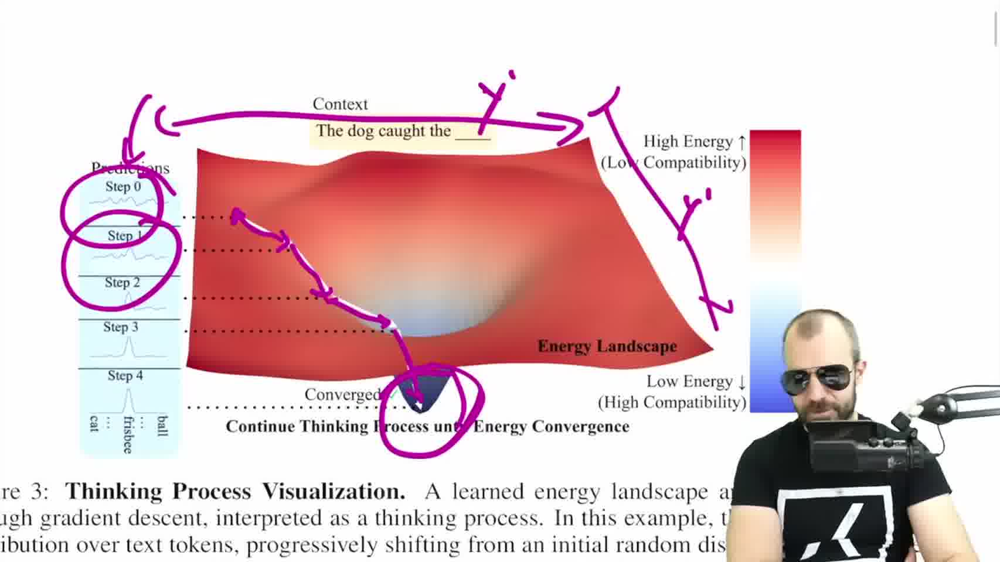

一旦有了训练好的 $E_\theta(x,\hat y)$，推断阶段就可以按以下顺序读。

第一步，固定输入 $x$。模型面对的是同一个上下文、同一张噪声图像、同一段视频历史，或者同一个待预测状态。

第二步，初始化一个候选输出 $\hat y_0$。它可以是随机的，也可以来自某个简单初始化。

这张图的横向逻辑是：左侧先给出候选输出分布的初始状态；中间是 learned energy landscape；右侧颜色条说明高能量对应低兼容性，低能量对应高兼容性。紫色轨迹表示候选输出不是被一次性生成出来，而是沿着能量下降方向逐步滑向低谷。

第三步，计算能量关于候选输出的梯度：

$$
\nabla_{\hat y} E_\theta(x,\hat y_k).
$$

这里的梯度不是用来直接更新模型参数，而是用来更新候选输出本身。上下文 $x$ 固定，模型参数 $\theta$ 固定，变化的是 $\hat y$。

第四步，沿着能量下降方向更新候选输出：

$$
\hat y_{k+1}
= \hat y_k - \alpha_k \nabla_{\hat y} E_\theta(x,\hat y_k).
$$

第五步，重复这个过程。每一次更新都相当于重新询问一次 verifier：当前候选输出是否更兼容？如果还不够好，就继续往低能量区域移动。

这里需要补充一个关键的视角转换：很多读者（尤其是 NLP 背景）会有疑问，**文本 token 是离散的，怎么对它计算梯度并做“更新”呢？** 其实，这种 test-time optimization 是在连续的表征空间（Embedding 空间或连续分布空间）中进行的。梯度并没有直接去更新一个离散的整数，而是拿来更新候选输出的连续表征，最后再投影回离散的词表中。这就让“走下坡路”的数学过程在语言模型里真正立得住脚。

因此，EBT 的 `thinking process` 可以具体理解成：

`在固定输入条件下，对候选输出的连续表征做 test-time optimization。`

这和 diffusion 有相似味道，因为二者都不是一次 forward pass 后结束；但差别在于，EBT 的迭代目标是降低一个 learned energy，而不是沿预设噪声日程反向去噪。

## 6. 28:26-33:32：训练困难在于，energy landscape 必须可优化

代表 frame：

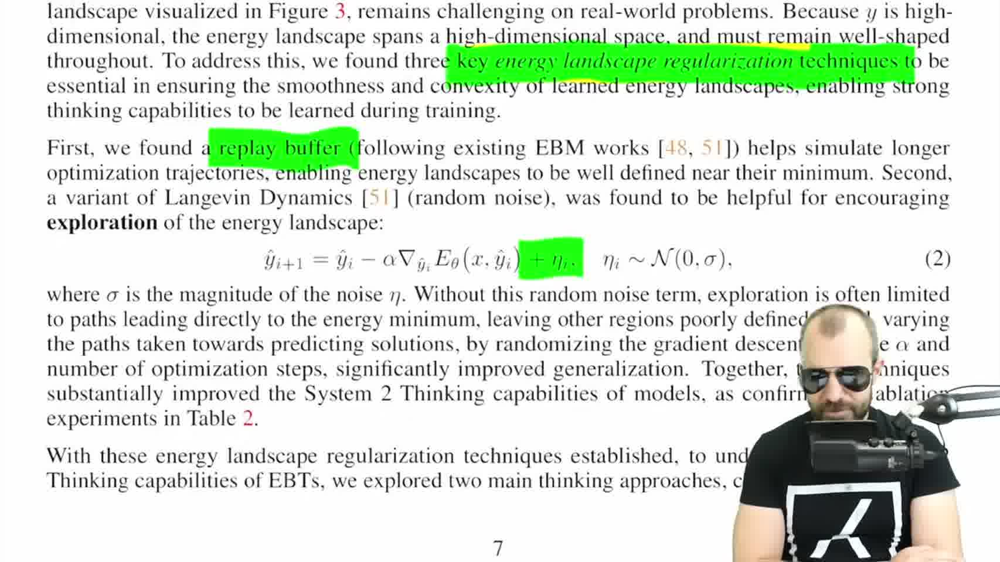

如果只说“正确候选低能量，错误候选高能量”，训练听起来很简单。但真正困难在于，推断阶段要在这个能量景观上走梯度下降，所以 energy landscape 不能只是把训练样本附近打成低谷、其他地方随便变成高墙。

如果 landscape 很碎、很尖、很不光滑，推断时从随机初值出发就可能走不动，或者走到错误局部结构里。于是训练目标不只是区分好坏候选，还要让能量函数形成一个可被优化过程使用的形状。

视频里提到两类训练思路。

这张图所在位置正好是从“能量模型怎么推断”转到“能量景观怎么训练”的拐点。作者强调的不是单个样本的分类正确，而是整个 landscape 要足够平滑、足够可走。否则推断阶段的梯度下降没有稳定方向。

第一类是 contrastive training。给定同一个 $x$，把真实输出 $y^+$ 的能量压低，把错误输出 $y^-$ 的能量抬高。直觉很清楚，但在高维输出空间里，负样本空间太大，靠枚举或简单采样很难覆盖关键错误。

第二类是把推断过程本身放进训练。也就是说，训练时也从 $\hat y_0$ 出发，做若干步能量下降，得到 $\hat y_K$，再把 $\hat y_K$ 和真实目标 $y$ 做任务 loss，例如 cross entropy。抽象地写就是：

$$
\hat y_K(\theta)
= \operatorname{Opt}_K(E_\theta; x, \hat y_0),
\qquad
\mathcal L(\theta)
= \ell(\hat y_K(\theta), y).
$$

这条线的关键是：loss 不是只看一次模型输出，而是看“经过推断优化后的输出”。这就好比**在训练一个“参数优化的过程本身”**（直觉上非常类似元学习 Meta-Learning 里的 MAML）。因为最终的 $\hat y_K$ 是通过对 $E_\theta$ 求了若干次导数得来的，所以计算最终 loss 对模型参数 $\theta$ 的梯度时，就必然会出现“梯度的梯度”（二阶信息）。因此反向传播要穿过整个优化过程。

论文强调这可以通过 Hessian-vector products 有效计算，代价随模型规模线性增长，而不是直接二次爆炸。

所以这里的训练逻辑可以压成一句话：

`EBT 不是只训练一个打分器，而是训练一个能被推断时优化过程稳定使用的打分器。`

## 7. 33:32-36:40：为什么要加 noise、replay buffer 和随机步数

代表 frame：

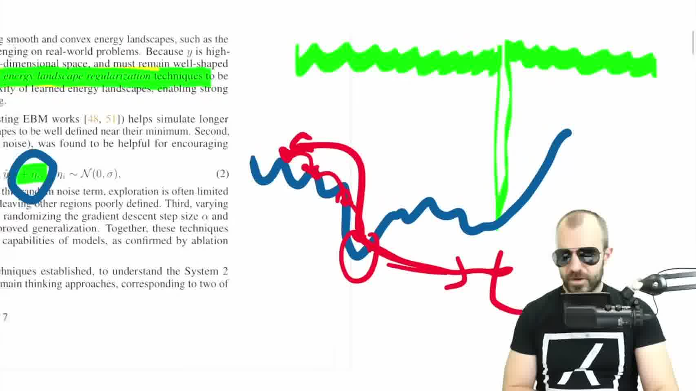

能量景观要能支持优化，就必须避免只在一条很窄的训练轨迹上有效。视频里用“把路径加宽”的方式解释 noise 的作用，这一点很重要。

如果训练时每次都从相同类型的初值出发，沿着固定步长走固定步数，那么模型只会在这些狭窄轨迹附近学到比较可靠的能量形状。推断时一旦遇到稍微偏离训练轨迹的候选输出，能量函数可能就不再提供可靠梯度。

加入噪声后，更新式变成类似：

$$
\hat y_{k+1}
= \hat y_k
- \alpha_k \nabla_{\hat y} E_\theta(x,\hat y_k)
+ \eta_k,
\qquad
\eta_k \sim \mathcal N(0,\sigma^2 I).
$$

这不是为了让输出更随机，而是为了让训练过程探索能量景观附近更宽的区域。这样模型被迫把低谷周围的形状也学得更平滑，而不是只学一条细线。

replay buffer 的作用类似。它保存过去优化过程中出现过的候选状态，让训练不只依赖当前 batch 的局部轨迹，而能反复访问更丰富的中间状态。

随机化 step size 和 optimization steps 则服务于另一个目标：让模型适应不同推断预算。训练时如果总是固定 5 步，模型可能只会适配 5 步推断。训练时如果有时走少一点、有时走多一点，推断时就更有机会通过增加步数获得额外收益。

这一步直接对应 EBT 的核心卖点：

`如果模型在训练中见过不同长度、不同扰动的优化轨迹，它在推断阶段才可能真正支持 thinking scalability。`

## 8. 36:40-38:16：为什么要把 EBM 和 Transformer 合起来

代表 frame：

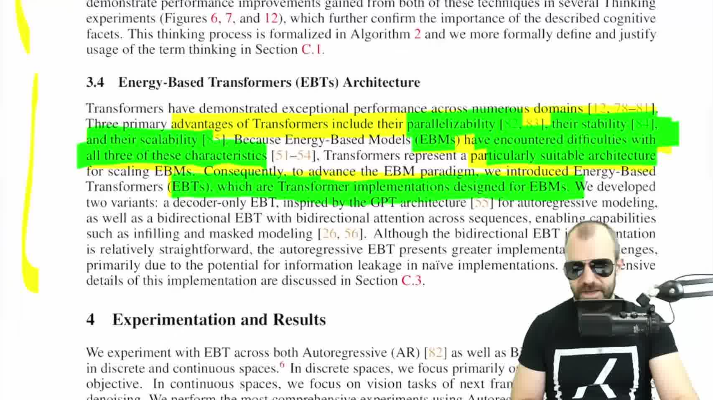

传统 EBM 有吸引力，因为它天然是 verifier、天然适合表达兼容性和不确定性。但它也有老问题：不好并行、不稳定、不容易扩展。

Transformer 的优势恰好在另一边：并行化成熟，工程生态成熟，扩展规律已经被大量验证。因此 EBT 的架构动机不是“Transformer 本身不够好”，而是：

`用 Transformer 的工程可扩展性，承载 EBM 的能量函数角色。`

这里有两个实现方向。

一个是 decoder-only EBT，面向自回归语言建模，结构上接近 GPT 这类因果 Transformer。它要处理一个额外难点：因为推断阶段会多次更新候选输出，所以必须非常小心信息流，避免未来 token 或目标信息通过注意力结构泄漏。为了做到这一点，模型内部往往要设计精心构造的 Attention Mask，确保“条件上下文 $x$”只能前向 attention（不偷看后面的内容），而“候选目标 $\hat{y}$”只评估自身与上下文的条件兼容性，从而切断 Target Leakage。

另一个是 bidirectional EBT，面向 masked modeling、inpainting 或更一般的双向上下文任务。它不必完全遵守自回归方向，但仍然要通过相应的 Masking 策略来保证 energy function 真正评价的是候选输出和上下文的兼容性，而不是偷看答案。

所以 EBT architecture 的核心不是“多加几层 Transformer”，而是：

`把 Transformer 改造成一个可反复查询、可对候选输出求梯度的能量函数。`

## 9. 38:16-42:09：Learning scalability 看的是训练扩展趋势

代表 frame：

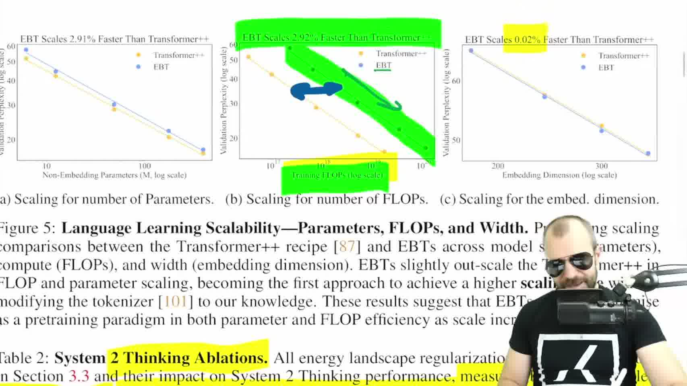

实验部分先看 `learning scalability`。这里的问题是：当模型参数、训练数据、batch size、深度或 FLOPs 增加时，EBT 的预训练表现是否比标准 Transformer++ 更快改善。

视频里的判断比较谨慎。EBT 在小规模时不一定一开始就占优，因为它的单步训练更重。普通 Transformer 一个训练 step 大致就是一次前向和一次反向；EBT 的一个训练 step 里还包含推断优化过程，并且还要反向传播穿过这个优化过程。所以 EBT 的固定成本明显更高。

但论文图里想强调的是斜率，而不是当前绝对成本。也就是说，如果横轴按参数量、训练 FLOPs 或宽度扩展，EBT 的困惑度下降趋势看起来比 Transformer++ 更快。若这种趋势能延续到更大规模，那么高固定成本可能被更好的扩展效率抵消。

这张图读的时候不要只看“蓝点是否低于黄点”，而要看随横轴扩展时两条趋势线的斜率。EBT 的单步成本更高，所以短期不一定便宜；但如果性能随 FLOPs 改善得更快，长期可能出现交叉点。这就是论文所谓 learning scalability 的核心含义。

这部分需要保留两个判断。

第一，EBT 的结果有潜力，因为它展示的是 scaling trend，而不只是单点性能。

第二，这还不是大规模定论。视频讲者明确提醒，当前实验仍然在相对有限的规模上，趋势外推不等于已经证明 foundation-model scale 上必然成立。

## 10. 42:09-45:30：Thinking scalability 看的是推断阶段多算是否有收益

代表 frame：

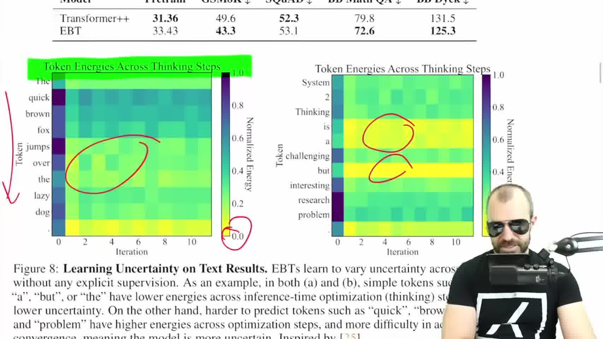

第二组实验更直接对应 `thinking` 这个词。问题是：推断阶段增加 forward passes 或 optimization steps，模型性能会不会继续变好。

标准 Transformer 在同一个输入上重复 forward pass，输出不会自动改善。除非额外加入采样、搜索、prompting 或外部循环，否则它本身没有“多算几步就更好”的机制。

EBT 不一样。它的输出本来就是通过多步优化得到的。第 0 步是随机或粗糙候选，第 1 步开始沿能量下降方向移动，后续每一步都继续降低候选输出的能量。因此，增加推断步数在机制上就可能带来更好结果。

论文还可视化了 token energy across thinking steps。简单 token 或语法上很确定的 token 往往能量更低；难预测 token 能量更高。这一点可以理解成模型内部的自评估信号：energy 不只是给最终输出排序，也在提示当前候选位置的难度和不确定性。

这张热力图可以按两个轴读。横轴是 thinking / optimization iteration，表示同一个 token 在推断过程中被逐步修正；纵轴是句子里的 token 位置。颜色越接近低能区域，说明模型认为当前位置更容易或更确定。这样 energy 就不只是最终分数，也变成了逐 token 的难度信号。

这里最值得挖的是动态计算分配。未来不一定要每个 token 都固定走同样多步。若 energy 能提示某个 token 已经足够确定，就可以少算；若 energy 仍高或 landscape 不稳定，就可以多算。这和 speculative decoding 的节省计算思路有相通处，但 EBT 的信号来自 learned energy 本身。

## 11. 45:30-47:41：结论和限制

代表 frame：

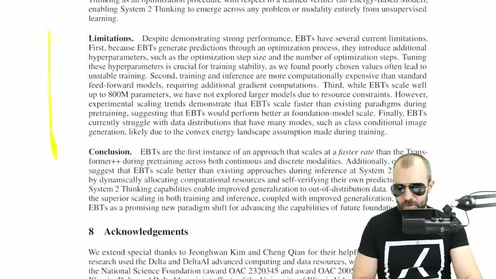

视频结尾给出的评价是：方向很有趣，但论文的哲学包装要和技术贡献分开读。

技术贡献比较清楚：EBT 把 EBM 的标量能量函数和 Transformer 的可扩展架构结合起来；推断阶段通过优化候选输出实现 test-time compute；实验展示了 learning scalability 和 thinking scalability 的早期趋势。

限制也很明确。

第一，训练和推断都更贵。因为推断要多步优化，训练还要反向传播穿过优化过程。

第二，超参数更敏感。step size、优化步数、噪声强度、regularization 都会影响稳定性。

第三，规模还没有真正证明到最大模型区间。当前趋势令人感兴趣，但不能直接等同于大规模胜利。

第四，多峰分布仍然可能困难。若训练中隐含了较平滑或近似凸的 energy landscape 假设，那么在 class-conditional image generation 或更复杂多模态目标上，模型可能会遇到困难。

所以这篇工作的合理结论不是“EBT 已经替代 Transformer”，而是：

`EBT 提供了一种把 test-time optimization、uncertainty 和 verification 合到同一个 Transformer 化能量函数中的路线。它是否成为大模型主线，取决于高固定成本能否被更好的 scaling 和更强的推断时可控性抵消。`

---

跳出这篇论文本身的 NLP 和 Robotics 设定，如果我们把它的核心抽象抽离出来——**即“放弃直接的单次前向生成，转而学习标量能量打分，并结合推断时的采样/优化”**——会发现它正好击中了我们在探讨系统科学与空间反问题时的核心难点。这也为我们在做内部研究体系梳理时提供了一个绝佳的接口。

## 12. 和我们已有阅读框架的接口

这篇 EBT 和我们之前读过的 HJB、HJ-sampler、VI primer 有一个共同点：它们都把高维对象压到一个标量函数上，再用这个标量函数组织推断。

在 HJB 那篇里，直接学习高维控制场太重，所以转向学习标量势函数或 value function。控制场由势函数梯度给出。那里标量函数编码的是路径级累计代价和最优控制结构。

在 HJ-sampler 里，log transform 把线性概率传播和非线性 HJ 结构接起来。标量函数 $S$ 进入受控 SDE，帮助从观测点反向采样后验路径。那里标量函数仍然和随机过程、生成元、贝叶斯后验路径有明确关系。

在 EBT 里，标量函数是 energy：

$$
E_\theta(x,\hat y).
$$

它不是 PDE value function，也不是路径空间自由能，而是输入和候选输出之间的兼容性打分。它的梯度不是给出物理控制场，而是给出候选输出在推断阶段应该怎样移动。

因此三者的共同结构是：

`高维生成或推断对象很难直接学，于是改学一个标量函数，再通过梯度、优化或采样过程使用它。`

差别在于标量函数的语义不同：

- HJB 的标量势函数回答：从当前状态到终点还剩多少最小累计代价。
- HJ-sampler 的标量函数回答：在给定终端观测下，后验路径如何被重加权和采样。
- EBT 的 energy 回答：给定输入后，这个候选输出是否兼容、是否值得继续保留。

## 13. 对 synthetic city / amortized inverse problem 的启发

如果把这条线放回我们自己的研究问题，可以得到一个有用的方向：不要只把模型写成从条件 $\mathbf c$ 到联合分布 $\mathbf p$ 的直接映射，也可以考虑学习一个 compatibility energy：

$$
E_\theta(\mathbf c,\hat{\mathbf p}).
$$

这里 $\mathbf c$ 可以是 census summaries、marginals、PUMA 级约束或其他观测条件；$\hat{\mathbf p}$ 是一个候选 joint distribution 或 synthetic population。低能量表示候选 joint distribution 更符合条件、约束和经验结构；高能量表示不符合。

这样问题就从：

`给我一个最可能的 joint distribution`

变成：

`给我一个能评价候选 joint distribution 的能量景观，并允许我在这个景观上搜索一整族 plausible solutions。`

这和 ill-posed inverse problem 更匹配。因为同一组 marginals 或 summaries 通常不唯一决定 joint distribution。直接输出一个点估计会掩盖不确定性；而 energy landscape 可以把多个 plausible basin 保留下来。

不过这里也有一条边界要守住。EBT 本身没有自动给出校准后验，也没有自动解决多峰采样。若要把它用于我们的城市联合分布问题，还需要回答：

- 正样本和负样本如何构造。
- 约束违反如何进入 energy。
- 多个 plausible copula / joint distribution basin 如何被保留，而不是被单一低谷吞掉。
- energy 分数能否被校准成可解释的不确定性。
- 推断阶段是做梯度优化、MCMC、Langevin sampling，还是和条件 diffusion / flow 结合。

所以 EBT 对我们最直接的启发不是“马上换成 EBT 架构”，而是提供一种研究问题表述：

`把条件生成从 direct generator 扩展成 learned verifier + test-time search / sampling。`

这条线和 VI primer 中的 posterior approximation、HJB 中的 scalar potential、HJ-sampler 中的 posterior path sampling 可以接起来，形成一个更统一的问题意识：

`在缺乏显式物理方程的城市反问题里，我们仍然可以学习一个标量兼容性结构，用它组织约束、候选解、不确定性和推断时计算。`
