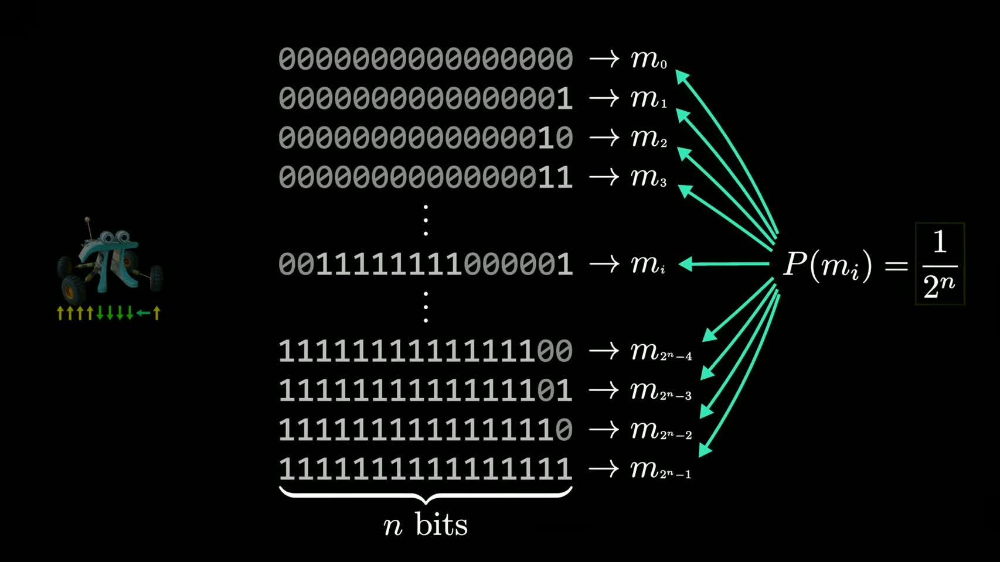
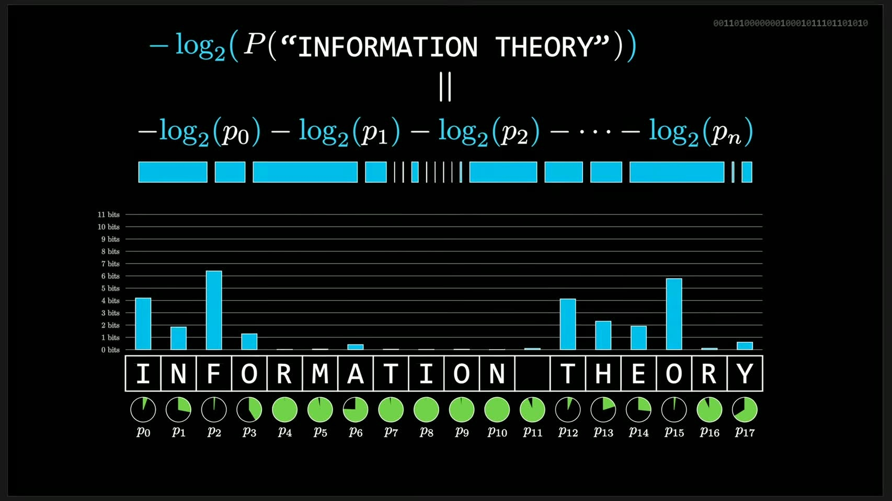
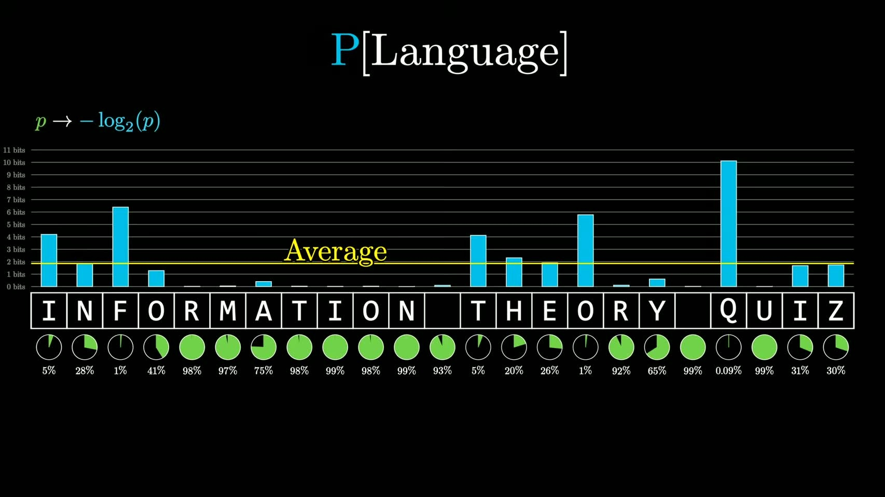
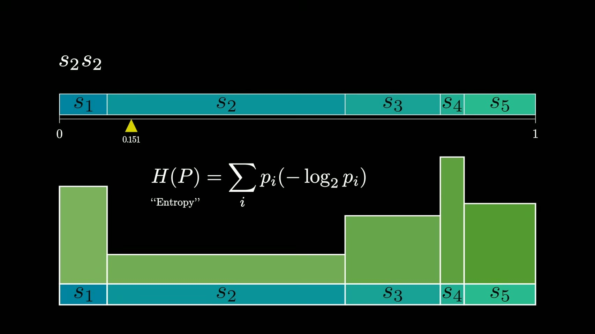
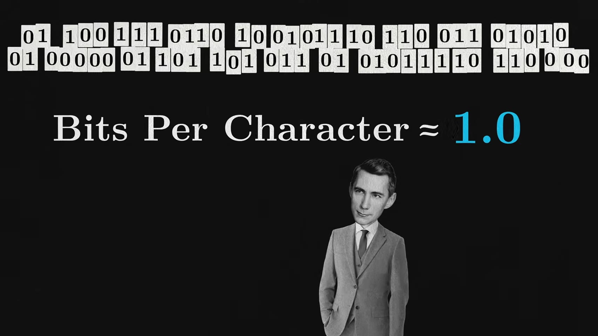
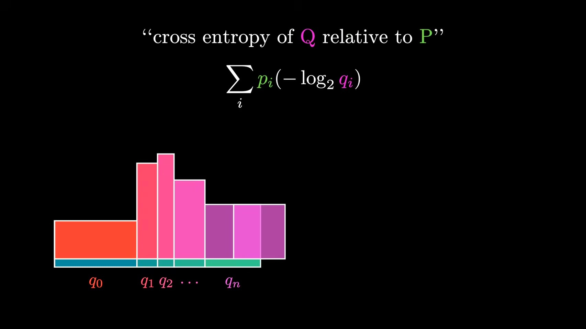
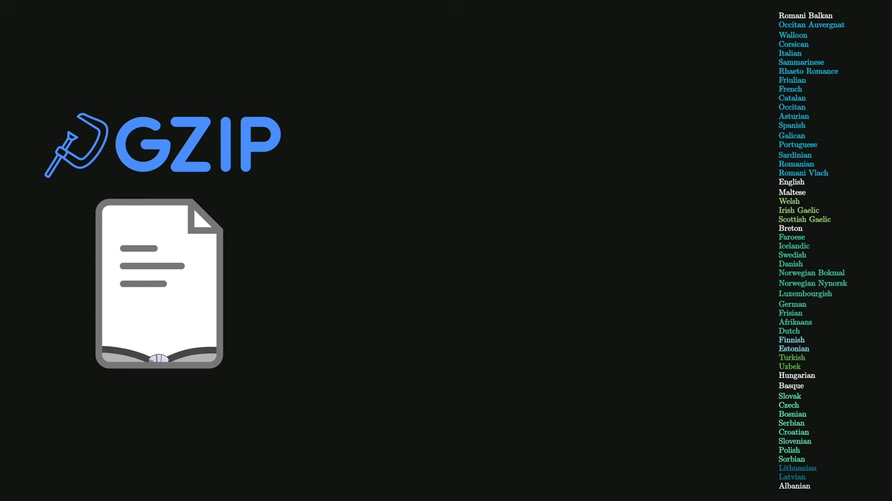

# 3Blue1Brown Reinventing Entropy 后半段精读

- Video: [Reinventing Entropy | Compression is Intelligence Part 1](https://www.youtube.com/watch?v=l6DKRf-fAAM)
- Transcript: [transcript.md](../../transcripts/l6DKRf-fAAM-3blue1brown-reinventing-entropy-compression-intelligence-part1/transcript.md)
- Curated slides: [curated/index.md](../../slides/l6DKRf-fAAM-reinventing-entropy-compression-is-intelligence-part-1/curated/index.md)
- Focus: `13:00-31:20`

这期视频后半段真正难的地方，不是公式本身，而是它连续完成了四次抽象跳跃：

1. 从“一个码字有多少 bit”跳到“一个事件的信息量是 $-\log_2 p$”。
2. 从“单个事件的信息量”跳到“整句话的信息量可以相加”。
3. 从“固定分布的平均信息量”跳到“语言这种上下文过程的熵率”。
4. 从“真实分布的编码成本”跳到“模型分布的编码成本”，也就是 cross entropy。

如果只记住一个主线，应该是：

**信息论不是先定义熵再解释压缩，而是先问压缩极限，然后被迫发现 $-\log_2 p$、entropy、entropy rate 和 cross entropy。**

## 1. 13:00-15:35：为什么完美压缩后的码流像随机噪声

视频先说一个反直觉命题：

**完美压缩后的 bitstream 应该看起来像随机噪声。**

这句话容易误解。它不是说原始文本是随机的，也不是说压缩器制造了无意义噪声，而是说：

**如果压缩后的码流里还能看出规律，那就说明还有冗余，还能继续压缩。**

假设压缩后的消息长度是 $n$ bit。所有长度为 $n$ 的 bitstring 一共有：

$$
2^n
$$

如果这是一个完美压缩结果，那么这些 $2^n$ 个 bitstring 应该没有哪一个比另一个更值得更短编码。也就是说，在压缩后的空间里，它们应该近似等概率。

于是每一个压缩消息的概率是：

$$
p = \frac{1}{2^n}=2^{-n}
$$

反过来，如果某个原始消息在最优编码中需要 $n$ bit，它对应的概率就应该满足：

$$
p = 2^{-n}
$$

两边取 $\log_2$ 并取负号：

$$
n = -\log_2 p
$$

这就是视频最关键的一步：**$-\log_2 p$ 不是凭空定义出来的“信息量公式”，而是从最优压缩长度倒推出来的。**

## 2. 15:35-17:59：如何直觉理解 $-\log_2 p$

视频说，$-\log_2 p$ 可以理解为：

**为了把可能性空间缩小到这个事件，需要连续二分多少次。**

几个例子：

$$
p=\frac{1}{2}\quad \Rightarrow \quad -\log_2 p=1
$$

意思是：这个事件占一半可能性空间，只需要 1 个 yes/no 问题就能定位。

$$
p=\frac{1}{8}\quad \Rightarrow \quad -\log_2 p=3
$$

意思是：这个事件只占八分之一空间，需要 3 次二分才能定位。

$$
p=1\quad \Rightarrow \quad -\log_2 p=0
$$

意思是：这个事件必然发生，不需要任何 bit 来告诉你。

所以信息量不是“内容多不多”，而是：

**在已有概率模型下，这个事件出现时排除了多少可能性。**

这也是为什么罕见事件信息量高，常见事件信息量低。不是因为罕见事件更“有意义”，而是因为它在编码上更贵。

## 3. 17:59-20:48：fractional bits 到底是什么意思

你后半段可能卡住的第一个点就是 fractional bits。

如果某个字母的概率不是 $1/2$、$1/4$、$1/8$ 这种干净的 2 的幂，比如：

$$
p=0.055
$$

那么：

$$
-\log_2 0.055 \approx 4.18
$$

这看起来很奇怪：一个字母怎么可能用 $4.18$ bit 编码？bit 不是只能是整数吗？

视频的回答是：**单个符号的实际码字长度当然不能是 $4.18$ bit；fractional bits 的意义在整条消息层面。**

对一整句话 $x_1,x_2,\dots,x_n$，概率可以按链式法则写成：

$$
P(x_1,x_2,\dots,x_n)
=P(x_1)P(x_2\mid x_1)P(x_3\mid x_1,x_2)\cdots P(x_n\mid x_{<n})
$$

对整句话取负对数：

$$
-\log_2 P(x_1,\dots,x_n)
=\sum_{t=1}^{n}-\log_2 P(x_t\mid x_{<t})
$$

这就是后半段最重要的公式。

它的意思是：

**一句话的总编码成本，可以拆成每一步真实下一个符号在上下文中的惊讶程度之和。**

每一步可以是 $0.12$ bit、$4.18$ bit、$7.3$ bit 这种小数；但整条消息加起来以后，可以用更高级的编码算法接近这个总长度。视频提到第三部会讲具体算法，本质上就是这一类思想：不要强迫每个字符单独对应整数码长，而是在整段消息上接近理论极限。

## 4. 20:48-24:40：语言概率不是静态频率，而是上下文模型

这里是第二个容易混淆的点。

机器人例子里，每个符号都来自同一个固定分布：

$$
p(\text{up})=\frac12,\quad p(\text{down})=\frac14,\quad p(\text{left})=\frac18,\quad p(\text{right})=\frac18
$$

但语言不是这样。语言里每个 token 或字母的概率都依赖前文：

$$
P(x_t\mid x_{<t})
$$

例如，在 `informatio` 后面，`n` 的概率很高；在完全没有上下文时，`n` 只是普通字母。上下文越长，可预测性越强，平均编码成本越低。

这就带来一个深问题：

**我们到底从哪里得到 $P(x_t\mid x_{<t})$？**

视频强调，真实语言分布不是一个摆在桌面上的表。Shannon 早期用 n-gram 统计，但长上下文会遇到稀疏性：一个很长的字符串可能在语料库里从未出现，但人类依然知道后面什么更自然。

所以 Shannon 做了一件很现代的事：他把人脑当作语言模型。他让人根据前文猜下一个字母，再从猜测过程反推隐含概率。

这一步的深意是：

**语言熵不是简单数语料频率，而是在探测一个能利用上下文的预测模型。**

今天的大语言模型只是把这个黑箱从“人脑”换成了“神经网络”。

## 5. 24:40-29:16：entropy 是平均最小编码成本

到这里，视频才正式引出 entropy。

如果一个信源每次都从同一个分布 $P$ 里抽符号，那么单个符号的信息量是：

$$
I(x_i)=-\log_2 p_i
$$

平均信息量就是：

$$
H(P)=\sum_i p_i(-\log_2 p_i)
$$

也常写成：

$$
H(P)=-\sum_i p_i\log_2 p_i
$$

视频用矩形面积解释这个公式：

- 每个事件的宽度是 $p_i$。
- 每个事件的高度是 $-\log_2 p_i$。
- 面积就是 $p_i(-\log_2 p_i)$。
- 所有面积加起来，就是平均每个符号要付出的 bit 成本。

所以 entropy 的精确定义不是“混乱程度”，而是：

**如果你知道真实分布，并使用最优无损编码，平均每个符号仍然至少需要多少 bit。**

这比“不确定性”更可操作，因为它直接对应编码成本。

## 6. 27:03-29:50：为什么这个公式还不够描述语言

视频也特别提醒：上面的 $H(P)$ 还不是完整的语言熵。

原因是这个公式假设每个新符号都来自同一个固定分布。这叫 iid 或近似 iid 的情形。但语言、城市流、群体行为、物理过程都不是这样。

对语言这样的序列过程，更合适的是熵率：

$$
h=\lim_{n\to\infty}\frac{1}{n}H(X_1,X_2,\dots,X_n)
$$

也可以直觉理解成：

$$
h=\lim_{n\to\infty}H(X_n\mid X_1,\dots,X_{n-1})
$$

它问的是：

**在已经知道足够多历史上下文后，平均每产生一个新符号还剩多少不可预测信息。**

这就是为什么 Shannon 估计英文在足够上下文下大约是 1 bit per character。这个数字不是说每个字符真的只用一个固定二进制位表示，而是说：

**在利用长上下文预测之后，英文每个字符平均只剩大约一个 yes/no 问题那么多的不确定性。**

## 7. 30:37：1 bit per character 应该怎么理解

视频里说，在有至少 100 个前文字符时，Shannon 估计英文熵大约是：

$$
1\ \text{bit/character}
$$

这很容易被误解成“每个英文字母只需要 0 或 1 表示”。不是。

正确理解是：

**对很长的一段英文，如果编码器和解码器共享一个足够好的语言模型，那么整段文本平均下来接近每个字符 1 bit。**

这个平均值来自大量上下文预测：

- 很多位置几乎不用付费，比如固定短语、语法结构、常见后缀。
- 少数位置很贵，比如专有名词、意外转折、低概率词。
- 总成本平均下来接近 1 bit/character。

也就是说，1 bit/character 是一个整体压缩率，不是逐字符固定码长。

## 8. 30:51：cross entropy 为什么自然出现

视频第一部在这里其实只是埋伏笔，但这对理解 LLM 很关键。

Entropy 假设你用真实分布 $P$ 来编码真实数据：

$$
H(P)=-\sum_i p_i\log_2 p_i
$$

但现实中，我们通常不知道真实分布 $P$。我们只有一个模型分布 $Q$。如果真实数据来自 $P$，而你用模型 $Q$ 去编码，平均成本就是 cross entropy：

$$
H(P,Q)=-\sum_i p_i\log_2 q_i
$$

对语言模型来说，每一步模型给真实下一个 token 一个概率：

$$
q_\theta(x_t\mid x_{<t})
$$

训练时的 token loss 就是：

$$
-\log q_\theta(x_t\mid x_{<t})
$$

这不是随便选的 loss。它的含义是：

**如果我用当前模型当压缩器，真实文本这个 token 要花多少编码成本？**

模型越懂语言结构，给真实 token 的概率越高，loss 越低，压缩成本越低。

所以 next-token prediction、cross-entropy loss、text compression 其实是同一件事的三种语言：

- 预测语言：模型有没有猜中下一个 token？
- 概率语言：模型给真实 token 分配了多少概率？
- 压缩语言：用这个模型编码真实 token 要花多少 bit？

## 9. 31:06 以后：compression is intelligence 的准确边界

“Compression is intelligence” 这句话有启发，但不能理解得太绝对。

更准确的说法是：

**压缩能力度量了模型发现可复用结构的能力。**

如果模型能压缩文本，说明它发现了文本中的规律：

- 字母频率
- 词法结构
- 语法结构
- 语义关联
- 上下文依赖
- 世界知识和叙事惯性

但智能不只包括压缩。规划、行动、因果干预、目标形成、具身交互，都不是单纯文本压缩能完全覆盖的。

所以对你的研究，更好的表述是：

**压缩是智能的一个可测投影；残差编码成本揭示模型还没有理解的结构。**

## 10. 一张概念表

| 概念 | 公式 | 直觉 | 视频里的位置 |
|---|---|---|---|
| 信息量 | $I(x)=-\log_2 p(x)$ | 这个事件需要多少 bit 才能说明 | 15:13-16:52 |
| 句子信息量 | $-\log_2 P(x_{1:n})$ | 整段消息的编码成本 | 19:51-20:48 |
| 链式分解 | $\sum_t-\log_2 P(x_t\mid x_{<t})$ | 每一步惊讶程度相加 | 19:51-20:48 |
| 熵 | $H(P)=-\sum_i p_i\log_2 p_i$ | 固定分布下平均最小 bit 成本 | 25:17-29:16 |
| 熵率 | $h=\lim_{n\to\infty}\frac{1}{n}H(X_{1:n})$ | 长上下文序列每步剩余不确定性 | 29:19-30:50 |
| 交叉熵 | $H(P,Q)=-\sum_i p_i\log_2 q_i$ | 用错误模型编码真实数据的平均成本 | 30:51 起 |

## 11. 用一句话串起来

这期视频后半段可以压缩成一句话：

**一个事件的最优编码长度由 $-\log_2 p$ 给出；一整段语言的编码成本是每个上下文条件概率的负对数之和；对真实分布取平均得到 entropy；对序列过程取长期平均得到 entropy rate；用模型分布替代真实分布得到 cross entropy，而这正是语言模型训练的压缩意义。**

## 12. 对你的复杂系统研究的转化

这个视频对复杂系统动力学和物理人工智能的启发不只是“熵可以衡量不确定性”，而是：

**任何系统，只要你能给下一个状态分配条件概率，就能把理解程度转化成编码成本。**

对城市复杂系统，可以写成：

$$
-\log_2 q_\theta(x_t\mid x_{<t},c_t)
$$

其中 $x_t$ 是下一步状态，$x_{<t}$ 是历史，$c_t$ 是上下文，比如空间位置、天气、道路网络、社会事件、群体交互状态。这个量越高，说明模型越压不动当前观测。

因此可以把 shock、相变、异常、突发事件理解为：

**旧模型对新观测的编码失败。**

稳定结构则对应：

**模型能够持续压缩未来状态。**

这比单纯看方差、均值变化更深，因为它关心的是系统的可预测结构是否被模型捕捉。

