# Max Welling ICLR 2026 Keynote：From Physics to AI to Materials

- Source: [Bilibili BV1qi9rB7EQc](https://www.bilibili.com/video/BV1qi9rB7EQc/)
- Transcript: [transcript.md](../transcripts/BV1qi9rB7EQc-max-welling-iclr2026-from-physics-to-ai-to-materials/transcript.md)
- Slides: [slide index](../slides/BV1qi9rB7EQc-max-welling-iclr-2026-from-physics-to-ai-to-materials/index.md)
- Curated frames: [curated/index.md](../slides/BV1qi9rB7EQc-max-welling-iclr-2026-from-physics-to-ai-to-materials/curated/index.md)

这场 keynote 的主线不是单纯介绍 CuspAI，也不是泛泛谈 AI for Science。它更像 Max Welling 对自己研究轨迹的一次整理：从物理直觉出发，把对称性、波、非平衡热力学、自由能、扩散模型和材料发现串成一条线。

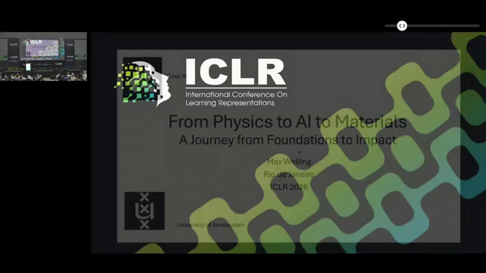

## 核心判断

这场报告真正想建立的是一个三段式逻辑。

第一段是 `physics -> AI`。物理不是只提供类比，而是提供可写进模型结构的先验，例如 symmetry、equivariance、oscillation、wave、spontaneous symmetry breaking。这些结构可以改变神经网络如何表示、传播和保持信息。

第二段仍然是 `physics -> AI`，但换成非平衡热力学视角。Welling 认为 stochastic thermodynamics 和 machine learning 共享一套概率数学。尤其是 entropy、free energy、information loss、time reversal、Jarzynski equality 这些概念，可以重新解释 diffusion models、variational learning 和 controlled generative processes。

第三段是 `AI -> materials`。一旦 AI 学会把昂贵模拟中的信息存进 surrogate、force field 或 generative model，材料发现就从“每个候选都重新模拟一次”变成“模拟、存储、学习、再用学习到的信息加速下一轮搜索”。这就是报告后半段的 CuspAI 逻辑。

所以这场报告的压缩版是：

`物理规律提供模型先验；热力学提供推断语言；AI 把昂贵模拟 amortize 成可复用的搜索与生成系统。`

## 1. 00:00-04:12：开场不是技术，而是研究文化批判

Welling 先回到 2013 年第一届 ICLR。那时 ICLR 还是一个小会，领域里的人彼此基本认识；到 2026 年，深度学习已经变成高度竞争、高度耦合的大型研究生态。

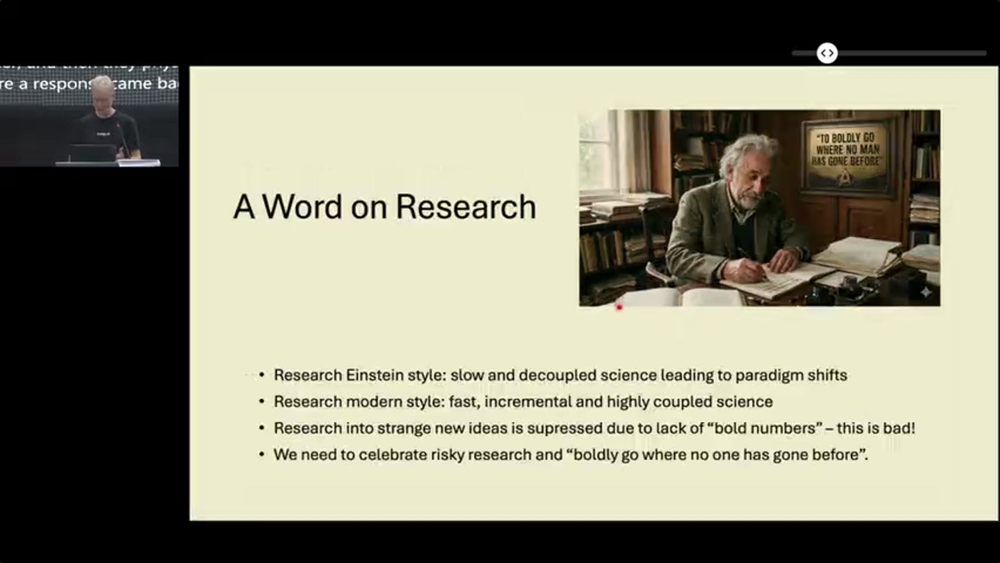

这里的关键不是怀旧，而是为后面“physics-inspired AI”做铺垫。他对当下研究生态的判断是：现代研究速度很快，但也更容易增量化。大家追逐 LLM、benchmark、bold numbers，导致奇怪的新想法在早期很难获得空间。

他把研究路线分成两种。

第一种是 `scale your way out`。这就是 bitter lesson 的主流解读：继续扩大模型、数据和算力，性能会可预测地提升。产业喜欢这种路线，因为投入和产出之间有相对稳定的 scaling law。

第二种是 `innovate your way out`。它不是单纯反对 scaling，而是说：如果只靠 scaling，人类可能会走向数据中心进太空这种极端路径；但大脑只用几十瓦就能完成高度智能活动，这说明还有很多结构性创新没有被我们吃透。

这段开场把后面的问题设定清楚了：物理启发不是装饰，而是寻找 `innovate your way out` 的路径。

## 2. 04:12-06:25：第一条 physics -> AI 线索是对称性

Welling 从 group equivariant convolutional neural networks 讲起。这是他长期研究脉络里非常核心的一条线：如果任务本身有对称性，模型就不应该靠数据硬学这种对称性，而应该把它写进结构。

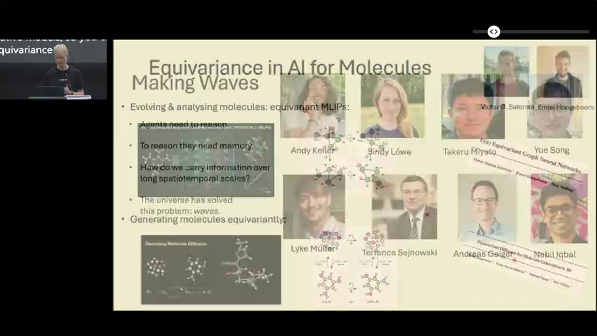

等变性的基本形式可以写成：

$$
\Phi(T_g x)=T'_g\Phi(x).
$$

这里 $T_g$ 是输入空间里的变换，$T'_g$ 是输出或特征空间里的对应变换。这个式子的意思是：先变换输入再过模型，应该等价于先过模型再变换输出。

线性地说：

第一步，现实对象有对称性。例如一只壁虎平移以后仍然是同一只壁虎，一个分子旋转以后物理性质不应该随坐标系任意改变。

第二步，如果模型不尊重这个结构，它就必须从大量数据里重新学习“平移/旋转不改变本质”这件事。

第三步，如果把等变性写入模型，参数空间就被物理先验约束，样本效率和泛化能力都会改善。

第四步，这条线自然进入 AI for molecules/materials，因为分子、晶体、力场和相互作用势都强烈依赖几何对称性。

这也是为什么 equivariant GNN、SE(3)-equivariant networks、E(n)-equivariant models 会成为 AI4Science 的基础模块。它们不是普通深度学习技巧，而是把“物理对象不依赖坐标系任意选择”写进模型。

## 3. 06:25-12:48：第二条 physics -> AI 线索是波和记忆

接着 Welling 转向一个更大胆的想法：神经网络是否应该像物理系统一样使用 waves / oscillations 来持有和传播信息。

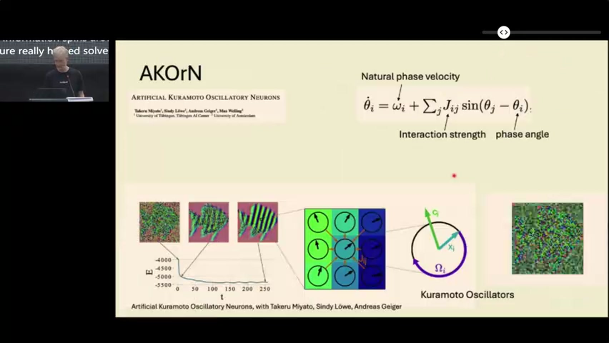

他先讲 RNN 中的 wave-like latent dynamics。直觉是：如果信息需要跨很长时间保持，那么它不一定要被静态存在某个 hidden state 里，也可以像波一样在通道之间循环传播。

随后他讲 AKOrN，也就是 Artificial Kuramoto Oscillatory Neurons。Kuramoto oscillator 的典型形式是：

$$
\dot{\theta}_i
=\omega_i+\sum_j J_{ij}\sin(\theta_j-\theta_i).
$$

这里每个“神经元”不只是一个实数激活，而有一个相位 $\theta_i$。相邻单元通过相位差耦合，系统会出现同步、传播和振荡。

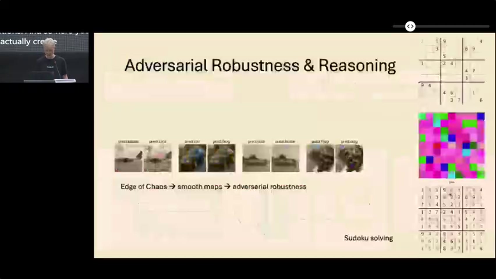

这部分有两个重要含义。

第一，波可以作为记忆机制。信息不是固定存储，而是在系统内部以稳定动力学模式循环。

第二，波可以让表示空间更平滑。他提到 adversarial attack 时，最小扰动会把图像变成目标类别的可见形态，而不是传统神经网络中那种肉眼不可见但分类突变的扰动。这说明模型输入到预测之间的路径更连续。

这和我们前面看复数、Fourier、相位语言也能接上：一旦模型内部变量带有 phase，计算就不再只是标量激活传播，而是带相位的动力学传播。

## 4. 12:48-21:26：自发对称性破缺把“波”接回物理

Welling 进一步把 wave computation 接到 spontaneous symmetry breaking。

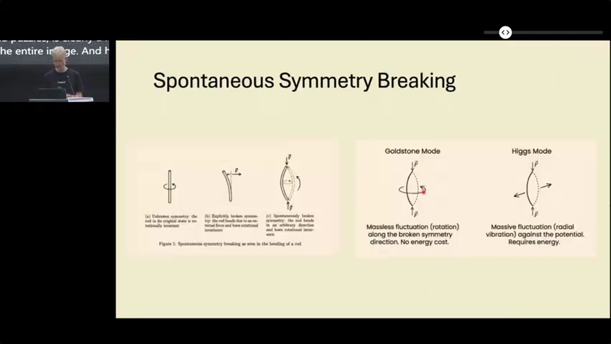

这部分可以按四步读。

第一步，很多物理系统在高层上有连续对称性。例如液体近似平移不变。

第二步，当温度降低，系统会进入晶体相。晶体不再具有完整连续平移对称性，而只保留离散平移对称性。这就是对称性破缺。

第三步，对称性破缺后会出现不同模式。沿着破缺方向的低能量 fluctuation 是 Goldstone mode；径向方向上的高能量 fluctuation 可以类比 Higgs mode。

第四步，在晶体中，类似 Goldstone mode 的东西就是 phonons，也就是晶格振动的集体波。

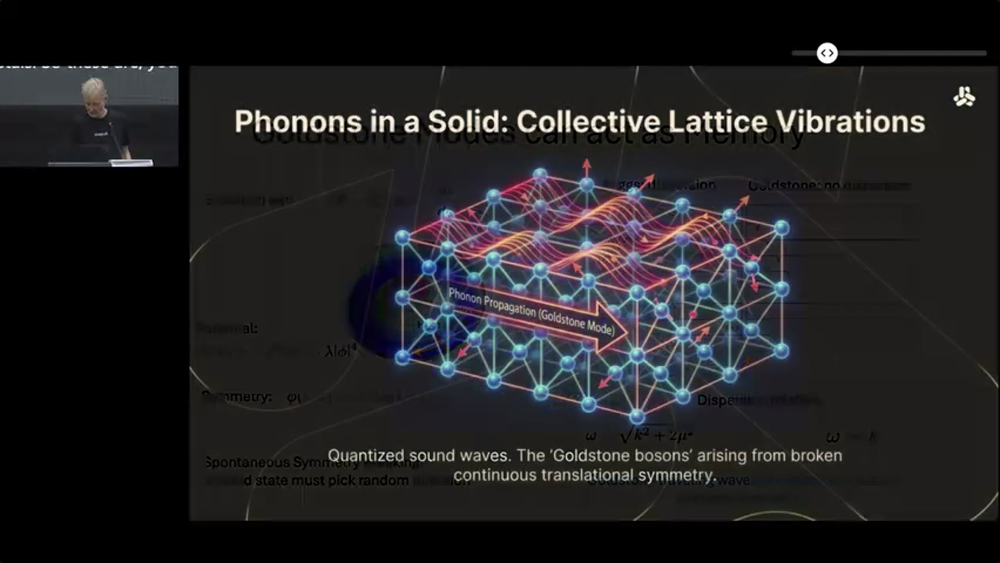

所以这一段不是单纯说“波很酷”。他的论证是：物理系统通过对称性、破缺和低能模式组织长期稳定的信息传播；神经网络也许可以借用这种机制，让内部 representation 拥有更自然的记忆和推理动力学。

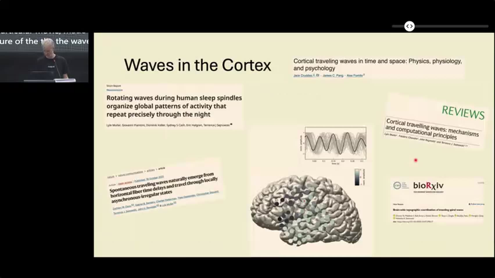

这条线对 AI4Science 的启发是：未来模型结构不一定只靠 attention 和 MLP，也可能引入更强的连续动力学、相位同步和波传播结构。

## 5. 21:26-29:19：第二部分转向 thermodynamics of AI

报告中段开始，Welling 重置问题：人类正处在类似蒸汽机时代的转折点。蒸汽机把人类劳动机械化，AI 则把人类智能机械化或增强化。

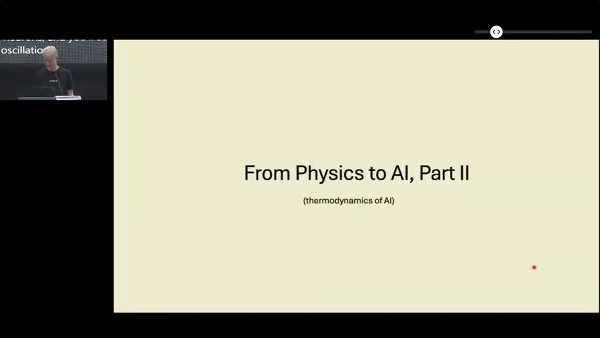

他和合作者写了一本关于 stochastic thermodynamics 与 AI 的书。核心判断是：非平衡热力学和机器学习共享同一套概率数学。

这句话需要展开。

在经典物理里，微观动力学常常是时间反演对称的。一个分子碰撞过程如果倒放，仍然可以满足底层运动方程。

但在宏观世界里，时间箭头很明显。玻璃会碎，热量会扩散，结构会退化成噪声。原因不是微观方程不允许倒放，而是宏观描述丢失了大量微观信息。

机器学习里也有类似结构。数据压缩、表征学习、推断、生成，都会涉及信息的丢失、恢复、近似和重构。

所以热力学不是外部类比，而是在问：

`当系统不可逆地丢失信息时，代价、熵、自由能和可恢复性如何被计算？`

这正好连接生成模型，尤其是扩散模型。

## 6. 29:19-34:19：Maxwell demon 让 entropy 变成信息问题

Welling 用 Maxwell demon 解释 entropy 的信息含义。

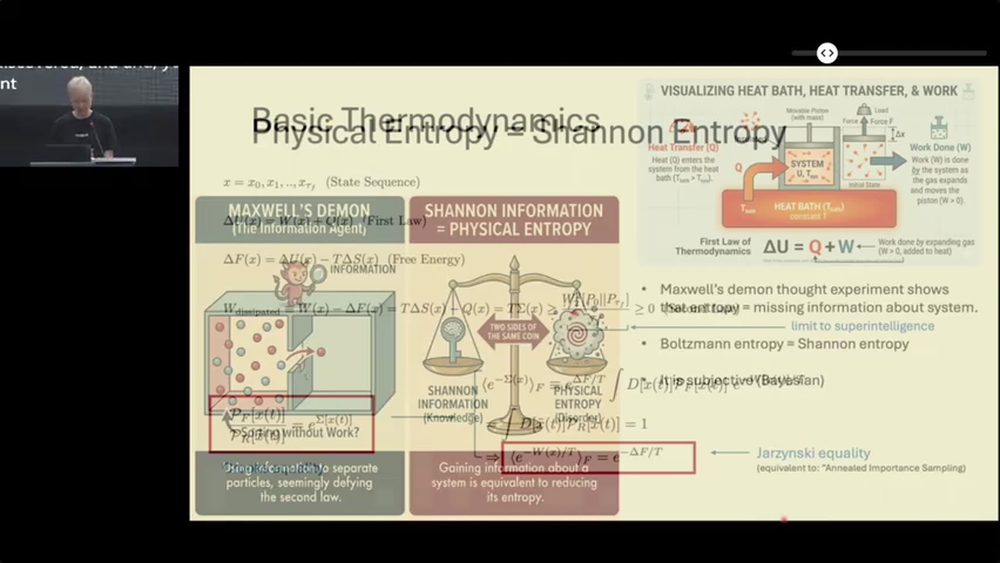

Maxwell demon 知道盒子里每个粒子的速度和位置，因此它可以选择性开门，把快粒子和慢粒子分开。看起来它可以违反第二定律，制造可做功的温差。

但关键在于：demon 能做到这件事，是因为它拥有关于微观状态的信息。真正的代价不在开门动作本身，而在信息获取、存储和擦除上。

因此 entropy 可以被理解为 missing information。Welling 进一步强调：physical entropy 和 Shannon entropy 在这个意义上是同一件事。

这里可以写成：

$$
S=-\sum_x p(x)\log p(x).
$$

如果一个 observer 知道更多系统状态，那么它的不确定性更低，entropy 也更低；另一个 observer 知道更少，entropy 就更高。于是 entropy 具有主观性或 Bayesian 色彩。

这和我们读 VI primer 时的后验不确定性是同一条线：不确定性不是装饰，而是模型关于未知状态的信息结构。

## 7. 34:19-38:18：free energy 把 thermodynamics 和 VI 接起来

接下来 Welling 把 thermodynamics 和 machine learning 放到同一张图里。

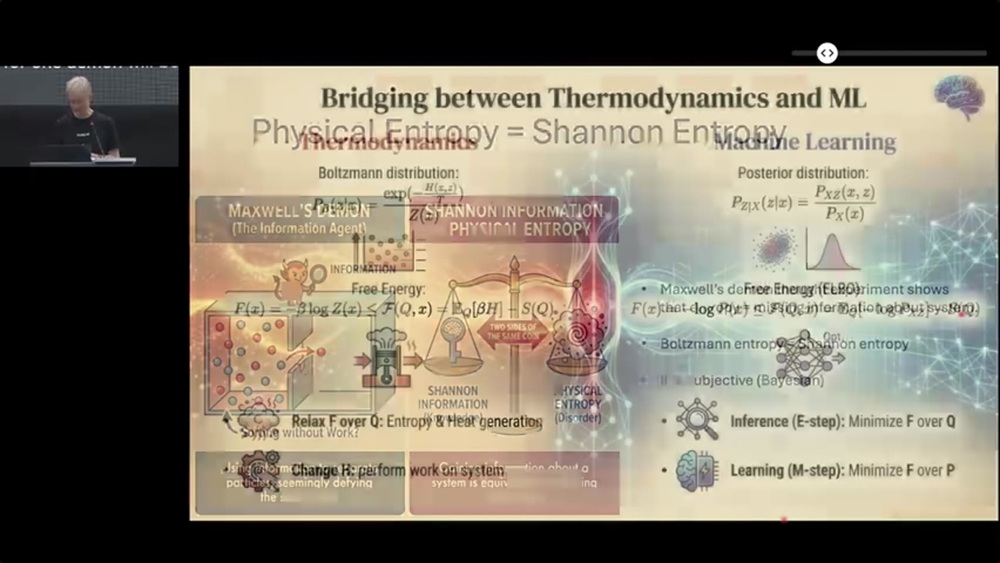

物理里的自由能通常写成：

$$
F=E-TS.
$$

它同时包含能量项和熵项。机器学习里的 variational free energy / ELBO 也有类似结构：一边要解释数据，另一边要保持分布复杂度或先验约束。

在变分推断中，我们常见：

$$
\log p(x)
\ge
\mathbb E_{q(z|x)}[\log p(x,z)-\log q(z|x)].
$$

右边就是 ELBO。换一种写法，优化 ELBO 等价于最小化 variational free energy。

Welling 把这件事重新放进热力学语言里：

第一，inference 对应 E-step：在固定模型下，找到更好的后验近似。

第二，learning 对应 M-step：在固定后验近似下，更新模型参数。

第三，二者都可以被看成某种 free energy minimization。

这和我们之前读 VI primer 的区分直接对应：Bayes VI 更强调后验近似，generative-model ELBO 更强调生成模型参数与推断网络共同学习。Welling 在这里给出的更高层视角是：它们都可以被放进 free-energy minimization。

## 8. 38:18-43:29：扩散模型是 thermodynamics 与 generative modeling 的直接桥

Welling 接着讲 diffusion models，并明确指出早期扩散模型论文就把自己命名为 `Deep Unsupervised Learning using Nonequilibrium Thermodynamics`。

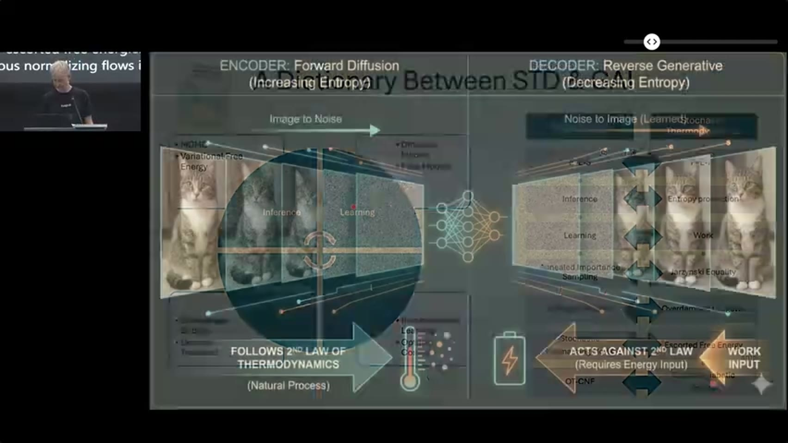

扩散模型的热力学读法是：

第一，forward diffusion 从结构化数据出发，逐步加噪，entropy 增加。

第二，reverse generative process 试图从噪声恢复结构，entropy 降低。

第三，反向过程不是自然发生的，它需要 learned control force 或 learned score / velocity。

第四，这个反向过程可以被看成“对抗第二定律”的受控过程：它不是违反物理，而是通过外部做功把系统推回低熵结构。

这和我们之前读 HJB / HJ-sampler 有明显共振。HJB 文章把生成过程解释成受控扩散；HJ-sampler 也把线性概率传播和非线性 HJ / controlled dynamics 接起来。Welling 在这里给的是更宏观的物理解释：生成模型在做的事情，就是学习如何用控制力把高熵噪声推回低熵结构。

## 9. 43:29-44:40：Jarzynski equality 让 free-energy difference 可估计

这一段把生成模型接到分子 binding free energy。

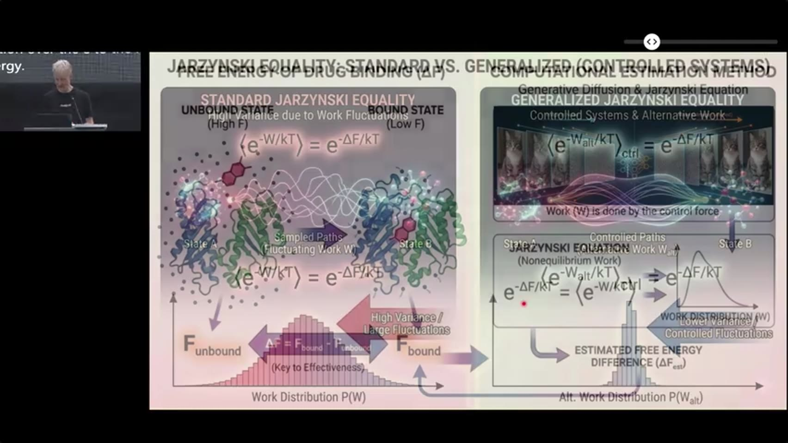

Jarzynski equality 的经典形式是：

$$
e^{-\beta \Delta F}
=
\left\langle e^{-\beta W}\right\rangle.
$$

这里 $\Delta F$ 是自由能差，$W$ 是非平衡过程中做的功，$\beta=1/(k_BT)$。

线性地说：

第一，药物分子从 unbound state 到 bound state 的自由能差决定它是否倾向于进入蛋白口袋。

第二，直接用分子动力学估计这个自由能差很难，因为需要采样大量罕见路径。

第三，如果我们能训练 diffusion / flow model，把一个分布受控地 transport 到另一个分布，就可以沿路径记录做功。

第四，用 Jarzynski equality 或 generalized Jarzynski equality，可以从路径做功估计自由能差。

这一步是整场报告中和 HJB/HJ-sampler 最接近的位置。我们之前一直关心：路径代价、控制力、自由能、生成路径、后验路径之间到底是什么关系。Welling 这里给出的材料科学版本是：如果生成模型学会了把 unbound 分布推向 bound 分布，那么它不仅生成样本，还能帮助估计 binding free energy。

## 10. 44:40-46:02：From foundation to impact：CuspAI 的位置

后半段进入 CuspAI。

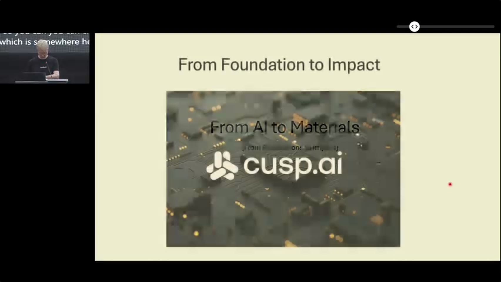

CuspAI 被描述成一个 materials search engine。但它不是传统意义上在已有材料数据库里检索，而是从目标性质出发，搜索或生成可能满足约束的新材料。

这可以按一条闭环理解：

第一，提出目标：我想要一个具有某些性质的材料。

第二，生成候选：模型提出可能的材料结构。

第三，评估候选：用模拟、surrogate、force field、实验或数据库预测性质。

第四，存储结果：把昂贵模拟和评估产生的信息保存下来。

第五，训练模型：把这些信息压缩进 neural network weights。

第六，下一轮搜索时，模型不必每次都从头计算，而是用学到的 surrogate 加速。

这就是后面 `simulation -> store data -> train NN surrogate -> emulate` 的核心。

## 11. 46:02-47:21：simulation to emulation 是 amortization

这张图是整场报告对我们项目最有启发的一页。

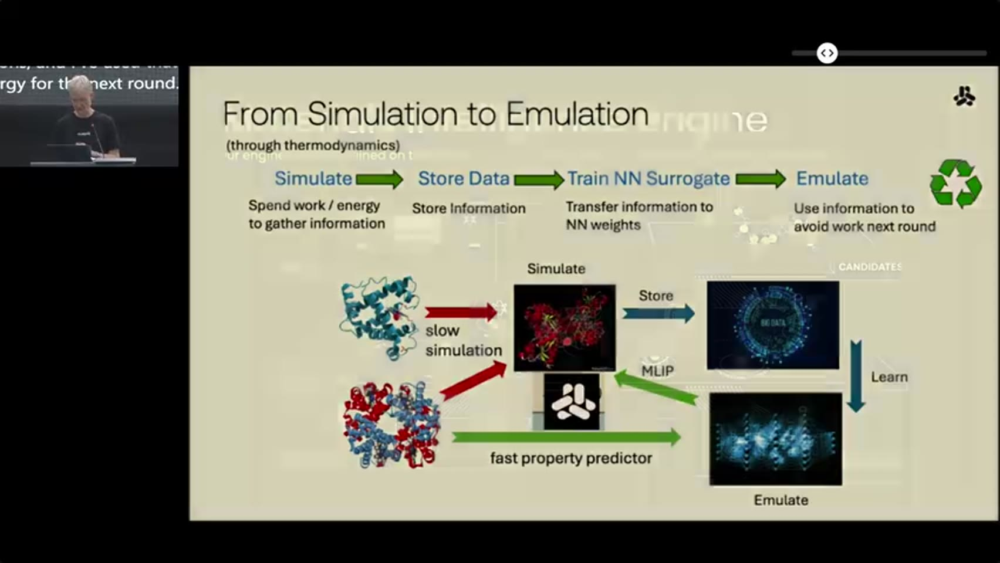

它把材料发现写成：

$$
\text{simulate}
\rightarrow
\text{store data}
\rightarrow
\text{train surrogate}
\rightarrow
\text{emulate}.
$$

第一轮模拟很贵，因为要用物理求解器、量子化学、分子动力学或 Monte Carlo 去评估候选。

但模拟不只是消耗算力，它还产生信息。只要把这些信息存下来，再训练 surrogate，就可以让后续候选评估变便宜。

这正是 amortized inference / amortized simulation 的思想：

`一次昂贵求解得到的信息，不应该只服务于当前样本，而应该被压缩进一个可复用模型，降低未来查询成本。`

和 VI primer 对比，这里不是只学习一个后验近似，而是学习一个可以在多查询场景下复用的代理系统。和我们自己的 synthetic city / inverse problem 思考也能接上：如果从 condition summaries 到 target distribution 的反演是 ill-posed，那么模型不应该只输出一个点估计，而应该学习一套可复用的条件后验或生成族。

## 12. 47:21-49:04：实现层：JAX-MD、GCMC、MOF、proton diffusion

Welling 随后展示 CuspAI 在模拟层的工作。

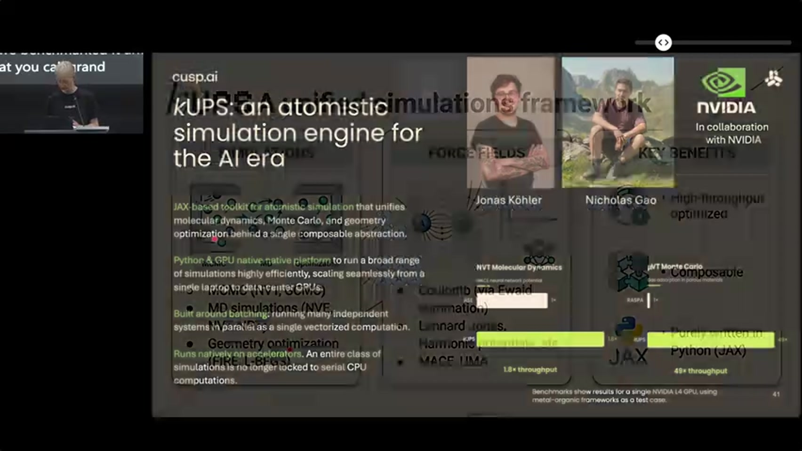

这部分的重点不是某一个 benchmark，而是材料发现系统需要一个可组合、高吞吐、可与 ML force field 对接的模拟后端。

他提到的能力包括：

- MD simulations；
- geometry optimization；
- grand canonical Monte Carlo；
- Coulomb interactions via Ewald summation；
- Lennard-Jones 和 harmonic potentials；
- 将机器学习 force field 编译到 JAX 后并行运行。

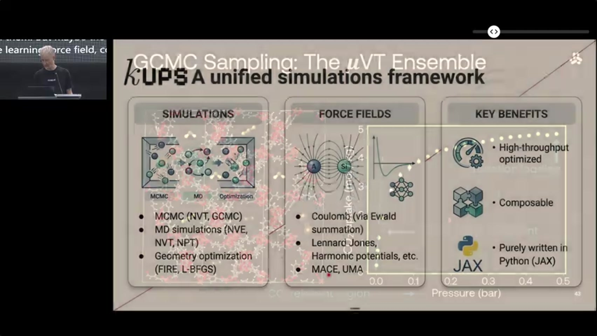

随后他给出两个材料场景。

第一个是 metal-organic framework，也就是 MOF，用于 carbon capture。核心问题是：在不同压力和温度下，CO2 会有多少吸附到孔隙结构中。这个问题需要计算 adsorption isotherms，因此 GCMC 和高吞吐模拟很重要。

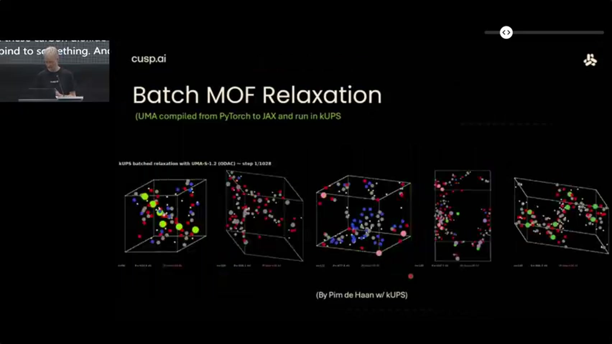

第二个是 proton diffusion，例如 sulfuric acid 中的 Grotthuss hopping。这里关心的是质子如何在水分子网络中跳跃传播。它体现了材料模拟中的另一类难题：动力学路径本身很重要，而不仅是静态结构。

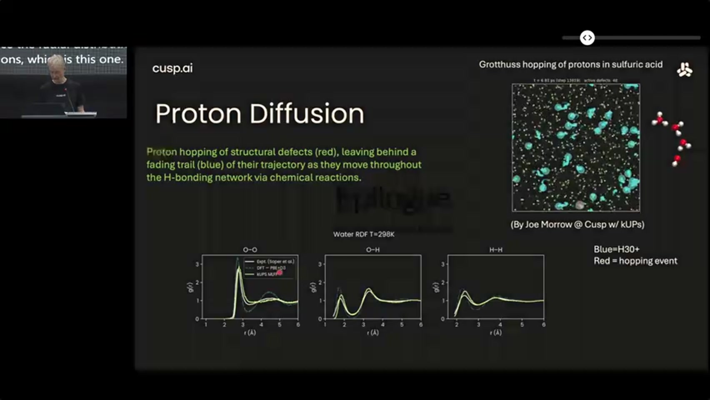

这部分可以总结为：CuspAI 不只是做 generative model，而是在搭一个从生成、评估、模拟、代理到优化的完整工程闭环。

## 13. 49:04-58:06：AI4Science 革命与责任

报告最后回到 AI4Science 的大图景。

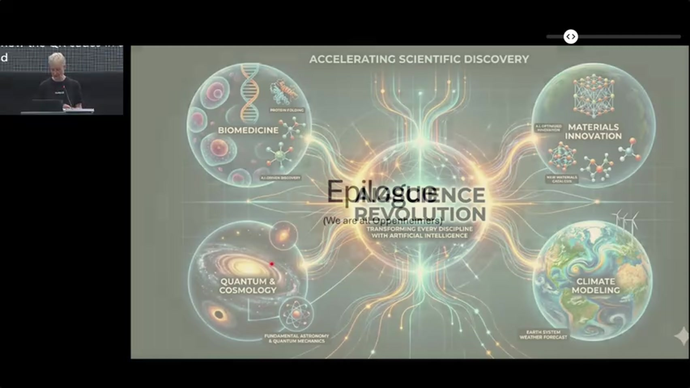

Welling 提到 AI4Science 正在影响多个方向：quantum、cosmology、biomedicine、materials innovation、climate modeling。他也提到 AMLab 近期工作，例如 variational flow matching 和 ultra-fast weather forecasting。

这部分的技术信息可以这样读：AI4Science 不再只是“把神经网络用于科学数据拟合”，而是越来越像一个完整新范式：

`生成候选 -> 模拟/实验评估 -> 学习代理 -> 主动搜索 -> 再生成`

最后他用 Oppenheimer 类比提醒责任问题。

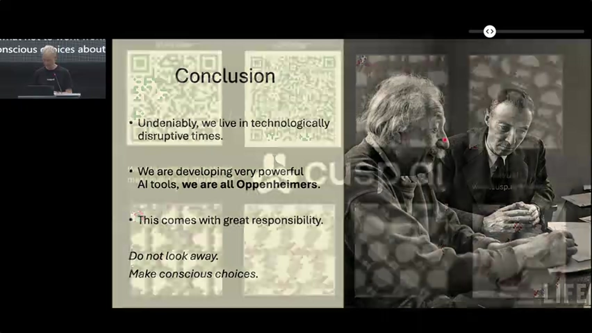

他的意思不是说每个 AI 研究者都等价于制造核武器，而是说：当一个小规模研究共同体正在开发巨大影响力的技术时，研究选择本身带有责任。不要只看 benchmark，不要只跟随热点，也不要对技术后果视而不见。

这和开场形成闭环：大胆研究值得鼓励，但大胆不等于无责任。

## 14. 放回我们已有阅读框架

这场 keynote 和我们前面读过的几条线可以清楚对齐。

第一，和 VI primer 的关系：Welling 把 variational inference 放进 free-energy minimization。我们之前区分 Bayes VI 和 generative-model ELBO；在这里，它们被提升到一个更大的 thermodynamic/information framework 中。后验近似、模型学习、entropy、free energy 不是孤立概念，而是一组关于信息和代价的统一语言。

第二，和 HJB / HJ-sampler 的关系：他讲 diffusion、control force、Jarzynski equality 和 free-energy estimation 时，本质上也在谈“受控路径的代价”。HJB 文章强调学标量势来控制生成路径；HJ-sampler 强调从线性随机过程通过 log transform 得到后验路径采样。Welling 的材料版本则是：用 generative process 学习从 unbound 到 bound 的受控路径，并用路径上的 work 估计自由能差。

第三，和 Fourier / complex numbers 的关系：他关于 waves、oscillators、phase synchronization、Kuramoto networks 的部分说明，未来 AI 模型可能不只是 token mixing 或 attention routing，也可能显式使用相位、振荡和波传播来组织记忆。这是复数和傅立叶语言进入现代 AI architecture 的一个自然入口。

第四，和我们自己的研究问题的关系：你的 synthetic city / census summaries / PUMA target 问题缺少清晰物理方程，但仍然可以借鉴 `simulation -> store data -> train surrogate -> emulate` 的结构。即使没有 PDE，也可以把数据生成器、约束、评估指标和后验不确定性组织成一个 amortized inverse problem。

这里的关键不是硬套 materials discovery，而是学它的系统结构：

`昂贵或不适定的反演问题，不应只做一次性求解；应把每次求解产生的信息积累成可复用的条件生成模型或 surrogate。`

## 15. 对本项目的直接启发

这场报告给我们的启发可以压成三点。

第一，物理先验不一定必须是 PDE。它也可以是 symmetry、conservation、equivariance、path cost、entropy、free energy、simulation protocol 或约束结构。对于城市/人口/流动问题，如果没有清晰 PDE，也可以先寻找这类弱物理或结构先验。

第二，生成模型不只是生成样本。它可以是受控路径、后验采样器、候选搜索器、surrogate evaluator，甚至是把昂贵模拟 amortize 后的工程组件。后续分析 synthetic city 时，不要只问“生成分布像不像”，还要问“它是否学到了可复用的条件反演结构”。

第三，AI4Science 的系统形态越来越接近闭环 discovery system。单个模型不是终点。真正有价值的是：条件输入、候选生成、约束评估、代理模型、不确定性、主动搜索和数据积累之间的闭环。

如果把这场 keynote 变成一句研究提醒，就是：

`从 physics 到 AI，不只是借概念；从 AI 到 materials，也不只是跑模型。核心是把结构先验、路径代价、信息积累和可复用推断组织成一个闭环系统。`
