# Takahiro Sagawa: Stochastic Thermodynamics

- Source video: https://www.youtube.com/watch?v=m023IrSLF-k
- English transcript: [transcript.md](../transcripts/m023IrSLF-k-an-introduction-to-stochastic-thermodynamics-takahiro-sagawa/transcript.md)
- Curated slides: [curated/index.md](../slides/m023IrSLF-k-an-introduction-to-stochastic-thermodynamics-takahiro-sagawa-nest/curated/index.md)
- Topic note: [landauer-to-generative-models.md](./landauer-to-generative-models.md)

## Slide Overview

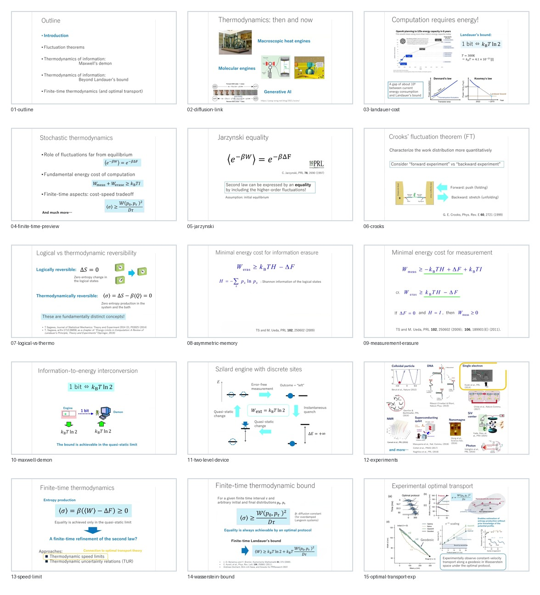

## 1. 开场、问题意识与和 AI 的连接

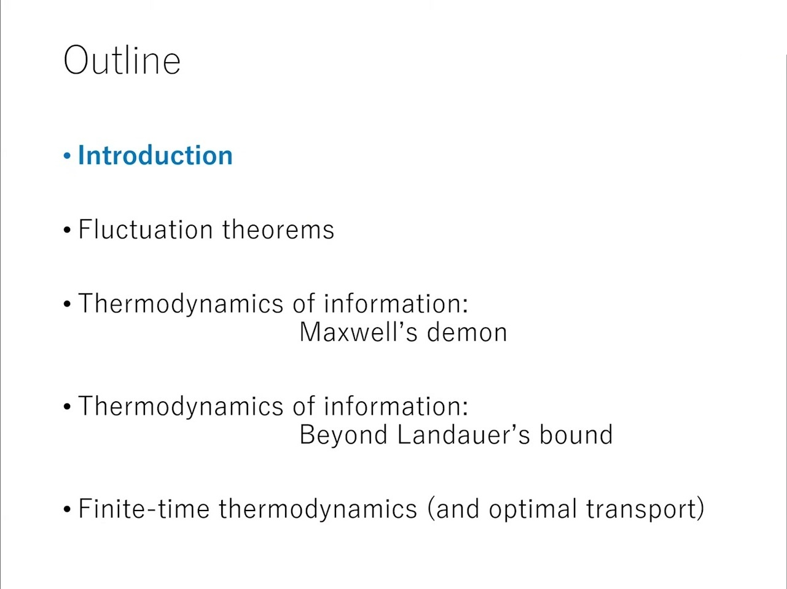
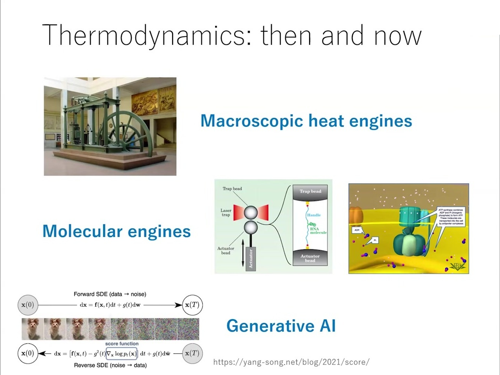
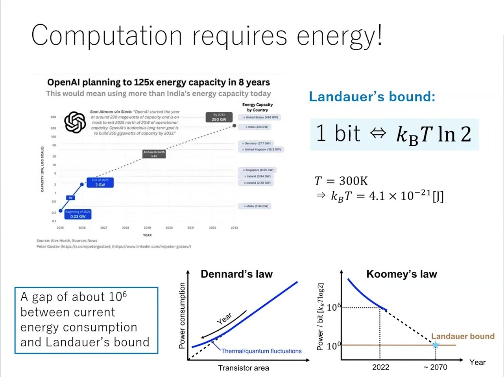

- 对应时间：`00:00:00-00:13:20`
- 中文整理：
Sagawa 一开始就把讲座分成三段：`fluctuation theorems`、`thermodynamics of information`、`finite-time aspects / optimal transport`。这三段其实也正好构成你当前研究兴趣的三条桥。

他先从小系统热力学讲起：统计热力学不再只是蒸汽机这种宏观系统，而是单分子拉伸、分子马达、量子系统这类会被热涨落强烈影响的对象。也正因为系统小，`fluctuation` 和 `entropy production` 不再是边角，而是主角。

然后他把话题自然引到 AI。这里不是简单说“AI 很火”，而是指出 diffusion model 在数学结构上和随机热力学存在可比性：都有正向加噪、逆向恢复、路径概率和非平衡演化的问题。Sagawa 自己也明确说，这种联系有时更像“数学和算法上的平行”，不一定意味着一一对应的物理起源，但它确实提供了一个有价值的桥梁。

接着他把计算能耗问题抬出来：如果大模型训练和推理越来越重，那么“计算的能量代价”就会重新成为热力学问题。于是 `Landauer bound` 成为整场讲座的第一条主线。这里你可以把它记成一句话：信息处理不是纯抽象操作，它有最低热力学代价。

## 2. Landauer 边界的直觉

- 对应时间：`00:03:17-00:13:20`
- 中文整理：
Sagawa 回顾了经典的 `Landauer bound`：擦除一比特信息至少需要付出 `k_B T ln 2` 量级的能量代价。这个数字本身很小，但它提供了“计算不可免费”的下界。

讲座里一个很重要的现实修正是：真实计算设备离这个极限通常还差很多。原因不只是在于材料工程不够好，更在于真实器件往往不是准静态过程，而是高速、耗散、受噪声影响的非平衡过程。也就是说，`Landauer bound` 不是现实计算的直接预测值，而是理想极限。

现场讨论还补充了两个点：

- `Landauer bound` 假设你关心的是信息存储那部分自由度，而不是整个复杂器件的全部微观细节。
- 在真实硬件里，保持记忆本身就可能持续耗散，因此非平衡稳态系统里，仅靠 `Landauer bound` 并不能解释全部能耗。

这部分对你最重要的启发是：后面讲到的有限时间修正、速度极限和最优输运，都可以看成是在问“离 Landauer 极限还差多少，以及这个差距怎样由动力学和几何结构决定”。

## 3. 涨落定理与 Jarzynski Equality

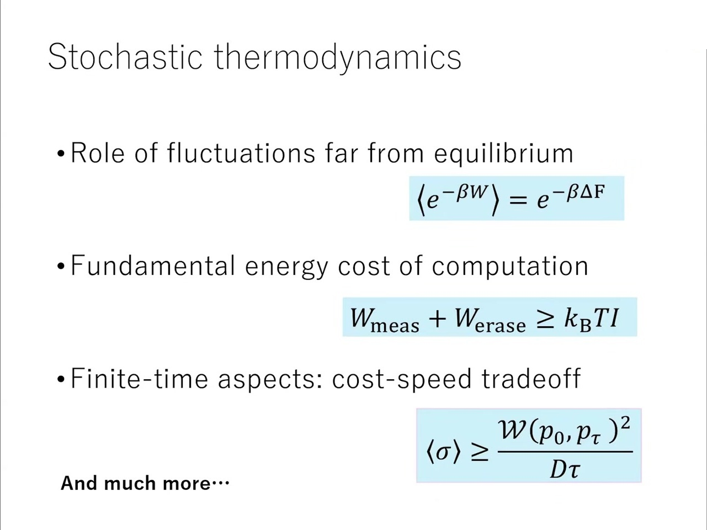
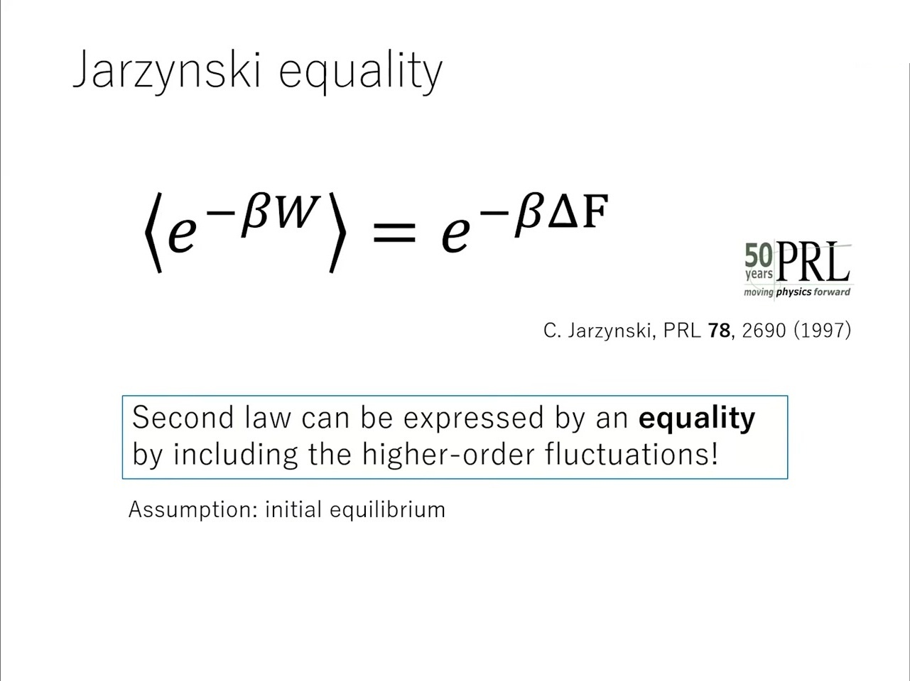

- 对应时间：`00:13:20-00:20:40`
- 中文整理：
这一段从第二定律的“平均意义”出发：在小系统里，单条轨道上可能出现看起来像“违反第二定律”的事件，但在系综平均下，第二定律仍然成立。

核心公式是 `Jarzynski equality`：

```text
<exp(-beta W)> = exp(-beta Delta F)
```

它的重要性在于：

- 左边是非平衡过程中做功的随机量的指数平均。
- 右边却是平衡自由能差。

也就是说，即使过程远离平衡，只要统计得当，非平衡做功分布仍然严格受自由能差约束。这正是你之前说的“涨落”和“自由能统一框架”的一个最直接例子。

Sagawa 强调了 Jarzynski 的普适性来自它依赖的结构很少。在最原始的 Hamiltonian 推导里，关键只需要 `Liouville theorem` 这类体积保持性质。这一点很重要：说明这条等式不是某个具体模型的技巧，而是一个更深的结构性结果。

## 4. Crooks 定理、熵产生与反向过程

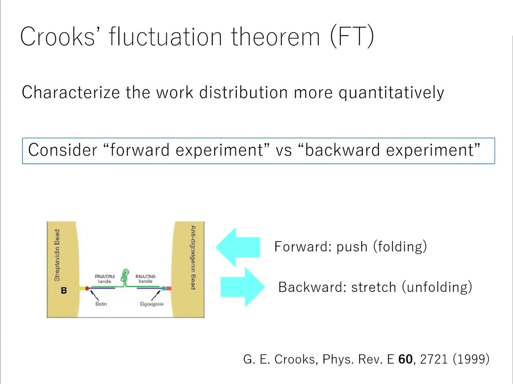

- 对应时间：`00:20:40-00:25:00`
- 中文整理：
接下来 Sagawa 用单分子拉伸/回折叠实验讲 `Crooks fluctuation theorem`。它的核心不是单纯再给一个公式，而是引入了 `forward / backward process` 的成对比较。

你可以这样理解：

- `Jarzynski` 更像是把“非平衡功分布”压缩成一个指数平均。
- `Crooks` 则保留了更细的路径级信息，它比较正向过程和反向过程下熵产生为正或负的概率。

这直接把 `entropy production` 和 `time-reversal asymmetry` 联系起来。也就是说，系统为什么不可逆，不只是因为“平均耗散 > 0”，而是因为正反路径在概率上本来就不对称。

这部分和 diffusion model 的联系也在这里出现：扩散模型有一个从数据到噪声的正向过程，以及从噪声回到数据的逆向过程。Sagawa 的说法比较克制，他没有说两者完全等价，但明确承认“用反向过程去恢复结构”这一思想上的相似性。

## 5. 逻辑可逆性与热力学可逆性不是一回事

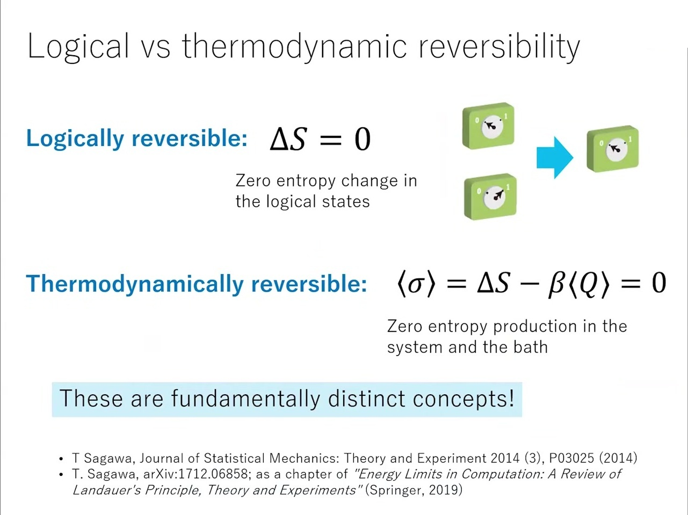
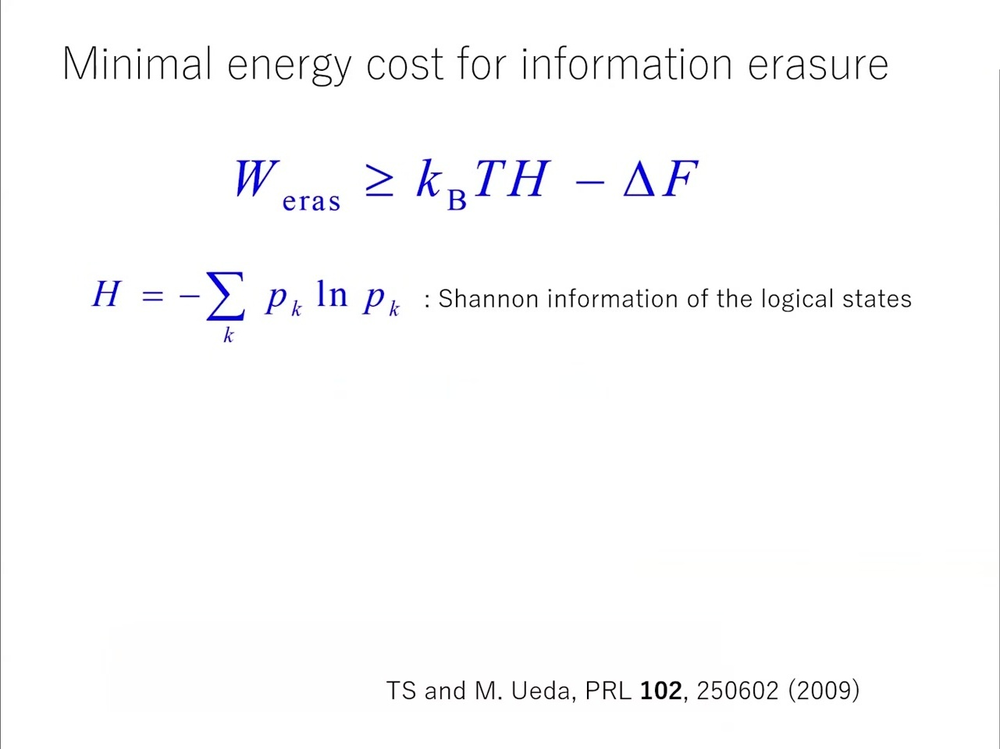

- 对应时间：`00:35:24-00:46:45`
- 中文整理：
这一段是全场最值得保留的概念澄清之一。

Sagawa 区分了两种“可逆”：

- `logical reversibility`：从信息编码角度看，输入和输出是否一一对应。
- `thermodynamic reversibility`：从总熵产生角度看，过程是否可以做到零熵产生。

擦除信息显然是逻辑不可逆的，因为多个逻辑态会被压到同一个态；但它仍然可能在准静态极限下热力学可逆。也就是说，“逻辑不可逆”不等于“必然有额外不可逆耗散”，这正是很多关于 Landauer 的常见误解。

接着他讨论 `asymmetric memory`。如果 0 态和 1 态对应的阱内部自由能不同，那么信息擦除的代价不再只是简单的 `k_B T ln 2`，还会出现与各阱自由能差有关的修正项。对你来说，这说明：

- Landauer 原理最经典的形式是对称记忆的理想情形。
- 一旦考虑真实器件结构，热力学代价会进入“自由能地形”层面的细节。

## 6. 测量、擦除、互信息与 Maxwell Demon

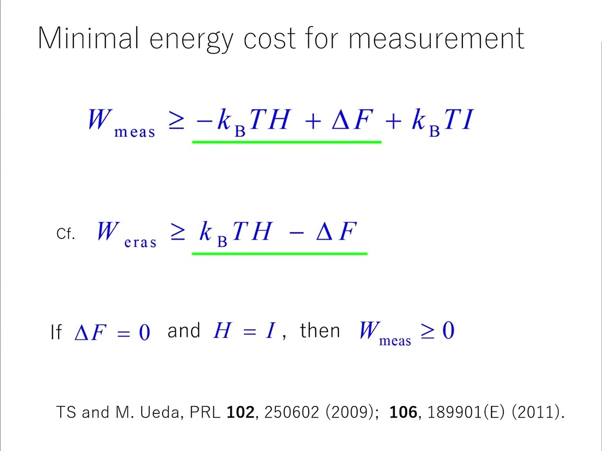
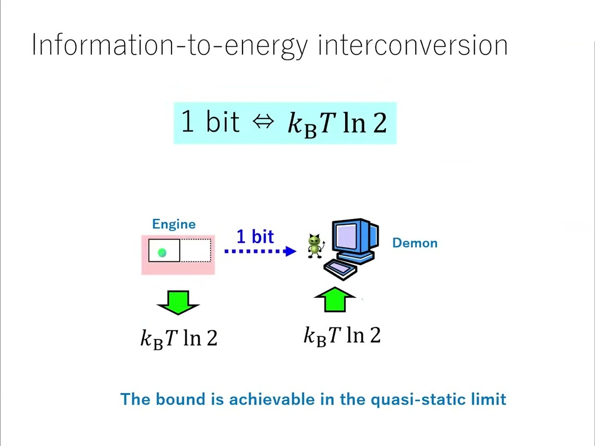
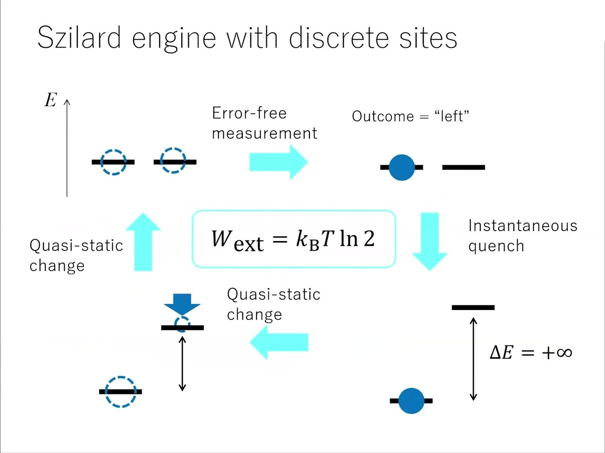
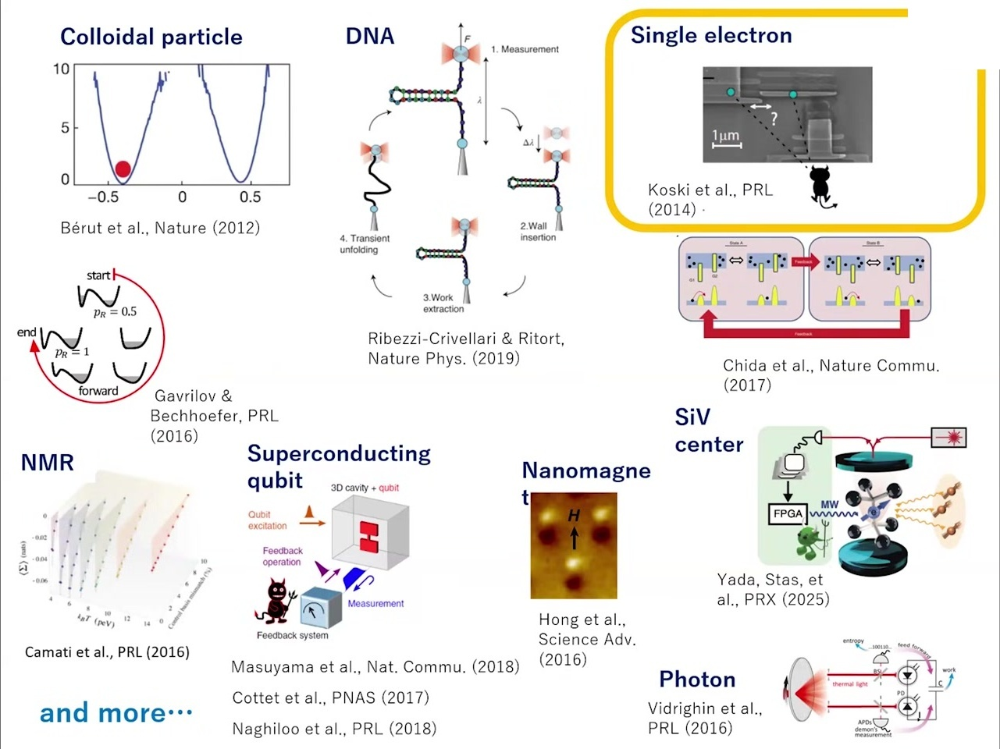

- 对应时间：`00:46:45-01:14:14`
- 中文整理：
这里进入信息热力学的核心：`measurement`、`erasure`、`feedback` 不是三件彼此无关的事，而是同一个信息循环的不同阶段。

Sagawa把 `measurement` 讲成“把系统的信息写入记忆”。从这个角度看，测量更像写内存，而不是抽象地“读取世界”。因此测量也有热力学成本，而且它与擦除的成本符号结构不同。两者加在一起，会出现和 `mutual information` 相关的权衡式。

最关键的点是：

- 如果只做测量和擦除而不做反馈，那么获得的信息最终会以耗散的形式付出代价。
- 如果获得的信息被真正用于 `feedback`，那互信息就能转化成可提取的功。

这正是 `Maxwell demon` 不违背第二定律的原因。恶魔看似靠“知道粒子在哪”白嫖功，但它并不是免费知道的；真正闭合整个信息循环后，第二定律恢复。

`Szilard engine` 在这里是一个极好的模型：一比特信息理论上可以换出 `k_B T ln 2` 量级的功。Sagawa 还讲了两能级实现、带误差测量、以及后续实验验证。对你来说，这部分最值得记住的是：

- 互信息不是抽象统计量，它可以是做功资源。
- `measurement -> memory -> feedback` 这条链路，正是信息热力学的工作流。
- 如果以后你想把这条线和 `AI for physics` 结合，互信息和反馈控制会是比“泛泛自由能”更硬的切入口。

## 7. 有限时间热力学、速度极限与最优输运

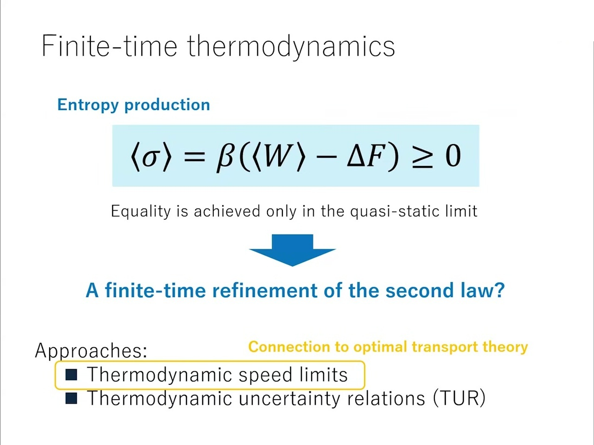
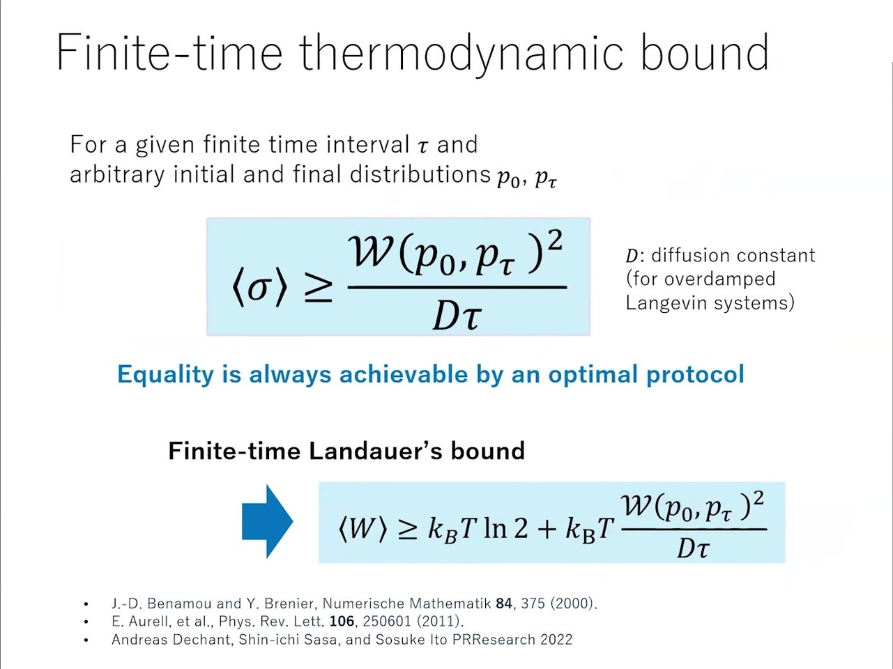
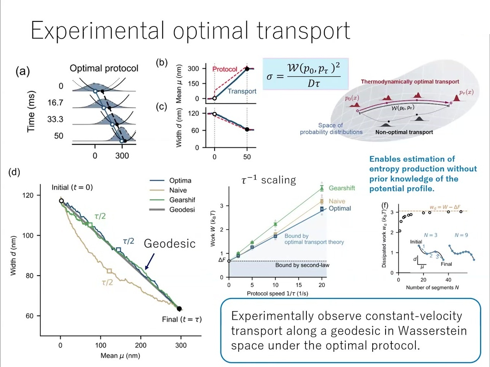

- 对应时间：`01:14:14-01:29:30`
- 中文整理：
最后一段是我认为和你后续研究最直接相关的部分。

问题被重新表述成：

- `Landauer bound` 是无限慢准静态极限。
- 那如果过程必须在有限时间内完成，额外代价是什么？

Sagawa 给出的答案是：这个额外代价可以用 `optimal transport` 和 `Wasserstein distance` 来描述。直观上，概率分布从初态变到末态不是没有几何代价的；在有限时间里完成这次搬运，熵产生下界会被这个几何距离控制。

在连续空间、尤其 `Fokker-Planck equation` 框架下，这个结果特别自然：

- 系统演化的是概率密度。
- 最优输运本来就是比较两个分布之间“最省代价搬运”的理论。
- 因此有限时间热力学的最优协议，可以理解成分布空间中的几何最短路。

这也是为什么这一段和你的主线高度一致：

- `随机分析`：底层是随机过程与概率分布演化。
- `Fokker-Planck`：把随机路径翻译成密度动力学。
- `统计物理`：把这个动力学解释成熵产生和自由能代价。
- `AI / diffusion`：把分布搬运和逆向生成重新写成算法问题。

Sagawa 在 Q&A 里也明确提到，原始 diffusion model 的逆过程未必就是这里意义下的“最优”逆过程。这一点非常重要，因为它给了一个未来研究问题：

`生成模型的逆向采样，能否用随机热力学或最优输运原理进一步约束和改写？`

## 8. 和你现有学习路径的对接

这场讲座和你现有的两个学习仓库其实是能接起来的：

- `Stat_dynamics` 里你已经遇到过涨落、响应、扩散、非平衡。这里把它们推进到了 `fluctuation theorem / Jarzynski / Crooks / entropy production`。
- `FTEC 5220` 里你在学 Brownian motion、Ito、Fokker-Planck、SDE numerical methods。这里最后一段正好告诉你：这些工具不只是课程内容，它们直接通向最优输运、速度极限和生成模型。

如果要把“所学内容”和“前沿研究”真正接起来，我建议你把这场讲座记成下面这条链：

```text
small-system fluctuations
-> fluctuation theorems
-> Jarzynski / Crooks
-> thermodynamics of information
-> Landauer + feedback + mutual information
-> finite-time dissipation
-> Wasserstein / optimal transport
-> diffusion-model connections
```

## 9. 建议的后续动作

- 先回看 [05-jarzynski.jpg](../slides/m023IrSLF-k-an-introduction-to-stochastic-thermodynamics-takahiro-sagawa-nest/curated/05-jarzynski.jpg), [06-crooks.jpg](../slides/m023IrSLF-k-an-introduction-to-stochastic-thermodynamics-takahiro-sagawa-nest/curated/06-crooks.jpg), [14-wasserstein-bound.jpg](../slides/m023IrSLF-k-an-introduction-to-stochastic-thermodynamics-takahiro-sagawa-nest/curated/14-wasserstein-bound.jpg) 三张。
- 然后对照英文 transcript 查你不确定的术语，不要一开始就陷进整段 Q&A。
- 如果后面要做复现，最适合的起点不是整场讲座，而是这两个切口：
  1. `Jarzynski / Crooks` 的数值实验。
  2. `Fokker-Planck + Wasserstein bound` 的一维分布演化示例。

## 10. Self Check

我对这份文档做了三类检查：

- 结构完整性：主线从 `outline` 到 `optimal transport` 共覆盖 `15` 个关键时间点，没有只停在前半段。
- 术语正确性：重点人工修正了 `Landauer`、`Koomey's law`、`Jarzynski equality`、`Crooks fluctuation theorem`、`Liouville theorem`、`Wasserstein distance`。
- 资源链接：本文件中引用的 slide 都来自 `curated/` 目录，不再混用旧的自动 scene-detect 结果。

仍然要保留一个边界说明：Q&A 部分英语口语很杂，虽然 transcript 已清洗，但不适合当成逐句可靠文本；本整合稿对那部分做的是“概念提炼”，不是逐字翻译。
