# Welch Labs《Imaginary Numbers Are Real》复数学习笔记

视频系列：Welch Labs, *Imaginary Numbers Are Real*, Parts 1-13.

这份笔记的目标不是把 13 集逐字复述一遍，而是把它整理成一条可复用的学习线索：为什么数学必须引入复数，复数为什么自然地表示二维旋转和相位，以及为什么后面读傅立叶分析、波动方程、谱方法、量子力学或非平衡物理时，复数会反复出现。

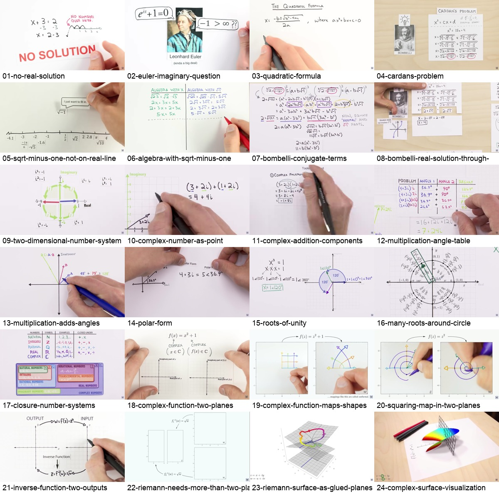

## 1. 问题的入口：实数轴上没有解，但代数要求扩展空间

系列从一个非常简单的方程开始：

$$
x^2+1=0.
$$

如果只在实数轴上看，这个方程没有解。因为任意实数平方都非负，所以

$$
x^2\ge 0,
$$

于是

$$
x^2+1\ge 1.
$$

图像上看，抛物线 $y=x^2+1$ 永远不和 $x$ 轴相交。

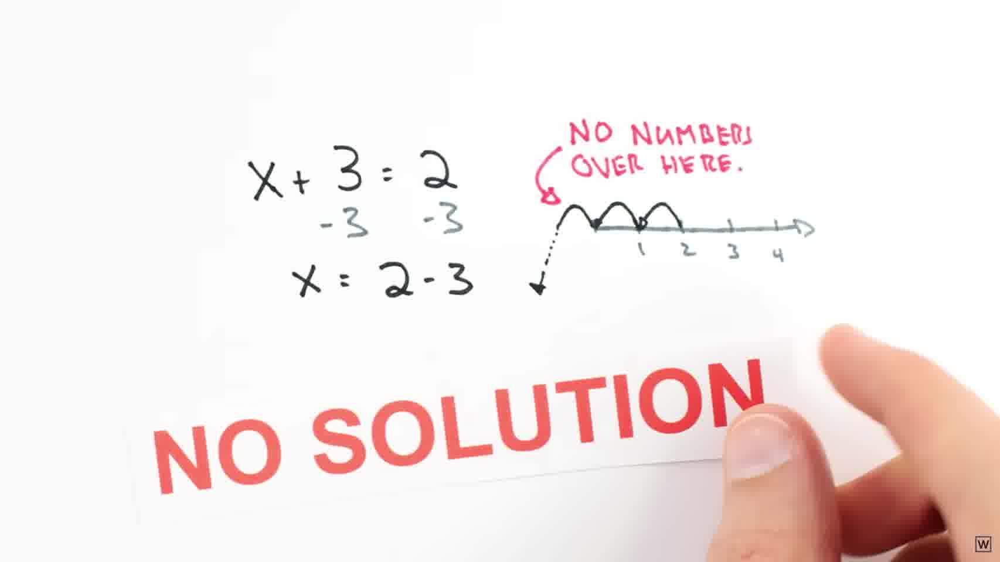

但问题不止是“这个方程没有实数解”。更深一层的问题是：如果一个二次多项式应该有两个根，而我们在实数轴上找不到根，那说明缺的可能不是计算技巧，而是数的空间本身。

现代说法是：在复数域 $\mathbb C$ 中，非零 $n$ 次多项式有 $n$ 个根，按重数计算。这就是代数基本定理的语境。它不是说每个多项式都在实数轴上有根，而是说实数轴不是代数闭合的；如果你要让多项式求根这件事在一般情况下闭合，就需要更大的数域。

因此，复数的第一层意义不是“凭空发明一个奇怪符号”，而是：当已有数系无法让基本代数操作闭合时，数学会被迫扩展数的概念。

## 2. 历史压力：复数不是从二次方程来的，而是被三次方程逼出来的

如果只是看 $x^2+1=0$，人们很容易说“既然没有实数解，那就不要解”。真正让虚数变得无法绕开的，是三次方程。

二次方程有熟悉的求根公式：

$$
x=\frac{-b\pm\sqrt{b^2-4ac}}{2a}.
$$

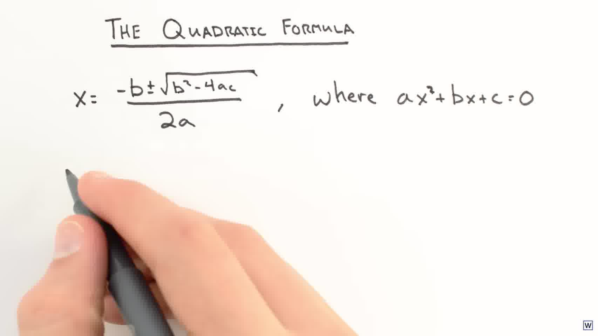

16 世纪的数学家想进一步找到三次方程的类似公式。问题是，三次方程的公式在某些情况下会出现负数开平方，即使最终答案明明是一个普通的实数。

Cardano 的问题可以线性地理解成三步：

第一步，三次方程从图像上看确实应该有实数解。

第二步，公式推导过程中却出现了 $\sqrt{-1}$ 这样的对象。

第三步，如果直接拒绝 $\sqrt{-1}$，公式就卡死；如果暂时接受它，后面反而能算出正确的实数答案。

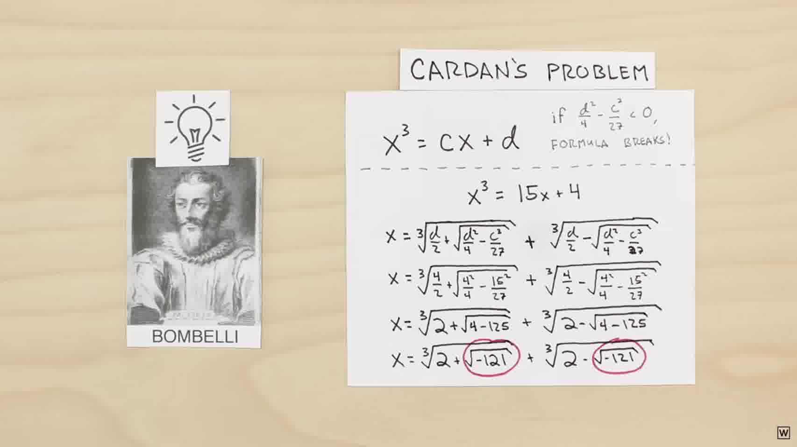

这就是复数历史上非常重要的一点：虚数一开始并不是为了求 $x^2+1=0$ 这种“没有实数根”的方程，而是为了处理那些“最终有实数解，但中间必须经过虚数”的代数问题。

## 3. Bombelli 的关键动作：把 $\sqrt{-1}$ 当作可运算对象

Bombelli 的做法是：先不要急着给 $\sqrt{-1}$ 一个现实直觉，而是把它当作一种新的代数对象来操作。

设

$$
i=\sqrt{-1},
$$

也就是

$$
i^2=-1.
$$

如果只在实数轴上放置 $\sqrt{-1}$，它确实没有位置。

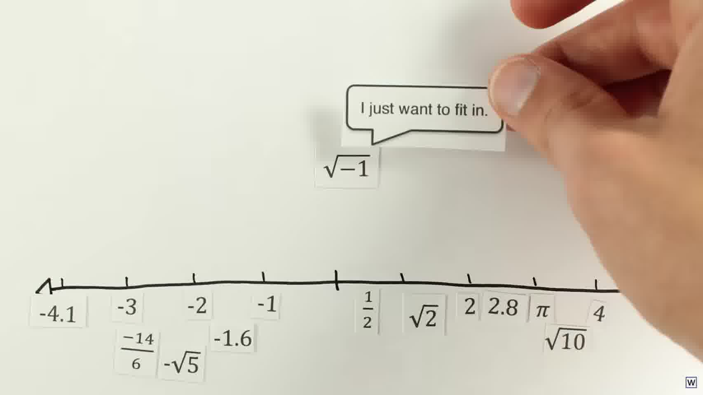

但它可以作为代数规则存在。关键不是“它像不像长度、数量、苹果个数”，而是它是否能和已有数系一起形成一致的运算系统。

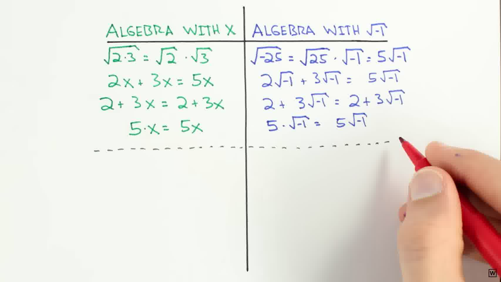

Bombelli 的更深一步是把复杂表达式写成互为共轭的形式：

$$
a+b\sqrt{-1}
$$

和

$$
a-b\sqrt{-1}.
$$

它们相加时，虚部会抵消：

$$
(a+bi)+(a-bi)=2a.
$$

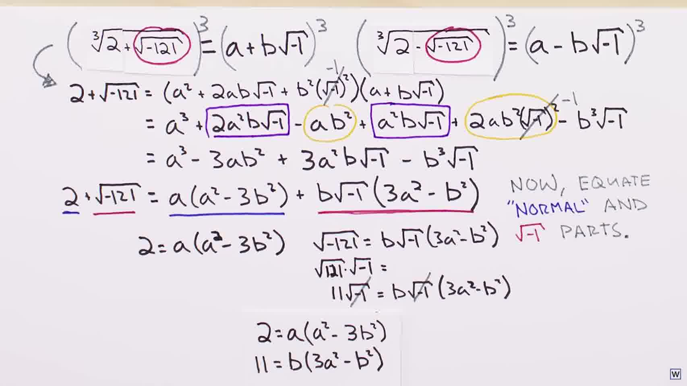

这说明虚数可以作为“中间语言”出现。即使最终结果是实数，推导路径也可能必须穿过复数空间。

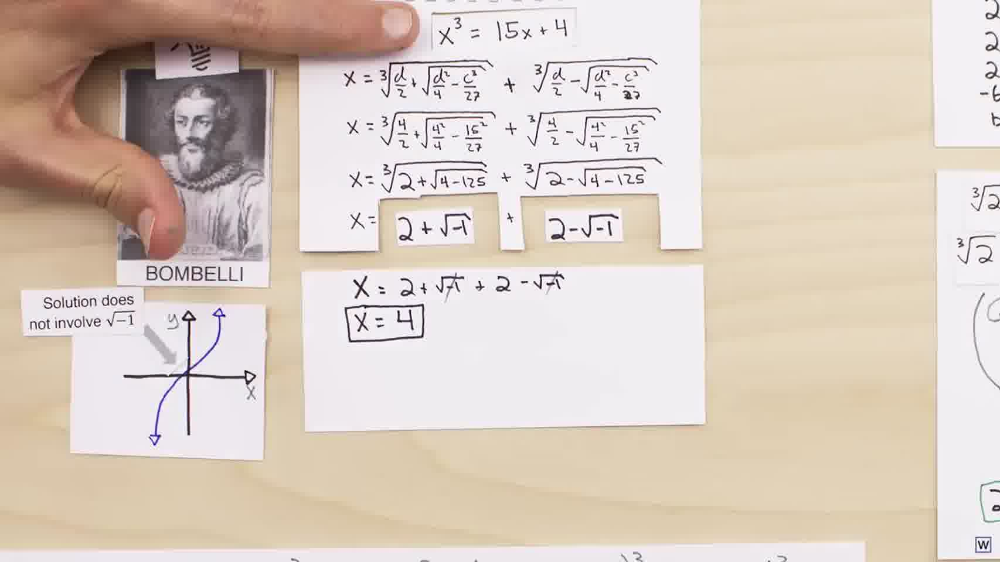

这个思想对后面的物理和傅立叶分析很重要。很多真实物理量最后是实数，但计算过程会先进入复数表示，因为复数表示更适合处理旋转、振荡、相位和指数传播。

## 4. 复数不是“一维实数加一个奇怪尾巴”，而是二维数

复数的一般形式是：

$$
z=a+bi,
$$

其中 $a$ 是实部，$b$ 是虚部：

$$
\operatorname{Re}(z)=a,\qquad \operatorname{Im}(z)=b.
$$

这一步的关键是：不要把 $bi$ 理解成实数轴上的某种怪数，而要把它理解成和实轴垂直的一个新方向。

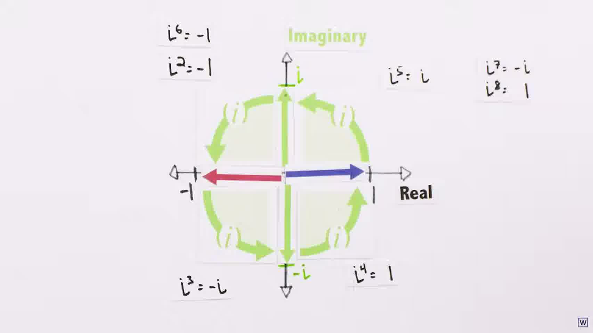

于是复数 $a+bi$ 可以画成平面上的一个点或向量：

$$
z=(a,b).
$$

横轴是 real axis，纵轴是 imaginary axis。

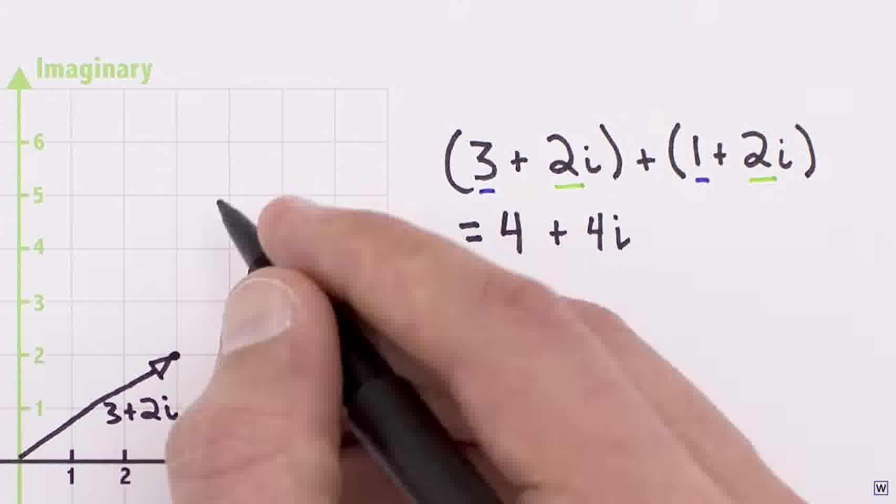

在这个表示下，复数加法就是二维向量加法：

$$
(a+bi)+(c+di)=(a+c)+(b+d)i.
$$

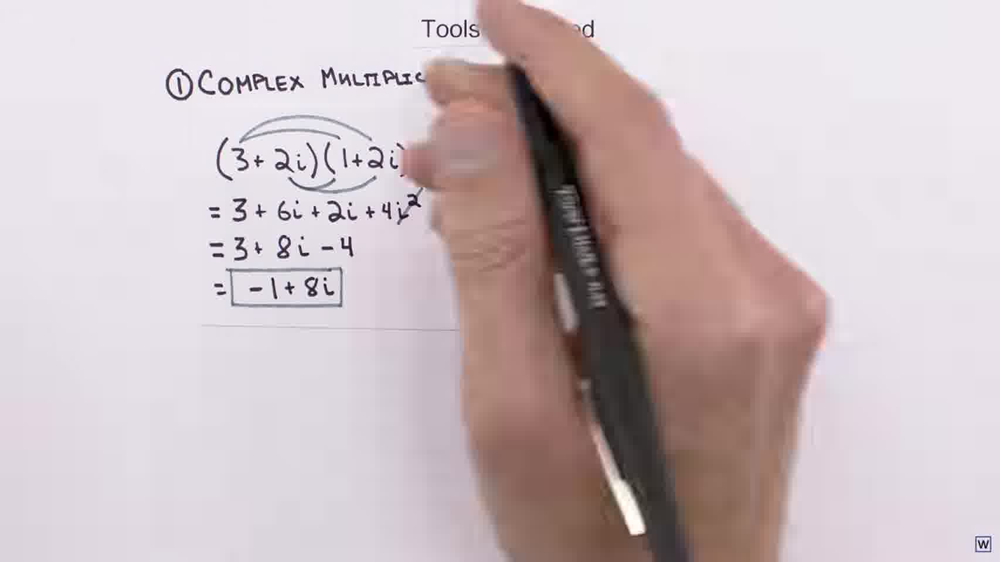

这一步让复数从“神秘符号”变成了“带有特殊乘法规则的二维向量”。

## 5. 复乘法的核心：不是普通二维向量乘法，而是缩放加旋转

复数加法很直观，但复数乘法才是复数真正有用的地方。

代数上：

$$
(a+bi)(c+di)=ac+adi+bci+bd i^2.
$$

因为 $i^2=-1$，所以

$$
(a+bi)(c+di)=(ac-bd)+(ad+bc)i.
$$

这个公式看起来只是展开，但几何意义更重要。把复数写成极坐标：

$$
z=r(\cos\theta+i\sin\theta).
$$

这里

$$
r=|z|=\sqrt{a^2+b^2},
$$

表示到原点的距离；

$$
\theta=\arg(z),
$$

表示和实轴的夹角。

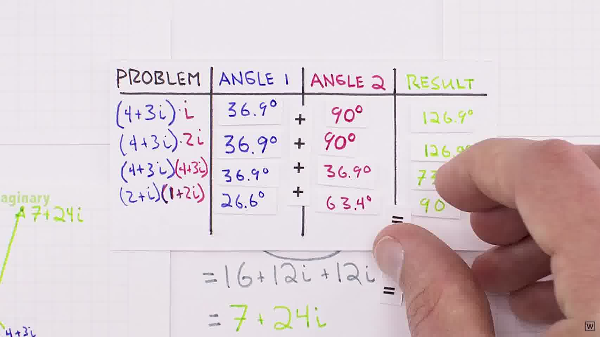

如果

$$
z_1=r_1(\cos\theta_1+i\sin\theta_1),
$$

$$
z_2=r_2(\cos\theta_2+i\sin\theta_2),
$$

那么乘积满足：

$$
z_1z_2=r_1r_2\bigl(\cos(\theta_1+\theta_2)+i\sin(\theta_1+\theta_2)\bigr).
$$

也就是说：

$$
|z_1z_2|=|z_1||z_2|,
$$

$$
\arg(z_1z_2)=\arg(z_1)+\arg(z_2).
$$

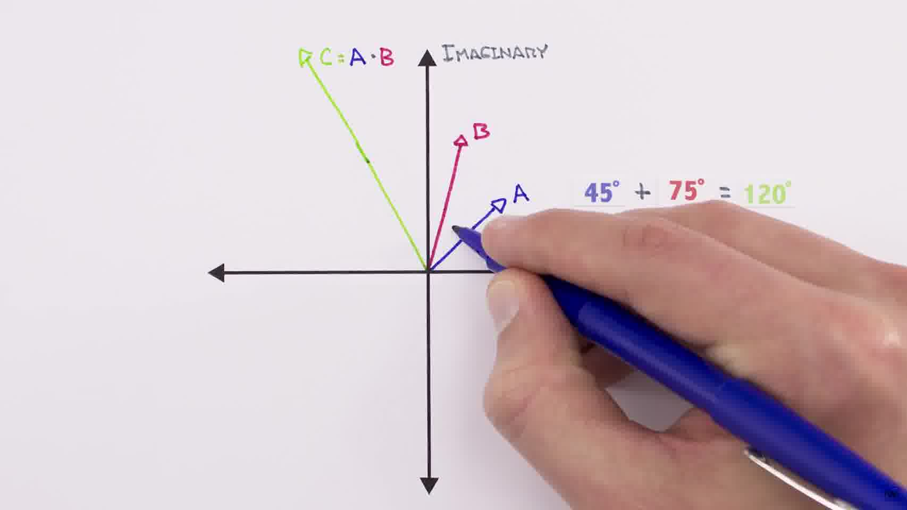

这就是复数和傅立叶分析之间最重要的接口：复数乘法天然表示“幅度相乘，角度相加”。换成物理语言，就是“振幅变化”和“相位推进”可以被一个复数同时编码。

## 6. 极坐标形式：复数开始变成相位语言

极坐标表示可以写成：

$$
z=r\angle\theta.
$$

更常用的是 Euler 形式：

$$
z=re^{i\theta}.
$$

其中 Euler 公式是：

$$
e^{i\theta}=\cos\theta+i\sin\theta.
$$

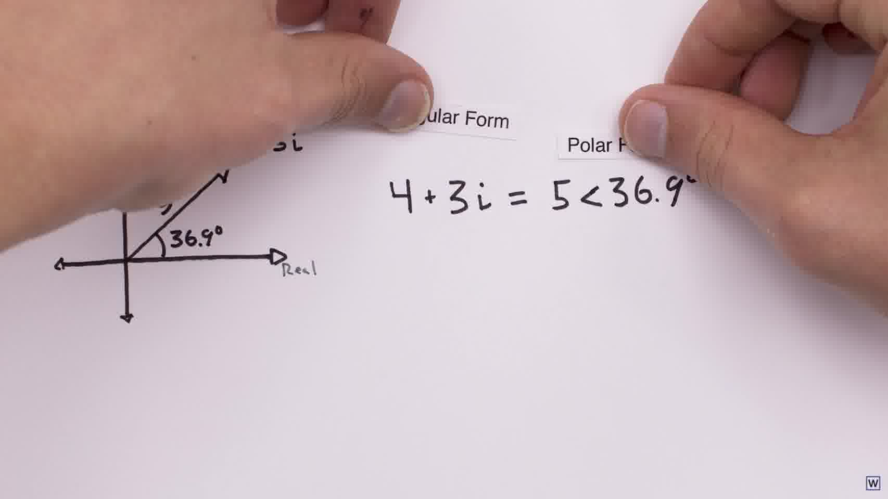

这条公式可以先这样理解：

第一，$\cos\theta$ 是旋转点在实轴上的投影。

第二，$\sin\theta$ 是旋转点在虚轴上的投影。

第三，$e^{i\theta}$ 把这两个投影合成一个在单位圆上旋转的复数。

因此，一个正弦波可以被看成旋转复数的实部：

$$
\cos\theta=\operatorname{Re}(e^{i\theta}),
$$

$$
\sin\theta=\operatorname{Im}(e^{i\theta}).
$$

这就是为什么傅立叶分析里不直接只写 $\sin$ 和 $\cos$，而经常写：

$$
e^{ikx}
$$

或

$$
e^{i\omega t}.
$$

复指数不是为了把问题变复杂，而是把“振荡”写成“旋转”。

## 7. 根与闭包：复平面让多项式求根变成几何问题

例如：

$$
x^3=1.
$$

实数里明显有一个解：

$$
x=1.
$$

但如果按代数基本定理，三次方程应该有三个根。复平面给出直观解释：要让一个复数三次方等于 $1$，它的模长必须满足

$$
r^3=1,
$$

所以

$$
r=1.
$$

它的角度必须满足：

$$
3\theta=2\pi k.
$$

于是

$$
\theta=\frac{2\pi k}{3},
$$

其中 $k=0,1,2$。

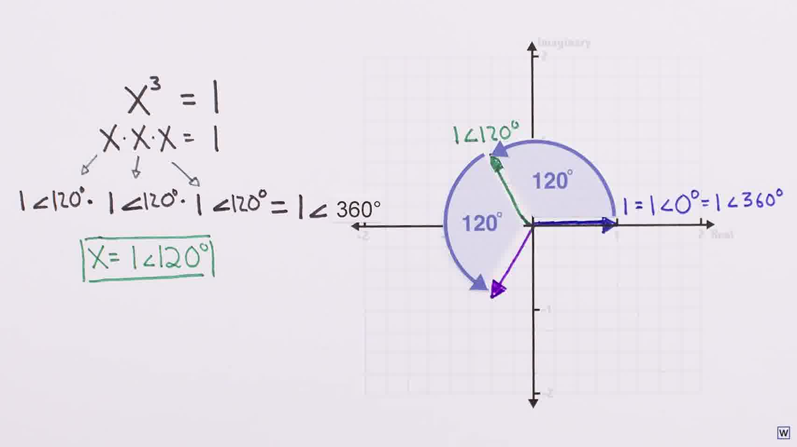

所以三个根均匀分布在单位圆上：

$$
1,\qquad e^{2\pi i/3},\qquad e^{4\pi i/3}.
$$

更一般地：

$$
z^n=1
$$

的 $n$ 个根是

$$
z_k=e^{2\pi i k/n},\qquad k=0,1,\ldots,n-1.
$$

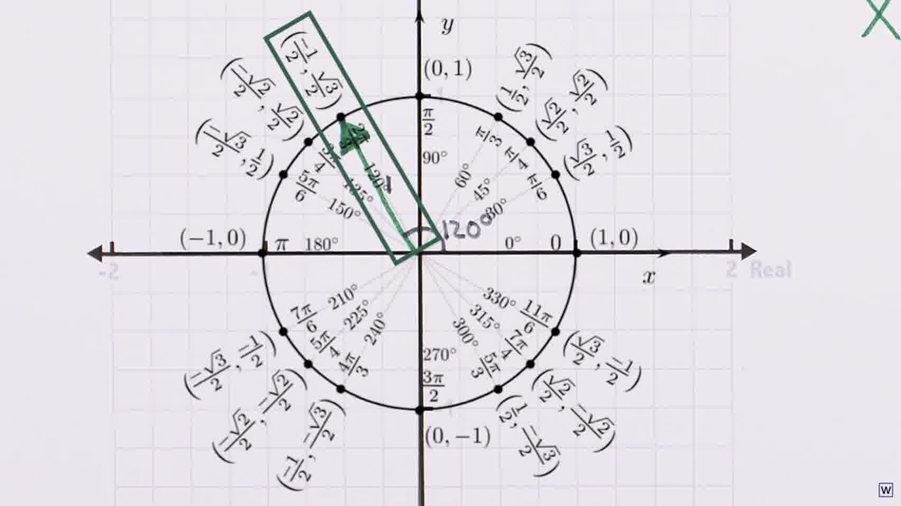

这一步把复数的意义进一步推进了：复平面不仅补上了缺失的解，而且让根的结构变得有几何秩序。

## 8. 闭包：复数是代数运算的稳定空间

一个数集对某个操作“闭合”，意思是：你在这个数集里面任取两个数做这个操作，结果仍然留在这个数集里。

自然数对加法闭合，因为

$$
2+3=5
$$

仍然是自然数。

但自然数对减法不闭合，因为

$$
2-3=-1
$$

不在自然数里。

于是我们扩展到整数。

整数对除法不闭合，因为

$$
1/2
$$

不在整数里。

于是我们扩展到有理数。

有理数对开方不闭合，因为

$$
\sqrt{2}
$$

不是有理数。

于是我们扩展到实数。

实数对多项式求根不闭合，因为

$$
x^2+1=0
$$

没有实根。

于是我们扩展到复数。

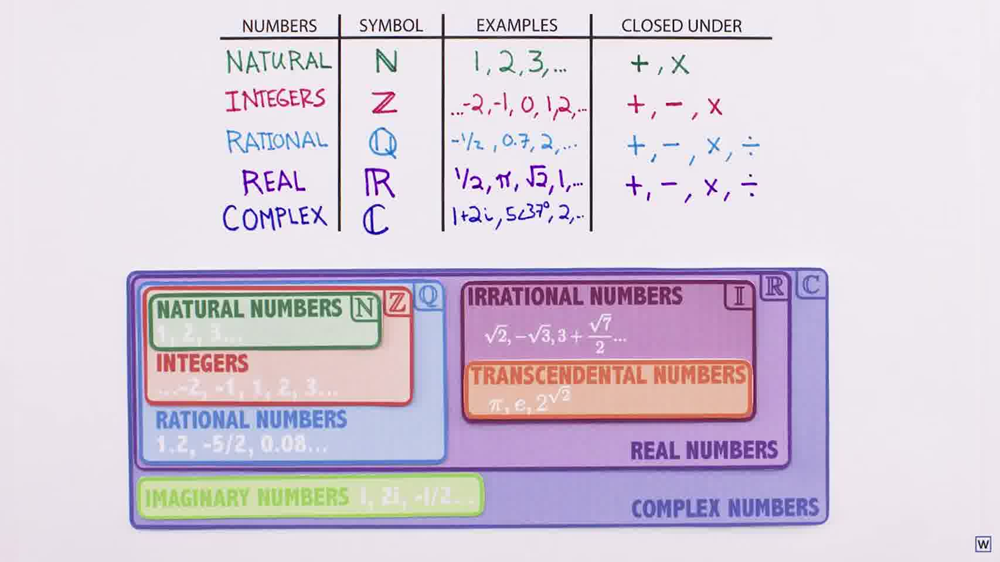

这条线非常重要：复数不是数学家的装饰品，而是数系扩展链条中的自然终点之一。至少在多项式代数意义上，复数域是闭合的。

## 9. 复函数：输入是二维，输出也是二维

实函数通常是：

$$
f:\mathbb R\to\mathbb R.
$$

输入一维，输出一维，所以可以画在二维平面上。

复函数则是：

$$
f:\mathbb C\to\mathbb C.
$$

输入本身是二维，输出也是二维。如果硬要完全画出来，它需要四维空间。

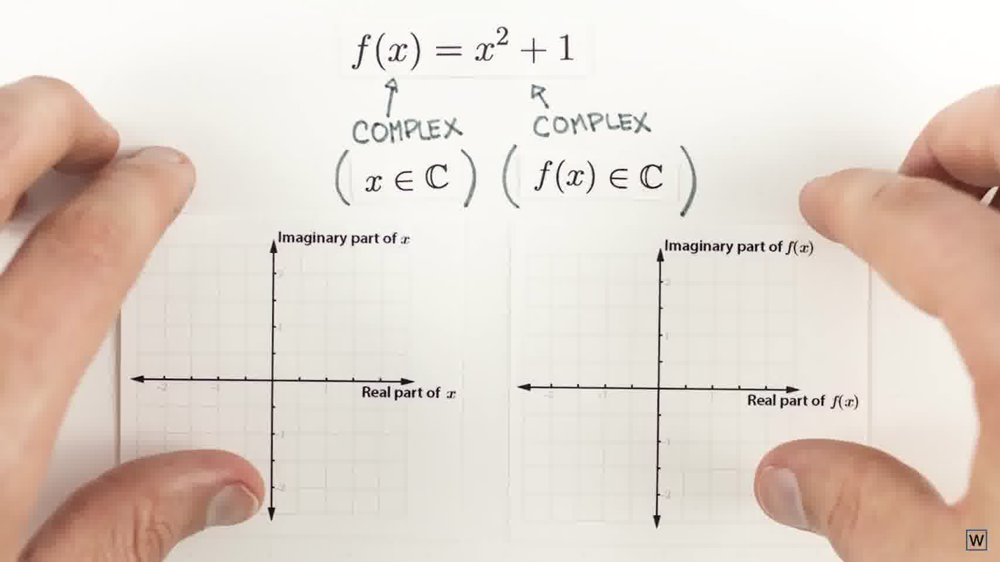

所以更可读的方式是：用一个复平面表示输入，用另一个复平面表示输出，看函数如何把输入平面上的点、线、区域映射到输出平面上。

例如：

$$
f(z)=z^2.
$$

如果

$$
z=re^{i\theta},
$$

那么

$$
z^2=r^2e^{i2\theta}.
$$

这说明 $z^2$ 做了两件事：

$$
r\mapsto r^2,
$$

$$
\theta\mapsto 2\theta.
$$

也就是距离平方，角度翻倍。

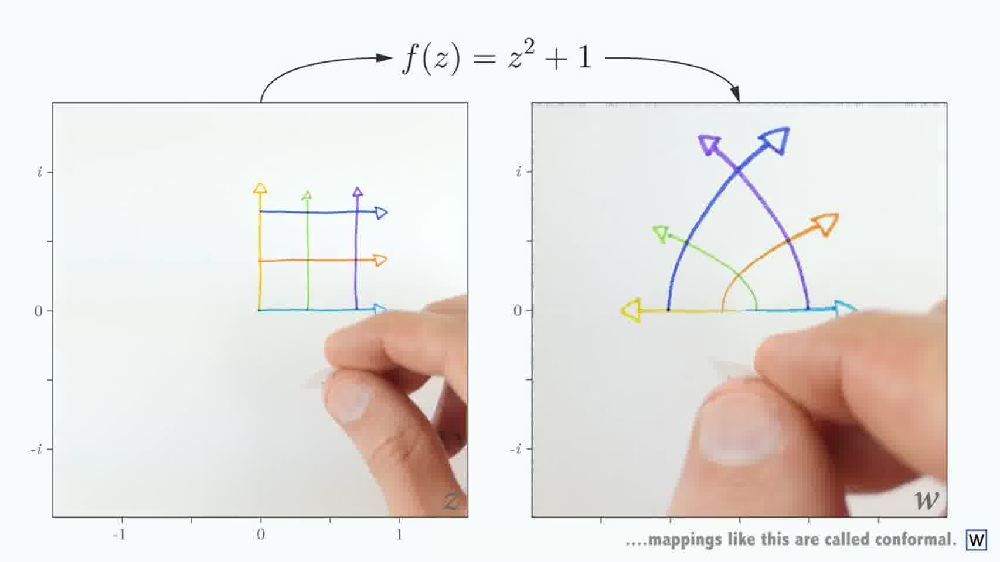

这和物理里的相位语言直接相通。很多时候一个算子对某个 Fourier mode 的作用，本质上就是改变它的幅度和相位。

## 10. 为什么会出现多值：平方函数把两个输入压到同一个输出

看函数

$$
w=z^2.
$$

如果

$$
z=re^{i\theta},
$$

那么

$$
w=r^2e^{i2\theta}.
$$

因为角度翻倍，两个相差 $\pi$ 的输入会被映射到同一个输出：

$$
re^{i\theta}
$$

和

$$
re^{i(\theta+\pi)}
$$

平方以后角度分别是

$$
2\theta
$$

和

$$
2\theta+2\pi,
$$

它们在复平面上是同一个方向。

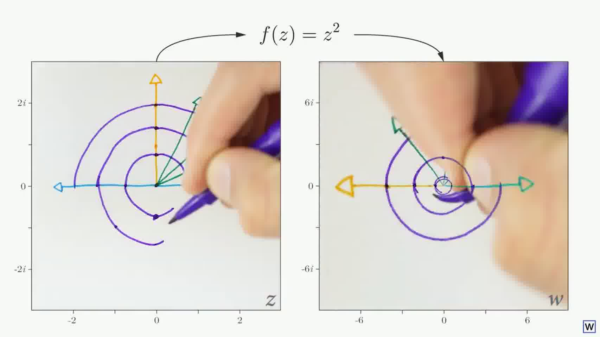

因此反函数

$$
z=\sqrt{w}
$$

天然有两个值。它不是普通意义上的单值函数。

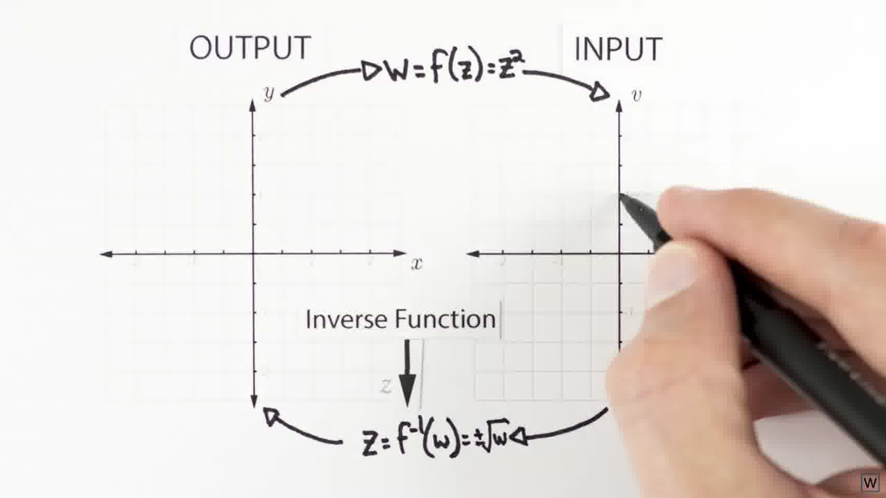

这就是复分析里 branch、branch cut、Riemann surface 会出现的原因。它们不是人为制造复杂性，而是在处理“一个输出对应多个输入”的几何事实。

## 11. Riemann 的解决方式：不要强行把多值函数压成单张平面

对于

$$
z=\sqrt{w},
$$

每个非零 $w$ 都对应两个 $z$。如果只用一张 $w$ 平面来承载函数，就必须在某条线上切开，强行选择一个 branch。

Riemann 的思路是：既然一张平面装不下这个函数的连续结构，那就用多张平面，把它们沿切口粘起来。

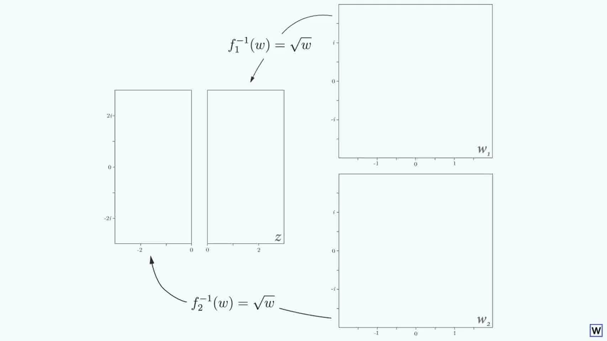

这样得到的对象就是 Riemann surface。它把原来看起来“不连续”或“多值”的函数，重新放到一个更合适的几何空间中。

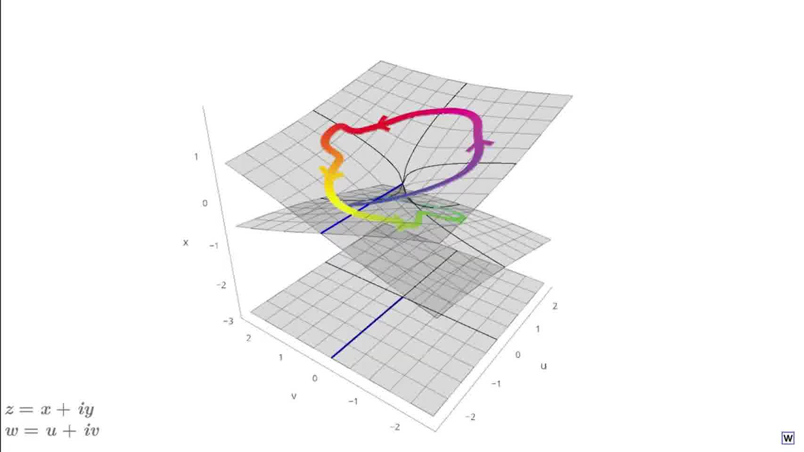

从学习角度看，这里有一个和前面完全一致的逻辑：当旧空间无法表达对象的真实结构时，不要只修补公式，而要扩展空间。

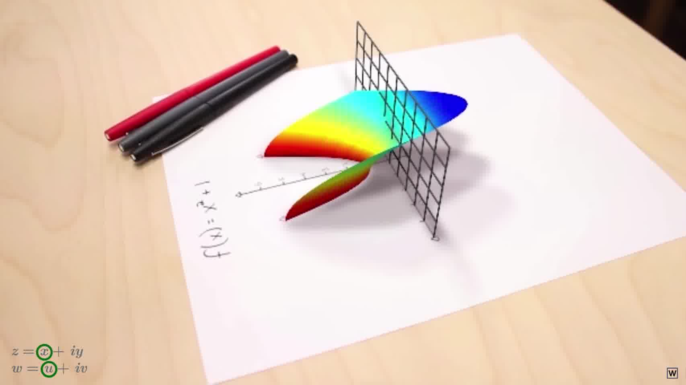

这和前面从实数轴扩展到复平面是同一个思路。复数让代数闭合，Riemann surface 则让某些多值复函数在更高层的几何空间里变得连续和单值。

## 12. 和傅立叶分析的连接：复数真正编码的是相位

现在把视频里的复数线索转到傅立叶分析。

傅立叶分析的基本想法是：复杂函数可以分解成许多不同频率的振荡模式。

在实数语言中，我们会写：

$$
\cos(kx),\qquad \sin(kx).
$$

在复数语言中，可以统一写成：

$$
e^{ikx}.
$$

根据 Euler 公式：

$$
e^{ikx}=\cos(kx)+i\sin(kx).
$$

这意味着一个 complex exponential 同时携带两个互相垂直的振荡分量。它不是“虚假的振荡”，而是把相位旋转完整地保留下来。

一个典型 Fourier series 写成：

$$
f(x)=\sum_{k=-\infty}^{\infty}\hat f_k e^{ikx}.
$$

其中 $\hat f_k$ 是第 $k$ 个频率模式的复系数。它同时编码两件事：

$$
|\hat f_k|
$$

表示这个频率的强度；

$$
\arg(\hat f_k)
$$

表示这个频率的相位偏移。

所以复数系数不是多余的。它正是 Fourier mode 的 amplitude 和 phase 的压缩表示。

## 13. 为什么物理方程喜欢复指数：求导会变成乘法

复指数还有一个更强的优势。对

$$
e^{ikx}
$$

求导：

$$
\frac{d}{dx}e^{ikx}=ik e^{ikx}.
$$

二阶导数是：

$$
\frac{d^2}{dx^2}e^{ikx}=-k^2 e^{ikx}.
$$

这意味着微分算子作用在 Fourier mode 上时，不会把 mode 变成别的形状，而只是乘上一个系数。

例如在一维中：

$$
\partial_x \longleftrightarrow ik,
$$

$$
\partial_{xx} \longleftrightarrow -k^2.
$$

在高维中，如果

$$
e^{i k\cdot x}
$$

是一个 Fourier mode，那么

$$
\nabla e^{ik\cdot x}=ik e^{ik\cdot x},
$$

$$
\Delta e^{ik\cdot x}=-|k|^2 e^{ik\cdot x}.
$$

这就是为什么很多 PDE、扩散方程、波动方程、Schrödinger 方程、Fokker-Planck 方程的分析会进入 Fourier space。空间微分在原空间里是局部变化，在频域里变成对每个频率模式的代数乘法。

这和 Welch Labs 系列里的复乘法逻辑是一致的：复数乘法天然改变幅度和相位，而微分算子对复指数的作用也可以被理解成对幅度和相位的系统性变换。

## 14. 为什么真实物理量也可以用复数计算

很多物理量最后必须是实数，例如位移、温度、密度、压力。但中间使用复数并不矛盾。

典型写法是：

$$
u(x,t)=\operatorname{Re}\left(Ae^{i(kx-\omega t)}\right).
$$

这里

$$
Ae^{i(kx-\omega t)}
$$

是复表示；

$$
\operatorname{Re}(\cdot)
$$

取出真实可观测部分。

这样写的好处是：

第一，$A$ 可以是复数，包含振幅和初始相位。

第二，$kx-\omega t$ 是相位，表示空间和时间中的传播。

第三，求导、叠加、传播都更容易处理。

如果最终信号 $f(x)$ 是实值的，那么 Fourier 系数满足共轭对称：

$$
\hat f_{-k}=\overline{\hat f_k}.
$$

这保证正频率和负频率合起来以后，虚部会抵消，最后回到实函数。

这和 Bombelli 那条线有相同结构：中间允许复数，最终可以回到实数。复数不是伪造结果，而是让计算路径变得闭合、稳定、可解释。

## 15. 对你后面读物理和生成模型文献的实用理解

这套复数教程可以提炼成四个你后面会反复用到的判断。

第一，复数是二维数，不是“实数加装饰”。看到 $a+bi$ 时，应该立刻想到平面点、向量、模长和角度。

第二，复乘法是缩放加旋转。看到 $e^{i\theta}$ 时，应该立刻想到单位圆上的相位旋转。

第三，Fourier mode 是复平面里的旋转模式。看到 $e^{ikx}$ 或 $e^{i\omega t}$ 时，不要把它看成抽象符号，而要看成一个随空间或时间推进的相位。

第四，很多实值物理问题会用复数中间表示。真正重要的是最后如何取实部、如何保持共轭对称、如何解释幅度和相位。

## 16. 最小公式表

复数：

$$
z=a+bi,\qquad i^2=-1.
$$

实部和虚部：

$$
\operatorname{Re}(z)=a,\qquad \operatorname{Im}(z)=b.
$$

共轭：

$$
\overline{z}=a-bi.
$$

模长：

$$
|z|=\sqrt{a^2+b^2}.
$$

极坐标：

$$
z=r(\cos\theta+i\sin\theta)=re^{i\theta}.
$$

复乘法：

$$
z_1z_2=r_1r_2e^{i(\theta_1+\theta_2)}.
$$

Euler 公式：

$$
e^{i\theta}=\cos\theta+i\sin\theta.
$$

单位根：

$$
z_k=e^{2\pi i k/n},\qquad k=0,\ldots,n-1.
$$

Fourier mode：

$$
e^{ikx}.
$$

求导：

$$
\frac{d}{dx}e^{ikx}=ik e^{ikx}.
$$

Laplacian：

$$
\Delta e^{ik\cdot x}=-|k|^2 e^{ik\cdot x}.
$$

实值信号的共轭对称：

$$
\hat f_{-k}=\overline{\hat f_k}.
$$

## 17. 建议的学习顺序

第一遍先掌握直觉：复数是二维数，$i$ 是垂直方向，乘以 $i$ 是旋转 $90^\circ$。

第二遍再掌握运算：复数加法是分量相加，复数乘法是模长相乘、角度相加。

第三遍进入 Fourier：把 $e^{i\theta}$ 看成旋转，把 $\sin$ 和 $\cos$ 看成旋转的投影。

第四遍进入物理方程：理解为什么微分算子在 Fourier mode 上会变成乘法。

第五遍再回到复杂几何：理解为什么复函数会需要 branch、branch cut 和 Riemann surface。

这样读完以后，复数就不再是一个孤立数学主题，而会变成你阅读傅立叶分析、PDE、波动、谱方法和物理生成模型时的基础语言。
