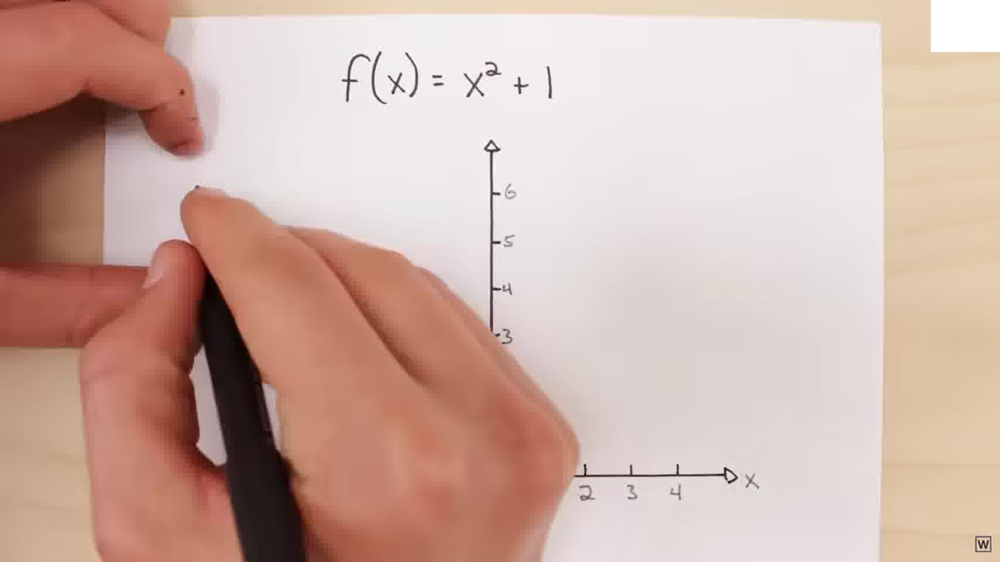
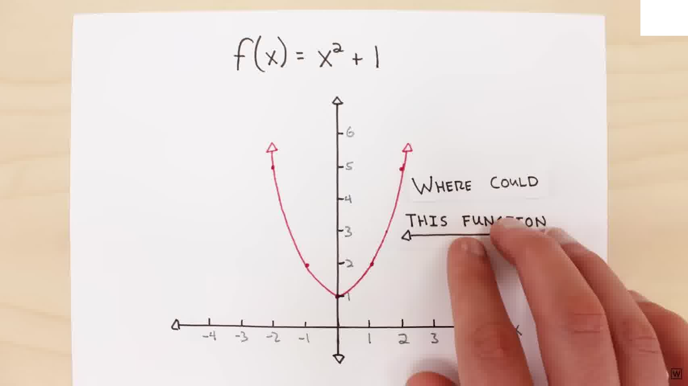
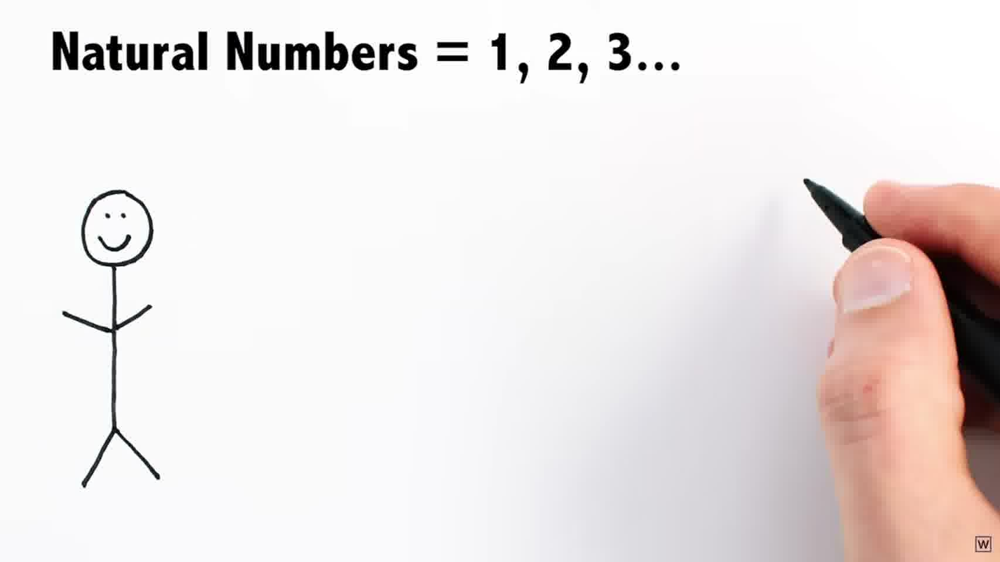
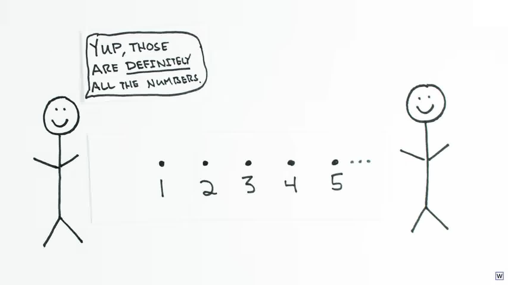
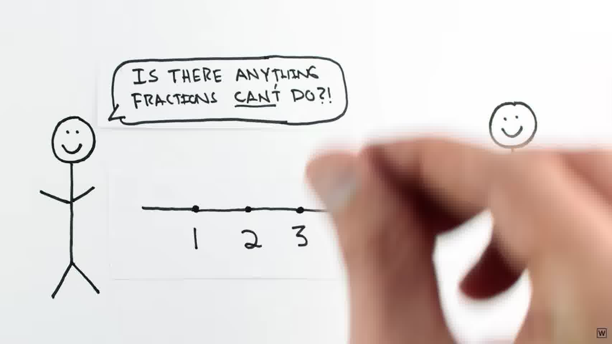
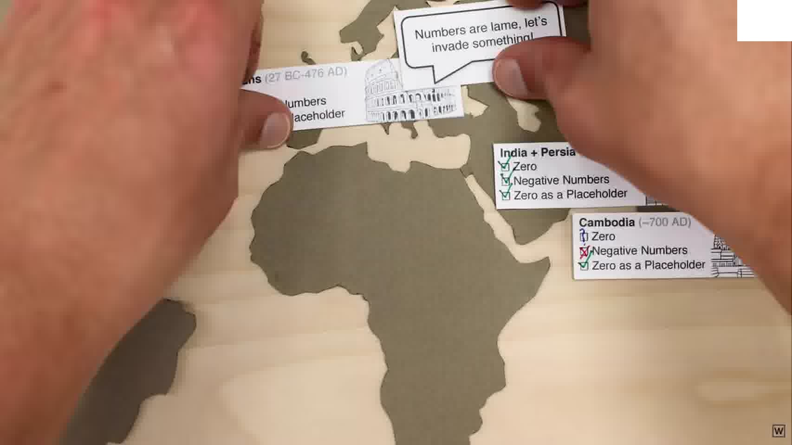
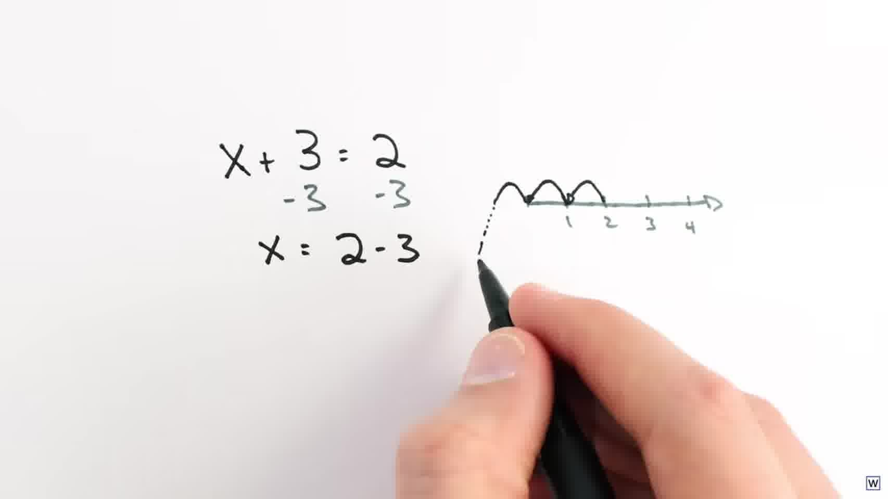
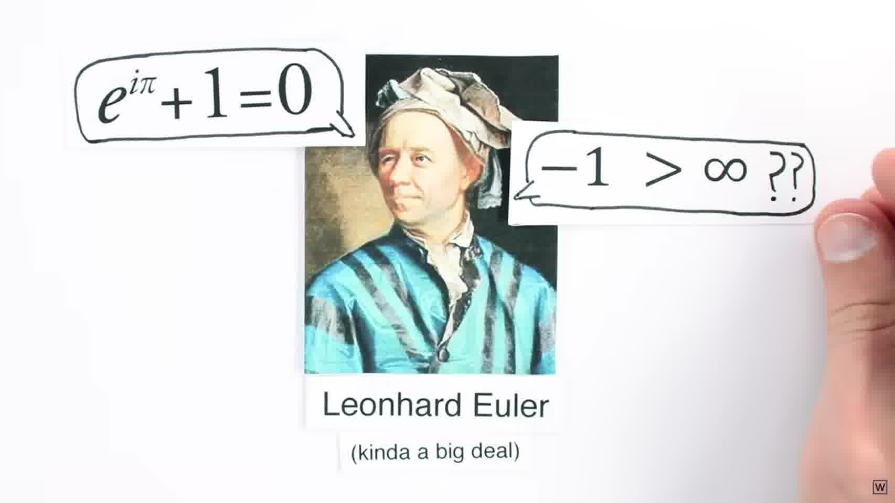

# Welch Labs: Imaginary Numbers Are Real, Part 1

- Video: [Imaginary Numbers Are Real [Part 1: Introduction]](https://www.youtube.com/watch?v=T647CGsuOVU)
- Channel: Welch Labs
- Local transcript: `youtube/transcripts/T647CGsuOVU-imaginary-numbers-are-real-part-1-introduction/transcript.md`
- Curated frames: `youtube/slides/T647CGsuOVU-imaginary-numbers-are-real-part-1-introduction/curated/`

## 1. 从一个“没有解”的方程开始

视频的开场不是直接定义 imaginary number，而是先制造一个冲突。我们从一个很普通的函数开始：

\[
f(x)=x^2+1.
\]

如果只在通常的一维实数轴上画图，它是一条整体位于 \(x\)-轴上方的抛物线。于是，当我们问

\[
x^2+1=0
\]

有没有解时，图像给出的直觉答案是：没有。因为这条抛物线从来没有和 \(x\)-轴相交。

但这里马上出现第二层冲突。代数告诉我们，一个二次多项式应该有两个根；更一般地，代数基本定理说，一个 \(n\) 次多项式应该有 \(n\) 个根。也就是说，图像直觉说“没有解”，代数结构却说“应该有两个解”。

这就是整个系列的入口：问题不一定是方程没有解，也可能是我们允许使用的数不够多。

## 2. 缺的不是更远的数，而是新的方向

如果我们只把数想成一条直线，那么寻找新数时，很自然会沿着这条线往左或往右找。负数在左边，正数在右边，分数和无理数填在中间。

可是 \(x^2+1=0\) 的两个根不在这条线上。视频用一个很重要的说法来重新组织直觉：missing roots are not further left or right; they live in a whole new dimension。

也就是说，imaginary numbers 不是实数轴上某个还没标出来的位置，而是要求我们把“数”从一维直线扩展成二维平面。这样一来，原来在实数轴上看不到交点的方程，放到更完整的二维数系里就会重新变得可解。

这一段的核心不是技术推导，而是视角转换：所谓 imaginary，不是“不真实”，而是实数轴这个坐标系太窄。

## 3. “imaginary”这个名字本身会误导理解

视频接着指出，imaginary number 难以被普通学习者接受，一个原因是名字本身非常糟糕。它听起来像是在说这些数“不真实”，但数学上真正发生的是：数系被扩展到另一个方向。

Gauss 曾经建议用 lateral 来称呼这一类数。这个名字更贴近几何直觉：它们不是沿着原来的数轴继续前进，而是侧向展开出来的一条新轴。

所以在这个视频的叙事里，imaginary number 的关键不是“虚构”，而是“侧向维度”。这为后面理解 complex plane 做铺垫。

## 4. 数系扩展并不是 imaginary number 才发生的怪事

为了降低 imaginary number 的陌生感，视频没有马上进入复平面，而是回到数本身的历史。

早期人类最自然接受的是自然数：

\[
1,2,3,\ldots
\]

这些数非常适合计数，所以它们看起来和现实世界直接对应。

但随着问题变复杂，自然数很快不够用了。土地分割、播种时间、金融记录都要求人们表达“整体的一部分”。于是分数进入数系，填补自然数之间的空隙。

这一步很重要，因为它把 imaginary numbers 放回一个更长的历史模式里：数学不是一开始就拥有完整数系，而是每当旧数系无法回答新问题时，就被迫扩展。

## 5. 负数曾经也像 imaginary number 一样可疑

视频随后把重点转到零和负数。今天我们觉得负数很自然，但历史上它们也曾经被怀疑和回避。原因并不难理解：如果数学必须直接对应可见物体，那么“负三个苹果”确实不如“三个苹果”直观。

这说明，数学对象被接受，并不只取决于它是否立刻对应日常经验。它还取决于它是否能让代数结构保持完整、让问题继续可解。

视频用一个简单例子说明负数为什么最终无法回避：

\[
x+3=2.
\]

如果不允许负数，这个方程就没有解；如果允许负数，它的解就是

\[
x=-1.
\]

这和开头的 \(x^2+1=0\) 是同一种结构：旧数系说“无解”，扩展数系以后，解重新出现。

## 6. Part 1 建立的核心判断

Part 1 最后没有急着解释复数怎么计算，而是把问题留给后续几集。它真正完成的是一个认知框架：

一开始，\(x^2+1=0\) 在实数轴上看起来无解。

接着，代数基本定理提示我们，问题可能不是方程坏了，而是当前数系不够完整。

然后，视频把 imaginary number 解释成数系的侧向扩展，而不是“不真实的数”。

最后，它用自然数、分数、零和负数的历史说明：数系扩展本来就是数学发展的常规机制。imaginary number 只是这条历史线上的下一步。

所以这集的核心不是“定义 \(i=\sqrt{-1}\)”这么简单，而是先改变读者对“数”的理解：

\[
\text{number system} \neq \text{already fixed line};
\]

它更像是一个会随着问题结构而扩展的表达空间。

