# Yann LeCun's \$1B Bet Against LLMs：从生成式预测到 JEPA 世界模型

- Video: [Yann LeCun's \$1B Bet Against LLMs](https://www.youtube.com/watch?v=kYkIdXwW2AE)
- Channel: Welch Labs
- Duration: 37:24
- Transcript: `youtube/transcripts/kYkIdXwW2AE-yann-lecun-1b-bet-against-llms/`
- Slides: `youtube/slides/kYkIdXwW2AE-yann-lecuns-1b-bet-against-llms/`

这期视频的中心问题不是“LeCun 是否看空 LLM”，而是：如果目标是构造能够理解世界、预测行动后果、并进行规划的 agent，那么 next-token generation 这种训练目标是否足够。视频给出的线性答案是：LLM 在语言空间里非常强，因为语言本身可以承载很多推理结构；但对于视觉、视频、机器人控制和现实世界行动，模型不能只学会生成下一个符号，而需要学到一个可预测、可规划的抽象世界状态。JEPA 就是围绕这个目标提出的另一条路线。

## 1. 00:00-01:18：问题从“LLM 生成什么”转向“模型内部表示什么”

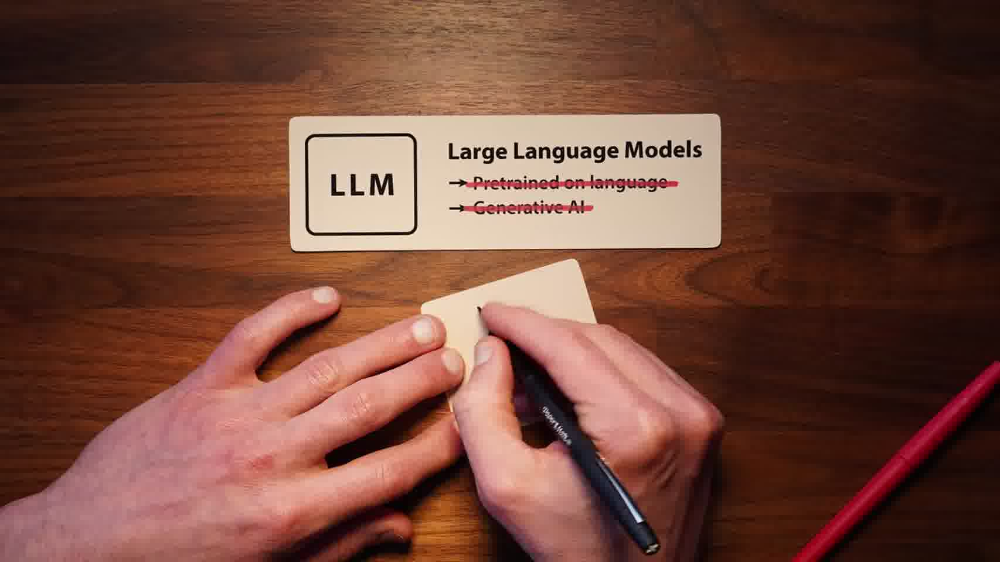

开头先把 LeCun 的主张放在一个非常尖锐的位置：他正在推进一条与主流 LLM 不同的 AI 路线。这条路线不是以语言为根，也不是以生成文本、图像、视频为直接目标。也就是说，视频一开始就要求读者把“智能模型”与“会生成东西的模型”分开看。

传统监督学习或生成式学习通常可以写成一条直接映射：给定输入 $X$，预测输出 $Y$。图像分类是从图像 $X$ 到标签 $Y$；语言模型是从上下文 $X$ 到下一个 token $Y$；图像或视频生成模型则是从条件 $X$ 到像素级输出 $Y$。这条路线的共同点是：训练目标直接落在可观察输出上。

JEPA 的第一步变化，是不再让模型直接预测 $Y$ 本身。它先把 $X$ 送进一个 encoder，得到 $X$ 的 embedding；再把 $Y$ 送进另一个 encoder，得到 $Y$ 的 embedding；最后训练一个 predictor，用 $X$ 的 embedding 去预测 $Y$ 的 embedding。于是学习对象从

$$
X \rightarrow Y
$$

变成

$$
\mathrm{Enc}(X) \rightarrow \mathrm{Enc}(Y).
$$

这一步看起来只是把输入输出都包了一层 encoder，但它改变了问题的性质。模型不再被迫复原所有表面细节，而是学习两个观测之间在抽象表示空间里的关系。后面整期视频都在解释：为什么这个差别对视觉、视频和行动规划非常关键。

## 2. 01:19-04:57：历史背景不是“反 LLM”，而是“自监督学习曾经走出两条路”

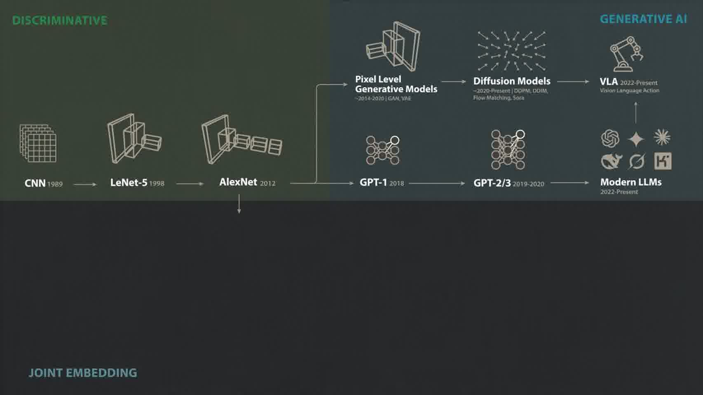

视频接着回到 LeCun 自己的研究脉络。CNN、LeNet 和后来的 AlexNet 说明，深度学习的早期突破很大程度上依赖监督学习：你有大量标注图像，然后训练网络从图像到标签。问题也随之出现：如果每一个任务都需要巨大、精细、昂贵的标注数据，那么这种智能路线很难扩展到现实世界中大量没有人工标签的经验。

LeCun 很早就强调过自监督学习的重要性。这里的核心判断是：动物和人类不是靠海量人工标签学习世界的，而是在与环境接触中，从未标注数据里学到结构。后来 LLM 的成功部分验证了这个判断。GPT 系列并不是先靠人工给每个句子标注“正确答案”，而是用 next-token prediction 从海量文本中学习语言结构，再通过监督微调和 RLHF 变成可用的聊天系统。

所以视频并没有把 LeCun 和 LLM 简单对立起来。更准确的线性关系是：LeCun 支持“自监督学习是核心”；LLM 证明了自监督在语言里可以大规模成功；但 LeCun 认为，next-token prediction 只是自监督学习的一种特殊实现，它在语言中有效，不代表它就是通向通用智能的最终形式。

## 3. 04:57-13:38：生成式路线在视频预测中遇到的不是小缺陷，而是目标错配

视频随后进入第一个关键转折：为什么生成式自监督在语言中成功，但在视觉和视频中困难得多。

语言模型的输出空间虽然很大，但仍然是离散 token 空间。比如 GPT-2 的词表有固定数量的 token，模型可以为每个候选 token 分配概率。如果一句话是 “the ball bounced to the ...”，训练集中既可能出现 left，也可能出现 right。语言模型可以把 left 和 right 都作为可区分的候选结果，并分别更新它们的概率。

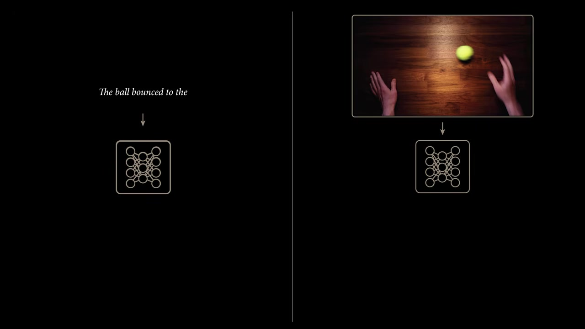

视频预测不一样。如果模型要直接预测下一帧像素，它面对的是连续、高维、组合爆炸的图像空间。一个高清帧包含大量像素，每个像素还有多个颜色通道。模型不可能像枚举 token 那样枚举所有可能下一帧。于是很多早期视频预测模型会直接输出像素强度值。

问题就出在这里。假设一个球沿同一轨迹运动，下一刻既可能向左弹，也可能向右弹。对语言模型来说，left 和 right 是两个离散答案；对像素回归模型来说，如果它被迫输出一个单一像素帧，最容易学到的是多个可能未来的平均值。平均之后的结果既不是清楚的左，也不是清楚的右，而是模糊的中间态。随着预测时间拉长，这种模糊还会不断累积。

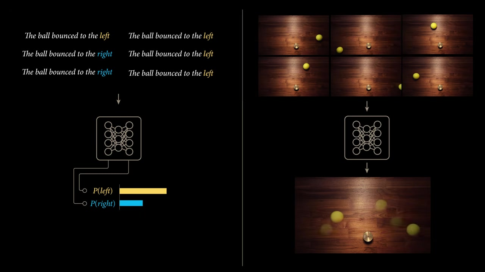

这说明视频里真正重要的不是“生成模型还不够强”，而是训练目标本身可能不适合。现实世界的很多低层细节本来就不可预测，例如树叶的抖动、光照的微小变化、背景纹理的随机扰动。如果模型被要求复原所有像素，它就会把大量能力浪费在不可预测的细节上；而一个智能 agent 真正需要的是可行动、可预测、可用于规划的结构。

## 4. 13:38-15:15：问题变成“模型是否必须是 generative”

这一段把前面的失败经验抽象成一个更清楚的问题：模型真的必须生成可见输出吗？

在 LLM 的例子里，next-token prediction 的表面任务是生成下一个 token，但这个任务真正有价值的结果，是模型内部学到了语法、语义、事实、推理模式和上下文结构。也就是说，生成任务只是一个训练代理目标；我们最终想要的是内部 representation。

一旦这样看，视觉和视频就不必执着于“生成下一帧”。如果直接生成像素会迫使模型处理太多不可预测细节，那么可以换一个目标：让模型学习不同视角、不同遮挡、不同变换下仍然稳定的内部表示。这里就从 generative self-supervised learning 转向 joint embedding self-supervised learning。

这一步是整期视频的关键中介：不是从 LLM 直接跳到 JEPA，而是先提出一个更一般的判断。自监督学习不等于生成式学习；生成输出不是目的，学到可迁移、可预测的 representation 才是目的。

## 5. 15:15-18:28：joint embedding 的基本想法：比较表示，而不是复原表面

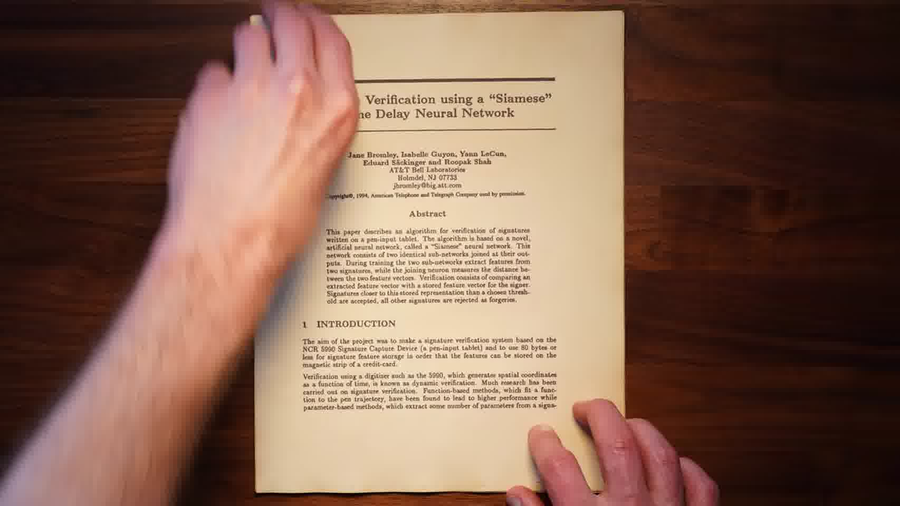

joint embedding 的基本动作很简单：把两个输入分别送进 encoder，得到两个向量，然后让这两个向量在语义上相互对齐。早期例子是 Siamese network。它可以用来做签名验证、人脸验证或图像相似性判断：两个输入看起来不同，但如果它们代表同一个对象或同一个身份，它们的 embedding 应该接近；如果它们代表不同对象，embedding 应该分开。

这和像素生成的区别很大。模型不需要重建原图，也不需要补全所有细节。它只需要在表示空间里保留任务相关结构。例如一张图片被裁剪、遮挡或颜色扰动之后，像素已经变了，但语义对象没有变。joint embedding 训练希望 encoder 学到这种“不随表面扰动变化的结构”。

这条路线对视频尤其有吸引力。因为视频未来帧的低层像素细节很难预测，但未来状态的高层语义通常有可预测部分。一个人站在房间里、机器人手臂靠近杯子、车道沿道路延伸，这些结构比每一片树叶的运动更稳定。joint embedding 让模型优先对齐这些稳定结构，而不是复原所有像素。

## 6. 18:28-22:25：representation collapse 是 joint embedding 必须解决的核心障碍

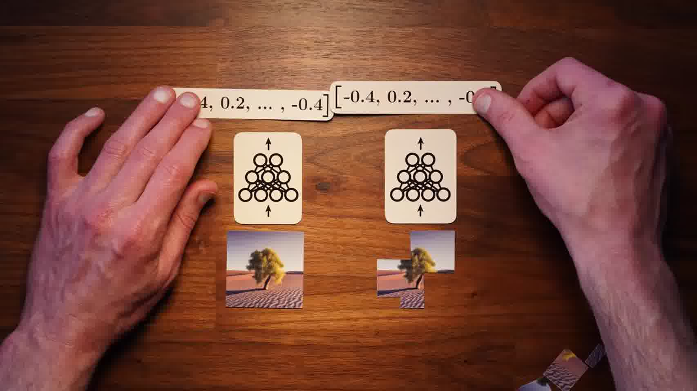

joint embedding 的直观目标是：同一个对象的不同视图应该有相似表示。但这个目标单独使用会产生一个严重漏洞。最简单的“相似表示”方案，是让 encoder 对任何输入都输出同一个向量。这样所有样本的 embedding 都相同，损失函数可能很低，但 representation 完全没有信息。这就是 representation collapse。

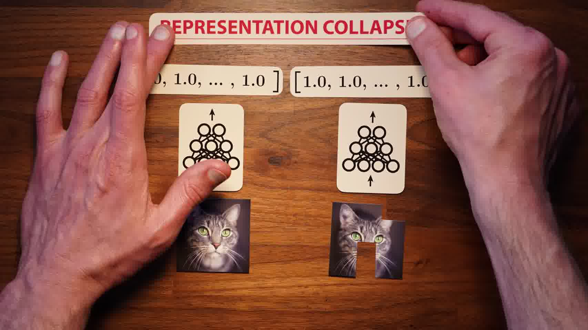

早期常见解决办法是 contrastive learning。它一方面拉近同一对象或同一图像增强视图的 embedding，另一方面把不同对象的 embedding 推开。这样可以防止所有样本塌缩成同一个点。MoCo、SimCLR 等方法都属于这条思路。

但视频强调，contrastive learning 更像是一种有效工程方案，而不是完全令人满意的原则。它依赖负样本，需要在 batch 或 memory bank 中提供足够多“不是同一个对象”的样本。表示维度越高、数据越复杂，负样本构造和比较的成本就越高。于是 joint embedding 路线还需要一种不依赖大量负样本、但又能避免 collapse 的机制。

## 7. 22:25-27:47：Barlow Twins / redundancy reduction：不靠负样本，也能避免塌缩

Barlow Twins 的关键想法，是不要只看“同一图像的两个视图是否相似”，还要看 embedding 的不同维度之间是否冗余。更线性地说，它同时施加两类约束。

第一类约束作用在 cross-correlation matrix 的对角线上。同一张图像经过两种增强后，送入两个 encoder。第 $i$ 个 embedding 维度在两个视图之间应该高度相关。这保证模型没有丢掉同一对象的稳定信息。

第二类约束作用在 cross-correlation matrix 的非对角线上。第 $i$ 个维度和第 $j$ 个维度不应该携带重复信息。也就是说，不同 embedding 维度之间应该尽量去冗余。这样模型就不能把所有维度都变成同一个常数，也不能让所有输入都映射到同一个无信息向量。

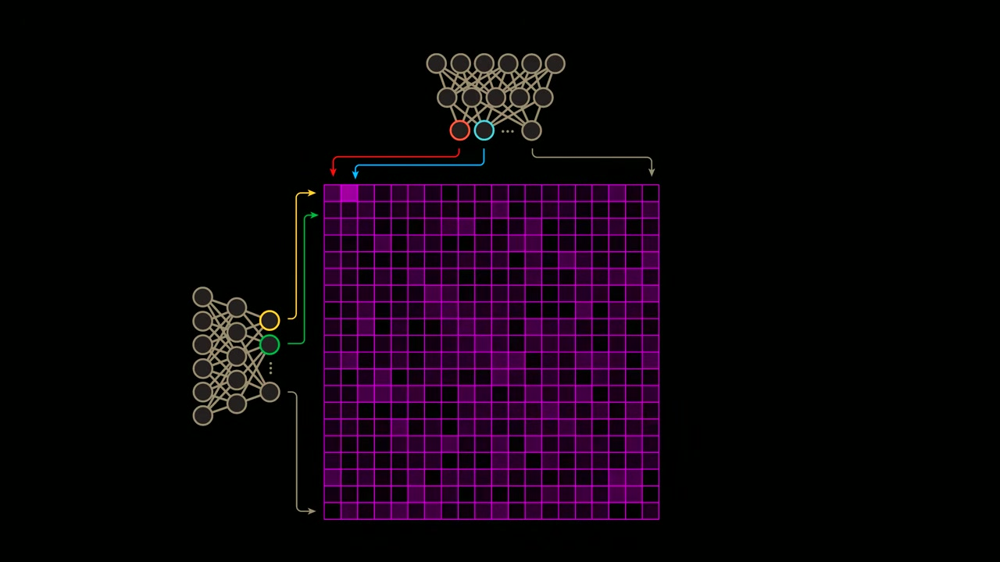

理想情况下，这个 cross-correlation matrix 接近单位矩阵：

$$
C \approx I.
$$

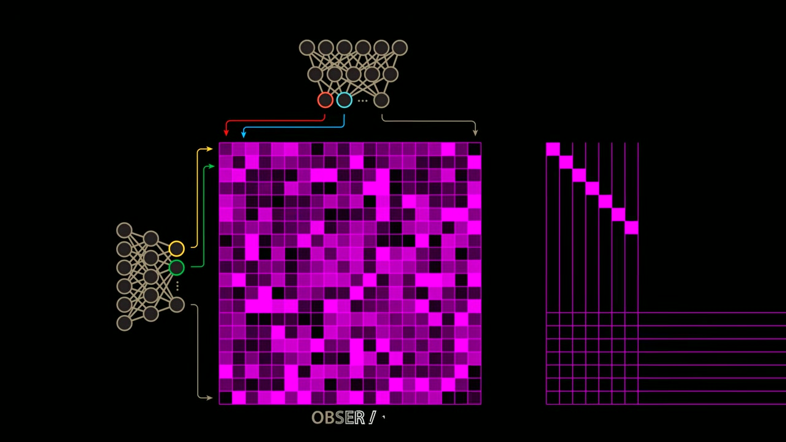

对角线接近 $1$，说明两个视图的对应维度对齐；非对角线接近 $0$，说明不同维度之间减少冗余。这样 joint embedding 不需要显式构造大量负样本，也能把“相似性”和“信息保留”同时写进训练目标。

视频把这一步称为通往 JEPA 的重要前史。因为一旦 joint embedding 能稳定训练，模型就可以不再通过生成像素来学习视觉 representation，而是通过表示空间的预测和对齐来学习结构。

## 8. 24:39-27:47：DINO / ViT 显示，joint embedding 可以学到语义结构

视频随后把 Barlow Twins 放进更大的视觉自监督脉络里。DINO 和 Vision Transformer 的成功说明，非生成式 self-supervised learning 不只是一个理论替代品，它可以在 ImageNet 这类基准上学到很强的视觉表示。

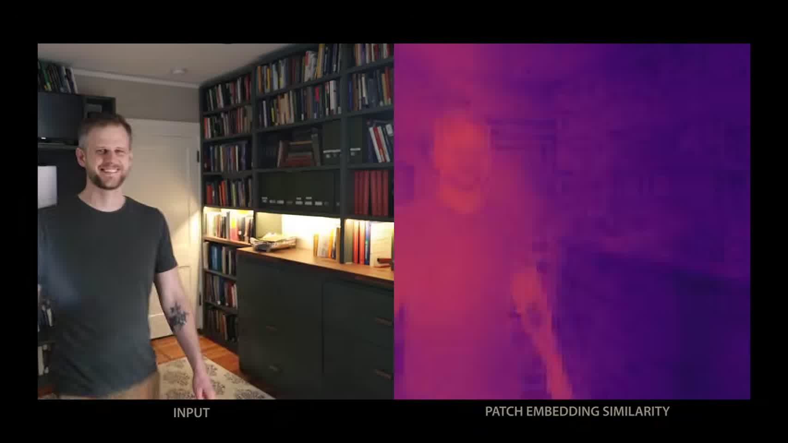

这里最重要的不是某个 benchmark 数字，而是表示本身的性质。DINO 的 patch embedding 可以呈现语义分组：图像中的人、背景、物体边界、区域结构，会在 embedding similarity 中显现出来。模型并没有被要求输出一张新图，也没有被要求精确重建像素；但它仍然学到了图像内部的对象和区域结构。

这一步把前面的论证推进到 JEPA 所需的位置：如果 joint embedding 能学到视觉语义结构，那么下一步就可以不只是“对齐两个视图”，而是“预测未来状态的 embedding”。也就是说，从 static representation learning 走向 world model。

## 9. 27:47-31:46：JEPA 的核心：预测未来 embedding，而不是未来像素

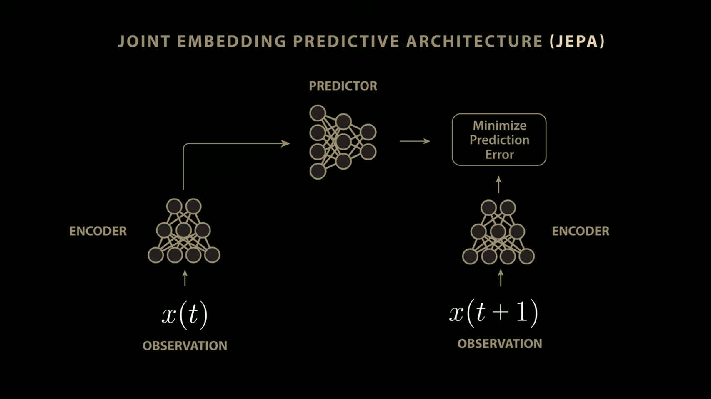

JEPA 的全称是 Joint Embedding Predictive Architecture。它继承 joint embedding 的思想，但把任务从“两个视图对齐”推进到“当前状态预测未来状态”。

具体地说，当前观测 $x(t)$ 进入 encoder，得到当前状态的 embedding；未来观测 $x(t+1)$ 进入另一个 encoder，得到未来状态的 embedding；predictor 接收当前 embedding，并输出对未来 embedding 的预测。训练目标不是让模型生成 $x(t+1)$ 的像素，而是最小化预测 embedding 和真实未来 embedding 之间的误差。

这就是它和视频生成模型的根本差异。视频生成模型问的是：下一帧每一个像素应该是什么？JEPA 问的是：未来状态在抽象表示空间里应该移动到哪里？前者会被不可预测的低层细节拖住；后者可以忽略很多无关细节，只保留对行动、语义和规划有用的可预测结构。

从这个角度看，JEPA 是一种 world model。world model 的任务不是复制世界表面，而是学习世界状态怎样随时间变化。如果模型能预测“当前状态经过某种变化后会到达什么抽象状态”，它就开始具备规划所需的动力学结构。

## 10. 31:46-34:07：加上 action 以后，JEPA 从表示学习进入控制和规划

视频最后把 JEPA 推到机器人控制场景。仅仅预测 $x(t+1)$ 的 embedding 还不够，因为 agent 真正需要的是：如果我采取某个动作，世界会怎样变化。

因此在 V-JEPA2 的机器人例子里，predictor 不只接收当前视觉状态的 embedding，还接收机器人控制信号。训练目标变成：给定当前图像序列和 action，预测下一帧的 embedding。这样模型学到的不是被动的视频统计规律，而是 action-conditioned dynamics。

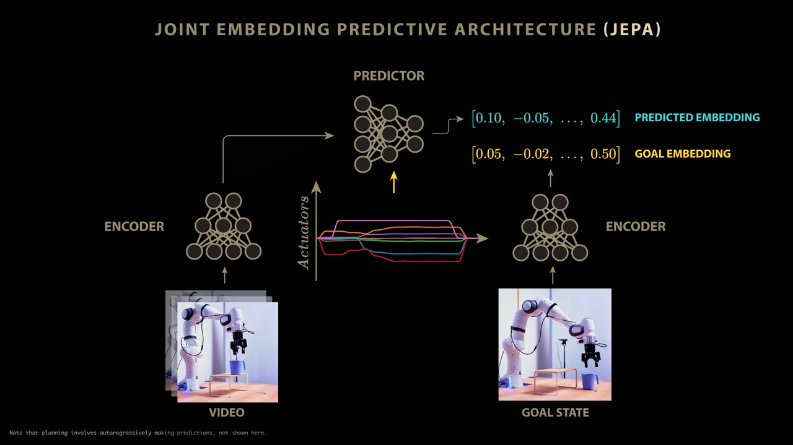

这个结构可以用于规划。给定一个目标图像，例如希望机器人把杯子从平台上移开，先把目标图像编码成 goal embedding。然后控制算法在 world model 里尝试不同动作序列，比较预测出来的未来 embedding 是否接近 goal embedding。最优动作序列就是能让预测状态靠近目标状态的那一组动作。

LeCun 在访谈里强调，这个思想和经典最优控制很接近：你需要一个模型，告诉你状态 $t$ 加上动作以后，状态 $t+1$ 会怎样变化；然后你才能搜索或优化一串动作。新东西不在“规划”这个概念本身，而在于状态表示和动力学模型都是学出来的，而且是在抽象 latent state 里学出来的。

## 11. 35:06-37:24：为什么 LeCun 认为 LLM / VLA 还不够

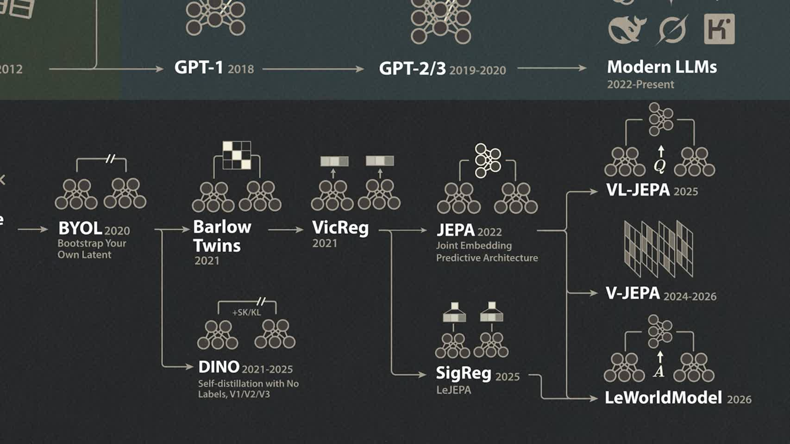

结尾的判断可以线性读成三步。

第一，LLM 擅长语言操作。只要任务主要发生在语言空间里，例如写作、问答、代码、文本推理，LLM 的 next-token training 可以学到非常强的内部表示。

第二，agentic system 需要预测行动后果。一个机器人、自动驾驶系统或现实世界助手，不只是要说出下一句话，而是要在行动前评估不同动作会把世界带到哪里。如果没有这种 consequence prediction，系统只能反应式地产生动作，而不能真正规划。

第三，VLA 虽然把视觉、语言和动作接起来，但如果它只是从 observation-language 到 action 的大映射，就仍然不等于拥有 world model。LeCun 的批评点在这里：可靠的 agent 不应该只是自回归地产生动作，而应该能在内部模拟动作后果，并通过搜索或优化选择行动序列。

所以，“\$1B bet against LLMs” 更准确地说，不是押注聊天机器人消失，而是押注下一代 agentic AI 不能只靠 LLM 式生成训练目标。它需要 abstract state、latent dynamics、action-conditioned prediction 和 planning。

## 12. 和我们已有阅读框架的接口

这期视频和我们之前读的 HJB / HJ-sampler / VI primer 可以接在同一条更大的问题线上：当原始对象太高维、太不可控、太难直接预测时，研究者会尝试换一个更合适的表示空间。

在 HJB 那篇文章里，直接学习高维控制场很重，于是转向学习标量势函数，让控制由势函数梯度导出。这里的降维不是简单减少变量数量，而是把任意向量场限制到更有结构的对象上。

在 VI primer 里，复杂物理逆问题常常不能直接在原始高维参数空间里稳定推断，于是引入变分分布、生成先验、latent variable 或 surrogate，把难算的后验问题改写成可优化问题。

在 LeCun 这条 JEPA 路线里，问题不是后验推断，也不是 HJB 控制势，而是视觉世界模型。但它的结构性动作相似：不要直接预测高维表面输出，而是先学一个抽象 latent state，再在这个 state space 中预测、比较、规划。换句话说，JEPA 不是把世界生成出来，而是把世界压到一个可预测的表示空间里。

对我们当前的 synthetic city / amortized inverse problem 方向来说，这个视角有启发性。我们的条件信息往往是 census summaries、marginals 或 PUMA 级目标，原始 joint distribution 或 individual-level configuration 并不是唯一确定的。如果直接要求模型生成一个“最像真的”微观配置，就可能落入和像素预测类似的问题：表面输出太高维、可行解太多、平均意义下的最优答案未必有解释力。更深一层的问题可能是：能不能学习一个稳定的城市状态表示，让模型在这个表示空间里对齐约束、预测结构、表达不确定性，再从中采样 plausible configurations。

这也是 JEPA 和我们已有路线的共同点：真正关键的不是“模型最后能不能吐出一个样本”，而是它在内部学到的状态空间是否足够结构化，能不能支持约束、推断、规划或不确定性表达。
