# Curated Slides: Self-training Algorithms and Analyses for Unsupervised Domain Adaptation

- Source: SlidesLive `38955373`
- Full slide deck: [`../all/index.md`](../all/index.md)
- Curated frame count: `31`
- Strategy: semantic selection aligned with the talk logic, replacing the earlier evenly spaced sample.

## Frames

-  `slide 001` - Title and workshop context
-  `slide 006` - Remote sensing example: labels are expensive and target regions shift
- 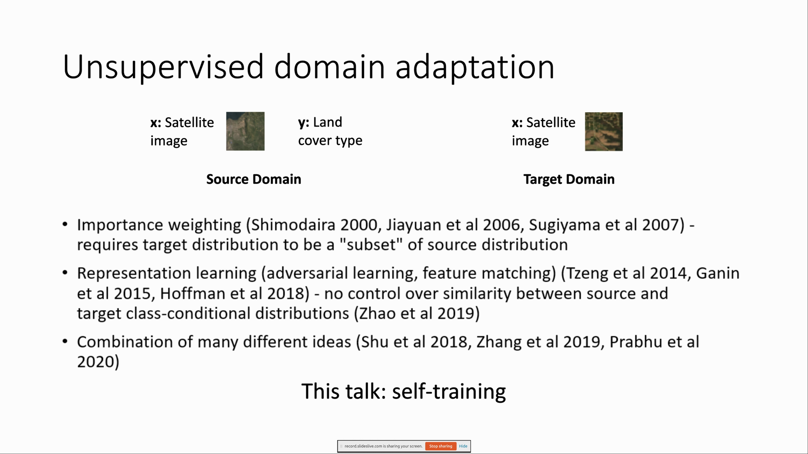 `slide 011` - UDA framing and this talk focuses on self-training
-  `slide 012` - Setting 1: auxiliary information
-  `slide 013` - Setting 2: gradual shifts
-  `slide 014` - Outline connecting auxiliary information and gradual shifts
- 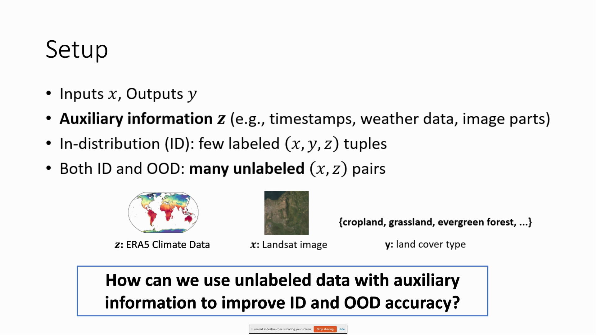 `slide 022` - Setup question: how to use unlabeled data with auxiliary information
-  `slide 023` - Baseline 1: aux-inputs architecture
- 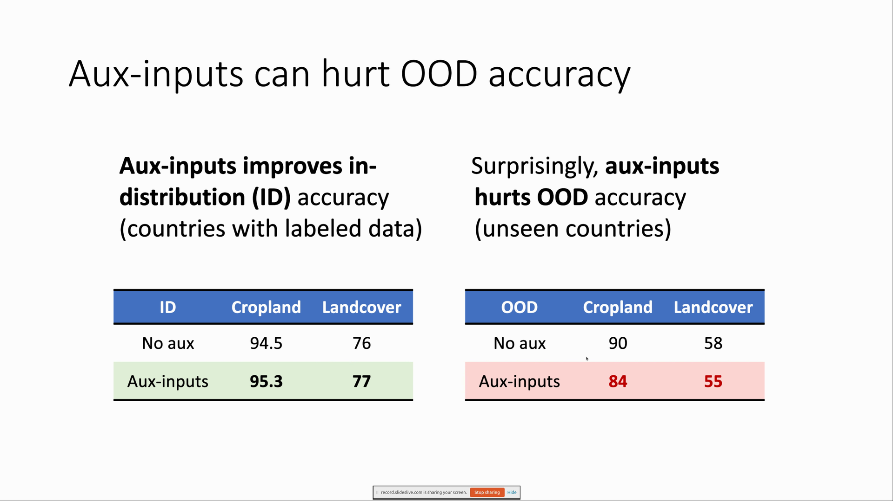 `slide 026` - Aux-inputs improves ID but hurts OOD accuracy
-  `slide 031` - Aux-outputs pretraining then finetuning pipeline
-  `slide 034` - Aux-outputs improves OOD while ID is not as good as aux-inputs
-  `slide 039` - In-N-Out combines aux-inputs pseudo-labels with aux-output initialization
-  `slide 040` - In-N-Out improves accuracy over baselines on ID and OOD
-  `slide 041` - Theory setup: multi-task linear regression graph
- 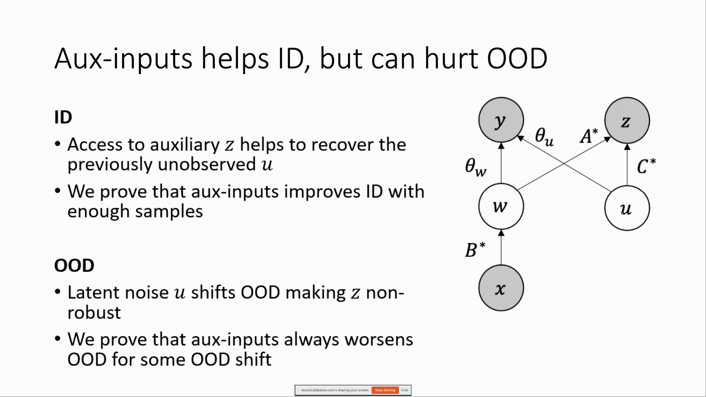 `slide 046` - Why aux-inputs helps ID but can hurt OOD
-  `slide 051` - Why aux-outputs improves OOD robustness
- 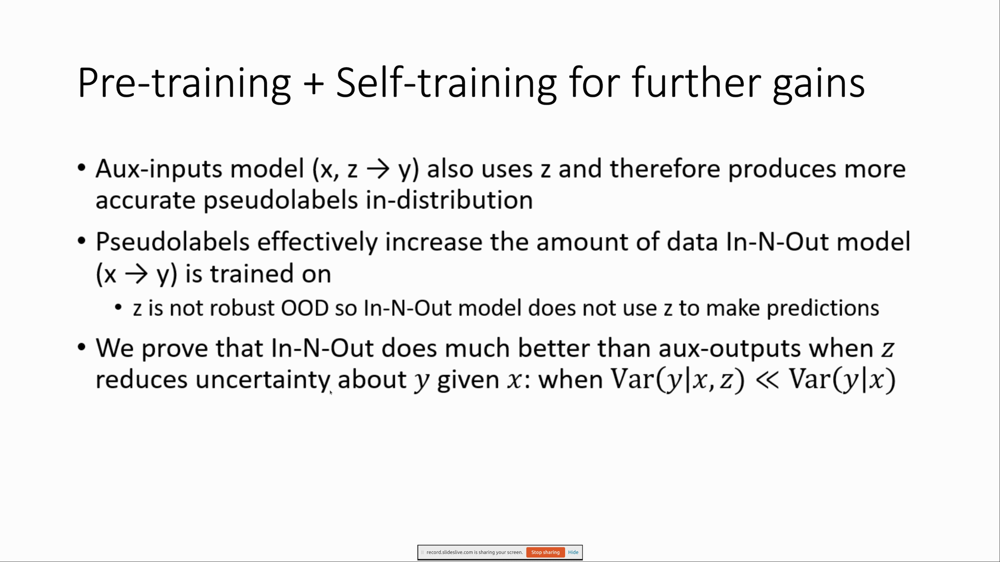 `slide 056` - Pretraining plus self-training for further gains
- 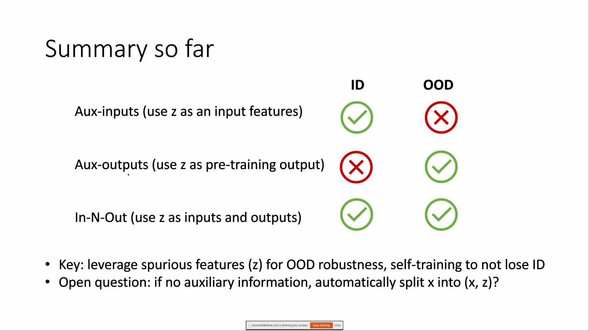 `slide 057` - Summary of aux-inputs, aux-outputs, and In-N-Out
- 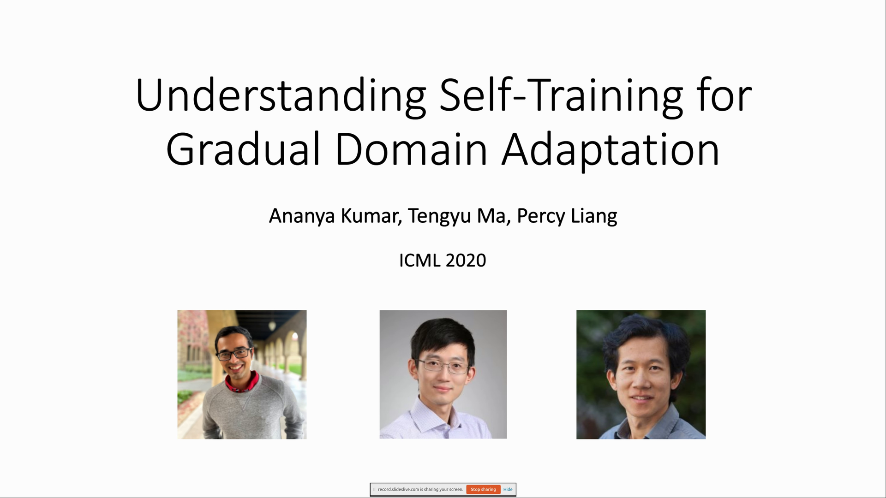 `slide 059` - Understanding self-training for gradual domain adaptation
- 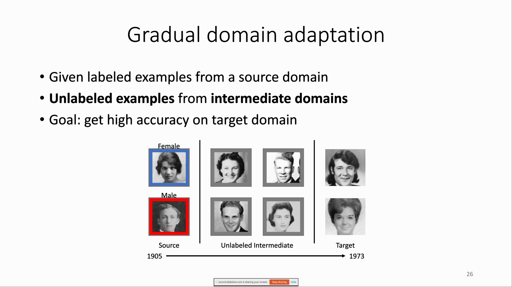 `slide 064` - Gradual domain adaptation setup and goal
- 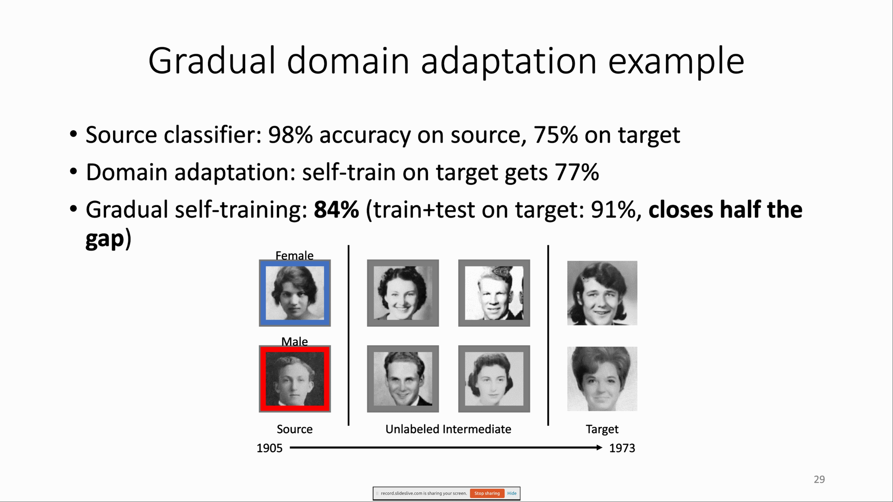 `slide 067` - Gradual domain adaptation example: train plus test on target
- 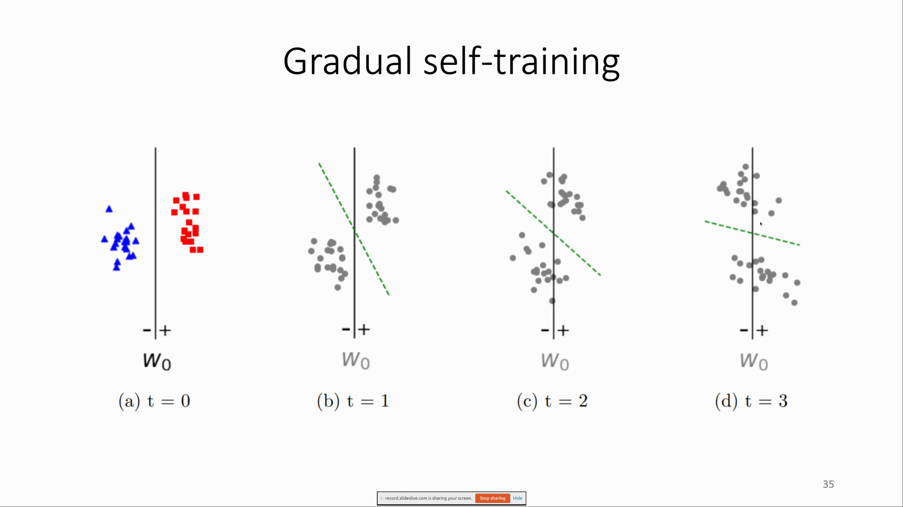 `slide 072` - Gradual self-training traces the decision boundary across domains
- 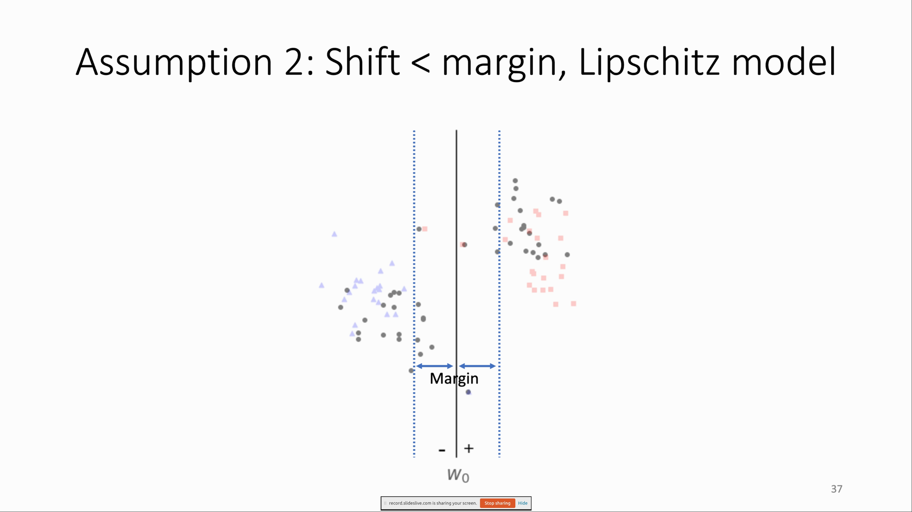 `slide 074` - Assumption: shift smaller than margin under Lipschitz model
-  `slide 079` - Source classifier becomes stale as the domain path moves
- 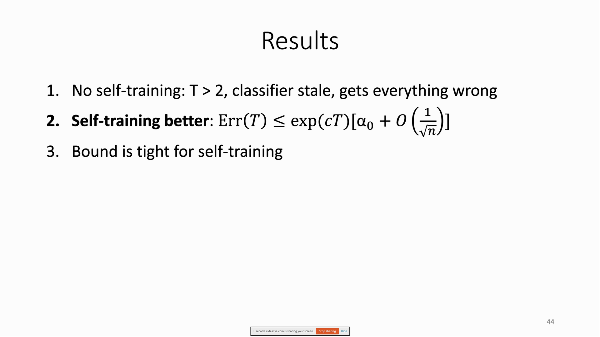 `slide 081` - Theory results for gradual self-training
- 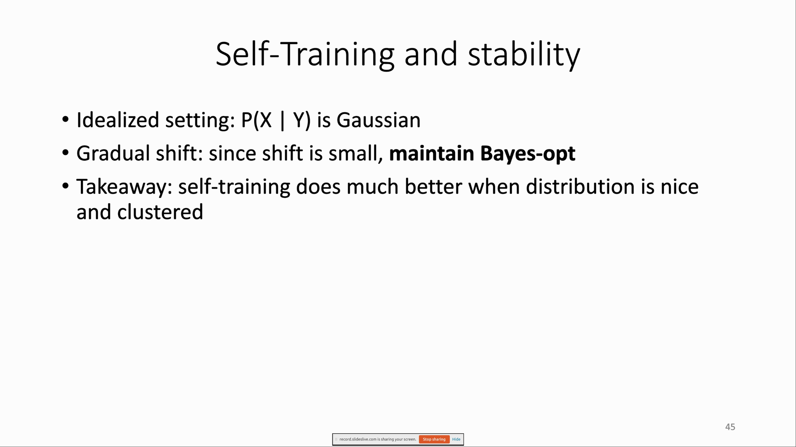 `slide 084` - Self-training and stability summary
-  `slide 085` - Gradual self-training empirical results
-  `slide 088` - Essential ingredients: regularization, hard pseudolabels, experiments
- 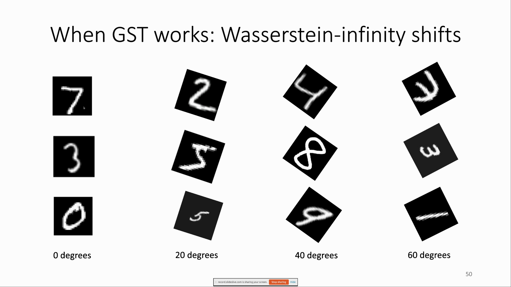 `slide 089` - When GST works: Wasserstein-infinity shifts
-  `slide 090` - When GST does not work: KL shifts
-  `slide 093` - Final remarks: domain adaptation needs structure
