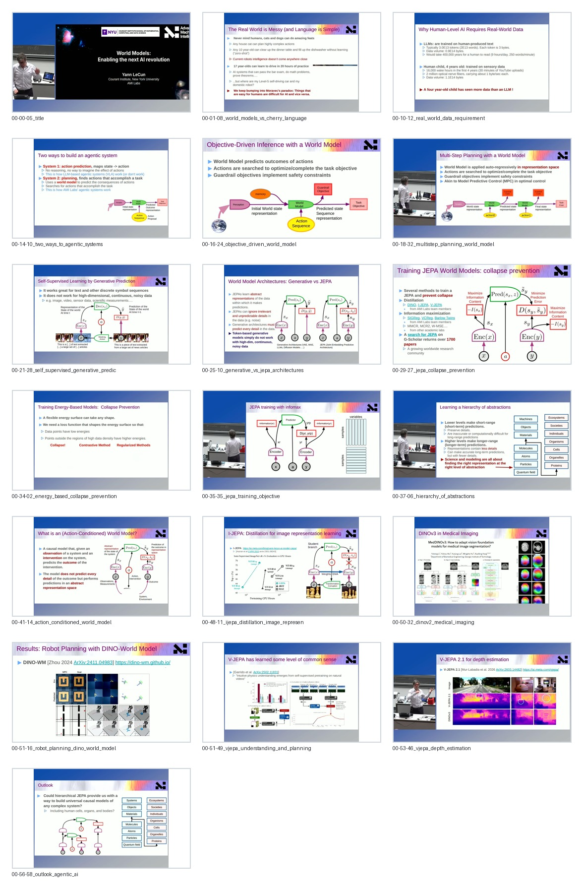

# Curated Slides: Yann LeCun: World Models: Enabling the next AI revolution

- Canonical visual set for note writing.
- Curated frame count: `19`
- Contact sheet: [contact_sheet.jpg](contact_sheet.jpg)

## Frames

1. `00-00-05_title.jpg` @ `00:00:05`
   - Opening title: world models as the route to the next AI revolution.
2. `00-01-08_world_models_vs_cherry_language.jpg` @ `00:01:08`
   - Frames the talk against the idea that language-only prediction is sufficient for intelligence.
3. `00-10-12_real_world_data_requirement.jpg` @ `00:10:12`
   - Human-level AI needs real-world sensory data, not only human-produced text.
4. `00-14-10_two_ways_to_agentic_systems.jpg` @ `00:14:10`
   - Contrasts reactive systems with systems using internal world models and planning.
5. `00-16-24_objective_driven_world_model.jpg` @ `00:16:24`
   - Objective-driven inference uses a world model to predict action consequences.
6. `00-18-32_multistep_planning_world_model.jpg` @ `00:18:32`
   - Multi-step planning rolls out a world model over action sequences.
7. `00-21-28_self_supervised_generative_prediction.jpg` @ `00:21:28`
   - Generative prediction is introduced as one route to self-supervised learning.
8. `00-25-10_generative_vs_jepa_architectures.jpg` @ `00:25:10`
   - Compares generative world-model architectures with JEPA-style latent prediction.
9. `00-29-27_jepa_collapse_prevention.jpg` @ `00:29:27`
   - JEPA training requires mechanisms that prevent representation collapse.
10. `00-34-02_energy_based_collapse_prevention.jpg` @ `00:34:02`
   - Energy-based models are presented as another way to avoid collapse.
11. `00-35-35_jepa_training_objective.jpg` @ `00:35:35`
   - JEPA training with an objective connects latent prediction and representation constraints.
12. `00-37-06_hierarchy_of_abstractions.jpg` @ `00:37:06`
   - World models should learn hierarchical abstractions across physical and semantic levels.
13. `00-41-14_action_conditioned_world_model.jpg` @ `00:41:14`
   - Action-conditioned world models introduce control into latent prediction.
14. `00-48-11_ijepa_distillation_image_representations.jpg` @ `00:48:11`
   - I-JEPA distillation shows image representation learning without pixel reconstruction.
15. `00-50-32_dinov2_medical_imaging.jpg` @ `00:50:32`
   - DINOv2 representation transfer appears in medical imaging examples.
16. `00-51-16_robot_planning_dino_world_model.jpg` @ `00:51:16`
   - Robot planning with DINO-world model links representation learning to action.
17. `00-51-49_vjepa_understanding_and_planning.jpg` @ `00:51:49`
   - V-JEPA is positioned as video understanding and planning.
18. `00-53-46_vjepa_depth_estimation.jpg` @ `00:53:46`
   - V-JEPA 2.1 examples show physical scene understanding through depth.
19. `00-56-58_outlook_agentic_ai.jpg` @ `00:56:58`
   - Outlook slide summarizes the move toward agentic AI with world models.

