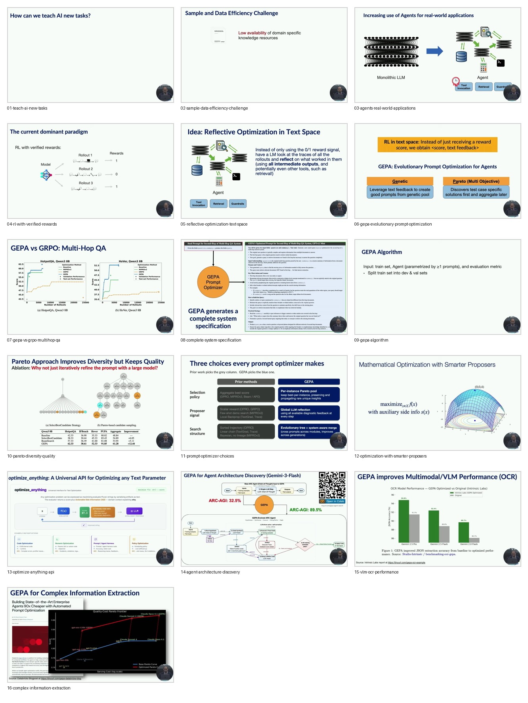

# Curated Slides: GEPA

- Source video: https://www.youtube.com/watch?v=HbGah-uP1fI
- Raw slide directory: `youtube/slides/HbGah-uP1fI-gepa-reflective-prompt-evolution-can-outperform-reinforcement-learning`
- Curated frame count: `16`

## Frames

- `01-teach-ai-new-tasks.jpg`: central problem, teaching AI new tasks.
- `02-sample-data-efficiency-challenge.jpg`: domain-specific data scarcity.
- `03-agents-real-world-applications.jpg`: agents with tools and long-running workflows.
- `04-rl-with-verified-rewards.jpg`: verified-reward RL as the dominant baseline.
- `05-reflective-optimization-text-space.jpg`: using rollout traces and textual reflection.
- `06-gepa-evolutionary-prompt-optimization.jpg`: GEPA as genetic and Pareto prompt optimization.
- `07-gepa-vs-grpo-multihop-qa.jpg`: sample-efficiency comparison with GRPO.
- `08-complete-system-specification.jpg`: prompts as full system specifications.
- `09-gepa-algorithm.jpg`: algorithm input and train/dev/val split.
- `10-pareto-diversity-quality.jpg`: Pareto candidate pool and diversity-quality trade-off.
- `11-prompt-optimizer-choices.jpg`: GEPA design choices versus prior optimizers.
- `12-optimization-with-smarter-proposers.jpg`: LLMs as smart proposers for optimization.
- `13-optimize-anything-api.jpg`: generic text-parameter optimization interface.
- `14-agent-architecture-discovery.jpg`: agent architecture discovery example.
- `15-vlm-ocr-performance.jpg`: multimodal/VLM OCR performance example.
- `16-complex-information-extraction.jpg`: complex information extraction example.

