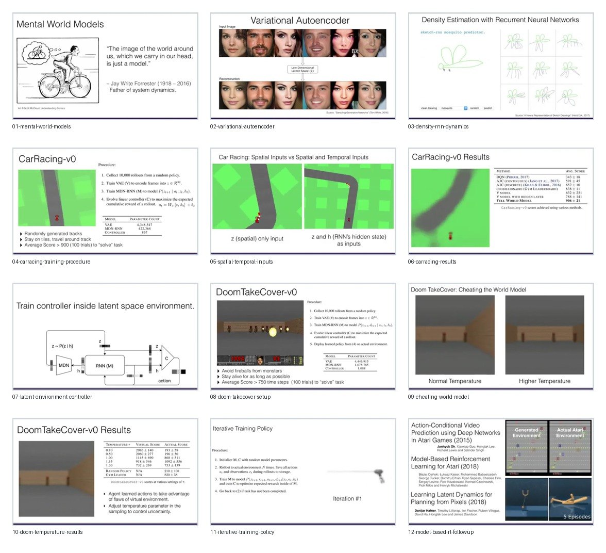

# Curated Slides: Recurrent World Models Facilitate Policy Evolution

- Source video: https://youtu.be/HzA8LRqhujk
- Speaker: David Ha
- Event: NeurIPS 2018 Oral
- Strategy: semantic re-extraction from the WSA video source. The previous curated set contained transition and overlay frames, so it was replaced by this canonical set.
- Curated frame count: `12`

## Contact Sheet

## Frames

- `01-mental-world-models.jpg` @ `00:00:20`: mental/world model framing.
- `02-variational-autoencoder.jpg` @ `00:00:50`: VAE as visual compression module.
- `03-density-rnn-dynamics.jpg` @ `00:01:10`: recurrent density model for latent dynamics.
- `04-carracing-training-procedure.jpg` @ `00:02:40`: CarRacing setup and training procedure.
- `05-spatial-temporal-inputs.jpg` @ `00:04:30`: spatial-only versus spatial-plus-temporal controller inputs.
- `06-carracing-results.jpg` @ `00:05:10`: CarRacing result table.
- `07-latent-environment-controller.jpg` @ `00:06:50`: training the controller inside the latent environment.
- `08-doom-takecover-setup.jpg` @ `00:07:00`: Doom TakeCover setup and procedure.
- `09-cheating-world-model.jpg` @ `00:07:50`: model exploitation under a learned world model.
- `10-doom-temperature-results.jpg` @ `00:09:10`: temperature controls uncertainty and transfer.
- `11-iterative-training-policy.jpg` @ `00:09:50`: iterative policy/model improvement loop.
- `12-model-based-rl-followup.jpg` @ `00:11:20`: follow-up model-based RL directions.
