# Curated Slides: Recurrent World Models Facilitate Policy Evolution

- Source video: https://youtu.be/HzA8LRqhujk
- Speaker: David Ha
- Event: NeurIPS 2018 Oral
- Curated frame count: `12`

## Contact Sheet

## Frames

### 01. `00:00:27`

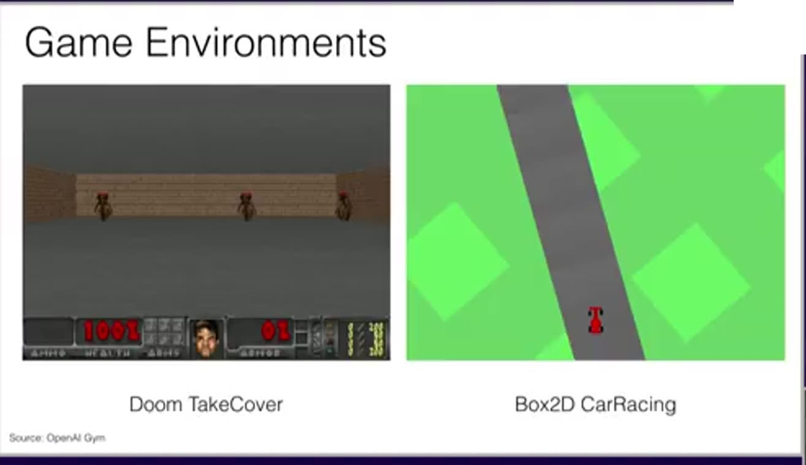

### 02. `00:00:42`

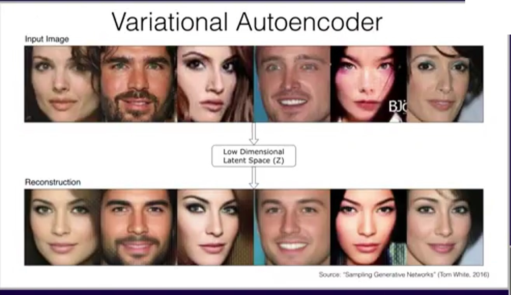

### 03. `00:00:56`

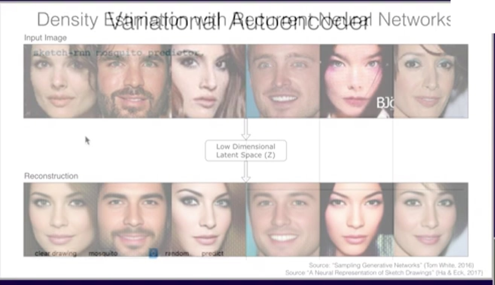

### 04. `00:04:15`

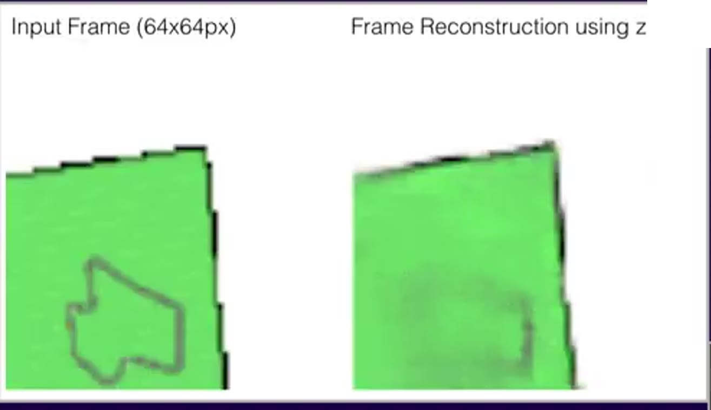

### 05. `00:04:29`

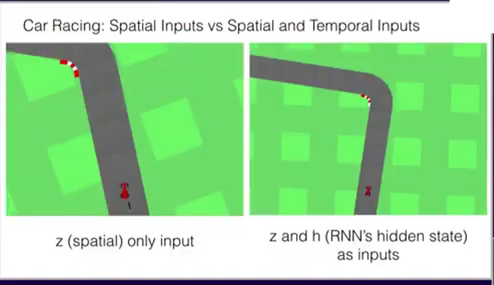

### 06. `00:05:06`

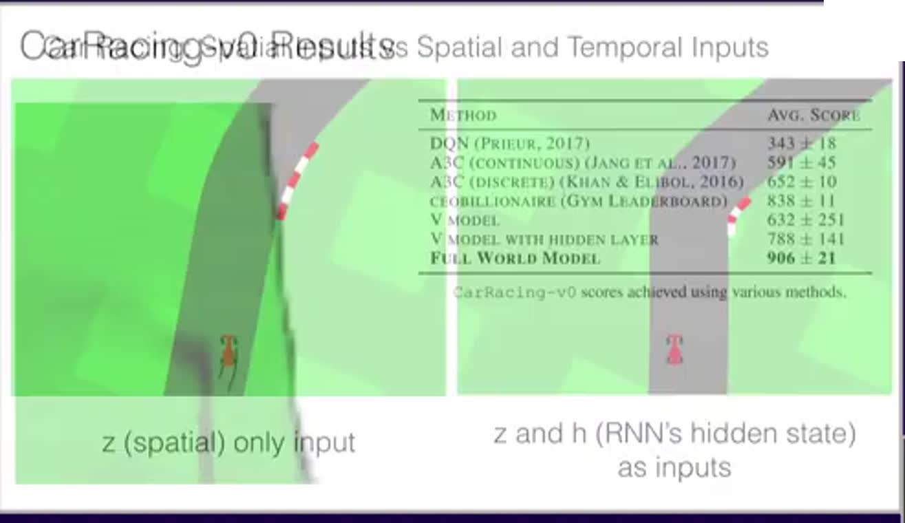

### 07. `00:06:53`

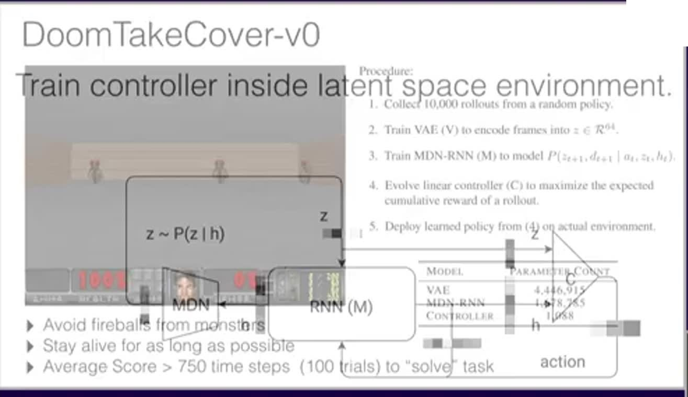

### 08. `00:07:48`

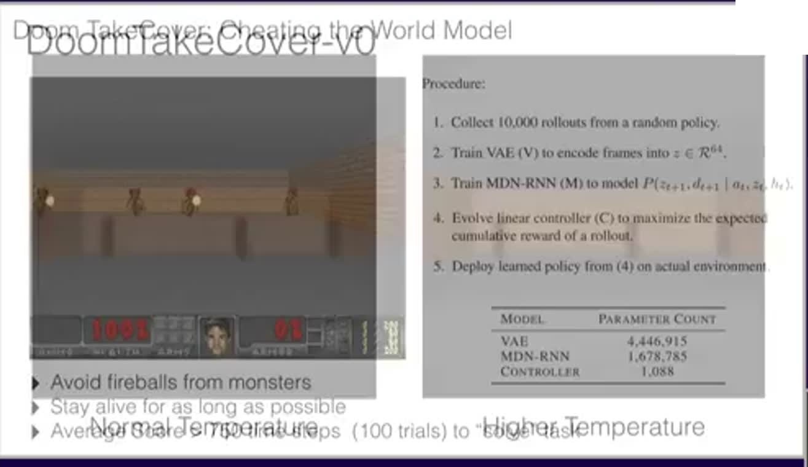

### 09. `00:09:06`

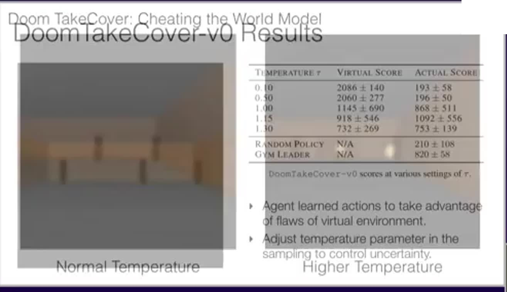

### 10. `00:09:48`

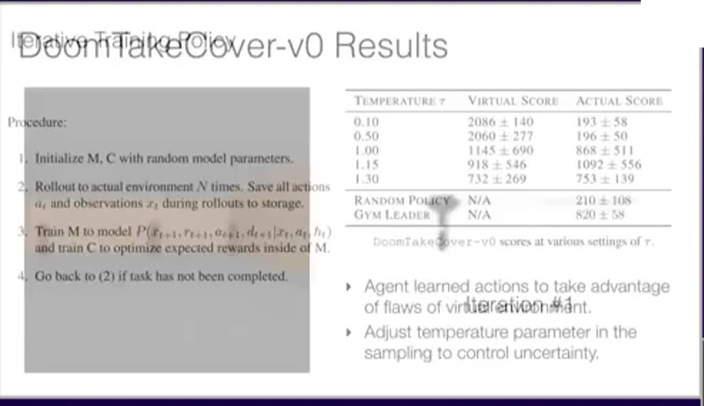

### 11. `00:11:18`

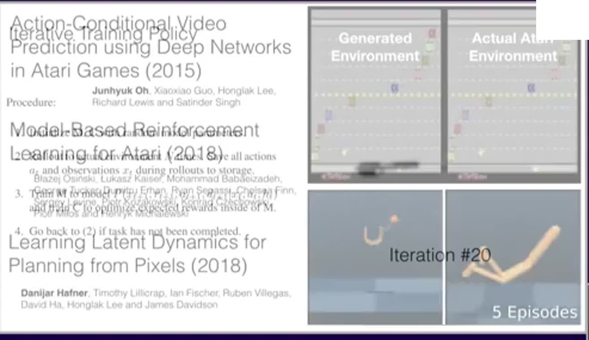

### 12. `00:12:37`

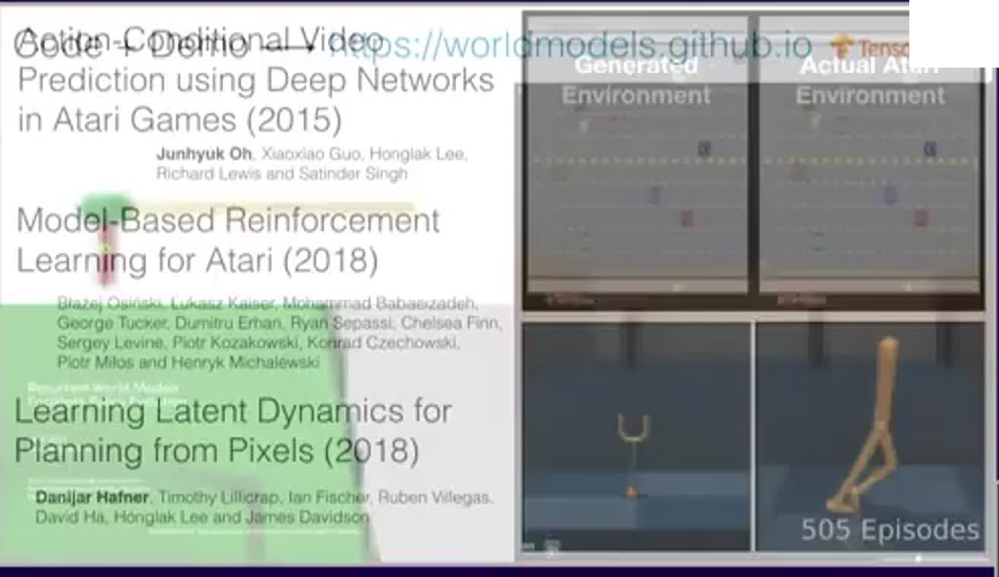
