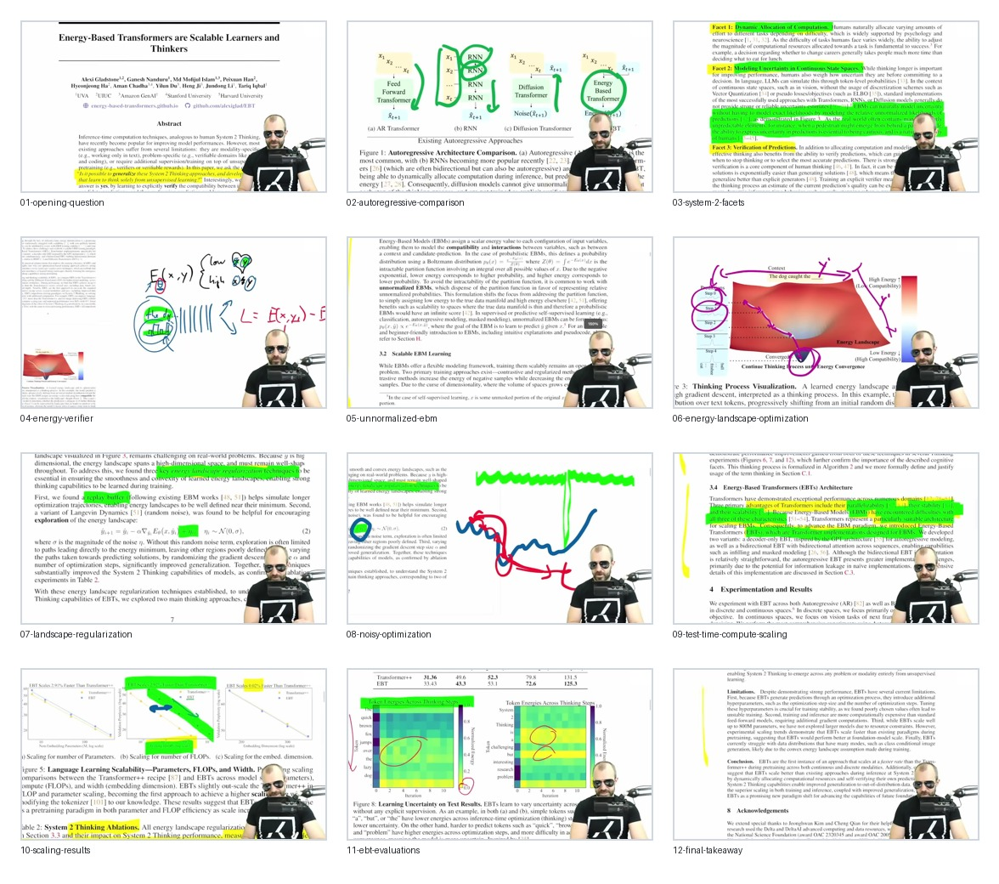

# Curated Slides: Energy-Based Transformers are Scalable Learners and Thinkers

- Source video: https://www.youtube.com/watch?v=RAEy3JZmIaA
- Source frame index: [../index.md](../index.md)
- Strategy: semantic selection aligned with the note structure. These frames replace direct root-frame references with a canonical `curated/` package.
- Curated slide count: `12`

## Frames

- `01-opening-question.jpg` @ `00:01:17`: opening question about unsupervised System 2 thinking.
- `02-autoregressive-comparison.jpg` @ `00:08:25`: architecture comparison between autoregressive, diffusion, and EBT-style inference.
- `03-system-2-facets.jpg` @ `00:12:41`: three facets of System 2 thinking.
- `04-energy-verifier.jpg` @ `00:21:21`: energy function as compatibility verifier.
- `05-unnormalized-ebm.jpg` @ `00:27:46`: EBM probability form and normalization issue.
- `06-energy-landscape-optimization.jpg` @ `00:26:00`: thinking as optimization on an energy landscape.
- `07-landscape-regularization.jpg` @ `00:29:37`: trainable energy landscape requirements.
- `08-noisy-optimization.jpg` @ `00:33:58`: noisy optimization and trajectory broadening.
- `09-test-time-compute-scaling.jpg` @ `00:38:08`: test-time compute scaling.
- `10-scaling-results.jpg` @ `00:41:16`: scaling and evaluation results.
- `11-ebt-evaluations.jpg` @ `00:44:49`: downstream evaluation summary.
- `12-final-takeaway.jpg` @ `00:47:19`: final claim and takeaway.

## Contact Sheet

