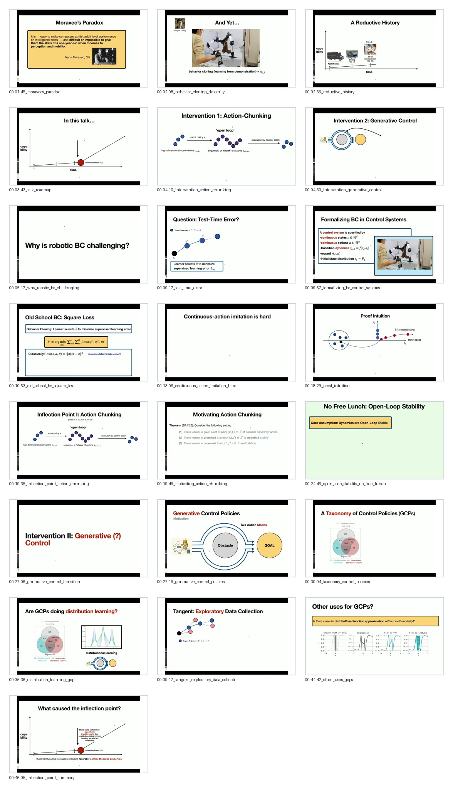

# Curated Slides: RI Seminar: Max Simchowitz: Generative Control, Action Chunking, and Moravec Paradox

- Canonical visual set for note writing.
- Curated frame count: `22`
- Contact sheet: [contact_sheet.jpg](contact_sheet.jpg)

## Frames

1. `00-01-45_moravecs_paradox.jpg` @ `00:01:45`
   - Moravec paradox frames why easy-looking robotic behavior is hard.
2. `00-02-08_behavior_cloning_dexterity.jpg` @ `00:02:08`
   - Dexterous behavior cloning supplies the empirical motivation.
3. `00-02-36_reductive_history.jpg` @ `00:02:36`
   - A reductive history locates the inflection point in robotics progress.
4. `00-03-43_talk_roadmap.jpg` @ `00:03:43`
   - The talk roadmap separates action chunking from generative control.
5. `00-04-10_intervention_action_chunking.jpg` @ `00:04:10`
   - Action chunking is introduced as the first intervention.
6. `00-04-30_intervention_generative_control.jpg` @ `00:04:30`
   - Generative control is introduced as the second intervention.
7. `00-05-17_why_robotic_bc_challenging.jpg` @ `00:05:17`
   - Behavior cloning in robotics is posed as the central difficulty.
8. `00-09-17_test_time_error.jpg` @ `00:08:24`
   - Test-time error is the key quantity that supervised learning does not directly control.
9. `00-09-57_formalizing_bc_control_systems.jpg` @ `00:09:57`
   - Behavior cloning is formalized as a control-system problem.
10. `00-10-53_old_school_bc_square_loss.jpg` @ `00:10:53`
   - Old-school BC via square loss provides the baseline.
11. `00-13-06_continuous_action_imitation_hard.jpg` @ `00:13:06`
   - Continuous-action imitation is separated from the discrete curse-of-horizon story.
12. `00-18-29_proof_intuition.jpg` @ `00:18:29`
   - The proof intuition shows how small deviations can compound in control.
13. `00-19-35_inflection_point_action_chunking.jpg` @ `00:19:35`
   - Action chunking is tied to the observed inflection point.
14. `00-19-49_motivating_action_chunking.jpg` @ `00:19:49`
   - The action-chunking theorem gives a positive route under stability assumptions.
15. `00-24-46_open_loop_stability_no_free_lunch.jpg` @ `00:24:46`
   - Open-loop stability is not free; dynamics assumptions matter.
16. `00-27-06_generative_control_transition.jpg` @ `00:27:06`
   - The talk transitions from action chunking to generative control.
17. `00-27-19_generative_control_policies.jpg` @ `00:27:19`
   - Generative control policies represent multimodal action choices.
18. `00-30-04_taxonomy_control_policies.jpg` @ `00:30:04`
   - A taxonomy clarifies where GCPs sit among control-policy classes.
19. `00-35-36_distribution_learning_gcp.jpg` @ `00:35:36`
   - GCPs are interpreted through distribution learning.
20. `00-39-17_tangent_exploratory_data_collection.jpg` @ `00:39:17`
   - Exploratory data collection links imitation learning to coverage.
21. `00-44-42_other_uses_gcps.jpg` @ `00:44:42`
   - Other GCP uses show the abstraction beyond the initial robotics example.
22. `00-46-05_inflection_point_summary.jpg` @ `00:46:05`
   - The inflection point summary reconnects the theory to robotic progress.

