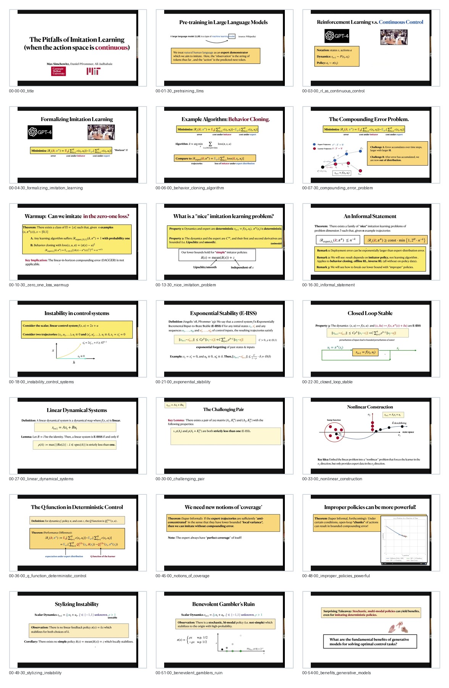

# Curated Slides: Max Simchowitz: The Pitfalls of Imitation Learning when Actions are Continuous

- Canonical visual set for note writing.
- Curated frame count: `21`
- Contact sheet: [contact_sheet.jpg](contact_sheet.jpg)

## Frames

1. `00-00-00_title.jpg` @ `00:00:00`
   - Opening title for the continuous-action imitation learning talk.
2. `00-01-30_pretraining_llms.jpg` @ `00:01:30`
   - Large language model pretraining is used as the contrast case.
3. `00-03-00_rl_as_continuous_control.jpg` @ `00:03:00`
   - Reinforcement learning is reframed as continuous control.
4. `00-04-30_formalizing_imitation_learning.jpg` @ `00:04:30`
   - The talk formalizes imitation learning with expert demonstrations.
5. `00-06-00_behavior_cloning_algorithm.jpg` @ `00:06:00`
   - Behavior cloning is the simple supervised-learning baseline.
6. `00-07-30_compounding_error_problem.jpg` @ `00:07:30`
   - Compounding error explains why train/test mismatch matters.
7. `00-10-30_zero_one_loss_warmup.jpg` @ `00:10:30`
   - A warmup asks whether zero-one loss can be imitated.
8. `00-13-30_nice_imitation_problem.jpg` @ `00:13:30`
   - A nice imitation problem isolates learnability assumptions.
9. `00-16-30_informal_statement.jpg` @ `00:16:30`
   - An informal theorem statement gives the main lower-bound shape.
10. `00-18-00_instability_control_systems.jpg` @ `00:18:00`
   - Instability in control systems is the key obstruction.
11. `00-21-00_exponential_stability.jpg` @ `00:21:00`
   - Exponential stability gives the positive closed-loop condition.
12. `00-22-30_closed_loop_stable.jpg` @ `00:22:30`
   - Closed-loop stability is contrasted with unstable open-loop behavior.
13. `00-27-00_linear_dynamical_systems.jpg` @ `00:27:00`
   - Linear dynamical systems provide the technical sandbox.
14. `00-30-00_challenging_pair.jpg` @ `00:30:00`
   - The challenging pair construction drives the lower bound.
15. `00-33-00_nonlinear_construction.jpg` @ `00:33:00`
   - A nonlinear construction shows why smoothness alone is insufficient.
16. `00-36-00_q_function_deterministic_control.jpg` @ `00:36:00`
   - The Q-function view connects deterministic control to the imitation barrier.
17. `00-45-00_notions_of_coverage.jpg` @ `00:45:00`
   - The talk introduces coverage notions needed for continuous policies.
18. `00-48-00_improper_policies_powerful.jpg` @ `00:48:00`
   - Improper policies can be more powerful than the nominal policy class.
19. `00-49-30_stylizing_instability.jpg` @ `00:49:30`
   - Stylized instability exposes the mechanism behind the negative result.
20. `00-51-00_benevolent_gamblers_ruin.jpg` @ `00:51:00`
   - Benevolent gambler ruin gives an intuitive probabilistic construction.
21. `00-54-00_benefits_generative_models.jpg` @ `00:54:00`
   - The talk closes by asking what generative models buy for solving contact tasks.

