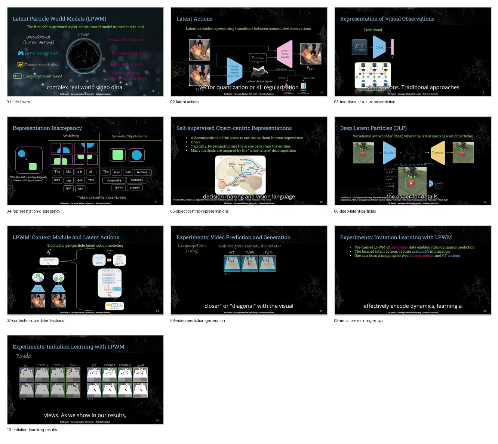

# Curated Slides: Latent Particle World Models

- Source video: https://www.youtube.com/watch?v=aZeaCyXJjYI
- Raw slide directory: `youtube/slides/aZeaCyXJjYI-iclr-2026-oral-latent-particle-world-models`
- Curated frame count: `10`

## Frames

- `01-title-lpwm.jpg`: problem frame, LPWM as self-supervised object-centric world model.
- `02-latent-actions.jpg`: latent actions as transition variables between observations.
- `03-traditional-visual-representation.jpg`: conventional single-vector visual compression.
- `04-representation-discrepancy.jpg`: patch/token representation versus semantic object-centric representation.
- `05-object-centric-representations.jpg`: motivation for self-supervised object decomposition.
- `06-deep-latent-particles.jpg`: DLP as a VAE whose latent state is a set of particles.
- `07-context-module-latent-actions.jpg`: LPWM context module and per-particle latent action modeling.
- `08-video-prediction-generation.jpg`: video prediction and generation experiments.
- `09-imitation-learning-setup.jpg`: using LPWM latent actions for imitation learning.
- `10-imitation-learning-results.jpg`: multi-object manipulation result frame.

