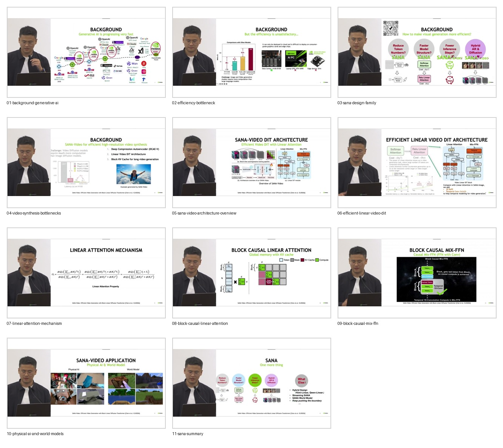

# Curated Slides: SANA-Video

- Source video: https://www.youtube.com/watch?v=bHHL691_IPo
- Raw slide directory: `youtube/slides/bHHL691_IPo-sana-video-efficient-video-generation-with-block-linear-diffusion-transformer`
- Curated frame count: `11`

## Frames

- `01-background-generative-ai.jpg`: rapid growth of visual generative AI.
- `02-efficiency-bottleneck.jpg`: image/video generation is computationally expensive.
- `03-sana-design-family.jpg`: SANA design axes for efficiency.
- `04-video-synthesis-bottlenecks.jpg`: video-specific bottlenecks and technical targets.
- `05-sana-video-architecture-overview.jpg`: overall SANA-Video DiT architecture.
- `06-efficient-linear-video-dit.jpg`: linear video DiT and temporal modules.
- `07-linear-attention-mechanism.jpg`: linear attention formula and motivation.
- `08-block-causal-linear-attention.jpg`: block causal linear attention and KV cache.
- `09-block-causal-mix-ffn.jpg`: causal Mix-FFN for temporal modeling.
- `10-physical-ai-and-world-models.jpg`: downstream applications in physical AI and world models.
- `11-sana-summary.jpg`: final SANA family summary.

