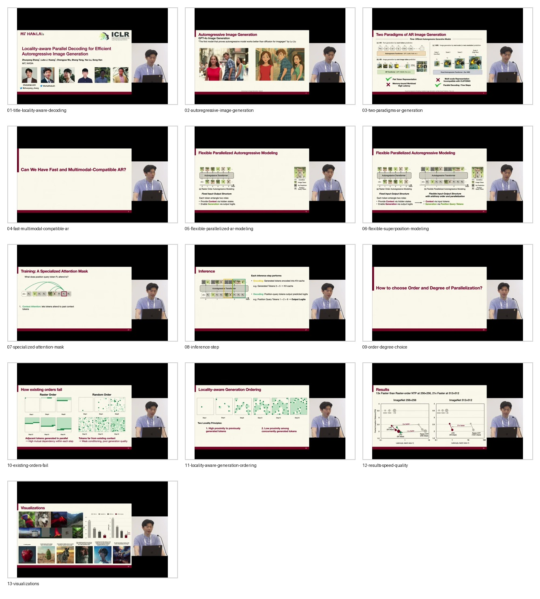

# Curated Slides: Locality-Aware Parallel Decoding

- Source video: https://www.youtube.com/watch?v=cPeGBXXHxZM
- Raw slide directory: `youtube/slides/cPeGBXXHxZM-locality-aware-parallel-decoding-for-efficient-autoregressive-image-generation`
- Curated frame count: `13`

## Frames

- `01-title-locality-aware-decoding.jpg`: title and author frame.
- `02-autoregressive-image-generation.jpg`: autoregressive image generation context.
- `03-two-paradigms-ar-generation.jpg`: flat-token versus next-scale autoregressive generation.
- `04-fast-multimodal-compatible-ar.jpg`: target question, speed plus multimodal compatibility.
- `05-flexible-parallelized-ar-modeling.jpg`: separating context and generation roles.
- `06-flexible-superposition-modeling.jpg`: flexible input-output structure for parallel tokens.
- `07-specialized-attention-mask.jpg`: training with specialized attention mask.
- `08-inference-step.jpg`: fused encoding and decoding during inference.
- `09-order-degree-choice.jpg`: choosing order and degree of parallelization.
- `10-existing-orders-fail.jpg`: why raster and random orders fail.
- `11-locality-aware-generation-ordering.jpg`: two locality principles.
- `12-results-speed-quality.jpg`: speed-quality results.
- `13-visualizations.jpg`: generated examples and efficiency summary.

