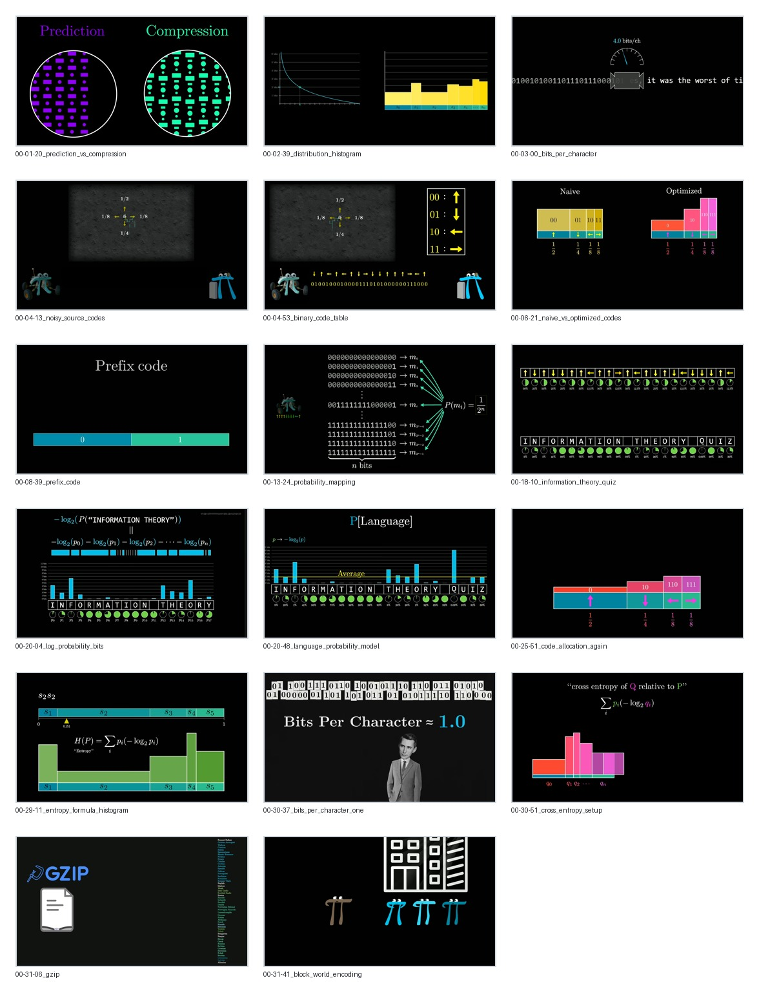

# Curated Slides: Reinventing Entropy | Compression is Intelligence Part 1

- Canonical visual set for note writing.
- Curated frame count: `17`
- Contact sheet: [contact_sheet.jpg](contact_sheet.jpg)

## Frames

1. `00-01-20_prediction_vs_compression.jpg` @ `00:01:20`
   - The video starts from the equivalence between prediction and compression.
2. `00-02-39_distribution_histogram.jpg` @ `00:02:39`
   - Probability distributions enter as the object being encoded.
3. `00-03-00_bits_per_character.jpg` @ `00:03:00`
   - Bits per character makes compression cost measurable.
4. `00-04-13_noisy_source_codes.jpg` @ `00:04:13`
   - A noisy source motivates why some messages deserve shorter codes.
5. `00-04-53_binary_code_table.jpg` @ `00:04:53`
   - Binary code choices become the concrete representation of compression.
6. `00-06-21_naive_vs_optimized_codes.jpg` @ `00:06:21`
   - Optimized codes allocate short strings to common events.
7. `00-08-39_prefix_code.jpg` @ `00:08:39`
   - Prefix codes avoid ambiguous decoding.
8. `00-13-24_probability_mapping.jpg` @ `00:13:24`
   - The mapping from messages to probabilities sets up information content.
9. `00-18-10_information_theory_quiz.jpg` @ `00:18:10`
   - A language quiz gives a concrete sequence to compress.
10. `00-20-04_log_probability_bits.jpg` @ `00:20:04`
   - Information content appears as accumulated negative log probability.
11. `00-20-48_language_probability_model.jpg` @ `00:20:48`
   - A language model supplies probabilities for better coding.
12. `00-25-51_code_allocation_again.jpg` @ `00:25:51`
   - Code allocation is revisited with a more explicit optimized layout.
13. `00-29-11_entropy_formula_histogram.jpg` @ `00:29:11`
   - Entropy is visualized as the expected number of bits under a distribution.
14. `00-30-37_bits_per_character_one.jpg` @ `00:30:37`
   - The example reaches a concrete one-bit-per-character compression rate.
15. `00-30-51_cross_entropy_setup.jpg` @ `00:30:51`
   - Cross entropy measures mismatch between the assumed and true distributions.
16. `00-31-06_gzip.jpg` @ `00:31:06`
   - Practical compression systems such as gzip close the conceptual loop.
17. `00-31-41_block_world_encoding.jpg` @ `00:31:41`
   - Final visual returns to structured encoding as a model of intelligence.

