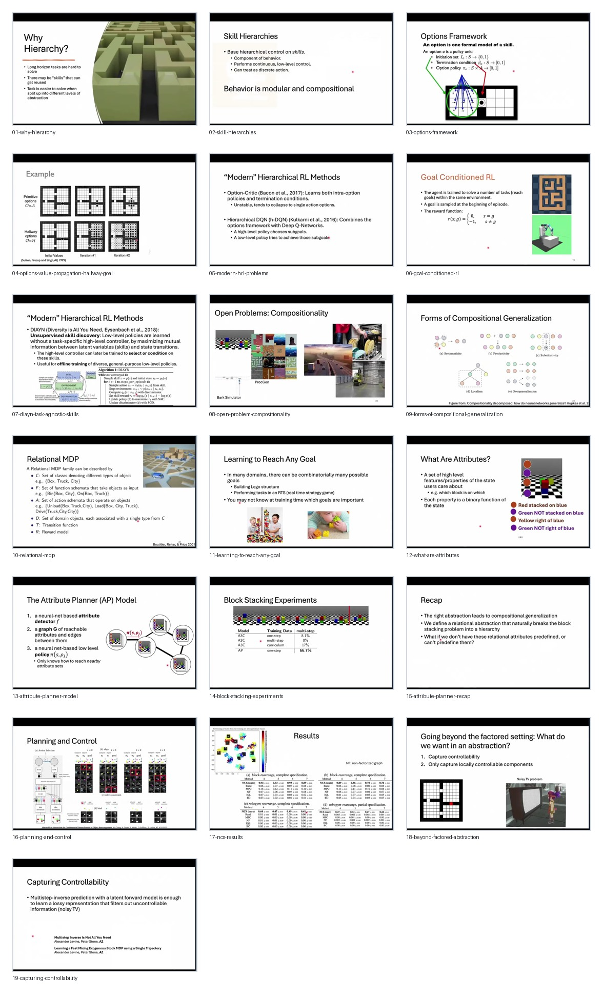

# Curated Slides: Amy Zhang | Representations for Hierarchical Reinforcement Learning

- Source video: `https://www.youtube.com/watch?v=nyXXX3fIzMw`
- Raw slide directory: `../`
- Curated frame count: `19`

## Frames

- `01-why-hierarchy.jpg` @ `00:09:45`
- `02-skill-hierarchies.jpg` @ `00:13:24`
- `03-options-framework.jpg` @ `00:18:25`
- `04-options-value-propagation-hallway-goal.jpg` @ `00:20:45`
- `05-modern-hrl-problems.jpg` @ `00:24:52`
- `06-goal-conditioned-rl.jpg` @ `00:27:42`
- `07-diayn-task-agnostic-skills.jpg` @ `00:29:39`
- `08-open-problem-compositionality.jpg` @ `00:34:26`
- `09-forms-of-compositional-generalization.jpg` @ `00:34:51`
- `10-relational-mdp.jpg` @ `00:36:32`
- `11-learning-to-reach-any-goal.jpg` @ `00:38:36`
- `12-what-are-attributes.jpg` @ `00:40:30`
- `13-attribute-planner-model.jpg` @ `00:41:18`
- `14-block-stacking-experiments.jpg` @ `00:45:01`
- `15-attribute-planner-recap.jpg` @ `00:48:44`
- `16-planning-and-control.jpg` @ `00:55:26`
- `17-ncs-results.jpg` @ `00:56:12`
- `18-beyond-factored-abstraction.jpg` @ `01:02:25`
- `19-capturing-controllability.jpg` @ `01:02:32`

## Contact Sheet

